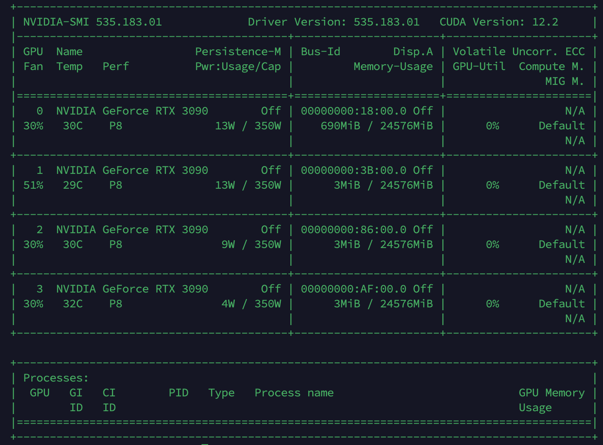

# 0.2 NVIDIA 驱动的安装

> [!IMPORTANT]
> 没有正确安装驱动，你的显卡就只是一个“昂贵的摆设”。对于自动驾驶和深度学习开发者来说，显卡驱动是整个环境的“地基”。

## 🌟 显卡驱动的作用：为什么要安装它？

在 Linux 系统中，显卡驱动（NVIDIA Driver）扮演着至关重要的角色：

1.  **硬件沟通的桥梁**：操作系统和应用程序无法直接控制复杂的显卡硬件。驱动程序就像一个“翻译官”，将软件指令转化为显卡能理解的电子信号。
2.  **解锁算力核心 (CUDA)**：如果你要进行深度学习（如运行 PyTorch 或 TensorFlow），驱动程序是开启 **CUDA (Compute Unified Architecture)** 的钥匙。没有它，GPU 的数千个核心将处于闲置状态，无法进行加速计算。
3.  **图形渲染支持**：在自动驾驶仿真（如 CARLA, Gazebo）中，高质量的实时画面渲染完全依赖于驱动程序对显卡性能的调度。
4.  **系统稳定性**：安装版本匹配的驱动能有效避免系统黑屏、循环登录或显示异常等常见问题。

---

## 🔍 1. 检查显卡型号

在安装前，首先确认你的机器上确实存在 NVIDIA 显卡：

```bash
# 查看显卡信息
lspci | grep -i nvidia
```

---

## 🛠️ 2. 安装驱动的两种方式

这两种方式仅作为理论介绍，**实际上你做下去大概率会把系统搞黑屏，且花费你大量的时间**。

在全网众多的Nvidia驱动安装教程中，我选出了个人认为最为有效的一种方案，大家直接按照下面链接中的教程步骤来 **（请仔细阅读）** ：

-[ubuntu安装Nvidia驱动，解决开机黑屏问题](https://blog.csdn.net/m0_63252914/article/details/134400519?spm=1001.2014.3001.5506)

<div align="center">
  
</div>

### 方式一：使用系统自带工具

Ubuntu 会自动筛选与你系统最匹配的稳定版本。

1.  打开 **Software & Updates** (软件和更新)。
2.  切换到 **Additional Drivers** (附加驱动) 选项卡。
3.  稍等片刻，选择标记为 `(recommended)` 的版本（通常是版本号最高的那个）。
4.  点击 **Apply Changes**，安装完成后**务必重启电脑**。

### 方式二：命令行自动化安装

如果你更喜欢终端操作，可以使用以下命令：

```bash
# 查询推荐驱动版本
ubuntu-drivers devices

# 自动安装推荐版本
sudo ubuntu-drivers autoinstall

# 安装完成后重启
sudo reboot
```

---

## ✅ 3. 验证安装

重启进入系统后，打开终端输入：

```bash
nvidia-smi
```

> [!TIP]
> 如果你看到一个整齐的表格，显示了显卡型号、显存占用、驱动版本号等信息，恭喜你，显卡已经成功“激活”！
>
> <div align="center">
>  
> </div>

---

## ⚠️ 4. 常见问题：循环登录/黑屏

如果你在安装驱动后遇到了开机黑屏、提示 `clean, files, blocks` 或无法进入桌面的情况，请不要慌张。这通常是驱动冲突或残留导致的。

大家再去看看这篇博客的前部分内容，会有解决方案：-[ubuntu安装Nvidia驱动，解决开机黑屏问题](https://blog.csdn.net/m0_63252914/article/details/134400519?spm=1001.2014.3001.5506)

**快速救援方案：**
