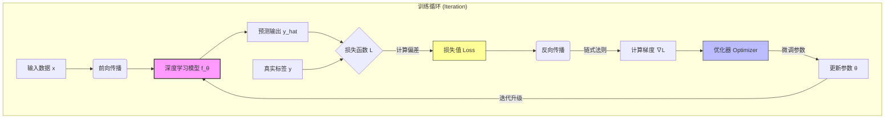

# 1.1.1 神经网络核心概念：

在深入学习神经网络前，我们需要建立从宏观哲学到微观数学的全面认知。

> [!TIP]
>
> ### 🌟 必读推荐：深度学习“神作”
>
> 在开启深度学习之旅前，强烈推荐参考开源神作：**[《动手学深度学习》(Dive into Deep Learning)](https://zh-v2.d2l.ai/index.html)**。
>
> 这本书由亚马逊首席科学家**李沐 (Mu Li)** 等人撰写，是目前公认的理论与实践完美结合的教材：
>
> - **动手实践**：每一章都配有可运行的 Jupyter Notebook 代码（支持 PyTorch/TensorFlow/JAX）。
> - **通俗易懂**：复杂的数学公式都会配合直观的代码实现，非常适合从零开始的开发者。
> - **配套视频**：B站有李沐老师详尽的视频讲解，是深度学习入门的“金标准”。
>
> 关于本章节中涉及的全部核心算法与数学细节，你都可以在这本神作中找到最权威的解读。

---

## 1. 机器学习与深度学习的演进

深度学习并非横空出世，它是机器学习在算力与数据大爆发时代的自然进化。

### 1.1 核心关系与差异


| 维度         | 传统机器学习 (ML)                                      | 深度学习 (DL)                                        |
| :----------- | :----------------------------------------------------- | :--------------------------------------------------- |
| **特征提取** | **人工干预**：依赖专家经验手工设计特征（如 HOG, SIFT） | **自动提取**：通过多层神经网络自动从原始像素学习特征 |
| **数据依赖** | 在小样本数据集上表现较好                               | 极度渴求大数据，性能随数据量持续增长（无饱和点）     |
| **硬件要求** | 低（普通 CPU 即可）                                    | 高（极度依赖 GPU/TPU 的并行计算）                    |
| **解释性**   | 较强（如决策树可追溯逻辑）                             | 较弱（常被视为“黑盒”模型）                           |

### 1.2 特征工程的消亡与端到端学习


---

## 2. 深度强化：要学习哪些机器学习基础？

虽然深度学习是当下的主流，但机器学习的“世界观”——即如何定义问题、评估模型、解决过拟合——是所有 AI 算法通用的底层逻辑。

### 2.1 模型泛化与正则化

| 核心概念              | 定义与数学直觉                                               | 核心影响与解决手段                                                      |
| :-------------------- | :----------------------------------------------------------- | :---------------------------------------------------------------------- |
| **偏差 (Bias)**       | 描述模型预测值的数学期望与真实值之间的差距。                 | **高偏差** 对应 **欠拟合** (Underfitting)，意味着模型无法捕捉数据规律。 |
| **方差 (Variance)**   | 描述模型在不同训练集上的预测值波动程度。                     | **高方差** 对应 **过拟合** (Overfitting)，意味着模型对噪声过度敏感。    |
| **L1 正则化 (Lasso)** | 在损失函数中加入权重绝对值之和：$\lambda \sum w_i$。        | 促使模型权重**稀疏化**，常用于特征选择。                                 |
| **L2 正则化 (Ridge)** | 在损失函数中加入权重平方和：$\frac{\lambda}{2} \sum w_i^2$。 | 限制权重数值大小 (**权重衰减**)，提升模型泛化性能与鲁棒性。             |

### 2.2 数据预处理与评估指标

| 类别         | 核心概念          | 定义/公式                                    | 核心作用                                         |
| :----------- | :---------------- | :------------------------------------------- | :----------------------------------------------- |
| **数据处理** | **归一化 (Norm)** | $x' = \frac{x - x_{min}}{x_{max} - x_{min}}$ | 将数据缩放到 $[0, 1]$，消除量纲影响，加快收敛。  |
|              | **标准化 (Std)**  | $x' = \frac{x - \mu}{\sigma}$                | 使数据均值为 0，标准差为 1，对异常值更具鲁棒性。 |
| **评价指标** | **准确率 (Acc)**  | $\frac{TP+TN}{TP+TN+FP+FN}$                  | 衡量整体预测正确的比例，适用于类别均衡场景。     |
|              | **召回率 (Rec)**  | $\frac{TP}{TP+FN}$                           | 衡量对正样本的捕获能力，防止“漏报”。             |
|              | **精确率 (Pre)**  | $\frac{TP}{TP+FP}$                           | 衡量预测为正样本中真实正样本的比例，防止“误报”。 |

### 2.3 梯度下降要素

| 要素                     | 物理意义                         | 异常表现与影响                                                     |
| :----------------------- | :------------------------------- | :----------------------------------------------------------------- |
| **负梯度 ($-\nabla L$)** | 指明了损失函数值下降最快的方向。 | 梯度消失 (训练停滞) / 梯度爆炸 (权重变为 NaN)。                    |
| **学习率 ($\eta$)**      | 控制参数更新的步长控制。         | **过大**：导致震荡不收敛；**过小**：导致收敛极慢且易陷于局部最优。 |

---

## 3. 神经网络：通用函数逼近器 (Universal Function Approximator)

神经网络通过层次化的非线性变换，实现从输入空间到目标空间的高维映射。其核心在于通过大量参数化算子的组合来拟合复杂的非线性函数。

### 3.1 神经元 (Neuron)：基本计算单元与微观数学

神经元是神经网络的最小逻辑单元，其数学本质是**线性加权求和**与**非线性映射**的复合。

- **微观数学定义**：
  设输入向量为 $\mathbf{x}$，权重向量为 $\mathbf{w}$，偏置为 $b$，则神经元的输出 $a$ 表示为：
  $$ z = \sum w_i x_i + b = \mathbf{w}^T \mathbf{x} + b $$
  $$ a = \sigma(z) $$
- **参数语义**：
  - **权重向量 ($\mathbf{w}$)**：编码了输入特征对输出结果的贡献强度。
  - **偏置 ($b$)**：提供线性变换的平移自由度，允许决策边界脱离原点。
  - **激活映射 ($\sigma$)**：将线性响应投影至非线性空间，赋予网络处理复杂流形数据的能力。

### 3.2 拓扑结构与层级矩阵化 (Topology & Matrix Representation)

网络拓扑决定了计算路径，而矩阵化表示则是实现高效并行计算的基础。

- **连接范式**：
  - **全连接 (Dense)**：实现全局特征的非线性组合，参数量随维度平方增长。
  - **局部连接与权重共享**：通过约束感受野（如 CNN），利用空间局部相关性降低参数复杂度。
- **层级矩阵运算**：
  为了利用 GPU 的并行计算能力，通常将单层神经元的计算表示为矩阵形式。假设输入向量 $\mathbf{X} \in \mathbb{R}^{1 \times d}$，权重矩阵 $\mathbf{W} \in \mathbb{R}^{d \times m}$，偏置 $\mathbf{b} \in \mathbb{R}^{1 \times m}$：
  $$ \mathbf{Y} = \sigma(\mathbf{XW} + \mathbf{b}) $$
  _这种矩阵乘法 (GEMM) 是神经网络计算中开销最大的部分，也是 hardware 加速的核心。_
- **深度与宽度的表征内涵**：
  - **宽度 (Width)**：决定单层特征表征的并行容量。
  - **深度 (Depth)**：通过多层非线性复合实现特征的层次化抽象（从几何特征到语义逻辑）。

### 3.3 非线性激活与逼近原理

非线性激活函数是神经网络超越线性模型的关键，也是实现“万能逼近”的基石。

- **非线性必要性**：根据线性代数性质，多层线性算子的复合仍为线性变换。引入非线性激活是打破线性限制、拟合复杂决策边界的唯一途径。
- **万能逼近定理 (Universal Approximation Theorem)**：定理证明，具有至少一个隐含层且包含非线性激活函数的神经网络，可以以任意精度逼近闭集上的任意连续函数。
- **常见激活函数对比**：

| 函数        | 数学定义                                   | 图像特点                    | 应用场景             |
| :---------- | :----------------------------------------- | :-------------------------- | :------------------- |
| **ReLU**    | $f(x) = \max(0, x)$                        | 计算极快，缓解梯度消失      | 隐藏层首选标准配置   |
| **Sigmoid** | $f(x) = \frac{1}{1 + e^{-x}}$              | 输出范围 (0, 1)，存在饱和区 | 二分类输出层         |
| **Tanh**    | $f(x) = \frac{e^x - e^{-x}}{e^x + e^{-x}}$ | 输出范围 (-1, 1)，零中心化  | 循环神经网络 (RNN)   |
| **GELU**    | $x\Phi(x)$                                 | 平滑性更好，考虑随机性      | Transformer 模型主流 |

---

## 4. 前向与反向传播的数学链条

### 4.1 前向传播 (Forward Propagation)

信息流：输入 $\rightarrow$ 权重 $\rightarrow$ 激活 $\rightarrow$ 损失。

### 4.2 反向传播 (Backward Propagation)

反向传播的数学基石是**复合函数求导的链式法则 (Chain Rule)**。
假设 $L$ 是损失，$z$ 是输出，$w$ 是参数：
$$ \frac{\partial L}{\partial w} = \frac{\partial L}{\partial \hat{y}} \cdot \frac{\partial \hat{y}}{\partial z} \cdot \frac{\partial z}{\partial w} $$

通过这个公式，我们可以 from 输出层开始，逐层计算梯度并传回输入层，从而更新所有权重。

---

## 5. 数据驱动 (Data-Driven) 的深度对峙

### 5.1 规则驱动 (Rule-Based) - 传统方法

```python
# 程序员通过人工逻辑定义规则（如：猫狗分类）
def classify_animal(features):
    if features.has_pointy_ears and features.size == "small":
        return "Cat"
    elif features.barking_sound:
        return "Dog"
    # ... 需要手工覆盖成千上万种特征和异常情况
```

### 5.2 数据驱动 (Data-Driven) - 深度学习

```python
# 系统从海量标注数据中自动学习特征
model = DeepLearningModel()
# 输入：原始图像像素，输出：类别概率
prediction = model(input_image)
# 系统不依赖人工 hardcoded 逻辑，而是通过参数 θ 拟合最优映射
```

---

## 6. 深度学习的三大支柱：模型、损失、优化

深度学习的训练过程本质上是一个**闭环反馈系统**。理解这个范式，需要掌握三个核心组件及其协同工作的方式。

### 6.1 模型 (Model)：智能的载体

模型是一个参数化的复杂函数 $f(x; \theta)$，它定义了从输入到输出的**映射规则**。

- **参数 $\theta$**：包含权重 ($W$) 和偏置 ($b$)。
  - **权重 ($W$)**：决定了输入信号的重要性。在图像处理中，某些神经元可能专门对“横向边缘”或“特定颜色”敏感。
  - **偏置 ($b$)**：决定了激活神经元的难易程度，类似于神经元的“阈值”。
- **架构 (Architecture)**：神经元如何连接（卷积层、循环层、Transformer 等）。架构决定了模型的“智力上限”，即它能拟合多复杂的函数。
- **典型应用场景示例**：
  - **输入 $x$**：原始数据（如图像像素、文本序列）。
  - **输出 $\hat{y}$**：预测结果（如类别标签、连续数值预测或下一个单词）。

### 6.2 损失函数 (Loss Function)：进步的标尺

损失函数 $L(y, \hat{y})$ 衡量了预测值 $\hat{y}$ 与真实标签 $y$ 之间的“距离”。它告诉模型：“你离正确答案还有多远？”

- **均方误差 (MSE)**：主要用于**回归任务**。
  - 公式：$L = \frac{1}{n} \sum (y - \hat{y})^2$
  - 特点：由于平方项的存在，它对巨大的误差非常敏感，会强制模型优先修正严重的错误（如回归预测值严重偏离真实值）。
- **交叉熵损失 (Cross-Entropy)**：主要用于**分类任务**。
  - 公式：$L = -\sum y \log(\hat{y})$
  - 特点：从信息论角度衡量概率分布的差异。当预测概率偏离真实类别时，损失值会呈对数级剧增，产生极大的修正动力。
- **损失景观 (Loss Landscape)**：我们可以把损失函数想象成一片高低起伏的山地，我们的目标是找到这片山地的**全球最低点**。

### 6.3 优化算法 (Optimizer)：寻路的向导

优化器的任务是根据损失函数的反馈，寻找最优的参数 $\theta^*$。

- **核心思想：梯度下降 (Gradient Descent)**
  $$ \theta*{new} = \theta*{old} - \eta \cdot \nabla\_{\theta} L(\theta) $$
- **学习率 $\eta$**：控制每一步走的距离。
  - **过大**：像在山谷间左右横跳，甚至飞出山谷，导致训练发散。
  - **过小**：像蜗牛爬行，收敛速度极慢，且容易卡在局部小坑（局部最小值）里。
- **现代优化器 (如 Adam)**：不仅仅看当前的梯度，还会考虑之前的“惯性”（动量），并为不同的参数自动调整学习率。这就像一个聪明的登山者，在陡峭处慢行，在平缓处加速。

---

## 7. 训练全流程：从数据到智能

深度学习的训练是一个不断迭代的过程，通常包含以下五个关键步骤：

### 7.1 训练循环 (The Training Loop)

1.  **初始化 (Initialization)**：随机给参数 $\theta$ 赋初值（如 Xavier 或 He 初始化）。此时模型输出纯属“瞎猜”。
2.  **前向传播 (Forward Pass)**：
    - 输入数据 $x$ 经过每一层神经元的计算。
    - 最终产生预测结果 $\hat{y}$。
3.  **计算损失 (Compute Loss)**：
    - 比较 $\hat{y}$ 与真实标签 $y$。
    - 计算出损失值 $L$，反映当前的错误程度。
4.  **反向传播 (Backward Pass)**：
    - 这就是深度学习最神奇的一步。利用**链式法则**，将误差从输出层反向传回每一层。
    - 计算出每个参数对最终误差的“贡献度”，即梯度 $\nabla L$。
5.  **更新参数 (Update Parameters)**：
    - 优化器执行更新公式，微调参数 $\theta$。
    - **回到步骤 2**，开始下一轮训练，直到损失降到满意的范围。

### 7.2 核心联系流程图

我们可以用下面这个流程图直观地展示各组件之间的动态关系：



### 7.3 训练中的核心术语

- **Batch Size (批大小)**：每次更新参数前处理的样本数量。
- **Iteration (迭代)**：完成一次参数更新的过程。
- **Epoch (轮次)**：所有的训练数据都被模型“看”过了一次。

---

## 🛠️ 进阶实践建议

1.  **手动推导**：尝试推导 Sigmoid 函数的导数 $\sigma'(x) = \sigma(x)(1 - \sigma(x))$。
2.  **代码实现**：使用 NumPy 而非框架实现一个 2 层的多层感知机 (MLP)。
3.  **可视化分析**：使用 [TensorBoard](https://www.tensorflow.org/tensorboard) 观察训练过程中梯度消失/爆炸的现象。
