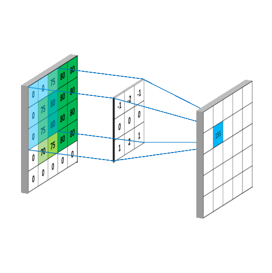
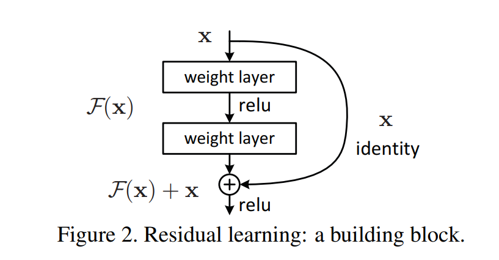

# 1.1.2 卷积神经网络 (CNN)

卷积神经网络（Convolutional Neural Networks, CNN）是计算机视觉领域的基石。通过模拟生物视觉系统的局部感知机制，CNN 能够高效地处理具有空间网格结构的数据。相比于传统网络，它在参数效率和特征提取能力上具有显著优势。

---

## 1. 卷积神经网络基础

### 1.1 从全连接层到卷积

在处理图像等高维数据时，全连接层（Fully Connected Layer）面临着巨大的挑战：

1.  **参数爆炸**：
    假设输入图像尺寸为 $224 \times 224 \times 3$ （约 15 万像素），若隐藏层包含 1024 个神经元，仅这一层就需要超过 1.5 亿个权重参数。这不仅容易导致过拟合，还对硬件显存提出了极高要求。
2.  **空间局部性缺失**：
    全连接层将图像展平为向量，导致相邻像素与远端像素被同等对待，丢失了图像中至关重要的 **局部空间关系**。

为了解决这些问题，卷积层引入了两个核心约束：

- **平移不变性 (Translation Invariance)**：不管检测对象出现在图像中的哪个位置，滤波器（卷积核）的参数是共享的。
- **局部性 (Locality)**：每个神经元只对图像的一个局部区域（感受野）产生响应。

> [!TIP]
> **拓展链接**：
>
> - [D2L - 从全连接层到卷积](https://zh.d2l.ai/chapter_convolutional-neural-networks/why-conv.html)

### 1.2 图像卷积与互相关运算

在深度学习框架中，所谓的“卷积层”实际上通常执行的是 **互相关运算（Cross-correlation）**。

> [!TIP]
> **拓展链接**：
>
> - [【数之道 08】走进"卷积神经网络"，了解图像识别背后的原理](https://www.bilibili.com/video/av459868785/?vd_source=68a92621d5b7bea5c3a2420cf85b79c7)

#### 1.2.1 计算原理

对于输入矩阵 $X$ 和卷积核 $W$ ，输出 $Y$ 的每一个元素由下式确定：

$$
Y(i, j) = (X * W)(i, j) = \sum_{m} \sum_{n} X(i + m, j + n) W(m, n)
$$

卷积核通过在图像上滑动，能够捕捉到边缘、纹理等底层特征。随着层数加深，卷积核将提取出更复杂的语义特征。

  

#### 1.2.2 感受野 (Receptive Field)

感受野是指输出特征图中某个元素在输入图像上对应的区域大小。在叠加多层卷积后，深层神经元的感受野会呈指数级增长，使其能够捕获更大范围的上下文信息。

**1. 计算公式**

第 $l$ 层神经元的感受野 $R_{l}$ 可以通过下式递归计算：

$$
R_{l} = R_{l-1} + (k_{l} - 1) \prod_{i=1}^{l-1} s_{i}
$$

其中：

- $R_{l}$ 表示第 $l$ 层的感受野大小（约定输入层 $R_{0} = 1$ ）。
- $k_{l}$ 为第 $l$ 层的卷积核尺寸。
- $s_{i}$ 为第 $i$ 层的步幅 (Stride)。

**2. 堆叠小卷积核的优势**

在 VGG 网络中提出了一个重要观点：使用多个较小的卷积核（如 $3 \times 3$ ）堆叠起来，可以替代一个较大的卷积核（如 $7 \times 7$ ），且具有以下优势：

- **更大的感受野**：两层 $3 \times 3$ 卷积级联后的感受野为 $5 \times 5$ ，三层级联后为 $7 \times 7$ 。
- **减少参数量**：假设通道数为 $C$ ，三层 $3 \times 3$ 卷积的参数量为 $3 \times (3 \times 3 \times C^{2}) = 27 C^{2}$ ，而一层 $7 \times 7$ 卷积的参数量为 $49 C^{2}$ 。
- **更多非线性**：每层卷积后都可以紧跟一个激活函数（如 ReLU），增加了模型的非线性表达能力。

> [!TIP]
> **拓展链接**：
>
> - [深度理解感受野（一）什么是感受野？](https://blog.csdn.net/weixin_40756000/article/details/117264194)
> - [彻底搞懂感受野的含义与计算](https://www.cnblogs.com/shine-lee/p/12069176.html)

### 1.3 填充 (Padding) 与步幅 (Stride)

为了精确控制输出特征图的几何尺寸，我们需要调节以下两个超参数：

- **填充 (Padding)**：在输入边缘填充像素（通常为 0）。若填充为 $p$ ，可以防止特征图在经过多次卷积后迅速萎缩。
- **步幅 (Stride)**：卷积核滑动的步长。若步幅 $s > 1$ ，则可以实现下采样，减少计算开销。

**输出尺寸计算公式**：
若输入大小为 $n$ ，卷积核大小为 $k$ ，填充为 $p$ ，步幅为 $s$ ，则输出大小 $o$ 为：

$$
o = \lfloor \frac{n - k + 2p}{s} \rfloor + 1
$$

> [!TIP]
> **拓展链接**：
>
> - [CNN基础知识——卷积（Convolution）、填充（Padding）、步长(Stride)](https://zhuanlan.zhihu.com/p/77471866)

### 1.4 多输入与多输出通道

真实的视觉特征通常是多维的。

1.  **多输入通道**：对于 RGB 图像，卷积核也有三个通道。对每个通道分别执行卷积后，将各通道结果 **求和** 得到一个单一的输出通道。
2.  **多输出通道**：如果我们需要提取 $C_{out}$ 种不同的特征，则需要 $C_{out}$ 组独立的卷积核。
3.  **$1 \times 1$ 卷积层**：由 NiN 提出并广泛应用于现代网络。它不改变空间尺寸，仅在通道维度上进行线性组合，常用于 **降维（压缩通道）** 或 **升维（特征聚合）**。

> [!TIP]
> **拓展链接**：
>
> - [一文读懂卷积神经网络中的1x1卷积核](https://zhuanlan.zhihu.com/p/40050371)
> - [【卷积基础】CNN中一些常见卷积（1\*1卷积、膨胀卷积、组卷积、深度可分离卷积）](https://jishuzhan.net/article/1855476110377095169)

### 1.5 汇聚层 (Pooling)

汇聚层(**也称池化层**)用于降低网络对空间位置的敏感度，并实现特征降维：

| 汇聚方式         | 英文名称                     | 核心特点与作用                                                             |
| :--------------- | :--------------------------- | :------------------------------------------------------------------------- |
| **最大汇聚**     | Max Pooling                  | 选取窗口内最强信号，增强模型对光照、位移的鲁棒性                           |
| **平均汇聚**     | Average Pooling              | 保留背景平滑特征                                                           |
| **全局平均汇聚** | Global Average Pooling (GAP) | 对整个通道取平均值；是现代分类网络替代全连接层的标准做法，能显著减少过拟合 |

> [!TIP]
> **拓展链接**：
>
> - [【深度学习基础】 池化层 (Pooling Layer)](https://zhuanlan.zhihu.com/p/788705830)
> - [神经网络之卷积篇：详解池化层](https://www.cnblogs.com/oten/p/18395915)

---

## 2. 现代卷积神经网络架构演进

### 2.1 深度卷积神经网络的开端：AlexNet

AlexNet 在 2012 年 ImageNet 大赛上的成功标志着深度学习时代的开启。

**关键技术贡献**：

- **ReLU 激活函数**：解决了 Sigmoid 在深层网络中的梯度消失问题，加速了收敛。
- **层叠池化 (Overlapping Pooling)**：步幅小于池化窗口大小，增强了平移不变性。
- **Dropout**：在全连接层中随机使神经元失活，极大地增强了模型的泛化能力。

> [!Tip]
> **拓展链接**：
>
> - [AlexNet 原始论文：ImageNet Classification with Deep Convolutional Neural Networks](https://proceedings.neurips.cc/paper/2012/file/c399862d3b9d6b76c8436e924a68c45b-Paper.pdf)
> - [卷积神经网络经典回顾之AlexNet](https://zhuanlan.zhihu.com/p/618545757)

### 2.2 训练深层的保障：批量规范化 (Batch Normalization)

随着网络变深，参数的微小变动会在层间累积，导致梯度消失或爆炸。

#### 2.2.1 计算逻辑

对于一个小批量数据 $\mathcal{B} = \{ x_{1}, \dots, x_{m} \}$，BN 的操作如下：

1. **计算均值**：
   $$\mu_{\mathcal{B}} = \frac{1}{m} \sum_{i=1}^{m} x_{i}$$

2. **计算方差**：
   $$\sigma_{\mathcal{B}}^{2} = \frac{1}{m} \sum_{i=1}^{m} (x_{i} - \mu_{\mathcal{B}})^{2}$$

3. **规范化**：
   $$\hat{x}\_{i} = \frac{x\_{i} - \mu\_{\mathcal{B}}}{\sqrt{\sigma\_{\mathcal{B}}^{2} + \epsilon}}$$

4. **缩放与平移**：
   $$y_{i} = \gamma \hat{x}_{i} + \beta$$

其中 $\gamma$ 和 $\beta$ 是可学习的参数。

#### 2.2.2 核心作用

- **允许更高的学习率**：使训练更稳定。
- **减少对初始化的依赖**：即使初始化不佳，模型也能收敛。
- **轻微的正规化效果**：减少了对 Dropout 的需求。

> [!Tip]
> **拓展链接**：
>
> - [通俗理解 Batch Normalization（含代码）](https://zhuanlan.zhihu.com/p/609131550)
> - [Batch Normalization（BN）超详细解析](https://blog.csdn.net/weixin_44023658/article/details/105844861)

### 2.3 视觉任务的骨干：残差网络 (ResNet)

深层网络往往面临“退化问题”（训练误差反而比浅层更高）。ResNet 通过引入 **残差连接 (Residual Connection)** 彻底打破了这一瓶颈。

#### 2.3.1 残差块 (Residual Block)

不同于让网络学习复杂的映射 $H(x)$ ，ResNet 让层学习输入与输出之间的残差 $F(x) = H(x) - x$ 。最终输出为 $y = F(x) + x$ 。

如果某一层是多余的，网络可以轻易地将权重置零，使得 $F(x) = 0$ ，此时该层仅执行恒等映射（Identity Mapping），保证了深层网络至少不会比浅层网络更差。

  

#### 2.3.2 瓶颈结构 (Bottleneck)

在 ResNet-50 及更深的网络中，为了平衡计算量，引入了 $1 \times 1$ 卷积。通过先降维再升维，大幅减少了 $3 \times 3$ 卷积的计算压力。

> [!TIP]
> **拓展链接**：
>
> - [ResNet 原始论文：Deep Residual Learning for Image Recognition](https://arxiv.org/abs/1512.03385)
> - [何恺明ResNet（残差网络）——彻底改变深度神经网络的训练方式](https://zhuanlan.zhihu.com/p/1889079285102380738)
> - [ResNet——CNN经典网络模型详解(pytorch实现)](https://blog.csdn.net/weixin_44023658/article/details/105843701)

---

卷积神经网络通过 **局部感知** 和 **权值共享** 解决了图像处理的效率问题。从经典的 **LeNet** 到现代视觉任务的 Backbone —— **ResNet** ，CNN 的演进始终围绕着如何让网络“更深”且“更易训练”展开。

## 📚 推荐阅读

- [动手学深度学习-6.卷积神经网络](https://zh.d2l.ai/chapter_convolutional-neural-networks/index.html)
- [动手学深度学习-7.现代卷积神经网络](https://zh.d2l.ai/chapter_convolutional-modern/index.html)
- [【综述】一文读懂卷积神经网络(CNN)](https://zhuanlan.zhihu.com/p/561991816)
- [【深度学习】一文搞懂卷积神经网络（CNN）的原理（超详细）](https://blog.csdn.net/AI_dataloads/article/details/133250229)
