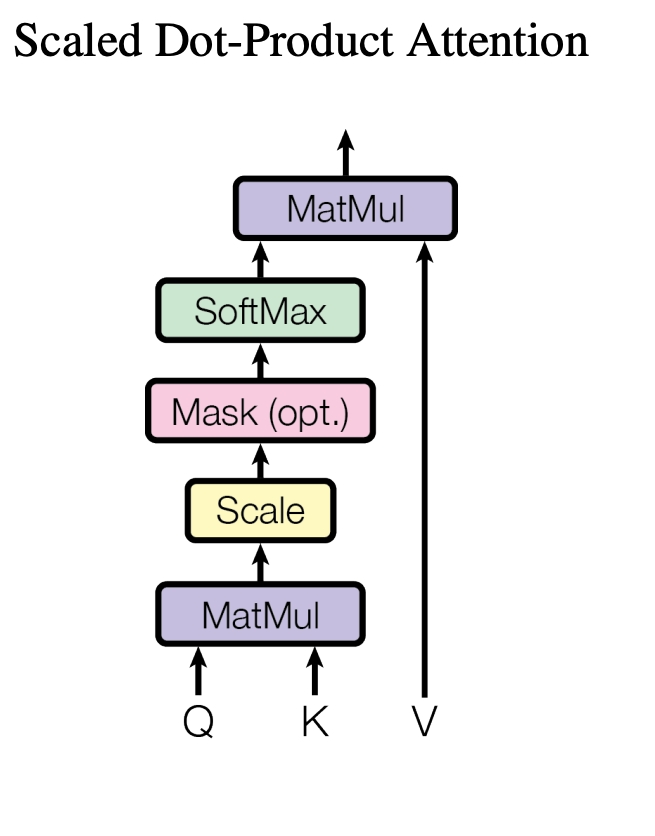
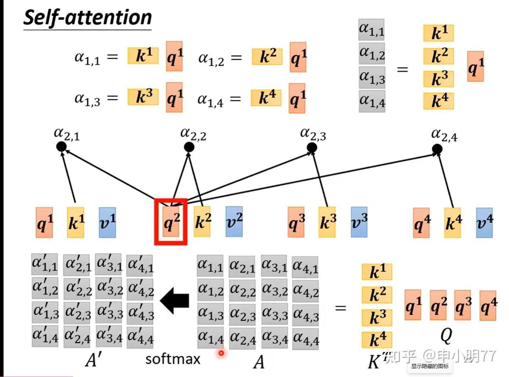
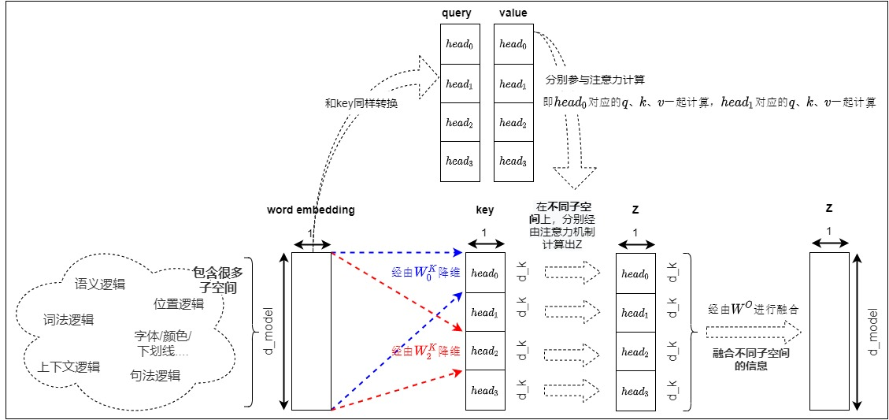
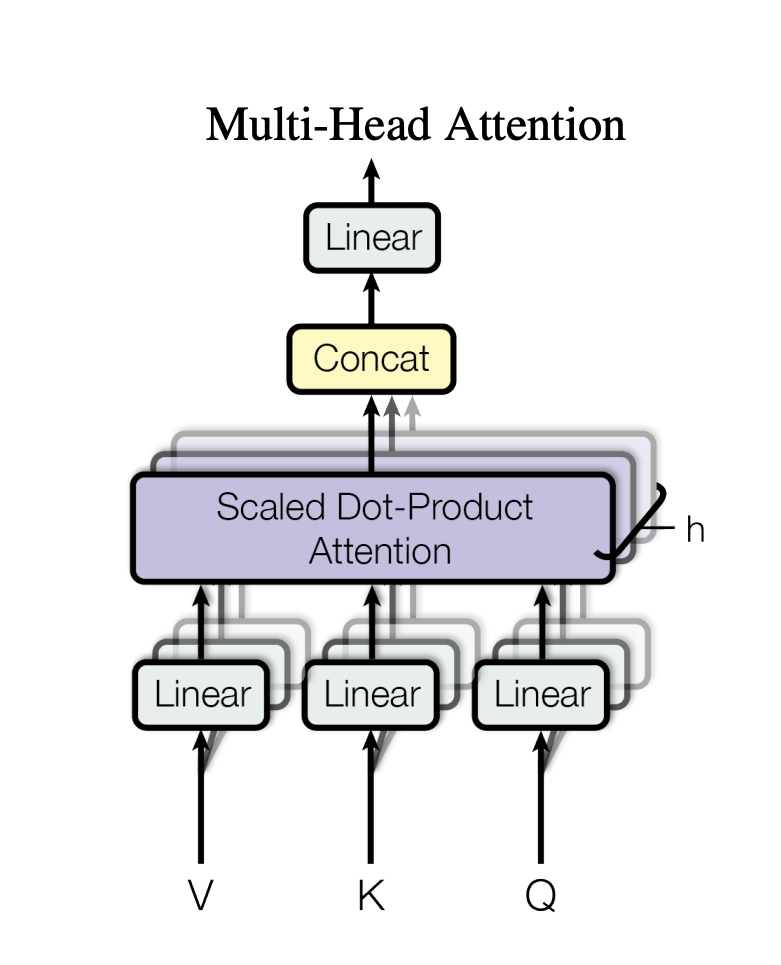
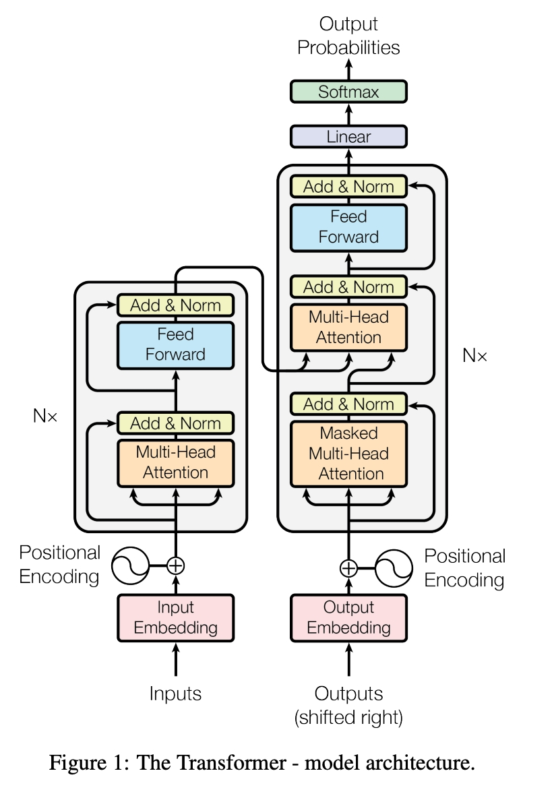
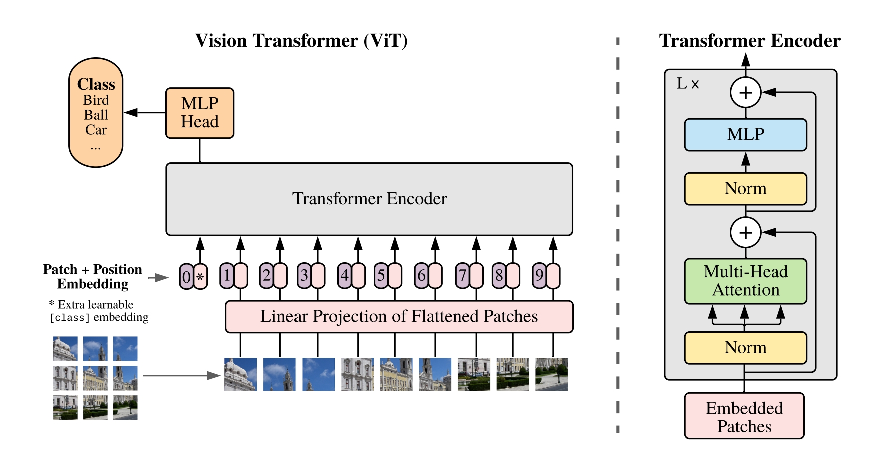

# 1.1.3 Transformer 机制

Transformer 架构自 2017 年问世以来，彻底改变了人工智能的格局。
相比于传统的 CNN（关注局部像素）和 RNN（按顺序记忆），Transformer 的核心优势在于：**它能一眼看到全局，并精准锁定最重要的信息。**

---

## 1. 核心思想：

在海量信息中，我们的大脑是如何工作的？

- **CNN 像是一个放大镜**：它在一个固定的窗口内巡视，擅长捕捉局部细节（如轮廓、边缘），但很难一眼看清整幅画。
- **RNN 像是一个录音机**：它必须按顺序收听，听到后面可能会忘掉前面，且无法并行处理。
- **Transformer 像是一个手电筒**：在黑暗的屋子里，它根据你的“意图”，直接把光打在最关键的物体上。

这种“聚焦关键”的能力，就是 **注意力机制 (Attention Mechanism)**。

---

## 2. 检索逻辑：查询、键、值 (Q, K, V)

Transformer 将信息的提取抽象为一套类似“数据库检索”的过程。为了理解 $Q$ 、$K$ 、$V$ ，我们可以想象你在图书馆找书：

- **查询 (Query, $Q$)**：你脑子里的搜索词（例如：“关于自动驾驶的书”）。
- **键 (Key, $K$)**：每本书书脊上的标签/标题（描述这本书是什么）。
- **值 (Value, $V$)**：书里的具体知识内容（数据的实际价值）。

**过程如下**：

1. 你拿着搜索词（ $Q$ ）去和书架上所有的标签（ $K$ ）对比。
2. 匹配度越高（相关性大），你对该书内容的关注度（权重）就越高。
3. 最后，你根据权重合并这些书里的知识（ $V$ ），得到你想要的答案。

> [!Tip]
> **拓展链接**
>
> - **[attention机制中的query,key,value的几类概念解释方法](https://zhuanlan.zhihu.com/p/148737297)**
> - **[理解 Transformer 注意力机制中的 Query、Key 和 Value](https://blog.eimoon.com/p/transformer-attention-query-key-value/)**

---

## 3. 数学实现：缩放点积注意力

如何用数学表达上述过程？Transformer 使用了 **缩放点积注意力 (Scaled Dot-Product Attention)**。

$$
\text{Attention}(Q, K, V) = \text{softmax} \left( \frac{QK^{T}}{\sqrt{d_{k}}} \right) V
$$

我们可以分步拆解这个公式的精妙之处：

  

1.  **相似度计算 ($QK^{T}$)**：
    通过两个向量的点积来衡量 $Q$ 和 $K$ 的相似程度。点积越大，说明两者越相关。
2.  **缩放因子 ($\frac{1}{\sqrt{d_{k}}}$)**：
    **为什么要除以 $\sqrt{d_{k}}$？** 当维度 $d_{k}$ 很大时，$QK^{T}$ 的结果会变得非常大。这会导致经过 $\text{softmax}$ 后，权重会集中在极少数点上（非 0 即 1），导致梯度消失，模型无法训练。缩放能让数值回归温和区间，让训练更稳定。
3.  **权重分配 ($\text{softmax}$)**：
    将相似度转化为概率分布（权重之和为 1）。
4.  **加权求和 ($\cdot V$)**：
    根据权重，把各个位置的信息（$V$）融合在一起。

  

> [!Tip]
> **拓展链接**
>
> - **[3.1.1 缩放点积注意力](https://transformers.run/c1/attention/#311-%E7%BC%A9%E6%94%BE%E7%82%B9%E7%A7%AF%E6%B3%A8%E6%84%8F%E5%8A%9B)**
> - **[缩放点积注意力与多头注意力](https://zhuanlan.zhihu.com/p/1974161630146352915)**

---

## 4. 多头注意力 (Multi-Head Attention)：多维度的观察

如果只有“一个头”，模型可能只关注到了颜色，而忽略了形状。**多头注意力** 允许模型并行地从多个维度观察数据。

- **形象理解**：在自动驾驶中，一个“头”可能专门盯着路面线，另一个“头”盯着远处的行人，第三个“头”关注交通灯。
- **数学操作**：将 $Q, K, V$ 投影到多个不同的子空间，分别计算注意力，最后把结果拼起来。

  

  

$$
\text{MultiHead}(Q, K, V) = \text{Concat}(\text{head}_{1}, \dots, \text{head}_{h})W^{O}
$$

$$
\text{head}_{i} = \text{Attention}(QW_{i}^{Q}, KW_{i}^{K}, VW_{i}^{V})
$$

> [!Tip]
> **拓展链接**
>
> - **[3.1.2 多头注意力](https://transformers.run/c1/attention/#312-%E5%A4%9A%E5%A4%B4%E6%B3%A8%E6%84%8F%E5%8A%9B)**
> - **[探秘Transformer系列之（12）--- 多头自注意力
>   ](https://www.cnblogs.com/rossiXYZ/p/18759167)**

---

## 5. 位置编码 (Positional Encoding)：打破“乱序”

自注意力机制有一个天生的“缺陷”：它是 **置换不变的**。
简单来说，如果你把输入序列的顺序打乱，自注意力的输出结果（除了顺序）是一模一样的。这就像读句子“我吃火锅”和“火锅吃我”，如果没有位置信息，模型会认为它们是一回事。

为了解决这个问题，Transformer 引入了 **位置编码 (PE)**，将绝对位置信息“嵌入”到特征向量中。

$$
PE_{(pos, 2i)} = \sin \left( \frac{pos}{10000^{2i/d_{model}}} \right)
$$

$$
PE_{(pos, 2i+1)} = \cos \left( \frac{pos}{10000^{2i/d_{model}}} \right)
$$

通过正余弦函数的周期性，模型不仅能知道每个元素的绝对位置，还能学到元素之间的相对距离关系。

> [!Tip]
> **拓展链接**
>
> - **[Transformer学习笔记一：Positional Encoding（位置编码）](https://zhuanlan.zhihu.com/p/454482273)**
> - **[Transformer中的位置编码：绝对位置编码、相对位置编码与旋转位置编码](https://blog.csdn.net/python123456_/article/details/141352984)**
> - **[位置编码详解：Transformer为什么必须知道Token顺序，正弦编码原理
>   ](https://notes.kamacoder.com/llm/transformer/pos_encode.html#%E5%85%88%E5%81%9A%E4%B8%80%E4%B8%AA%E5%AE%9E%E9%AA%8C)**

---

## 6. Transformer整体架构

一个完整的 Transformer 通常由 **编码器 (Encoder)** 和 **解码器 (Decoder)** 组成，其内部包含了确保深层网络能训练成功的“三大护法”：

| 组件                      | 作用                     | 形象比喻                                               |
| :------------------------ | :----------------------- | :----------------------------------------------------- |
| **残差连接 (Residual)**   | $x + \text{Sublayer}(x)$ | 防止信息在传递中丢失，给深层网络留一条“保底”的直通车道 |
| **层归一化 (Layer Norm)** | 稳定每一层的激活值分布   | 让每个神经元的输出都在合理的范围内，不至于“用力过猛”   |
| **前馈网络 (FFN)**        | 独立的非线性变换         | 给每个位置提供额外的特征加工能力，增加模型的深度       |

  

> [!Tip]
>
> - **[Attention Is All You Need](https://arxiv.org/abs/1706.03762)** (Vaswani et al., 2017)：一切的开端。
> - **[【通俗易懂】大白话讲解 Transformer](https://zhuanlan.zhihu.com/p/264468193)**
> - **[什么是Transformer？Transformer综述(说人话版)，看这一篇就够了！](https://blog.csdn.net/EnjoyEDU/article/details/148865655)**
> - **[Transformer如何让自动驾驶大模型获得思考能力？](https://www.eet-china.com/mp/a471882.html)**

## 7. 视觉 Transformer (ViT)

那么如何将Transformer引入到**计算机视觉领域**呢？
Vision Transformer (ViT) 的核心贡献在于证明了：**不需要卷积（CNN），纯 Transformer 架构也能横扫计算机视觉领域。**

### 7.1 核心思想：把图像当成“拼图”

CNN 像是在图像上滑动小窗口，而 ViT 则直接把图像看作一盒 **“拼图” (Jigsaw Puzzle)**：

1.  **切分与展平 (Patch Embedding)**：
    将一张图片切成一个个固定大小的方块（Patch，如 $16 \times 16$ 像素）。每个方块就像一个“单词”，将其展平并转换成向量。
2.  **添加“领头兵” ([CLS] Token)**：
    在这一堆拼图块的前面，特意加一个特殊的向量。这个向量不代表任何图像块，它的任务是“博采众长”，在经过多层注意力计算后，收集成整幅图的全局特征。
3.  **贴上编号 (Positional Encoding)**：
    因为 Transformer 无法识别空间位置，我们必须给每块拼图贴上标签（如“这是第 1 行第 1 列”），否则模型会认为这些碎块是乱序的。

  

### 7.2 运算流程

$$
\mathbf{z}_{0} = [ \mathbf{x}_{class}; \mathbf{x}_{p}^{1} \mathbf{E}; \mathbf{x}_{p}^{2} \mathbf{E}; \dots; \mathbf{x}_{p}^{N} \mathbf{E} ] + \mathbf{E}_{pos}
$$

- **$\mathbf{x}_{p}$**：代表图像的每个 Patch（碎块）。
- **$\mathbf{E}$**：线性投影矩阵，将碎块转换为模型能理解的维度。
- **$\mathbf{E}_{pos}$**：位置编码，赋予模型“空间感”。

### 7.3 ViT vs CNN：

- **CNN 更有“先验知识”**：它天生认为相邻像素更相关（局部性）。这让 CNN 在小数据集上表现极好。
- **ViT 更加“自由”**：它不带任何偏见，直接学习全局关系。
  - **缺点**：在小规模数据集上容易学偏（因为它太“博爱”了，不知道该重点看哪）。
  - **优点**：当数据量极大（如百万、千万级）时，ViT 的上限远高于 CNN，因为它能捕捉到更复杂、更宏观的语义特征。

在自动驾驶中，ViT 的这种“全局视野”对于理解复杂的交通场景（如同时关注远处的红绿灯和近处的行人）至关重要。

> [!Tip]
>
> - **[An Image is Worth 16x16 Words (ViT)](https://arxiv.org/abs/2010.11929)** (Dosovitskiy et al., 2020)：将 Transformer 引入视觉领域的里程碑。
> - **[【深度学习】详解 Vision Transformer (ViT)](https://blog.csdn.net/qq_39478403/article/details/118704747)**
> - **[ViT（Vision Transformer）解析](https://zhuanlan.zhihu.com/p/445122996)**
> - **[手把手教你实现PyTorch版ViT：图像分类任务中的Transformer实战 ](https://www.cnblogs.com/SkyXZ/p/18927874)**

---

## 总结：为什么 Transformer 适合自动驾驶？

1.  **全局视野**：自动驾驶需要同时考虑环视相机、雷达等多传感器的全局信息，Transformer 擅长建模长距离依赖。
2.  **并行性强**：相比 RNN 的串行计算，Transformer 可以大规模并行，大幅提升感知系统的实时性。
3.  **异构融合**：它能统一处理不同类型的数据（如图像像素、雷达点云、文本指令），实现真正的多模态融合。

---

## 📚 推荐阅读

- **[动手学深度学习-10.注意力机制](https://zh.d2l.ai/chapter_attention-mechanisms/index.html)**
- **[注意力机制：从理论到实现(全网最细最完整教程）](https://zhuanlan.zhihu.com/p/1983692420441978327)**
