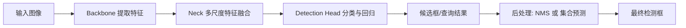

# 2.1.1 2D 目标检测

2D 目标检测是自动驾驶视觉感知链路里最基础、也最常用的任务之一。它回答两个直接问题：

- 图像里出现了什么目标。
- 这些目标大致位于图像的什么位置。

它通常输出一组二维边界框 `bbox = (x, y, w, h)`、类别 `class` 和置信度 `score`。这些结果会继续送往多目标跟踪、3D 检测、行为预测、风险评估等下游模块，因此 2D 检测虽然“不直接给出完整三维世界”，却是整条自动驾驶感知链路的重要前置。

> [!TIP]
> 可以把 2D 检测理解为“先把画面中的关键参与者圈出来”。它不直接告诉你目标距离多远、速度多快，但它决定了系统有没有先看见这个目标。

---

## 1. 2D 检测在自动驾驶中的职责

在自动驾驶里，2D 检测最常负责以下几类目标：

- 动态交通参与者：车辆、行人、骑行者、摩托车。
- 交通设施：交通灯、交通标志、锥桶、施工牌。
- 特殊障碍物：抛洒物、路障、异常停靠车辆。

它的典型价值包括：

- 为跟踪提供初始检测框。
- 为 3D 感知提供图像先验或 RoI。
- 为预测模块提供目标类别和可见性信息。
- 为安全策略提供“是否存在潜在风险目标”的早期信号。

但它也有天然边界：

- 只在图像平面定位，不直接提供真实深度。
- 对遮挡、远距离小目标、夜晚反光等情况敏感。
- 单帧结果不包含稳定的时序身份，需要跟踪模块补充。

---

## 2. 基础概念与检测器工作流

### 2.1 一个检测器到底在做什么

一个完整的 2D 检测器，通常同时在做 4 件事：

1. **特征提取**：从原图中提取语义特征。
2. **候选目标建模**：决定“在哪些位置上尝试检测目标”。
3. **分类与回归**：判断类别，并预测边界框位置。
4. **后处理(可选)**：过滤重复框和低置信度框，输出最终结果。

下面这条流程几乎覆盖了大多数检测器：

检测比图像分类更难，因为它不是只回答“图中有没有车”，而是要回答“图中哪一块区域是车，并且一共有几辆车”。因此，它天然要同时处理三件事：

- **分类（Classification）**：判断这个目标属于哪一类，如 `car`、`pedestrian`、`cyclist`。
- **定位（Localization）**：预测目标边界框的位置和尺寸。
- **置信度（Confidence）**：表示模型对当前预测的确信程度，通常综合了“前景概率”和“类别概率”。

### 2.2 IoU、NMS 与检测后处理

交并比（Intersection over Union, IoU）是检测里最常见的定位评价指标：

$$
\text{IoU} = \frac{\text{Area}(B_p \cap B_{gt})}{\text{Area}(B_p \cup B_{gt})}
$$

其中：

- $B_p$ 是预测框。
- $B_{gt}$ 是真实框。

IoU 越高，说明预测框和真实框越重合。训练时常用 IoU 来分配正负样本，评估时则用它来判断一个检测框是否算命中目标。

同一个物体周围通常会产生很多相似预测框，因此需要后处理去重。

- **NMS（Non-Maximum Suppression）**：
  保留置信度最高的框，删除与其 IoU 过高的其他框。
- **Soft-NMS**：
  不直接删除重叠框，而是随着 IoU 增大逐步衰减其分数。

`NMS` 的优点是简单高效，但在遮挡、密集目标场景中容易误删邻近目标；`Soft-NMS` 对密集检测通常更友好。

### 2.3 候选建模、特征尺度与正负样本问题

**1）目标检测的发展，很大程度上就是“候选目标如何建模”的发展。**

- **Anchor-based**：
  在特征图每个位置预设不同尺度和长宽比的参考框，模型学习相对这些参考框的偏移量。
- **Anchor-free**：
  不再显式设计锚框，而是直接预测中心点、四边距离、关键点或角点。
- **Query-based**：
  在 DETR 一类模型中，候选目标不再来自密集网格上的锚框，而是来自一组可学习的查询向量 `object queries`。

从工程角度看：

- Anchor-based 往往成熟稳定，但超参数较多。
- Anchor-free 结构更简洁，减少了锚框设计负担。
- Query-based 更端到端，但训练与收敛机制更特殊。

**2）自动驾驶里远处行人、交通灯、骑行者常常只占几个像素。单一尺度特征图很难同时兼顾大目标和小目标，因此现代检测器通常使用多尺度特征。**

- **FPN（Feature Pyramid Network）**：
  融合高分辨率的浅层特征和高语义的深层特征。
- **多尺度检测头**：
  在不同分辨率特征图上同时做预测，浅层负责小目标，深层负责大目标。

如果没有多尺度设计，远距离小目标往往在下采样后几乎“消失”。

**3）密集检测器在训练时还会遇到严重的前景/背景不均衡问题：绝大多数位置都是背景，真正包含目标的正样本很少。**

- **正负样本分配**：决定哪些候选位置算正样本、哪些算负样本。
- **Focal Loss**：通过降低“容易分类的负样本”的损失权重，让模型更关注难样本和少数正样本。

这也是为什么 `RetinaNet` 被认为是单阶段检测的重要里程碑之一：它比较系统地解决了密集检测器的类别不平衡问题。

> [!TIP]
> 对自动驾驶来说，类别不平衡不只是“背景太多”，还包括长尾类别稀缺，例如施工标识、拖挂车、特殊障碍物往往远少于普通轿车。

---

## 3. 方法演进：目标检测为什么一路这样发展

目标检测的发展，不只是模型越来越大，而是围绕几个核心矛盾不断演化：

- 如何减少滑窗式穷举带来的巨大计算量。
- 如何让检测从“先提候选框”逐渐走向更端到端。
- 如何在精度、速度、小目标能力之间取得平衡。
- 如何减少人工设计的锚框、匹配规则和后处理组件。

早期目标检测依赖：

- 滑动窗口（Sliding Window）
- 手工特征（HOG、SIFT）
- 传统分类器（SVM、Boosting）

这类方法的主要问题是：

- 计算量极大。
- 特征表达能力有限。
- 对尺度变化、遮挡和复杂背景适应性差。

深度学习进入目标检测后，关键变化是：**把“特征提取”和“分类定位”都交给神经网络联合学习。**

---

## 4. 两阶段检测：先提候选，再分类精修

两阶段检测器（Two-Stage Detector）先提出候选区域，再对候选区域分类和回归，因此通常更强调精度与定位质量。

### 4.1 核心思想与典型优势

第一阶段负责回答：

- 哪些区域“看起来像”目标？

第二阶段负责回答：

- 这些区域具体是什么类别？
- 边界框还能不能再调准一些？

这种分治思路让两阶段方法在小目标、密集目标和高精度定位任务中长期保持竞争力。

相比单阶段检测，两阶段框架虽然推理速度较慢，但在定位精度和对小目标的检测能力上通常更具优势。

### 4.2 从 R-CNN 到 Faster R-CNN

> [!TIP]
> 通俗梳理可以结合阅读：
> [两阶段目标检测 - R-CNN，SPP-net，Fast R-CNN，Faster R-CNN](https://zhuanlan.zhihu.com/p/696976220)

R-CNN 是深度学习检测的起点，首次把 CNN 特征大规模用于目标检测。

- 先用 `Selective Search` 生成约 2000 个候选框。
- 对每个候选框单独裁剪、缩放并送入 CNN。
- 再用 SVM 分类，用回归器微调边界框。

问题在于：

- 每个候选框都要单独跑一次 CNN，计算极度冗余。
- 训练流程分裂，不能端到端。

> [!TIP]
> **论文链接**：[R-CNN: Rich feature hierarchies for accurate object detection and semantic segmentation](https://arxiv.org/abs/1311.2524)

SPP-net 的核心贡献是：**整张图只做一次卷积，候选框共享特征图。**

- 引入 `Spatial Pyramid Pooling`，把任意尺寸 RoI 转成固定长度特征。
- 显著降低了重复卷积计算。

但它仍未彻底解决训练流程割裂的问题。

> [!TIP]
> **论文链接**：[SPP-net: Spatial Pyramid Pooling in Deep Convolutional Networks for Visual Recognition](https://arxiv.org/abs/1406.4729)

Fast R-CNN 继续沿着“共享特征图”的方向优化：

- 使用 `RoI Pooling` 从共享特征图中抽取固定尺寸区域特征。
- 把分类和边框回归整合进一个多任务损失中联合训练。

它大幅提升了训练和推理效率，但候选框仍来自外部算法。

> [!TIP]
> **论文链接**：[Fast R-CNN](https://arxiv.org/abs/1504.08083)

Faster R-CNN 的关键突破是引入 `RPN (Region Proposal Network)`：

- 候选框不再由传统算法生成，而由神经网络直接预测。
- RPN 和检测头共享卷积特征，速度大幅提升。
- 引入 `Anchor` 机制，用不同尺度和长宽比的参考框覆盖多种目标形态。

这意味着两阶段检测第一次真正变成“深度学习主导的统一框架”。

它的多任务损失函数写作：

$$
L(\{p_{i}\}, \{t_{i}\}) = \frac{1}{N_{cls}} \sum_{i} L_{cls}(p_{i}, p_{i}^{*}) + \lambda \frac{1}{N_{reg}} \sum_{i} p_{i}^{*} L_{reg}(t_{i}, t_{i}^{*})
$$

其中，$p_i$ 为第 $i$ 个锚框包含物体的预测概率，$t_i$ 为预测的坐标向量，$p_i^*$ 为真实标签（Ground Truth）。

> [!TIP]
> **论文链接**：[Faster R-CNN: Towards Real-Time Object Detection with Region Proposal Networks](https://arxiv.org/abs/1506.01497)

### 4.3 两阶段检测的优缺点

**优点**

- 定位质量通常更高。
- 小目标和密集目标表现较稳。
- 误检控制往往更好。

**缺点**

- 推理链路更长。
- 部署与优化复杂度更高。
- 端侧实时性通常不如轻量级单阶段模型。

> [!TIP]
> 两阶段检测之所以长期强势，本质上是因为它先把“哪里可能有目标”缩小成少量高质量候选区域，再在这些区域上做更细致的分类和回归。

---

## 5. 单阶段检测：把检测直接做成密集预测

单阶段检测器（One-Stage Detector）省去了显式的候选框提议阶段，直接在特征图上做分类与回归，因此更适合追求实时性的场景。

### 5.1 为什么单阶段方法更快，也更难训练

单阶段检测的主要难点不是“思想不对”，而是训练更难：

- 背景位置太多，正负样本极不平衡。
- 大量低质量候选框会淹没有效梯度。
- 小目标很容易在密集预测中被背景吞没。

也正因为如此，单阶段检测的演化核心一直围绕两件事：

- 如何更好地处理多尺度目标。
- 如何更好地处理正负样本不平衡。

在深入具体算法前，也要先抓住两个基石：

- **锚点（Anchor Boxes）**：
  在单阶段检测器中，模型无法像两阶段那样先找候选区域。因此，研究者在特征图的每个像素点上预设了一组具有不同尺度（Scales）和长宽比（Aspect Ratios）的参考框。模型的目标是学习如何将这些预设的 Anchor 偏移（Offset）并缩放到真实物体位置。
- **非极大值抑制（NMS, Non-Maximum Suppression）**：
  由于模型会在物体周围产生大量重叠的预测框，NMS 的作用是通过保留置信度最高（Confidence Score）的框，并剔除与其重叠度（IoU）过高的其他框，从而实现“一物一框”。

### 5.2 SSD、RetinaNet 与多尺度密集检测

SSD（Single Shot MultiBox Detector）是单阶段检测的重要奠基工作。

- 在多个尺度特征图上同时做检测。
- 浅层负责小目标，深层负责大目标。
- 仍然采用 Anchor 机制进行样本匹配。

它证明了：**单阶段检测也能兼顾速度和精度，只是需要更合理的多尺度设计。**

> [!TIP]
> **论文链接**：[SSD: Single Shot MultiBox Detector](https://arxiv.org/abs/1512.02325)

RetinaNet 的意义不只是提出了一个模型，更重要的是它解释了：

**为什么早期单阶段检测器往往不如两阶段。**

答案是：密集检测器面对极多简单负样本，训练目标被背景主导。`Focal Loss` 通过降低容易分类样本的权重，把学习重点重新拉回困难样本和稀缺正样本。

这让单阶段方法第一次在精度上能与两阶段检测正面对抗。

> [!TIP]
> **论文链接**：[Focal Loss for Dense Object Detection](https://arxiv.org/abs/1708.02002)

### 5.3 FCOS、CenterNet 与 Anchor-free 思路

Anchor 机制虽然有效，但会带来不少工程负担：

- Anchor 尺寸、比例需要人工设计。
- 匹配规则比较敏感。
- 候选框数量大，训练和推理都会更重。

因此，后续很多工作开始转向 Anchor-free。

FCOS 将检测建模为逐像素预测：

- 每个位置直接预测到边界框四条边的距离。
- 不再依赖预设锚框。
- 结构简洁，性能很强。

> [!TIP]
> **论文链接**：[FCOS: Fully Convolutional One-Stage Object Detection](https://arxiv.org/abs/1904.01355)

CenterNet 进一步把目标表示为中心点：

- 用热力图预测目标中心。
- 再回归宽高和偏移量。
- 思路更接近“关键点检测”而不是传统框回归。

CenterNet 代表了 **Anchor-free** 算法的一个典型方向，它彻底抛弃了复杂的锚框设计，将目标检测简化为中心点估计问题。

- **核心思想**：通过热图（Heatmap）预测目标的中心点位置。如果中心点在热图上呈现峰值，则表示检测到一个物体。
- **回归属性**：在中心点的基础上，模型额外回归出物体的宽高（Width/Height）以及中心点的局部偏移（Offset）以补偿量化误差。
- **优势**：无需复杂的 Anchor 匹配和 NMS 后处理（虽然有些变体仍使用简单的 $3 \times 3$ 最大池化），流程极简，端到端性能优异。

其损失函数由中心点焦点损失 $L_k$、偏移损失 $L_{off}$ 和尺寸损失 $L_{size}$ 加权组成：

$$
L_{det} = L_{k} + \lambda_{size} L_{size} + \lambda_{off} L_{off}
$$

> [!TIP]
> **论文链接**：[Objects as Points](https://arxiv.org/abs/1904.07850)

### 5.4 YOLO 系列：工程落地的主力

YOLO 的核心价值在于：**用尽可能简单直接的方式实现高效检测。**

- `YOLOv1`：把检测直接视为回归问题。
- `YOLOv2/v3`：补强 Anchor、多尺度和主干网络设计。
- `YOLOv4/v5`：强化工程技巧、数据增强和训练配方。
- `YOLOv8/YOLOv10/YOLO11`：进一步强调解耦头、端侧部署与更端到端的推理流程。

如果从更细的时间线看：

- **YOLOv1**：开山之作，将检测视为回归问题，将图像划分为 $S \times S$ 网格。
- **YOLOv2 (YOLO9000)**：引入了 Batch Normalization 和 Anchor 机制，极大提升了召回率。
- **YOLOv3**：引入了多尺度预测（类似 FPN 结构）和 Darknet-53 主干网络，成为一代经典。
- **YOLOv4/v5**：在工程化上达到极致，引入了 Mosaic 数据增强、CSP 结构和自适应锚框计算。
- **YOLOv8/v11**：现代 YOLO 的代表，采用了更加高效的 C2f 结构、解耦头（Decoupled Head）设计，并在端侧设备上实现了极致的平衡。

在自动驾驶和边缘设备场景里，YOLO 系列常常是首选起点，因为它在速度、生态和部署便利性上非常强。

> [!TIP]
> **系列论文链接**：
> - [YOLOv1: You Only Look Once (CVPR 2016)](https://arxiv.org/abs/1506.02640)
> - [YOLOv3: An Incremental Improvement (arXiv 2018)](https://arxiv.org/abs/1804.02767)
> - [YOLOv4: Optimal Speed and Accuracy of Object Detection (arXiv 2020)](https://arxiv.org/abs/2004.10934)

### 5.5 单阶段检测的优缺点

**优点**

- 推理速度快。
- 结构简洁，端侧部署友好。
- 工业生态成熟，工程资料丰富。

**缺点**

- 在极端小目标、严重遮挡和高精度定位场景下，可能不如强两阶段模型。
- 对训练配方、数据增强和样本分布比较敏感。

---

## 6. Transformer 检测与 DETR 演进

Transformer 引入检测领域后，最重要的变化不是“换了一个 backbone”，而是**改变了目标检测的建模方式**。

传统检测器往往依赖：

- 稠密候选位置
- Anchor 设计
- 正负样本分配规则
- NMS 后处理

而 DETR 一类方法尝试回答：

> 能不能直接让模型输出“一组最终目标”，而不是先输出一大堆候选框再人工去重？

### 6.1 DETR 的核心思想与范式变化

DETR（DEtection TRansformer）把目标检测改写成一个 **集合预测（Set Prediction）** 问题。

它的基本做法是：

1. 用 CNN 提取图像特征。
2. 把特征送入 Transformer Encoder 建模全局关系。
3. 用一组固定数量的 `object queries` 进入 Decoder。
4. 每个 query 负责预测一个目标或“空目标”。
5. 训练时通过 **二分图匹配（Bipartite Matching / Hungarian Matching）** 让预测集合与真实目标集合一一对应。

DETR 是将 Transformer 引入目标检测的开山之作，它抛弃了传统的锚框（Anchors）和非极大值抑制（NMS），通过二分图匹配实现目标定位。

- **核心机制**：利用 CNN 提取图像特征，将其展平后输入 Transformer Encoder；Decoder 接收一组固定的、可学习的 **Object Queries**，通过交叉注意力（Cross-Attention）从特征中提取物体信息。
- **训练损失**：采用全局一致的二分图匹配损失，确保预测值与真值（Ground Truth）的一一对应：

$$
\hat{\sigma} = \arg \min_{\sigma \in \mathfrak{S}_{N}} \sum_{i}^{N} L_{match}(y_{i}, \hat{y}_{\sigma(i)})
$$

这一步非常关键，因为它让 DETR 不再需要：

- Anchor
- 手工正负样本匹配规则
- NMS 去重

> [!TIP]
> **论文链接**：[End-to-End Object Detection with Transformers (ECCV 2020)](https://arxiv.org/abs/2005.12872)

### 6.2 为什么原始 DETR 不需要 NMS，以及它的瓶颈

在传统检测器中，同一个物体周围会产生许多高重叠预测框，所以要靠 NMS 去重。

而在 DETR 中：

- 每个 query 的目标是输出一个独立预测。
- 训练时通过一对一匹配，强制每个真实目标只匹配一个预测。
- 其余 query 则学习输出“无目标”类别。

因此，模型从训练目标层面就被约束为“每个物体只预测一次”，不再需要用 NMS 在后处理中强行去重。

原始 DETR 的优势包括：

- **端到端**：检测流程更统一。
- **全局建模**：自注意力天然擅长建模目标间关系。
- **一对一预测**：避免大量重复候选框。
- **概念简洁**：减少手工组件和启发式规则。

但它也有很明确的瓶颈：

1. **收敛慢**  
   原始 DETR 往往需要很长训练周期，原因不是“模型太弱”，而是集合匹配本身难学，早期训练阶段匹配非常不稳定。

2. **小目标能力弱**  
   原始 DETR 主要基于较粗粒度特征进行全局建模，对高分辨率多尺度细节利用不充分。

3. **query 语义不够显式**  
   最早的 object queries 更像抽象 embedding，没有明显的空间含义，模型需要自己慢慢学会“哪个 query 该看哪里”。

### 6.3 DETR 的三条改进主线

后续 DETR 家族的演进，几乎都围绕下面三条主线展开：

1. **注意力效率**  
   从“对整幅图做全局稠密注意力”，走向“只关注少量关键采样点”。

2. **query 语义化**  
   从抽象查询向量，走向带有显式位置或框先验的查询。

3. **训练稳定性**  
   从纯粹依赖 Hungarian matching，走向引入辅助任务和去噪训练来加速收敛。

### 6.4 从 Deformable DETR 到 DINO

Deformable DETR 解决的是原始 DETR 全局注意力代价高、对多尺度目标尤其是小目标不够友好的问题。

- 引入 `Deformable Attention`。
- 引入多尺度特征共同参与注意力计算。
- 让每个 query 不再对整张特征图做密集注意力，而只关注参考点周围少量采样位置。

可以把它理解为：

- 原始 DETR 像是在全图“地毯式搜索”。
- Deformable DETR 像是先给一个参考位置，再只看附近若干关键点。

它解决了三个痛点：

- 收敛显著加快。
- 小目标检测能力更强。
- 更适合高分辨率视觉任务。

> [!TIP]
> **论文链接**：[Deformable DETR](https://arxiv.org/abs/2010.04159)

Anchor DETR 的思路是给 query 加入显式空间锚点，把 query 与图像中的位置联系起来。

- 将 Object Queries 显式初始化为图像中的坐标点 $(x, y)$。
- 为模型提供了明确的空间先验，使得 Decoder 能够更有针对性地从特定区域提取特征。

相比原始 DETR，它让 Decoder 不再完全“盲找目标”，而是可以围绕更明确的空间参考去提取特征。

> [!TIP]
> **论文链接**：[Anchor DETR](https://arxiv.org/abs/2109.07107)

DAB-DETR（Dynamic Anchor Boxes DETR）进一步把 query 从点扩展成框：

- query 不只是 `(x, y)` 位置先验。
- 而是 `(x, y, w, h)` 形式的动态框先验。
- 每一层 Decoder 都会基于前一层的输出对锚框进行位置和尺寸的精修。

它是对 Anchor DETR 的深化，将“检测”建模为一个迭代式的框精炼过程，也让定位过程更符合“先给初值，再逐步修正”的直觉。

> [!TIP]
> **论文链接**：[DAB-DETR](https://arxiv.org/abs/2201.12329)

DN-DETR 解决的是匹配不稳定问题。

- 在训练时，把加入噪声后的真实框和标签也作为额外 query 输入。
- 模型一边做原始检测任务，一边学习“把这些带噪声的框恢复成正确目标”。

去噪训练（Denoising Training）带来的好处是：

- 给模型一个更直接、更容易学习的监督信号。
- 降低纯匹配训练初期的不稳定性。
- 明显加快收敛。

> [!TIP]
> **论文链接**：[DN-DETR](https://arxiv.org/abs/2203.01305)

DINO 可以看作是前面几条路线的集成和强化：

- 吸收了去噪训练的思想。
- 结合了更好的 query 初始化与选择机制。
- 集成了动态锚框和去噪思路，并提出了 **对比去噪（Contrastive DN）**、**混合查询选择**等技术，实现了极高的精度与更快的收敛。

它代表的是一个很清晰的趋势：

> DETR 不是放弃端到端，而是在保留端到端范式的前提下，把训练这件事变得更“好学”。

> [!TIP]
> **论文链接**：[DINO](https://arxiv.org/abs/2203.03605)
>
> 通俗梳理可以结合阅读：
> [DETR系列模型（13篇论文）总结](https://zhuanlan.zhihu.com/p/680900567)

### 6.5 DETR 演进对比与自动驾驶意义

| 方法 | 核心改动 | 主要收益 | 仍存在的问题 |
| :--- | :--- | :--- | :--- |
| **DETR** | 集合预测 + Hungarian Matching | 去除 Anchor 与 NMS，范式简洁 | 收敛慢，小目标弱 |
| **Deformable DETR** | 稀疏可变形注意力 + 多尺度特征 | 收敛更快，小目标更强 | 架构复杂度提高 |
| **Anchor DETR** | 给 query 引入显式空间锚点 | query 更有空间语义 | 仍需继续优化训练稳定性 |
| **DAB-DETR** | 将 query 扩展为动态 4D 框 | 更像逐层框精修，定位更稳定 | 训练仍不如成熟 CNN 检测器“省心” |
| **DN-DETR** | 去噪训练辅助匹配 | 显著加速收敛 | 主要解决训练，不直接解决全部多尺度问题 |
| **DINO** | 去噪、query 设计、训练策略联合增强 | 精度和收敛都很强 | 训练和实现复杂度更高 |

可以用一句话概括从 DETR 到 DINO 的技术脉络：

1. **注意力从全局稠密走向稀疏高效。**
2. **query 从抽象 embedding 走向显式空间锚点与动态框。**
3. **训练从纯匹配驱动走向去噪辅助的稳定优化。**

DETR 系列对自动驾驶最有吸引力的地方，在于它更自然地建模全局关系：

- 复杂交通场景中，目标之间往往互相关联。
- 遮挡场景下，单靠局部卷积特征有时不够。
- 多目标密集场景需要更少的重复预测和更一致的全局推理。

但它的现实约束也很明确：

- 高性能 DETR 变体通常训练更复杂。
- 对算力与训练配方要求更高。
- 在量产系统里，是否采用它常常取决于时延预算、数据规模和工程团队经验。

也就是说，DETR 更像是“高潜力的统一范式”，而不是所有场景下都立刻替代 YOLO/Faster R-CNN 的万能答案。

> [!TIP]
> 学习 DETR 最重要的不是死记各个变体名字，而是抓住它们在解决哪类问题：注意力效率、query 设计、匹配稳定性。

---

## 7. 自动驾驶场景下的典型难点

2D 检测放到自动驾驶里，会遇到比通用数据集更尖锐的问题。

### 7.1 小目标、遮挡、密集场景与长尾类别

远处行人、交通灯、锥桶在图像上可能只有几个像素：

- 下采样后特征容易消失。
- 背景噪声占比反而更大。
- 定位框即便只偏几像素，IoU 也会明显下降。

车辆、行人经常只露出一部分：

- 被前车遮挡
- 出现在图像边缘
- 被路边设施、树木、护栏部分挡住

这会导致：

- 漏检
- 框偏移
- 相邻目标被合并成一个框

路口排队、拥堵道路、行人群穿越时：

- 同类目标彼此重叠严重。
- NMS 可能误删相邻目标。
- 分类置信度和定位质量容易同时下降。

自动驾驶最危险的目标，往往不是最常见的目标。

例如：

- 施工牌
- 拖挂车
- 倒地自行车
- 散落物
- 非标准改装车辆

这些类别样本少、形态多变，很容易成为漏检来源。

### 7.2 光照、天气与图像退化

- 夜晚噪声大，目标边界模糊。
- 雨天玻璃反射和水雾降低对比度。
- 逆光会让目标变成剪影。
- 运动模糊会破坏局部纹理。

这类问题常常不是“模型没学到类别”，而是输入图像本身已经严重退化。

---

## 8. 训练评估、模型选型与工程判断

### 8.1 Precision、Recall、AP、mAP

- **Precision**：预测为正的目标里，有多少是真的。
- **Recall**：真实存在的目标里，有多少被检测出来。

二者往往需要权衡：

- 阈值提高，误检少了，但漏检可能增加。
- 阈值降低，召回提高了，但误检也可能更多。

- **AP（Average Precision）**：单类别下 Precision-Recall 曲线的面积。
- **mAP（mean Average Precision）**：所有类别 AP 的平均值。

在 COCO 评估中，通常默认使用多个 IoU 阈值上的平均结果，即更严格也更全面。

### 8.2 AP50、AP75、APS、FPS、Latency 与选型取舍

- **AP50**：IoU 阈值为 `0.50` 时的 AP，较宽松。
- **AP75**：IoU 阈值为 `0.75` 时的 AP，更强调定位质量。
- **APS / APM / APL**：分别衡量小、中、大目标上的检测能力。
- **FPS（Frames Per Second）**：每秒处理多少帧。
- **Latency**：单帧从输入到输出耗时多久。

如果一个模型 `AP50` 很高但 `AP75` 一般，通常说明：

- 它能把目标大致找出来。
- 但框的位置还不够准。

如果 `APS` 很低，则往往意味着小目标能力不足。

在自动驾驶中，`latency` 往往比纯 `FPS` 更关键，因为控制链路关心的是端到端反应时间，而不是“平均吞吐量”。

一个模型即便 `mAP` 很高，也不代表它已经适合上车。

还必须看：

- 小目标召回是否足够。
- 夜晚、雨雾、逆光场景是否稳。
- 特殊障碍物是否容易漏检。
- 推理延迟是否满足实时要求。
- 误检率是否会触发过多无意义制动或告警。

> [!TIP]
> 对自动驾驶来说，“漏掉一个远处行人”和“多报一个广告牌是行人”都很麻烦，只是风险类型不同。评估必须结合业务风险，而不是只看总分。

三类主流路线的取舍如下：

| 路线 | 代表模型 | 优势 | 劣势 | 典型适用场景 |
| :--- | :--- | :--- | :--- | :--- |
| **Two-Stage** | Faster R-CNN | 精度稳，小目标与密集场景友好 | 速度较慢，部署较重 | 离线高精度分析、精度优先方案 |
| **One-Stage** | YOLO、RetinaNet、FCOS | 快、简单、工业生态成熟 | 极端难例下可能不如强两阶段 | 实时检测、端侧部署、量产主力 |
| **Transformer-based** | DETR、Deformable DETR、DINO | 端到端、全局建模能力强 | 训练复杂度高，落地门槛较高 | 研究型系统、高算力平台、多任务统一建模 |

工程上常见的几个经验点：

- 想快速跑通基线，优先从 `YOLO` 或 `MMDetection` 里的成熟配置开始。
- 想提高远距离和小目标效果，优先检查输入分辨率、多尺度训练和数据分布，而不是先盲目换大模型。
- 想减少误检，除了调阈值，还要回看负样本质量和标注一致性。
- 想减少漏检，除了追求更高 `Recall`，还要分析是否存在类别缺失、长尾不足和场景偏差。
- 自动驾驶训练集最好单独看白天、夜晚、雨天、隧道、城区、高速等子集表现。

什么时候选哪类模型：

- 如果你优先考虑**实时性和部署简洁**，通常先看 YOLO/FCOS 一类单阶段模型。
- 如果你优先考虑**定位精度和复杂场景鲁棒性**，可以优先尝试 Faster R-CNN 或更强两阶段方案。
- 如果你想研究**端到端统一检测范式**，或者后续考虑与分割、跟踪、BEV 感知做更统一的建模，DETR 系列很值得深入。

---

## 9. 学习路径、资料与实践建议

### 9.1 一个推荐的入门顺序

1. 用现成预训练模型在公开数据或自有图片上跑通推理。
2. 读懂 `bbox`、`score`、IoU、NMS、mAP 的含义。
3. 微调一个 YOLO 或 Faster R-CNN 基线。
4. 分析误检和漏检样例，而不是只看总分。
5. 再去理解 FCOS、RetinaNet、DETR 这些不同范式的差别。

不要只看论文曲线，建议固定做三件事：

- 看几张可视化结果，判断模型“错在哪”。
- 看分类分数与 IoU 的关系，判断是分类错还是定位错。
- 分场景统计指标，判断是否存在夜晚、小目标或遮挡偏科。

### 9.2 推荐数据集与开源框架

- [COCO](https://cocodataset.org/dataset/detection-2017.htm)：目标检测通用基准，适合理解标准评估体系。
- [KITTI](https://www.cvlibs.net/datasets/kitti/)：自动驾驶经典数据集，适合入门车辆/行人检测。
- [BDD100K](https://bdd-data.berkeley.edu/)：覆盖白天、夜晚、天气变化，适合做驾驶场景泛化分析。
- [Waymo Open Dataset](https://waymo.com/open/)：高质量自动驾驶数据集，适合更真实的多类交通参与者检测研究。

- [Ultralytics YOLO Docs](https://docs.ultralytics.com/)：最快速跑通检测任务的生态之一。
- [MMDetection](https://github.com/open-mmlab/mmdetection)：检测模型最全、最适合系统学习的代码库之一。
- [Detectron2](https://github.com/facebookresearch/detectron2)：研究和工程都很成熟的经典框架。

### 9.3 推荐阅读

**必读论文**

- [R-CNN: Rich feature hierarchies for accurate object detection and semantic segmentation](https://arxiv.org/abs/1311.2524)
- [SPP-net: Spatial Pyramid Pooling in Deep Convolutional Networks for Visual Recognition](https://arxiv.org/abs/1406.4729)
- [Fast R-CNN](https://arxiv.org/abs/1504.08083)
- [Faster R-CNN: Towards Real-Time Object Detection with Region Proposal Networks](https://arxiv.org/abs/1506.01497)
- [SSD: Single Shot MultiBox Detector](https://arxiv.org/abs/1512.02325)
- [Focal Loss for Dense Object Detection](https://arxiv.org/abs/1708.02002)
- [FCOS: Fully Convolutional One-Stage Object Detection](https://arxiv.org/abs/1904.01355)
- [Objects as Points](https://arxiv.org/abs/1904.07850)
- [End-to-End Object Detection with Transformers](https://arxiv.org/abs/2005.12872)
- [Deformable DETR](https://arxiv.org/abs/2010.04159)
- [Anchor DETR](https://arxiv.org/abs/2109.07107)
- [DAB-DETR](https://arxiv.org/abs/2201.12329)
- [DN-DETR](https://arxiv.org/abs/2203.01305)
- [DINO](https://arxiv.org/abs/2203.03605)
- [Soft-NMS -- Improving Object Detection With One Line of Code](https://arxiv.org/abs/1704.04503)

**通俗解读**

- [两阶段目标检测 - R-CNN，SPP-net，Fast R-CNN，Faster R-CNN](https://zhuanlan.zhihu.com/p/696976220)
- [一文通透目标检测：R-CNN、Fast R-CNN、Faster R-CNN、YOLO、SSD、DETR](https://blog.csdn.net/v_july_v/article/details/80170182)
- [DETR 系列模型总结](https://zhuanlan.zhihu.com/p/680900567)
- [DETR系列模型（13篇论文）总结](https://zhuanlan.zhihu.com/p/680900567)

**延伸建议**

- 如果你想快速上手工程实践，先从 YOLO 跑通自定义数据训练。
- 如果你想建立完整知识体系，建议把 Faster R-CNN、RetinaNet、FCOS、DETR 串起来理解。
- 如果你想进一步贴近自动驾驶，下一步可以继续看 3D 检测、BEV 感知和目标跟踪。

### 9.4 小结与实践建议

2D 目标检测的发展主线，可以概括为三次重要转变：

1. **从滑动窗口到深度特征学习。**
2. **从两阶段候选框检测到单阶段密集预测。**
3. **从 Anchor/NMS 驱动的传统范式到 DETR 的集合预测范式。**

对自动驾驶来说，真正重要的不只是“哪个模型分数最高”，而是：

- 能不能稳定看见远处和小目标。
- 能不能在遮挡、夜晚和恶劣天气下保持鲁棒。
- 能不能在有限时延内输出足够可靠的检测结果。

建议直接做一个小实验，把理论和结果对上：

1. 使用 `Ultralytics YOLO` 跑通一组驾驶场景图像或视频。
2. 手动收集 20 个误检/漏检样例，按“小目标、遮挡、夜晚、密集场景”分类。
3. 对照本文中的概念，判断问题更像是分辨率不足、NMS 误删、样本不均衡，还是长尾类别缺失。

这样你会比只看论文摘要更快真正理解 2D 目标检测。
