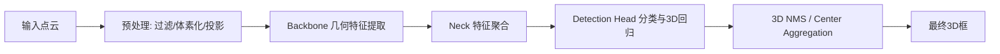

# 2.2.2 3D目标检测-LiDAR点云

LiDAR 点云 3D 目标检测（LiDAR-based 3D Object Detection）是自动驾驶感知系统中最经典、也最成熟的 3D 检测路线之一。它要求系统直接从激光雷达采集到的三维点云中，识别周围目标并恢复其在真实空间中的位置、尺寸、朝向，必要时还包括速度等运动属性。

如果说 2D 检测回答的是：

- 图像里出现了什么目标？
- 这些目标在图像的什么区域？

纯视觉 3D 检测回答的是：

- 能不能只靠图像反推出目标在三维世界中的状态？

那么 LiDAR 3D 检测回答的问题更直接：

- 点云里哪些空间结构属于一辆车、一个行人或一个骑行者？
- 这些目标在自车坐标系中的精确位置、尺寸和朝向是什么？

**因此，LiDAR 3D 检测的核心优势在于：输入本身就已经位于真实三维空间，而不是二维投影平面。**

它的标准输出通常是一组 3D 框参数：

- 目标中心位置 $\left(x, y, z\right)$
- 目标尺寸 $\left(w, l, h\right)$
- 目标朝向 `yaw`
- 目标类别 `class`
- 置信度 `score`
- 可选速度 $\left(v_x, v_y\right)$

这些结果会继续送往多目标跟踪、行为预测、风险评估、规划控制等下游模块。也正因为如此，LiDAR 3D 检测长期被视为自动驾驶几何感知的主力基础模块。

> [!TIP]
> **可以把 LiDAR 3D 检测理解为：**
> 纯视觉 3D 检测是在“猜空间”，而 LiDAR 3D 检测是在“读空间”。它不是没有难点，而是难点从“深度恢复”转成了“如何高效理解稀疏、不规则的三维点结构”。 

---

## 1. LiDAR 3D 检测在自动驾驶中的职责

LiDAR 3D 检测最常负责以下几类目标：

- 动态交通参与者：车辆、行人、骑行者、摩托车、卡车、公交车。
- 静态或半静态障碍物：锥桶、路障、施工设备、异常停靠车辆。
- 特殊结构目标：拖挂车、工程车、异形障碍物、散落物。

相比 2D 检测，LiDAR 3D 检测的价值更加“几何直接”：

- 为跟踪提供三维空间中的初始框和姿态。
- 为预测提供更可靠的位置、朝向和速度初始化。
- 为规划控制提供可直接用于避障和安全距离计算的几何对象。
- 为占用、场景理解和高精定位提供结构化目标先验。

它和纯视觉 3D 检测最本质的区别在于：

- LiDAR 输入天然带有深度，不需要完全依赖透视关系恢复距离。
- LiDAR 更容易在 BEV 坐标系中稳定表达目标位置和朝向。
- LiDAR 对光照变化不敏感，夜晚和逆光场景通常更稳。
- 但 LiDAR 点云稀疏、不规则、远距离退化明显，也不包含丰富纹理语义。

因此，LiDAR 路线并不是“比视觉简单”，而是任务重心发生了变化：

- 视觉路线难在从投影恢复空间。
- LiDAR 路线难在从离散点结构中高效抽取目标级几何模式。

在自动驾驶系统里，LiDAR 3D 检测的长期吸引力主要来自三个方面：

- **空间精度高**：中心位置、尺寸和朝向估计通常更稳定。
- **夜间鲁棒性强**：不依赖可见光成像质量。
- **下游兼容性好**：输出天然对接 BEV、地图和规划模块。

但它也有天然边界：

- 点云在远距离会快速变稀。
- 细小目标可见点数少，容易漏检。
- 遮挡后只剩局部点片时，框体恢复仍然困难。
- 不同线数、不同安装高度和不同扫描模式会显著改变数据分布。

---

## 2. 基础概念与检测器工作流

### 2.1 一个 LiDAR 3D 检测器到底在做什么

一个完整的 LiDAR 3D 检测器，通常同时在做 5 件事：

1. **点云预处理**：裁剪范围、去除无效点、坐标归一化或体素化。
2. **几何特征提取**：从点、体素、柱状单元或距离图中提取空间特征。
3. **候选目标建模**：在 3D 空间或 BEV 平面中提出目标候选。
4. **分类与 3D 框回归**：预测类别、中心、尺寸、朝向和可选速度。
5. **后处理与去重**：使用 NMS 或中心聚合得到最终 3D 框。

一个常见的整体流程如下：

和 2D 检测相比，LiDAR 3D 检测的差别不只是“框从 2D 变成 3D”，还包括：

- 输入不再是规则像素网格，而是无序点集。
- 稠密卷积不能直接无代价套用到原始点云上。
- 目标结构通常更依赖空间几何边界，而不是纹理外观。
- 输出框通常位于车辆或激光雷达坐标系中，而不是图像坐标系中。

因此，它必须同时处理：

- **语义识别（Classification）**
- **三维定位（3D Localization）**
- **尺寸估计（Size Estimation）**
- **朝向估计（Orientation Estimation）**
- **可选速度估计（Velocity Estimation）**

### 2.2 点云、坐标系与 3D 框参数化

LiDAR 原始输入通常是一组离散点：

$$
p_i = \left(x_i, y_i, z_i, r_i\right)
$$

其中：

- $\left(x_i, y_i, z_i\right)$ 是点在传感器坐标系下的位置。
- $r_i$ 常表示反射强度（intensity / reflectance）。

如果使用多帧点云，还可能附加：

- 时间戳偏移
- 激光线束编号
- 运动补偿后的位姿信息

LiDAR 3D 检测里最常见的坐标系包括：

- **LiDAR 坐标系**：以雷达本体为参考的三维坐标。
- **车辆坐标系（Ego Coordinate）**：以自车中心或后轴中心为参考。
- **全局坐标系（Global Coordinate）**：用于多帧拼接、定位和地图对齐。
- **BEV 坐标系**：把三维空间投影到地面平面后的鸟瞰表示。

三维目标框通常可以参数化为：

$$
b = \left(x, y, z, w, l, h, \theta\right)
$$

其中：

- $\left(x, y, z\right)$ 是框中心。
- $\left(w, l, h\right)$ 是宽、长、高。
- $\theta$ 是绕垂直轴的朝向角，通常对应 `yaw`。

如果是 nuScenes 一类数据集，框还可能附带速度：

$$
b = \left(x, y, z, w, l, h, \theta, v_x, v_y\right)
$$

从工程角度看，LiDAR 3D 检测最舒服的一点是：

> 目标本身已经在物理空间里，检测器不需要先“猜深度”，而是直接判断哪些点属于同一个物体，以及这些点支持怎样的 3D 包围盒。

### 2.3 为什么 LiDAR 点云难处理

虽然 LiDAR 有直接三维几何，但它并不等于“输入更容易学”。恰恰相反，点云有几类非常典型的困难：

**1）点云是不规则、无序且稀疏的。**

- 图像天然是规则网格，卷积很好做。
- 点云是离散点集，邻接关系并不显式。
- 稠密 3D 卷积如果直接铺满整个空间，计算量会非常大。

**2）点密度分布极不均匀。**

- 近处目标点多。
- 远处目标点少。
- 不同方位因遮挡和扫描角度不同，点的覆盖也不同。

**3）目标经常只呈现局部表面。**

- LiDAR 通常看到的是目标外壳上的部分点。
- 被遮挡时，可能只剩一条边、一小片顶面或几个散点。
- 即使是完整车辆，也不一定形成“满实体”。

**4）不同传感器条件差异大。**

- 16 线、32 线、64 线、128 线雷达的数据密度差异明显。
- 扫描频率、安装高度、视场角和噪声水平都会影响检测模型分布适配。

也就是说，LiDAR 3D 检测的难点不是深度恢复，而是：

> 如何在有限而稀疏的点证据下，稳定地还原目标级三维结构。

### 2.4 预处理、体素化与后处理

一个实际可用的 LiDAR 检测系统，往往离不开预处理和后处理。

常见预处理包括：

- 设定感兴趣空间范围，如前后左右各若干米、高度上下限。
- 过滤超远、超高或地面以下无效点。
- 对点云做体素化（voxelization）或柱状化（pillarization）。
- 可选地面去除、坐标归一化和多帧拼接。

之所以经常要体素化，是因为：

- 原始点的邻域关系不规则。
- 体素化能把空间离散成可聚合的小单元。
- 稀疏卷积可以只在非空体素上计算，效率更高。

检测后处理同样关键。常见方法包括：

- **3D NMS**：基于 3D IoU 或 BEV IoU 去重。
- **Class-wise NMS**：按类别分别做抑制。
- **Center-based Aggregation**：围绕中心热力图峰值提取目标，而不是传统候选框打分排序。

在 BEV 平面上，一个简化的 IoU 仍可写成：

$$
\text{IoU}_{bev} = \frac{\text{Area}(B_p^{bev} \cap B_{gt}^{bev})}{\text{Area}(B_p^{bev} \cup B_{gt}^{bev})}
$$

其中 $B_p^{bev}$ 和 $B_{gt}^{bev}$ 分别是预测框和真实框投影到地面的矩形或旋转矩形。

> [!TIP]
> LiDAR 检测里很多评估和后处理都更偏向 BEV，因为车辆运动与碰撞风险首先发生在地面平面上。但真正部署时，框高、底面高度和朝向仍然同样重要。

---

## 3. 方法演进：LiDAR 3D 检测为什么这样发展

LiDAR 3D 检测的发展主线，本质上围绕着下面几个问题不断演化：

- 如何直接处理无序点集？
- 如何在几何表达能力和计算效率之间平衡？
- 是先做候选框，再精修，还是直接密集预测？
- 是保留完整 3D 体信息，还是压缩到 BEV 平面？
- 如何让远距离、小目标和稀疏场景依然稳定？

从历史脉络看，大致经历了几次重要转变：

### 3.1 从手工特征到深度学习三维表示

早期 3D 点云检测更多依赖：

- 聚类分割
- 地面去除
- 手工几何特征
- 传统分类器或模板匹配

这类方法的问题在于：

- 规则依赖强，泛化能力有限。
- 面对复杂遮挡、不同目标形状时鲁棒性不够。
- 很难统一建模检测、定位与姿态估计。

深度学习带来的关键变化是：

> 不再手工设计“什么样的几何像一辆车”，而是让网络直接从点结构中学习判别模式。

### 3.2 从原始点到体素：效率问题推动表示变迁

纯点级方法几何保真度高，但如果对每个点都做复杂邻域建模，推理成本会越来越高。

于是研究者开始把空间离散化：

- 把点组织成 **Voxel**
- 把三维体素进一步压缩成 **Pillar**
- 或者投影成 **Range View / BEV View**

这种变化的核心驱动力不是“谁更先进”，而是：

- 原始点最贴近数据本质，但效率和部署压力更大。
- 体素化更适合卷积和硬件加速。
- BEV 表示更贴合自动驾驶下游任务。

### 3.3 从两阶段到单阶段：结构越来越工程化

和 2D 检测类似，LiDAR 3D 检测也经历了：

- **两阶段路线**：先找候选目标，再精修框体。
- **单阶段路线**：直接在空间特征图上密集预测目标。

两阶段方法通常更强调：

- 候选框质量
- 点级 RoI 特征抽取
- 框体精修和局部几何细化

单阶段方法更强调：

- 结构简单
- 推理高效
- 易于部署和多任务扩展

### 3.4 从完整 3D 表示走向 BEV 主导

在自动驾驶里，一个非常重要的事实是：

- 大多数交通参与者都活动在地面附近。
- 目标碰撞关系主要体现在地平面。
- 下游规划也主要消费 BEV 语义和几何。

因此，很多 LiDAR 检测方法逐渐从“全三维密集处理”走向“以 BEV 为核心表示”。这并不意味着高度信息不重要，而是：

> 对检测而言，高度维往往更像局部属性；对驾驶而言，地面平面关系往往是全局主导因素。

---

## 4. 两阶段 3D 检测：先找候选，再做精修

两阶段 LiDAR 检测器会先提出 3D 候选框，再对候选区域做更细的点级或体素级特征抽取与框体回归。因此，它们通常更强调几何细节和定位精度。

### 4.1 核心思想与典型优势

第一阶段通常回答：

- 哪些空间区域可能包含目标？

第二阶段继续回答：

- 这些候选具体属于什么类别？
- 框中心、尺寸和朝向还能不能调得更准？
- 局部点结构是否支持更精细的框边界？

这类方法的优势通常在于：

- 对框体精修能力强。
- 更容易利用候选区域内的局部高分辨率点结构。
- 对复杂形状、部分遮挡和定位细节更友好。

代价则包括：

- 结构更复杂。
- 推理延迟更高。
- RoI 特征抽取和候选管理会带来额外工程成本。

### 4.2 PointRCNN：直接从原始点中提出 3D 候选

`PointRCNN` 是 LiDAR 两阶段检测中的代表工作之一。它的重要意义在于：

- 不依赖图像 RoI。
- 第一阶段直接在点上做前景分割和候选框生成。
- 第二阶段基于候选区域的点做精修。

它的核心思想可以概括为：

1. 先在原始点上判断哪些点属于前景目标。
2. 围绕这些前景点生成 3D proposal。
3. 对每个 proposal 聚合局部点特征并回归更精细的 3D 框。

它让研究者看到：

> 即使不先把点云硬离散成规则网格，网络也可以直接在点结构上完成 3D 候选生成。

但这条路线的挑战也很明确：

- 点级邻域计算较重。
- 大规模场景下推理效率有限。
- 对点采样和局部聚合设计比较敏感。

> [!TIP]
> **论文链接**：[PointRCNN: 3D Object Proposal Generation and Detection from Point Cloud](https://arxiv.org/abs/1812.04244)

### 4.3 Part-A2、PV-RCNN：候选精修越来越精细

后续很多两阶段方法都沿着“更强的局部几何建模”继续演进。

`Part-A2` 的思路是：

- 在 proposal 内建模部件级点结构。
- 利用 part-aware 特征帮助提升框体定位质量。

`PV-RCNN` 则是一个非常经典的折中方案，它结合了：

- 体素卷积带来的高效全局特征提取
- 关键点聚合带来的局部细粒度几何建模

它的核心价值不在于“堆了更多模块”，而在于证明了：

> 体素特征适合做全局 backbone，点级关键点适合做局部精修，两者并不是对立关系。

这也是后面很多高性能方法的重要思路来源。

> [!TIP]
> **论文链接**：
> - [Part-A^2 net: 3D Part-Aware and Aggregation Neural Network for Object Detection from Point Cloud](https://arxiv.org/abs/1907.03670)
> - [PV-RCNN: Point-Voxel Feature Set Abstraction for 3D Object Detection](https://arxiv.org/abs/1912.13192)

### 4.4 两阶段路线的优缺点

两阶段 LiDAR 检测器的主要优点包括：

- 高精度定位能力通常更强。
- 更容易做 proposal 级几何精修。
- 局部点结构利用更充分。

主要缺点包括：

- 推理链路更长。
- 实时性往往不如强单阶段模型。
- 训练和实现复杂度更高。

因此，两阶段方法长期更像：

- 精度优先方案
- 离线高精度分析方案
- 或作为很多新方法性能上限的重要参考基线

---

## 5. 单阶段 3D 检测：把检测直接做成空间密集预测

单阶段 LiDAR 检测器不再显式分 proposal 和 refinement，而是直接在点、体素、pillar、range view 或 BEV 特征图上做密集预测。它们通常是工程部署和量产系统里的主力。

### 5.1 为什么单阶段方法更高效，也更依赖表示设计

单阶段路线之所以有吸引力，是因为：

- 网络链路更短。
- 推理速度更快。
- 更容易做端到端部署。
- 更方便和分割、占用、跟踪等任务共享 backbone。

但它也更依赖前端表示是否足够好，因为：

- 没有第二阶段专门做局部精修。
- 候选目标质量几乎完全取决于主干特征表达。
- 对中心热力图、anchor 设计或标签分配更敏感。

### 5.2 VoxelNet、SECOND：体素化与稀疏卷积成为主流基线

`VoxelNet` 是 LiDAR 检测里非常关键的一篇工作。它把原始点云离散成体素，并在体素内学习点级聚合特征，然后进入卷积 backbone。

它的重要意义在于：

- 证明了体素化可以兼顾表达能力与卷积计算。
- 为后续几乎所有 voxel-based 方法奠定了基础。

但早期 `VoxelNet` 的成本仍然较高。

`SECOND` 的核心推进是：

- 大规模使用 **Sparse Convolution**。
- 只在非空体素上计算卷积，显著提升效率。

这条路线非常符合自动驾驶实际需求，因为它抓住了点云的一个关键事实：

> 三维空间大部分区域本来就是空的，没必要像稠密 3D CNN 那样对整个空间做同等计算。

> [!TIP]
> **论文链接**：
> - [VoxelNet: End-to-End Learning for Point Cloud Based 3D Object Detection](https://arxiv.org/abs/1711.06396)
> - [SECOND: Sparsely Embedded Convolutional Detection](https://pmc.ncbi.nlm.nih.gov/articles/PMC6210968/)

### 5.3 PointPillars：把三维体素压缩成柱状表示

`PointPillars` 可以看作是进一步向工程高效性靠拢的一步。

它的做法是：

- 不再把空间划分成三维小体素。
- 而是沿高度方向压缩成二维柱状单元 `pillars`。
- 然后把问题转成更接近 2D CNN 的 BEV 检测任务。

它的优点非常明显：

- 预处理简单。
- 推理速度快。
- 硬件和部署友好。

缺点则是：

- 高度维细节被提前压缩。
- 对复杂垂向结构的表达不如完整体素细。

但在自动驾驶这个“地面主导”的任务里，这种取舍经常是值得的。

> [!TIP]
> **论文链接**：[PointPillars: Fast Encoders for Object Detection from Point Clouds](https://arxiv.org/abs/1812.05784)

### 5.4 CenterPoint：从 Anchor-based 走向 Center-based

随着 2D 检测中中心点思想的发展，LiDAR 检测也开始从传统 anchor-based 路线转向 center-based 路线。

`CenterPoint` 的基本思路是：

- 在 BEV 平面上预测目标中心热力图。
- 再回归尺寸、高度、朝向和速度等属性。

它的重要意义在于：

- 结构更简洁。
- 避免了大量手工 anchor 设计。
- 更适合和跟踪、多帧建模结合。

对自动驾驶而言，这种设计很自然，因为：

- 目标中心在 BEV 平面中具有明确的物理意义。
- 目标运动也更容易围绕中心状态建模。

> [!TIP]
> **论文链接**：[CenterPoint: 3D Object Detection and Tracking from Point Clouds](https://arxiv.org/abs/2006.11275)

### 5.5 单阶段路线的优缺点

单阶段 LiDAR 检测器的主要优点包括：

- 推理快，工程上更容易实时化。
- 架构清晰，部署链路更短。
- 易于与 BEV 多任务体系整合。

主要缺点包括：

- 局部精修能力通常不如强两阶段方法。
- 前端表示设计和标签分配策略更关键。
- 对远距离稀疏目标和极端遮挡目标，容易出现召回瓶颈。

从工程经验看：

- 如果目标是快速建立稳定基线，`SECOND`、`PointPillars`、`CenterPoint` 往往是非常常见的起点。
- 如果目标是追求更高上限，再考虑更强的两阶段或点体混合方案通常更合适。

---

## 6. 表示范式与主流技术路线

纯视觉 3D 检测经常围绕 Dense、Sparse、Hybrid 讨论，而 LiDAR 3D 检测更常围绕“输入表示怎么组织”展开。因为在 LiDAR 里，表示本身几乎决定了后续网络形态和工程效率。

### 6.1 Point-based：直接对原始点集建模

Point-based 方法尽量少做离散化，直接在原始点或局部邻域上建模。

它们的优势是：

- 更贴近原始数据，不容易丢失细粒度几何。
- 对局部形状边界和目标表面结构表达更自然。

缺点是：

- 邻域构图、采样和聚合成本较高。
- 大场景和高实时性场合部署压力更大。

典型代表包括：

- PointNet / PointNet++
- PointRCNN
- 其他点级 proposal 或图结构方法

### 6.2 Voxel-based：离散三维空间，利用稀疏卷积

Voxel-based 方法把空间切分成小立方体或长方体体素，再在非空体素上做卷积。

它们的核心优点是：

- 三维几何表达相对完整。
- 容易建立层次化 backbone。
- Sparse Conv 对大范围 3D 空间尤其高效。

典型代表包括：

- VoxelNet
- SECOND
- PV-RCNN 的体素 backbone

这条路线常被认为是：

- 几何表达能力和工程效率之间的稳健折中

### 6.3 Pillar-based：尽早转成 BEV 问题

Pillar-based 方法本质上是：

- 在 XY 平面分格
- 高度方向聚合
- 尽快生成二维 BEV 特征图

它们通常具备：

- 极强的部署效率
- 非常成熟的 2D CNN 工具链兼容性

但也意味着：

- 细致的垂向几何会被更早压缩

对自动驾驶而言，这个思路长期很有生命力，因为：

- 车辆、行人、自行车等目标在 BEV 上已经具有较强可分性
- 规划、地图和跟踪天然也站在 BEV 视角

### 6.4 Range View：把点云投影回“雷达图像”

另一类方法会把点云投影到 Range View 或球面视图中，也就是：

- 横轴是方位角
- 纵轴是俯仰角或线束索引
- 像素值编码距离、高度、反射强度等信息

这类方法的优点是：

- 可直接使用成熟的 2D CNN
- 对硬件友好

缺点是：

- 投影会带来遮挡混叠和邻接扭曲
- 物理空间中的近邻在图上未必仍是近邻

因此，Range View 往往在速度上有吸引力，但在几何精度和复杂遮挡处理上通常需要更精心设计。

### 6.5 BEV 成为事实上的统一中间表示

无论前端是 point、voxel、pillar 还是 range view，很多高性能 LiDAR 检测器最后都会落到 BEV 上进行目标级预测。

这是因为 BEV 具备几个决定性优势：

- 多数目标在地面平面上的关系最关键。
- 旋转框在 BEV 中定义自然。
- 更方便做中心点检测、轨迹关联和多任务共享。

可以把当前很多主流 LiDAR 检测器理解为：

> 前端表示不同，但越来越多方法会在中后段汇聚到 BEV 检测头这一共同范式。

---

## 7. 自动驾驶场景下的典型难点

LiDAR 3D 检测虽然几何信息更直接，但放到真实道路里，难点依然非常尖锐。

### 7.1 远距离稀疏、小目标与局部可见问题

远距离目标最常见的问题不是“看不见轮廓”，而是：

- 可见点数太少
- 点分布断裂
- 框体只剩局部证据

例如远处行人和锥桶：

- 可能只有几个点
- 稍微有噪声就会和背景混在一起
- 尺寸回归非常不稳定

这类问题会导致：

- 漏检
- 框中心漂移
- 朝向和尺寸估计抖动

### 7.2 遮挡、截断与非完整表面

LiDAR 看到的通常只是物体外表面的一部分。

当目标被前车、护栏、路边设施遮挡时：

- 点云可能只剩车尾一角
- 行人可能只剩上半身几点
- 骑行者和自行车可能分离成多个稀疏簇

这要求模型不仅要“看点”，还要学会：

- 从局部几何推断完整物体
- 区分相邻目标和同一目标的不同表面片段

### 7.3 传感器配置差异与域偏移

不同车辆平台的 LiDAR 差异会直接改变数据分布：

- 线数不同
- 安装高度不同
- 扫描模式不同
- 时间同步与运动补偿精度不同

因此，一个在 64 线数据上训练得很好的模型，不一定能无缝迁移到 32 线甚至 16 线平台。

这类问题本质上属于：

- 输入密度偏移
- 视角偏移
- 传感器噪声模型偏移

### 7.4 只靠几何也会遇到语义上限

LiDAR 的一个长期现实限制是：

- 它擅长给几何
- 但不擅长给丰富纹理

因此，某些目标之间如果几何外形相似，而点数又有限，仅靠 LiDAR 可能很难区分。例如：

- 行人和某些细长障碍物
- 骑行者和停放自行车附近的局部结构
- 异形施工目标和普通路障

这也是为什么多传感器融合一直很有吸引力。但就本文主题而言，LiDAR-only 检测仍然是研究和工程里极重要的单模态基础线。

---

## 8. 训练评估、模型选型与工程判断

### 8.1 3D 检测常用评估指标

LiDAR 3D 检测最常见的指标包括：

- **3D AP**：基于 3D 框 IoU 的平均精度。
- **BEV AP**：基于 BEV 投影框 IoU 的平均精度。
- **Recall**：真实目标中被召回的比例。
- **mAP**：多类别 AP 的平均值。

不同数据集对 IoU 阈值要求不同。例如车辆通常阈值更高，行人和骑行者可能略低，因为：

- 车辆点数相对更多
- 行人和骑行者更小、更稀疏

在 KITTI 一类数据集里，经常同时看：

- Easy / Moderate / Hard
- 3D AP 和 BEV AP

这分别体现：

- 场景难度分层
- 空间框质量和地面平面框质量

### 8.2 KITTI、Waymo、nuScenes 指标各自在强调什么

几个常见数据集的评估侧重点并不完全相同：

- **KITTI**：经典前视自动驾驶基准，强调车辆、行人、骑行者三类目标，常用于理解基础 3D AP 体系。
- **Waymo Open Dataset**：数据规模更大，距离更远，评估更细，对长距离检测和大规模训练更有代表性。
- **nuScenes**：更强调全景多类目标与速度属性，并使用 `NDS`、平移误差、尺度误差、朝向误差、速度误差等更综合的指标。

这意味着：

- 只会看一个数据集分数，很容易误判模型真实能力。
- 某些方法在 KITTI 上强，不代表在全景长距离场景里也同样占优。

### 8.3 为什么只看 AP 不够

一个 LiDAR 检测模型即使 AP 很高，也不代表已经适合上车。

还必须看：

- 远距离召回是否足够
- 小目标是否稳定
- 朝向角是否抖动
- 速度估计是否可用
- 延迟和显存是否满足车端预算
- 雨雾、灰尘、传感器污损等异常条件是否明显退化

尤其在自动驾驶里，下面这些问题常常比总分更关键：

- 漏掉一个远处行人
- 把一组稀疏噪点误报成障碍物
- 车辆框朝向错了 90 度
- 框中心稳定但尺寸抖动，导致跟踪和预测不稳

### 8.4 Point、Voxel、Pillar、Range View 的选型取舍

| 路线 | 代表思路 | 优势 | 劣势 | 典型场景 |
| :--- | :--- | :--- | :--- | :--- |
| **Point-based** | 直接处理点集 | 几何细节保真度高 | 计算较重，部署复杂 | 高精度研究、局部细化 |
| **Voxel-based** | 体素化 + 稀疏卷积 | 表达和效率平衡好 | 体素大小等超参敏感 | 主流高性能基线 |
| **Pillar-based** | 高度压缩 + BEV CNN | 快、成熟、部署友好 | 垂向细节损失更早 | 实时部署、量产基线 |
| **Range View** | 投影为雷达图像 | 速度快、2D CNN 友好 | 投影扭曲、遮挡混叠 | 速度优先或特定传感器方案 |

工程上常见的经验判断包括：

- 想快速建立可靠基线，通常先从 `PointPillars` 或 `CenterPoint` 开始。
- 想在精度和效率之间做稳健平衡，`SECOND`/`CenterPoint` 类体素-BEV 方案通常很常见。
- 想追求更强局部几何质量，可以进一步看 `PV-RCNN` 一类点体结合方法。
- 不要只盯着 backbone，点云范围、体素大小、数据增强和标签质量往往同样决定上限。

---

## 9. 学习路径、资料与实践建议

### 9.1 一个推荐的学习顺序

1. 先理解点云坐标系、3D 框参数和 BEV 表示。
2. 跑通一个 `PointPillars` 或 `CenterPoint` 基线，建立直觉。
3. 再理解 `VoxelNet`、`SECOND` 为什么要体素化和稀疏卷积。
4. 然后看 `PointRCNN`、`PV-RCNN`，理解点级精修为什么仍然重要。
5. 最后再系统比较 point、voxel、pillar、range view 四种表示的取舍。

建议学习时始终带着三个问题：

- 这个方法的输入表示是什么？
- 它主要在解决精度问题，还是效率问题？
- 它为什么适合自动驾驶，而不是只在论文数据集上好看？

### 9.2 推荐数据集与开源框架

- [KITTI 3D Object Detection Benchmark](https://www.cvlibs.net/datasets/kitti/eval_object.php?obj_benchmark=3d)：理解前视 LiDAR 3D 检测与经典 3D AP 评估的起点。
- [Waymo Open Dataset](https://waymo.com/open/)：更大规模、更贴近真实长距离自动驾驶场景。
- [nuScenes](https://www.nuscenes.org/)：全景多传感器感知学习的重要基准。
- [OpenPCDet](https://github.com/open-mmlab/OpenPCDet)：LiDAR 3D 检测非常经典的开源框架。
- [MMDetection3D](https://github.com/open-mmlab/mmdetection3d)：适合系统对比多种 3D 检测范式。

### 9.3 推荐论文阅读顺序

如果你想建立比较清晰的知识脉络，可以按下面顺序读：

1. [VoxelNet](https://arxiv.org/abs/1711.06396)
2. [SECOND](https://pmc.ncbi.nlm.nih.gov/articles/PMC6210968/)
3. [PointPillars](https://arxiv.org/abs/1812.05784)
4. [PointRCNN](https://arxiv.org/abs/1812.04244)
5. [Part-A^2](https://arxiv.org/abs/1907.03670)
6. [PV-RCNN](https://arxiv.org/abs/1912.13192)
7. [CenterPoint](https://arxiv.org/abs/2006.11275)

这个顺序对应的理解路径大致是：

- 先建立体素化与稀疏卷积直觉
- 再理解柱状 BEV 的工程优势
- 再回头看点级 proposal 和点体混合精修
- 最后理解 center-based BEV 检测为什么成为重要主流

### 9.4 小结与实践建议

LiDAR 3D 检测的发展主线，可以概括为四个核心问题：

1. **如何表示不规则点云。**
2. **如何在几何精度和计算效率之间平衡。**
3. **如何在 proposal 精修与单阶段密集预测之间取舍。**
4. **如何把三维检测结果稳定落到自动驾驶真正关心的 BEV 与目标状态表达上。**

对自动驾驶来说，LiDAR 3D 检测真正重要的不只是“哪个模型榜单更高”，而是：

- 能不能稳定检出远距离和小目标。
- 能不能在夜晚、遮挡和稀疏场景下保持几何可靠性。
- 能不能在车端算力预算下维持足够低的时延。
- 能不能给跟踪、预测和规划提供稳定而不抖动的目标状态。

建议直接做一个小实验，把理论和结果尽快对上：

1. 使用 `OpenPCDet` 跑通一个 `PointPillars` 或 `CenterPoint` 基线。
2. 可视化近距、远距、遮挡、行人、小障碍物几类典型样例。
3. 对照本文里的概念，判断问题更像是点云过稀、体素分辨率不合适、BEV 表示损失信息，还是标签和数据分布本身限制了上限。

这样你会比只背模型名字，更快真正理解 LiDAR 3D 目标检测。
