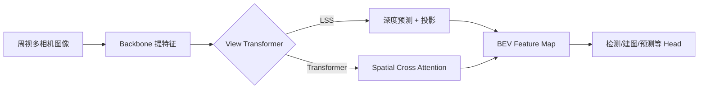

# 2.2.2 BEV 感知技术 (Bird's Eye View)

BEV (Bird's Eye View，鸟瞰图) 被誉为自动驾驶感知的“上帝视角”。它将来自多个摄像头（通常是周视 6 摄）的图像信息统一转换到一个 3D 的 BEV 空间坐标系中。

---

## 1. 为什么 BEV 是目前的量产主流？

在 BEV 出现之前，自动驾驶系统通常在图像空间（Perspective View）做检测，这导致了以下痛点：
- **遮挡严重**：前车遮挡后车，图像空间难以处理。
- **空间不一致**：多个摄像头之间的物体难以跨相机匹配（比如侧前方车在两个相机各出一半）。
- **规划不友好**：下游的规划算法是在 3D 空间操作的，BEV 特征直接对齐了规划输入。

---

## 2. 核心技术：视图转换 (View Transformer)

如何将 2D 图像特征“投影”到 3D 空间？这是 BEV 的核心难点。

### 2.1 LSS (Lift, Splat, Shoot) —— 几何派鼻祖
LSS 提出了一种显式的深度估计方案：
1.  **Lift (提升)**：为每个像素预测一个深度分布（Categorical Depth），将像素从 2D “拉伸”成一条带有权重的 3D 射线。
2.  **Splat (泼洒)**：将这些射线投影到 BEV 栅格中。
3.  **Shoot (射击)**：利用卷积处理 BEV 特征，输出检测结果。

### 2.2 BEVFormer —— Transformer 派
利用 Transformer 的 **Attention** 机制来查询空间信息：
- **Spatial Cross-Attention**：预设一组 3D 查询向量 (Queries)，去“询问”图像中哪个位置的特征与我相关。
- **Temporal Self-Attention**：融合历史帧信息，解决物体遮挡和速度预测问题。

### 2.3 PETR —— 位置编码派
通过引入 **3D Position Embedding**，不需要显式的深度转换，直接在 3D 空间中建模特征，架构极简且优雅。

---

## 3. BEV 的关键优势

1.  **多相机融合**：天生具备多目融合能力，彻底解决了跨相机重叠区物体截断的问题。
2.  **时序建模**：BEV 空间是一个稳定的全局坐标系，方便引入过去多帧的信息（时序聚合），大幅提升了感知稳定性。
3.  **异形物体处理**：BEV 结合 Occupancy 可以很好地处理没有定义的障碍物。

---

## 4. 经典架构图示 (Mermaid)

---

## 📚 推荐资源

- **代码库**：[BEVFormer 官方仓库](https://github.com/fundamentalvision/BEVFormer)
- **必读论文**：
    - *Lift, Splat, Shoot: Encoding Images from Arbitrary Camera Rigs by Virtual Synthesis*
    - *BEVFormer: Learning Bird's-Eye-View Representation from Multi-Camera Images via Spatiotemporal Transformers*
- **推荐视频**：[BEV 感知全系列通俗讲解](https://example.com/bev-tutorial)
