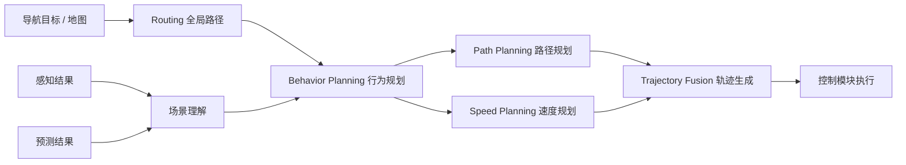

# 3.1 规则型算法

规则型规划（Rule-based Planning）是自动驾驶规划系统中最经典、也最具工程可落地性的路线之一。它的核心思想并不神秘：**把道路结构、车辆动力学约束、交通法规和人为设计的驾驶逻辑显式写进系统里，再从候选方案中选择一个“安全、可行、舒适、效率尚可”的动作序列。**

它回答的不是“图像里有什么”这类感知问题，而是另外几类更接近驾驶本质的问题：

- 车应该往哪里走。
- 遇到障碍物应该怎么绕。
- 面对汇入、跟车、让行、超车时应该如何决策。
- 在满足安全约束的前提下，怎样生成一条平顺、可被控制器执行的轨迹。

**可以把规则型规划理解为“把驾驶经验翻译成结构化约束与代价函数”的过程。它不一定最聪明，但往往最可解释、最可验证、最方便做安全边界管理，因此直到今天，绝大多数量产自动驾驶系统仍然离不开规则型规划。**

> [!TIP]
> **如果说感知在回答“世界里发生了什么”，那么规划就在回答“在这个世界里，我下一步准备怎么行动”。规则型规划的价值不在于像人一样思考，而在于把系统行为尽可能约束在一个可分析、可测试、可复现的范围内。**

---

## 1. 规则型规划在自动驾驶中的职责

在典型自动驾驶系统中，规划模块位于感知、预测之后，控制之前。它并不直接识别障碍物，也不直接输出油门和方向盘控制量，而是承担中间层的“驾驶意图组织与轨迹生成”职责。

从功能上看，它通常负责以下几件事：

- 根据导航任务确定总体行驶方向，例如该走哪条路、何时需要变道准备匝道出口。
- 根据周围交通参与者和地图约束做行为决策，例如跟车、停车、借道、绕障、让行。
- 在满足车辆运动学和动力学约束的前提下，生成一条几何上连续、时间上平滑的可执行轨迹。
- 将规划结果以路径点、速度曲线或时空轨迹的形式交给控制模块执行。

规则型规划之所以长期存在，主要有以下几个原因：

- **可解释性强**：为什么停车、为什么减速、为什么换道，通常都能从规则或代价项中追溯出来。
- **安全边界清晰**：最小安全距离、最大曲率、最大纵向加速度等约束可以被显式编码。
- **验证相对直接**：针对具体场景可以设计回归测试、仿真集和规则覆盖测试。
- **工程分层明确**：地图、预测、行为决策、轨迹规划、控制可以各自迭代。

但它也天然存在边界：

- 规则覆盖有限，复杂交互场景容易出现策略僵化。
- 代价函数与阈值需要大量人工调参。
- 面对长尾场景时容易产生“补丁式”逻辑膨胀。

从自动驾驶系统角度看，规则型规划不是“过时方案”，而更像是一个**稳定、可靠、可控的工程基线**。

---

## 2. 基础概念与规划流水线

### 2.1 规划系统通常如何分层

一个完整的规则型规划系统，通常至少可以拆成下面 4 层：

1. **Routing（全局路径规划）**  
   在高精地图或导航拓扑图上，确定从起点到终点的道路级路径。

2. **Behavior Planning（行为规划）**  
   在局部场景中决定当前驾驶策略，例如保持车道、跟车、停车等待、变道超车、绕行障碍物。

3. **Path Planning（路径规划）**  
   生成空间上的几何路径，关注“往哪里走”，例如横向偏移、绕障形状、曲线连续性。

4. **Trajectory Planning（轨迹规划）**  
   在路径基础上进一步加入时间和速度维度，关注“什么时候走到哪里”，最终得到时空轨迹。

很多资料会把后两层合称为 `Motion Planning`。这样的合并在概念上没有问题，但从工程实现角度，**把路径和速度分开处理**往往更有利于结构化问题建模，尤其是在道路场景中。

这个分层本质上是在降低问题复杂度。因为“驾驶”如果一次性直接求解，往往是高维、强约束、强交互、实时性要求极高的问题。分层之后，每一层只需要处理自己最关键的决策。

### 2.2 一个规划器到底在做什么

从更操作化的角度看，一个规则型规划器往往同时在做下面几件事：

1. **接收输入**：地图、参考线、感知障碍物、预测轨迹、交通规则、自车状态。
2. **构造搜索空间或优化空间**：例如网格图、状态格、Frenet 采样空间、ST 图。
3. **定义约束**：碰撞约束、道路边界约束、车辆曲率约束、加速度约束、红灯停车线约束等。
4. **定义代价函数**：偏离车道中心代价、接近障碍物代价、轨迹不平滑代价、变道代价、低效率代价等。
5. **生成候选方案**：通过搜索、采样或迭代优化得到一批可行路径/轨迹。
6. **选择最优结果**：在满足硬约束前提下，选出总代价最低的方案。

这和 2D 目标检测里“特征提取 + 候选建模 + 分类回归 + 后处理”的流程有点像：**规划系统也不是一步做完，而是在候选空间中逐步缩小搜索范围。**

### 2.3 Cartesian 与 Frenet 坐标系

在道路场景中，直接在笛卡尔坐标系（Cartesian）里做规划当然可以，但往往不够自然。因为车辆不是在空旷平面中随意移动，而是大多沿着道路中心线附近行驶。

因此很多规则型规划系统会引入 **Frenet 坐标系**：

- $s$：沿参考线前进方向的纵向坐标。
- $l$：相对参考线的横向偏移。

这样做的好处是：

- 跟车、超车、借道、回正等行为可以更自然地表述为纵向与横向问题。
- 障碍物位置可以投影到参考线附近，方便判断其“在前方多远、离本车道多偏”。
- 很多局部规划问题能从二维耦合问题，转化为更容易处理的纵横向分解问题。

例如：

- “前方 25 米有慢车”可以表述为 `s` 方向上的约束。
- “向左借 0.8 米绕开路边施工锥桶”可以表述为 `l` 方向上的偏移。

当然，Frenet 也不是万能的。它通常更适合**结构化道路场景**，如果到了停车场、广场、狭窄非规则空间，参考线本身就可能不稳定，这时 Frenet 表达会变得别扭。

> [!TIP]
> **Frenet 坐标系的本质，不是数学花样，而是一种“顺着道路思考问题”的表达方式。只要道路结构明显，它就往往比直接在平面直角坐标里搜索更高效。**

### 2.4 参考线、障碍物投影与时空解耦

规则型规划里还有三个很重要的工程概念：

- **参考线（Reference Line）**：当前车道或目标车道的中心线，是很多局部规划的基准。
- **障碍物投影（Obstacle Projection）**：把障碍物投影到参考线或 ST 图中，得到其相对位置关系。
- **时空解耦（Path-Speed Decoupling）**：先规划空间路径，再规划速度曲线，或者交替迭代求解两者。

时空解耦尤其重要。因为完整轨迹本质上是“位置随时间变化”的函数，如果一步求解，维度和约束都会迅速膨胀。先把“绕不绕、往哪绕”解决，再去做“快一点还是慢一点”，通常更利于实时实现。

---

## 3. 经典方法谱系：为什么会发展成现在这样

### 3.1 图搜索思想：Dijkstra 与 A*

在最基础层面，规划可以被看作一个搜索问题：从起点状态出发，在允许的状态转移中找到一条代价最小的路径。

- **Dijkstra**：不依赖启发式函数，系统性地扩展当前累计代价最小的节点，最终能找到全局最优路径。
- **A\***：在累计代价 `g(n)` 基础上，加入到目标点的启发式估计 `h(n)`，通过

$$
f(n) = g(n) + h(n)
$$

来优先扩展“看起来更接近终点”的节点。

它们解决的问题是：**在离散图或网格图中，如何高效找到一条从起点到终点的低代价路径。**

典型流程可以概括为：

1. 建图或栅格化环境。
2. 从起点开始扩展可达节点。
3. 维护 `open set` 和 `closed set`。
4. 根据代价不断更新父节点与最优路径。
5. 到达目标后回溯得到最终路径。

它们的优势是：

- 思路清晰，实现直接。
- 适合做全局路径搜索。
- 容易把地图障碍、静态代价编码进去。

它们的局限是：

- 通常默认点质量模型，不考虑车辆转弯半径、朝向连续性等约束。
- 栅格分辨率一高就会带来较大搜索开销。
- 对道路车辆而言，搜索出的折线结果往往还需要进一步平滑。

所以，Dijkstra 和 A* 更像是规则型规划的起点，而不是量产轨迹规划的终点。

### 3.2 Hybrid A*：把车辆运动学约束带进搜索

普通 A* 最大的问题在于，它找到的路径未必是“车能开过去的路径”。例如在狭窄场景中，网格上的折线路径可能要求车辆瞬间改变朝向，这显然不符合非完整约束车辆的运动规律。

**Hybrid A\*** 的核心改进，就是把状态从二维位置 `(x, y)` 扩展为包含航向角的连续状态，例如 `(x, y, \theta)`，并在节点扩展时使用一组符合车辆模型的 motion primitives。

它解决的问题是：

- 让搜索过程显式考虑最小转弯半径、前进/倒车切换、方向连续性。
- 使搜索结果更接近“可直接被车辆执行”的路径。

简化理解下，它的工作流是：

1. 用车辆运动学模型定义可扩展动作。
2. 在离散搜索框架中扩展连续姿态状态。
3. 加入倒车惩罚、换向惩罚、曲率惩罚等代价项。
4. 搜索到目标附近后，常配合解析连接或平滑优化得到最终路径。

它的典型代价设计常包括：

- 路径长度代价。
- 倒车代价。
- 方向切换代价。
- 曲率或曲率变化代价。
- 距离障碍物过近代价。

Hybrid A* 的优势非常明显：

- 对停车、掉头、窄路会车等低速复杂机动很有效。
- 结果比普通 A* 更符合车辆可行驶性。
- 兼顾了一定搜索全局性与运动学约束。

但它也有现实问题：

- 搜索维度更高，计算量显著上升。
- 在高速结构化道路中，不一定是最高效的选择。
- 最终路径仍常需后续平滑与速度规划配合。

> [!TIP]
> **Hybrid A* 很适合用来理解“规划不是几何画线，而是受车辆本体约束的可执行路径设计”。在泊车和窄空间 maneuver 中，它的重要性尤其高。**

### 3.3 Frenet + Lattice Planning：道路场景中的结构化采样

当场景从停车场切换到城市道路或高速道路时，问题特点发生了变化：

- 道路结构更明显。
- 自车大部分时间沿参考线附近行驶。
- 决策重点从“能不能过去”逐渐转为“怎么在交通流中更平顺地过去”。

这时候，**Lattice Planning（格点/采样规划）** 往往比纯状态搜索更自然。

它的核心思想是：

- 在 Frenet 空间中围绕参考线采样一批候选终点或候选轨迹。
- 用多项式、样条曲线等方法生成满足边界条件的候选路径。
- 对每条候选路径做碰撞检测和代价评估。
- 选择最优可行解。

它解决的问题是：

- 在结构化道路中高效生成一组“像人开的”候选路径。
- 将横向偏移、纵向进度、回到车道中心等驾驶偏好自然编码进代价函数。

一个常见的简化版流程是：

1. 选定当前参考线。
2. 在若干纵向距离和横向偏移位置上采样终点。
3. 生成满足起终状态约束的候选曲线。
4. 剔除与障碍物碰撞或超出道路边界的路径。
5. 用代价函数对剩余候选排序。

典型代价项可能包括：

- 偏离参考线中心代价。
- 横向加速度和曲率变化代价。
- 与静态/动态障碍物的安全距离代价。
- 变道代价或借道代价。
- 轨迹长度与效率代价。

Lattice Planning 的优势在于：

- 很适合结构化车道场景。
- 候选集可控，工程实现清晰。
- 容易把舒适性和驾驶风格显式写进代价函数。

它的局限在于：

- 采样不充分可能漏掉可行解，采样过密又会影响实时性。
- 对参考线质量比较敏感。
- 面对强交互动态场景时，仅靠静态采样可能不够。

### 3.4 EM Planner：路径与速度的交替优化

在自动驾驶规划工程中，`EM Planner` 是一个很有代表性的思路。这里的 “EM” 并不一定要严格理解成统计学习里那个标准化的 Expectation-Maximization 算法，而更适合理解为一种**交替迭代、逐步逼近可行解的工程范式**。

它的核心思想是：

- 先在路径空间里基于障碍物和道路边界找到一条较优路径；
- 再在速度空间里基于时空约束找到一条较优速度曲线；
- 然后利用更新后的结果继续反过来约束另一侧，进行迭代优化。

它解决的问题是：

- 动态障碍物使“路径”和“速度”强耦合，单独做其中一项都可能不够。
- 直接联合优化复杂度过高，而交替求解能在工程上取得较好平衡。

在实际系统中，常见表示方式包括：

- 在 SL（纵向-横向）空间处理路径边界与绕障问题。
- 在 ST（距离-时间）空间处理跟车、让行、超车、停车等速度决策问题。

EM Planner 的优势是：

- 工程结构清晰，容易与地图、预测、行为规划模块配合。
- 对道路场景中的路径-速度解耦很实用。
- 能较好地融合“规则约束 + 代价优化”两种思路。

它的难点也很实际：

- 路径和速度并非真正独立，交替优化未必能得到全局最优。
- 预测误差会直接影响 ST 约束质量。
- 代价设计和边界处理稍有不当，就可能出现保守、犹豫或振荡。

> [!TIP]
> **很多成熟规划系统并不是依赖单一“神奇算法”，而是把搜索、采样、边界构造、速度优化、规则过滤组合在一起。EM Planner 体现的正是这种工程组合思维。**

---

## 4. 规则型规划中的关键工程问题

这一节往往比“算法名字”本身更重要。因为在真实自动驾驶系统中，决定体验差异的，常常不是用了 A* 还是 Lattice，而是**约束怎么建、代价怎么配、动态障碍怎么处理、系统如何避免抖动和僵死**。

### 4.1 约束建模：什么不能做

规划中的硬约束通常包括：

- **碰撞约束**：轨迹不能穿过障碍物占据区域。
- **道路边界约束**：不能越出可通行区域，除非显式允许借道。
- **车辆运动学约束**：曲率不能过大，转向变化不能超出底盘能力。
- **动力学约束**：加速度、减速度、jerk 不能过于激烈。
- **交通规则约束**：红灯、停车线、限速、禁止变道区域等必须满足。

这些约束中，前几类更多是“物理做不到”，后几类则更多是“法规或策略上不允许”。规则型规划的一个关键优点，就是这两类约束都能被显式表达。

### 4.2 代价函数设计：在多个“都不错”的方案里怎么选

一条规划轨迹往往不是“唯一可行”，而是在很多可行方案中选一个更合适的。于是代价函数就变成了规则型规划的核心。

常见代价项包括：

- **安全性代价**：离障碍物太近、切入风险高、与预测轨迹冲突时惩罚增加。
- **舒适性代价**：横向加速度过大、jerk 过大、曲率变化剧烈时惩罚增加。
- **效率代价**：过慢、停滞、无必要等待、绕行过远都会带来代价。
- **可执行性代价**：过于激进的轨迹可能控制难度高，也应被惩罚。
- **行为一致性代价**：频繁变道、刚决定借道又立即回正，会被视为不稳定。

真正困难的地方不在于“列出这些项”，而在于**不同代价之间如何权衡**。例如：

- 安全权重太高，系统可能过度保守，通行效率很差。
- 效率权重太高，系统可能出现激进并线或过晚减速。
- 舒适性权重太高，系统可能宁可停住也不愿做必要机动。

这也是为什么规则型规划经常需要大量仿真调参与路测迭代。

### 4.3 动态障碍物处理：最难的不只是“绕开”，而是“判断对方会怎么动”

静态障碍物处理相对直接，因为其占据区域基本固定；动态障碍物则完全不同。规划系统需要结合预测模块输出，推断：

- 前车会不会继续减速。
- 邻车会不会加塞。
- 行人是否准备横穿。
- 对向来车是否会影响借道时机。

规则型规划面对动态障碍物时，常用的工程手段包括：

- 在 ST 图中表达障碍物的可占据时空区域。
- 设置跟车时距、安全缓冲区和让行规则。
- 通过行为层先确定“跟”“让”“绕”“停”的大方向，再由轨迹层细化。

这里最大的风险是：**预测不准，规划就容易失真。**  
因此，成熟系统往往不会盲信某一条预测轨迹，而是加入保守边界、多假设评估或安全冗余。

### 4.4 多解选择与轨迹抖动

规则型规划常见一个工程问题：每一帧重规划时，候选方案都略有变化，如果系统总是贪心地选当前最优解，就可能产生：

- 轨迹左右轻微摆动。
- 变道意图反复横跳。
- 绕障方案来回切换。
- 控制层收到不连续参考轨迹。

这类问题通常被称为**规划抖动（planning jitter）**或决策不稳定。

常见缓解手段包括：

- 对行为状态加入滞回机制（hysteresis）。
- 对变道、借道、超车等行为设置最小持续时间。
- 在代价函数中加入与上一帧结果的连续性约束。
- 对候选解做时序平滑，而不是每帧完全重来。

很多时候，用户感知到的“这车开得像不像人”，其实和这个问题高度相关。

### 4.5 结构化道路与非结构化场景差异

规则型规划在高速和城市车道内表现通常更好，因为这里有稳定的：

- 车道线
- 中心线
- 限速规则
- 交通流方向

但一旦到了停车场、工地、无保护左转混乱路口、临时改道区域，很多前提都会被削弱。此时会出现：

- 参考线难定义。
- 他车行为不规范。
- 候选空间更大，规则更难写全。

所以规则型规划并不是“所有场景同一种套路”。很多系统会在结构化与非结构化区域使用不同规划模式，甚至切换不同子模块。

### 4.6 长尾场景与规则爆炸

规则型规划最大的长期挑战之一，是**规则爆炸（rule explosion）**。

每当系统在某个边缘场景出错，最自然的工程反应往往是“补一条规则”。短期有效，但长期可能造成：

- 条件分支越来越多。
- 规则之间相互冲突。
- 局部修复破坏全局一致性。
- 维护和调试成本越来越高。

这也是为什么后来越来越多研究开始尝试把学习方法引入规划层，用数据去补足显式规则不擅长覆盖的长尾交互。

---

## 5. 规则型与学习型规划的边界

规则型规划和学习型规划并不是简单的“旧技术”和“新技术”关系，更像是两类不同的能力分配方式。

规则型规划擅长：

- 显式表达安全边界和法规约束。
- 在确定性较强的场景里稳定输出。
- 做工程验证、故障复现和回归测试。

学习型规划擅长：

- 从数据中提炼复杂交互模式。
- 处理难以手写规则覆盖的长尾驾驶行为。
- 在端到端建模中减少人工特征与人工规则设计。

规则型规划的弱点主要在于：

- 难以完整编码人类驾驶中的隐性博弈与社会默契。
- 面对复杂交互时可能显得保守或僵硬。
- 需要大量人工维护规则和代价。

因此，在很多现实系统中，二者并不是互斥关系，而可能形成互补：

- 用学习模块做预测、场景理解或候选生成。
- 用规则型规划做安全约束、可解释决策与最终裁决。

这也是下一节 [3.2_学习型算法.md](./3.2_学习型算法.md) 要讨论的问题背景。

> [!TIP]
> **可以把规则型规划看作“会开得稳、会守规矩”，把学习型规划看作“更可能学会复杂交互经验”。真正成熟的系统，往往是在可控性与泛化能力之间找平衡。**

---

## 6. 评估指标、工程选型与学习路径

### 6.1 规划系统看什么指标

规划模块的评估方式和感知任务很不一样，它更关注轨迹是否真的适合拿去开。

- **安全性**：碰撞率、最小障碍物距离、违规率、闯红灯/压线等约束违反情况。
- **舒适性**：纵向加速度、横向加速度、jerk、曲率变化是否平滑。
- **效率**：平均速度、任务完成时间、拥堵中通过率、无谓等待时间。
- **稳定性**：轨迹连续性、重规划抖动、行为切换频率。
- **实时性**：单周期规划时延、最坏情况时延、CPU/GPU 占用。

对于量产系统来说，一个“理论上更优”的方法，如果无法稳定满足实时性，也很难真正落地。

### 6.2 常见规则型方法对比

| 方法 | 核心思想 | 主要优势 | 主要局限 | 典型适用场景 |
| :--- | :--- | :--- | :--- | :--- |
| **Dijkstra / A\*** | 图搜索与启发式搜索 | 结构清晰、全局路径搜索直接 | 不天然考虑车辆运动学，结果常需平滑 | 全局路径、静态地图搜索 |
| **Hybrid A\*** | 搜索中加入航向与车辆约束 | 可行驶性更强，适合窄空间 maneuver | 计算量更高，高速道路未必最优 | 泊车、掉头、狭窄区域低速规划 |
| **Lattice Planning** | 在 Frenet 空间采样候选轨迹并打分 | 结构化道路中高效、易融入舒适性偏好 | 依赖采样设计与参考线质量 | 城市道路、高速跟车、绕障、变道 |
| **EM Planner** | 路径与速度交替优化 | 工程组合能力强，适合复杂约束整合 | 依赖预测与代价设计，未必全局最优 | 成熟自动驾驶栈中的局部规划主线 |

这个表格有一个很重要的启示：**规划算法并不是谁“先进”谁就全面替代谁，而是不同方法擅长不同问题形态。**

### 6.3 一个推荐的学习顺序

如果你是第一次系统学习自动驾驶规划，比较推荐按下面顺序推进：

1. 先理解规划系统分层：Routing、Behavior、Path、Trajectory 各自做什么。
2. 学懂 A* 与 Dijkstra，建立“规划就是搜索/优化”的基本认识。
3. 学懂 Frenet 坐标系和参考线，理解为什么道路规划喜欢做坐标变换。
4. 学 Hybrid A*，理解运动学约束为何重要。
5. 学 Lattice Planning，理解采样、候选轨迹与代价函数。
6. 学 ST 图和路径-速度解耦，再看 EM Planner 这类工程系统。
7. 最后再进入学习型规划，理解为什么规则型方法会在长尾场景遇到困难。

### 6.4 推荐项目与资料

- [Apollo](https://github.com/ApolloAuto/apollo)：工业级自动驾驶系统，规划模块很有代表性。
- [PythonRobotics](https://github.com/AtsushiSakai/PythonRobotics)：用可视化示例讲清经典规划算法，非常适合入门。
- [Autoware](https://github.com/autowarefoundation/autoware)：开源自动驾驶软件栈，可参考其规划与行为模块设计。

### 6.5 小结与实践建议

规则型规划值得长期学习，不只是因为它“经典”，更因为它训练的是一种非常重要的工程能力：**把驾驶行为拆成可表示、可约束、可优化、可验证的问题。**

对初学者来说，建议始终带着下面几个问题去读算法：

1. 这个方法到底在解决哪一层规划问题？
2. 它的搜索空间或优化空间是什么？
3. 它显式处理了哪些约束，又忽略了哪些约束？
4. 它为什么适合某些场景，却不适合另一些场景？
5. 如果放进真实自动驾驶系统里，它最可能卡在什么工程问题上？

当你能把这些问题讲清楚时，规则型规划就不再只是“会背几个算法名”，而是真正进入了自动驾驶规划系统的工程语境。
