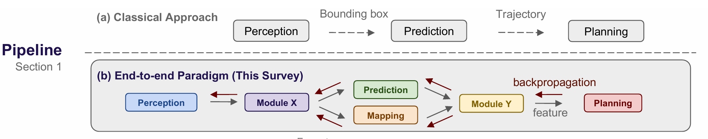
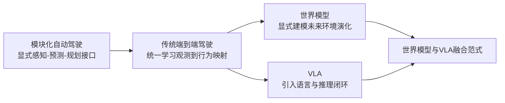
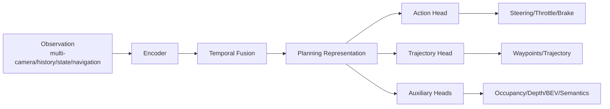
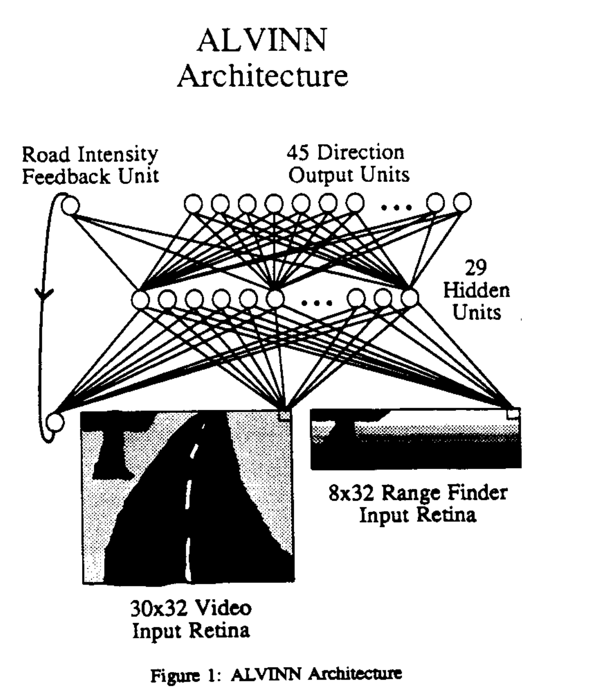
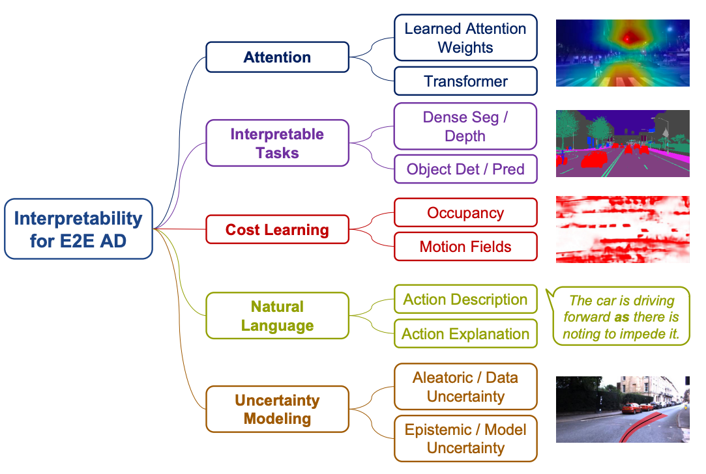
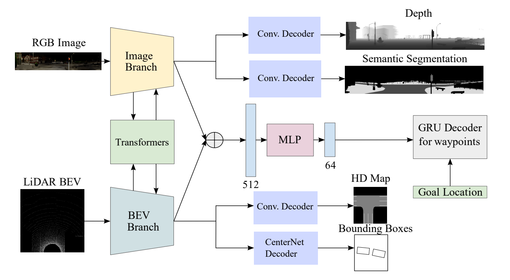
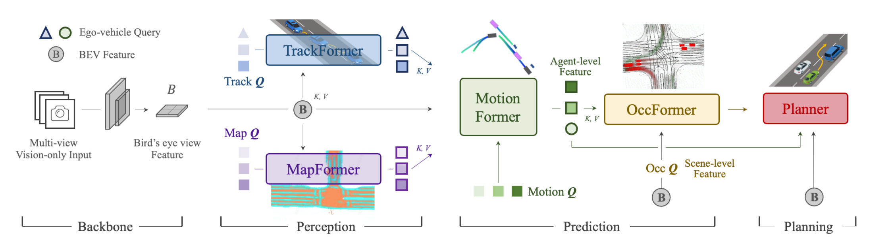
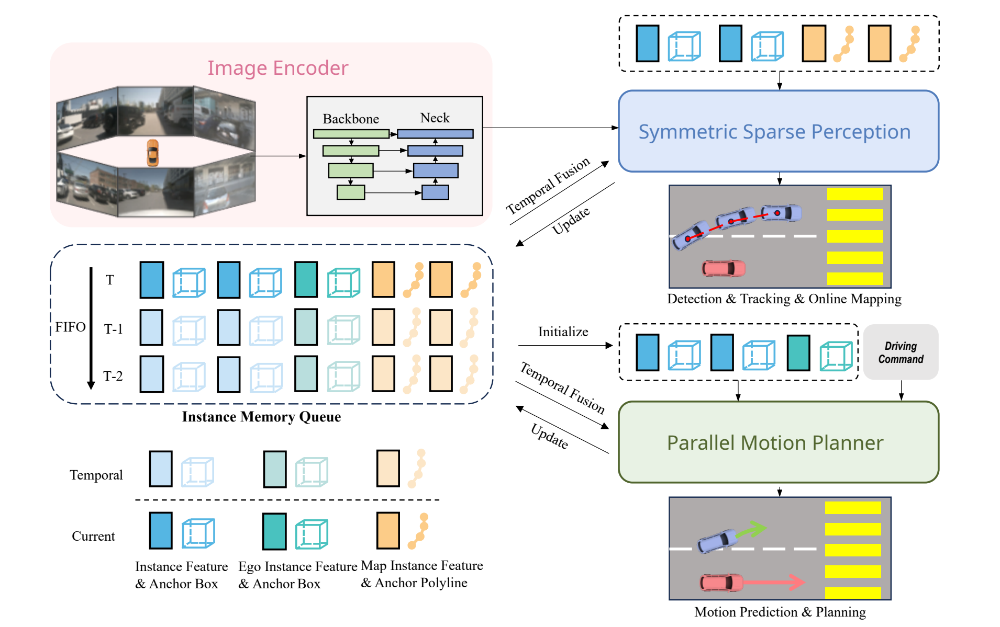
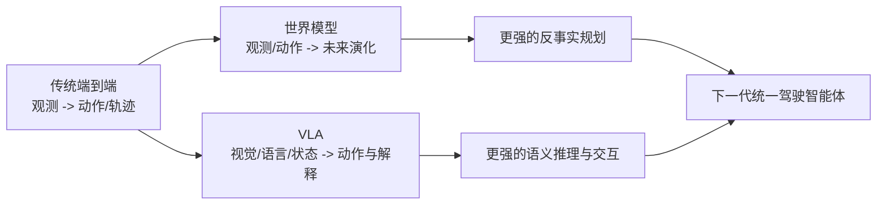

# 4.1 传统端到端自动驾驶

在自动驾驶的发展史里，端到端方法一直是一个极具吸引力、又极具争议的方向。它吸引人的地方在于：如果一个模型能够直接从传感器观测中学习到驾驶行为，那么大量手工设计的模块接口、规则拼接和代价函数调参，也许都可以被更统一的数据驱动范式替代。它有争议的地方在于：自动驾驶不是一个“把图像分类做得更准一点”的问题，而是一个高安全、强闭环、强交互、强长尾的问题。于是，端到端驾驶很早就提出了一个根本性问题：

> **自动驾驶到底能不能被建模为“从观测到动作”的统一映射？如果能，这个映射学到的究竟是控制、规划，还是更深层的隐式世界结构？**

本节不讨论后续引入语言推理的 `VLA` 范式，也不讨论显式未来生成的世界模型，而是聚焦于**传统/经典端到端自动驾驶**：即从传感器、状态和导航先验出发，直接预测控制量、轨迹或规划变量的学习式驾驶系统。你可以把它理解为从模块化驾驶迈向“大一统驾驶模型”的第一阶段。

`End-to-end` 可以粗略理解为两条主线的演进：

1. **直接动作回归/经典 imitation learning 路线**：强调从观测直接学习控制或轨迹。
2. **带中间结构或多任务约束的端到端路线**：仍然端到端训练，但引入 BEV、可行驶区域、目标点、占用、辅助任务等软结构，提高泛化与闭环稳定性。

本章读完之后，你需要回答下面几个问题：

- 端到端驾驶和模块化驾驶到底区别在哪？
- 端到端方法到底在学什么？
- 为什么很多方法最后又重新引入中间表征？
- 为什么开环误差小，不一定意味着闭环表现好？
- 为什么这一方向会很自然地走向世界模型与 `VLA`？

---

## 1. 定义、边界与问题背景

### 1.1 什么是传统端到端自动驾驶

在本章中，我们把“传统端到端自动驾驶”定义为：

> **用一个统一的可学习系统，把传感器观测、历史上下文和导航先验，直接映射为控制量、轨迹或规划相关输出，而不再依赖人工串联的完整感知-预测-规划接口。**

这里的“端到端”有两个常见误解，需要先澄清：

- **误解一：端到端等于只输入单目图像，只输出转角和油门。**  
  这只是最早期、最简形式的一种实现。现代端到端方法通常输入多相机、历史帧、车速、导航目标，输出也常常是未来轨迹、waypoints、BEV occupancy 或 planning tokens，而不是裸控制量。
- **误解二：端到端等于完全没有结构。**  
  真正成功的现代方法，很少是“纯黑盒无结构”的。它们往往只是**减少人工模块边界**，但会通过网络结构、辅助任务、监督设计、时序建模和安全约束，重新引入归纳偏置。

### 1.2 它与模块化自动驾驶的本质差异

模块化系统通常把自动驾驶拆成：

- 感知：检测、分割、跟踪、地图理解
- 预测：其他交通参与者未来行为
- 规划：行为决策、轨迹生成、代价优化
- 控制：转角、油门、制动执行

  

 

端到端系统则试图把其中一部分甚至大部分链路收拢到统一模型中。两者的差异，不只是“模块数量不同”，更是**建模哲学不同**：

- 模块化系统强调**显式分解**、可解释接口和工程可控性。
- 端到端系统强调**联合优化**、隐式表示学习和数据驱动对齐。

### 1.3 为什么端到端方法会持续出现

端到端驾驶反复成为热点，是因为模块化系统长期面临几个结构性问题：

- 中间接口可能丢信息：检测框、语义 mask、规则标签不一定保留了规划真正需要的全部信息。
- 误差逐级传递：上游小偏差可能在后续链路被放大。
- 手工规则扩张严重：复杂交互和长尾场景很难靠规则穷举。
- 模块目标与最终驾驶目标不一致：感知指标变好，不一定闭环驾驶变好。

端到端方法的核心吸引力，正是希望通过**面向最终驾驶目标的联合学习**，缓解这些问题。

### 1.4 与世界模型、VLA 的边界

为了避免概念混淆，可以先看看下面这张表。
**但我希望你在对这个领域有所了解后忘了它，因为他们其实互相耦合，很难严格区分**

| 范式 | 主要输入 | 主要输出 | 核心能力 | 是否强调未来生成 | 是否引入语言闭环 |
|---|---|---|---|---|---|
| 模块化自动驾驶 | 多传感器 + 地图 | 感知结果、预测、轨迹、控制 | 显式任务分解与工程可控 | 否 | 否 |
| 传统端到端驾驶 | 观测 + 历史 + 导航先验 | 控制、轨迹、规划变量 | 统一学习观测到驾驶行为的映射 | 通常不显式强调 | 否 |
| 世界模型 | 观测 + 动作 + 状态 | 未来状态、未来特征、未来视频/latent | 环境演化建模与反事实预测 | 是 | 否 |
| `VLA` | 视觉 + 语言 + 状态 | 动作、策略、解释、规划指令 | 语言引导决策与推理闭环 | 可有可无 | 是 |

这也是本章与后续章节的分工：

- `4.1` 关注“从观测到动作/轨迹”的端到端映射；
- `4.2` 关注“未来如何演化”的世界建模；
- `4.3` 关注“语言如何进入决策闭环”的 `VLA`。

---

## 2. 统一问题建模：端到端到底在学什么

### 2.1 输入、输出与目标函数

从数学上看，传统端到端驾驶可以被抽象为：

$$
\pi_\theta : (o_{\le t}, h_t, n_t) \mapsto y_t
$$

其中：

- $o_{\le t}$ 表示当前及历史观测，可能包含多相机图像、激光雷达表示、BEV 特征等；
- $h_t$ 表示历史状态，如车速、航向角、历史轨迹、时序记忆；
- $n_t$ 表示导航或高层意图先验，如 route command、goal point、lane-level instruction；
- $y_t$ 则可能是控制、轨迹、占用或其他规划相关变量。

常见目标可以写成两类：

$$
p(a_t \mid o_{\le t}, n_t, h_t)
$$

或

$$
p(\tau_t \mid o_{\le t}, n_t, h_t)
$$

其中：

- $a_t$ 是瞬时动作，如 steering、throttle、brake；
- $\tau_t$ 是未来轨迹或一组 waypoints，通常更稳定、更接近规划语义。

### 2.2 现代端到端常见输入

早期方法常使用单帧前视相机，但现代方法更常见的输入已经明显更加丰富：

- 多相机环视图像
- 历史多帧时序输入
- 自车状态：速度、加速度、航向角
- 导航信息：高层 turn command、goal point、route polyline
- 可选先验：粗地图、局部 BEV、历史目标点

### 2.3 常见输出形式

输出形式决定了模型到底更像“控制器”还是“规划器”。

| 输出形式 | 典型内容 | 优点 | 局限 |
|---|---|---|---|
| 直接控制 | 转角、油门、刹车 | 链路最短，概念最纯粹 | 对噪声敏感，监督不稳定，闭环脆弱 |
| **Waypoints/轨迹点**（核心） | 未来若干时刻位置点 | 更贴近规划语义，更易稳定训练 | 还需要下游控制器追踪 |
| 规划变量 | 目标点、可行驶区域、占用、成本图 | 引入结构偏置，利于泛化 | 已经不再是“纯黑盒” |
| 混合输出 | 轨迹 + 辅助任务 + 控制 | 常带来更强闭环表现 | 设计复杂，调参与数据要求高 |

### 2.4 监督信号从哪里来

端到端模型虽然减少了人工模块接口，但并不等于可以摆脱监督设计。常见监督来源包括：

- **行为克隆（Behavior Cloning）**：用人类驾驶或专家规划器的动作/轨迹作为标签。
- **辅助任务监督**：语义分割、深度、可行驶区域、占用、碰撞风险等。
- **自监督时序约束**：跨帧一致性、时序特征预测、对比学习。
- **闭环奖励或仿真优化**：通过 RL、offline RL 或 planner-in-the-loop 方式优化长期行为。

这里可以把几类信号的分工理解得更清楚一些：

- `Behavior Cloning` 主要回答“专家在这个状态下通常怎么开”，因此更像是**单步监督学习**；
- `RL` 更关注“这一路开下来总效果好不好”，因此优化的是**长期累计回报**，而不是某一帧和标签是否完全一致；
- `offline RL` 则介于两者之间：它不要求车辆在线危险探索，而是尽量利用已有驾驶日志，在更强安全约束下学习长期行为改进；
- `planner-in-the-loop` 常常扮演折中角色：让学习系统既保留数据驱动能力，又能通过规划器或仿真器提供闭环修正信号。

端到端的关键是**不再把中间结构当成固定硬接口，而是把它们变成可学习、可软约束、可联合优化的内部结构。**

---

## 3. 方法主线一：直接动作回归与经典 imitation learning

这一主线最接近大家对“端到端驾驶”的原始印象：输入视觉观测，直接输出控制或路径。它也是 `End-to-end` 最基础的一条路线。

### 3.1 基本思想

这一路线假设：

- 驾驶行为可以由数据中的专家示范提供监督；
- 模型可以从高维观测中直接学习状态到动作的映射；
- 如果数据足够多、模型足够强，那么许多难以手写的隐式规则也可以被吸收到参数中。

最经典的训练形式是行为克隆：

$$
\mathcal{L}_{BC} = \sum_t \ell(\hat{a}_t, a_t^\ast)
$$

或轨迹回归：

$$
\mathcal{L}_{traj} = \sum_t \ell(\hat{\tau}_t, \tau_t^\ast)
$$

其中 $a_t^\ast$ 或 $\tau_t^\ast$ 来自人类驾驶或专家系统。

但这套范式有一个天然边界：它擅长学“专家此刻做了什么”，却不一定擅长学“如果我已经有点偏了，接下来该怎么恢复”。一旦部署时进入训练集中较少出现的状态，模型就容易暴露出三个问题：

- **分布偏移**：训练时主要看到专家轨迹附近的状态，测试时却会遇到自己动作诱发的新状态；
- **恢复能力弱**：专家数据往往很少包含“犯错后如何救回来”的样本，因此模型缺乏纠偏经验；
- **单步拟合不等于长期最优**：某一时刻动作看起来很像专家，不代表几秒之后依然安全、平顺、符合导航意图。

也正因如此，很多端到端系统在 `Behavior Cloning` 打底之后，会进一步引入闭环训练、仿真扰动恢复，或用 `RL`/`offline RL` 去补足长期回报优化能力。

### 3.2 代表性工作

#### `ALVINN`

`ALVINN` 是极早期的代表性工作。今天看它的网络并不复杂，但它的重要意义不在于性能，而在于提出了一个后来被不断重复验证的思想：

> **驾驶中的部分策略映射，可以通过示范学习获得，而不必全部显式手写。**

它更像一个思想起点，而不是现代工程答案。

  

- [ALVINN论文链接](https://kilthub.cmu.edu/articles/journal_contribution/ALVINN_an_autonomous_land_vehicle_in_a_neural_network/6603146/1?file=12093479)
 

#### `PilotNet`

NVIDIA 的 `PilotNet` 让“前视图像 -> 转角预测”的范式广为人知。它把端到端驾驶清晰地塑造成一个监督学习问题，强调卷积特征可以直接支持转向控制预测。
- [The NVIDIA PilotNet Experiments](https://arxiv.org/abs/2010.08776)

它的历史意义在于：

- 证明了深度视觉特征对低层驾驶控制是有用的；
- 让“从感知直接到控制”的叙事变得非常直观；
- 同时也暴露出该路线对数据分布、恢复能力和闭环鲁棒性的高度敏感。

### 3.3 优劣分析

| 优势 | 说明 |
| --- | --- |
| 路径最短 | 优化目标直接面向驾驶输出。 |
| 工程搭建速度快 | 不依赖复杂中间模块标注。 |
| 易于形成监督学习流水线 | 很容易与大规模驾驶日志结合。 |
| 能学习隐式驾驶习惯 | 能够学习一些难以显式编写的驾驶经验。 |

直接动作回归的困难并不只是“模型不够大”，更深的原因有三点：

| 根本问题 | 说明 |
| --- | --- |
| 控制量监督噪声大 | 同一场景下，不同驾驶员的瞬时转角和油门可能差异很大，但都合理。 |
| 动作空间过于低层 | 控制信号更像执行结果，而不是规划意图，学习信号不够稳定。 |
| 闭环分布偏移严重 | 训练时只看到专家分布，部署后模型一旦轻微偏离，就会进入自己没有见过的状态。 |

---

## 4. 方法主线二：带中间结构或多任务约束的端到端路线

随着研究深入，大家逐渐发现：如果完全依赖“视觉到控制”的裸回归，模型很难在复杂城市驾驶中稳定泛化。于是出现了第二条更成熟的主线：

> **仍然保持端到端训练和统一目标，但在模型内部引入中间结构、辅助任务和规划偏置。**

这也是 `End-to-end` 方法最值得把握的精神内核。

### 4.1 这里的“中间结构”是什么

  

这些结构的作用，不是为了“回到模块化”，而是为了给模型提供更好的归纳偏置。

### 4.2 为什么这些结构能帮助端到端

原因很朴素：

- 驾驶不是纯视觉分类，而是空间决策问题；
- 多视角信息需要统一坐标系或统一规划空间；
- 规划依赖几何、拓扑和未来可达性；
- 仅靠最终动作损失，模型很难知道“哪里看错了、哪里规划错了”。

因此，中间结构往往提供三种帮助：

- **表示帮助**：把图像表征变成更适合规划的空间表征；
- **优化帮助**：辅助损失改善梯度信号；
- **泛化帮助**：引入几何与语义归纳偏置。

### 4.3 代表性工作

#### `TransFuser`

`TransFuser` 可以看作“多传感器融合驱动的端到端 imitation learning”代表。它不再满足于“前视图像直接回归方向盘”，而是明确把**相机语义信息**和**激光雷达几何信息**放进同一个联合决策过程中，让模型在更早阶段就形成适合驾驶的空间理解。

它的关键做法，是为相机和激光雷达分别建立特征提取分支，然后在多个尺度上进行 Transformer 式的特征交互。这里的重点不只是“把两种模态拼起来”，而是让图像中的纹理、语义线索与激光雷达中的距离、结构线索在层级化融合中不断对齐。这样做的结果，是模型得到的内部表征不再只是“这张图像长什么样”，而更接近“场景空间里哪里有边界、哪里有障碍、哪里可能可通行”。

在输出端，`TransFuser` 也并不完全执着于裸控制量。它通常结合未来 waypoints 或轨迹中间目标，再由这些更稳定的规划变量映射到最终控制。与此同时，导航命令和车辆状态会作为条件输入加入模型，告诉系统当前应该直行、左转还是右转，从而减少交叉口等歧义场景里的一对多决策问题。

  

从方法意义上看，`TransFuser` 代表的是一种非常重要的转向：端到端不一定意味着“只保留单一视觉流”，也可以通过跨模态融合把几何归纳偏置显式注入统一策略学习中。因此它比早期纯视觉控制回归更稳，原因并不只是模型更大，而是它让驾驶策略在特征层面就看到了更可靠的空间结构。

- 它说明端到端系统可以把融合做进统一模型内部，而不必退回到完全手工拼接的模块式流水线。
- 它把多模态融合的重点从“结果层投票”前移到了“表示层对齐”。
- 它通过 waypoint / trajectory 这类中间目标，缓解了瞬时控制监督噪声大的问题。
- 它的局限也很明显：当传感器配置变化、标定误差增大或训练分布外场景出现时，跨模态对齐本身仍然是脆弱环节。

- [TransFuser: Imitation with Transformer-Based Sensor Fusion for Autonomous Driving](https://arxiv.org/pdf/2205.15997)

#### `UniAD`

`UniAD` 更适合作为“统一自动驾驶任务建模”代表来理解。它虽然常被看作一套更完整的一体化自动驾驶框架，但如果从本节的主线出发，它最值得注意的地方在于：它没有简单地取消感知、预测、规划这些结构，而是把它们放进同一个可联合优化的表示空间中。

它的方法核心，是先把多视角观测提升到共享的 BEV 空间，再在这一空间上组织检测、跟踪、地图建模、运动预测、占用预测和规划等任务。也就是说，`UniAD` 并不是让规划头直接从原始图像“猜”出车辆该怎么走，而是先构建一个对驾驶更友好的场景表征：周围有哪些目标、它们历史上如何运动、未来可能去哪里、路网拓扑怎样、局部区域是否可达。

更关键的是，这些任务不是彼此隔离地各做各的，而是在统一表示上形成前后耦合。规划模块消费的不只是静态感知结果，而是包含交互、未来演化和可达性信息的共享场景状态；反过来，规划损失也会约束前面的表征学习，让整个系统朝“对最终驾驶最有用”的方向组织内部信息。换句话说，`UniAD` 把传统流水线中的硬接口，改写成了端到端训练下的 soft interface。

  

因此，`UniAD` 的方法价值不只在于多任务做得全，而在于它清楚展示了现代端到端的一个核心事实：真正有效的统一模型，往往不是去掉结构，而是把结构变成共享空间、共享参数和共享优化目标中的可学习部件。

- 它把 BEV 作为统一任务坐标系，使不同任务可以围绕同一空间语义协同学习。
- 它说明预测和占用这类“中间任务”不是多余负担，而是在为规划提供因果上更有用的决策依据。
- 它让规划头建立在 richer scene understanding 之上，而不是直接从像素到动作做黑盒映射。
- 它的代价是训练链路更复杂、任务耦合更强，系统设计与调参成本也显著上升。

- [Planning-oriented Autonomous Driving](https://arxiv.org/abs/2212.10156)

#### `SparseDrive`

`SparseDrive` 可以看作“稀疏结构化表示驱动的端到端规划”代表。相较于把整张 BEV 做成高密度特征图、再在 dense feature 上叠加越来越多任务，它更关心一个问题：在自动驾驶里，真正决定规划质量的，往往只是少量关键实体、关键拓扑和关键交互，那么能不能直接围绕这些关键元素建立统一表示？

它的答案是使用稀疏查询，也就是用 object query、map query、motion query、planning query 等少量 token 来表示场景中的核心对象与核心关系。这样一来，模型不再需要对整片空间做昂贵的逐像素推理，而是通过 query-based 交互，把“有哪些交通参与者”“哪些车道拓扑与我相关”“它们未来如何运动”“我车候选轨迹与环境如何约束”压缩进一个更紧凑的结构化 token 集合。

在这个框架里，规划模块直接在稀疏结构上推理 ego 未来轨迹。它消费的不是单纯的 dense BEV feature，而是经过筛选、聚合并带有关系语义的场景表示。这样做的价值并不只是节省算力，更重要的是让模型把注意力集中在真正影响驾驶决策的实体交互上，从而同时兼顾实时性、扩展性与决策有效性。

  

因此，`SparseDrive` 代表的是另一种非常有代表性的现代端到端思路：不是一味增加中间表征密度，而是主动寻找更适合规划的稀疏结构。它说明“中间结构”并不一定等于稠密 BEV 图，也可以是少量但高度信息化的场景 token。

- 它把统一建模从“高密度空间表征”推进到“关键实体驱动的稀疏表征”。
- 它通过 query-based 交互保留了场景结构信息，同时降低了全局 dense 计算负担。
- 它更容易沿着大模型方向扩展，因为稀疏 token 往往比高分辨率特征图更适合做长链路交互。
- 它的挑战在于：一旦关键查询设计不充分，或稀疏选择遗漏重要长尾目标，规划质量可能直接受损。

- [SparseDrive: End-to-End Autonomous Driving via Sparse Scene Representation](https://arxiv.org/abs/2405.19620)

把这三篇工作放在一起看，会更容易理解“现代端到端到底在往哪里走”。`TransFuser` 强调的是**跨模态融合**，要把视觉与几何尽早对齐；`UniAD` 强调的是**统一任务栈**，要把感知、预测、占用、规划放进同一个共享表征里；`SparseDrive` 强调的是**稀疏结构化表示**，要把真正重要的场景实体压缩成更适合规划推理的 token。它们并不是三篇彼此孤立的论文，而是三种很有代表性的结构设计方向。

---

### 4.4 中间表征被拿掉后，真的消失了吗？

很多工作宣称“没有感知模块、没有预测模块”。但只要模型要开车，它就必须在内部回答：

- 哪里可走？
- 哪些目标危险？
- 哪个方向与导航一致？
- 未来几秒大概会发生什么？

这意味着中间表征通常没有消失，而是从显式变量转为了**latent structure**。

- 完全忽视中间结构，通常会降低调试性和样本效率；
- 合理的辅助任务并不是“背离端到端”，而是在帮助模型更好地形成 latent planning space；
- 设计 soft intermediate representation 往往是性能提升关键。

---
## 5. 开环与闭环：为什么“离线指标很好”仍然可能不会开车

这是端到端驾驶最容易被误解、也是最值得反复强调的问题。

### 5.1 开环指标测的是什么

开环评测通常比较模型输出与专家标签的接近程度，比如：

- 轨迹点 L1/L2 误差
- 碰撞率

这些指标当然有价值，但它们本质上测的是：

> **在给定真实历史和真实观测的条件下，模型是否像专家。**

### 5.2 闭环评测测的是什么

闭环评测则更接近真实驾驶：模型的每一步输出都会影响下一步观测。  
因此它测的是：

- 模型是否会积累误差；
- 轻微失误后能否恢复；
- 遇到交互和长尾时是否稳定；
- 是否会出现碰撞、越线、卡死、犹豫等行为。

### 5.3 训练与评测对比表

| 维度 | 开环评测 | 闭环评测 |
|---|---|---|
| 输入分布 | 使用真实历史与真实观测 | 输入由模型先前行为共同决定 |
| 关注重点 | 标签拟合能力 | 长期稳定性与恢复能力 |
| 常见指标 | 动作误差、轨迹误差 | 成功率、碰撞率、越线率、舒适性 |
| 主要风险 | 容易高估真实部署表现 | 成本高、复现实验更复杂 |
| 典型失效 | 看起来“像专家” | 实际上不会持续安全驾驶 |

这一点直接决定了端到端研究不能只追求“离线分数更好”，而必须重视**闭环可恢复性**。

从优化目标上看，这也是 `Behavior Cloning` 与 `RL` 的一个关键分野。前者主要最小化单步标签误差，后者则更关心整段驾驶过程的累计回报，例如安全、舒适、效率与规则遵守的综合效果：

$$
\max_{\pi} \mathbb{E}\left[\sum_{t} \gamma^t r_t\right]
$$

因此，`RL` 在理论上更贴近闭环驾驶真正想优化的东西：不是“每一步都像专家”，而是“整段过程都开得安全、稳定、舒服”。它的优势主要体现在长期行为建模、恢复策略学习和风格偏好调整上；但它也不是万能解，因为奖励设计、样本效率、仿真到现实迁移，以及安全探索成本，都比普通监督学习更难处理。

### 5.4 常用数据集
| 评测类型 | 常用数据集 | 链接 |
| --- | --- | --- |
| 开环 | nuScenes | https://motional.com/nuscenes |
| 半闭环 | NAVSIM | https://github.com/autonomousvision/navsim |
| 半闭环 | nuPlan | https://motional.com/news/nuplan-closed-loop-ml-based-planning-benchmark-autonomous-vehicles |
| 闭环 | Bench2Drive | https://github.com/Thinklab-SJTU/Bench2Drive |

### 5.5 为什么端到端会进一步引入强化学习

当研究者发现“开环拟合得像专家”并不自动等价于“闭环中真的会开车”时，引入强化学习就变得很自然。它的必要性并不在于让系统从零开始学会驾驶，而在于补上模仿学习不擅长的那部分：长期回报、误差恢复、舒适性偏好和复杂交互下的行为优化。

在实践里，这条路线通常分成三种形态：

- **online RL**：直接在交互环境中学习，理论上最贴近闭环目标，但真实车辆上代价极高，通常只适合高保真仿真；
- **offline RL**：从已有日志中学习长期价值，更符合自动驾驶的数据现实与安全约束；
- **仿真微调 / planner-in-the-loop**：先用 `Behavior Cloning` 学会基本驾驶，再在仿真或规划器反馈下补强恢复能力与长期行为质量。

所以现实中的端到端自动驾驶，往往不是“纯 RL”，而是**`Behavior Cloning` 打底，再用 `RL`、`offline RL` 或偏好优化做补强**。这也解释了为什么强化学习在自动驾驶里常常是后段优化工具，而不是整套系统唯一的训练起点。

---
## 6. 为什么传统端到端会自然走向世界模型与 VLA

当我们真正理解传统端到端的能力边界后，就会明白后续两条演化路线几乎是必然出现的。

### 6.1 为什么会走向世界模型

传统端到端擅长学“当前观测下怎么做”，但它不天然擅长：

- 显式预测未来多种可能性；
- 做反事实推理；
- 在 latent space 中评估“如果我这样开，接下来会怎样”。

这就自然催生了世界模型：  
如果我们不只学动作映射，还学环境演化规律，那么系统就可以从“反应式驾驶”走向“想象式驾驶”。

### 6.2 为什么会走向 `VLA`

传统端到端还不天然擅长：

- 显式解释行为原因；
- 融合语言规则与高层指令；
- 利用常识、推理与人类可交互接口。

当自动驾驶开始需要：

- “为什么减速”
- “接下来绕过施工区”
- “基于交通规则做解释性决策”

时，语言与推理就会被引入决策闭环，这正是 `VLA` 的出现背景。

### 6.3 三者的递进关系

---

## 7. 全章总结

传统端到端自动驾驶最值得理解的，不是某篇论文用了什么 backbone，而是它代表了一种核心思想转变：

- 从显式设计每个子模块，转向联合学习最终驾驶行为；
- 从把中间表示当硬接口，转向把它们当可学习软结构；
- 从直接控制回归，逐步走向更稳定的轨迹监督、空间表示、闭环训练与长期行为优化；
- 从反应式映射，最终走向世界建模与语言推理增强。

如果用一句话总结本章，可以写成：

> **传统端到端自动驾驶不是“不要结构”，而是“把结构内化为可学习表示”；它学到的也不只是控制，而是被压缩进统一模型中的隐式规划。**

这也是为什么它既是自动驾驶现代学习范式的核心里程碑，又不是终点。接下来的世界模型和 `VLA`，都可以被看作是在端到端驾驶这条主线上的进一步展开：

- `4.2` 继续回答：模型能不能不只会开，还能“预见未来”；
- `4.3` 继续回答：模型能不能不只会开，还能“理解语言并解释决策”。

---

## 延伸阅读

- [NVIDIA PilotNet 相关介绍](https://developer.nvidia.com/blog/deep-learning-self-driving-cars/)
- [ChauffeurNet: Learning to Drive by Imitating the Best and Synthesizing the Worst](https://arxiv.org/abs/1812.03079)
- [TransFuser: Imitation with Transformer-Based Sensor Fusion for Autonomous Driving](https://arxiv.org/abs/2104.09224)
- [Planning-oriented Autonomous Driving](https://arxiv.org/abs/2212.10156)
- [SparseDrive: End-to-End Autonomous Driving via Sparse Scene Representation](https://arxiv.org/abs/2405.19620)
- [TCP: Trajectory-guided Control Prediction for End-to-end Autonomous Driving](https://arxiv.org/abs/2206.08129)
- [4.2 世界模型](./4.2_世界模型.md)
- [4.3 视觉-语言-动作模型（VLA）](./4.3_VLA.md)
