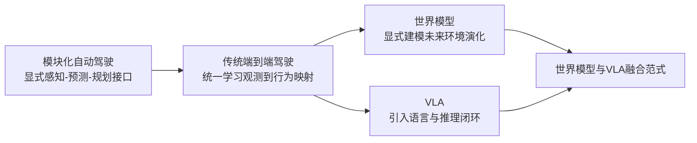
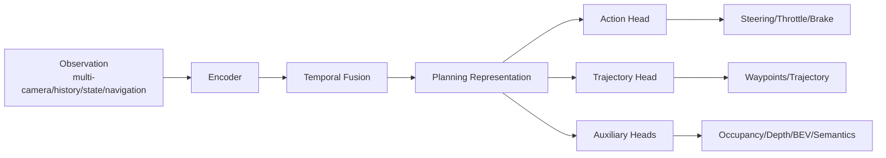
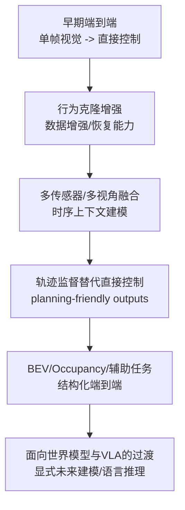
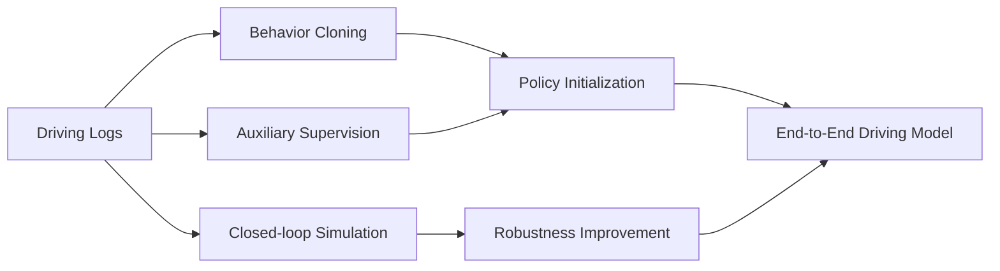
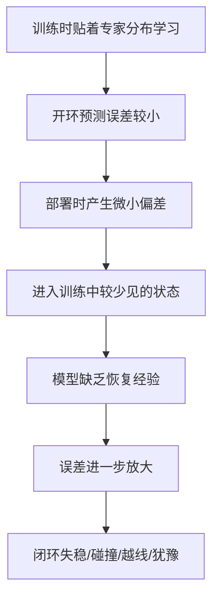
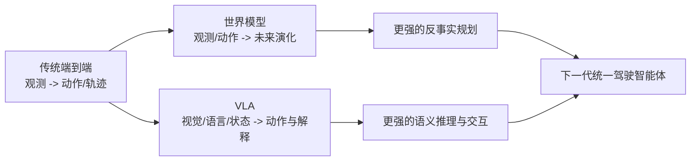

# 4.1 传统端到端自动驾驶

在自动驾驶的发展史里，端到端方法一直是一个极具吸引力、又极具争议的方向。它吸引人的地方在于：如果一个模型能够直接从传感器观测中学习到驾驶行为，那么大量手工设计的模块接口、规则拼接和代价函数调参，也许都可以被更统一的数据驱动范式替代。它有争议的地方在于：自动驾驶不是一个“把图像分类做得更准一点”的问题，而是一个高安全、强闭环、强交互、强长尾的问题。于是，端到端驾驶很早就提出了一个根本性问题：

> **自动驾驶到底能不能被建模为“从观测到动作”的统一映射？如果能，这个映射学到的究竟是控制、规划，还是更深层的隐式世界结构？**

本节不讨论后续引入语言推理的 `VLA` 范式，也不讨论显式未来生成的世界模型，而是聚焦于**传统/经典端到端自动驾驶**：即从传感器、状态和导航先验出发，直接预测控制量、轨迹或规划变量的学习式驾驶系统。你可以把它理解为从模块化驾驶迈向“大一统驾驶模型”的第一阶段。

从综述视角看，`End-to-end VA` 可以粗略理解为两条主线的演进：

1. **直接动作回归/经典 imitation learning 路线**：强调从观测直接学习控制或轨迹。
2. **带中间结构或多任务约束的端到端路线**：仍然端到端训练，但引入 BEV、可行驶区域、目标点、占用、辅助任务等软结构，提高泛化与闭环稳定性。

本章的目标不是堆论文名，而是建立一个可迁移的理解框架：你读完之后，应该能回答下面几个问题：

- 端到端驾驶和模块化驾驶到底差在哪？
- 端到端方法到底在学“控制”，还是在学“隐式规划”？
- 为什么很多方法最后又重新引入中间表征？
- 为什么开环误差小，不一定意味着闭环表现好？
- 为什么这一方向最终自然走向世界模型与 `VLA`？

---

## 1. 定义、边界与问题背景

### 1.1 什么是传统端到端自动驾驶

在本章中，我们把“传统端到端自动驾驶”定义为：

> **用一个统一的可学习系统，把传感器观测、历史上下文和导航先验，直接映射为控制量、轨迹或规划相关输出，而不再依赖人工串联的完整感知-预测-规划接口。**

这里的“端到端”有两个常见误解，需要先澄清：

- **误解一：端到端等于只输入单目图像，只输出转角和油门。**  
  这只是最早期、最简形式的一种实现。现代端到端方法通常输入多相机、历史帧、车速、导航目标，输出也常常是未来轨迹、waypoints、BEV occupancy 或 planning tokens，而不是裸控制量。
- **误解二：端到端等于完全没有结构。**  
  真正成功的现代方法，很少是“纯黑盒无结构”的。它们往往只是**减少人工模块边界**，但会通过网络结构、辅助任务、监督设计、时序建模和安全约束，重新引入归纳偏置。

### 1.2 它与模块化自动驾驶的本质差异

模块化系统通常把自动驾驶拆成：

- 感知：检测、分割、跟踪、地图理解
- 预测：其他交通参与者未来行为
- 规划：行为决策、轨迹生成、代价优化
- 控制：转角、油门、制动执行

端到端系统则试图把其中一部分甚至大部分链路收拢到统一模型中。两者的差异，不只是“模块数量不同”，更是**建模哲学不同**：

- 模块化系统强调**显式分解**、可解释接口和工程可控性。
- 端到端系统强调**联合优化**、隐式表示学习和数据驱动对齐。

### 1.3 为什么端到端方法会持续出现

端到端驾驶反复成为热点，不是因为大家“不想做工程”，而是因为模块化系统长期面临几个结构性问题：

- 中间接口可能丢信息：检测框、语义 mask、规则标签不一定保留了规划真正需要的全部信息。
- 误差逐级传递：上游小偏差可能在后续链路被放大。
- 手工规则扩张严重：复杂交互和长尾场景很难靠规则穷举。
- 模块目标与最终驾驶目标不一致：感知指标变好，不一定闭环驾驶变好。

端到端方法的核心吸引力，正是希望通过**面向最终驾驶目标的联合学习**，缓解这些问题。

### 1.4 与世界模型、VLA 的边界

为了避免概念混淆，可以先记住下面这张表。

| 范式 | 主要输入 | 主要输出 | 核心能力 | 是否强调未来生成 | 是否引入语言闭环 |
|---|---|---|---|---|---|
| 模块化自动驾驶 | 多传感器 + 地图 | 感知结果、预测、轨迹、控制 | 显式任务分解与工程可控 | 否 | 否 |
| 传统端到端驾驶 | 观测 + 历史 + 导航先验 | 控制、轨迹、规划变量 | 统一学习观测到驾驶行为的映射 | 通常不显式强调 | 否 |
| 世界模型 | 观测 + 动作 + 状态 | 未来状态、未来特征、未来视频/latent | 环境演化建模与反事实预测 | 是 | 否 |
| `VLA` | 视觉 + 语言 + 状态 | 动作、策略、解释、规划指令 | 语言引导决策与推理闭环 | 可有可无 | 是 |

这也是本章与后续章节的分工：

- `4.1` 关注“从观测到动作/轨迹”的端到端映射；
- `4.2` 关注“未来如何演化”的世界建模；
- `4.3` 关注“语言如何进入决策闭环”的 `VLA`。

---

## 2. 统一问题建模：端到端到底在学什么

### 2.1 输入、输出与目标函数

从数学上看，传统端到端驾驶可以被抽象为：

$$
\pi_\theta : (o_{\le t}, h_t, n_t) \mapsto y_t
$$

其中：

- $o_{\le t}$ 表示当前及历史观测，可能包含多相机图像、激光雷达表示、BEV 特征等；
- $h_t$ 表示历史状态，如车速、航向角、历史轨迹、时序记忆；
- $n_t$ 表示导航或高层意图先验，如 route command、goal point、lane-level instruction；
- $y_t$ 则可能是控制、轨迹、占用或其他规划相关变量。

常见目标可以写成两类：

$$
p(a_t \mid o_{\le t}, n_t, h_t)
$$

或

$$
p(\tau_t \mid o_{\le t}, n_t, h_t)
$$

其中：

- $a_t$ 是瞬时动作，如 steering、throttle、brake；
- $\tau_t$ 是未来轨迹或一组 waypoints，通常更稳定、更接近规划语义。

### 2.2 现代端到端常见输入

早期方法常使用单帧前视相机，但现代方法更常见的输入已经明显 richer：

- 多相机环视图像
- 历史多帧时序输入
- 自车状态：速度、加速度、航向角
- 导航信息：高层 turn command、goal point、route polyline
- 可选先验：粗地图、局部 BEV、历史目标点

### 2.3 常见输出形式

输出形式决定了模型到底更像“控制器”还是“规划器”。

| 输出形式 | 典型内容 | 优点 | 局限 |
|---|---|---|---|
| 直接控制 | 转角、油门、刹车 | 链路最短，概念最纯粹 | 对噪声敏感，监督不稳定，闭环脆弱 |
| Waypoints / 轨迹点 | 未来若干时刻位置点 | 更贴近规划语义，更易稳定训练 | 还需要下游控制器追踪 |
| 规划变量 | 目标点、可行驶区域、占用、成本图 | 引入结构偏置，利于泛化 | 已经不再是“纯黑盒” |
| 混合输出 | 轨迹 + 辅助任务 + 控制 | 常带来更强闭环表现 | 设计复杂，调参与数据要求高 |

### 2.4 监督信号从哪里来

端到端模型虽然减少了人工模块接口，但并不等于可以摆脱监督设计。常见监督来源包括：

- **行为克隆（Behavior Cloning）**：用人类驾驶或专家规划器的动作/轨迹作为标签。
- **辅助任务监督**：语义分割、深度、可行驶区域、占用、碰撞风险等。
- **自监督时序约束**：跨帧一致性、时序特征预测、对比学习。
- **闭环奖励或仿真优化**：通过 RL、offline RL 或 planner-in-the-loop 方式优化长期行为。

### 2.5 为什么“减少人工接口”不等于“取消结构”

很多初学者会把端到端理解成“把一切中间量都删掉”。但工程上更常见的现实是：

- 你可以不再手工写完整规划链；
- 但你仍然需要告诉模型什么是安全、什么是可行、什么是语义重要信息；
- 这些信息经常会重新以辅助任务、结构化头部、损失函数或 latent constraint 的形式出现。

换句话说，端到端的关键不是“没有中间结构”，而是**不再把中间结构当成固定硬接口，而是把它们变成可学习、可软约束、可联合优化的内部结构。**

---

## 3. 方法主线一：直接动作回归与经典 imitation learning

这一主线最接近大家对“端到端驾驶”的原始印象：输入视觉观测，直接输出控制或路径。它也是综述中 `End-to-end VA` 最基础的一条路线。

### 3.1 基本思想

这一路线假设：

- 驾驶行为可以由数据中的专家示范提供监督；
- 模型可以从高维观测中直接学习状态到动作的映射；
- 如果数据足够多、模型足够强，那么许多难以手写的隐式规则也可以被吸收到参数中。

最经典的训练形式是行为克隆：

$$
\mathcal{L}_{BC} = \sum_t \ell(\hat{a}_t, a_t^\ast)
$$

或轨迹回归：

$$
\mathcal{L}_{traj} = \sum_t \ell(\hat{\tau}_t, \tau_t^\ast)
$$

其中 $a_t^\ast$ 或 $\tau_t^\ast$ 来自人类驾驶或专家系统。

### 3.2 代表性工作与方法直觉

#### `ALVINN`

`ALVINN` 是极早期的代表性工作。今天看它的网络并不复杂，但它的重要意义不在于性能，而在于提出了一个后来被不断重复验证的思想：

> **驾驶中的部分策略映射，可以通过示范学习获得，而不必全部显式手写。**

它更像一个思想起点，而不是现代工程答案。

#### `PilotNet`

NVIDIA 的 `PilotNet` 让“前视图像 -> 转角预测”的范式广为人知。它把端到端驾驶清晰地塑造成一个监督学习问题，强调卷积特征可以直接支持转向控制预测。

它的历史意义在于：

- 证明了深度视觉特征对低层驾驶控制是有用的；
- 让“从感知直接到控制”的叙事变得非常直观；
- 同时也暴露出该路线对数据分布、恢复能力和闭环鲁棒性的高度敏感。

### 3.3 这一路线的优势

- 路径最短，优化目标直接面向驾驶输出；
- 不依赖复杂中间模块标注，工程搭建速度快；
- 很容易与大规模驾驶日志形成监督学习流水线；
- 能够学习一些难以显式编写的隐式驾驶习惯。

### 3.4 这一路线的根本问题

直接动作回归的困难并不只是“模型不够大”，更深的原因有三点：

1. **控制量监督噪声大**  
   同一场景下，不同驾驶员的瞬时转角和油门可能差异很大，但都合理。
2. **动作空间过于低层**  
   控制信号更像执行结果，而不是规划意图，学习信号不够稳定。
3. **闭环分布偏移严重**  
   训练时只看到专家分布，部署后模型一旦轻微偏离，就会进入自己没有见过的状态。

---

## 4. 方法主线二：带中间结构或多任务约束的端到端路线

随着研究深入，大家逐渐发现：如果完全依赖“视觉到控制”的裸回归，模型很难在复杂城市驾驶中稳定泛化。于是出现了第二条更成熟的主线：

> **仍然保持端到端训练和统一目标，但在模型内部引入中间结构、辅助任务和规划偏置。**

这也是综述中另一类 `End-to-end VA` 方法最值得把握的精神内核。

### 4.1 这里的“中间结构”是什么

它们不再是传统模块化系统里必须逐级交付的硬接口，而更像端到端系统中的软结构，包括：

- 目标点 `target point`
- route command / navigation token
- 可行驶区域
- BEV 特征图
- 深度、分割、占用
- 风险热图、碰撞代价图
- planning query / latent plan token

这些结构的作用，不是为了“回到模块化”，而是为了给模型提供更好的归纳偏置。

### 4.2 为什么这些结构能帮助端到端

原因很朴素：

- 驾驶不是纯视觉分类，而是空间决策问题；
- 多视角信息需要统一坐标系或统一规划空间；
- 规划比控制更依赖几何、拓扑和未来可达性；
- 仅靠最终动作损失，模型很难知道“哪里看错了、哪里规划错了、哪里控制错了”。

因此，中间结构往往提供三种帮助：

- **表示帮助**：把图像表征变成更适合规划的空间表征；
- **优化帮助**：辅助损失改善梯度信号；
- **泛化帮助**：引入几何与语义归纳偏置。

### 4.3 代表性工作与“新归纳偏置”

#### `ChauffeurNet`

`ChauffeurNet` 的重要性不在于它是不是最“纯”的端到端，而在于它清楚地说明：**端到端系统也可以通过中间语义与合成 perturbation 提升闭环稳健性。**

它引入的关键偏置包括：

- 更结构化的输入表示；
- 从专家轨迹学习未来驾驶意图；
- 面向恢复能力的数据增强与扰动训练。

#### `TransFuser`

`TransFuser` 代表了多模态和多视角信息融合走向统一 Transformer 融合的趋势。它的核心不是简单“把相机和雷达拼起来”，而是通过融合机制学习跨模态互补信息。

它带来的关键偏置是：

- 多模态统一表示；
- 更强的时空融合；
- 从单路视觉控制走向 richer context planning。

#### `TCP`

`TCP` 一类方法的代表意义在于：它们试图把“驾驶意图”从纯控制层抬升到更稳定的轨迹或规划表征层。  
这类方法强调：**端到端系统学到的不应只是转角值，而应是更接近规划语义的条件轨迹。**

#### 多任务 BEV / occupancy 端到端方法

近年来越来越多工作把 BEV、occupancy、lane-level representation 或 planning-centric scene representation 引入端到端驾驶中。这些方法表面上让系统“更复杂”了，但本质上是在回答一个工程现实：

> **在复杂城市驾驶里，完全没有中间空间结构的纯回归，通常不是最稳的解。**

---

## 5. 从“控制”到“隐式规划”：四个核心科研命题

这一节是本章最重要的部分。比起记住方法名字，更重要的是理解端到端驾驶背后的四个科研命题。

### 5.1 命题一：端到端到底在学控制，还是在学隐式规划

#### 直觉解释

表面看，许多模型输出的是转角、油门或轨迹点；但本质上，模型必须先隐式回答很多规划问题：

- 该不该让行？
- 是跟车还是变道？
- 前方障碍物风险有多大？
- 当前更优先追求效率、舒适还是安全？

所以即使输出层是控制量，模型内部往往也在形成某种**隐式规划表示**。

#### 工程含义

- 直接用控制作为监督时，模型学到的规划意图可能很脆弱；
- 用轨迹、waypoints、occupancy 等更高层表征作为监督，通常更稳定；
- 模型评估不能只看控制误差，还要看规划合理性和闭环表现。

#### 研究启发

真正有价值的问题不是“能不能直接回归动作”，而是：

> **怎样让端到端模型在不显式模块化拆解的前提下，形成稳定、可迁移、可约束的规划表示？**

### 5.2 命题二：中间表征被拿掉后，真的消失了吗

#### 直觉解释

很多工作宣称“没有感知模块、没有预测模块”。但只要模型要开车，它就必须在内部回答：

- 哪里可走？
- 哪些目标危险？
- 哪个方向与导航一致？
- 未来几秒大概会发生什么？

这意味着中间表征通常没有消失，而是从显式变量转为了**latent structure**。

#### 工程含义

- 完全忽视中间结构，通常会降低调试性和样本效率；
- 合理的辅助任务并不是“背离端到端”，而是在帮助模型更好地形成 latent planning space；
- 设计 soft intermediate representation 往往是性能提升关键。

#### 研究启发

未来高质量端到端系统，可能不是“不要中间表征”，而是：

- 不把它们做成脆弱硬接口；
- 而是做成可以联合优化、可选择暴露、可服务安全约束的软结构。

### 5.3 命题三：为什么轨迹监督通常比直接控制监督更稳定

#### 直觉解释

瞬时控制量受车辆动力学、执行延迟、驾驶员风格和采样噪声影响很大。  
而轨迹点更接近“想去哪”，控制量更接近“怎么踩”。

前者偏规划意图，后者偏执行细节。

#### 工程含义

- 轨迹监督对专家风格噪声更鲁棒；
- 轨迹表示更容易与导航、地图、避障约束结合；
- 下游再接一个稳定控制器，通常更适合上车部署。

#### 研究启发

端到端性能提升的一个核心方向，并不是盲目扩大模型，而是**寻找更合适的输出空间**：  
从低层控制转向更稳定的 planning-friendly target，往往比单纯换 backbone 更有效。

### 5.4 命题四：为什么端到端性能提升常依赖数据规模、时序上下文和辅助任务

#### 直觉解释

驾驶不是单帧判断任务，而是时空决策任务。

- 单帧看不出前车是刚起步还是急刹；
- 单视角看不清侧后方博弈关系；
- 单一监督难以逼迫模型学会几何、语义与风险分解。

所以，只靠单帧图像和动作标签，模型很难真正学到可靠驾驶行为。

#### 工程含义

- 大规模日志数据是端到端成功的重要前提；
- 时序记忆、多帧输入和多视角融合几乎是现代端到端的标配；
- 辅助任务经常显著改善样本效率和泛化。

#### 研究启发

真正应该问的不是“端到端要不要结构”，而是：

> **哪些结构最值得保留，哪些结构应该交给数据和模型自己学出来。**

---

## 6. 统一架构视角：现代端到端系统通常怎么搭

虽然不同论文名字很多，但从架构上看，现代端到端驾驶系统已经逐渐呈现出一个比较统一的形态。

### 6.1 核心模块

| 模块 | 作用 | 常见实现 | 设计重点 |
|---|---|---|---|
| 视觉编码器 | 提取单帧或多帧视觉特征 | `CNN`、`ViT`、多相机 backbone | 保留空间细节与跨视角语义 |
| 时序融合模块 | 聚合历史上下文与动态信息 | `RNN`、`Transformer`、memory bank | 让模型具备短时历史记忆 |
| 空间/规划表示层 | 把视觉特征转到规划友好空间 | `BEV`、occupancy、plan tokens | 引入几何与可达性偏置 |
| 决策/轨迹头 | 输出动作、轨迹或 planning variable | MLP、Transformer decoder、query head | 输出空间选择决定稳定性 |
| 辅助监督头 | 提供软结构与额外训练信号 | 深度、分割、占用、风险图 | 提升样本效率与可解释性 |

### 6.2 方法谱系图

### 6.3 方法分类表

| 方法类别 | 输入 | 主要输出 | 监督方式 | 是否显式中间结构 | 代表性特点 |
|---|---|---|---|---|---|
| 直接控制回归 | 单/多相机 + 状态 | 转角、油门、刹车 | 行为克隆 | 否 | 最纯粹，也最脆弱 |
| 轨迹回归 | 多相机 + 导航 | waypoints、未来轨迹 | 专家轨迹监督 | 弱 | 更稳定，更接近规划 |
| 结构化端到端 | 多相机/多模态 + 历史 | 轨迹 + 辅助表征 | 轨迹 + 多任务联合监督 | 是 | 性能和可控性更平衡 |
| 规划中心端到端 | 多视角 + BEV/occupancy | planning token、occupancy、轨迹 | 多任务/闭环混合 | 强 | 更接近现代城市驾驶范式 |

---

## 7. 训练范式：为什么训练方式几乎和模型同样重要

端到端驾驶的难点，不仅在网络结构，还在训练范式。

### 7.1 行为克隆不是万能答案

行为克隆的优点是简单、可扩展、容易工业化，但它天然存在一个核心问题：**covariate shift**。

训练时：

- 模型只看到专家产生的状态分布；

部署时：

- 模型的微小错误会把自己带到偏离专家分布的新状态；
- 在这些状态下，模型缺乏学习经验，误差进一步放大。

### 7.2 恢复能力为什么重要

真实驾驶系统不仅要“在正确状态下输出正确行为”，还要“在轻微偏离后能够恢复”。这也是为什么很多高质量端到端工作会加入：

- 轨迹扰动数据增强
- off-policy correction
- 专家修正数据
- planner-in-the-loop 监督
- 仿真中的闭环恢复训练

### 7.3 多任务训练的价值

多任务训练通常不是为了让论文看起来更复杂，而是为了回答一个非常实际的问题：

> **如果最终动作标签太稀疏、太噪声、太低层，那么能不能用更丰富的监督来帮模型学会对驾驶真正有用的中间规律？**

常见辅助任务包括：

- 可行驶区域分割
- 深度估计
- 车道线/路沿理解
- 占用预测
- 碰撞风险估计
- BEV 场景重建

### 7.4 训练范式总览图

---

## 8. 开环与闭环：为什么“离线指标很好”仍然可能不会开车

这是端到端驾驶最容易被误解、也是最值得反复强调的问题。

### 8.1 开环指标测的是什么

开环评测通常比较模型输出与专家标签的接近程度，比如：

- 转角误差
- 速度误差
- 轨迹点 L1/L2 误差
- displacement error
- collision proxy / lane deviation proxy

这些指标当然有价值，但它们本质上测的是：

> **在给定真实历史和真实观测的条件下，模型是否像专家。**

### 8.2 闭环评测测的是什么

闭环评测则更接近真实驾驶：模型的每一步输出都会影响下一步观测。  
因此它测的是：

- 模型是否会积累误差；
- 轻微失误后能否恢复；
- 遇到交互和长尾时是否稳定；
- 是否会出现碰撞、越线、卡死、犹豫等行为。

### 8.3 误差传播图

### 8.4 训练与评测对比表

| 维度 | 开环评测 | 闭环评测 |
|---|---|---|
| 输入分布 | 使用真实历史与真实观测 | 输入由模型先前行为共同决定 |
| 关注重点 | 标签拟合能力 | 长期稳定性与恢复能力 |
| 常见指标 | 动作误差、轨迹误差 | 成功率、碰撞率、越线率、舒适性 |
| 主要风险 | 容易高估真实部署表现 | 成本高、复现实验更复杂 |
| 典型失效 | 看起来“像专家” | 实际上不会持续安全驾驶 |

这一点直接决定了端到端研究不能只追求“离线分数更好”，而必须重视**闭环可恢复性**。

---

## 9. 代表工作谱系：看每篇论文到底引入了什么新偏置

本节不追求“尽可能全”，而是只保留对学习路径最有帮助的一小组代表工作。

| 工作 | 年份 | 主要输入 | 主要输出 | 关键创新/归纳偏置 | 主要局限 |
|---|---:|---|---|---|---|
| `ALVINN` | 早期 | 前视观测 | 转向相关输出 | 示范学习驾驶映射的思想起点 | 能力与场景复杂度都很有限 |
| `PilotNet` | 2010s | 前视相机 | 转角 | 让端到端视觉控制范式被广泛接受 | 低层动作监督脆弱，闭环泛化有限 |
| `ChauffeurNet` | 2018 | 结构化场景表示 | 未来驾驶轨迹 | 引入更强结构表示与恢复训练 | 仍依赖较强中间表示设计 |
| `TransFuser` | 2021 | 多相机/多模态 | 控制或轨迹 | 强化多模态时空融合 | 成本高，部署复杂 |
| `TCP` | 2020s | 多视角 + 导航 | 轨迹/控制 | 强调 planning-friendly target 与条件规划 | 仍需解决闭环泛化和长尾问题 |
| 多任务 BEV/occupancy 端到端 | 2020s | 多视角 + 历史 | 轨迹 + 结构化头部 | 将空间规划偏置显式引回模型 | 复杂度上升，训练设计要求高 |

如果要用一句话总结这条发展脉络，可以这么说：

> **端到端驾驶的发展，不是单纯从“小模型变大模型”，而是从“直接控制回归”逐步走向“具有规划表示、空间结构和闭环意识的统一学习系统”。**

---

## 10. 核心挑战：为什么它至今仍然难

### 10.1 Covariate shift 与恢复能力缺失

这是端到端驾驶最经典的问题。模型不仅要会模仿专家，还要会从自己的错误里恢复。

### 10.2 监督稀疏与长尾场景

大部分驾驶数据都来自正常巡航、跟车、简单转弯；真正危险且关键的场景非常稀少。于是模型容易：

- 学会“平均场景下的平均行为”；
- 却在长尾风险场景里缺乏足够训练信号。

### 10.3 可解释性与安全约束缺失

模块化系统虽然繁琐，但中间接口清楚。端到端模型则常常很难回答：

- 为什么此时选择减速？
- 为什么没有识别到风险？
- 错误来自感知、时序理解还是动作解码？

这会显著增加调试成本和安全验证难度。

### 10.4 Offline 指标与 closed-loop 指标错位

离线拟合更像“像不像专家”，闭环驾驶更像“能不能活下来并开得合理”。  
二者目标不一致，是许多端到端论文结果解读时最大的坑。

### 10.5 数据规模、标注成本与仿真偏差

端到端方法往往依赖：

- 海量多样化日志数据；
- 高质量导航和轨迹标注；
- 足够逼真的仿真环境做恢复训练；

而现实中，这三者都昂贵且不完美。

### 10.6 优缺点总结表

| 维度 | 传统端到端的收益 | 传统端到端的瓶颈 |
|---|---|---|
| 建模方式 | 联合优化最终目标，减少接口信息损失 | 隐式表示难解释、难验证 |
| 数据利用 | 可直接吸收大规模驾驶日志 | 长尾数据依然稀缺 |
| 工程链路 | 理论上可缩短系统链路 | 实际上常需补回大量软结构 |
| 泛化潜力 | 有机会学到隐式规则与风格 | 分布偏移和闭环恢复难题突出 |
| 研究价值 | 是世界模型、VLA 的重要前身 | 单靠它很难彻底解决复杂城市驾驶 |

---

## 11. 为什么传统端到端会自然走向世界模型与 VLA

当我们真正理解传统端到端的能力边界后，就会明白后续两条演化路线几乎是必然出现的。

### 11.1 为什么会走向世界模型

传统端到端擅长学“当前观测下怎么做”，但它不天然擅长：

- 显式预测未来多种可能性；
- 做反事实推理；
- 在 latent space 中评估“如果我这样开，接下来会怎样”。

这就自然催生了世界模型：  
如果我们不只学动作映射，还学环境演化规律，那么系统就可以从“反应式驾驶”走向“想象式驾驶”。

### 11.2 为什么会走向 `VLA`

传统端到端还不天然擅长：

- 显式解释行为原因；
- 融合语言规则与高层指令；
- 利用常识、推理与人类可交互接口。

当自动驾驶开始需要：

- “为什么减速”
- “接下来绕过施工区”
- “基于交通规则做解释性决策”

时，语言与推理就会被引入决策闭环，这正是 `VLA` 的出现背景。

### 11.3 三者的递进关系

---

## 12. 全章总结

传统端到端自动驾驶最值得理解的，不是某篇论文用了什么 backbone，而是它代表了一种核心思想转变：

- 从显式设计每个子模块，转向联合学习最终驾驶行为；
- 从把中间表示当硬接口，转向把它们当可学习软结构；
- 从直接控制回归，逐步走向更稳定的轨迹监督、空间表示和闭环训练；
- 从反应式映射，最终走向世界建模与语言推理增强。

如果用一句话总结本章，可以写成：

> **传统端到端自动驾驶不是“不要结构”，而是“把结构内化为可学习表示”；它学到的也不只是控制，而是被压缩进统一模型中的隐式规划。**

这也是为什么它既是自动驾驶现代学习范式的核心里程碑，又不是终点。接下来的世界模型和 `VLA`，都可以被看作是在端到端驾驶这条主线上的进一步展开：

- `4.2` 继续回答：模型能不能不只会开，还能“预见未来”；
- `4.3` 继续回答：模型能不能不只会开，还能“理解语言并解释决策”。

---

## 延伸阅读

- [NVIDIA PilotNet 相关介绍](https://developer.nvidia.com/blog/deep-learning-self-driving-cars/)
- [ChauffeurNet: Learning to Drive by Imitating the Best and Synthesizing the Worst](https://arxiv.org/abs/1812.03079)
- [TransFuser: Imitation with Transformer-Based Sensor Fusion for Autonomous Driving](https://arxiv.org/abs/2104.09224)
- [TCP: Trajectory-guided Control Prediction for End-to-end Autonomous Driving](https://arxiv.org/abs/2206.08129)
- [4.2 世界模型](./4.2_世界模型.md)
- [4.3 视觉-语言-动作模型（VLA）](./4.3_VLA.md)
