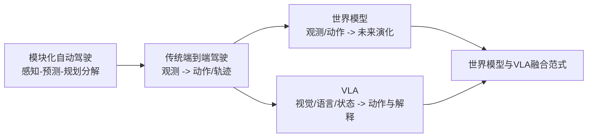
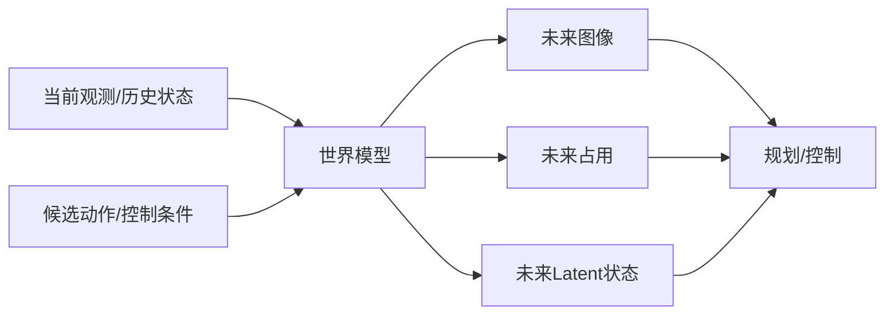

# 4.2 世界模型

在 `4.1` 里，我们讨论了传统端到端自动驾驶如何把“观测到动作”收拢进统一模型中。但如果一个系统只是学会了“现在该怎么开”，它仍然缺少一种非常关键的能力：

> **如果我接下来这样开，几秒之后世界会变成什么样？**

这正是世界模型 (`World Model`) 在自动驾驶里出现的根本原因。  
它不满足于只输出一个动作或一条轨迹，而是希望学习环境本身的演化规律，让模型具备某种“内部想象力”：

- 不只看当前，还能推演未来；
- 不只反应现实，还能评估反事实；
- 不只模仿专家，还能在内部模拟“这样做会怎样”。

如果说传统端到端驾驶是在回答“**现在该怎么做**”，那么世界模型更像是在回答“**做了之后会发生什么**”。

本章不讨论引入语言推理的 `VLA` 闭环，也不把重点放在通用视频生成本身，而是聚焦于**世界模型**：即如何围绕未来环境演化建模，支持预测、规划、控制和决策。

围绕这一主题，你可以把当前自动驾驶中的世界模型粗略看成三条主线：

1. **Image-Based World Models**：直接在图像或视觉空间中预测未来；
2. **Occupancy World Models**：在 `Occupancy` 空间中预测未来可达性与场景结构；
3. **Latent World Models**：在压缩潜变量空间中建模未来动态，再服务策略学习或规划。

这一章读完后，你需要回答下面几个问题：

- 自动驾驶里的世界模型到底在建模什么？
- 为什么世界模型不等于“把下一帧图像生成得更像真的”？
- 为什么研究会从像素和occupancy生成，逐步走向latent 表示？
- 世界模型和传统端到端、预测模块、规划模块到底如何区分？
- 为什么它会自然走向规划融合，甚至进一步走向 `VLA`？

> [!TIP]
> **有一点需要明确：**
> 世界模型的做法有很多种，大家的思考与行为也不完全相同。有做纯生成任务的、有做仿真器的、有做生成辅助规划的等等。本文介绍的核心主要聚焦于“世界模型生成辅助规划”

---

## 1. 定义、边界与问题背景

### 1.1 什么是世界模型

在本章中，我们把世界模型定义为：

> **从观测、动作与历史状态出发，学习环境未来演化规律，从而支持预测、想象、反事实评估与规划的可学习系统。**

这一定义里最重要的，不是“生成”两个字，而是“**演化规律**”四个字。

也就是说，世界模型真正想学的并不是某一帧长什么样，而是：

- 场景中的主体会怎样运动；
- 自车动作会如何影响未来观测；
- 路网、障碍物、可行驶区域与交互关系会如何变化；
- 哪些未来是高概率的，哪些未来是危险的，哪些未来与当前动作直接相关。

从这个角度看，世界模型本质上是一种**环境动力学模型 (`dynamics model`)**，只是它面对的状态不再是简单的低维物理变量，而是复杂交通世界中的高维多模态状态。

  

### 1.2 两个常见误解

- **误解一：世界模型就是视频生成。**  
  视频生成只是世界模型的一种实现形式，而且通常只是最直观的一种。自动驾驶真正关心的是“未来是否对决策有用”，而不是“像素是否足够好看”。
- **误解二：世界模型和预测模块是同一个东西。**  
  模块化系统中的预测，常常只预测其他交通参与者未来轨迹；世界模型则更进一步，它试图统一建模自车、环境、场景结构和动作条件下的整体未来演化。

### 1.3 它与模块化预测、端到端驾驶的本质差异

模块化系统通常会把“未来”拆开来处理：

- 感知负责理解当前场景；
- 预测负责估计其他车辆或行人的未来行为；
- 规划负责决定 ego 未来怎么走；
- 控制负责执行轨迹。

而世界模型试图进一步回答一个更统一的问题：

> **在当前场景下，如果 ego 执行某种动作序列，整个局部世界将如何随时间演化？**

这使得它与传统端到端驾驶的差异也很明确：

- 传统端到端重点在于学习 `observation -> action/trajectory`；
- 世界模型重点在于学习 `(observation, action, history) -> future state/feature`。

### 1.4 与预测模块、端到端、VLA 的边界

为了避免概念混淆，可以先看下面这个表：

| 范式 | 主要输入 | 主要输出 | 核心问题 | 是否强调未来演化 | 是否直接负责动作决策 |
|---|---|---|---|---|---|
| 模块化预测 | 当前场景表示 | 其他参与者未来轨迹/意图 | “别人会怎么动” | 是，但通常局部 | 否 |
| 传统端到端驾驶 | 观测 + 历史 + 导航 | 动作、轨迹、规划变量 | “我现在该怎么开” | 通常不显式强调 | 是 |
| 世界模型 | 观测 + 动作 + 状态 | 未来图像、未来占用、未来 latent、未来场景状态 | “接下来会发生什么” | 是，核心能力 | 不一定 |
| `VLA` | 视觉 + 语言 + 状态 | 动作、解释、推理结果 | “为什么这样开、如何按语义要求开” | 可有可无 | 是 |

这也是本章与相邻章节的边界：

- `4.1` 关注的是统一学习观测到行为的映射；
- `4.2` 关注的是未来环境如何演化；
- `4.3` 关注的是语言与推理如何进入驾驶决策；
- `4.4` 则会进一步讨论世界模型与 `VLA` 如何融合。

### 1.5 为什么世界模型会持续升温

这一方向在自动驾驶里越来越重要，核心原因有四个：

- **反应式策略不够**：只学当前动作，很难显式比较多个未来后果，尤其是对于多模态规划而言。
- **长时决策需要想象力**：变道、避让、汇入、复杂路口博弈都依赖未来推演。
- **生成式建模能力成熟**：扩散模型、视频生成、序列建模和 latent dynamics 让“学未来”变得可行。
- **端到端系统需要更强内部结构**：世界模型为统一驾驶智能体提供了更自然的中间推演空间。

这也是为什么在近两年的自动驾驶研究中，大家越来越不满足于“预测一条轨迹”，而是开始追问：

> **能不能让模型在内部先看到未来，再决定动作？**

---

## 2. 统一问题建模：世界模型到底在学什么

### 2.1 从策略学习到环境建模

如果把传统端到端策略写成：

$$
\pi_\theta : (o_{\le t}, h_t, n_t) \mapsto a_t
$$

那么世界模型更像是在学习：

$$
f_\phi : (s_{\le t}, a_{\le t}) \mapsto s_{t+1:T}
$$

或者从概率建模角度写成：

$$
p_\phi(s_{t+1:T} \mid s_{\le t}, a_{\le t})
$$

其中：

- $s_t$ 表示某种“世界状态”，它可能是图像、`Occupancy`、对象集合，或者 latent 表示；
- $a_t$ 表示 ego 动作、控制、轨迹条件，或者规划 token；
- $s_{t+1:T}$ 表示未来若干时刻的环境演化。

如果世界模型学得足够好，我们就可以在内部做这样的推演：

- 如果我保持当前速度，前方车辆是否会切入？
- 如果我提前变道，未来可行驶区域会不会更安全？
- 如果我刹车，后方车辆和相邻车道交通会怎样变化？

这正是世界模型区别于普通行为克隆的地方：  
它让驾驶系统从“学专家怎么做”，走向“学世界会怎么变”。

### 2.2 世界状态可以放在哪个空间里

理解世界模型时，一个非常关键的问题是：

> **你到底在哪个表示空间里建模未来？**

不同方法的核心分歧，往往不在于“是否预测未来”，而在于“未来被表示成什么”。

  

常见选择有三类：

| 表示空间 | 典型输出 | 优点 | 局限 |
|---|---|---|---|
| 图像/视觉空间 | 未来图像、未来视频帧、未来多视角特征 | 直观、语义丰富、可视化强 | 像素成本高，和规划目标不总是直接对齐 |
| `Occupancy` 空间 | 未来占用、语义占用、可达区域、体素状态 | 更贴近驾驶、安全、几何与可达性 | 细节语义弱于图像，仍需设计表示粒度 |
| Latent 空间 | 压缩后的未来状态 token/embedding | 紧凑、高效、适合长时 rollout 和策略耦合 | 可解释性较弱，表示是否保留关键信息很关键 |

这也对应了本章后面要展开的三条主线：

1. `Image-Based World Models`
2. `Occupancy World Models`
3. `Latent World Models`

### 2.3 世界模型和 policy 的关系

单独一个世界模型，并不会自动让车开起来。  
它更像一个“内部模拟器”或“内部环境引擎”，真正负责决策的通常还是 policy、planner 或 search 模块。

因此，一个更完整的统一框架常常可以写成：

$$
\hat{s}_{t+1:T} \sim p_\phi(\cdot \mid s_{\le t}, a_{\le t})
$$

再由策略或规划器根据预测未来选择动作：

$$
a_t = \pi_\theta(s_{\le t}, \hat{s}_{t+1:T}, n_t)
$$

从这个角度看：

- **policy** 回答“我该怎么做”；
- **world model** 回答“做了会怎样”。

二者一旦耦合，系统就具备了某种基础形式的“想象-评估-执行”闭环。

### 2.4 自动驾驶里的训练信号从哪里来

世界模型的监督并不只是一种形式，它的训练目标往往和表示空间强相关。

常见训练信号包括：

- **重建损失**：让预测的未来图像、未来占用或未来特征尽量接近真实未来；
- **时序预测损失**：约束多步 rollout 与真实未来动态一致；
- **动作条件建模**：显式学习不同 ego 动作如何影响未来状态；
- **语义/几何辅助损失**：例如 occupancy、深度、语义类别、instance motion；
- **潜变量一致性损失**：鼓励 latent dynamics 在压缩空间中保持稳定与可预测。

如果写得更抽象一点，可以把世界模型训练目标看成：

$$
\mathcal{L}_{WM} = \mathcal{L}_{pred} + \lambda_1 \mathcal{L}_{recon} + \lambda_2 \mathcal{L}_{dyn} + \lambda_3 \mathcal{L}_{aux}
$$

其中：

- $\mathcal{L}_{pred}$ 负责未来预测本身；
- $\mathcal{L}_{recon}$ 负责输出空间重建；
- $\mathcal{L}_{dyn}$ 负责多步动力学一致性；
- $\mathcal{L}_{aux}$ 负责额外语义或几何约束。

### 2.5 为什么世界模型不等于“把未来画出来”

这是本章最值得反复强调的一点。

在自动驾驶里，一个世界模型就算把未来生成得非常逼真，也不代表它一定对驾驶有用。因为自动驾驶真正关心的是：

- 哪些目标未来会占据我的可行驶空间；
- 哪些交互会导致风险上升；
- 哪些动作会让未来舒适、安全、符合规则；
- 多种可能未来之间，哪一种对当前决策最关键。

因此，世界模型的价值不只是“**生成质量**”，更是“**决策价值**”。

也正因如此，研究路线逐渐发生了一个很重要的偏移：

- 早期更关注“未来看起来像不像真的”；
- 后来更关注“未来是不是对规划和控制真正有用”。

这正是从 `Image-Based` 走向 `Occupancy`，再进一步走向 `Latent` 的根本动力。

  

---

## 3. 方法主线一：Image-Based World Models

`Image-Based World Models` 的核心想法是：  
既然驾驶员首先看到的是视觉世界，那么模型也可以尝试直接在图像空间里学习“未来会看到什么”。

这一类方法通常最直观，也最容易让人理解世界模型的概念。但它们同时也最容易暴露一个问题：

> **视觉上很逼真的未来，不一定是对驾驶最有用的未来。**

### 3.1 为什么要直接预测视觉未来

这一条路线之所以自然，是因为驾驶本来就是一个高度视觉化的任务。

- 人类驾驶员首先看到的是前方道路、车辆、行人、信号灯和车道线；
- 自动驾驶系统最常见的输入也是多相机视频流；
- 如果模型能够直接想象“几秒后会看到什么”，那么它似乎就获得了一种很直观的未来感知能力。

因此，`Image-Based World Models` 的吸引力非常强：

- **可视化强**：预测结果可以直接被人看到，便于检查模型到底“想象”了什么；
- **语义丰富**：图像天然包含纹理、类别、几何、遮挡、动态交互等大量信息；
- **生成范式成熟**：视频扩散模型、时序 Transformer、条件生成模型的发展，为这条路线提供了强大的工具箱。

从研究心理上讲，这也是很多人理解世界模型的第一入口。  
因为“预测未来视频”这件事非常直观，它让“模型在脑中模拟未来”这件事变得几乎可以被肉眼观察。

### 3.2 这一路线到底在学什么

如果把这一类模型抽象一下，它学习的通常是：

$$
p(x_{t+1:T} \mid x_{\le t}, a_{\le t}, h_t)
$$

其中：

- $x_{\le t}$ 是历史多视角图像或视觉特征；
- $a_{\le t}$ 是 ego 动作、控制序列或候选轨迹条件；
- $h_t$ 是其他辅助上下文，如车速、导航意图、状态记忆；
- $x_{t+1:T}$ 则是未来图像、未来视频帧，或接近图像的未来视觉特征。

这意味着它更像是在**可见空间**中学习未来演化规律。  
和单纯做下一帧生成不同，自动驾驶里的 image-based world model 通常还会强调两件事：

- **动作条件性**：未来不是唯一的，而是会随 ego 行为不同而改变；
- **多步 rollout**：真正有价值的不是“下一帧像不像”，而是“连续几秒的未来演化是否稳定、合理、可用于决策”。

但也正是在这里，这条路线的核心矛盾暴露出来了：

- 像素空间维度极高；
- 长时视频生成很容易积累误差；
- 视觉上逼真，不等于规划上有用；
- 评价指标也常常更偏视觉质量，而不是闭环驾驶价值。

所以，`Image-Based World Models` 最值得理解的，不只是“它能不能生成很像真的未来”，而是：

> **它能否把未来视觉演化转化为对驾驶真正有帮助的内部推演能力。**

### 3.3 代表性工作：`Epona`

`Epona` 可以看作这条路线中一个非常有代表性的工作。

它代表的，不只是“把视频生成模型搬到自动驾驶里”，而是试图解决 image-based world model 最难的几个问题：

- 未来长度不能太短，否则只能做很局部的反应；
- 生成不能只顾视觉质量，还要能和轨迹/规划耦合；
- 自回归 rollout 不能很快崩掉，否则未来推演无法真的服务驾驶。

`Epona` 的方法意义，可以从三个角度理解。

第一，它强调**条件化未来生成**。  
未来不是一段无条件播放的视频，而是和 ego 轨迹、动作先验、历史观测共同决定的。这样一来，模型生成的就不再只是“某种会发生的未来”，而更接近“如果我这么开，可能会看到的未来”。

第二，它强调**多步视觉 rollout**。  
这类系统的真正价值，不在于生成一帧漂亮图像，而在于能否把未来一段时间的场景变化连续地推出去。`Epona` 试图把视觉生成从“固定长度整体采样”推进到更适合驾驶推演的长时自回归生成，这一点非常关键。

第三，它强调**生成未来对 driving reasoning 的支撑作用**。  
也就是说，未来视频不是展示品，而是一个可被后续规划与控制利用的内部世界接口。它让世界模型第一次比较清楚地展示出一个愿景：模型不是只会“看现在”，而是能先在脑中“看到未来”，再反过来帮助决策。

  

从范式意义上讲，`Epona` 代表的是：

> **世界模型可以先从人类最容易理解的视觉未来入手，把“想象未来”这件事做得可视、可检验、可与驾驶闭环相连接。**

- [Epona: Autoregressive Diffusion World Model for Autonomous Driving](https://arxiv.org/abs/2506.24113)

但这条路线的边界同样很明显。图像未来虽然最直观，却未必最适合作为闭环驾驶系统的核心内部表示。因为自动驾驶真正关心的，往往不是每一块纹理是否生成正确，而是：

- 哪些区域会被占据；
- 哪些目标会进入我的风险空间；
- 哪条候选轨迹对应的未来最安全。

这也解释了为什么 image-based world model 虽然极具吸引力，但研究很快又把目光转向更贴近规划语义的空间表示。

| 维度 | `Image-Based World Models` / `Epona` |
|---|---|
| 核心优势 | 直观、语义完整、便于人类检查，最容易体现“模型在想象未来” |
| 主要局限 | 像素建模昂贵，长时稳定性难，生成质量与控制价值不完全一致 |
| 更适合承担的角色 | 世界想象器、可视未来接口、生成式预训练入口 |

如果用一句话概括这一类方法，可以写成：

> **它最擅长把未来“看出来”，但未必最擅长把未来“用于规划”。**

---

## 4. 方法主线二：Occupancy World Models

`Occupancy World Models` 更关心的是：

- 未来哪里会被占据；
- 哪些区域可通行；
- 场景中的几何结构和动态主体会怎样演化。

相比直接生成图像，它更接近规划和安全判断所真正依赖的空间结构。  

### 4.1 为什么从图像走向 occupancy

当研究者真正把世界模型往自动驾驶闭环上推时，很快就会发现一个事实：

> **自动驾驶真正关心的，不是未来“看起来像什么”，而是未来“哪里可走、哪里危险、哪里会被占据”。**

这正是从 image-based world model 走向 occupancy world model 的核心原因。

图像空间当然很丰富，但它也包含大量对规划并不关键的细节：

- 车身纹理、反光、天空颜色；
- 远处建筑外观；
- 像素级外观变化。

而规划真正高度依赖的，是另外一些量：

- 前方车道与障碍物在空间中的占据关系；
- 周围交通参与者未来几秒会怎样移动；
- 某个区域未来是否仍然可达；
- ego 某个动作是否会把自己带入碰撞或不可通行区域。

因此，研究者自然会追问：

> **能不能直接在“未来空间占据状态”上建模世界，而不是绕一大圈先生成图像？**

### 4.2 occupancy 为什么更贴近规划

`Occupancy` 之所以在自动驾驶里越来越重要，是因为它非常贴近驾驶真正关心的空间语义。

可以把它理解成一种更“规划友好”的未来表示。  
相较于图像，它至少有三方面优势：

- **压缩目标更对齐**：它直接描述哪里被物体占据、哪里空闲、哪里可能可通行；
- **几何结构更清晰**：它天然适合放在 `BEV` 或 3D voxel 空间里，便于表达路网、障碍和相对运动；
- **更适合安全推理**：碰撞、可达性、遮挡和多主体交互都更容易在 occupancy 上分析。

这一点和前面 `4.1` 里提到的 `BEV`、occupancy prediction、`UniAD` 等体系其实是一脉相承的。  
区别在于，那些工作更强调 occupancy 作为**中间任务或中间表征**；而这里的世界模型进一步把 occupancy 变成了**未来世界本身的承载空间**。

也就是说，研究重点开始从：

- “感知当前 occupancy”

走向：

- “推演未来 occupancy 如何演化”。

这一步非常重要。因为它意味着世界模型不再只是为了“把未来画出来”，而是在尝试构建一个真正对 planning/control 有因果意义的未来空间。

### 4.3 代表性工作：`OccWorld`

`OccWorld` 是这一方向里非常典型的代表工作：

- [OccWorld: Learning a 3D Occupancy World Model for Autonomous Driving](https://arxiv.org/abs/2311.16038)

它最值得注意的地方，不是单纯把 occupancy prediction 做成了时序版本，而是明确提出：

> **应该在 3D occupancy 空间里学习整个世界的演化，而不是只预测 box、segmentation map 或单一目标轨迹。**

这一点背后其实对应着一个范式转向。

传统预测方法经常围绕对象框、轨迹或分割结果展开，但这些表示虽然有效，却未必能完整承载场景的细粒度空间结构。而 `OccWorld` 选择在 3D occupancy 空间里同时建模：

- 周围场景的未来演化；
- ego 自身的未来运动；
- 未来场景结构与 ego 决策之间的耦合关系。

它的方法思路可以概括为两步：

- 先把 3D occupancy 编码成更适合时空建模的离散 scene token；
- 再用 GPT-like 的时空生成模型去自回归地产生后续 scene token 和 ego token，最后解码成未来 occupancy 与 ego trajectory。

  

这里最关键的，不是具体 tokenizer 或 Transformer 细节，而是它清楚地说明了 occupancy world model 的核心哲学：

- 未来应该在**几何与可达性友好**的空间里推演；
- ego 未来动作不应与环境演化割裂开来；
- 世界模型可以在没有完整 instance/map supervision 的情况下，仍然学习到对规划有价值的未来结构。

因此，`OccWorld` 的价值不只是“预测未来 occupancy”，而是证明了这样一件事：

> **世界模型完全可以把“看起来像真的未来”退到次要位置，把“对决策真正有用的未来空间”放到中心位置。**

这也让它和 image-based world model 形成了很清楚的对照：

- `Epona` 更像是先把未来“看见”；
- `OccWorld` 更像是先把未来“摆到规划坐标系里”。

从自动驾驶角度看，后者往往更接近工程真正需要的能力。

| 维度 | `Occupancy World Models` / `OccWorld` |
|---|---|
| 核心优势 | 更接近规划、安全与空间结构，多步推演对驾驶更有意义 |
| 主要局限 | 语义细节不如图像，表示设计与分辨率选择仍有工程权衡 |
| 更适合承担的角色 | 世界模型与 planning/control 之间的中间桥梁 |

如果说 `Image-Based World Models` 最擅长的是“把未来可视化”，那么 `Occupancy World Models` 更擅长的是“把未来结构化”。  
但 occupancy 虽然已经非常实用，dense world state 的建模和 rollout 依然不便宜，这又自然把研究推向了下一步：**能不能进一步在更紧凑的 latent state 中完成未来推演？**

---

## 5. 方法主线三：Latent World Models

当研究者发现像素和 dense occupancy 都可能过于昂贵之后，自然会继续追问：

> **能不能先把世界压缩成更适合推演的状态，再在这个状态空间里建模未来？**

这就引出了 `Latent World Models`。  
它们通常不直接在最终可视空间里做多步预测，而是先学习一个更紧凑、更适合动态建模的潜在表示，再围绕这一表示完成 rollout 与策略耦合。

### 5.1 为什么继续走向 latent space

从 image 到 occupancy，世界模型已经越来越靠近自动驾驶真正需要的表示。  
但新的问题也随之出现：

- 像素空间太重，长时 rollout 成本高；
- dense occupancy 比图像更实用，但仍然是高维时空状态；
- 如果世界模型最终要和端到端 policy 紧密耦合，那么内部状态不仅要“能表达世界”，还要“便于优化和决策”。

于是研究就自然继续往前走了一步：

> **与其总是在最终可视空间里预测未来，不如先学一个压缩后的内部世界状态，再在这个状态空间里学习动力学。**

这就是 latent world model 的出发点。

它背后的直觉非常像人类认知：

- 我们在脑中推演未来时，并不会逐像素重建整个画面；
- 我们更像是在一个压缩过的、抽象过的内部表征里进行想象；
- 只要这个内部状态保留了对决策真正重要的信息，它就比原始像素更适合快速推演。

### 5.2 latent world model 的核心思想

`Latent World Models` 的关键，不是“放弃世界表示”，而是把世界表示从显式空间转到**更适合动力学学习的压缩状态空间**。

如果写成抽象形式，它更像是在学习：

$$
z_t = e_\psi(s_t), \qquad p_\phi(z_{t+1:T} \mid z_{\le t}, a_{\le t})
$$

其中：

- $e_\psi$ 是把原始世界状态压缩成 latent 表示的编码器；
- $z_t$ 是更紧凑的场景状态；
- 世界模型真正学习的是 latent space 中的时序演化规律。

这种设计的收益很直接：

- **更高效**：latent 通常远小于像素或 dense occupancy；
- **更适合长时 rollout**：时序推演的计算与误差累积都更可控；
- **更容易接 policy/planner**：因为 latent 本身就可以被下游决策模块直接消费；
- **更适合作为自监督信号**：未来 latent 预测可以倒逼前面的表示学习变得更有时间一致性和决策价值。

当然，它的代价也很明确：

- latent 不像图像和 occupancy 那样直观；
- 如果编码器把关键信息压没了，后面的动力学再强也没有意义；
- 模型学到的 latent 是否真正对驾驶有因果意义，往往更难检查。

所以 latent world model 的核心挑战从来不是“能不能压缩”，而是：

> **压缩后的状态是否仍然保留了对规划、控制和交互推理真正关键的信息。**

### 5.3 代表性工作：`LAW`

`LAW` 是这一方向非常具有代表性的工作：

- [Enhancing End-to-End Autonomous Driving with Latent World Model](https://arxiv.org/abs/2406.08481)

它和前两类工作最大的不同在于：  
它并不是先把“生成未来世界”作为一个显式可视化目标，而是把**未来 latent feature prediction** 当作一种自监督学习任务，直接服务端到端驾驶中的场景表征学习。

换句话说，`LAW` 更关心的问题不是：

- “我能不能把未来画出来？”

而是：

- “我能不能让模型学到一个更懂未来演化的内部场景表示？”

它的核心思路可以概括为：

- 从当前场景特征出发；
- 结合 ego 轨迹或动作条件；
- 预测未来 latent scene feature；
- 再把这一 latent world modeling 任务作为训练信号，提升端到端驾驶模型的表征质量与轨迹规划能力。

  

这里最值得把握的，是 `LAW` 所代表的认识变化：

第一，世界模型不一定非要以“显式生成未来图像/occupancy”为最终形式出现。  
它也可以作为一种更内生的能力，直接内化到驾驶模型的 feature learning 过程中。

第二，latent world model 与端到端驾驶之间的耦合通常更自然。  
因为它本来就在和下游 planner 或 trajectory head 共享表示空间，所以未来推演不再是一个旁路模块，而更像驾驶模型内部的一部分思考过程。

第三，这条路线更接近“统一驾驶智能体”的形态。  
系统不一定每次都要把未来完整解码给人看，但它在内部确实已经形成了某种能够预测未来、约束当前决策的 latent dynamics。

因此，`LAW` 的方法意义不只是提升几个 benchmark 分数，而在于它代表了一种更深的转向：

> **世界模型开始从一个外显的未来生成器，变成端到端驾驶模型内部的未来推演机制。**

这也是为什么 latent world model 常被认为更接近下一代统一驾驶智能体的骨架。  
它不再执着于把未来“画得出来”，而是更关注把未来“算进决策里”。

| 维度 | `Latent World Models` / `LAW` |
|---|---|
| 核心优势 | 更高效，长时 rollout 更现实，更适合与 policy 联训或 planner 耦合 |
| 主要局限 | 可解释性变弱，latent 是否保留驾驶关键信息是核心风险 |
| 更适合承担的角色 | 下一代统一驾驶智能体的内部推演骨架 |

为了把三条路线放在一起看，可以用下面这张表做一个总结：

| 表示空间 | 代表工作 | 核心优势 | 主要代价 | 更适合承担的角色 |
|---|---|---|---|---|
| 图像/视觉空间 | `Epona` | 直观、语义完整、最容易体现“想象未来” | 像素建模昂贵，长时稳定性难，与规划目标不完全对齐 | 世界想象器、可视未来接口 |
| `Occupancy` 空间 | `OccWorld` | 几何与可达性友好，更贴近规划与安全 | 仍是高维 dense 状态，细节语义不如图像 | 世界模型与 planning/control 的桥梁 |
| latent 空间 | `LAW` | 紧凑、高效、适合长时 rollout 和策略耦合 | 可解释性弱，信息压缩风险更高 | 统一驾驶智能体的内部动态骨架 |

如果把这三条路线连起来理解，你会发现它们并不是彼此替代的孤立方向，而更像一条很自然的演化链：

- `Epona` 回答“能不能先把未来看见”；
- `OccWorld` 回答“能不能把未来放进规划真正关心的空间里”；
- `LAW` 回答“能不能把未来推演内化为驾驶模型自身的 latent dynamics”。

这也正是世界模型在自动驾驶里最值得把握的一条主线：  
它从“生成未来”出发，最终走向的是“让未来参与决策”。

---

## 6. 训练、评测与落地难点

前面三条主线讲清了世界模型“可以怎么做”，但如果我们想把这一方向真正理解透，就还必须继续问三个问题：

- 这些模型到底在被什么目标训练？
- 我们到底该怎么判断一个世界模型“好不好”？
- 为什么它们即使看起来很强，也还不能轻易替代真实闭环驾驶系统？

这部分内容非常关键。因为世界模型最大的风险之一，就是把“未来生成得更像”误当成“未来对驾驶更有用”。

### 6.1 常见训练目标在优化什么

虽然前面我们已经给过一个统一抽象，但不同世界模型路线实际优化的东西并不完全一样。

如果写成统一形式，可以把训练目标再概括为：

$$
\mathcal{L}_{WM} = \mathcal{L}_{pred} + \lambda_1 \mathcal{L}_{recon} + \lambda_2 \mathcal{L}_{dyn} + \lambda_3 \mathcal{L}_{aux}
$$

但在不同表示空间里，这四部分的含义会明显不同。

| 路线 | 常见训练重点 | 更像在优化什么 |
|---|---|---|
| `Image-Based World Models` | 重建、扩散生成、视频一致性、动作条件生成 | 未来视觉演化与可视未来质量 |
| `Occupancy World Models` | 占用预测、时空 rollout、一致性约束、ego-环境联合演化 | 几何结构、可达性与未来空间状态 |
| `Latent World Models` | 未来特征预测、动态一致性、自监督表示学习、策略友好 latent | 内部 dynamics engine 与决策相关表征 |

这里最值得注意的是：

- `recon` 较强时，模型往往更关心“未来能不能被还原出来”；
- `dyn` 较强时，模型更关心“未来能不能稳定地滚动下去”；
- `aux` 设计得越贴近规划需求，模型学到的表示通常越有机会服务控制与决策。

这也是为什么训练目标不是一个纯工程细节，而是会直接决定模型最后更像什么：

- 像视频生成器；
- 像空间状态预测器；
- 或像统一驾驶系统内部的 dynamics engine。

### 6.2 世界模型到底该怎么评测

评测世界模型时，最容易犯的错误，就是只盯着未来预测是否“更准”，却不问这些未来到底有没有帮助决策。

更合理的看法，是把评测分成三层：

1. **生成/预测质量**：未来图像、未来 occupancy、未来 latent 到底和真实未来有多接近？
2. **场景一致性**：长时 rollout 会不会崩？动作条件有没有真的影响未来？多步推演是否稳定？
3. **决策价值**：这个世界模型能否让 planner、policy 或闭环驾驶表现更好？

常见指标可以粗略对应成下面这样：

| 评测层次 | 关注问题 | 常见指标示例 |
|---|---|---|
| 生成/预测质量 | “未来像不像真的？” | 像素误差、重建误差、occupancy IoU、feature distance、future token accuracy |
| 场景一致性 | “未来推演稳不稳定？” | 多步 rollout 误差、时序一致性、动作条件一致性、长期漂移程度 |
| 决策价值 | “未来对驾驶有没有用？” | 轨迹规划提升、碰撞率变化、闭环成功率、舒适性与规则遵守提升 |

这一点和普通生成任务非常不同。  
在图像生成里，“看起来更真实”往往就是主要目标；但在自动驾驶里，我们真正关心的是：

> **这个未来是否帮助系统更安全、更稳定、更合理地做决策。**

因此，一个世界模型不能只看“未来像不像”，还必须看“未来有没有帮助决策”。

### 6.3 世界模型当前的挑战

说到这里，一个很自然的问题是：

> **既然世界模型这么强，那它还存咋哪些问题呢？**

有几类难点叠加在一起：

第一，**长时 rollout 误差会累积**。  
无论是在图像、occupancy 还是 latent 空间里，只要模型连续往后推演很多步，小偏差都可能不断放大。

第二，**多主体交互与多模态未来本来就不确定**。  
在复杂路口里，其他车辆、行人和自车之间存在强博弈关系，未来并不只有一种可能。世界模型必须学到的不是唯一答案，而是一组条件相关的合理未来。

第三，**反事实数据天然稀缺**。  
我们通常有的是“专家这样开之后发生了什么”，但更少有“如果在这一刻换一种动作，会发生什么”的真实监督。这让动作条件 world modeling 变得尤其困难。

第四，**生成质量、可解释性与实时性很难同时兼得**。  
图像路线解释性强但代价高；latent 路线效率高但不直观；occupancy 路线更贴近规划但仍然需要平衡分辨率、语义与算力。

这也是为什么现实中的世界模型，更常见的角色不是“独立替代整个驾驶系统”，而是：

- 为规划器提供候选未来；
- 为端到端模型提供更强的时序表示；
- 为闭环优化提供反事实推演能力；
- 为后续与 `VLA` 的融合提供物理世界层面的支撑。
---

## 7. 全章总结

世界模型这一章最值得理解的是它所代表的一次根本性建模转向：

- 从“学当前该怎么做”，走向“学世界接下来会如何演化”；
- 从“把未来生成出来”，走向“让未来参与当前决策”；
- 从最直观的图像未来，逐步走向更规划友好的 occupancy 与更高效的 latent dynamics；

> **世界模型不是为了把未来画得更像，而是为了让驾驶系统拥有一个可推演的内部世界。**

从这个意义上讲，世界模型是端到端驾驶从反应式智能走向想象式智能的必经阶段。

接下来的章节会继续沿着这条主线展开：

- `4.3` 继续回答：模型能不能不只会预见未来，还能理解语言、解释行为并遵循高层规则；
- `4.4` 继续回答：当世界模型与 `VLA` 融合后，下一代统一驾驶智能体会呈现出什么样的范式。

### 4.4 其他经典工作推荐
> [!TIP]
> **这里再推荐几篇综述：**
> - [Learning to Model the World: A Survey of World Models in Artificial Intelligence](https://www.techrxiv.org/doi/full/10.36227/techrxiv.177274570.09578608/v1)
> - [A Survey of World Models for Autonomous Driving](https://arxiv.org/pdf/2501.11260)
> - [Vision-Language-Action Models for Autonomous Driving: Past, Present, and Future](https://worldbench.github.io/assets_common/papers/vla4ad.pdf)
> - [The Role of World Models in Shaping Autonomous Driving:A Comprehensive Survey](https://arxiv.org/pdf/2502.10498)
> 最新的世界模型论文更新汇总：
> - [https://github.com/LMD0311/Awesome-World-Model](https://github.com/LMD0311/Awesome-World-Model)