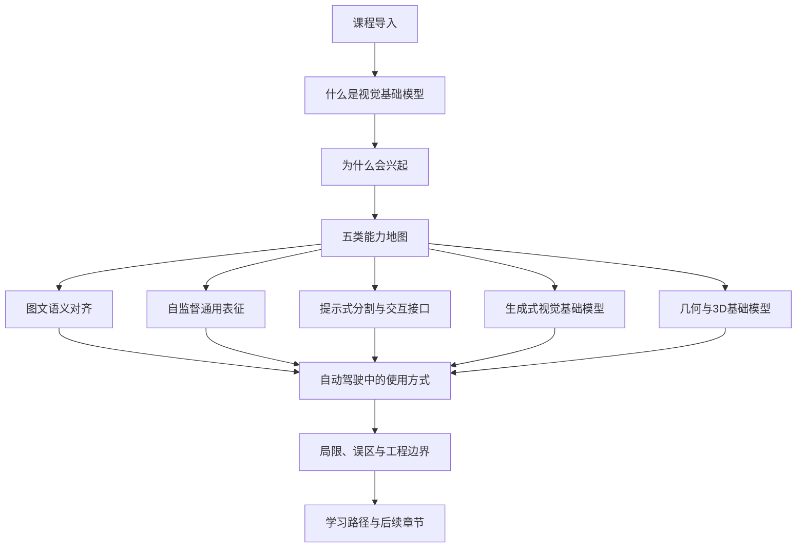
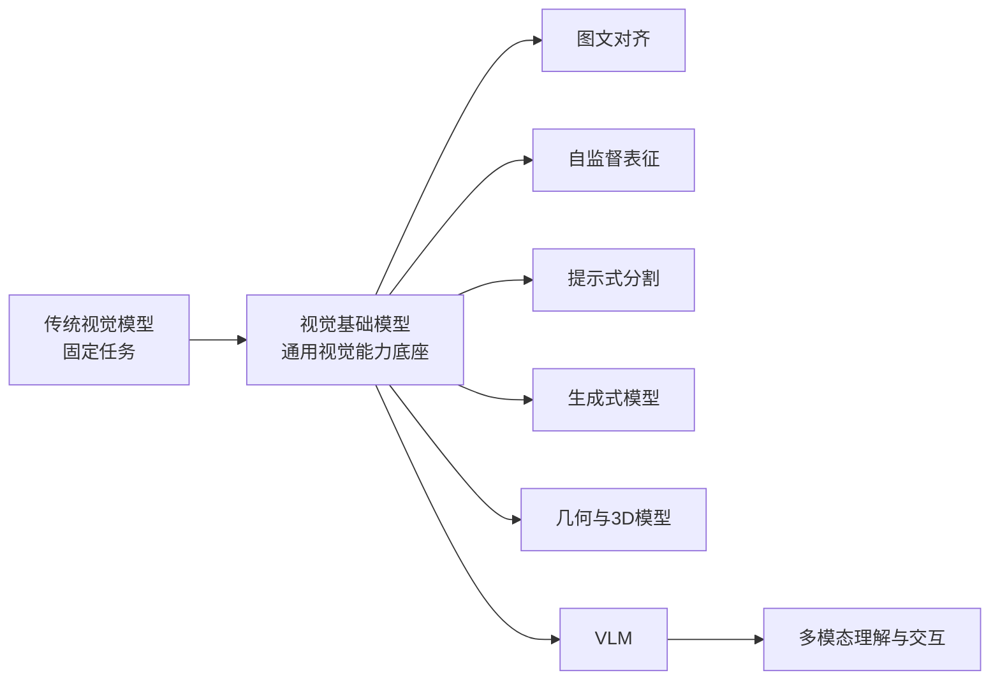
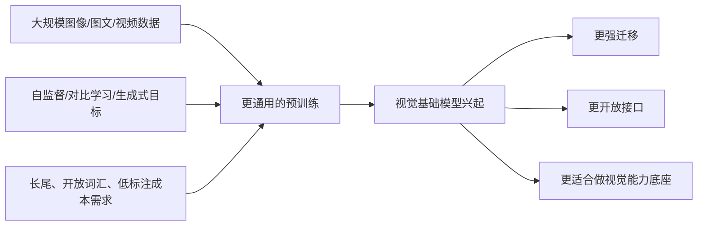
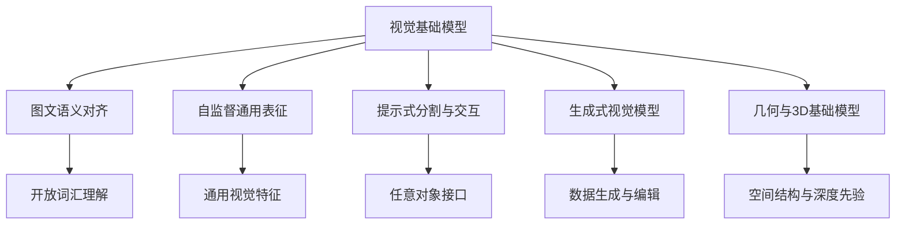
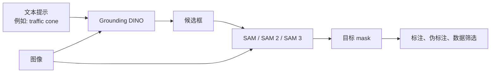
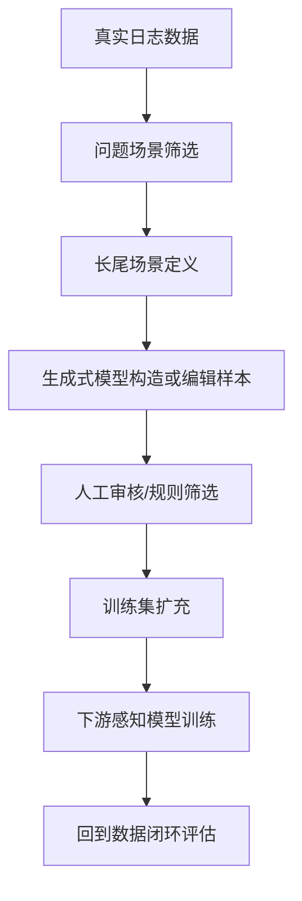
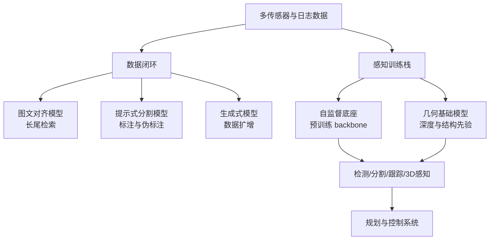
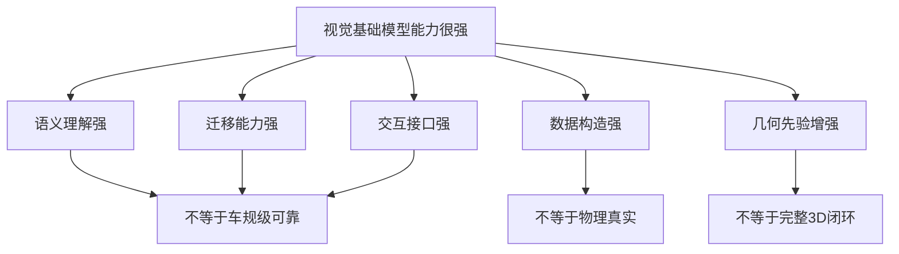

# 5.2 视觉基础大模型（Vision Foundation Models）

这一章不把重点放在“记住多少模型名”，而是帮助你建立一个稳定的理解框架：为什么视觉领域也会出现 foundation model，它们到底比传统视觉模型多了什么能力，它们在自动驾驶里最适合放在哪些位置，又为什么多数情况下不能直接端到端上车。

如果只记住一句话，那么请记住：

> **视觉基础模型的价值，不在于替代所有视觉模块，而在于提供更通用、更开放、更可迁移的视觉能力底座。**

---

## 1. 课程导入

很多同学第一次接触这类内容时，会同时看到 `CLIP`、`DINOv2`、`SAM`、`Stable Diffusion`、`Depth Anything`，然后很快陷入一个困惑：这些模型看起来都很强，但它们究竟是不是一类东西？如果是，它们的共同点是什么？如果不是，为什么又经常被放在一起讨论？

从教学角度看，这一章最重要的不是“逐个背模型”，而是先把几个关键问题讲清楚，再回头看模型谱系。只要主线明确，后面的工作就容易放到正确的位置上。

### 1.1 本章要回答的核心问题

| 问题 | 你读完后应该能回答什么 |
|---|---|
| 什么是视觉基础模型 | 能用自己的话解释“通用视觉能力底座”而不是只会复述定义 |
| 它和传统视觉模型差在哪 | 能说明开放词汇、迁移性、预训练规模、任务接口的不同 |
| 为什么它会兴起 | 能说清楚数据、训练范式、下游需求三条主因 |
| 它主要有哪些类型 | 能把常见工作归到五类能力主题中 |
| 自动驾驶怎么用它 | 能区分“适合做接口增强”和“不适合直接替代安全闭环” |
| 它的边界在哪里 | 能识别语义强不等于几何强、生成强不等于可控强 |

### 1.2 本章学习地图

### 1.3 学习提醒

- 这一章重点是“视觉基础模型是什么、能做什么、放在哪里”。
- `VLM` 的内部结构、视觉 token、projector、指令微调，不在本章展开，留到 [5.3_视觉语言模型（VLM）基础.md](./5.3_视觉语言模型（VLM）基础.md)。
- `VLM` 的使用、微调、评测与工程落地，不在本章展开，留到 [5.4_VLM使用与微调.md](./5.4_VLM使用与微调.md)。

---

## 2. 什么是视觉基础模型

“基础模型”这个词容易让人误解成“模型很大”或者“模型很新”。实际上，更准确的理解是：**它先在大规模、广覆盖的数据上学到通用能力，再通过少量适配迁移到很多下游任务。**

对于视觉领域来说，这意味着模型不再只为一个固定任务服务。例如，传统检测模型通常只会识别预先定义好的若干类别，而视觉基础模型往往希望提供更开放的接口：可以根据文本找目标、根据提示分割对象、根据海量无标注数据学习视觉表征，或者根据图像推断更一般的几何结构。

### 2.1 一个更适合初学者的直觉定义

你可以把传统视觉模型理解为“专项工具”，把视觉基础模型理解为“通用视觉底座”。

- 专项工具：为单一任务优化，任务边界清晰，指标明确。
- 通用底座：先追求跨任务复用，再在不同场景中接出多种能力。

### 2.2 传统任务模型 vs 视觉基础模型

| 维度 | 传统任务模型 | 视觉基础模型 |
|---|---|---|
| 训练目标 | 面向单一任务 | 面向通用能力预训练 |
| 数据来源 | 专项标注数据集 | 大规模互联网数据或跨域混合数据 |
| 类别空间 | 通常封闭 | 更强调开放词汇或通用表征 |
| 迁移方式 | 重新训练任务头 | 微调、提示、适配器、少样本迁移 |
| 接口形式 | 固定输入输出 | 文本提示、点框提示、通用 embedding、生成接口 |
| 典型优势 | 专项指标高、可控性强 | 泛化强、覆盖广、可复用性高 |
| 典型短板 | 泛化窄、长尾弱 | 实时性、可控性、闭环可靠性不稳定 |

### 2.3 它和 VLM 的关系

视觉基础模型不是 VLM 的同义词。更准确地说：

- 视觉基础模型是一个更大的集合。
- VLM 是其中与语言接口结合最紧密的一支。
- 很多强视觉模型本身并不是 VLM，但它们会成为 VLM 的关键视觉底座。

### 2.4 如果你只记住一句话

> **视觉基础模型不是“一个模型”，而是一类先学通用能力、再服务多任务的视觉能力底座。**

---

## 3. 为什么视觉基础模型会兴起

视觉基础模型的兴起不是偶然事件，而是三股力量共同推动的结果：数据规模变了、训练范式变了、下游需求也变了。

### 3.1 数据规模变了

以前很多视觉任务依赖人工精标数据集，比如分类、检测、分割等标准 benchmark。这样的数据非常有价值，但类别有限、场景有限、长尾有限。随着互联网图像、图文对、视频和多源数据的积累，研究者开始不满足于“只在一个封闭数据集上做高分”，而希望学到更一般的视觉能力。

### 3.2 预训练范式变了

从监督学习走向自监督、对比学习、图文对齐、生成式建模以后，模型不必等所有标签都齐全才开始学习。模型可以先在海量数据上学表示，再在下游任务上适配。这个变化本质上让“先学底座、再接任务”成为现实。

### 3.3 下游需求变了

工业系统越来越需要：

- 更强的跨场景迁移能力
- 对长尾目标和开放类别的处理能力
- 更低的人力标注依赖
- 更自然的人机交互接口
- 更强的数据构造与仿真能力

自动驾驶正好是这些需求最集中的场景之一。

### 3.4 三个驱动力总表

| 驱动力 | 过去的状态 | 变化后的状态 | 带来的结果 |
|---|---|---|---|
| 数据 | 小规模、强标注、封闭数据集 | 大规模、多源、弱标注/无标注 | 可以先学通用视觉能力 |
| 训练目标 | 单任务监督训练 | 对比学习、自监督、生成式预训练 | 能力底座开始成型 |
| 下游需求 | 固定类别、固定接口 | 开放词汇、长尾、交互式接口 | 传统任务模型不再足够 |

### 3.5 如果你只记住一句话

> **视觉基础模型兴起，不是因为“模型更大”本身，而是因为大数据、通用预训练和新需求终于对上了。**

---

## 4. 五类能力地图

为了避免把这一章学成“模型名清单”，我们先建立一个能力地图。后面无论看到哪个新工作，都尽量先问：它主要属于哪一类能力？

### 4.1 五类视觉基础模型总表

| 类别 | 核心问题 | 典型输入 | 典型输出 | 代表模型 | 在自动驾驶中的典型价值 |
|---|---|---|---|---|---|
| 图文语义对齐模型 | 图像语义如何与文本空间对齐 | 图像 + 文本 | 跨模态 embedding、开放词汇分类/检索 | `CLIP`、`SigLIP`、`OWL-ViT` | 长尾目标发现、开放词汇理解 |
| 自监督通用表征模型 | 没有大量标签时如何学视觉底座 | 图像/视频 | 通用视觉特征 | `DINO`、`I-JEPA`、`DINOv2` | 作为下游任务 backbone 或预训练底座 |
| 提示式分割与交互接口 | 如何把“任意对象分割”做成通用接口 | 图像 + 点/框/文本提示 | mask、区域、目标候选 | `Grounding DINO`、`SAM`、`SAM 2`、`SAM 3` | 标注加速、伪标注、交互式分割 |
| 生成式视觉基础模型 | 如何生成或编辑视觉数据 | 文本/图像/条件信号 | 合成图像、编辑结果 | `Stable Diffusion`、`SDXL` | 数据扩增、场景构造、仿真辅助 |
| 几何与3D基础模型 | 如何学习深度、结构和空间先验 | 单目/多视图图像 | 深度、几何表示、3D先验 | `MiDaS`、`Depth Anything`、`Depth Anything 3`、`VGGT` | 3D感知先验、结构理解 |

### 4.2 五类能力关系图

### 4.3 一个重要提醒

这五类不是完全割裂的。很多系统会把它们组合起来：

- `CLIP` 类模型提供语义词汇接口
- `SAM` 类模型提供区域级接口
- 自监督模型提供稳定的视觉特征
- 生成式模型帮助构造数据
- 几何模型补足空间结构先验

后面进入 VLM 时，你会看到这些能力被进一步组合进统一的多模态系统中。

### 4.4 如果你只记住一句话

> **不要先背模型名，先把模型放回“语义、表征、接口、生成、几何”这五类能力主题里。**

---

## 5. 五大类模型逐类讲解

下面五节采用统一模板：

- 这一类模型解决什么问题
- 输入和输出是什么
- 与传统任务模型差别在哪里
- 代表工作时间线
- 2 到 4 个代表模型简讲
- 核心贡献
- 在自动驾驶里放在哪
- 不能替代什么
- 一张总结表

### 5.1 图文语义对齐模型

#### 5.1.1 这一类模型在解决什么问题

传统视觉分类和检测往往依赖封闭标签集。问题在于，真实世界并不是只包含数据集里那几十类或几百类目标。图文语义对齐模型试图解决的是：**能不能把图像映射到和语言共享的语义空间里，让视觉系统拥有更开放的词汇接口。**

#### 5.1.2 输入和输出是什么

| 项目 | 内容 |
|---|---|
| 典型输入 | 图像、文本描述、类别短语 |
| 典型输出 | 图像 embedding、文本 embedding、匹配分数、开放词汇类别、区域级检索结果 |
| 典型能力 | 图文检索、零样本分类、开放词汇检测 |

#### 5.1.3 与传统任务模型差别在哪里

- 传统分类模型回答“这是不是预设类别中的某一类”。
- 图文对齐模型回答“这张图和哪段文本更语义一致”。

这意味着它的类别空间不再完全由训练时的 softmax 分类头锁死，而是部分转移到语言空间中。

#### 5.1.4 代表工作时间线

- `CLIP (2021)`：把海量图文对齐做成通用视觉语义接口。
- `OWL-ViT (2022)`：把开放词汇能力推进到目标检测。
- `SigLIP (2023)`：对图文对齐训练目标进行改进。

#### 5.1.5 代表模型简讲

`CLIP` 是很多同学接触视觉 foundation model 的起点。它最重要的贡献不只是“零样本分类”，而是让视觉模型第一次大规模获得了自然语言词汇接口。  

`OWL-ViT` 可以理解为把开放词汇能力从整图分类推进到区域级检测。它回答的是“图里有没有我用文本描述的目标，并且它在哪里”。  

`SigLIP` 延续了 CLIP 路线，但在训练目标设计上做了改进，反映出这条路线已经从“概念证明”进入“训练细节和工程质量继续优化”的阶段。

#### 5.1.6 这类模型的核心贡献

- 把视觉语义映射进语言空间
- 提供开放词汇接口
- 明显提升长尾类别发现能力
- 成为后续大量 VLM 的视觉语义基础

#### 5.1.7 在自动驾驶里最适合放在哪

最适合的位置不是直接替代主感知闭环，而是作为“开放语义接口”使用：

- 长尾目标发现
- 场景语义检索
- 数据筛选与聚类
- 稀有事件召回

例如，当我们想在海量日志中找“施工锥桶旁边的临时告示牌”这类长尾场景时，开放词汇接口通常比固定类别检测器更灵活。

#### 5.1.8 它不能替代什么

- 不能直接替代高实时、高确定性的主检测器
- 不能保证精确的几何定位
- 不能天然解决时序稳定性问题

#### 5.1.9 总结表

| 模型 | 年份 | 解决重点 | 代表能力 | 自动驾驶中的价值 |
|---|---|---|---|---|
| `CLIP` | 2021 | 图文共享语义空间 | 零样本分类、图文检索 | 开放语义入口、长尾理解 |
| `OWL-ViT` | 2022 | 开放词汇检测 | 文本找目标位置 | 长尾目标发现、场景查询 |
| `SigLIP` | 2023 | 图文对齐目标优化 | 更稳健的图文语义匹配 | 更好的底座表征与检索 |

### 5.2 自监督通用表征模型

#### 5.2.1 这一类模型在解决什么问题

图文语义对齐强调“和语言对齐”，自监督通用表征模型强调“即使没有大量标签，也要先把视觉特征学好”。  

它们解决的是一个更底层的问题：**如果我们先不急着做具体任务，能不能直接从海量图像中学到足够泛化的视觉表示。**

#### 5.2.2 输入和输出是什么

| 项目 | 内容 |
|---|---|
| 典型输入 | 图像、图像增强视图、局部 patch、上下文区域 |
| 典型输出 | 通用视觉特征、patch-level 表征、dense feature |
| 典型能力 | 下游迁移、检索、聚类、分割初始化、检测 backbone |

#### 5.2.3 与传统任务模型差别在哪里

传统任务模型常常把特征学习绑定在一个具体监督任务上。自监督基础模型则先让模型在更一般的训练目标下学习结构化视觉表示，再把这些表示迁移出去。

这类模型的价值往往体现在：

- 标签不够时更有优势
- 迁移到多个任务时更稳定
- 常常可以作为更强的视觉 backbone

#### 5.2.4 代表工作时间线

- `DINO (2021)`：蒸馏式自监督表征的代表。
- `I-JEPA (2023)`：强调预测式世界结构理解。
- `DINOv2 (2023)`：把大规模通用视觉底座做成熟。
- `DINOv3 (2025)`：继续扩大规模与密集特征能力。

#### 5.2.5 代表模型简讲

`DINO` 的重要意义在于，它让人们看到：即使没有传统标签，模型也可以学到非常有用的视觉表征。  

`I-JEPA` 代表的是另一种思路：不是只做视图对齐，而是做更偏预测式的表示学习，强调对上下文和结构的理解。  

`DINOv2` 则更像“通用视觉 backbone 的工程成熟版”。它不是只证明一个想法，而是把大规模数据、训练策略和下游可迁移性做到了更稳定的水平。

#### 5.2.6 这类模型的核心贡献

- 降低对人工标注的依赖
- 提供通用视觉底座
- 让下游任务能从更强的初始化出发
- 为分割、检测、检索、VLM 等系统提供视觉 backbone

#### 5.2.7 在自动驾驶里最适合放在哪

- 作为感知模型的预训练 backbone
- 用于数据聚类、场景检索和表示学习
- 作为下游检测、分割、追踪模型的初始化

这类模型的“工程价值”很强，因为它们往往不直接面向最终用户，而是提升整个感知栈的底层特征质量。

#### 5.2.8 它不能替代什么

- 不能直接替代完整任务头
- 不能直接给出开放语义解释
- 不能自动解决闭环策略问题

#### 5.2.9 总结表

| 模型 | 年份 | 解决重点 | 代表能力 | 自动驾驶中的价值 |
|---|---|---|---|---|
| `DINO` | 2021 | 蒸馏式自监督表征 | 通用特征学习 | 预训练 backbone |
| `I-JEPA` | 2023 | 预测式视觉表示学习 | 上下文结构理解 | 更强的表征学习思路 |
| `DINOv2` | 2023 | 大规模通用底座成熟化 | 强迁移 dense feature | 多任务预训练底座 |
| `DINOv3` | 2025 | 更大规模与更强密集表征 | 更强下游迁移 | 更先进视觉底座候选 |

### 5.3 提示式分割与交互式接口模型

#### 5.3.1 这一类模型在解决什么问题

很多视觉系统不是“不知道图里是什么”，而是不知道“用户到底想要哪一个对象”。  

提示式分割模型解决的问题是：**把对象级交互做成一个通用接口，让系统根据点、框、文本等提示快速产出区域级结果。**

#### 5.3.2 输入和输出是什么

| 项目 | 内容 |
|---|---|
| 典型输入 | 图像、点提示、框提示、文本提示、视频序列 |
| 典型输出 | mask、候选区域、目标区域轨迹 |
| 典型能力 | 任意对象分割、交互标注、区域提议、视频对象跟踪式分割 |

#### 5.3.3 与传统任务模型差别在哪里

传统分割器一般只在固定类别或固定任务上输出 mask。提示式模型则强调“接口通用”：

- 输入提示变了，输出对象就变了
- 不一定预设类别
- 更适合做人机协同和数据生产

#### 5.3.4 代表工作时间线

- `Grounding DINO (2023)`：把文本 grounding 到目标区域。
- `SAM (2023)`：把任意对象分割做成通用接口。
- `SAM 2 (2024)`：从图像拓展到视频与时序对象。
- `SAM 3 (2025)`：把 concept prompt、检测、分割和视频跟踪进一步统一到一个更开放的接口里。

#### 5.3.5 代表模型简讲

`Grounding DINO` 更像“文本找框”的前端。它回答的是“你说的那个东西，可能在图里的哪里”。  

`SAM` 更像“区域切割接口”的后端。给它点、框或区域提示，它就努力产出对应 mask。  

`SAM 3` 则代表这条路线进一步从“任意对象分割”走向“带概念的统一分割接口”。它不只关心用户点中了哪里，还试图理解“黄色校车”“施工锥桶”这类概念级提示，并把检测、分割、跟踪串成一条更完整的开放世界工作流。  

把两者串起来时，会出现一个非常实用的工程工作流：先用文本模型找候选目标，再用分割模型切出精确区域。

#### 5.3.6 一条典型工作流

#### 5.3.7 这类模型的核心贡献

- 把任意对象分割做成统一接口
- 降低大规模标注成本
- 让开放词汇与区域级操作连接起来
- 让人机交互式标注效率显著提高

#### 5.3.8 在自动驾驶里最适合放在哪

- 标注平台加速
- 伪标注生成
- 长尾目标区域提取
- 视频对象跟踪式分割辅助

这类模型在自动驾驶中的最大价值，通常不是“在线推理替代主感知”，而是“离线数据闭环生产率提升”。

#### 5.3.9 它不能替代什么

- 不能天然保证车规级实时性
- 不能替代高稳定性的专用在线分割/检测链路
- 文本提示和 mask 结果仍可能不稳定

#### 5.3.10 总结表

| 模型 | 年份 | 解决重点 | 代表能力 | 自动驾驶中的价值 |
|---|---|---|---|---|
| `Grounding DINO` | 2023 | 文本到目标区域 | grounding、开放词汇定位 | 长尾目标区域召回 |
| `SAM` | 2023 | 通用任意对象分割 | 点框提示分割 | 标注效率提升 |
| `SAM 2` | 2024 | 视频与时序对象分割 | 时序分割接口 | 视频标注与跟踪辅助 |
| `SAM 3` | 2025 | 概念提示下的统一检测-分割-跟踪 | promptable concept segmentation | 更开放的长尾对象分割与跟踪接口 |

### 5.4 生成式视觉基础模型

#### 5.4.1 这一类模型在解决什么问题

生成式视觉模型解决的不是“看懂图像”，而是“生成、编辑或补足图像数据”。  

这听起来离自动驾驶感知很远，但实际上它们对数据构造、仿真、场景扩充、极端样本增强非常重要。

#### 5.4.2 输入和输出是什么

| 项目 | 内容 |
|---|---|
| 典型输入 | 文本提示、图像条件、区域掩码、控制条件 |
| 典型输出 | 合成图像、编辑图像、条件生成结果 |
| 典型能力 | 文生图、图像编辑、风格迁移、场景扩增 |

#### 5.4.3 与传统任务模型差别在哪里

传统视觉模型主要做“识别”，生成式模型主要做“构造”。  

这意味着它们不一定直接提升主感知网络的在线精度，但会显著影响：

- 数据供给能力
- 长尾样本覆盖
- 仿真与合成场景构建
- 模型训练前的数据准备效率

#### 5.4.4 代表工作时间线

- `Latent Diffusion / Stable Diffusion (2022)`：把开放世界视觉生成做成通用平台。
- `SDXL (2023)`：在分辨率、质量和文本一致性上进一步增强。

#### 5.4.5 代表模型简讲

`Stable Diffusion` 的意义在于，它把生成式图像模型从“少数实验室能力”变成了“广泛可用的开放平台能力”。  

`SDXL` 则代表这条路线进入更强工程质量阶段：更高分辨率、更自然的细节、更稳定的文本控制。

#### 5.4.6 这类模型的核心贡献

- 用生成能力缓解数据稀缺
- 为长尾与极端场景构造提供工具
- 为仿真场景、多样性增强、编辑式数据构造提供基础设施

#### 5.4.7 在自动驾驶里最适合放在哪

- 稀有场景扩增
- 天气、光照、施工态等条件变化构造
- 仿真资产补充
- 数据闭环中的场景编辑与样本增强

#### 5.4.8 它不能替代什么

- 不能直接证明在线闭环性能一定提升
- 不能保证生成数据完全符合物理与传感器统计
- 不能替代高保真仿真器和真实道路数据

#### 5.4.9 总结表

| 模型 | 年份 | 解决重点 | 代表能力 | 自动驾驶中的价值 |
|---|---|---|---|---|
| `Stable Diffusion` | 2022 | 开放视觉生成平台 | 文生图、图像编辑 | 数据扩增与场景构造 |
| `SDXL` | 2023 | 更高质量生成 | 高分辨率、更好文本一致性 | 更高质量合成样本 |

### 5.5 几何与 3D 基础模型

#### 5.5.1 这一类模型在解决什么问题

前四类模型里，语义能力很强，但自动驾驶还需要另一种关键能力：**对空间结构的理解。**  

几何与 3D 基础模型试图解决的问题是：如何从图像中学到深度、结构和空间先验，并把这些能力做成更通用的几何底座。

#### 5.5.2 输入和输出是什么

| 项目 | 内容 |
|---|---|
| 典型输入 | 单目图像、多视图图像、视频帧 |
| 典型输出 | 深度图、几何特征、3D结构先验、场景表示 |
| 典型能力 | 单目深度估计、多视图几何理解、场景结构恢复 |

#### 5.5.3 与传统任务模型差别在哪里

传统深度估计器常针对单一数据集或固定场景优化。几何 foundation model 更强调：

- 跨场景泛化
- 从大规模视觉数据中学习通用几何先验
- 将几何理解作为可复用底座，而非一次性任务头

#### 5.5.4 代表工作时间线

- `MiDaS v3.1 (2023)`：单目深度的重要通用基线。
- `Depth Anything (2024)`：通用单目深度 foundation model 路线成型。
- `Depth Anything V2 (2024)`：更强更快的增强版本。
- `Depth Anything 3 / DA3 (2025-11-14 公开)`：从单图深度进一步走向 any-view geometry 与相机位姿估计。
- `VGGT (2025)`：几何 foundation model 的代表方向。

#### 5.5.5 代表模型简讲

`MiDaS` 可以看作单目深度通用化道路上的重要基线。  

`Depth Anything` 之所以重要，是因为它把“深度估计不是一个固定 benchmark 小任务，而是一种可迁移几何底座”这件事讲得更清楚了。  

`Depth Anything 3` 则把问题进一步扩展了。它不再只强调“单张图的深度好不好”，而是把目标推向“任意视角输入下的空间几何恢复”，同时覆盖多视图深度、相机位姿估计、3D Gaussian 等更完整的视觉几何任务。这说明几何 foundation model 正在从“深度模型”向“视觉空间恢复底座”演化。  

`VGGT` 则更进一步，把几何理解推向更 general 的 foundation model 方向，强调的不只是某一张图的深度，而是更一般的空间结构能力。

#### 5.5.6 一条几何到 3D 感知的理解链路

#### 5.5.7 这类模型的核心贡献

- 提供更通用的几何先验
- 缓解特定数据集几何过拟合
- 为 3D 感知任务提供更强初始化或辅助约束

#### 5.5.8 在自动驾驶里最适合放在哪

- 深度先验与几何先验增强
- 单目或多视图 3D 感知辅助
- 场景结构理解
- BEV、占据和三维语义建模的上游补充

#### 5.5.9 它不能替代什么

- 不能替代完整的多传感器融合系统
- 不能保证所有距离尺度都精确可靠
- 不能自动解决动态目标预测和行为建模

#### 5.5.10 总结表

| 模型 | 年份 | 解决重点 | 代表能力 | 自动驾驶中的价值 |
|---|---|---|---|---|
| `MiDaS v3.1` | 2023 | 通用单目深度基线 | 深度估计 | 深度先验参考 |
| `Depth Anything` | 2024 | 通用深度 foundation model | 更强跨域深度泛化 | 单目/多场景几何底座 |
| `Depth Anything V2` | 2024 | 强化版本 | 更强性能与适应性 | 更实用的深度底座 |
| `Depth Anything 3` | 2025 | any-view geometry 与统一视觉空间恢复 | 多视图深度、位姿、3D几何 | 更完整的几何 foundation model 候选 |
| `VGGT` | 2025 | 几何 foundation model | 更一般空间结构能力 | 3D感知与世界建模先验 |

### 5.6 五类模型阶段性小结

到这里你应该形成一个稳定印象：

- 图文对齐模型提供开放语义接口
- 自监督模型提供通用视觉特征
- 提示式分割模型提供交互式区域接口
- 生成式模型提供数据构造能力
- 几何模型提供空间结构先验

> **这五类模型的共同点不是“做同一件事”，而是都在把某种视觉能力从任务模型提升为可复用的底座能力。**

---

## 6. 自动驾驶如何使用这些模型能力

理解视觉基础模型，最终还是要回答一个工程问题：**它们到底应该放进自动驾驶系统的哪里。**

一个很实用的判断原则是：

- 语义开放性强的模型，适合做高层语义接口和数据闭环工具
- 表征强的模型，适合做底层 backbone 或预训练底座
- 交互式模型，适合做标注和数据生产工具
- 生成式模型，适合做数据构造与仿真补充
- 几何模型，适合做 3D 先验和结构理解补充

### 6.1 五类模型与自动驾驶任务映射表

| 模型类别 | 最适合的系统位置 | 主要价值 | 不建议直接承担的角色 |
|---|---|---|---|
| 图文语义对齐 | 日志检索、长尾发现、开放语义接口 | 稀有目标召回、语义搜索 | 主闭环检测器 |
| 自监督通用表征 | backbone 预训练、表示学习 | 提升多任务底座质量 | 直接输出最终驾驶决策 |
| 提示式分割与交互 | 标注平台、伪标注流水线 | 降本增效、人机协同 | 车端实时主分割器 |
| 生成式视觉模型 | 数据扩增、仿真补充、场景编辑 | 提升样本多样性 | 替代真实道路数据 |
| 几何与3D模型 | 深度先验、结构先验、3D辅助 | 增强空间理解 | 替代完整多传感器几何系统 |

### 6.2 自动驾驶中的典型落位图

### 6.3 三个最常见的高价值用法

#### 6.3.1 开放词汇长尾目标发现

当传统标签集没有覆盖目标时，图文语义对齐模型可以帮助我们在海量日志中检索新类别或稀有类别。

#### 6.3.2 标注加速与伪标注链路

`Grounding DINO + SAM` 这类组合特别适合做“文本找目标 + 区域切割”的离线数据生产链路。

#### 6.3.3 3D 先验与结构增强

几何基础模型不一定直接上车，但可以作为训练时的辅助监督、先验约束或数据理解工具，提升 3D 感知模型的底座质量。

### 6.4 为什么多数情况下不直接端到端上车

很多视觉 foundation model 在公开 benchmark 上很强，但自动驾驶是一个对以下因素都极其敏感的系统：

- 实时性
- 稳定性
- 时序一致性
- 长尾安全性
- 闭环可解释性
- 车规算力成本

因此，它们更常见的角色是“增强器”和“底座能力”，而不是直接取代安全关键链路。

---

## 7. 局限、误区与工程边界

视觉基础模型非常重要，但如果理解方式不稳，很容易高估它们。

### 7.1 常见误区与正确理解

| 常见误区 | 更准确的理解 |
|---|---|
| foundation model 很强，所以可以直接替代车端感知栈 | 强能力不等于高可靠闭环部署 |
| 语义理解强，就代表几何理解也强 | 语义强和几何强是两件事 |
| 生成能力强，就能随意造训练数据 | 生成数据仍受物理真实性、分布偏差和筛选流程约束 |
| 开放词汇检测强，就能替代主检测器 | 开放词汇更适合长尾补充与离线分析 |
| 提示式分割很强，就能直接实时在线全量跑 | 交互式接口价值更大，在线部署需严格约束 |

### 7.2 一个能力边界图

### 7.3 三条最重要的工程边界

#### 7.3.1 foundation model 强，不等于车规可靠

公开数据集性能和真实道路闭环性能之间隔着很长一条工程链路。任何进入主链路的模型，都必须经受时延、温度、算力、时序和失效模式分析。

#### 7.3.2 互联网预训练分布，不等于车载分布

互联网图像和自动驾驶车载数据在视角、遮挡、天气、夜间、传感器噪声、运动模糊上差异很大。  

所以 foundation model 提供的是一个好起点，而不是直接可用的终点。

#### 7.3.3 语义强不等于几何强，生成强不等于可控强

这两句几乎可以当作整个章节的工程提醒：

- 会看图说话，不等于能稳定判断空间距离。
- 会生成逼真图像，不等于能生成满足闭环训练要求的数据。

### 7.4 如果你只记住一句话

> **视觉基础模型最适合被看作“能力放大器”，而不是“无需约束即可直接替代系统”的万能模块。**

---

## 8. 学习路径与章节衔接

### 8.1 建议的学习顺序

对于初学者，最好的顺序不是按模型发表年份背，而是按“能力主题”学习：

1. 先理解视觉基础模型和传统任务模型的差别
2. 再理解五类能力主题
3. 再看每类代表工作
4. 最后再进入 VLM，把这些能力组合起来看

### 8.2 与相邻章节的边界速查表

| 章节 | 主要问题 | 本章是否展开 |
|---|---|---|
| `5.2 视觉基础大模型` | 视觉 foundation model 是什么、有哪些能力、怎么落位 | 是 |
| `5.3 视觉语言模型（VLM）基础` | VLM 的结构、visual token、projector、训练范式 | 否，本章只做前置铺垫 |
| `5.4 VLM 使用与微调` | 自动驾驶里怎么接入、微调、评测、工程落地 | 否，本章不展开具体微调流程 |

### 8.3 读论文时建议固定问自己的五个问题

1. 这个工作主要属于五类能力中的哪一类？
2. 它解决的核心问题是什么？
3. 它的输入输出接口是什么？
4. 它更适合放在训练前、训练中、离线工具链，还是在线系统里？
5. 它真正改变了什么，而不是只把指标又推高了一点点？

### 8.4 本章复习速查表

| 复习点 | 你应当能说出的关键词 |
|---|---|
| 基础模型定义 | 通用底座、先预训练后迁移、多任务复用 |
| 兴起原因 | 大数据、预训练范式变化、开放需求 |
| 五类能力 | 语义、表征、接口、生成、几何 |
| 自动驾驶价值 | 长尾发现、底座预训练、标注加速、数据扩增、3D先验 |
| 工程边界 | 实时性、可靠性、分布差异、可控性 |

### 8.5 关键论文与阅读入口

| 主题 | 代表工作 | 你应该重点看什么 |
|---|---|---|
| 图文语义对齐 | `CLIP` | 为什么语言接口能打开开放词汇能力 |
| 开放词汇检测 | `OWL-ViT` | 图文对齐如何延伸到区域级定位 |
| 自监督表征 | `DINO`、`DINOv2` | 没标签时如何先学通用视觉特征 |
| 提示式分割 | `SAM` | 任意对象分割如何变成通用接口 |
| 生成式模型 | `Stable Diffusion` | 生成能力如何服务数据与仿真 |
| 几何基础模型 | `Depth Anything`、`Depth Anything 3`、`VGGT` | 视觉 foundation model 如何补足几何先验 |

---

## 9. 本章总结与课后思考

### 9.1 本章总结

这一章真正想建立的是一个判断框架：

- 不要把视觉基础模型当成单一模型，而要把它理解为一组通用视觉能力底座。
- 不要把重点放在背模型名，而要先分清五类能力主题。
- 不要默认“模型强就能直接上车”，而要先问它适合放在系统的哪一层。

从自动驾驶视角看，视觉基础模型最重要的价值通常体现在：

- 扩展开放语义接口
- 提升视觉 backbone 质量
- 降低数据生产成本
- 增强几何与结构先验
- 为后续 VLM 与多模态系统打底

### 9.2 课后思考

1. 为什么说 `CLIP` 的重要性不只是零样本分类，而是“开放词汇接口”？
2. 为什么自监督视觉底座在工业系统中往往比表面上看起来更重要？
3. `Grounding DINO + SAM` 为什么特别适合放进标注与伪标注流水线？
4. 为什么生成式模型在自动驾驶中更适合做数据基础设施，而不是直接做主感知？
5. 为什么“语义强不等于几何强”是自动驾驶里必须反复提醒自己的一句话？

### 9.3 收束到下一章

读到这里，你应该已经有了一个比较稳的视觉 foundation model 地图。下一章 [5.3_视觉语言模型（VLM）基础.md](./5.3_视觉语言模型（VLM）基础.md) 会在这个基础上继续回答一个更具体的问题：**当视觉底座开始和语言模型真正耦合时，VLM 的结构、训练方式和能力边界到底是什么。**
