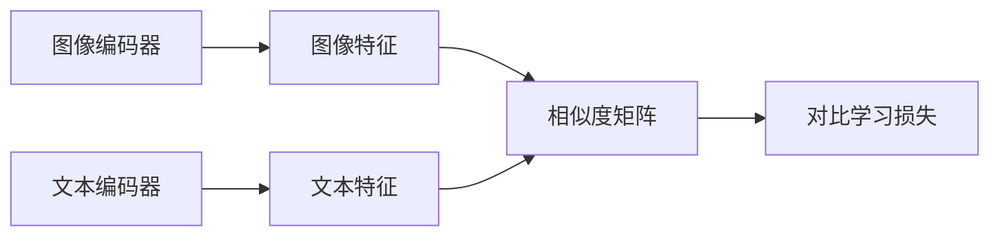

# 5.2 视觉基础大模型 (Vision Foundation Models)

视觉基础大模型可以理解为一类“先在海量图像、视频、图文对、无标注数据上学会通用视觉能力，再迁移到下游任务”的模型。它们和传统“为一个任务单独训练一个模型”的思路不同，更强调：

- 先学通用表示，再适配具体任务。
- 先形成开放世界接口，再落到封闭标签空间。
- 先把“看懂世界”做强，再把检测、分割、检索、生成、几何恢复、三维理解逐步串起来。

如果用一句更偏工程的话来说，**视觉基础大模型不是某一个单点任务模型，而是一层通用视觉能力底座。**

这一章不再按“列模型名”的方式展开，而是按能力主题组织。这样做的好处是，读者不会把 `CLIP`、`SAM`、`Depth Anything`、`Stable Diffusion`、`VGGT` 误看成同一维度上的并列替代品，而是能更清楚地理解：**不同视觉基础模型在回答不同的问题。**

> [!TIP]
> 可以先记住一个很实用的认知框架：
>
> - **视觉语义对齐模型回答：这是什么。**
> - **自监督表征模型回答：怎么看得更稳。**
> - **提示式接口模型回答：该切哪里、该找哪里。**
> - **生成式视觉模型回答：世界还能怎样变化。**
> - **几何基础模型回答：世界的空间结构是什么。**

---

## 1. 什么是视觉基础大模型

“基础模型（foundation model）”这个说法，强调的不是参数越大越好，而是模型是否具备下面几种能力：

- 能在大规模预训练后迁移到多个任务。
- 能在弱监督、无监督或多模态监督下学到通用表示。
- 能作为其他系统的上游底座，而不是只服务一个固定输出头。
- 能在开放词汇、开放场景、开放分布下保持一定泛化能力。

放到视觉领域里，这意味着模型不再只是“检测器”“分割器”或者“分类器”，而是开始承担更基础的角色：

- 作为通用视觉编码器。
- 作为视觉和语言之间的语义接口。
- 作为数据引擎里的教师模型、检索器、聚类器或标注工具。
- 作为后续 VLM、VLA、世界模型、几何模型的视觉前端。

### 1.1 为什么这一章要把 CLIP 放在这里

严格说，`CLIP (2021)` 已经把视觉和语言接了起来，论文是 OpenAI 的 [Learning Transferable Visual Models From Natural Language Supervision (2021)](https://arxiv.org/abs/2103.00020)，官方技术博客可参考 [CLIP: Connecting text and images](https://openai.com/index/clip/)。但本章仍然把它放在“视觉基础大模型”里，而不是直接归入完整 VLM，原因很明确：

- 它本质上是**图像编码器 + 文本编码器 + 对比学习**的双塔对齐模型。
- 它强在图文语义对齐、零样本分类、开放词汇接口。
- 它并不具备成熟的生成式语言能力。
- 它也不擅长复杂多轮推理、长上下文理解、细粒度指令遵循。

也就是说，CLIP 更像是“视觉开始接到语言的起点”，而不是“已经变成会看会说会推理的完整视觉语言模型”。因此：

- 在本章里，我们把 CLIP 看作**视觉基础模型历史上的关键起点**。
- 到 [5.3_VLM.md](c:/Users/acheng/Desktop/Autonomous-Driving-From-Zero/docs/05_大模型基础/5.3_VLM.md) 再继续展开真正意义上的 VLM。

### 1.2 它和传统任务模型到底差在哪

传统视觉模型更像“专门工种”：

- 检测模型专门做检测。
- 分割模型专门做分割。
- 深度模型专门做深度估计。
- 检索模型专门做检索。

视觉基础大模型更像“通用工种”：

- 一个模型学到的表示可以迁移到多个任务。
- 同一套表征可以支持零样本分类、开放词汇检测、提示分割、聚类检索、伪标注、数据合成、几何恢复等多种用法。
- 它不一定直接输出终极任务答案，但可以显著增强整条视觉工作流。

---

## 2. 为什么视觉基础模型会兴起

视觉基础模型的兴起，不是单个“天才模型”突然出现，而是几股力量长期汇合的结果。

### 2.1 数据规模变了

过去很多视觉模型依赖人工标注数据集，例如 ImageNet、COCO、Cityscapes。它们质量高，但规模和开放性有限。后来研究者开始系统利用：

- 海量图文对数据。
- 海量无标注图像。
- 更长时间尺度的视频数据。
- 多视角几何和稀疏三维重建数据。

于是监督信号不再只来自“干净标签”，而开始来自：

- 对比学习信号。
- 重建式预训练信号。
- 预测式自监督信号。
- 提示式交互信号。
- 生成式建模信号。

### 2.2 预训练范式变了

过去的主流思路通常是“为任务训练模型”，现在更接近：

1. 大规模预训练学通用表示。
2. 在中间层形成统一接口或强 prior。
3. 再在小规模任务上迁移、蒸馏、微调或提示使用。

这和 NLP/LLM 的发展路径非常像，因此“foundation model”在视觉中也逐渐站稳。

### 2.3 下游任务需求变了

真实世界系统，尤其是自动驾驶系统，并不满足于只在闭集标签上做高分。它们越来越需要：

- 开放词汇理解。
- 长尾目标发现。
- 海量无标注数据利用。
- 生成式数据增强。
- 统一的几何与三维先验。
- 数据引擎自动化。

而传统单任务模型在这些问题上往往不够自然。

---

## 3. 视觉基础模型的五类能力版图

如果只看模型名字，很容易把这条路线看成“名词表”。更重要的是先建立能力地图，再去看模型如何各自落位。

### 3.1 五类能力

1. **视觉语义对齐模型**  
   代表工作：`CLIP (2021)`、`SigLIP (2023)`、`OWL-ViT (2022)`  
   核心问题：图像怎样和语言在同一语义空间对齐。

2. **自监督通用表征模型**  
   代表工作：`DINO (2021)`、`I-JEPA (2023)`、`DINOv2 (2023)`、`DINOv3 (2025)`  
   核心问题：没有标签时，如何学到稳定、可迁移的视觉表示。

3. **提示式分割与交互式接口**  
   代表工作：`Grounding DINO (2023)`、`YOLO-World (2024)`、`SAM (2023)`、`SAM 2 (2024)`、`SAM 3 / 3.1 (2025 / 2026)`  
   核心问题：如何把“文本指定目标”“框出目标”“精细切出目标”连成一条统一链路。

4. **生成式视觉基础模型**  
   代表工作：`Latent Diffusion / Stable Diffusion (2022)`、`SDXL (2023)`  
   核心问题：如何学习开放世界视觉先验，并以生成、编辑、补全、合成的方式使用它。

5. **几何与3D感知基础模型**  
   代表工作：`MiDaS v3.1 (2023)`、`Depth Anything (2024)`、`Depth Anything V2 (2024)`、`Depth Anything 3 (2025 年 11 月 arXiv 公开)`、`VGGT (2025)`  
   核心问题：如何把视觉基础能力从二维语义推进到深度、相机、点图和三维结构。

### 3.2 一条简明时间线

- **2021 年，CLIP** 证明视觉可以通过语言监督获得强零样本迁移能力。论文：[CLIP (2021)](https://arxiv.org/abs/2103.00020)。
- **2021 年，DINO** 证明即使没有人工标签，ViT 也能学到强视觉表示。论文：[DINO (2021)](https://arxiv.org/abs/2104.14294)。
- **2022 年，Stable Diffusion** 把 latent diffusion 推向开放世界图像生成平台化。理论基础论文是 CompVis 的 [High-Resolution Image Synthesis with Latent Diffusion Models (2022)](https://arxiv.org/abs/2112.10752)。
- **2022 年，OWL-ViT** 把开放词汇能力推进到目标检测层面。论文：[OWL-ViT (2022)](https://arxiv.org/abs/2205.06230)。
- **2023 年，I-JEPA** 代表预测式自监督视觉学习路线。论文：[I-JEPA (2023)](https://arxiv.org/abs/2301.08243)。
- **2023 年，SigLIP** 代表 CLIP 路线在训练目标上的重要演进。论文：[SigLIP (2023)](https://arxiv.org/abs/2303.15343)。
- **2023 年，Grounding DINO** 把开放词汇 grounding 与检测自然结合。论文：[Grounding DINO (2023)](https://arxiv.org/abs/2303.05499)。
- **2023 年，SAM** 把“可提示分割”做成通用接口。论文：[SAM (2023)](https://arxiv.org/abs/2304.02643)。
- **2023 年，DINOv2** 把大规模自监督视觉表征系统化。论文：[DINOv2 (2023)](https://arxiv.org/abs/2304.07193)。
- **2023 年，SDXL** 代表 Stable Diffusion 系列走向高分辨率和更强文本一致性。论文：[SDXL (2023)](https://arxiv.org/abs/2307.01952)。
- **2023 年，MiDaS v3.1** 代表通用单目深度估计的重要工程与研究基线。论文：[MiDaS v3.1 (2023)](https://arxiv.org/abs/2307.14460)。
- **2024 年，YOLO-World** 把实时开放词汇检测工程化。论文：[YOLO-World (2024)](https://arxiv.org/abs/2401.17270)，项目页：[YOLO-World](https://github.com/AILab-CVC/YOLO-World)。
- **2024 年，Depth Anything** 和 **Depth Anything V2** 让通用单目深度模型真正基础化。论文：[Depth Anything (2024)](https://arxiv.org/abs/2401.10891)、[Depth Anything V2 (2024)](https://arxiv.org/abs/2406.09414)。
- **2024 年，SAM 2** 把能力从图像扩展到视频和时序记忆。论文：[SAM 2 (2024)](https://arxiv.org/abs/2408.00714)。
- **2025 年，DINOv3** 继续把自监督视觉表示推向更大规模、更强密集特征。官方博客：[Introducing DINOv3 (2025)](https://ai.meta.com/blog/dinov3-self-supervised-vision-model/)。
- **2025 年，VGGT** 代表几何 foundation model 的核心方向。论文页：[VGGT: Visual Geometry Grounded Transformer (2025)](https://huggingface.co/papers/2503.11651)。
- **2025 年 11 月，Depth Anything 3** 公开 arXiv 版本，已经从单图深度扩展到 any-view geometry。论文页：[Depth Anything 3: Recovering the Visual Space from Any Views (2025)](https://huggingface.co/papers/2511.10647)。
- **2025 年到 2026 年，SAM 3 / SAM 3.1** 说明 Segment Anything 已进入持续版本演进。Meta 页面：[Segment Anything Model 3 (2025)](https://ai.meta.com/research/publications/segment-anything-model-3/)、[SAM 3.1 is here (2026 年 3 月)](https://ai.meta.com/blog/sam-3-1/)。

---

## 4. 五大主题详细展开

## 4.1 视觉语义对齐模型

### 4.1.1 这一类模型在解决什么问题

传统视觉分类器的问题是：

- 类别表固定。
- 分类头固定。
- 遇到新概念通常要重训。

视觉语义对齐模型要解决的是：

> **能不能让图像和语言进入同一个语义空间，从而让模型通过文本理解视觉目标。**

### 4.1.2 代表工作按年份推进

#### CLIP (2021)：图文对齐让视觉开始拥有开放词汇接口

CLIP 由 OpenAI 在 **2021 年**提出，论文是 [CLIP (2021)](https://arxiv.org/abs/2103.00020)。它最重要的意义不是“分类更准了一点”，而是：

- 把监督从固定标签扩展成自然语言描述。
- 把视觉任务从闭集分类推进到开放词汇匹配。
- 让视觉模型第一次大规模证明“图像和语言可以在同一语义空间里对齐”。

CLIP 的典型结构可以概括为：

它强在：

- 零样本分类。
- 开放词汇接口。
- 图文检索。

它的边界也很明确：

- 强在**对齐**，不强在**生成**。
- 能判断“像不像这段文字”，不等于能围绕图像做复杂推理。

这也是本章把 CLIP 放在视觉基础模型而不是完整 VLM 的原因。

#### SigLIP (2023)：CLIP 路线的训练目标演进

Google 在 **2023 年**提出 [SigLIP: Sigmoid Loss for Language Image Pre-Training (2023)](https://arxiv.org/abs/2303.15343)。它的重要性在于：它不是彻底推翻 CLIP，而是在训练目标上做重要调整。

它代表的趋势是：

- 图文对齐路线在继续成熟。
- 研究重点从“对齐能否成立”转向“如何更高效、更稳定、更可扩展地训练”。

如果说 CLIP 证明了方向可行，那么 SigLIP 更像是在告诉大家：**CLIP 路线并没有停止，它仍在向更强、更稳的视觉语义接口演化。**

#### OWL-ViT (2022)：开放词汇检测开始成型

Google 在 **2022 年**提出 [OWL-ViT (2022)](https://arxiv.org/abs/2205.06230)。CLIP 主要解决整图级语义对齐，而 OWL-ViT 说明：

- 文本语义不只可以服务分类。
- 也可以进入区域级定位和目标检测。

因此它是从“视觉语义对齐”通往“交互式提示定位”的重要桥梁。

### 4.1.3 这些工作之间怎么衔接

这条线的内在逻辑是：

1. **CLIP** 先证明图文对齐成立。
2. **SigLIP** 说明图文对齐路线还能继续优化和放大。
3. **OWL-ViT** 开始把开放词汇能力推到检测层。

也就是说，这一类模型的核心价值不是“替代所有检测器”，而是把语言变成视觉系统的自然接口。

### 4.1.4 在自动驾驶里最适合放在哪

自动驾驶里，这条线最适合放在：

- 长尾目标检索。
- 开放词汇数据筛选。
- 异常场景发现。
- 语义检索和数据引擎前端。

它们更像“语义入口”，而不是最终上车主感知模型。

---

## 4.2 自监督通用表征模型

### 4.2.1 这一类模型在解决什么问题

这一类模型要解决的是：

> **如果不给人工标签，模型还能不能学到稳定、可迁移、可复用的视觉表征？**

这是视觉 foundation model 最核心的问题之一，因为大部分真实世界数据都没有高质量标注。

### 4.2.2 代表工作按年份推进

#### DINO (2021)：蒸馏式自监督表征的代表

Meta 在 **2021 年**提出 [DINO (2021)](https://arxiv.org/abs/2104.14294)。它通过 teacher-student、自蒸馏和多视角一致性，让 ViT 在没有标签时也能学到强表征。

DINO 的重要意义在于：

- 证明自监督 ViT 可以非常强。
- 学到的表示可以迁移到分类、检测、分割等任务。
- 注意力图甚至会自然聚焦目标区域。

#### I-JEPA (2023)：预测式自监督视觉学习

Meta 在 **2023 年**提出 [I-JEPA (2023)](https://arxiv.org/abs/2301.08243)。它代表的是另一种自监督思想：不是重建像素，也不是直接做图文对齐，而是学习更高层的预测式视觉表示。

I-JEPA 的价值在于：

- 它补充了自监督视觉学习的另一条主路。
- 它更强调预测语义结构，而不是复原低层细节。

因此，这一类模型不应该被简单理解成“DINO 的另一个版本”，而应看成自监督基础模型谱系里的不同思想。

#### DINOv2 (2023)：把自监督视觉底座做成熟

Meta 在 **2023 年**发布 [DINOv2 (2023)](https://arxiv.org/abs/2304.07193)，官方介绍见 [DINO and DINOv2](https://ai.meta.com/blog/dino-v2-computer-vision-self-supervised-learning/)。

它的关键推进是：

- 数据构建更系统。
- 训练策略更工程化。
- 特征迁移性更稳定。

它让“自监督视觉 backbone”从研究概念更接近工程可用底座。

#### DINOv3 (2025)：更大规模、更强密集特征

Meta 在 **2025 年**公开介绍 [Introducing DINOv3 (2025)](https://ai.meta.com/blog/dinov3-self-supervised-vision-model/)。

它延续的趋势是：

- 更大规模。
- 更强密集视觉表示。
- 更好的多任务适配潜力。

### 4.2.3 这些工作之间怎么衔接

这条线的核心不是“谁替代谁”，而是三种问题意识逐步汇合：

- **DINO**：没有标签也能学强表征。
- **I-JEPA**：预测式自监督是另一条可行道路。
- **DINOv2 / DINOv3**：把自监督视觉底座推向更成熟、更大规模的基础设施形态。

### 4.2.4 在自动驾驶里最适合放在哪

自动驾驶里，这条线非常适合进入：

- 数据聚类与检索。
- 海量无标注数据利用。
- 通用 backbone。
- 蒸馏教师模型。
- 多任务共享视觉底座。

---

## 4.3 提示式分割与交互式接口

### 4.3.1 这一类模型在解决什么问题

这类模型想解决的，不只是“分割是否更准”，而是：

- 传统分割模型通常假设类别和任务定义固定。
- 检测和分割接口彼此割裂。
- 用户意图难以直接注入模型。
- 从“文本指定目标”到“精细掩码”之间缺乏统一链路。

它们真正试图构建的是：

> **文本提示 -> 目标定位 -> 精细分割 -> 人工审核或下游系统使用**

的一体化交互式视觉链路。

### 4.3.2 代表工作与分工

#### Grounding DINO (2023)：文本到目标位置的 grounding 前端

IDEA 在 **2023 年**提出 [Grounding DINO (2023)](https://arxiv.org/abs/2303.05499)。

它的重要性在于：

- 把开放词汇、grounding、检测三件事结合起来。
- 让文本提示可以自然对应到图像中的候选框或目标区域。

它更像是“文本找位置”的前端，而不是只是一篇普通检测论文。

#### YOLO-World (2024)：实时开放词汇检测的工程化代表

`YOLO-World` 在 **2024 年**进入 CVPR，对应论文是 [YOLO-World: Real-Time Open-Vocabulary Object Detection (2024)](https://arxiv.org/abs/2401.17270)，官方仓库是 [YOLO-World](https://github.com/AILab-CVC/YOLO-World)。

它的重要意义在于：

- 把开放词汇检测推进到更强调速度与实用性的方向。
- 让“prompt-then-detect”不再只是研究原型，而开始更接近工程工作流。

如果说 Grounding DINO 更像通用 grounding 前端，那么 YOLO-World 更像**强调实时性和部署感的开放词汇检测代表**。

#### SAM (2023)：提示式分割接口的起点

Meta 在 **2023 年**提出 [SAM (2023)](https://arxiv.org/abs/2304.02643)，官方博客见 [Segment Anything](https://ai.meta.com/blog/segment-anything-foundation-model-image-segmentation/)。

SAM 最重要的贡献不是“又一个分割器”，而是：

- 把分割任务重新定义成了**可提示任务**。
- 提示可以是点、框、mask。
- 分割不再要求模型事先知道所有类别。

#### SAM 2 (2024)：从图像扩展到视频与时序对象

Meta 在 **2024 年**发布 [SAM 2 (2024)](https://arxiv.org/abs/2408.00714)，官方博客可参考 [SAM 2: Segment Anything in images and videos](https://ai.meta.com/blog/segment-anything-2/)。

这一步的重要性在于：

- 提示式分割不再只停留在单帧图像。
- 它开始进入视频、时序记忆和对象持续跟踪场景。

#### SAM 3 / SAM 3.1 (2025 / 2026)：持续演进的交互式分割平台

Meta 在 **2025 年**公开 [Segment Anything Model 3 (2025)](https://ai.meta.com/research/publications/segment-anything-model-3/)，又在 **2026 年 3 月**发布 [SAM 3.1 is here](https://ai.meta.com/blog/sam-3-1/)。

这里最重要的信号不是某一项分数，而是：

- SAM 已经从一次性论文工作变成持续迭代的平台能力。
- 提示式分割正在从交互工具走向更完整的基础模块。

### 4.3.3 统一成一条工作流

这类模型最自然的理解方式，不是把它们看成彼此竞争，而是看成一条交互式感知链：

这条链路的意义是：

- `Grounding DINO` 和 `YOLO-World` 负责“找到哪儿可能是目标”。
- `SAM` 系列负责“把目标精细切出来”。
- 组合使用比单独讲 SAM 更符合现实工作流。

### 4.3.4 在自动驾驶里最适合放在哪

自动驾驶里，这一类模型非常适合放在：

- 开放词汇长尾目标发现。
- 文本指定目标的快速检索与粗定位。
- 标注加速与边界修正。
- 视频对象分割和精细 mask 生成。
- 数据引擎里的伪标注链路。

更具体地说：

- `Grounding DINO` 更适合长尾目标检索和文本指定目标发现。
- `YOLO-World` 更适合需要实时性和工程部署感的开放词汇检测场景。
- `SAM` 系列更适合精标注、边界修正、视频对象跟踪式分割。

---

## 4.4 生成式视觉基础模型

### 4.4.1 这一类模型在解决什么问题

生成式视觉基础模型不只是“会画图”。它们真正想回答的问题是：

> **能不能从海量图像里学到开放世界视觉先验，并把这种先验用于生成、编辑、补全、控制和合成。**

它们和前面几类模型最大的区别在于：

- 前面几类更多在做表示、匹配、定位和分割。
- 这一类模型开始显式学习“世界看起来可能是什么样”。

### 4.4.2 代表工作按年份推进

#### Latent Diffusion / Stable Diffusion (2022)：开放世界视觉生成的基础平台

Stable Diffusion 系列背后的关键理论基础，是 CompVis 在 **2022 年**发表的 [High-Resolution Image Synthesis with Latent Diffusion Models (2022)](https://arxiv.org/abs/2112.10752)。

这一工作的重要性在于：

- 它没有在原始像素空间直接做扩散，而是在潜空间里做扩散。
- 这样显著降低了训练和推理成本。
- 文本控制、图像编辑、图像补全因此更容易平台化。

“Stable Diffusion”之所以值得放进本章，不是因为它火，而是因为它代表：

- 开放世界视觉先验可以被生成式方式学到。
- 视觉 foundation model 不只服务理解任务，也开始服务生成与编辑任务。

#### SDXL (2023)：高分辨率和更强文本一致性

`SDXL` 在 **2023 年**发布，对应论文是 [SDXL: Improving Latent Diffusion Models for High-Resolution Image Synthesis (2023)](https://arxiv.org/abs/2307.01952)。

它体现出的趋势是：

- 生成式视觉基础模型在继续走向更高质量。
- 文字控制、更高分辨率和更细节的视觉先验在不断增强。

### 4.4.3 这些工作之间怎么衔接

这条线的主逻辑是：

- `Latent Diffusion / Stable Diffusion` 让生成式视觉基础模型变得实用。
- `SDXL` 说明这条路线可以在质量和控制性上继续扩展。

也就是说，这一类模型的核心不是“替代检测器”，而是为视觉系统引入：

- 数据合成能力。
- 图像编辑能力。
- 反事实场景构造能力。
- 更强的开放世界视觉 prior。

### 4.4.4 在自动驾驶里最适合放在哪

自动驾驶里，这条线最值得强调的不是“文生图”，而是：

- 长尾场景合成。
- 恶劣天气和稀有场景扩充。
- 仿真资产增强。
- 数据引擎中的生成式补全与场景编辑。

它们更像是“数据与仿真基础设施”的一部分，而不是上车实时感知主模型。

---

## 4.5 几何与3D感知基础模型

### 4.5.1 这一类模型在解决什么问题

如果前面的语义模型回答“这是什么”，那么几何基础模型回答的是：

> **世界的空间结构是什么。**

这一类模型关心的问题包括：

- 单目深度尺度不稳定。
- 多视角几何推理复杂。
- 传统 SfM / MVS 流水线碎片化。
- 2D 语义强不等于 3D 结构强。

因此，这一类 foundation model 的价值不是再做一个 depth head，而是开始统一：

- 深度图。
- 相机参数。
- 点图或点云。
- 多视角结构恢复。
- 场景空间一致性。

### 4.5.2 深度估计基础模型谱系

#### MiDaS v3.1 (2023)：通用单目深度的重要背景基线

`MiDaS v3.1` 在 **2023 年**对应论文 [MiDaS v3.1 -- A Model Zoo for Robust Monocular Relative Depth Estimation (2023)](https://arxiv.org/abs/2307.14460)。

它的重要性在于：

- 它代表了通用单目相对深度估计在 foundation 化之前的重要成熟形态。
- 它不是“几何 foundation model”的终点，但它是理解后续 `Depth Anything` 系列的好背景。

#### Depth Anything (2024)：通用单目深度基础模型起点

`Depth Anything` 在 **2024 年**提出，论文是 [Depth Anything: Unleashing the Power of Large-Scale Unlabeled Data (2024)](https://arxiv.org/abs/2401.10891)。

它的重要意义是：

- 把大规模无标注数据真正引入深度估计。
- 让单目深度模型开始具备更明显的 foundation model 气质。

也就是说，它不再只是“做一张深度图”，而是在尝试把视觉几何 prior 做成可迁移底座。

#### Depth Anything V2 (2024)：快速增强版本

同样在 **2024 年**，研究者又发布 [Depth Anything V2 (2024)](https://arxiv.org/abs/2406.09414)。

它的意义在于：

- 说明这条路线不是偶发工作，而是快速演进中的系列。
- 把深度基础模型进一步推向更强效果和更强适配性。

#### Depth Anything 3 / DA3 (2025 年 11 月公开)：从单图深度走向 any-view geometry

当前公开可核到的来源显示，`Depth Anything 3` 在 **2025 年 11 月**以 arXiv 形式公开，论文页是 [Depth Anything 3: Recovering the Visual Space from Any Views (2025)](https://huggingface.co/papers/2511.10647)。

这里最重要的变化，不是“V3 更准一点”，而是目标已经明显外扩：

- 不再只围绕单张图深度预测。
- 更强调 from any views 的视觉空间恢复。
- 从“预测一张深度图”走向“恢复更广义的视觉空间结构”。

因此，`Depth Anything` 系列在本章里更适合被理解为：

> **从通用单目深度估计逐步演化为几何 foundation model 的重要路线。**

### 4.5.3 补充其他几何与3D基础模型代表

#### VGGT (2025)：几何 foundation model 的核心代表

`VGGT` 在 **2025 年**公开，论文页是 [VGGT: Visual Geometry Grounded Transformer (2025)](https://huggingface.co/papers/2503.11651)。

它的重要性在于：

- 不是只输出一张深度图。
- 而是尝试统一 one-view、few-view、many-view 条件下的几何恢复。
- 直接推理相机参数、点图、深度图与 3D 轨迹等结构。

这说明几何 foundation model 已经不只是“更强深度估计”，而开始朝**统一三维视觉恢复**演化。

#### VGGT-World (2026)：轻量延伸到世界模型方向

`VGGT-World` 在 **2026 年**有公开论文页 [VGGT-World (2026)](https://huggingface.co/papers/2603.12655)。在本章里只需要轻提一句：

- 它说明 VGGT 类表示开始继续进入更强的世界模型和场景动态建模方向。

但这不是本章主轴，所以不展开细讲。

### 4.5.4 这些工作之间怎么衔接

这一节最自然的叙述链是：

`MiDaS -> Depth Anything -> Depth Anything V2 -> Depth Anything 3 -> VGGT`

它表示了一个很清楚的演进：

1. 从通用单目相对深度基线出发。
2. 到大规模无标注数据驱动的深度基础模型。
3. 再到 any-view geometry。
4. 最后走向统一多视角几何恢复。

### 4.5.5 在自动驾驶里最适合放在哪

自动驾驶里，这类模型的价值不只是“估深度”，而是至少有三种用途：

- **几何伪标注**：给没有激光雷达的数据补弱深度监督。
- **感知增强**：给检测、分割、BEV、occupancy 提供几何先验。
- **3D 结构理解**：做多视角结构恢复、轨迹估计、场景空间一致性建模。

更具体地说：

- `Depth Anything` 更偏单目/弱几何 prior。
- `VGGT` 更偏统一多视角几何恢复。
- 它们都代表“3D 几何基础模型”，而不是传统意义上单一 depth head 的简单升级。

---

## 5. 自动驾驶如何使用这些模型能力

很多人第一次接触视觉基础大模型时，会很自然地问：

> 这些模型这么强，是不是可以直接替代自动驾驶感知模型？

答案通常是：**不能简单直接替代，但可以非常有力地增强自动驾驶工作流。**

### 5.1 开放词汇长尾目标发现

自动驾驶最麻烦的问题之一，不是常见的车、人、骑行者，而是各种长尾目标：

- 施工牌。
- 散落物。
- 非标准隔离设施。
- 特殊车辆。
- 地域特有交通元素。

这时 `CLIP`、`Grounding DINO`、`YOLO-World` 的价值会非常明显：

- 用语言指定候选长尾类别。
- 在海量数据里做粗语义检索。
- 为后续人工审核和专用模型训练提供候选样本。

### 5.2 数据筛选、聚类与伪标注

自动驾驶里最贵的资源之一，不只是算力，而是高质量标注数据。

`DINO / I-JEPA / DINOv2 / DINOv3` 这一类通用表征，非常适合进入数据引擎：

- 做聚类，发现数据分布。
- 做检索，找相似场景。
- 做去重，减少重复数据。
- 做异常样本发现，挖掘 corner case。

`CLIP` 可以补充语义筛选，`Grounding DINO / YOLO-World` 可以做文本到候选框，`SAM` 则可以大幅降低精细 mask 标注成本。

### 5.3 标注加速与交互式分割链路

交互式接口类模型在自动驾驶里的最现实价值，是把标注员从“逐像素抠图”转向“提示 + 审核”：

这条链路特别适合：

- 长尾目标精标注。
- 视频对象标注。
- 边界修正和掩码生成。

### 5.4 生成式模型作为数据与仿真基础设施

`Stable Diffusion` 系列在自动驾驶里最值得关注的不是“画图”，而是：

- 长尾场景合成。
- 天气和光照扰动扩充。
- 仿真资产增强。
- 场景反事实构造。

它们更适合放在数据与仿真基础设施中，而不是直接替代车上主模型。

### 5.5 几何基础模型作为3D先验

`Depth Anything`、`VGGT` 一类模型在自动驾驶里很适合进入：

- 无激光雷达数据的几何弱监督。
- 单目到 BEV 的几何先验补充。
- 3D 结构恢复与多视角一致性分析。
- Occupancy、地图元素、轨迹结构建模的上游辅助。

### 5.6 为什么多数情况下不直接端到端上车

原因通常包括：

- 模型太大，时延不友好。
- 互联网预训练分布与车载分布差异明显。
- 开放词汇强不等于几何定位足够稳。
- 生成能力强不等于安全决策可靠。
- 三维结构先验强不等于可直接替代车规感知链。

因此更现实的结论是：

> **视觉基础大模型在自动驾驶里经常不是“主驾驶”，而是“极强的副驾驶工具链”。**

---

## 6. 局限、误区与工程边界

视觉基础大模型很强，但如果把它们神化，就会在工程上吃亏。

### 6.1 foundation model 强，不等于车规可靠

公开 benchmark 上的强表现，并不自动等价于：

- 置信度可靠。
- corner case 稳定。
- 误检漏检风险可控。
- 车规部署可接受。

自动驾驶是高安全场景，因此不能只看平均分数。

### 6.2 互联网预训练分布不等于车载分布

很多基础模型的预训练数据来自互联网，而车载视觉有自己的强约束：

- 固定机位。
- 广角畸变。
- 运动模糊。
- 夜间噪声。
- 雨雾反射。
- 地域法规和交通设施差异。

因此，即使 foundation model 很强，也经常需要：

- 领域适配。
- 车载数据继续预训练。
- 蒸馏到更轻更稳的专用模型。

### 6.3 语义强不等于几何强，生成强不等于可控强

这是非常常见的误区。

- `CLIP` 擅长“这像不像某个语义概念”。
- `SAM` 擅长“边界切得准不准”。
- `Stable Diffusion` 擅长“世界能被怎样生成或编辑”。
- `Depth Anything / VGGT` 擅长“空间结构能否被恢复”。

但自动驾驶还很看重：

- 距离相关性。
- 时序一致性。
- 置信度校准。
- 风险输出可控性。

这些能力不能简单由“基础模型很强”直接推出。

### 6.4 算力与时延成本不容忽视

视觉基础大模型之所以强，往往伴随着：

- 更大模型体量。
- 更高显存占用。
- 更复杂推理流程。

在自动驾驶里，很多时候不是“能不能跑”，而是：

- 能不能稳定跑。
- 能不能在给定硬件预算内跑。
- 能不能和检测、跟踪、预测、规划链路协同。

---

## 7. 学习路径与后续阅读

### 7.1 建议先按“能力主题”学，不要按“模型名”背

推荐顺序是：

1. 先理解 **CLIP / SigLIP 为什么能把视觉和语言对齐**。
2. 再理解 **DINO / I-JEPA / DINOv2 为什么不依赖标签也能学到强表征**。
3. 然后理解 **Grounding DINO / YOLO-World / SAM 为什么能串成提示式交互链**。
4. 再看 **Stable Diffusion 系列如何把生成式视觉 prior 做成基础设施**。
5. 最后看 **Depth Anything / VGGT 如何把 foundation model 推向几何和三维空间。**

### 7.2 读这类工作时建议固定问自己五个问题

1. 它是哪一年提出的？
2. 它试图解决前一代什么问题？
3. 它的关键机制是什么？
4. 它新带来了什么能力？
5. 它的边界和不足是什么？

如果这五个问题都能答出来，你基本就不是“记住一个名字”，而是真的理解了一类工作。

### 7.3 和相邻章节的边界

- `CLIP` 在本章讲，是因为它是视觉语义接口起点，但它不是完整 VLM。
- 真正更完整的“能看会说会推理”的模型，请继续看 [5.3_VLM.md](c:/Users/acheng/Desktop/Autonomous-Driving-From-Zero/docs/05_大模型基础/5.3_VLM.md)。
- `Depth Anything / VGGT` 在本章讲的是“几何 foundation model 思想”，更具体的 3D 感知任务仍应回到 `2.x` 相关章节理解。

---

## 8. 小结与实践建议

如果把这一章压缩成一句话，那么可以这样总结：

> **视觉基础大模型不是一条单线进化史，而是一张能力地图。**

这张地图里：

- `CLIP / SigLIP` 让视觉有了语言接口。
- `DINO / I-JEPA / DINOv2 / DINOv3` 让无标注视觉表征变成基础设施。
- `Grounding DINO / YOLO-World / SAM` 让交互式提示感知成为统一链路。
- `Stable Diffusion` 系列让生成式视觉 prior 进入数据与仿真基础设施。
- `Depth Anything / VGGT` 则说明 foundation model 正在从二维语义走向几何与三维空间。

对自动驾驶来说，它们最重要的意义并不只是“替代一个现有检测器”，而是：

- 让感知系统从闭集走向开放世界。
- 让海量无标注车载数据真正产生价值。
- 让长尾发现、伪标注、标注加速、数据合成、几何先验引入这些高成本环节显著提效。
- 让未来的 VLM、VLA、世界模型拥有更强的视觉底座。

如果要把这一章落到最实用的工程结论，那就是：

> **把视觉语义对齐模型当作语义接口，把自监督表征模型当作通用 backbone，把交互式接口模型当作数据与标注工具链，把生成式模型当作数据与仿真基础设施，把几何基础模型当作3D先验底座。**
>
> **这样理解视觉基础大模型，最适合自动驾驶工程落地。**
