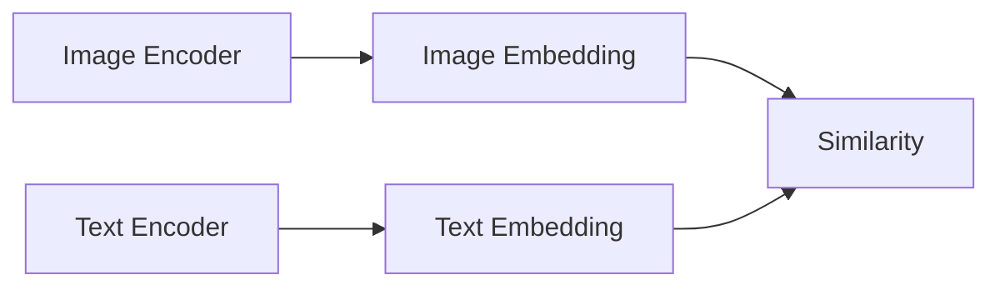
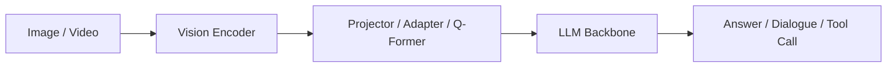

# 5.3 视觉语言模型（VLM）

在前两节里，我们分别讲了：

- `5.1` 里语言模型是如何从 `token -> embedding -> Transformer -> LLM` 一路发展起来的。
- `5.2` 里视觉基础大模型是如何从“单任务视觉模型”演进到“通用视觉能力底座”的。

如果把这两条路线放在一起看，就会自然走到这一节：**视觉语言模型（Vision-Language Model, VLM）**。

VLM 并不是简单理解成“给 LLM 加一张图”这么轻松，它真正重要的地方在于：模型开始尝试把**视觉输入**和**语言推理/生成**放进同一个统一系统里。换句话说，模型不只是“看到了图像里的像素”，还要能：

- 用语言解释它看到了什么；
- 根据问题只关注图像里的相关部分；
- 把图像、文字、表格、视频、截图、文档放进同一个任务接口；
- 在更复杂的设定里继续做多图比较、长视频理解、工具调用和 Agent 化交互。

这就是为什么 VLM 在 2024 年之后迅速从“热门方向”变成了“多模态基础设施”。今天你看到的大模型产品，不论是通用助手、代码助手、办公助手，还是自动驾驶数据闭环中的场景分析工具，几乎都绕不开 VLM。

这一节仍然延续前两节的写法：**先把基础概念讲清楚，再讲结构，再讲模型，再讲自动驾驶里的真实位置。**

> [!TIP]
> 可以先记住一句最核心的话：
>
> **VLM = 视觉编码能力 + 语言建模能力 + 多模态对齐与指令跟随能力。**
>
> 它既不是纯视觉模型，也不是“会看图的普通 LLM”，而是一类专门为多模态输入输出组织起来的系统。

---

## 1. 为什么会出现 VLM

### 1.1 纯视觉模型已经很强，但还不够“会交流”

传统计算机视觉模型已经能很好地完成很多任务：

- 图像分类；
- 目标检测；
- 语义分割；
- 深度估计；
- OCR；
- 视频动作识别。

但这些模型大多数有一个共同特点：**任务边界很固定**。

例如一个目标检测器通常只会输出：

- 类别；
- 置信度；
- 框的位置。

它不会自然回答这样的问题：

- “这张图里最危险的交通参与者是谁，为什么？”
- “前车是在正常减速，还是准备并线？”
- “这几帧图像里，哪个异常最值得优先标注？”
- “这张路口截图和上一张相比，新增了什么风险因素？”

这些问题里，真正缺的往往不是“像素级看见”，而是：

- 面向任务的语言接口；
- 跨模态推理；
- 开放词汇理解；
- 多轮交互能力；
- 把视觉结果组织成自然语言解释的能力。

### 1.2 纯 LLM 很会说，但它原本并不会看

另一方面，`LLM` 在文本世界里已经很强：

- 能理解复杂指令；
- 能利用长上下文；
- 能组织结构化回答；
- 能调用工具；
- 能在很多任务里充当“通用推理控制器”。

但标准的 `decoder-only LLM` 原始输入是 `token sequence`。它天然擅长的是：

- 文字；
- 代码；
- 表格文本化表示；
- 结构化描述。

它并不会直接理解一张图片的像素网格，也不会天然知道“图像里的这个区域对应哪一句描述”。所以如果想让 LLM 真的“看图说话”，就必须回答一个关键问题：

> **如何把视觉信息变成语言模型能消费的表示？**

这正是 VLM 诞生的直接动机。

### 1.3 VLM 的本质：给语言模型接上视觉世界

你可以把 VLM 粗略看成是下面这条链路：

`图像/视频 -> 视觉编码器 -> 视觉特征/视觉 token -> 对齐模块/投影器 -> 语言模型 -> 文本回答/动作/工具调用`

这里最关键的不是“接上了”，而是“接得是否自然、是否稳定、是否能泛化”。

因为一旦接得不好，就会出现很多常见问题：

- 图像看到了，但说不清；
- 图中明明有目标，模型却忽略；
- OCR 能力弱；
- 多图对比混乱；
- 视频时序逻辑断裂；
- 空间关系说错；
- 很会说，但几何并不可靠。

所以 VLM 的核心难点，从来不是“支持图像输入”这件事本身，而是：

- **视觉表示是否足够强；**
- **视觉与语言是否真正对齐；**
- **LLM 是否能有效利用这些视觉 token；**
- **多模态指令跟随是否足够好；**
- **新场景、新分布、新分辨率下是否还能稳定工作。**

---

## 2. 从基础概念理解 VLM

这一节尽量从最基础的术语讲起。后面看到具体模型时，这些概念会不断重复出现。

### 2.1 image encoder：先把图像变成模型可计算的表示

语言模型面对文字时，第一步是把文字变成 `token` 和 `embedding`。  
VLM 面对图像时，也要做一个类似的过程。

这个前端通常叫做 `image encoder` 或 `vision encoder`，常见选择包括：

- `ViT` 系列；
- `CLIP ViT` 系列；
- `SigLIP` 系列；
- 一些更原生的多模态视觉干路。

它的作用是把一张图像从像素空间编码成高层视觉表示。

直觉上可以这么理解：

- 原始图片像素太低层，语言模型无法直接使用；
- 视觉编码器先把图片变成“压缩过的语义特征”；
- 后续模块再把这些特征接给 LLM。

所以，**视觉编码器相当于 VLM 的“眼睛”和“第一层视觉皮层”**。

### 2.2 visual token：图像也会被拆成一串 token

在很多 VLM 里，图像最终不会只变成一个整体向量，而是会变成一串 `visual tokens`。

这和语言里的 token 很像，但来源不同：

- 文本 token 来自分词；
- visual token 来自图像 patch、区域特征或压缩后的视觉表示。

例如一张图片经过 `ViT` 后，常常会被切成多个 patch，再映射成一串特征。这样做的好处是：

- 模型可以保留一定的空间分辨率；
- 后续能让语言模型关注图像不同区域；
- 更适合 OCR、定位、多目标问答、多图比较等任务。

所以在很多 VLM 里，图像并不是“一个向量”，而是“一段视觉序列”。

### 2.3 projector：把视觉特征翻译成 LLM 能听懂的语言

即使有了视觉 token，问题也还没结束。

原因很简单：视觉编码器输出的向量空间，和 LLM 里的 token embedding 空间，通常不是天然一致的。

于是中间往往需要一个桥接模块，常见名字包括：

- `projector`
- `adapter`
- `connector`
- `resampler`
- `Q-Former`

它的作用是把视觉特征映射到 LLM 更容易处理的表示空间里。

这里可以把 `projector` 理解成一个“翻译层”：

- 左边是视觉特征；
- 右边是语言模型；
- 它负责让两边能真正接上。

很多开源 VLM 的早期版本里，`projector` 非常小，例如一个两层 `MLP`。这类设计简洁、易训练，但也往往会限制复杂视觉能力。后面很多新一代模型之所以更强，关键就在于：

- 视觉编码器更强了；
- 视觉 token 设计更好了；
- 桥接模块不再只是非常简单的映射；
- 甚至开始使用原生多模态架构，而不是“后接一个小 adapter”。

### 2.4 LLM backbone：VLM 背后的“大脑”

VLM 里负责生成回答、理解指令、维持上下文、组织语言输出的部分，通常就是一个 `LLM backbone`。

它可能来自：

- `LLaMA` 系列；
- `Qwen` 系列；
- `Mistral` 系列；
- `Phi`、`Gemma`、`InternLM` 等系列；
- 或者闭源产品内部的大模型主干。

这部分继承了 `LLM` 的很多核心能力：

- 指令理解；
- 长文本组织；
- 多轮对话；
- 工具调用；
- 结构化输出；
- 一定程度的推理与规划。

所以很多 VLM 的“会说话”“会做多轮问答”“会输出 JSON”这些能力，其实很大程度上来自背后的 LLM，而不是来自视觉部分本身。

### 2.5 instruction tuning：让模型学会按人类问题来回答图像

仅仅把图像特征接进 LLM，模型并不会自动变成一个好用的多模态助手。

为什么？

因为“能接收图像”不等于“能按任务要求理解图像并回答”。

于是通常还要进行 `instruction tuning`，也就是多模态指令微调。训练数据可能包含：

- 图像 + 问题 + 答案；
- 文档页 + 提问 + 解析；
- 多图 + 比较问题 + 回答；
- 视频帧/片段 + 问题 + 结果；
- region 标注 + grounding 指令 + 输出。

这一步很像 LLM 里的指令微调，但这里的输入不再只有文本，而是**图像或视频 + 文本指令**。

它解决的核心问题是：

> **让模型不只是“看见”，而是学会“围绕用户问题去看、去答、去解释”。**

### 2.6 multi-image 与 video understanding：从单图走向更复杂输入

很多初代 VLM 更像“单图问答模型”，但真实世界任务很快要求它们支持：

- 多图联合理解；
- 图文混合文档；
- 长截图；
- 监控视频；
- 屏幕录制；
- 多视角感知；
- 帧间事件分析。

这时问题会变得更复杂，因为模型不只要“看见每张图”，还要：

- 对比不同图之间的差异；
- 维护时序状态；
- 判断事件先后关系；
- 聚合多视角信息；
- 在长上下文里检索相关视觉片段。

所以 2024 年之后，VLM 的一条很重要演进主线，就是从“单图问答”走向：

- `multi-image VLM`
- `video VLM`
- `native multimodal long-context model`

### 2.7 grounding：让语言真的落到图像里的位置

很多时候，我们不只想让模型回答“图里有什么”，还想知道：

- “你说的这个目标具体在哪？”
- “你提到的行人是左下角那个，还是斑马线中间那个？”
- “把‘红色施工锥’圈出来。”

这时就涉及 `grounding`。也就是把语言概念和图像中的具体区域对应起来。

grounding 对很多工程场景都非常关键：

- 标注辅助；
- 检测数据质检；
- 场景复盘；
- 交互式分割；
- 自动驾驶长尾事件定位。

如果没有 grounding，模型就很容易出现一种表面上“看懂了”，但实际上“说的是哪一块根本不清楚”的问题。

---

## 3. VLM 的典型架构路线

VLM 并不是一条单一路线。为了不把模型名背成清单，更重要的是先看架构家族。

### 3.1 图文对齐模型：先把图像和文本放到一个语义空间

这一类模型的代表源头是 `CLIP` 路线。

它们的目标不是做复杂对话，而是：

- 让图像表示和文本表示在同一个语义空间里对齐；
- 让模型能做零样本分类、图文检索、开放词汇匹配。

这类模型通常是双塔结构：

它们的长处是：

- 对齐清晰；
- 检索和开放词汇能力强；
- 适合做上游视觉底座。

它们的局限是：

- 不擅长复杂多轮对话；
- 不天然具备强生成能力；
- 对细致推理、文档问答、长视频理解支持有限。

所以严格来说，`CLIP` 这类模型更像 VLM 的历史前奏，而不是今天意义上“通用看图聊天助手”的完整形态。

### 3.2 桥接式 VLM：视觉编码器 + 连接模块 + LLM

这是开源 VLM 最经典、最容易理解的一类路线。

它的大致结构是：

这类模型的核心思想是：

- 视觉前端继续用成熟视觉模型；
- 语言后端继续用成熟 LLM；
- 中间通过桥接模块把两者接起来；
- 再通过多模态指令微调让模型学会使用视觉信息。

这条路线之所以流行，是因为它有很强的工程现实性：

- 可以复用已有强视觉 backbone；
- 可以复用已有强 LLM；
- 训练代价比端到端原生多模态更可控；
- 容易快速迭代。

代表模型包括：

- `BLIP-2`
- `LLaVA`
- `LLaVA-NeXT`
- 很多早中期开源 VLM

### 3.3 原生多模态模型：从一开始就把多模态当作核心能力

随着模型越来越大、数据越来越多，研究者开始不满足于“后接一个 projector”。

于是出现了更原生的多模态路线。它们通常具备以下特征中的若干项：

- 视觉与文本从预训练阶段就深度耦合；
- 支持图像、视频、文档、截图、多图混合输入；
- 更原生地支持长上下文和多模态 interleaving；
- 不只是“看图问答”，而是向通用多模态 Agent 发展。

这类模型常见于 2025 年之后的新一代体系，例如：

- `Qwen3-VL`
- `InternVL3 / 3.5`
- `Llama 4 Scout / Maverick`
- `Mistral Large 3`

这一类模型往往更像“多模态基础模型”，而不只是“LLM 外接视觉模块”。

### 3.4 为什么同样叫 VLM，能力差异会很大

一个 VLM 强不强，通常不只取决于参数量，还取决于以下几件事：

- 视觉编码器是否足够强；
- 是否支持高分辨率与动态分辨率；
- 是否擅长 OCR 和文档；
- 视频训练是否充分；
- 多图/长上下文能力是否成熟；
- 视觉 token 压缩与保真是否合理；
- 指令微调质量是否高；
- 是否原生支持 Agent/工具调用。

所以两个都叫“VLM”的模型，可能差异非常大：

- 有的更像“图像问答增强版 LLM”；
- 有的更像“开放词汇视觉理解工具”；
- 有的已经接近“通用多模态操作系统”。

---

## 4. VLM 的能力版图

为了后面不把模型和能力混在一起，这里先把能力地图建起来。

### 4.1 图像问答（Image QA）

最基础的一类任务是：

- 图里有什么？
- 这个目标在做什么？
- 这张图最值得注意的风险是什么？

这是大多数人第一次接触 VLM 的入口任务。

但要注意，图像问答只是入门，不是 VLM 的全部。

### 4.2 OCR 与文档理解

今天很多强 VLM 已经不仅看自然图像，还能处理：

- 长截图；
- PDF 页面；
- 表单；
- 表格；
- 图表；
- 手写内容；
- 混排文档。

这类能力之所以重要，是因为真实工业系统里，大量信息并不在“自然场景图片”里，而在：

- 配置文档；
- 标注界面截图；
- 事故报告；
- 地图页面；
- 数据平台截图；
- 车端日志图表。

所以一个现代 VLM 是否强，很大程度上要看它的 OCR 和文档理解是否成熟。

### 4.3 图表理解与结构化信息提取

很多新一代 VLM 不只是能“读出文字”，还会尝试理解：

- 坐标轴；
- 趋势线；
- 统计图；
- 柱状图；
- 表格结构；
- 关键字段。

这让 VLM 很适合进入工程流程中的辅助分析场景，例如：

- 自动解读训练曲线截图；
- 从报表页面中抽取异常指标；
- 比较两个版本评测结果。

### 4.4 grounding 与定位

现代 VLM 逐渐不满足于“看图说话”，还开始支持：

- 根据文本找区域；
- 输出框或点；
- 与分割模型配合生成 mask；
- 支持更可追溯的视觉解释。

这对自动驾驶和标注链路非常关键，因为工程系统常常要求：

- 你说这里有异常，那异常在哪？
- 你说这是遮挡行人，那行人是谁？
- 你说前方施工，那施工区边界能不能定位？

### 4.5 多图比较

单图理解是一回事，多图比较是另一回事。

多图比较常见问题包括：

- 两帧之间新增了什么风险目标？
- 这一组标注图里哪一张最可疑？
- 同一个场景在不同视角里有哪些不一致？
- 新旧模型输出差异最大的是哪些样本？

这类任务在数据闭环里非常重要，因此也是 2025 年后强 VLM 的一个重要分水岭。

### 4.6 视频理解

视频理解要求模型不仅看单帧，还要理解：

- 时序变化；
- 事件过程；
- 状态转移；
- 短期记忆；
- 长视频摘要。

所以视频 VLM 的难点并不是“多喂几张图”，而是：

- 选哪些帧；
- 怎么压缩视觉信息；
- 如何在长序列里保留关键事件；
- 如何平衡时序信息与上下文长度。

### 4.7 Agent 化使用

越来越多 VLM 不再只是“问答器”，而是开始承担：

- 看图后决定调用哪个工具；
- 从界面截图中找到按钮位置；
- 根据文档截图抽取参数；
- 对多模态环境做规划和下一步动作建议。

这意味着 VLM 正在从“多模态理解模型”走向“多模态智能体核心部件”。

---

## 5. VLM 的技术演进：从过渡代到新一代

这一节按发展脉络来讲，而不是只按“谁最新”排序。

### 5.1 BLIP 与 BLIP-2：桥接式 VLM 的关键节点

`BLIP` 和 `BLIP-2` 是理解现代开源 VLM 很重要的教学模型。

其中尤其值得重点记住的是 `BLIP-2`。它的关键贡献不是单纯“做得更强”，而是比较清楚地展示了一条经典思路：

- 视觉编码器和 LLM 可以分别很强；
- 不一定要从零端到端联合训练；
- 可以通过中间桥接模块把两者接起来；
- 再用多模态训练让系统学会看图对话。

`BLIP-2` 中很著名的设计是 `Q-Former`。它可以粗略理解为一种更聪明的视觉信息提取与桥接方式，用更少的查询 token 从视觉侧吸收关键信息，再交给 LLM。

它解决的核心问题是：

- 不是把整张图所有视觉特征粗暴塞进 LLM；
- 而是先做更有组织的压缩与对齐。

从教学上看，`BLIP-2` 很适合拿来回答一个关键问题：

> **为什么 VLM 不是“加一层 MLP 就完了”？**

因为视觉信息既大、又密、又强空间相关，怎么提取、压缩、桥接，直接决定后续语言模型能不能用得好。

### 5.2 Flamingo：few-shot 多模态学习的重要代表

`Flamingo` 是 DeepMind 在多模态 few-shot 学习方向上的代表性工作。

它的重要性在于：

- 证明了大型语言模型可以通过跨注意力等机制有效吸收视觉输入；
- 强调多模态上下文学习；
- 推动了“统一多模态对话接口”这类思路的发展。

虽然今天很多工程实现不直接沿用 Flamingo 的具体形态，但它在路线历史上非常关键：它让大家看到，多模态模型不只是“图像分类加解释”，而是真能向“多模态通用助手”演进。

### 5.3 LLaVA：开源 VLM 普及的转折点

如果说 `BLIP-2` 更像研究路线上的关键桥梁，那么 `LLaVA` 的意义更偏工程与社区生态。

`LLaVA` 路线之所以重要，是因为它把一类相对简单但有效的开源 VLM 范式真正带火了：

- `CLIP` 类视觉编码器；
- 小型 `projector`；
- 强 LLM 主干；
- 多模态指令微调。

这条路线的优点是：

- 易复现；
- 易扩展；
- 易换 backbone；
- 社区传播极快。

所以后来很多开源 VLM，哪怕细节不同，也都多少受到了 `LLaVA` 风格的影响。

### 5.4 LLaVA-NeXT 与 LLaVA-OneVision：从“能看图”走向“更通用多模态”

`LLaVA-NeXT` 和 `LLaVA-OneVision` 代表了这条路线的继续增强。

它们的重要变化通常体现在：

- 更强的视觉输入分辨率处理；
- 更好的多图能力；
- 更强的视频支持；
- 更好的 OCR / 文档能力；
- 更接近通用多模态助手，而不只是图片问答 demo。

这一阶段的意义在于：开源社区开始逐步补齐“实用性短板”，VLM 不再停留在“给你看个猫和狗”的程度，而是开始进入真实任务。

### 5.5 Qwen2-VL 与 Qwen2.5-VL：上一代里程碑

在中文读者语境里，`Qwen2-VL` 和 `Qwen2.5-VL` 是非常重要的上一代节点。

它们的重要性在于：

- 中文与英文混合场景表现较好；
- 文档、截图、OCR、表格等任务较强；
- 多图、长图、视频理解能力明显增强；
- 社区落地广、可复现性强。

尤其是 `Qwen2.5-VL` 于 **2025 年 1 月 28 日** 发布后，已经不再只是“一个能看图的聊天模型”，而更像一个非常实用的开源多模态底座。

但从截至 **2026 年 5 月** 的时间点来看，它已经更适合被看作：

- 现代表现很强的上一代主力模型；
- 向 `Qwen3-VL` 过渡的重要里程碑；
- 多模态通用能力成熟化的重要节点。

---

## 6. 截至 2026 年 5 月值得重点掌握的最新 VLM

这一节不追求穷举，而是抓住对学习和工程最有价值的主线。

### 6.1 先给出一张时间与代际地图

可以先把 2024 到 2026 年 5 月前后的关键节点压缩成下面这张图：

- `Pixtral Large`：**2024 年 11 月 18 日**
- `Qwen2.5-VL`：**2025 年 1 月 28 日**
- `InternVL3`：**2025 年 4 月 14 日**
- `Llama 4 Scout / Maverick`：**2025 年 4 月 5 日**
- `Qwen3-VL` 系列：**2025 年 9 月 23 日到 10 月 21 日**
- `MiniCPM-V 4.5`：**2025 年 9 月 16 日**
- `Mistral Large 3`：**2025 年 12 月 2 日**
- `MiniCPM-V 4.6`：**2026 年 4 月 28 日**

这意味着当我们站在 **2026 年 5 月** 回看时，重点已经不该停留在 `Qwen2.5-VL` 这一代，而应该看到更完整的新一代格局。

### 6.2 Qwen3-VL：Qwen 开源 VLM 主线的当前代表

如果从中文语境下“最值得重点掌握的开源 VLM”来讲，`Qwen3-VL` 是非常核心的一条主线。

在 Qwen 官方 GitHub 的 `News` 区，可以看到 **2025 年 9 月 23 日到 2025 年 10 月 21 日** 这段时间连续发布了多个 `Qwen3-VL` 版本与尺寸。

它相对 `Qwen2.5-VL` 的意义，不是简单“参数更大”，而是更接近一类原生多模态模型：

- 更强的视频理解；
- 更长的多模态上下文；
- 更成熟的文档与 OCR；
- 更好的空间与区域感知；
- 更适合 Agent 化使用。

这类模型特别值得从五个角度看：

1. 它属于哪条路线  
   更偏向原生多模态通用底座，而不只是简单桥接式 VLM。

2. 它比上一代解决了什么  
   相比 `Qwen2-VL / Qwen2.5-VL`，更系统地强化了视频、多图、长上下文和工具使用能力。

3. 它最擅长什么  
   通用多模态问答、OCR、文档、长图、多图、视频和复杂指令跟随。

4. 它的局限是什么  
   仍然不能把“会说”直接等同于“几何稳定”“时序因果可靠”。

5. 它在自动驾驶里更适合放在哪  
   数据闭环分析、长尾场景复盘、截图与日志解释、标注辅助、视频摘要。

### 6.3 InternVL3 与 InternVL3.5：高性能开源原生多模态路线

`InternVL` 系列是开源高性能 VLM 路线里非常值得重点跟踪的一条线。

其中：

- `InternVL3` 在 Transformers 文档中明确写有 **released on 2025-04-14**
- `InternVL3.5` 的论文页时间为 **2025-08-25**

这条路线的重要特征通常包括：

- 更原生的多模态训练；
- 高分辨率处理能力；
- 较强的 OCR 与文档能力；
- 多图、多任务泛化；
- 公开权重，利于研究和复现。

它相比 `InternVL2 / 2.5` 的升级，重点不只是分数更高，而是更加稳定地把多模态能力组织成一个统一系统：

- 更好的视觉理解深度；
- 更强的综合任务泛化；
- 更适合复杂输入，而不是只擅长单图问答。

在自动驾驶语境里，`InternVL3 / 3.5` 很适合放在：

- 复杂场景解释；
- 多图差异分析；
- 标注质检；
- 平台截图与文档理解；
- 多模态数据平台中的离线分析模块。

### 6.4 Llama 4 Scout / Maverick：Meta 的原生多模态开源主线

Meta 官方在 **2025 年 4 月 5 日** 发布了 `Llama 4 Scout` 和 `Llama 4 Maverick`。

它们的重要意义有三层：

- 这是 Meta 开源路线中原生多模态的重要节点；
- 引入了更强的长上下文与 MoE 结构思路；
- 说明开源通用模型开始不再把多模态当作附加能力，而是当作主能力之一。

从学习上看，`Llama 4 Scout / Maverick` 值得重点关注的不是某个 benchmark 数字，而是它代表的趋势：

- 长上下文多模态统一；
- 更强的图文混合推理；
- 更接近通用智能体底座；
- 开源生态与多模态能力的进一步合流。

它们的局限也要看清楚：

- 模型很强，不等于任何场景都能直接部署；
- 对高精度空间定位和可验证安全场景，仍不能替代专门感知模块；
- 在车规环境里，成本、延迟、稳定性依然是大问题。

### 6.5 Mistral 路线：Pixtral Large 到 Mistral Large 3

`Pixtral Large` 在 **2024 年 11 月 18 日** 发布，是 Mistral 多模态路线中的一个重要节点。

如果只站在 2024 年底看，它已经很值得写；但站在 **2026 年 5 月** 看，它更适合被归类为：

- Mistral 多模态路线的过渡代里程碑；
- 向更新旗舰路线演进的重要节点。

在这之后，更值得重点关注的是 `Mistral Large 3`，其官方模型页面时间是 **2025 年 12 月 2 日**。

这一变化反映出什么？

- Mistral 不再只是有一个单独多模态模型分支；
- 而是在更通用旗舰体系里把多模态整合进去；
- 多模态能力不再是“外设”，而是顶层产品能力的一部分。

如果要把这条路线写成一句话，就是：

> **Pixtral Large 是多模态扩展的重要节点，Mistral Large 3 则更像统一旗舰多模态能力的成熟表达。**

### 6.6 MiniCPM-V 4.5 / 4.6：轻量高效路线的代表

很多人一提最新 VLM，就只盯着超大模型，但这会忽略一个非常重要的工程现实：

> **不是所有场景都适合上最大的多模态模型。**

`MiniCPM-V` 路线的重要价值就在这里。

其中：

- `MiniCPM-V 4.5` 论文页时间为 **2025 年 9 月 16 日**
- `MiniCPM-V 4.6` 发布于 **2026 年 4 月 28 日**

这条路线值得重点关注的原因包括：

- 模型相对轻量；
- 多模态能力却很强；
- 对端侧、低成本部署、更高吞吐需求场景更友好；
- 说明“小模型也能很强”并不是口号，而是一条真实工程路线。

从自动驾驶工程视角看，它们尤其值得放在：

- 大规模离线筛查；
- 低成本批处理；
- 工具链插件；
- 辅助分析服务；
- 不追求极致上限、但追求成本效率比的系统。

### 6.7 Molmo：开源学术路线里的重要补充

`Molmo` 更像一类“研究与开源学术生态里值得认真关注”的路线。

它的重要性在于：

- 强调开放与可研究性；
- 对学术界和研究型工程团队更友好；
- 让很多多模态研究不必完全依赖闭源模型。

它未必在每个工业榜单里都是“主力旗舰”，但在理解开源 VLM 生态时很重要，因为它代表了另一种价值：

- 不一定是最大商业生态；
- 但对方法研究、可复现、可检验、多模态开放科学很有意义。

### 6.8 闭源坐标：GPT-4.1、Gemini 2.5 Pro、Claude 3.7 Sonnet

虽然这一章以开源为主，但还是值得用少量篇幅给出产业坐标。

截至 **2026 年 5 月**，可以把以下模型看作闭源侧的重要参考点：

- `GPT-4.1`：OpenAI 于 **2025 年 4 月 14 日** 发布
- `Gemini 2.5 Pro`：Google DeepMind 在 2025 年后期的主力多模态产品线
- `Claude 3.7 Sonnet`：Anthropic 于 **2025 年 2 月** 发布的重要产品代际

这里提它们的目的不是展开写产品，而是提醒读者：

- 开源 VLM 的发展速度已经非常快；
- 但闭源模型依然常常代表更高的产品化上限；
- 两边差异不只体现在分数，更体现在工具链、系统集成、上下文工程和服务能力上。

---

## 7. 这些模型之间到底是什么关系

为了避免“看完还是觉得一堆名词”，这里把主线再压缩成一张逻辑图。

### 7.1 从教学谱系看

可以把这条发展路线理解为：

`CLIP 类图文对齐 -> BLIP-2 / Flamingo 类桥接 -> LLaVA 类开源普及 -> Qwen / InternVL / Llama 4 / Mistral / MiniCPM 类新一代原生多模态`

每一步都不是完全推翻前一步，而是在补短板：

- `CLIP` 让图文对齐成立；
- `BLIP-2` 让桥接式 VLM 成型；
- `LLaVA` 让开源生态普及；
- 新一代原生多模态模型把视频、长上下文、文档、Agent 能力都真正并进来。

### 7.2 从模型定位看

- `BLIP-2`
  更适合拿来理解“视觉如何接入 LLM”。
- `LLaVA-NeXT / OneVision`
  更适合拿来理解“开源 VLM 是怎么从可用走向更实用的”。
- `Qwen3-VL`
  更适合代表中文语境下的新一代通用开源多模态主线。
- `InternVL3 / 3.5`
  更适合代表高性能开放权重原生多模态路线。
- `Llama 4 Scout / Maverick`
  更适合代表大型开源通用底座与多模态合流。
- `Mistral Large 3`
  更适合代表通用旗舰体系中的多模态一体化。
- `MiniCPM-V 4.5 / 4.6`
  更适合代表轻量高效路线。
- `Molmo`
  更适合代表开放科研生态。

---

## 8. VLM 在自动驾驶中的位置

这一部分最重要，因为本仓库的主线并不是“做一个聊天助手”，而是理解大模型如何进入自动驾驶系统。

### 8.1 它最适合放在数据闭环，而不是直接替代安全闭环

当前 VLM 在自动驾驶里最适合的位置，不是直接替代：

- 检测；
- 跟踪；
- 时序预测；
- 规划控制；
- 车规安全决策。

它更适合放在：

- 数据闭环；
- 标注辅助；
- 数据质检；
- 场景解释；
- 长尾分析；
- 事故复盘；
- 多模态检索与问答。

原因很直接：

- VLM 很会“解释”；
- 但不一定足够“几何稳定”；
- 很会“总结”；
- 但不一定足够“毫秒级实时”；
- 很会“开放式理解”；
- 但不一定足够“形式化可验证”。

### 8.2 长尾场景复盘

这是 VLM 在自动驾驶里最自然的切入口之一。

例如给模型输入：

- 事故帧；
- 前后若干帧截图；
- 激光点云投影图；
- 车辆状态面板截图；
- 人工描述 prompt。

然后让模型回答：

- 最可能的风险源是什么；
- 哪些目标参与了事件；
- 是感知失败、规则冲突还是交互误判；
- 哪一帧最值得人工重点看。

这类任务的关键价值不在于“它一定说对”，而在于：

- 它能极大提升人工复盘效率；
- 能帮数据团队快速筛出疑似关键片段；
- 能把大规模日志从“不可浏览”变成“可搜索、可总结、可追问”。

### 8.3 多图比较与标注质检

自动驾驶数据平台里有大量适合 VLM 的多图任务：

- 新旧模型输出对比；
- 标注前后对比；
- 左右视角对比；
- 同一目标在不同帧中的一致性检查；
- 框、mask、轨迹可疑样本筛查。

在这些任务里，VLM 的价值主要体现在：

- 它有开放式语言接口；
- 能把“可疑原因”直接说出来；
- 比纯规则更灵活；
- 比完全人工逐张检查更快。

### 8.4 文档、OCR 与工程流程理解

自动驾驶工程里，图像并不只有道路场景图像。

还有很多“视觉化信息”其实来自：

- dashboard 截图；
- 训练曲线；
- 配置页面；
- 评测报表；
- 质检平台截图；
- 地图编辑页面；
- 车端日志可视化。

现代 VLM 尤其是 `Qwen3-VL`、`InternVL3`、`MiniCPM-V 4.6` 这类模型，在 OCR 和文档理解上较强，因此很适合进入：

- 工具平台问答；
- 报表摘要；
- 参数解释；
- 异常定位；
- 操作辅助。

### 8.5 视频理解与时序事件摘要

真实驾驶事件很多时候不是“某一帧看错了”，而是“一个过程出了问题”。

例如：

- 行人突然横穿；
- 前车犹豫后并线；
- 路口灯态变化；
- 临停车辆突然起步；
- 施工区绕行交互。

这时新一代支持视频的 VLM 可以做的事情包括：

- 给出事件摘要；
- 自动生成时间线描述；
- 提取风险最高片段；
- 按语言条件检索相似视频。

但也要注意，**视频 VLM 不等于真正可靠的时序驾驶模型**。它更像高层解释器，而不是底层安全控制器。

### 8.6 Agent 化能力在工具链中的潜力

未来一个很现实的方向是：VLM 不再只是“回答问题”，而是直接参与离线工具链。

例如：

- 看懂标注页面截图，然后建议下一步操作；
- 看懂报表，再自动调用检索工具；
- 看懂异常样本，自动写出筛选规则草稿；
- 看懂地图或场景页面，自动补充场景标签。

这类能力和自动驾驶主车端系统不是一回事，但对研发效率提升可能非常大。

### 8.7 为什么多数情况下不应该“直接端到端上车”

这是最容易被误解的一点。

VLM 很强，不代表应该直接让它负责：

- 实时安全闭环；
- 硬实时控制；
- 可验证规划；
- 车规级风险仲裁。

原因包括：

- 延迟高；
- 成本高；
- 输出不稳定；
- 幻觉难彻底避免；
- 几何与时序一致性仍不够可靠；
- 很难满足严格可验证安全要求。

所以更合理的结论是：

> **VLM 更适合作为自动驾驶系统的“数据闭环大脑”和“高层语义接口”，而不是直接替代底层安全关键模块。**

---

## 9. 局限、误区与工程边界

### 9.1 会看图说话，不等于看得精确

VLM 最容易制造的错觉，就是“它说得很像懂了，所以它一定看得很准”。

其实不一定。

因为语言输出非常流畅时，人会天然高估模型对视觉细节的掌握程度。现实中常见问题包括：

- 细小目标漏看；
- 遮挡目标错判；
- 空间关系描述不准；
- 计数错误；
- 置信不足时依然给出肯定回答。

### 9.2 语义强，不等于几何强

VLM 常常比传统感知模型更擅长：

- 场景总结；
- 风险解释；
- 常识补充；
- 开放式语言表达。

但这不等于它的几何能力天然很强。

例如：

- 距离判断可能不稳；
- 精确位置推断可能不稳；
- 遮挡关系有时会说错；
- 多目标空间关系容易混淆。

所以在自动驾驶场景里，不能因为 VLM 擅长“讲故事”，就让它替代几何严谨模块。

### 9.3 OCR 强，不等于所有长文档都可靠

现代 VLM 在 OCR、文档、图表上进步很大，但仍然会遇到问题：

- 超长文档跨页关联不稳；
- 密集小字误读；
- 表格结构抽取出错；
- 图文混排场景理解偏差；
- 页间引用关系容易断。

所以对于关键文档流程，VLM 更适合“辅助”，而不是“单点真理源”。

### 9.4 视频能力提升，不等于真正理解因果

视频 VLM 经常能给出看起来很自然的事件摘要，但这和严格意义上的因果建模不是一回事。

模型可能会：

- 抓住现象；
- 总结表面流程；
- 给出合理解释；

但不一定真的把：

- 物理约束；
- 驾驶意图；
- 潜在因果链；
- 多体交互机制

完整建模清楚。

### 9.5 Agent 化很诱人，但会引入新的系统复杂度

让 VLM 调工具、看界面、做流程自动化很吸引人，但也会带来新的问题：

- 调错工具；
- 错误传播；
- 不稳定决策链；
- 难以复现；
- 评测更难标准化。

所以多模态 Agent 的工程难点，不只是模型能力，还包括整个系统设计。

---

## 10. 学习路径与后续阅读

### 10.1 推荐的理解顺序

如果你是第一次系统学习 VLM，建议按下面顺序走：

1. 先回顾 `5.1` 的 LLM 基础  
   重点理解 `token`、`embedding`、`Transformer`、`instruction tuning`。

2. 再回顾 `5.2` 的视觉基础大模型  
   重点理解 `CLIP`、自监督视觉表征、开放词汇、视觉基础底座。

3. 再看这一章的三件事  
   `image encoder`、`visual token`、`projector`。

4. 然后抓住三条路线  
   图文对齐、桥接式 VLM、原生多模态模型。

5. 最后再去记模型谱系  
   `BLIP-2 -> LLaVA -> Qwen / InternVL / Llama 4 / Mistral / MiniCPM`

### 10.2 读 VLM 模型时建议固定问自己的五个问题

以后你看到任何一个新 VLM，都建议先问自己：

1. 它属于哪条架构路线？
2. 它的视觉前端是什么？
3. 它最擅长什么能力？
4. 它比上一代补上了什么短板？
5. 它更适合放在自动驾驶工具链的哪个位置？

如果这五个问题能答出来，说明你不是在“背模型名”，而是在真正理解模型。

### 10.3 和相邻章节的边界

这一章主要讨论的是 **VLM**，也就是“视觉输入 + 语言理解/生成”的统一系统。

它和后续常见概念的边界大致是：

- `VFM`：更强调通用视觉底座，本章只把它作为前置基础。
- `VLM`：更强调视觉和语言联合理解与生成，是本章主角。
- `VLA`：更强调视觉-语言-动作闭环，通常更接近机器人或具身系统。
- `世界模型`：更强调时空演化、预测和环境动态建模，不等于普通 VLM。

所以不要把“会看图聊天”直接等同于“会驾驶”“会控制”或“会预测世界演化”。

---

## 11. 文内提到的核心参考

下面列出本章最关键的一批参考，方便后续延伸阅读。为了避免“最新”表述模糊，这里尽量保留时间点。

- OpenAI, **CLIP (2021)**  
  [Learning Transferable Visual Models From Natural Language Supervision](https://arxiv.org/abs/2103.00020)
- BLIP-2 (2023)  
  [BLIP-2: Bootstrapping Language-Image Pre-training with Frozen Image Encoders and Large Language Models](https://arxiv.org/abs/2301.12597)
- Flamingo (2022)  
  [Flamingo: a Visual Language Model for Few-Shot Learning](https://arxiv.org/abs/2204.14198)
- LLaVA (2023)  
  [Visual Instruction Tuning](https://arxiv.org/abs/2304.08485)
- LLaVA-NeXT / OneVision 项目线  
  [LLaVA Project](https://llava-vl.github.io/)
- Qwen2.5-VL，**2025 年 1 月 28 日**  
  [Qwen2.5-VL GitHub](https://github.com/QwenLM/Qwen2.5-VL)
- Qwen3-VL，**2025 年 9 月 23 日到 10 月 21 日连续版本发布**  
  [Qwen3-VL GitHub](https://github.com/QwenLM/Qwen3-VL)
- InternVL3，**released on 2025-04-14**  
  [Transformers: InternVL3](https://huggingface.co/docs/transformers/main/en/model_doc/internvl)
- InternVL3.5，**2025-08-25**  
  [InternVL3.5 Paper Page](https://huggingface.co/papers/2508.18265)
- Meta Llama 4 Scout / Maverick，**2025-04-05**  
  [The Llama 4 herd](https://ai.meta.com/blog/llama-4-multimodal-intelligence/)
- Pixtral Large，**2024-11-18**  
  [Mistral Pixtral Large](https://mistral.ai/news/pixtral-large)
- Mistral Large 3，**2025-12-02**  
  [Mistral Large 3](https://docs.mistral.ai/getting-started/models/models_overview/)
- MiniCPM-V 4.5，**2025-09-16**  
  [MiniCPM-V 4.5 Paper Page](https://huggingface.co/papers/2509.13016)
- MiniCPM-V 4.6，**2026-04-28**  
  [MiniCPM-V 4.6](https://github.com/OpenBMB/MiniCPM-o)
- GPT-4.1，**2025-04-14**  
  [OpenAI GPT-4.1](https://openai.com/index/gpt-4-1/)
- Gemini 2.5 Pro  
  [Gemini Models](https://deepmind.google/models/gemini/)
- Claude 3.7 Sonnet，**2025 年 2 月**  
  [Anthropic Claude 3.7 Sonnet](https://www.anthropic.com/news/claude-3-7-sonnet)

---

## 12. 小结

如果只用一句话总结这一章，那么可以说：

> **VLM 是把“视觉感知”接入“语言智能”的关键桥梁，它让模型不仅能看见世界，还能围绕世界进行提问、解释、比较、检索和交互。**

从技术演进上看：

- `CLIP` 让图文对齐成为现实；
- `BLIP-2` 和 `Flamingo` 让桥接式多模态模型成型；
- `LLaVA` 让开源 VLM 真正普及；
- `Qwen3-VL`、`InternVL3 / 3.5`、`Llama 4 Scout / Maverick`、`Mistral Large 3`、`MiniCPM-V 4.5 / 4.6` 则代表了截至 **2026 年 5 月** 更值得重点掌握的新一代路线。

从自动驾驶落点上看：

- VLM 非常适合进入数据闭环、标注质检、长尾分析、视频复盘和多模态工具链；
- 但它并不等于 VLA，也不等于世界模型，更不意味着可以直接替代安全关键感知与控制闭环。

所以最稳妥也最有价值的理解方式是：

**把 VLM 看成自动驾驶智能研发体系里的高层多模态语义接口，而不是把它误当成已经可以单独接管驾驶的万能模型。**
