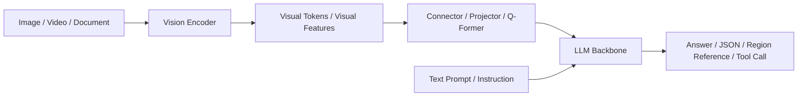
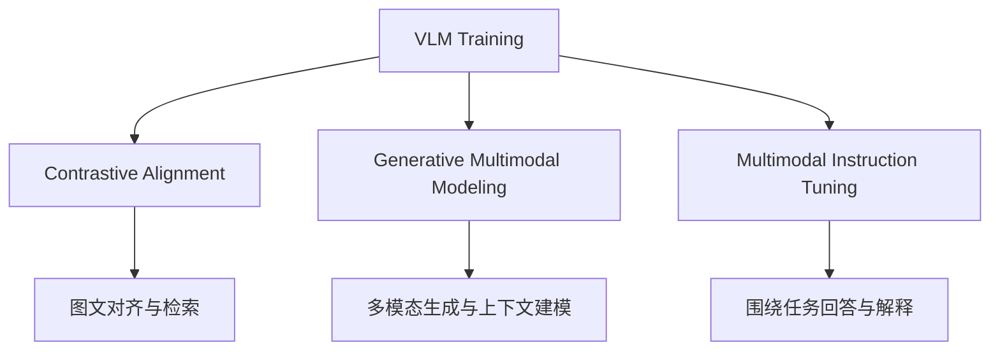
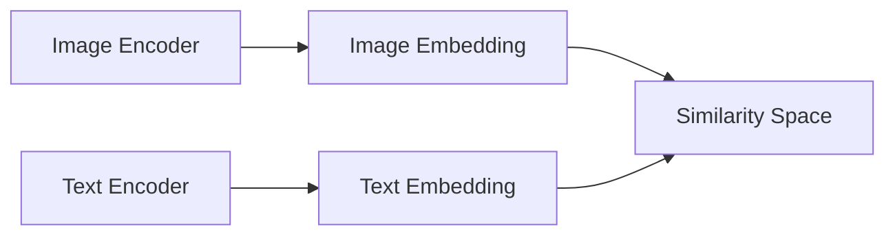
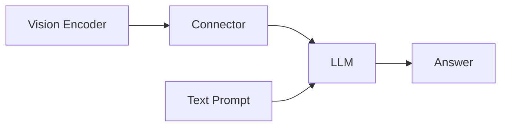
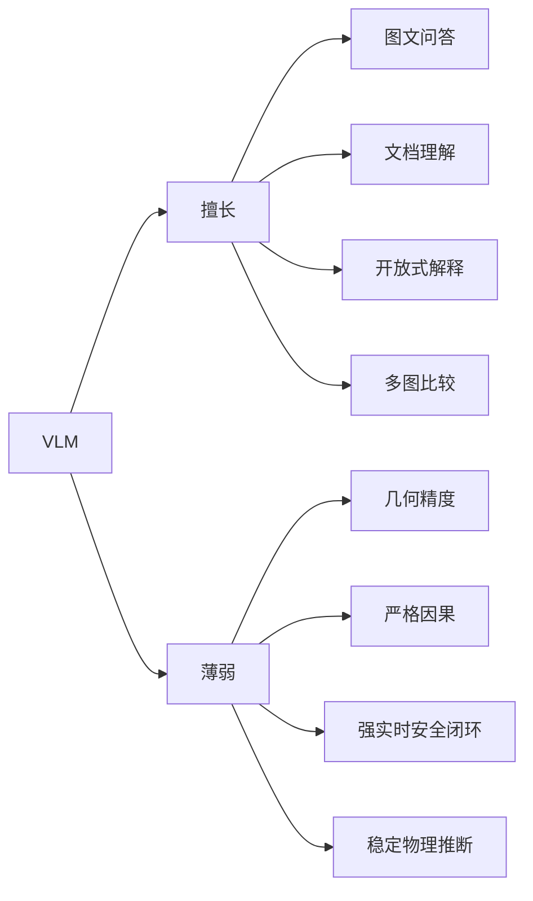
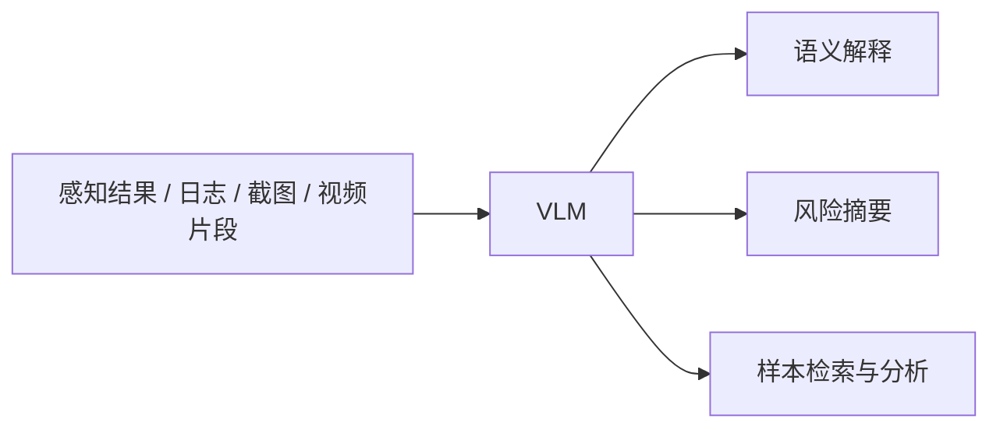
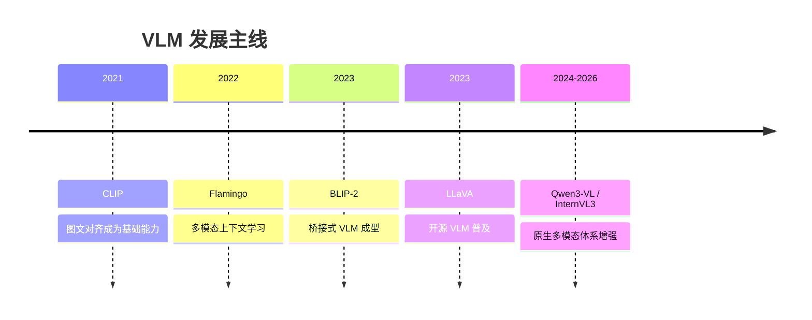

# 5.3 视觉语言模型（VLM）基础

在 `5.1` 中，我们讨论了语言模型如何沿着 `token -> embedding -> Transformer -> LLM` 的路线发展为通用语言智能骨架；在 `5.2` 中，我们讨论了视觉基础模型如何从单任务感知器演进为通用视觉表示底座。本节讨论的 `VLM`，正是在这两条技术路线汇合之后形成的多模态系统。

本章的目标不是盘点“最新模型名单”，而是回答两个更基础的问题：

1. `VLM` 从学术上究竟是什么；
2. 为什么它能够成立，以及它与相邻概念的边界在哪里。

因此，本章将重点讨论：

- `VLM` 的定义与问题背景；
- `VLM` 的基本结构与训练范式；
- `VLM` 的主要架构路线与代表工作；
- `VLM` 的能力边界、常见误区及其在自动驾驶中的合理定位。

> [!TIP]
> 本章可以先记住一个工作性定义：
>
> **视觉语言模型（VLM）是把视觉输入表示、语言建模能力和跨模态对齐机制统一起来的多模态模型。**

---

## 1. 定义与问题背景

本节回答的问题是：为什么在视觉模型和语言模型之外，还需要单独讨论 `VLM`。

### 1.1 从视觉任务到多模态任务

传统视觉模型已经能够稳定完成大量任务，例如图像分类、目标检测、语义分割、OCR 和视频动作识别。但是，这类模型通常面向预定义任务，其输出形式也往往是固定的类别、框、掩码或数值结果。

当任务变成下面这些形式时，传统视觉模型的接口就开始显得不足：

- “这张图里最值得关注的风险目标是什么？”
- “这两张图相比，新增了哪些异常因素？”
- “请把图中的红色施工锥找出来，并解释它为什么重要。”
- “根据图表与截图，总结这一页文档的关键信息。”

这些任务的共同点是：模型不仅要看见视觉内容，还要把视觉内容组织成语言可交互、可解释、可推理的对象。

### 1.2 从语言模型到视觉语言模型

`LLM` 已经非常擅长处理文本指令、结构化输出、长上下文和多轮交互，但标准 `decoder-only LLM` 的原始输入是 `token sequence`。这意味着：

- 它天然消费的是文本 token；
- 它并不能直接理解图像像素网格；
- 它也不天然知道图像区域和语言描述之间的对应关系。

于是，问题被归结为一个更基本的形式：

> **如何把视觉信息表示成语言模型可以使用的多模态输入，并让模型围绕用户问题进行解释、推理和生成？**

这正是 `VLM` 的直接出发点。

### 1.3 VLM 的定义与边界

从结构上看，`VLM` 可以被表述为一种从视觉输入 `x_v` 与文本输入 `x_t` 到输出 `y` 的多模态映射系统。其中：

- `x_v` 可以是图像、视频、文档页、截图或多图集合；
- `x_t` 可以是问题、指令、上下文或结构化提示；
- `y` 可以是文本回答、区域定位、结构化结果，或与外部工具交互相关的输出。

因此，`VLM` 的关键不在于“支持图像输入”这一表面特征，而在于它是否具备以下能力：

- 把视觉内容编码成可计算、可传递的表示；
- 让视觉表示与语言表示进入统一交互过程；
- 围绕任务指令选择相关视觉证据；
- 在多模态输入条件下输出稳定、可用的语言结果。

### 1.4 VLM 与相关概念的边界

| 概念 | 主要输入 | 主要输出 | 核心目标 | 是否强调动作闭环 |
|---|---|---|---|---|
| `VFM` | 图像、视频 | 视觉特征、类别、区域表示 | 通用视觉表征学习 | 否 |
| `VLM` | 图像/视频 + 文本 | 文本回答、结构化解释、区域定位 | 视觉与语言联合理解和生成 | 否 |
| `VLA` | 视觉 + 语言 + 状态 | 动作、策略、控制相关输出 | 视觉-语言-动作闭环 | 是 |
| `世界模型` | 多模态状态序列 | 未来状态、环境演化、潜变量预测 | 时空动态建模与预测 | 常常相关但不等同 |

这一节的结论是：`VLM` 不是普通视觉模型的别名，也不是“会看图的聊天模型”这么简单，而是一类专门围绕跨模态表示、对齐和交互而构造的系统。

---

## 2. VLM 的基本结构

本节回答的问题是：一个典型 `VLM` 在结构上由哪些部分组成。

### 2.1 总体结构

大多数 `VLM` 都可以被抽象为下面的统一流程：

这张图对应了 `VLM` 的四个核心组成部分：

1. 视觉编码器；
2. 视觉 token 或视觉特征序列；
3. 桥接模块；
4. 语言模型主干。

### 2.2 核心模块说明

| 模块 | 作用 | 常见实现 | 典型问题 |
|---|---|---|---|
| `Vision Encoder` | 将像素编码为高层视觉表示 | `ViT`、`CLIP ViT`、`SigLIP`、多模态视觉骨干 | 高分辨率成本、OCR 细节损失 |
| `Visual Tokens` | 将图像组织为可传递的序列表示 | patch tokens、region tokens、压缩特征序列 | token 数过多、空间信息压缩失真 |
| `Connector / Projector` | 把视觉空间映射到语言模型更易处理的空间 | `MLP` projector、adapter、resampler、`Q-Former` | 对齐不足、信息瓶颈 |
| `LLM Backbone` | 承担指令理解、上下文建模与输出生成 | `LLaMA`、`Qwen`、`Mistral`、`Gemma` 等 | 可能忽略视觉证据、产生幻觉 |
| `Decoder / Output Head` | 生成文本或结构化输出 | 自回归解码、结构化模板、函数调用接口 | 语言流畅但证据不稳 |

### 2.3 Vision encoder

`Vision Encoder` 的任务，是把原始图像或视频帧从像素空间变成高层语义特征。对于语言模型而言，图像像素本身并不是可以直接消费的输入，因此必须先经过视觉前端的表示学习。

这一模块通常决定了模型的视觉感知上限，例如：

- 是否能保留足够分辨率；
- 是否擅长文字、文档和图表；
- 是否能处理多图、长图和视频片段；
- 是否具备较强的开放词汇表征能力。

### 2.4 Visual tokens

在很多 `VLM` 中，图像不会被压缩成单一向量，而会被组织成一段 `visual tokens`。这与文本 token 的作用类似，但其来源通常是：

- 图像 patch；
- 区域特征；
- 压缩后的视觉表示；
- 视频中的时序片段表示。

视觉 token 的设计会直接影响：

- 空间信息保留程度；
- OCR 与 grounding 能力；
- 多图与视频理解效果；
- 推理时的上下文长度与计算成本。

### 2.5 Connector / Projector

视觉编码器输出的向量空间，与语言模型内部的 token embedding 空间通常并不天然一致。因此，大多数 `VLM` 都需要桥接模块来完成视觉到语言的映射。

该模块常见名称包括：

- `projector`
- `adapter`
- `connector`
- `resampler`
- `Q-Former`

它解决的不是“再加一层网络”这么简单的问题，而是以下两个核心矛盾：

1. 视觉信息过于密集，不能无约束地全部塞入 `LLM`；
2. 即使输入了视觉特征，也不代表 `LLM` 就能自然使用这些信息。

### 2.6 LLM backbone

`LLM Backbone` 是 `VLM` 的语言推理与生成中心。它负责：

- 理解文本指令；
- 利用上下文组织多模态信息；
- 生成自然语言或结构化输出；
- 在多轮交互中维护任务状态。

因此，许多 `VLM` 表现出的“能问答、能解释、能输出 JSON”的能力，很大程度上来自其语言模型主干，而不是来自视觉模块本身。

这一节的结论是：`VLM` 的基本结构并不是单一组件，而是视觉表示、桥接机制和语言建模三者的协同系统。

---

## 3. VLM 的训练范式

本节回答的问题是：为什么这些模块拼在一起之后，模型就会具备多模态能力。

### 3.1 三类典型训练目标

`VLM` 的能力通常不是来自单一训练方法，而是来自几类训练范式的组合。

### 3.2 训练范式对比

| 训练范式 | 训练目标 | 输入形式 | 学到的主要能力 | 主要局限 |
|---|---|---|---|---|
| 图文对比对齐 | 让图像与文本在同一语义空间中接近 | 图像-文本对 | 检索、开放词汇匹配、零样本分类 | 不擅长复杂生成与对话 |
| 生成式多模态建模 | 基于视觉与文本上下文生成后续输出 | 图像/视频 + 文本上下文 | 多模态生成、上下文整合、对话基础 | 训练成本高，对齐难度大 |
| 多模态指令微调 | 围绕任务问题学习作答与解释 | 图像/视频 + 指令 + 答案 | 图像问答、文档问答、结构化输出 | 依赖高质量任务监督 |

### 3.3 图文对比对齐

这一路线以 `CLIP` 为代表。其目标不是直接做聊天式问答，而是让图像表示与文本表示落入统一语义空间，从而支持：

- 图文检索；
- 开放词汇分类；
- 零样本迁移；
- 上游视觉底座构建。

这一阶段的重要意义在于，它回答了一个基础问题：**图像与语言之间可以通过共享语义空间建立对齐关系。**

### 3.4 生成式多模态建模

在更强的 `VLM` 中，模型往往不仅要完成静态对齐，还要在视觉证据和文本上下文共同作用下生成输出。于是研究重点转向：

- 如何在语言生成过程中消费视觉信息；
- 如何让视觉 token 与文本 token 发生有效交互；
- 如何在多图、文档、视频输入时保持上下文一致性。

这一训练范式通常是从“对齐”走向“交互”的关键一步。

### 3.5 多模态指令微调

仅仅具有图文对齐和多模态生成能力，并不意味着模型已经是一个好用的多模态助手。它还需要学习围绕用户问题回答、比较、总结和解释。

常见训练样本形式包括：

- 图像 + 问题 + 答案；
- 文档页 + 提问 + 解析；
- 多图 + 比较指令 + 回答；
- 视频片段 + 问题 + 结果；
- 区域标注 + grounding 指令 + 输出。

这一阶段解决的核心问题是：

> **让模型不只是看见视觉内容，而是学会围绕任务需求组织视觉证据。**

这一节的结论是：`VLM` 的多模态能力，通常来自“对齐 + 交互 + 指令化使用”三层训练目标的共同作用。

---

## 4. VLM 的主要架构路线

本节回答的问题是：不同 `VLM` 之间为什么差异很大，以及这些差异应当如何归类。

### 4.1 三条主要路线

| 架构路线 | 结构特点 | 优势 | 局限 | 代表模型 |
|---|---|---|---|---|
| 双塔对齐模型 | 图像编码器与文本编码器分别编码，再比较语义相似度 | 对齐清晰、检索强、开放词汇能力强 | 不擅长复杂生成、多轮问答 | `CLIP` |
| 桥接式 VLM | 视觉编码器 + connector + `LLM` | 复用已有视觉 backbone 与 `LLM`，工程效率高 | 依赖桥接设计，信息瓶颈明显 | `BLIP-2`、`LLaVA` |
| 原生多模态模型 | 从预训练阶段深度耦合视觉与语言 | 更适合长上下文、多图、文档、视频和工具调用 | 训练和系统设计更复杂 | `Qwen3-VL`、`InternVL3` |

### 4.2 双塔对齐模型

双塔模型通常把图像和文本分别编码，再通过相似度计算建立语义对齐关系。

这类模型的教学意义在于：

- 它最清楚地说明了图文对齐如何建立；
- 它是开放词汇视觉理解的重要基础；
- 它为后续 `VLM` 提供了强视觉底座与对齐思路。

### 4.3 桥接式 VLM

桥接式 `VLM` 是开源多模态体系中最经典的一类。其基本思路是：

- 视觉前端继续用成熟视觉模型；
- 语言后端继续用成熟 `LLM`；
- 中间通过桥接模块把视觉信息映射到语言模型空间；
- 再通过多模态训练与指令微调完成任务适配。

这条路线的重要性在于，它在工程上可复用、可扩展、可快速迭代，因此推动了开源 `VLM` 的普及。

### 4.4 原生多模态模型

随着模型规模、数据规模和训练策略的发展，越来越多新模型不再满足于“外接一个 projector”，而是在预训练阶段就把视觉和语言作为统一系统来建模。

这类模型通常更强调：

- 图文混合上下文；
- 多图与视频输入；
- 文档与 OCR 能力；
- 更原生的工具调用与 Agent 化接口；
- 更长的多模态上下文。

如果说双塔模型解决的是“对齐”，桥接式模型解决的是“接入”，那么原生多模态模型更像是在解决“统一建模”。

### 4.5 为什么同样叫 VLM，能力差异会很大

能力差异通常不只来自参数量，还来自以下因素：

- 视觉编码器的强弱；
- 视觉 token 的设计方式；
- 桥接模块是否形成信息瓶颈；
- 是否支持高分辨率、长图和视频；
- 训练语料是否覆盖文档、OCR、多图比较等场景；
- 指令微调质量是否足够高。

这一节的结论是：理解 `VLM` 时，重要的不是记住尽可能多的模型名字，而是先判断它属于哪条架构路线。

---

## 5. VLM 的能力边界与常见误区

本节回答的问题是：`VLM` 擅长什么，又容易在哪些方面被高估。

### 5.1 能力与局限总表

| 能力方向 | 典型任务 | 优势 | 典型风险 |
|---|---|---|---|
| 图像问答 | 场景描述、目标解释、风险总结 | 语言接口自然、交互性强 | 语言流畅但视觉证据不足 |
| OCR 与文档理解 | 长截图、PDF、表格、图表 | 对工程文档和界面截图非常有价值 | 小字误读、跨页关联不稳 |
| grounding | 文本找区域、区域解释 | 提高可追溯性和定位能力 | 定位不稳、区域边界模糊 |
| 多图比较 | 前后帧比较、版本差异分析 | 适合数据闭环和质检 | 容易遗漏细微变化 |
| 视频理解 | 事件摘要、时序分析 | 能提供高层过程解释 | 现象总结不等于因果理解 |

### 5.2 能力边界图

### 5.3 误区一：会看图说话，不等于看得精确

语言输出的流畅性，容易让人高估模型对视觉细节的掌握程度。常见问题包括：

- 细小目标漏检；
- 遮挡目标误判；
- 计数错误；
- 空间关系描述不准；
- 不确定时仍给出过于肯定的回答。

### 5.4 误区二：语义强，不等于几何强

`VLM` 常常比专用感知模型更擅长场景总结、风险解释和开放式表达，但这并不意味着它天然具备稳定几何能力。例如：

- 距离估计可能不稳；
- 精确位置与相对关系容易混淆；
- 多目标空间组织有时会出现错误；
- 复杂遮挡关系可能被简化或误读。

### 5.5 误区三：视频能力提升，不等于真正完成因果建模

视频 `VLM` 可以给出事件摘要与流程解释，但这并不自动等同于对：

- 物理约束；
- 驾驶意图；
- 多体交互机制；
- 潜在因果链条

进行了严格建模。

### 5.6 误区四：Agent 化使用会引入新的系统复杂度

随着多模态模型开始承担工具调用与流程自动化任务，新的问题也随之出现：

- 调错工具；
- 错误传播；
- 结果难复现；
- 评测边界变得更复杂；
- 系统不稳定性可能被放大。

这一节的结论是：应当把 `VLM` 看作高层多模态语义系统，而不是把语言流畅性误判为底层视觉与物理可靠性。

---

## 6. VLM 与自动驾驶的关系

本节回答的问题是：在自动驾驶语境里，应当如何给 `VLM` 一个合理而克制的位置。

### 6.1 适合的位置：高层语义接口

在自动驾驶系统中，`VLM` 更适合承担以下职责：

- 场景解释；
- 数据闭环中的多模态检索与问答；
- 标注质检与异常样本筛查；
- 长尾事件复盘；
- 平台截图、报表、日志图表的理解与摘要。

### 6.2 不适合直接替代安全闭环

`VLM` 当前并不适合直接替代以下安全关键模块：

- 实时检测与跟踪主链路；
- 硬实时规划控制；
- 车规级风险仲裁；
- 严格可验证的底层安全闭环。

其主要原因包括：

- 延迟与算力成本较高；
- 输出稳定性不足；
- 幻觉仍难彻底避免；
- 几何与时序一致性不足以单独承担安全责任。

这一节的结论可以压缩为一句话：

> **在自动驾驶中，VLM 更适合作为高层多模态语义接口，而不是直接替代底层安全关键模块。**

---

## 7. 发展主线、代表工作与延伸阅读

本节回答的问题是：如果不按“新闻流”盘点，而按教学谱系组织，应当如何理解代表性工作。

### 7.1 发展主线

### 7.2 代表工作谱系表

| 工作 | 时间 | 路线 | 核心贡献 | 教学意义 |
|---|---|---|---|---|
| `CLIP` | 2021 | 双塔图文对齐 | 建立共享图文语义空间 | 说明图文对齐为何成立 |
| `Flamingo` | 2022 | 多模态上下文学习 | 强化视觉输入与语言模型交互 | 说明大模型可吸收视觉证据 |
| `BLIP-2` | 2023 | 桥接式 VLM | 用 `Q-Former` 高效桥接视觉与 `LLM` | 说明“如何接入 LLM” |
| `LLaVA` | 2023 | 桥接式开源路线 | 低门槛推动开源 `VLM` 普及 | 说明工程可复现路径 |
| `Qwen3-VL` | 2025-09-23 至 2025-10-21 | 原生多模态 | 强化长上下文、视频、文档与工具使用 | 说明新一代通用多模态方向 |
| `InternVL3` | 2025-04-14 | 原生多模态 | 强化高分辨率、多任务与开放权重能力 | 说明高性能开源原生路线 |

### 7.3 代表模型的代际理解

如果站在 **2026 年 5 月** 回看，可把近年代表模型理解为两层谱系：

- 第一层是方法论代际：
  - `CLIP -> BLIP-2 / Flamingo -> LLaVA -> native multimodal models`
- 第二层是系统能力代际：
  - 从单图问答
  - 发展到多图、文档、OCR
  - 再发展到视频、长上下文与 Agent 化接口

### 7.4 核心论文

- OpenAI, **CLIP (2021)**  
  [Learning Transferable Visual Models From Natural Language Supervision](https://arxiv.org/abs/2103.00020)
- DeepMind, **Flamingo (2022)**  
  [Flamingo: a Visual Language Model for Few-Shot Learning](https://arxiv.org/abs/2204.14198)
- **BLIP-2 (2023)**  
  [BLIP-2: Bootstrapping Language-Image Pre-training with Frozen Image Encoders and Large Language Models](https://arxiv.org/abs/2301.12597)
- **LLaVA (2023)**  
  [Visual Instruction Tuning](https://arxiv.org/abs/2304.08485)

### 7.5 补充资料

- LLaVA 项目线  
  [LLaVA Project](https://llava-vl.github.io/)
- Qwen2.5-VL，**2025 年 1 月 28 日**  
  [Qwen2.5-VL GitHub](https://github.com/QwenLM/Qwen2.5-VL)
- Qwen3-VL，**2025 年 9 月 23 日到 10 月 21 日连续版本发布**  
  [Qwen3-VL GitHub](https://github.com/QwenLM/Qwen3-VL)
- InternVL3，**released on 2025-04-14**  
  [Transformers: InternVL3](https://huggingface.co/docs/transformers/main/en/model_doc/internvl)
- InternVL3.5，**2025-08-25**  
  [InternVL3.5 Paper Page](https://huggingface.co/papers/2508.18265)
- Meta Llama 4 Scout / Maverick，**2025-04-05**  
  [The Llama 4 herd](https://ai.meta.com/blog/llama-4-multimodal-intelligence/)
- Mistral Large 3，**2025-12-02**  
  [Mistral Large 3](https://docs.mistral.ai/getting-started/models/models_overview/)
- MiniCPM-V 4.6，**2026-04-28**  
  [MiniCPM-V 4.6](https://github.com/OpenBMB/MiniCPM-o)

---

## 8. 小结

本章的核心结论可以概括为以下几点：

1. `VLM` 是视觉表示、语言建模与跨模态对齐统一起来的多模态系统。
2. 其基本结构通常包括视觉编码器、视觉 token、桥接模块与语言模型主干。
3. 其能力来源通常不是单一训练目标，而是图文对齐、生成式建模和多模态指令微调的组合。
4. 其主要路线可以概括为双塔对齐模型、桥接式 `VLM` 和原生多模态模型。
5. 其优势在于高层多模态理解与语言接口，其边界则体现在几何精度、严格因果和强安全实时闭环等方面。

因此，更稳妥的理解方式是：

> **把 VLM 看作多模态语义接口，而不是把它误当成可以独立承担所有视觉与决策责任的万能系统。**

下一节 `5.4` 将在此基础上转向更具体的问题：`VLM` 在自动驾驶里如何使用、如何微调，以及如何构造数据与评测体系。
