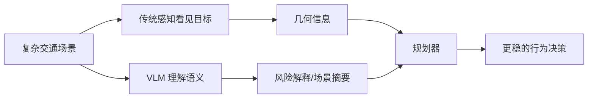
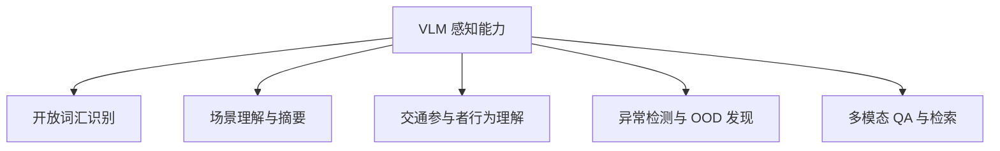
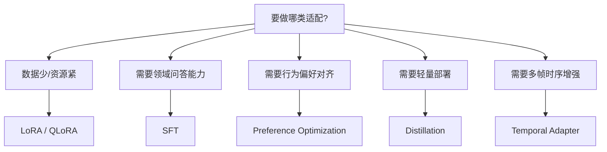
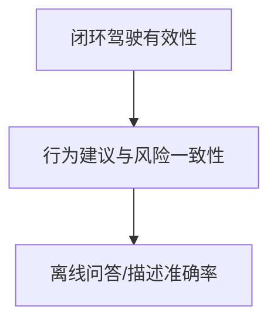
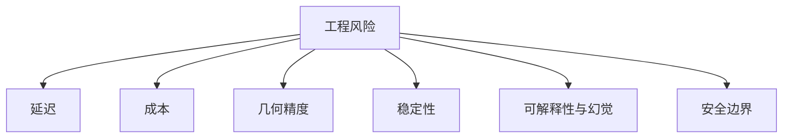
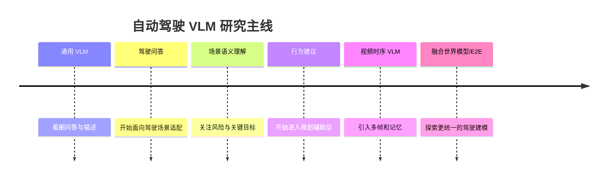

# 5.4 VLM使用与微调：

在前一节 `5.3` 里，我们已经把 `VLM` 的基本概念、结构组成、训练范式和能力边界讲清楚了。本节默认读者已经掌握这些基础，因此不再重复解释 `VLM` 的原理与谱系，而是直接转向使用、微调与自动驾驶落地问题。接下来更关键的问题是：

- 在自动驾驶里，`VLM` 到底适合放在哪一层？
- 它更适合做感知，还是更适合做规划辅助？
- 如果我们想把它从“通用多模态模型”变成“懂驾驶场景的专用模型”，应该如何构造数据、做微调、做评测？

这正是这一节要解决的问题。

自动驾驶是一个对 `时序性`、`几何精度`、`安全约束`、`闭环稳定性` 都极其敏感的系统，所以它并不是把一个通用 VLM 直接接到车上就能工作。更合理的理解方式是：**VLM 是自动驾驶系统中的高层语义模块、数据引擎和评测解释器，而不是直接替代整条控制链路的“万能大脑”。**

因此，这一节会延续前面章节的写法：**先讲问题和角色，再讲感知与规划中的使用方法，再讲数据构造、微调、评测和工程边界。**

> [!NOTE]
> 可以先记住一句贯穿全文的判断：
>
> **自动驾驶里的 VLM，最大的价值不是“看图说话”，而是把复杂场景转成可理解、可监督、可审查的高层语义问题。**

---

## 1. 为什么自动驾驶需要 VLM

传统自动驾驶系统已经非常强大。基于检测、分割、跟踪、预测、规划和控制的模块化流水线，已经能在大量结构化道路场景中工作得相当稳定。但只要场景变复杂，人类驾驶真正依赖的那层“语义理解”和“交互判断”就会暴露出难点。

例如下面这些问题，传统模块不一定容易直接回答：

- 这辆停在路边的车，是静止障碍物，还是准备突然开门？
- 前方行人是在正常等灯，还是有高概率突然横穿？
- 当前路口最值得关注的风险因素是什么？
- 为什么规划器刚才做出了减速而不是借道？

这些问题的共同点在于：它们并不只是“识别出了什么目标”，而是涉及 `高层语义理解`、`风险解释`、`交互意图推断` 和 `面向驾驶决策的信息组织`。这恰好是 VLM 更擅长补位的地方。

| 自动驾驶模块 | 传统方法强项 | 传统方法短板 | VLM 能补什么 | 更适合在线还是离线 |
|---|---|---|---|---|
| `2D/3D 感知` | 几何定位准、实时性强 | 开放词汇和高层语义弱 | 场景描述、开放词汇理解、异常语义解释 | 在线低频 + 离线 |
| `跟踪/预测` | 运动估计、轨迹建模成熟 | 很难直接给出语言解释 | 对行为进行语义总结与问答 | 离线为主 |
| `规划` | 约束明确、可控性强 | 长尾交互和语义先验弱 | 给出高层行为建议与风险提示 | 在线辅助 |
| `数据闭环` | 可积累海量日志 | 人工标注成本高 | 自动描述、QA 构造、难例挖掘 | 离线 |
| `系统评测` | 可做指标统计 | 很难解释“为什么失败” | 回放分析、失败归因、审查解释 | 离线 |

从系统视角看，自动驾驶引入 VLM 主要有四个动机：

1. 把视觉场景转成可查询、可解释的语义表示。
2. 为规划提供高层行为先验，而不是只依赖底层数值状态。
3. 降低数据构造和人工审核成本。
4. 在评测和回放环节中提供更强的解释能力。

> [!TIP]
> 如果只从“精确检测”这个角度看，VLM 并不一定比专用感知模型强。  
> 但如果问题变成“这段场景到底发生了什么、为什么危险、应该关注什么”，VLM 的价值就会非常明显。

---

## 2. VLM 在自动驾驶系统中的角色定位

自动驾驶里最容易犯的一个理解错误，是把 VLM 想成“新的总控模型”。更准确的说法是：**VLM 通常作为语义理解层、辅助决策层、数据层和评测层的能力增强器存在。**

| 角色 | 输入 | 输出 | 典型用途 | 是否直接参与控制 | 主要价值 |
|---|---|---|---|---|---|
| `感知增强器` | 图像、多帧视频、检测结果 | 场景描述、开放词汇标签、风险摘要 | 场景理解、异常识别、开放词汇感知 | 否 | 增强高层语义 |
| `规划辅助器` | 结构化场景摘要、轨迹候选、图像 | 行为建议、风险解释、优先级判断 | 礼让/绕行/减速建议，轨迹审查 | 间接 | 提供高层决策先验 |
| `数据引擎` | 日志、传感器片段、中间结果 | QA 样本、描述标签、难例摘要 | 自动标注、数据清洗、失败挖掘 | 否 | 降低数据成本 |
| `评测解释器` | 回放结果、模型输出、轨迹 | 失败归因、错误解释、审查报告 | 回放分析、闭环失败排查 | 否 | 增强可解释性 |

从职责上，可以把它进一步分成两类：

- `VLM as Observer`：它负责看、理解、总结、问答、审查。
- `VLM as Policy Assistant`：它负责给规划器提供高层语义建议，但不直接越权控制。

这层角色划分非常重要，因为它决定了系统边界。自动驾驶不能只追求“模型会不会回答”，还必须追问：

- 回答是不是对驾驶真的有用？
- 回答是否稳定？
- 回答错了会不会直接带来危险？

下面这张图可以把 VLM 在整套系统里的位置摆清楚：

| 判断问题 | 推荐答案 |
|---|---|
| `VLM 是否适合替代底层检测器？` | 不适合，至少短期内不是主流落点 |
| `VLM 是否适合直接输出控制量？` | 不推荐，风险高、闭环不稳 |
| `VLM 是否适合做高层语义理解？` | 非常适合 |
| `VLM 是否适合做数据与评测工具？` | 非常适合，而且短期价值最大 |

这一节的结论可以压缩成一句话：

> **VLM 在自动驾驶里最稳妥的位置，不是“直接开车”，而是“让系统更懂场景、更会解释、更会构造数据”。**

---

## 3. VLM 用于感知：任务、接法与边界

很多人一听“自动驾驶 + VLM”，第一反应就是“是不是要让 VLM 做感知”。这个方向当然成立，但关键不在于“能不能做”，而在于“做什么最值、接在哪一层最合理”。

### 3.1 VLM 最适合做哪些感知任务

| 感知任务 | VLM 是否适合 | 典型输入形式 | 典型输出形式 | 优势 | 主要局限 |
|---|---|---|---|---|---|
| 开放词汇识别 | 高 | 单帧图像、多相机图像 | 文本标签、区域描述 | 类别开放、可问答 | 几何不精确 |
| 场景描述 | 高 | 单帧/多帧图像 | 场景摘要、风险陈述 | 高层语义强 | 细粒度空间关系易错 |
| 交通行为理解 | 中高 | 视频片段、跟踪结果 + 图像 | 行为解释、意图描述 | 便于做语义推断 | 时序和因果可能不稳 |
| 异常事件检测 | 中高 | 长尾片段、回放视频 | 异常标签、问题摘要 | 适合长尾发现 | 容易幻觉 |
| 多模态问答 | 高 | 图像 + 问题 | 文本回答 | 接口自然、交互性强 | 不一定能替代定量模块 |
| 精确 3D 检测 | 低 | 多相机/LiDAR | 3D 框、速度、朝向 | 理论可辅助解释 | 不适合当主链路 |
| 实时跟踪主链路 | 低 | 连续视频 | 目标轨迹 | 可做辅助摘要 | 延迟高，稳定性不足 |

VLM 在感知里最强的，通常不是“把 3D 框打得更准”，而是：

- 用自然语言描述复杂交通场景；
- 在开放词汇设定下识别新目标或新风险；
- 回答“哪一个目标最值得关注，为什么”；
- 帮助工程师发现异常、长尾和标注问题。

### 3.2 VLM 感知能力图谱

### 3.3 VLM 在感知链路中的典型接法

最常见的接法不是“用 VLM 替换整条感知链”，而是下面这三种：

1. `主感知后接 VLM`：检测/跟踪/地图先给出结构化结果，VLM 再做场景语义总结。
2. `图像直接进 VLM`：用于离线问答、场景描述、数据审核。
3. `图像 + 结构化结果联合输入`：既保留几何信息，又利用 VLM 做高层解释。

| 感知链路维度 | 传统检测/分割/跟踪 | VLM | 最佳协作方式 |
|---|---|---|---|
| 几何精度 | 强 | 弱于专用模型 | 主感知负责几何，VLM 负责语义 |
| 开放词汇能力 | 弱 | 强 | 用 VLM 做开放词汇补充 |
| 多轮问答 | 弱 | 强 | 用于数据分析与交互式审查 |
| 实时性 | 强 | 相对弱 | 在线低频、离线高频 |
| 可解释性 | 中 | 强 | 利用 VLM 做原因说明 |

这也是为什么在自动驾驶里，VLM 更像是一个 `semantic perception head`，而不是 `hard real-time detector`。

> [!TIP]
> 一个很实用的判断标准是：  
> 如果任务需要的是“厘米级几何精度”和“毫秒级稳定输出”，优先传统专用感知模型；  
> 如果任务需要的是“高层语义理解”和“交互式解释”，优先考虑 VLM。

---

## 4. VLM 用于规划：高层决策辅助与驾驶解释

自动驾驶规划并不是只根据障碍物位置做几何优化，它本质上还需要回答：当前应该 `保守等待`、`轻微借道`、`提前减速`、`继续通过` 还是 `主动礼让`。这些选择往往带有很强的语义性与交互性。

这正是 VLM 在规划里最有意思的落点：**它不直接输出最终控制信号，而是为规划器提供高层行为先验和风险解释。**

| 接入层级 | 输入 | 输出 | 是否安全可控 | 适合程度 | 推荐程度 |
|---|---|---|---|---|---|
| 直接输出控制量 | 图像/视频 | 转角、油门、刹车 | 低 | 低 | 不推荐 |
| 输出高层行为建议 | 场景摘要、多相机、轨迹上下文 | 减速、礼让、绕行、保持 | 中高 | 高 | 推荐 |
| 输出风险解释 | 图像、轨迹候选 | 为什么危险、风险优先级 | 高 | 高 | 强烈推荐 |
| 输出规划候选排序 | 候选轨迹 + 场景语义 | 轨迹优先级 | 中 | 中高 | 推荐 |
| 输出离线回放审查意见 | 回放视频、规划日志 | 审查结论、失败原因 | 高 | 高 | 强烈推荐 |

### 4.1 最合理的规划接入方式

在真实系统里，更推荐这样的链路：

这种链路有几个明显优点：

- 底层几何和动态约束仍由专用规划器保证；
- VLM 的作用集中在语义层，不必承担全部闭环责任；
- 当 VLM 判断错误时，安全模块仍有机会兜底；
- 更容易做可解释性分析和错误归因。

### 4.2 VLM 在规划中最有价值的三个输出

1. `行为建议`
   例如：当前更适合减速观察，而不是激进并线。

2. `风险解释`
   例如：虽然正前方没有静态障碍物，但右前方行人存在突然横穿风险。

3. `回放审查`
   例如：规划器没有充分考虑路边车辆开门带来的潜在风险。

| 规划问题 | 纯几何方法能否直接解决 | VLM 是否有帮助 | 说明 |
|---|---|---|---|
| 路口礼让判断 | 部分能 | 高 | 语义交互强 |
| 长尾障碍行为解释 | 较难 | 高 | 适合语言总结 |
| 轨迹平滑优化 | 能 | 低 | 这是传统规划强项 |
| 为什么触发急刹 | 较难 | 高 | 适合回放解释 |

> [!NOTE]
> 在自动驾驶里，规划并不缺“优化器”，真正常缺的是“对复杂语义场景的高层判断”。  
> 这也是 VLM 进入规划链路最合理的理由。

---

## 5. 自动驾驶 VLM 的数据构造方法

如果没有自动驾驶专用数据，通用 VLM 即使会看图，也未必真的“懂驾驶”。问题不在于它没见过汽车，而在于它没有学会：

- 驾驶语境下什么信息最重要；
- 哪些风险会影响 `ego vehicle`；
- 什么样的输出才对后续规划真正有帮助。

因此，数据构造是这一类工作能不能做好的核心。

| 样本类型 | 样本格式 | 标签来源 | 构造成本 | 适用训练目标 | 主要风险 |
|---|---|---|---|---|---|
| 场景描述样本 | 图像/视频 + 描述 | 人工标注、规则生成 | 中 | 场景理解、摘要生成 | 描述泛化太空泛 |
| 驾驶问答样本 | 图像/视频 + QA | 人工、教师模型、回放脚本 | 中高 | VQA、风险问答 | 容易答得像人但没驾驶价值 |
| 风险判断样本 | 多帧 + 风险标签 | 回放分析、人工审核 | 高 | 风险识别、异常解释 | 主观性强 |
| 行为建议样本 | 场景摘要 + 建议 | 专家驾驶、规划日志 | 高 | 高层规划辅助 | 行为偏好不一致 |
| 失败案例样本 | 回放 + 错误归因 | 闭环失败日志 | 高 | 评测解释、偏好优化 | 分布偏稀疏 |

### 5.1 五种常见数据来源

| 数据来源 | 示例 | 优点 | 缺点 | 是否可自动化 | 适合的任务类型 |
|---|---|---|---|---|---|
| 人工驾驶日志 | `nuScenes`、`Waymo Open` | 真实分布好 | 标签成本高 | 部分可 | 描述、QA、行为学习 |
| 检测/地图自动转写 | 现有感知结果转文字 | 成本低 | 标签可能机械 | 高 | 场景摘要、检索 |
| 仿真数据 | `CARLA`、`NAVSIM` | 可控、可造长尾 | 与真实存在域差 | 高 | 危险场景、反事实 QA |
| 规划失败案例 | 闭环失败片段 | 对决策很有价值 | 样本少且稀有 | 中 | 偏好优化、错误归因 |
| 闭环回放数据 | 线上回放与审查 | 最接近真实业务 | 清洗成本高 | 中 | 评测、审查、难例挖掘 |

### 5.2 自动驾驶 VLM 数据流水线

### 5.3 数据构造时最重要的三个原则

1. `和驾驶决策相关`
   不要只生成“这是一辆车”这种低价值标签，而要更关注“这辆车为什么值得注意”。

2. `保留时序上下文`
   单帧足以描述静态场景，但很多风险来自多帧行为变化。

3. `保留结构化中间结果`
   自动驾驶不是纯图片任务，检测框、轨迹、地图和 ego 状态都可能是高价值条件信息。

| 数据构造问题 | 不推荐做法 | 更推荐做法 |
|---|---|---|
| 样本只描述物体名称 | 只写“有车有人” | 写“右前方行人可能影响 ego 通行” |
| 只做单帧 QA | 忽略时序 | 引入多帧上下文与行为变化 |
| 完全依赖教师模型 | 标签会自我复制偏差 | 教师生成 + 人工抽检 + 规则约束 |

> [!TIP]
> 自动驾驶 VLM 最稀缺的不是“图像数量”，而是“与驾驶决策真正相关的高质量监督信号”。

---

## 6. 自动驾驶 VLM 的微调方法

从训练角度看，自动驾驶里的 VLM 微调目标通常不外乎四类：

- 让模型更懂驾驶场景；
- 让模型更会回答与风险相关的问题；
- 让模型学会生成高层行为建议；
- 让模型适应多帧、多相机和资源受限部署。

因此，微调方法不应该按“热门名词”选，而应该按 `任务目标`、`数据规模` 和 `部署约束` 来选。

| 方法 | 训练成本 | 数据需求 | 适合任务 | 优势 | 风险点 | 是否推荐作为第一步 |
|---|---|---|---|---|---|---|
| Prompt / In-context | 低 | 很少 | 原型验证、离线问答 | 快速试验 | 上限有限 | 是 |
| SFT | 中高 | 中高 | 场景描述、QA、解释生成 | 稳定、直接 | 需要高质量监督 | 是 |
| LoRA | 中 | 中 | 领域适配 | 成本低、改动小 | 容量有限 | 是 |
| QLoRA | 低中 | 中 | 资源受限微调 | 显存友好 | 训练稳定性略差 | 是 |
| Preference Optimization | 中高 | 偏好对数据要求高 | 行为建议对齐 | 可调风格与偏好 | 数据贵、设计难 | 视任务而定 |
| Distillation | 高 | 高 | 轻量部署 | 适合压缩能力 | 容易损失边界能力 | 否 |
| Temporal Adapter | 中 | 多帧数据 | 视频理解、时序一致性 | 更贴近驾驶任务 | 设计复杂 | 中后期使用 |

### 6.1 微调方法选择树

### 6.2 一个实用的微调顺序

对于大多数自动驾驶团队，更现实的顺序通常是：

1. `先做 prompt + few-shot` 验证可行性。
2. `再做 SFT 或 LoRA` 获得领域能力。
3. `最后再考虑偏好优化或时序增强`。

| 微调目标 | 首选方法 | 原因 |
|---|---|---|
| 场景描述更稳 | SFT / LoRA | 数据相对容易构造 |
| 问答更贴近驾驶 | SFT | 最直接 |
| 行为建议更保守 | Preference Optimization | 能对齐偏好 |
| 车端资源受限 | QLoRA + Distillation | 兼顾训练和部署 |
| 多帧理解不足 | Temporal Adapter | 补足时序 |

### 6.3 自动驾驶微调的特殊难点

- 标注贵，因为“好标签”往往需要专家理解。
- 决策偏好不唯一，不同团队可能偏保守或偏激进。
- 仅仅会描述，不代表对规划真的有帮助。
- 如果监督只来自语言，模型可能会“学会解释”，却没有真正学到几何和交互。

这也是为什么自动驾驶里的微调，必须始终围绕一句话来设计：

> **不是让模型更会说，而是让它说出的内容对驾驶系统更有用。**

---

## 7. 自动驾驶场景下的评测体系

如果用通用多模态 benchmark 来评价自动驾驶 VLM，很容易得出错误结论。因为“回答像不像人”并不等于“对驾驶有没有帮助”。

更合理的评测框架，应该至少分成 `语义能力`、`行为有效性`、`时序一致性` 和 `安全鲁棒性` 四层。

| 评测维度 | 评价问题 | 常见指标 | 是否能反映驾驶有效性 | 注意事项 |
|---|---|---|---|---|
| 场景理解 | 是否正确识别关键场景 | Accuracy、BLEU、人工审查 | 部分能 | 文本指标不够 |
| 风险识别 | 是否抓住影响 ego 的风险因素 | Recall、F1、专家评分 | 能 | 比单纯描述更重要 |
| 行为建议 | 建议是否合理保守 | 一致性、偏好胜率、人工评测 | 高 | 需要明确驾驶偏好 |
| 时序一致性 | 多帧回答是否稳定 | Consistency score | 高 | 驾驶特别看重稳定 |
| 鲁棒性 | 雨夜、遮挡、长尾下是否失真 | 分场景评测 | 高 | 不能只看平均值 |
| 幻觉控制 | 会不会编造不存在风险 | Hallucination rate | 高 | 安全问题核心 |

### 7.1 离线、开环、闭环要分开看

| 评测方式 | 输入输出 | 能验证什么 | 验证不了什么 | 成本 | 推荐用途 |
|---|---|---|---|---|---|
| 离线评测 | 图像/视频 -> 文本输出 | 场景理解、QA、描述质量 | 闭环安全性 | 低 | 早期筛选 |
| 开环评测 | 场景摘要/轨迹候选 -> 建议 | 建议合理性、轨迹排序 | 真实交互反馈 | 中 | 规划辅助验证 |
| 闭环评测 | 模型参与整车回路 | 真正驾驶有效性 | 大规模统计成本高 | 高 | 上线前验证 |

### 7.2 评测层级图

### 7.3 自动驾驶里最值得看的失败模式

| 失败模式 | 为什么危险 |
|---|---|
| 漏掉真正影响 ego 的目标 | 直接影响规划质量 |
| 对同一段视频前后说法不一致 | 说明时序理解不稳 |
| 解释非常流畅但无事实依据 | 典型 VLM 幻觉 |
| 过度保守或过度激进 | 会把偏好问题放大到驾驶行为 |

> [!NOTE]
> 自动驾驶里的 VLM 评测，最忌讳只用一个“平均准确率”数字概括全部能力。  
> 因为真正决定系统价值的，往往是长尾、风险和稳定性。

---

## 8. 工程落地挑战：实时性、闭环、安全与成本

从工程角度看，很多惊艳的 VLM 驾驶 demo 之所以还没成为主流量产方案，不是因为“模型不会看”，而是因为自动驾驶系统对 `延迟`、`稳定性` 和 `安全边界` 的要求太高。

| 部署位置 | 延迟要求 | 适合任务 | 资源要求 | 风险等级 | 是否推荐 |
|---|---|---|---|---|---|
| 车端在线低频 | 高 | 高层语义辅助、风险提示 | 高 | 中 | 谨慎推荐 |
| 车端离线回放 | 中 | 失败分析、解释审查 | 中 | 低 | 推荐 |
| 云端数据闭环 | 低 | 自动标注、难例挖掘、QA 生成 | 高 | 低 | 强烈推荐 |
| 仿真评测系统 | 中 | 评测、策略分析 | 中 | 低 | 强烈推荐 |
| 标注/审核流水线 | 低 | 数据辅助、人机协同 | 中 | 低 | 强烈推荐 |

### 8.1 六个最现实的工程挑战

1. `延迟高`
   多相机、多帧输入会让 token 和推理成本迅速上升。

2. `几何不够硬`
   VLM 的语言能力强，但并不等于它拥有稳定的厘米级空间推理。

3. `闭环风险高`
   离线看起来很聪明，不代表放进回路里仍然稳定。

4. `幻觉代价大`
   在自动驾驶里，“编造一个不存在的风险” 和 “漏掉一个真实风险” 都可能带来严重后果。

5. `成本高`
   长视频、多相机、长上下文输入都很贵。

6. `系统边界复杂`
   它必须和检测、预测、规划、安全模块一起协作，而不是独立存在。

| 工程维度 | VLM 的优势 | VLM 的主要问题 |
|---|---|---|
| 可解释性 | 强 | 解释不等于正确 |
| 灵活性 | 强 | 边界不稳定 |
| 几何精度 | 中低 | 不如专用模型 |
| 实时性 | 中低 | 很吃算力 |
| 长尾语义 | 强 | 仍需数据支撑 |

### 8.2 风险维度图

这一节的结论其实非常现实：

- 短期最具价值的落点是 `数据闭环`、`回放分析`、`语义评测`。
- 中期可以探索 `高层规划辅助`。
- 直接让 VLM 单独承担闭环控制，至少目前仍然需要非常强的保守态度。

---

## 9. 代表性方向与研究问题总览

由于这一节定位是“科研教程”，所以有必要给出一个研究问题地图，而不只是讲工程接法。

| 研究方向 | 核心问题 | 常见方法思路 | 与感知/规划关系 | 当前主要难点 |
|---|---|---|---|---|
| 驾驶场景描述 | 如何把复杂场景转成高质量语义摘要 | 图像/视频描述、instruction tuning | 更偏感知 | 容易描述得泛泛 |
| 驾驶问答 | 如何让问答真正对驾驶有用 | QA 数据集、场景问答 | 感知 + 评测 | 评价标准难设计 |
| 风险解释 | 如何识别关键风险因素 | 关键目标排序、风险摘要 | 感知 + 规划 | 容易幻觉 |
| 行为建议 | 如何输出高层驾驶策略 | 场景摘要 -> 建议生成 | 更偏规划 | 偏好和安全难统一 |
| 视频/时序 VLM | 如何理解多帧动态变化 | 时间记忆、adapter、video tokens | 感知 + 规划 | 时序稳定性 |
| VLM + world model / E2E | 如何和统一驾驶模型融合 | 语义层与动作层联合建模 | 全链路 | 闭环可靠性极难 |

### 9.1 一条简化的发展主线

### 9.2 读论文时最值得盯住的四个问题

| 论文阅读问题 | 为什么重要 |
|---|---|
| 模型输入是单帧、多帧还是多相机？ | 决定它是否真正接近驾驶场景 |
| 输出是描述、问答、建议还是控制？ | 决定系统边界 |
| 是否用了结构化中间结果？ | 决定它是不是“纯看图”还是“结合自动驾驶先验” |
| 如何做评测？ | 决定论文结论是否可信 |

换句话说，自动驾驶 VLM 的研究价值，不只在于“多模态模型更强了”，更在于它开始试图回答：

- 如何把几何世界和语言世界对齐？
- 如何让语义输出真正服务规划？
- 如何让离线理解能力迁移到闭环系统？

---

## 10. 学习路径、实践建议与小结

如果你想系统进入这个方向，最好的方式不是先盯着某个具体大模型，而是先把“自动驾驶问题本身”搞清楚，再看 VLM 如何嵌进去。

| 阶段 | 应该先学什么 | 推荐数据/平台 | 输出目标 | 常见误区 |
|---|---|---|---|---|
| 第 1 阶段 | 自动驾驶感知/规划链路 | `nuScenes`、`nuPlan` | 知道问题长什么样 | 只学模型，不懂系统 |
| 第 2 阶段 | 通用 VLM 与多模态微调基础 | `LLaVA` 系、`Qwen-VL` 系 | 理解输入输出和训练方式 | 把 VLM 当黑盒 |
| 第 3 阶段 | 驾驶场景描述与问答 | `BDD100K`、`nuScenes` | 做出离线原型 | 只做漂亮描述 |
| 第 4 阶段 | 高层规划辅助与评测 | `nuPlan`、`NAVSIM`、`CARLA` | 评估建议是否有用 | 跳过评测直接谈上车 |
| 第 5 阶段 | 时序增强与闭环分析 | 回放系统、仿真闭环 | 做更像真实系统的验证 | 用离线高分代替闭环可靠 |

### 10.1 一个推荐的实践顺序

1. 用通用 VLM 跑 `few-shot` 驾驶场景问答。
2. 构造小规模 `场景描述 + 风险问答` 数据做 LoRA/SFT。
3. 把输出接入离线回放系统，检查有没有真正抓到关键风险。
4. 再考虑让模型参与 `高层行为建议` 或 `轨迹审查`。

### 10.2 全文速查总表

| 场景 | 推荐 VLM 用法 | 是否建议微调 | 推荐数据 | 推荐评测方式 | 风险提醒 |
|---|---|---|---|---|---|
| 场景描述 | 图像/视频摘要 | 建议 | `nuScenes`、`BDD100K` | 离线描述评测 | 容易空泛 |
| 开放词汇感知 | 语义补充、目标解释 | 视情况 | 图像 + 区域标签 | 离线 | 几何不精确 |
| 风险问答 | QA 与关键目标识别 | 建议 | 回放片段、失败案例 | 离线 + 开环 | 幻觉风险 |
| 行为建议 | 高层策略辅助 | 建议 | 规划日志、专家数据 | 开环优先 | 偏好不稳定 |
| 回放分析 | 错误解释、失败归因 | 可选 | 闭环回放数据 | 离线 | 解释未必正确 |
| 车端在线辅助 | 低频风险提示 | 谨慎 | 多帧真实数据 | 开环 -> 闭环 | 延迟与稳定性 |

### 10.3 小结

把这一整节压缩成几句话，其实就是：

- `VLM` 在自动驾驶里最适合做高层语义理解，而不是直接替代底层实时感知和控制。
- 它在 `感知增强`、`规划辅助`、`数据闭环`、`回放评测` 四个方向都有很强潜力。
- 真正决定效果的，不只是模型大小，而是 `数据构造`、`微调目标`、`评测设计` 和 `系统接入方式`。
- 对自动驾驶来说，“会回答”从来不是终点，“回答是否对驾驶有效、是否稳定可靠”才是关键。

> [!TIP]
> 如果你只记住一句话，那就是：
>
> **自动驾驶中的 VLM，不应该被理解成“会开车的大模型”，而应该被理解成“让自动驾驶系统更懂场景、更会解释、更容易训练和评估的语义基础设施”。**
