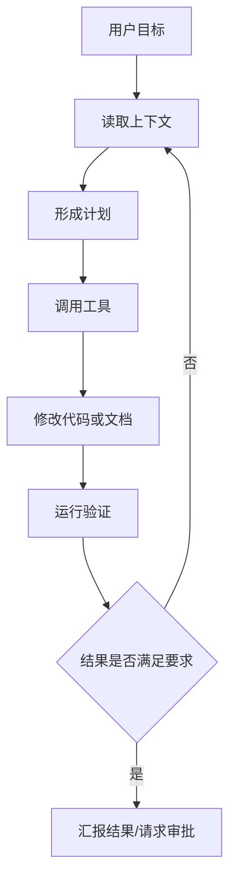

# 7.1 Vibe Coding 工具

过去很长一段时间里，程序员和科研工程师写代码的基本动作是稳定的：打开 `IDE`，查文档，读报错，搜仓库，手工改代码，跑测试，再继续迭代。AI 编程工具最早只是把其中一小部分动作加速，例如补全几行代码、解释一段函数、生成一个小脚本。

但到了 `2024-2026` 这段时间，工具形态发生了明显变化。今天大家讨论的已经不只是“代码补全”，而是：

- 模型能不能理解整个仓库；
- 工具能不能主动读文件、跑命令、查日志、修改代码；
- 系统能不能根据目标自己拆任务、自己验证结果；
- 人和模型之间能不能形成稳定、可复用的协作工作流。

这也是 `Vibe Coding` 这个说法流行起来的背景。它并不是某个严谨的学术名词，而更像一种工程文化里的口语：你把任务目标、约束和意图告诉模型，模型和 Agent 帮你搜索、实现、调试、组织内容，人类负责监督方向、校验结果和做最终判断。

所以，这一章真正要讲的不是“某个产品怎么点按钮”，而是：

> **Vibe Coding 本质上是一套新的编程协作系统。**

它至少由六层东西共同组成：`IDE`、`模型`、`Agent`、`上下文工程`、`工具系统`、`工作流方法论`。如果只把它看成“一个聊天框”，你会很快撞上上限；但如果把它理解成一套人机协作生产系统，你就会知道为什么它能显著改变科研和工程效率。

---

## 1. 什么是 Vibe Coding，为什么它突然重要

如果只从表面看，`Vibe Coding` 很像“让 AI 帮我写代码”。但这个理解太浅了。真正的变化不是“生成速度更快”，而是**编程活动的粒度发生了变化**。

传统写代码时，人类要自己完成几乎所有中间步骤：理解需求、定位代码、决定改哪里、处理依赖、跑测试、整理结果。今天很多工具已经能把这些动作串起来，形成一个带反馈的闭环。于是，人类的工作重心开始从“逐行输入”转向“定义目标、组织上下文、设定边界、校验结果”。

这就是为什么很多人第一次高频使用 AI Coding 工具之后，会感觉自己不是在“多了一个补全插件”，而像是“多了一个不稳定但很能干的初级工程师”。

不过这个比喻也容易误导，因为它会让人忘记一件事：模型并不真正理解业务后果，也不会天然承担责任。它只是一个**能基于上下文推理、生成，并在工具支持下执行动作的系统**。这也是我们必须系统学习这类工具的原因。

先用一张能力地图把全局摆清楚：

| 层次 | 它解决什么问题 | 典型对象 | 为什么重要 |
|---|---|---|---|
| `IDE` | 人如何与代码库和模型交互 | Cursor、VS Code、Codex 工作台、终端 | 它决定了你如何发出任务、查看结果、管理上下文 |
| `Model` | 谁来负责理解、推理、生成 | GPT、Claude、Gemini、开源代码模型 | 它决定上限，但不决定全部体验 |
| `Agent` | 模型能否从“会回答”升级到“会行动” | Coding Agent、Background Agent、CLI Agent | 它决定工具能否自己读仓库、跑命令、改文件 |
| `Context` | 模型是否真正理解当前项目 | 仓库上下文、规则、记忆、提示、历史对话 | 没有上下文，再强的模型也会瞎猜 |
| `Tools` | 模型能否接入外部世界 | 终端、Git、浏览器、MCP、连接器 | 没有工具，模型只能“说”，不能“做” |
| `Workflow` | 一次次对话能否变成稳定生产方式 | Plan、Skill、Rules、Memory、自动化流程 | 没有工作流，效率会停留在演示层面 |

这张表最值得记住的一点是：**Vibe Coding 从来不是单层能力，而是多层系统协同。**

> [!TIP]
> 很多人一开始会把体验好坏全部归因于“模型强不强”。  
> 其实在真实工作里，模型能力、上下文质量、权限边界、工具调用、工作流设计，往往同样重要。

---

## 2. Vibe Coding 不是单个工具，而是一整套协作系统

要真正理解这一波工具革命，必须从“产品名思维”跳到“系统思维”。你当然可以记住 `Codex`、`Cursor`、`Claude Code` 这些名字，但如果不知道它们在系统里分别承担什么角色，就会很容易把产品更新误看成“换皮”，或者把小功能误看成“范式变化”。

更合适的理解方式，是把一套 AI Coding 系统想成一个新的软件生产流水线：

1. 人类给出目标、约束、风格和验收标准。
2. 模型理解问题并形成初步推理。
3. Agent 搜索仓库、读取文件、调用工具、提出计划。
4. 系统在权限边界内执行动作。
5. 测试、日志和运行结果回流给模型。
6. 人类做最终审核，决定是否接受结果。

如果没有第三步和第四步，这只是一个聊天机器人；如果没有第一步和第六步，这又会变成一个危险的自动化系统。真正有价值的，是中间这条“可控自动化”地带。

下面这张表把系统各层之间的关系再压缩一遍：

| 系统层 | 更偏“能力”还是“约束” | 典型输入 | 典型输出 | 失效时最常见的问题 |
|---|---|---|---|---|
| `Model` | 能力 | prompt、上下文、工具反馈 | 文本、计划、代码、工具调用意图 | 幻觉、推理短路、误解需求 |
| `Agent Runtime` | 能力 | 目标、工具权限、执行反馈 | 搜索、命令、编辑、验证闭环 | 路径错、迭代失控、动作过多 |
| `Context Layer` | 约束 + 能力 | 仓库、规则、记忆、历史 | 更准确的问题理解 | 漏读关键文件、失去项目约束 |
| `Tool Layer` | 能力 | 指令、参数、权限 | 真实外部动作 | 工具调用失败、环境不一致 |
| `Approval Layer` | 约束 | 用户授权、策略 | 是否允许执行 | 不安全动作被放行或过度阻断 |
| `Workflow Layer` | 约束 + 组织 | 团队规范、任务模板 | 稳定重复流程 | 每次都从零开始、质量不稳定 |

所以，`Vibe Coding` 最终比拼的不是“谁会写一句更炫的代码”，而是：

- 谁更懂当前代码库；
- 谁更会拆任务；
- 谁的工具接入更顺；
- 谁的权限边界更稳；
- 谁更容易沉淀成团队工作流。

---

## 3. AI Coding 时代的 IDE：从编辑器到模型操作台

如果说过去的 `IDE` 是“代码编辑器 + 调试器 + 项目管理器”，那么今天的 `IDE` 正在变成“代码编辑器 + 模型前端 + Agent 操作台 + 仓库上下文管理器”。

这个变化很重要，因为它决定了你与模型的关系：过去是“你主动查资料，再把结果手动带回代码”；今天越来越多时候是“你把目标告诉系统，系统自己在仓库和工具里流动”。

这也是为什么很多 AI Coding 工具看起来都在做“聊天侧栏”，但真正拉开差距的往往不是聊天框，而是：

- 它能看到多少上下文；
- 它能调用哪些工具；
- 它如何表示计划和执行状态；
- 它如何记住你的偏好和项目规则。

先看 IDE 角色的变化：

| 传统 IDE | AI 时代 IDE |
|---|---|
| 主要是文本编辑器 | 更像模型操作台 |
| 人类逐行输入为主 | 人类给目标，模型参与实现 |
| 关注单文件或小范围代码 | 强调仓库级上下文与跨文件修改 |
| 工具主要由人手动调用 | Agent 可以主动调终端、搜索、Git、浏览器等工具 |
| 以“写代码”作为中心动作 | 以“完成任务”作为中心动作 |
| 项目知识主要在工程师脑中 | 规则、记忆、上下文开始系统化沉淀 |

这张表背后的核心变化是：**今天 IDE 的中心不再只是“代码文本”，而是“任务执行流”。**

进一步看三条主流路线：

| 工具 | 主要形态 | 更像什么 | 强项 | 典型适用场景 | 主要限制 |
|---|---|---|---|---|---|
| `Codex` | 带计划、技能、工具调用与执行边界的 AI 工作台 | 有流程意识的协作式 Agent 系统 | 任务分解、受控执行、技能化、工作流化 | 中大型任务、文档编写、代码改动、带约束的 Agent 协作 | 需要较清晰的任务描述和边界设计 |
| `Cursor` | IDE 原生增强型 AI 编辑器 | 深度嵌入编辑器的智能副驾驶 | 代码补全、仓库问答、规则记忆、编辑体验顺滑 | 日常编码、重构、代码阅读、团队协作 | 容易被误用成“只聊天不设边界”的模式 |
| `Claude Code` | 终端优先的 Coding Agent | 工程师命令行里的强执行助手 | 仓库级搜索、命令执行、脚本化、终端闭环 | 调试、批量改动、CLI 驱动项目、自动化工程任务 | 对命令行和工程边界意识要求更高 |

这一节最该记住的不是“谁更强”，而是三者代表了三种交互哲学：

- `Cursor` 更强调 **编辑器内原生协作**；
- `Claude Code` 更强调 **终端与执行闭环**；
- `Codex` 更强调 **计划、技能和可控工作流**。

---

## 4. 主流三条路线：Codex、Cursor、Claude Code

这一节不写成产品说明书，而是把三大主流工具当作三条代表路线来理解。你会发现，它们并不是“只有品牌差异”，而是对“AI 编程到底该怎样组织”给出了不同答案。

### 4.1 Codex：计划化、工具化、技能化的协作路线

`Codex` 这一类系统更强调“先把事情做对，再把事情做快”。它通常不是单纯让模型直接生成一坨代码，而是更看重：

- 任务如何拆解；
- 哪些动作可以自动执行；
- 哪些动作必须经过审批；
- 哪些经验可以沉淀为 `skill`；
- 哪些重复流程可以升级成 `workflow`。

这类路线很适合长任务、跨文件任务、带明显边界的任务，也很适合写文档、做仓库分析、整理科研工作流。你会明显感觉到，它不是只关心“模型输出什么”，而更关心“系统如何以工程化方式完成任务”。

截至 `2026 年 5 月`，OpenAI 官方公开资料里，`Codex CLI`、`Codex IDE Extension`、云端任务、`Skills`、`Automations`、以及多 Agent 工作流都已经成为这条路线的重要组成部分。尤其是 `Skills` 和带审批边界的执行方式，很适合拿来讲“可复用经验”和“受控自动化”。

### 4.2 Cursor：IDE 原生增强路线

`Cursor` 的最大特点，是它让很多工程师第一次真正愿意长期把 AI 放进自己的日常编码习惯里。原因不是它“最像机器人”，而是它“最像 IDE”。

它把 AI 深度嵌入代码编辑、补全、代码库问答、跨文件修改和仓库记忆中，让用户不需要大幅改变既有开发姿势，就能获得明显提效。这条路线特别适合：

- 高频小修改；
- 持续补全；
- 一边读一边问；
- 在已有项目里做局部重构；
- 长期积累团队规则和个人偏好。

截至 `2026 年 5 月`，Cursor 官方公开内容里，`Rules`、`Memories`、`Background Agents`、`BugBot` 等能力，已经让它不再只是“补全编辑器”，而是在向“IDE 内部的多形态智能协作平台”演进。

### 4.3 Claude Code：终端 Agent 路线

`Claude Code` 代表的是另一种非常工程化的答案：如果软件开发本来就大量发生在终端、Git、脚本、测试和日志里，那为什么不把模型直接放进命令行环境？

这条路线的吸引力很强，因为它天然贴近真实工程动作：

- 搜索仓库；
- 运行测试；
- 查看错误日志；
- 批量编辑文件；
- 使用脚本和命令完成任务。

截至 `2026 年 5 月`，Anthropic 官方文档已经把 `Claude Code` 建成了较完整的体系，包括 `Slash Commands`、`Subagents`、`Hooks`、`Memory`、`MCP`、权限和设置等。它最像一个能在终端里持续行动的 Agent，而不是一个只会解释代码的聊天模型。

先看三者的总览对比：

| 维度 | `Codex` | `Cursor` | `Claude Code` |
|---|---|---|---|
| 核心气质 | 工作流化、技能化、可控自动化 | IDE 原生协作、日常编码增强 | 终端优先、执行闭环、工程自动化 |
| 典型入口 | 工作台、IDE、CLI、云任务 | 编辑器侧栏、补全、仓库对话 | Terminal / CLI |
| 更擅长 | 计划、受控执行、可复用流程 | 连续编码、仓库问答、编辑体验 | 调试、命令执行、批量任务 |
| 上下文组织 | 强调技能、规则、任务边界 | 强调规则、记忆、代码库上下文 | 强调命令上下文、项目状态、会话记忆 |
| Agent 感 | 强 | 中到强 | 很强 |
| 最适合谁 | 想把 AI 用成生产系统的人 | 想把 AI 深度嵌进 IDE 的人 | 习惯 CLI、强调工程闭环的人 |

再看任务适配：

| 任务类型 | `Codex` | `Cursor` | `Claude Code` |
|---|---|---|---|
| 日常补全与续写 | 中 | 很强 | 中 |
| 跨文件理解与问答 | 强 | 很强 | 强 |
| 带边界的中大型改动 | 很强 | 强 | 很强 |
| 终端调试与脚本执行 | 强 | 中 | 很强 |
| 文档生成与结构化整理 | 很强 | 强 | 强 |
| 团队化沉淀规则与流程 | 很强 | 强 | 强 |
| 自动化程度 | 高，但强调可控 | 中到高 | 高 |

这一节最重要的结论是：

> **三家工具都在做 AI Coding，但它们优化的不是同一个问题。**

如果你更看重编辑器内顺滑体验，`Cursor` 往往更自然；如果你更看重终端与执行，`Claude Code` 往往更有力量；如果你更看重把经验固化为规则、技能、流程和受控自动化，`Codex` 的思路会更适合系统化工作。

---

## 5. 模型层怎么理解：能力、成本、上下文与选型

很多人第一次比较 AI Coding 工具时，会下意识问：哪个模型最强？这个问题当然重要，但不够精确。更好的问题应该是：

> **对于当前任务，我到底需要什么类型的模型能力？**

在编码和科研任务里，模型通常要同时扮演几个角色：

- 解释器：帮你理解代码、论文、报错；
- 规划器：帮你拆任务、设计修改路径；
- 生成器：帮你写代码、写文档、写测试；
- 执行协调器：在 Agent 模式下决定何时调用哪些工具。

因此，模型选型不能只看“排行榜”，而要看任务结构。先把关键维度摆出来：

| 维度 | 含义 | 对 AI Coding 的影响 |
|---|---|---|
| 推理能力 | 能否处理复杂约束、长逻辑链和多步问题 | 决定架构设计、疑难调试和任务拆解上限 |
| 代码理解 | 能否稳定读懂真实工程代码与依赖关系 | 决定跨文件修改和仓库问答质量 |
| 长上下文 | 能否在长对话和大仓库里保持一致性 | 决定是否容易忘前文、漏关键文件 |
| 工具使用稳定性 | 是否会合理调用终端、Git、浏览器等工具 | 决定 Agent 任务是否稳 |
| 成本 | 调用价格与资源消耗 | 决定是否能高频日常使用 |
| 速度 | 首 token 和完成时间 | 决定交互流畅度与试错效率 |
| 风格 | 更保守还是更激进，更解释型还是更执行型 | 决定合作体验与风险偏好 |

从实践上说，AI Coding 里的模型经常不是“一把梭”，而是分层使用。快模型适合高频、小步、便宜的交互；强模型适合关键节点、复杂问题和高风险任务。

| 任务类型 | 更适合快模型还是强模型 | 原因 | 风险点 |
|---|---|---|---|
| 补全样板代码 | 快模型 | 结构固定、反馈频繁、容错较高 | 容易生成看似能跑但不符合项目风格的代码 |
| 读报错和定位浅层问题 | 快模型 | 信息量集中、响应速度更重要 | 会忽略隐藏上下文 |
| 大仓库重构 | 强模型 | 需要跨文件理解和长期一致性 | 若上下文不足，错误传播很快 |
| 科研代码理解 | 强模型 | 涉及算法逻辑、配置、实验细节 | 容易把“合理猜测”当“代码事实” |
| 写技术文档 | 中到强模型 | 需要结构化表达和准确抽象 | 会写得流畅但不一定准确 |
| 调试疑难 bug | 强模型 | 需要多步推理和假设验证 | 若工具反馈链不完整，容易误判根因 |

这一节的核心不是让你背一串模型名，而是建立一个更稳的习惯：

- 小任务优先追求响应速度；
- 大任务优先追求推理稳定；
- 高风险任务一定要求验证闭环；
- 模型再强，也要靠上下文和验收标准兜底。

---

## 6. Agent 的概念、工作方式与执行闭环

如果说聊天模型解决的是“能不能回答我的问题”，那么 `Agent` 解决的是“能不能围绕目标持续行动”。这是 AI Coding 里最关键的跨越之一。

当工具进入 Agent 模式后，系统通常不再只生成一段文本，而是会进行一个循环：

1. 理解目标；
2. 搜索上下文；
3. 形成计划；
4. 调用工具；
5. 修改状态；
6. 运行验证；
7. 根据反馈继续迭代；
8. 汇报结果或请求审批。

这意味着 Agent 的本质不是“更聪明的聊天”，而是**带工具的闭环执行系统**。下面这张表把 Agent 的典型阶段拆开：

| 阶段 | Agent 在做什么 | 可能调用什么 | 人类应关注什么 |
|---|---|---|---|
| 接收目标 | 解析任务、抽取约束、识别显式要求 | 对话上下文、规则、记忆 | 目标是否足够清晰，验收标准是否明确 |
| 读上下文 | 搜文件、看配置、读相关代码和文档 | 搜索、文件读取、仓库索引 | 有没有漏掉关键入口和边界条件 |
| 制定计划 | 决定先做什么、后做什么 | 内部推理、计划系统、Todo | 任务拆解是否合理，是否有隐藏风险 |
| 调用工具 | 运行命令、查看日志、查 Git、开网页 | 终端、Git、浏览器、MCP | 权限是否安全，动作是否可逆 |
| 修改代码 | 编辑文件、生成补丁、写测试 | 编辑器、patch 工具 | 改动范围是否失控 |
| 运行验证 | 执行测试、构建、静态检查 | 测试命令、编译器、CI 工具 | 验证是否充分，是否只测到表面 |
| 继续迭代 | 根据报错和结果继续修复 | 同上 | 会不会陷入错误循环 |
| 汇报结果 | 总结改动、说明风险、请求审批 | 对话系统 | 有没有真实说明残留风险和未验证项 |

再把普通聊天和 Agent 摆在一起看：

| 维度 | 普通聊天模型 | Agent |
|---|---|---|
| 是否调用工具 | 通常不调用或弱调用 | 可以系统化调用 |
| 是否读仓库 | 一般靠手动粘贴上下文 | 可以主动搜索和读取 |
| 是否执行命令 | 通常不会 | 可以在授权下执行 |
| 是否自动迭代 | 基本不会 | 会根据反馈继续循环 |
| 是否需要权限控制 | 相对较低 | 很高 |
| 主要产出 | 文本、建议、代码片段 | 执行动作、修改结果、验证反馈 |

下面用一张流程图把这件事再直观化：

这部分最容易被误解的点有两个：

- Agent 不是“有自我意识”，只是更完整地把推理和动作连起来；
- Agent 也不是越自动越好，自动化越强，越需要权限、日志、审查和验收。

---

## 7. `plan / skill / workflow / rules / memory / tools` 到底分别是什么

当你开始从“偶尔问几句”进入“持续用 AI 工作”，就会发现另一个问题：为什么有的人越用越顺，有的人越用越乱？

一个很大的差别在于，前者会逐步把经验沉淀成结构化的系统对象，而不是每次从零开始聊天。这里最重要的几个概念就是：

- `plan`
- `skill`
- `workflow`
- `rules`
- `memory`

先看边界：

| 概念 | 核心问题 | 作用对象 | 生命周期 | 典型例子 |
|---|---|---|---|---|
| `plan` | 这一次任务该怎么拆 | 当前任务 | 短期 | “先看入口文件，再跑测试，再改 A/B 两处” |
| `skill` | 这一类任务通常怎么做 | 某类重复任务 | 中长期 | “写技术文档时先抽结构，再补表格，再做术语统一” |
| `workflow` | 多个动作怎样串成稳定流程 | 任务链条 / 团队流程 | 中长期 | “需求分析 -> 搜仓库 -> 改代码 -> 跑测试 -> 写总结” |
| `rules` | 模型做事时必须遵守什么约束 | 行为规范 | 长期 | “先读代码再下结论”“不要改无关文件” |
| `memory` | 哪些偏好和背景应持续记住 | 人 / 项目 / 团队 | 长期 | “本仓库文档风格偏教程型，尽量多表格” |

这张表最重要的地方，是帮助你避免把所有东西都混成“prompt”。

- `plan` 更像当前任务的路线图；
- `skill` 更像某类任务的经验模板；
- `workflow` 更像可以重复执行的动作编排；
- `rules` 更像系统约束；
- `memory` 更像长期偏好和背景。

再看工具、权限和外部系统这几个概念：

| 概念 | 更偏能力还是约束 | 是否面向外部系统 | 典型作用 |
|---|---|---|---|
| `tool use` | 能力 | 是 | 让模型调用终端、搜索、浏览器、编辑器等动作 |
| `MCP` | 能力接口 | 是 | 让模型通过标准协议接入外部工具和数据源 |
| `connector` | 能力接口 | 是 | 连接 GitHub、Drive、Slack、数据库等外部系统 |
| `approval` | 约束 | 否，但影响外部动作 | 在高风险动作前要求人类确认 |
| `sandbox` | 约束 | 否 | 限制可读写路径、网络和执行范围 |
| `permission` | 约束 | 是 | 控制哪些动作允许、哪些动作禁止 |

从工程角度看，真正成熟的 AI Coding 系统一定是“能力越来越强，约束也越来越清楚”。如果只有工具没有约束，就很危险；如果只有约束没有工具，就只是一个会说话的只读助手。

---

## 8. 主流之外：其他值得知道的 AI Coding 工具

虽然这一章把 `Codex / Cursor / Claude Code` 作为主线，但你也应该知道，这个生态远远不止三家。尤其在 `2025-2026` 这一段时间里，AI Coding 工具已经明显分化成多种路线：有的偏 IDE，有的偏终端，有的偏开源可定制，有的偏企业平台。

这一节不展开使用细节，只给你一张生态速览表，帮助建立坐标系：

| 工具 | 定位 | 主要特点 | 更适合谁 | 与三大主线的关系 |
|---|---|---|---|---|
| `GitHub Copilot` | 从补全走向 Agent 的平台型产品 | 补全普及度高，已扩展到 coding agent、仓库级自定义指令 | 已深度使用 GitHub 生态的团队 | 更像“大厂平台化路线”的代表 |
| `Windsurf` | 原生 agentic IDE | 强调 `Cascade`、计划、实时上下文、工具协作 | 想体验强 Agent IDE 的用户 | 与 Cursor 同属 IDE 路线，但更强调 Agent 感 |
| `Aider` | 终端派开源结对编程工具 | 轻量、Git 友好、命令行自然、适合组合式使用 | 喜欢 CLI、想要简单直接工作流的人 | 与 Claude Code 同属终端路线，但更轻量开放 |
| `Continue` | 开源可定制 AI 编程框架 | 支持 `Chat / Edit / Agent / Rules / Hub`，可自定义强 | 想自己搭体系的开发者和团队 | 更像“可组装平台”，不是单一固定产品体验 |
| `Cline` | 高自治开源 Agent | 强调工具调用、规则、技能、MCP、任务执行 | 想研究 Agent 化编程的人 | 与 Codex/Claude Code 一样强调执行，但更偏开源社区 |
| `Gemini Code Assist` | Google 路线的编码助手与 Agent | 与 Google 生态结合，支持 Agent Mode 与上下文文件 | 已在 Google 生态内协作的团队 | 属于大厂平台路线的另一极 |
| `Roo Code` | 曾有代表性的 Agent 工具 | 强调模式、自定义和工具协作 | 更适合作为历史观察样本 | 官方文档已说明将在 `2026 年 5 月 15 日` 停止服务，更适合作为生态演化案例 |

这一节最重要的作用，不是让你多记几个名字，而是让你知道：**AI Coding 生态正在快速分叉，但底层问题是一致的。** 大家都在回答同一组问题：

- 如何组织上下文；
- 如何接入工具；
- 如何保证执行安全；
- 如何把经验沉淀成工作流。

---

## 9. 一条完整任务如何在人和 Agent 之间流动

理解了工具层级之后，真正决定效率的就是工作流。因为在真实工程里，任务从来不是“让模型写 20 行代码”这么简单，而是会穿过多个阶段。

下面这张表，把最常见的四类任务整理出来：

| 工作流类型 | 人类负责 | Agent 负责 | 模型关键能力 | 最终验收点 |
|---|---|---|---|---|
| 文档型 | 给主题、设结构、判断准确性 | 搜资料、整理结构、改写表达、补表格 | 总结、抽象、组织、风格一致性 | 事实是否准确，结构是否清楚 |
| 调试型 | 定义问题、决定修复范围、确认行为预期 | 复现、搜日志、定位代码、试修、再验证 | 多步推理、报错理解、假设验证 | Bug 是否真的消失，是否引入回归 |
| 重构型 | 决定方向、确认边界、审查改动 | 搜索依赖、分步修改、补测试、统一风格 | 跨文件理解、长期一致性 | 语义是否不变，结构是否更清晰 |
| 科研型 | 提出研究问题、判断方法方向、解释结果 | 读论文、摸仓库、整理实验脚本、汇总日志 | 文献理解、代码理解、结构化表达 | 是否真正帮助研究推进，而不是只生成表面材料 |

你会发现，人类始终没有消失，只是角色发生了迁移。

- 过去人类负责大量机械操作；
- 现在人类更像任务导演、上下文设计者和最终审稿人。

这也是为什么高水平使用 AI Coding 工具的人，往往不是“最会让模型写代码的人”，而是“最会定义任务边界和验收标准的人”。

---

## 10. Vibe Coding 在自动驾驶科研中的典型用法

这一章放在“工具与科研实践”里，最终还是要回到自动驾驶研究和工程本身。对自动驾驶来说，Vibe Coding 最现实的价值通常不是“直接替代安全闭环里的核心算法判断”，而是**显著提升研发闭环效率**。

自动驾驶项目里有大量非常适合 AI Coding 的工作：

- 读论文并做结构化笔记；
- 快速理解开源仓库；
- 整理训练脚本和配置关系；
- 看实验日志和定位常见错误；
- 写数据处理、可视化和统计脚本；
- 组织技术文档和复盘材料。

下面这张表把这些场景系统化：

| 场景 | Vibe Coding 能帮什么 | 典型工具/模式 | 为什么有效 | 边界 |
|---|---|---|---|---|
| 论文解读 | 提炼结构、解释术语、生成读书笔记表格 | `Codex` 文档工作流、`Cursor` 仓库问答 | 论文内容高度结构化，适合摘要与重组 | 不能把模型总结替代原论文精读 |
| 开源仓库摸底 | 找入口、梳理模块、解释训练/推理路径 | `Claude Code` / `Codex` Agent 搜仓库 | 搜索和跨文件理解非常高频 | 仍需人工确认关键结论 |
| 实验脚本整理 | 统一参数、整理 `bash/python` 脚本、补注释 | `Cursor` 编辑协作、`Claude Code` CLI 批量修改 | 重复性强、格式明确 | 容易误改路径和环境变量 |
| 配置管理 | 比较配置差异、总结关键超参、整理实验矩阵 | `Codex` 结构化总结、`Cursor` 多文件对比 | 文本结构稳定，适合归纳压缩 | 超参逻辑仍需人工判断 |
| 日志分析 | 解析训练日志、提取异常模式、总结失败点 | `Claude Code` 终端 + 脚本，`Codex` 总结 | 日志搜索与结构化总结很适合模型 | 不能把相关性误当因果 |
| 标注质检 | 写筛选脚本、整理错误样本、生成复核说明 | `Cursor` / `Codex` 文档 + 脚本模式 | 数据流程里大量是规则化劳动 | 最终标注判断仍需人工 |
| 可视化脚本 | 生成快速可视化、批量导图、做结果对比 | `Claude Code` CLI、`Cursor` 局部修改 | 这类代码模式重复、反馈快 | 可视化漂亮不等于分析正确 |
| 技术文档写作 | 写教程、实验复盘、模块说明、FAQ | `Codex` 长文写作、`Cursor` 编辑润色 | 结构化表达和表格生成天然适合 | 必须人工审核事实与术语 |

对自动驾驶团队来说，这里的关键判断可以概括成一句话：

> **Vibe Coding 最适合放在研发效率链路和数据闭环里，而不是未经验证直接替代安全关键闭环。**

这并不是说它“不够强”，而是说自动驾驶的高风险部分对可验证性、稳定性和责任边界要求极高。AI Coding 工具目前最擅长的，还是作为研发加速器，而不是安全责任主体。

---

## 11. 局限、误区与工程边界

越是强大的工具，越容易被误用。尤其在 AI Coding 里，很多失败不是来自“模型太弱”，而是来自“人对系统能力的想象太强”。

下面这张表是这一章里最值得反复回看的部分之一：

| 常见误区 | 表面看起来像什么 | 实际风险 | 正确做法 |
|---|---|---|---|
| 会生成代码就等于会写对 | 代码很长、很完整、还能运行 | 逻辑错误、隐式 bug、风格不符 | 永远要求测试、评审和最小验证 |
| 会自动执行就可以放权 | Agent 能自己改很多文件 | 误改无关模块、扩大破坏范围 | 先设边界，再逐步放开权限 |
| 测试通过就等于逻辑正确 | CI 绿了、脚本跑完了 | 测试覆盖不全，隐藏问题未暴露 | 看测试覆盖面，而不是只看结果颜色 |
| 能解释代码就等于理解系统 | 解释听起来很顺 | 只是局部合理化，不是真正理解依赖 | 对关键判断追溯到真实代码和运行结果 |
| 速度快就等于研究进展快 | 一天生成很多脚本和文档 | 产生大量表面产出，缺少真实结论 | 用问题清单和验收标准约束节奏 |
| 模型强就不需要上下文工程 | 直接扔一句任务给它 | 上下文缺失导致高质量瞎猜 | 明确入口、约束、范围、输出格式 |

这张表对应的工程边界也很明确：

- 高风险修改必须小步前进；
- 高权限动作必须可追踪；
- 自动执行必须搭配审批和日志；
- 文档、论文、实验结论必须人工复核；
- 任何“看起来很像对的东西”都不能代替真实验证。

如果把这套边界建立起来，AI Coding 的收益会很大；如果没有，工具越强，出错成本越高。

---

## 12. 学习路径与实践建议

很多人刚接触这类工具时，要么过度兴奋，觉得以后都不用自己写代码了；要么很快失望，觉得“也就那样”。这两种反应通常都来自错误的预期。

更稳的方式，是按阶段使用它。你不需要第一天就上最强 Agent，也不需要一开始就搭完整工作流。更合理的成长路径是渐进式的：

| 阶段 | 你在做什么 | 工具用法 | 目标 | 常见坑 |
|---|---|---|---|---|
| 解释器阶段 | 把 AI 当高级问答和解释工具 | 问代码、问报错、问论文、问命令 | 降低理解成本 | 只听解释，不看原文和源码 |
| 辅助编码阶段 | 把 AI 纳入补全、改写、局部重构 | 用 `Cursor` 或类似工具高频协作 | 提高日常写码效率 | 生成太多但不审查 |
| 小 Agent 任务阶段 | 开始让工具读仓库、跑命令、做小闭环 | 用 `Claude Code` / `Codex` 做单一任务 | 理解 Agent 工作方式 | 一上来就给太大权限 |
| 自建规则与工作流阶段 | 沉淀风格、规则、模板、技能 | 建立 `rules / memory / skill / workflow` | 从“能用”走向“稳定可复用” | 规则太散，没有统一结构 |
| 稳定科研协作阶段 | 把 AI 接进论文、代码、实验和文档循环 | 多工具协同，按任务选模型和入口 | 形成长期生产系统 | 过度依赖模型，削弱自己的判断力 |

如果用一句更直接的话来概括：

> **不要一开始就追求“全自动”，先追求“高质量半自动”。**

先让它稳定帮助你解释、整理、补全、调试，再逐步把工作流做深。真正的提效，通常不是来自某一次惊艳演示，而是来自日复一日的稳定协作。

---

## 13. 小结

这一章如果只留下一个结论，那应该是：

> **Vibe Coding 不是“让 AI 替你写代码”，而是“让人类、模型、Agent、工具和工作流形成新的协作系统”。**

在这套系统里：

- `IDE` 是操作台；
- `模型` 是推理与生成核心；
- `Agent` 让系统从“会说”变成“会做”；
- `context` 决定模型有没有真正理解任务；
- `tools` 决定模型能否接入现实世界；
- `plan / skill / workflow / rules / memory` 决定这一切能否稳定复用。

如果你只是把这些工具当成“高级补全”，它们当然也有价值；但如果你愿意进一步学习如何组织上下文、设置边界、设计计划和沉淀工作流，它们就会从“会聊天的插件”升级成真正的科研与工程加速器。

从学习顺序上看，比较稳妥的路线是：

1. 先学会把 AI 当解释器和读代码助手。
2. 再把它纳入日常补全、重构和调试。
3. 然后开始用 Agent 跑小任务，建立边界意识。
4. 最后再沉淀自己的 `rules / skills / workflow`。

这样，你用到的就不只是一个工具，而是一套属于自己的 Vibe Coding 方法论。

---

## 14. 文内提到的部分官方资料

- OpenAI `Codex` 官方页与 `Codex CLI` 文档：  
  [https://openai.com/codex/](https://openai.com/codex/)  
  [https://developers.openai.com/codex/cli](https://developers.openai.com/codex/cli)
- OpenAI 关于 `Codex`、`Skills`、`Automations`、多 Agent 工作流的帮助中心与官方介绍：  
  [https://help.openai.com/en/articles/11096431-openai-codex-cli-getting-started](https://help.openai.com/en/articles/11096431-openai-codex-cli-getting-started)  
  [https://help.openai.com/en/articles/11752874-codex-skills](https://help.openai.com/en/articles/11752874-codex-skills)  
  [https://help.openai.com/en/articles/11753064-codex-automations](https://help.openai.com/en/articles/11753064-codex-automations)
- Cursor 官方文档：  
  [https://docs.cursor.com/](https://docs.cursor.com/)
- Anthropic `Claude Code` 官方文档：  
  [https://docs.anthropic.com/en/docs/claude-code/overview](https://docs.anthropic.com/en/docs/claude-code/overview)
- GitHub Copilot 官方文档：  
  [https://docs.github.com/en/copilot](https://docs.github.com/en/copilot)
- Windsurf 官方文档：  
  [https://docs.windsurf.com/](https://docs.windsurf.com/)
- Aider 官方文档：  
  [https://aider.chat/](https://aider.chat/)
- Continue 官方文档：  
  [https://docs.continue.dev/](https://docs.continue.dev/)
- Cline 官方文档：  
  [https://docs.cline.bot/](https://docs.cline.bot/)
- Gemini Code Assist 官方文档：  
  [https://developers.google.com/gemini-code-assist/docs](https://developers.google.com/gemini-code-assist/docs)
- Roo Code 官方文档：  
  [https://docs.roocode.com/](https://docs.roocode.com/)

> [!TIP]
> AI Coding 工具迭代非常快。  
> 本章以 `2026 年 5 月` 前后的公开产品形态为背景，更应该把它看作一张“方法论地图”，而不是一份永远不变的按钮说明书。
