<!-- Source: README.md -->

<div id="chapter-01-readme-md" class="doc-anchor doc-anchor-chapter doc-anchor-level-1"></div>

# 从零开始学习自动驾驶 (Autonomous Driving From Zero)

<div align="center">
    
</div>

<div align="center">
    
<br/>
    
    
<br/>
    
<h2>🚀 从学术基础到前沿实战的自动驾驶科研一站式路径</h2>

<div align="center">
    <p>
        从零基础出发，逐步建立环境、理论、感知、规划、端到端与大模型的完整认知。<br/>
        目标不是“快速看完”，而是帮助你走到能读论文、做复现、做研究的阶段。
    </p>
</div>
    
<p>
        <strong>拒绝碎片化信息，构建系统化自动驾驶知识图谱</strong><br/>
        <strong>面向本科生/研究生，从零基础入门到具备独立科研能力</strong>
    </p>
</div>

---

<div id="chapter-01-readme-md-s02" class="doc-anchor doc-anchor-section doc-anchor-level-2"></div>

## 💡 核心理念

> **📌 本项目定位：学术导向 + 系统化路径 + 工业级视野**
>
> 🎯 **我们的原则**：
>
> - ✅ **系统化构建** - 从数学基础到具体应用、从融合感知到端到端规划的完整闭环。
> - ✅ **学术前沿** - 紧跟 CVPR, ICCV, ECCV, NeurIPS 等顶级会议，深度解析 SOTA 工作。
> - ✅ **拒绝造轮子** - 整合开源社区最优质的资源（代码库、数据集、博客），将其串联成逻辑严密的学习链条。
> - ✅ **科研实战** - 每个模块都包含"原理推导"、"代码复现"与"科研心得"。
>
> 💪 **本项目的独特价值**：这不是一份“速成手册”，而是一套致力于培养**自动驾驶科研思维**的长效指南。

---

<div id="chapter-01-readme-md-s03" class="doc-anchor doc-anchor-section doc-anchor-level-2"></div>

## 📑 目录

**🎯 核心模块**：

- [💡 关于本项目](#chapter-01-readme-md-s04) - 为什么需要这份指南？定位与愿景
- [🚦 科研成长路径](#chapter-01-readme-md-s07) - 5步走系统规划
- [🛠️ 环境搭建](#chapter-01-readme-md-s09) - 拒绝环境地狱，打造坚实基石
- [🧠 深度学习基础](#chapter-01-readme-md-s10) - 算法之魂，数学与理论支撑
- [👁️ 环境感知](#chapter-01-readme-md-s11) - 2D/3D 感知、BEV、Occupancy
- [🛣️ 规划与控制](#chapter-01-readme-md-s12) - 规则与学习型的博弈
- [🌌 前沿端到端](#chapter-01-readme-md-s13) - 世界模型与 VLA 的融合
- [🤖 大模型时代](#chapter-01-readme-md-s14) - LLM/VLM 如何赋能自动驾驶
- [📊 数据集与工具](#chapter-01-readme-md-s15) - 巧用工具，事半功倍

**🛠️ 快速导航**：

- [🆕 更新日志](#chapter-02-docs-md) | [💬 联系作者](#-联系作者--加入社群) | [🎓 科研实践心得](#chapter-36-docs-07-vibe-coding-7-2-md)

---

<div id="chapter-01-readme-md-s04" class="doc-anchor doc-anchor-section doc-anchor-level-2"></div>

## 📖 关于本项目

> **3 分钟了解为什么你需要这份指南**

<div id="chapter-01-readme-md-s05" class="doc-anchor doc-anchor-section doc-anchor-level-3"></div>

### 😰 你是否正在经历这些痛点？

- ❌ **资料零散**：网上博文很多，但看完依然不知道自动驾驶的全貌是什么。
- ❌ **环境折磨**：Ubuntu、CUDA、Docker... 配置环境花掉了一半的科研时间。
- ❌ **论文迷茫**：读了无数篇深度学习论文，却不知道它在自动驾驶中到底怎么用。
- ❌ **复现困难**：GitHub 上的 SOTA 代码跑不通，报错调到怀疑人生。
- ❌ **缺乏体系**：只会调包，不懂底层逻辑，写论文时不知如何创新。

**本项目是什么？**

> **自动驾驶入门指南 | 科研教学向 | 环境感知 | 路径规划 | 端到端算法 | 视觉大模型**

一份系统化、学术导向的学习指南，涵盖：

- **全栈技术**：从底层传感器数据处理到高层决策规划。
- **学术深度**：深入解析 BEV, Occupancy, World Models 等前沿技术栈。
- **科研辅助**：分享 Vibe Coding 时代的科研提效工具与工作流。
- **教学导向**：以通俗易懂的语言解释复杂的学术概念。

---

<div id="chapter-01-readme-md-s06" class="doc-anchor doc-anchor-section doc-anchor-level-3"></div>

### 🌟 本项目的 6 大核心价值

<table>
<tr>
<td width="50%">
📚 系统化科研路径

- ✅ 涵盖从环境搭建到顶会复现的全流程
- ✅ 模块化设计，逻辑严密，环环相扣
- ✅ 帮助建立完整的自动驾驶技术栈认知
</td>
<td width="50%">
 🔬 学术前沿导向

- ✅ 紧跟最新的学术论文与研究趋势
- ✅ 深度解析 SOTA 算法的创新点与局限性
- ✅ 培养批判性科研思维
</td>
</tr>
<tr>
<td>
💻 代码实战复现

- ✅ 链接优质开源项目，提供复现指南
- ✅ 避坑指南：记录作者踩过的环境与逻辑坑
- ✅ 强调“动手做”才是最好的学
</td>
<td>
🛠️ 高效科研工具

- ✅ 引入 Vibe Coding 理念，利用 AI 提升科研效率
- ✅ 推荐实用的可视化、实验管理与文献管理工具
- ✅ 分享实用科研生存手册
</td>
</tr>
<tr>
<td>
🆓 长期更新，完全开源

- ✅ 预期2026年7月前完成全部核心章节
- ✅ 社区驱动，欢迎任何形式的贡献
- ✅ 永远免费分享
</td>
<td>
🤝 深度交流社区

- ✅ 作者亲身经历分享，更懂新手难点
- ✅ 提供联系方式，欢迎学术探讨与合作
- ✅ 建立志同道合的科研小圈子
</td>
</tr>
</table>

---

<div id="chapter-01-readme-md-s07" class="doc-anchor doc-anchor-section doc-anchor-level-2"></div>

## 🚦 从小白到 Research Ready (快速导航)

> **👋 新来的同学看这里！请遵循以下路径，逐步构建你的科研竞争力。**

<table>
<tr>
<td align="center" width="20%">

**🛠️ 第一步**

[环境基石](#chapter-01-readme-md-s09)

Linux & 工具链

</td>
<td align="center" width="20%">

**🧠 第二步**

[理论内功](#chapter-01-readme-md-s10)

神经网络基础

</td>
<td align="center" width="20%">

**👁️ 第三步**

[感知探索](#chapter-01-readme-md-s11)

2D/3D 感知

</td>
<td align="center" width="20%">

**🛣️ 第四步**

[规划博弈](#chapter-01-readme-md-s12)

规则 vs 学习

</td>
<td align="center" width="20%">

**🚀 第五步**

[前沿突破](#chapter-01-readme-md-s13)

端到端 & 大模型

</td>
</tr>
</table>

---

<div id="chapter-01-readme-md-s08" class="doc-anchor doc-anchor-section doc-anchor-level-2"></div>

## 📚 详细目录导航

<div id="chapter-01-readme-md-s09" class="doc-anchor doc-anchor-section doc-anchor-level-3"></div>

### 0. 环境搭建

涵盖 Ubuntu 系统的基础教学以及 Anaconda 环境管理，为您打造坚实的开发基石。

- [0.1 Ubuntu 系统安装](#chapter-03-docs-00-0-1-ubuntu-md)
  带你完成最基础的 Linux 开发环境准备，解决自动驾驶学习第一步“系统从哪里开始装”的问题。
- [0.2 NVIDIA 驱动安装](#chapter-04-docs-00-0-2-nvidia-md)
  讲清楚显卡驱动与 CUDA 环境之间的关系，帮你避免深度学习入门阶段最常见的兼容性问题。
- [0.3 Ubuntu 常用指令](#chapter-05-docs-00-0-3-ubuntu-md)
  整理科研开发中最常用的命令行操作，让你能更顺畅地管理文件、运行程序和排查问题。
- [0.4 科学上网](#chapter-06-docs-00-0-4-md)
  解决论文检索、依赖下载与访问国际开源社区时的基础网络问题，为后续学习扫清障碍。
- [0.5 Anaconda 安装与使用](#chapter-07-docs-00-0-5-anaconda-md)
  介绍 Python 虚拟环境的基本使用方式，帮助你把不同项目的依赖隔离清楚。
- [0.6 远程 SSH 连接与使用](#chapter-08-docs-00-0-6-ssh-md)
  帮你掌握连接服务器、远程训练和管理实验的基本方法，逐步适应真实科研开发环境。

<div id="chapter-01-readme-md-s10" class="doc-anchor doc-anchor-section doc-anchor-level-3"></div>

### 1. 深度学习基础

自动驾驶算法的灵魂。本节介绍最核心的基础概念，为后续研究打下理论支撑。

- [1.1 神经网络核心概念](#chapter-09-docs-01-1-1-md)
  从感知机、激活函数到前向传播与反向传播，搭建理解深度学习模型的最小知识框架。
- [1.2 卷积神经网络 (CNN)](#chapter-10-docs-01-1-2-cnn-md)
  理解卷积如何提取局部空间特征，以及 CNN 为什么长期是视觉感知任务的基础骨架。
- [1.3 Transformer 机制](#chapter-11-docs-01-1-3-transformer-md)
  学习注意力机制、多头注意力与编码结构，为理解 BEV、VLM 和大模型方法打好基础。

<div id="chapter-01-readme-md-s11" class="doc-anchor doc-anchor-section doc-anchor-level-3"></div>

### 2. 自动驾驶环境感知算法

环境感知是自动驾驶系统的“眼睛”。这一部分会从二维视觉任务一路走到三维理解、多目标跟踪与轨迹预测，帮助你建立对感知任务全链路的整体认识。

- **2.1 2D 感知：检测、车道线与分割**
  先从最经典的图像级任务入手，理解车辆、行人、道路边界与可行驶区域是如何被识别出来的。
  - [2.1.1 2D 目标检测](#chapter-12-docs-02-2-1-1-2d-md)
    学习如何在图像中定位和分类车辆、行人等关键目标，这是自动驾驶视觉感知的入门任务。
  - [2.1.2 2D 车道线检测](#chapter-13-docs-02-2-1-2-2d-md)
    聚焦道路结构理解，认识车道线在横向控制、导航约束与安全驾驶中的作用。
  - [2.1.3 2D 图像分割](#chapter-14-docs-02-2-1-3-2d-md)
    从像素级角度理解场景，把道路、车辆、天空和行人区域更细致地划分出来。
- **2.2 3D 感知：目标检测、BEV、建图与 Occupancy**
  从单帧图像走向空间表达，理解纯视觉、点云和多模态方案如何恢复真实世界的三维结构。
  - [2.2.1 3D 目标检测（纯视觉）](#chapter-15-docs-02-2-2-1-3d-md)
    关注仅依赖摄像头时如何估计目标的三维位置与尺寸，理解纯视觉路线的难点与潜力。
  - [2.2.2 3D 目标检测（Lidar 点云）](#chapter-16-docs-02-2-2-2-3d-lidar-md)
    学习如何直接利用点云几何结构进行三维检测，认识激光雷达在空间感知中的优势。
  - [2.2.3 3D 目标检测（多模态融合）](#chapter-17-docs-02-2-2-3-3d-md)
    理解图像语义与点云几何如何互补，提升复杂场景下三维检测的准确性与鲁棒性。
  - [2.2.4 在线建图 (Online Mapping)](#chapter-18-docs-02-2-2-4-md)
    介绍车辆在行驶过程中如何持续构建道路拓扑与语义地图，为高阶驾驶提供结构化先验。
  - [2.2.5 3D Occupancy (占用栅格)](#chapter-19-docs-02-2-2-5-3d-occupancy-md)
    从更稠密的空间表达视角理解场景，认识 Occupancy 在统一感知与规划中的价值。
- [2.3 深度估计与3D重建](#chapter-20-docs-02-2-3-3d-md)
  关注如何从图像中恢复深度信息，为三维场景理解与重建提供基础能力。
- [2.4 目标跟踪算法](#chapter-21-docs-02-2-4-md)
  解决“看见一次”到“持续看见”的问题，让系统具备稳定理解动态交通参与者的能力。
- [2.5 轨迹预测算法](#chapter-22-docs-02-2-5-md)
  进一步从“当前状态”推演到“未来行为”，为规划决策提供先验信息。
- [2.6 开放场景理解与异常检测](#chapter-23-docs-02-2-6-md)
  面向长尾与未知风险场景，理解系统如何发现分布外目标、异常事件与潜在危险。

<div id="chapter-01-readme-md-s12" class="doc-anchor doc-anchor-section doc-anchor-level-3"></div>

### 3. 自动驾驶规划算法

规划模块负责回答“下一步该怎么走”。本节会从可解释的规则型方法出发，再过渡到数据驱动的学习型范式，帮助你理解自动驾驶决策的核心逻辑。

- [3.1 规则型算法](#chapter-24-docs-03-3-1-md)
  学习传统自动驾驶系统中最常见的规划框架，理解搜索、采样、代价函数与约束设计。
- [3.2 学习型算法](#chapter-25-docs-03-3-2-md)
  关注强化学习、模仿学习等新路线，理解数据驱动方法如何直接学习驾驶策略。

<div id="chapter-01-readme-md-s13" class="doc-anchor doc-anchor-section doc-anchor-level-3"></div>

### 4. 端到端自动驾驶算法

端到端方法试图打通“感知-预测-规划”之间的模块边界，是当前学术界和工业界都高度关注的方向。本节会带你从基础范式一路走向世界模型与 VLA 融合的最新趋势。

- [4.1 传统端到端](#chapter-26-docs-04-4-1-md)
  了解早期端到端方法如何直接从传感器输入预测控制量或轨迹，以及它们的优势与争议。
- [4.2 世界模型](#chapter-27-docs-04-4-2-md)
  理解模型如何在隐空间中“想象未来”，并借此完成预测、规划与决策。
- [4.3 视觉-语言-动作模型 (VLA)](#chapter-28-docs-04-4-3-vla-md)
  关注语言先验如何进入驾驶系统，让模型具备更强的语义理解与任务泛化能力。
- [4.4 世界模型与VLA融合范式](#chapter-29-docs-04-4-4-vla-md)
  面向更前沿的统一范式，探索生成式建模、多模态理解与驾驶动作控制的融合路径。

<div id="chapter-01-readme-md-s14" class="doc-anchor doc-anchor-section doc-anchor-level-3"></div>

### 5. 大模型基础

掌握大模型在自动驾驶中的核心链路：先理解语言模型，再补齐视觉基础模型，最后走向多模态理解与高效微调落地。

- [5.1 大语言模型（LLM）基础](#chapter-30-docs-05-5-1-llm-md)
  从 `token`、`embedding`、`Transformer` 到 `BERT / GPT`，建立理解 VLM 所需的语言侧基础。
- [5.2 视觉基础大模型](#chapter-31-docs-05-5-2-md)
  聚焦 `DINO`、`SAM`、`Grounded SAM` 等视觉基础模型，理解其在特征提取、自动标注与数据闭环中的作用。
- [5.3 视觉语言模型 (VLM)基础](#chapter-32-docs-05-5-3-vlm-md)
  介绍 `CLIP`等经典路线与`Qwen3 VL`等最先进的VLM模型，理解图像特征如何接入 LLM 并服务场景理解与可解释性。
- [5.4 VLM使用与微调](#chapter-33-docs-05-5-4-vlm-md)
  覆盖 `LoRA`、`Adapter`、`P-Tuning`、`RLHF / DPO`、量化与推理加速，帮助大模型在自动驾驶任务中高效落地。

<div id="chapter-01-readme-md-s15" class="doc-anchor doc-anchor-section doc-anchor-level-3"></div>

### 6. 数据集与常用库

这一部分帮助你快速建立“做实验需要哪些资源”的全局视角，梳理主流公开数据集、常用开源代码库与基准测试平台，减少前期检索和踩坑成本。

- [6.1 数据集与工具链](#chapter-34-docs-06-6-1-md)
  汇总常见数据集、评测基准与开源工具，帮助你更快找到适合当前研究问题的实验资源。

<div id="chapter-01-readme-md-s16" class="doc-anchor doc-anchor-section doc-anchor-level-3"></div>

### 7. Vibe Coding 工具与科研实践

除了算法本身，科研效率同样重要。本节会分享 AI 辅助编程工具、实验工作流以及一些更贴近真实科研生活的经验总结。

- [7.1 Vibe Coding 提效工具](#chapter-35-docs-07-vibe-coding-7-1-vibe-coding-md)
  聚焦大模型时代下的高效开发方式，介绍如何借助 AI 工具提升代码阅读、复现和实验效率。
- [7.2 小小的科研心得](#chapter-36-docs-07-vibe-coding-7-2-md)
  从选题、复现、写作到心态管理，分享一些更长期、更朴素但很实用的科研经验。

---

<div id="chapter-01-readme-md-s17" class="doc-anchor doc-anchor-section doc-anchor-level-2"></div>

## 💬 联系作者 / 加入社群

本人目前为研一在读研究生，本项目是我在入门自动驾驶过程中的经验总结。受到水平限制，难免有纰漏，欢迎各位老师、同学批评指正。

如果您有兴趣参与编写，或有任何学术探讨，欢迎联系：

<div align="center">
  
  <br/>
  <sub>扫码添加作者微信（备注：AD-Zero）</sub>
</div>

---

<div id="chapter-01-readme-md-s18" class="doc-anchor doc-anchor-section doc-anchor-level-2"></div>

## 📈 项目进度

- [x] 环境搭建模块 (100%)
- [x] 深度学习基础 (80%)
- [/] 感知算法研究 (进行中...)
- [ ] 规划与端到端 (规划中)
- [ ] 预期结项：2026年6月

---

<div id="chapter-01-readme-md-s19" class="doc-anchor doc-anchor-section doc-anchor-level-2"></div>

## 🌟 写在最后

> "Roads are made by walking."
> 自动驾驶的道路漫长且充满挑战，希望这份指南能成为你科研路上的微光。

_如果您觉得这个项目对您有帮助，请给一个 **Star 🌟**，这是对我最大的鼓励！_


---

<!-- Source: docs/更新日志.md -->

<div id="chapter-02-docs-md" class="doc-anchor doc-anchor-chapter doc-anchor-level-1"></div>

# 更新日志

---

<div id="chapter-02-docs-md-s02" class="doc-anchor doc-anchor-section doc-anchor-level-2"></div>

## 2026.04.25

创建此Github项目,更新了目录与大纲，各章节具体内容由AI填充生成。

<div id="chapter-02-docs-md-s03" class="doc-anchor doc-anchor-section doc-anchor-level-2"></div>

## 2026.04.26

更新了00\_环境搭建章节的主要内容

<div id="chapter-02-docs-md-s04" class="doc-anchor doc-anchor-section doc-anchor-level-2"></div>

## 2026.04.28

更新了1.1\_神经网络核心概念和1.2\_卷积神经网络CNN章节的主要内容

<div id="chapter-02-docs-md-s05" class="doc-anchor doc-anchor-section doc-anchor-level-2"></div>

## 2026.04.29

更新了1.3_Transformer机制章节的重要内容
更新了6.1\_数据集与工具链的部分内容

<div id="chapter-02-docs-md-s06" class="doc-anchor doc-anchor-section doc-anchor-level-2"></div>

## 2026.05.02

更新了2.1.1\_2D目标检测章节的大部分内容（未配图）

<div id="chapter-02-docs-md-s07" class="doc-anchor doc-anchor-section doc-anchor-level-2"></div>

## 2026.05.03

更新了2.1.1\_2D目标检测章节的主要内容

<div id="chapter-02-docs-md-s08" class="doc-anchor doc-anchor-section doc-anchor-level-2"></div>

## 2026.05.05

更新了2.1.3\_2D图像分割章节和2.2.1\_3D目标检测-纯视觉的主要内容

<div id="chapter-02-docs-md-s09" class="doc-anchor doc-anchor-section doc-anchor-level-2"></div>

## 2026.05.06
更新了03\_自动驾驶规划算法部分内容

<div id="chapter-02-docs-md-s10" class="doc-anchor doc-anchor-section doc-anchor-level-2"></div>

## 2026.05.07

更新了5.1\_大语言模型（LLM）基础章节部分内容

<div id="chapter-02-docs-md-s11" class="doc-anchor doc-anchor-section doc-anchor-level-2"></div>

## 2026.05.07

更新了5.2\_视觉基础大模型，5.3\_VLM章节与7.1\_Vibe_Coding工具章节部分内容

<div id="chapter-02-docs-md-s12" class="doc-anchor doc-anchor-section doc-anchor-level-2"></div>

## 2026.05.07

更新了4.1\_端到端章节部分内容

<div id="chapter-02-docs-md-s13" class="doc-anchor doc-anchor-section doc-anchor-level-2"></div>

## 2026.05.07

更新了4.2\_世界模型章节部分内容


---

<!-- Source: docs/00_环境搭建/0.1_Ubuntu系统安装.md -->

<div id="chapter-03-docs-00-0-1-ubuntu-md" class="doc-anchor doc-anchor-chapter doc-anchor-level-1"></div>

# 0.1 Ubuntu 系统的安装

<div id="chapter-03-docs-00-0-1-ubuntu-md-s02" class="doc-anchor doc-anchor-section doc-anchor-level-2"></div>

## 🌟 为什么选择 Ubuntu？

Ubuntu 是一款基于 Debian 的开源 Linux 发行版，由 Canonical 公司发布。在自动驾驶和人工智能开发领域，Ubuntu 几乎是**事实上的标准操作系统**。

- **卓越的生态支持**：绝大多数深度学习框架（如 PyTorch, TensorFlow）和自动驾驶中间件（如 ROS/ROS2, Apollo, Autoware）都是优先在 Ubuntu 上开发和测试的。
- **硬件驱动友好**：NVIDIA 驱动和 CUDA 环境在 Ubuntu 上的配置最为成熟，能够完美榨取 GPU 的算力。
- **高效的命令行工具**：强大的终端支持，配合 `apt` 包管理器，使得环境搭建极其高效。

> [!IMPORTANT]
> 对于自动驾驶开发，强烈建议安装 **Ubuntu 20.04 LTS** 或 **22.04 LTS** 及以上版本（**不建议安装最新版本，因为最新版本可能存在一些兼容性问题**）。LTS（Long Term Support）版本提供长期的维护支持，稳定性极高。

---

<div id="chapter-03-docs-00-0-1-ubuntu-md-s03" class="doc-anchor doc-anchor-section doc-anchor-level-2"></div>

## 🛠️ 1. 安装方式选择

根据你的硬件条件和使用习惯，选择最适合的安装方式。

<div id="chapter-03-docs-00-0-1-ubuntu-md-s04" class="doc-anchor doc-anchor-section doc-anchor-level-3"></div>

### A. 双系统 (Dual Boot) —— 🏆 开发者首选

在物理机硬盘上划出空间直接安装 Ubuntu。

- **推荐理由**：性能无损，可直接调用物理 GPU，是深度学习训练的最佳选择。
- **潜在风险**：安装过程涉及磁盘分区，需谨慎操作以防误删 Windows 数据。
- **📖 延伸阅读：**
  - [Ubuntu20.04 双系统安装详解（一文通关！）](https://blog.csdn.net/wyr1849089774/article/details/133387874)
  - [2020 最详细安装 Ubuntu 指南](https://zhuanlan.zhihu.com/p/135953477)
  - [Windows + Ubuntu 22.04 双系统安装全过程](https://blog.csdn.net/hclam/article/details/148404947)
  - [win10+Ubuntu20.4双系统安装详细教程（包含bios设置）](https://blog.csdn.net/m0_37860943/article/details/128061708)

<div id="chapter-03-docs-00-0-1-ubuntu-md-s05" class="doc-anchor doc-anchor-section doc-anchor-level-3"></div>

### B. WSL2 (Windows Subsystem for Linux) —— 💻 Windows 用户折中方案

Windows 内置的 Linux 子系统，支持直接在 Windows 环境下运行 Linux 应用。

- **推荐理由**：无需重启系统，文件互通极佳，目前已支持 GPU 调用，性能接近原生。
- **局限性**：在处理底层硬件通信（如特定的串口、网口调试）时可能存在配置成本。
- **📖 延伸阅读：**
  - [WSL2 + Ubuntu20.04 全流程安装指南（支持安装至 D 盘）](https://blog.csdn.net/natsuago/article/details/145594631)
  - [Windows 10/11 WSL2 完整安装与使用教程](https://blog.csdn.net/weixin_44818765/article/details/157736533)

<div id="chapter-03-docs-00-0-1-ubuntu-md-s06" class="doc-anchor doc-anchor-section doc-anchor-level-3"></div>

### C. 虚拟机 (VMware/VirtualBox) —— 🧪 仅推荐练习

在虚拟机软件中安装 Linux。

- **推荐理由**：绝对安全，适合初学者熟悉 Ubuntu 命令行。
- **局限性**：**无法直接使用 NVIDIA 显卡**进行深度学习训练，性能损耗较大。
- **📖 延伸阅读：**
  - [VMware 虚拟机安装 Ubuntu 教程 (超详细)](https://blog.csdn.net/weixin_52799373/article/details/139055794)
  - [Ubuntu 虚拟机的安装教程](https://blog.csdn.net/2502_90817102/article/details/147247894)

---

<div id="chapter-03-docs-00-0-1-ubuntu-md-s07" class="doc-anchor doc-anchor-section doc-anchor-level-2"></div>

## 📋 2. 准备工作

1.  **下载镜像**：前往 [Ubuntu 官网](https://ubuntu.com/download/desktop) 下载 ISO 文件。
2.  **准备 U 盘**：建议容量 $\ge$ 16GB。
3.  **制作启动盘**：
    - **Windows**: 推荐使用 [Rufus](https://rufus.ie/)。
    - **跨平台**: 推荐使用 [BalenaEtcher](https://www.balena.io/etcher/)。

---

<div id="chapter-03-docs-00-0-1-ubuntu-md-s08" class="doc-anchor doc-anchor-section doc-anchor-level-2"></div>

## 🚀 3. 安装步骤要点 (物理机安装)

> [!CAUTION]
> **数据安全**：在进行分区操作前，请务必备份重要数据！

1.  **引导启动**：插入 U 盘，重启电脑，连按 `F12` 或 `F2`（根据主板品牌）进入 BIOS/Boot Menu，选择从 U 盘启动。
2.  **进入安装器**：选择 **Try or Install Ubuntu**。
3.  **分区建议 (针对 512GB+ 硬盘)**：
    - `/` (根目录)：**100GB+**。系统核心文件。
    - `/home`：**300GB+**。存放数据集、代码和模型权重，建议预留最大空间。
    - `swap` (交换分区)：建议为物理内存的 **1-2 倍**（如 16GB 内存配 16-32GB swap）。

---

<div id="chapter-03-docs-00-0-1-ubuntu-md-s09" class="doc-anchor doc-anchor-section doc-anchor-level-2"></div>

## 🪄 4. 安装后首要任务

安装完成后，首先需要更换镜像源（默认国外源下载速度较慢）。

> [!TIP]
> 建议更换为国内主流镜像站（如清华、阿里、中科大）。
> **参考教程**：[Ubuntu 系统更换镜像源详细步骤](https://blog.csdn.net/m0_58963318/article/details/148364245)

打开终端 (`Ctrl + Alt + T`)，依次运行以下命令：

```bash
# 更新软件包索引
sudo apt update

# 升级所有已安装的软件包到最新版本
sudo apt upgrade
```

---

<div id="chapter-03-docs-00-0-1-ubuntu-md-s10" class="doc-anchor doc-anchor-section doc-anchor-level-2"></div>

## 🔗 相关链接

- 如果你是在服务器上进行开发，请直接阅读：[0.6 远程 SSH 连接与使用](#chapter-08-docs-00-0-6-ssh-md)
- 下一步：[0.2 NVIDIA 驱动与基础环境安装](#chapter-04-docs-00-0-2-nvidia-md)


---

<!-- Source: docs/00_环境搭建/0.2_NVIDIA驱动安装.md -->

<div id="chapter-04-docs-00-0-2-nvidia-md" class="doc-anchor doc-anchor-chapter doc-anchor-level-1"></div>

# 0.2 NVIDIA 驱动的安装

> [!IMPORTANT]
> 没有正确安装驱动，你的显卡就只是一个“昂贵的摆设”。对于自动驾驶和深度学习开发者来说，显卡驱动是整个环境的“地基”。

<div id="chapter-04-docs-00-0-2-nvidia-md-s02" class="doc-anchor doc-anchor-section doc-anchor-level-2"></div>

## 🌟 显卡驱动的作用：为什么要安装它？

在 Linux 系统中，显卡驱动（NVIDIA Driver）扮演着至关重要的角色：

1.  **硬件沟通的桥梁**：操作系统和应用程序无法直接控制复杂的显卡硬件。驱动程序就像一个“翻译官”，将软件指令转化为显卡能理解的电子信号。
2.  **解锁算力核心 (CUDA)**：如果你要进行深度学习（如运行 PyTorch 或 TensorFlow），驱动程序是开启 **CUDA (Compute Unified Architecture)** 的钥匙。没有它，GPU 的数千个核心将处于闲置状态，无法进行加速计算。
3.  **图形渲染支持**：在自动驾驶仿真（如 CARLA, Gazebo）中，高质量的实时画面渲染完全依赖于驱动程序对显卡性能的调度。
4.  **系统稳定性**：安装版本匹配的驱动能有效避免系统黑屏、循环登录或显示异常等常见问题。

---

<div id="chapter-04-docs-00-0-2-nvidia-md-s03" class="doc-anchor doc-anchor-section doc-anchor-level-2"></div>

## 🔍 1. 检查显卡型号

在安装前，首先确认你的机器上确实存在 NVIDIA 显卡：

```bash
# 查看显卡信息
lspci | grep -i nvidia
```

---

<div id="chapter-04-docs-00-0-2-nvidia-md-s04" class="doc-anchor doc-anchor-section doc-anchor-level-2"></div>

## 🛠️ 2. 安装驱动的两种方式

这两种方式仅作为理论介绍，**实际上你做下去大概率会把系统搞黑屏，且花费你大量的时间**。

在全网众多的Nvidia驱动安装教程中，我选出了个人认为最为有效的一种方案，大家直接按照下面链接中的教程步骤来 **（请仔细阅读）** ：

-[ubuntu安装Nvidia驱动，解决开机黑屏问题](https://blog.csdn.net/m0_63252914/article/details/134400519?spm=1001.2014.3001.5506)

<div align="center">
  
</div>

<div id="chapter-04-docs-00-0-2-nvidia-md-s05" class="doc-anchor doc-anchor-section doc-anchor-level-3"></div>

### 方式一：使用系统自带工具（先看上面教程，此处仅作理论介绍）

Ubuntu 会自动筛选与你系统最匹配的稳定版本。

1.  打开 **Software & Updates** (软件和更新)。
2.  切换到 **Additional Drivers** (附加驱动) 选项卡。
3.  稍等片刻，选择标记为 `(recommended)` 的版本（通常是版本号最高的那个）。
4.  点击 **Apply Changes**，安装完成后**务必重启电脑**。

<div id="chapter-04-docs-00-0-2-nvidia-md-s06" class="doc-anchor doc-anchor-section doc-anchor-level-3"></div>

### 方式二：命令行自动化安装（先看上面教程，此处仅作理论介绍）

如果你更喜欢终端操作，可以使用以下命令：

```bash
# 查询推荐驱动版本
ubuntu-drivers devices

# 自动安装推荐版本
sudo ubuntu-drivers autoinstall

# 安装完成后重启
sudo reboot
```

---

<div id="chapter-04-docs-00-0-2-nvidia-md-s07" class="doc-anchor doc-anchor-section doc-anchor-level-2"></div>

## ✅ 3. 验证安装

重启进入系统后，打开终端输入：

```bash
nvidia-smi
```

> [!TIP]
> 如果你看到一个整齐的表格，显示了显卡型号、显存占用、驱动版本号等信息，恭喜你，显卡已经成功“激活”！
>
> <div align="center">
>  
> </div>

---

<div id="chapter-04-docs-00-0-2-nvidia-md-s08" class="doc-anchor doc-anchor-section doc-anchor-level-2"></div>

## ⚠️ 4. 常见问题：循环登录/黑屏

如果你在安装驱动后遇到了开机黑屏、提示 `clean, files, blocks` 或无法进入桌面的情况，请不要慌张。这通常是驱动冲突或残留导致的。

**快速救援方案：**

大家再去看看这篇博客的前部分内容，会有解决方案：-[ubuntu安装Nvidia驱动，解决开机黑屏问题](https://blog.csdn.net/m0_63252914/article/details/134400519?spm=1001.2014.3001.5506)


---

<!-- Source: docs/00_环境搭建/0.3_Ubuntu常用指令.md -->

<div id="chapter-05-docs-00-0-3-ubuntu-md" class="doc-anchor doc-anchor-chapter doc-anchor-level-1"></div>

# 0.3 Ubuntu 常用指令全攻略

**有什么不会的指令问AI，它们会教会你所有知识。但一些基础的指令你必须熟练掌握！**

---

<div id="chapter-05-docs-00-0-3-ubuntu-md-s02" class="doc-anchor doc-anchor-section doc-anchor-level-2"></div>

## 📂 1. 文件与目录操作 (File & Directory)

这是最基础的操作，如同你在 Windows 中打开文件夹和移动文件。

| 指令    | 说明                                       | 示例                                                             |
| :------ | :----------------------------------------- | :--------------------------------------------------------------- |
| `pwd`   | 显示当前所在路径 (Print Working Directory) | `pwd`                                                            |
| `ls`    | 列出当前目录下的文件                       | `ls -l` (详细信息), `ls -a` (显示隐藏文件)                       |
| `cd`    | 切换目录                                   | `cd ..` (上级目录), `cd ~` (家目录), `cd /` (根目录)             |
| `mkdir` | 创建文件夹                                 | `mkdir -p scripts/tools` (递归创建)                              |
| `touch` | 创建空白文件                               | `touch config.yaml`                                              |
| `cp`    | 复制文件或目录                             | `cp file.txt copy.txt`, `cp -r folder/ backup/` (-r 用于目录)    |
| `mv`    | 移动文件或重命名                           | `mv old.txt new.txt` (重命名), `mv file.txt ~/Desktop/`          |
| `rm`    | 删除文件或目录                             | `rm file.txt`, `rm -rf folder/` (**慎用：强制删除目录且不提示**) |

> [!CAUTION]
> **关于 `rm -rf` 的警告**
> `rm -rf /` 会删除你整个系统。执行任何带 `-rf` 的删除操作前，请务必肉眼确认路径三次！

---

<div id="chapter-05-docs-00-0-3-ubuntu-md-s03" class="doc-anchor doc-anchor-section doc-anchor-level-2"></div>

## 📝 2. 文件内容查看与编辑

在 Linux 中，“一切皆文件”。掌握如何查看和修改文件内容至关重要。

<div id="chapter-05-docs-00-0-3-ubuntu-md-s04" class="doc-anchor doc-anchor-section doc-anchor-level-3"></div>

### 🔍 查看内容

- **`cat`**: 一次性显示整个文件内容。适用于短小文件。
  - 示例: `cat /etc/issue` (查看系统版本)
- **`less`**: 分页查看长文件。按 `Space` 翻页，按 `q` 退出。
  - 示例: `less large_log.log`
- **`head` / `tail`**: 查看文件的前几行或后几行。
  - 示例: `tail -f /var/log/syslog` (**非常有用**：实时追踪日志更新)
- **`grep`**: 在文件中搜索特定文本。
  - 示例: `grep "error" output.log` (寻找包含 error 的行)

<div id="chapter-05-docs-00-0-3-ubuntu-md-s05" class="doc-anchor doc-anchor-section doc-anchor-level-3"></div>

### ✍️ 终端编辑器

- **`nano`**: 简单易用，适合新手。
  - 示例: `nano test.py` (Ctrl+O 保存, Ctrl+X 退出)
- **`vim`**: 强大但有门槛。自动驾驶工程师进阶必修。
  - 示例: `vi setup.sh` (按 `i` 进入插入模式, `Esc` 后输入 `:wq` 保存退出)

---

<div id="chapter-05-docs-00-0-3-ubuntu-md-s06" class="doc-anchor doc-anchor-section doc-anchor-level-2"></div>

## 🔐 3. 用户权限与管理

Linux 是多用户系统，权限控制极其严格。

- **`sudo`**: 以超级用户(Root)权限执行命令。
  - 示例: `sudo apt update`
- **`chmod`**: 修改文件权限。
  - 示例: `chmod +x script.py` (赋予可执行权限)
  - 示例: `chmod 777 folder/` (赋予所有人读写执行权限，**生产环境慎用**)
- **`chown`**: 修改文件所属用户。
  - 示例: `sudo chown -R user:user my_project/`
- **`passwd`**: 修改当前用户密码。

---

<div id="chapter-05-docs-00-0-3-ubuntu-md-s07" class="doc-anchor doc-anchor-section doc-anchor-level-2"></div>

## 🚀 4. 系统监控与进程管理

实时了解你的机器在跑什么，资源占用了多少。

- **`htop`**: 交互式进程查看器（比自带的 `top` 更直观美观）。
  - 安装: `sudo apt install htop`
- **`df -h`**: 查看磁盘空间占用情况。
- **`free -h`**: 查看内存（RAM）使用情况。
- **`ps -aux`**: 查看系统中所有正在运行的进程。
  - 配合 grep 使用: `ps -aux | grep ros`
- **`kill`**: 终止进程。
  - 示例: `kill -9 <PID>` (强制杀死进程)
- **`nvidia-smi`**: 查看显卡（GPU）状态、显存占用和驱动版本。

---

<div id="chapter-05-docs-00-0-3-ubuntu-md-s08" class="doc-anchor doc-anchor-section doc-anchor-level-2"></div>

## 🌐 5. 网络操作

用于下载、传输文件以及远程调试。

- **`ifconfig` / `ip a`**: 查看本机的 IP 地址。
- **`ping`**: 测试网络连通性。
  - 示例: `ping www.google.com`
- **`ssh`**: 远程登录到另一台机器。
  - 示例: `ssh username@192.168.1.100`
- **`scp`**: 通过网络安全地复制文件。
  - 示例: `scp file.txt user@remote:/path/to/dest`
- **`wget` / `curl`**: 从网络下载文件。
  - 示例: `wget https://example.com/data.zip`

---

<div id="chapter-05-docs-00-0-3-ubuntu-md-s09" class="doc-anchor doc-anchor-section doc-anchor-level-2"></div>

## 📦 6. 软件包管理 (APT)

Ubuntu 管理软件最常用的工具。

- `sudo apt update`: 更新软件包列表。
- `sudo apt upgrade`: 升级已安装的所有软件。
- `sudo apt install <package>`: 安装软件（如 `sudo apt install git`）。
- `sudo apt remove <package>`: 卸载软件。
- `apt search <keyword>`: 搜索软件包。

---

<div id="chapter-05-docs-00-0-3-ubuntu-md-s10" class="doc-anchor doc-anchor-section doc-anchor-level-2"></div>

## 💡 7. 效率进阶小技巧

<div id="chapter-05-docs-00-0-3-ubuntu-md-s11" class="doc-anchor doc-anchor-section doc-anchor-level-3"></div>

### ⌨️ 快捷键

- **`Tab`**: **神级按键**。输入命令或路径的前几个字母后按 Tab，系统会自动补全。按两次会列出所有匹配项。
- **`Ctrl + C`**: 终止当前运行的进程（救命快捷键）。
- **`Ctrl + L`**: 清除屏幕（等同于输入 `clear`）。
- **`Ctrl + R`**: 搜索历史命令。
- **`方向键上/下`**: 快速切换之前输入过的命令。

<div id="chapter-05-docs-00-0-3-ubuntu-md-s12" class="doc-anchor doc-anchor-section doc-anchor-level-3"></div>

### 🔗 管道符与重定向

- **`|` (管道)**: 将前一个命令的输出作为后一个命令的输入。
  - 示例: `ls -l | grep ".py"` (列出所有 .py 文件)
- **`>` (重定向)**: 将输出写入文件（覆盖）。
  - 示例: `ls > files_list.txt`
- **`>>` (追加重定向)**: 将输出追加到文件末尾。

---

<div id="chapter-05-docs-00-0-3-ubuntu-md-s13" class="doc-anchor doc-anchor-section doc-anchor-level-2"></div>

## 🛠️ 结语

你不需要一次性背下所有指令。在后续的学习与实践中，你会不断地巩固这些操作。

> [!TIP]
> 遇到不认识的指令？试试在后面加上 `--help` 或者输入 `man <指令名>` (如 `man ls`)，你会得到最权威的官方说明书。

> [!TIP]
> **有什么不会的指令问AI，它们会教会你所有知识。但一些基础的指令你必须熟练掌握！**


---

<!-- Source: docs/00_环境搭建/0.4_科学上网.md -->

<div id="chapter-06-docs-00-0-4-md" class="doc-anchor doc-anchor-chapter doc-anchor-level-1"></div>

# 0.4 科学上网与网络优化指南

在自动驾驶研究与开发中，一个稳定、高速的网络环境是提高效率的第一步。我们需要频繁地从 GitHub 克隆代码、从 Hugging Face 下载大模型权重，或者拉取 Docker 镜像。

---

<div id="chapter-06-docs-00-0-4-md-s02" class="doc-anchor doc-anchor-section doc-anchor-level-2"></div>

## 🛠️ 1. 核心方案选择

<div id="chapter-06-docs-00-0-4-md-s03" class="doc-anchor doc-anchor-section doc-anchor-level-3"></div>

### 🖥️ 图形化界面 (GUI) - 推荐新手使用

如果你使用的是 Ubuntu 桌面版，图形化工具是最直观的选择。

- **Clash Verge Rev**: 目前 Linux 上最推荐的 Clash 客户端，支持中文，界面现代化。
  - **GitHub**: [clash-verge-rev/clash-verge-rev](https://github.com/clash-verge-rev/clash-verge-rev)
  - **特点**: 图形化界面好，小白易上手

<div id="chapter-06-docs-00-0-4-md-s04" class="doc-anchor doc-anchor-section doc-anchor-level-3"></div>

### ⌨️ 命令行工具 (CLI) - 进阶必备

在服务器或没有图形界面的环境下，我们需要命令行代理。

- **Clash for Linux**: 专门为 Linux 定制的命令行脚本。
  - **GitHub**: [wnlen/clash-for-linux](https://github.com/wnlen/clash-for-linux)
  - **特点**: 简约干净，命令行操作，你值得拥有

<div id="chapter-06-docs-00-0-4-md-s05" class="doc-anchor doc-anchor-section doc-anchor-level-4"></div>

#### 常用指令详表：

| 分类           | 功能描述                   | 指令                          |
| :------------- | :------------------------- | :---------------------------- |
| **基础操作**   | 🚀 开启代理环境            | `clashon`                     |
|                | ⛔ 关闭代理环境            | `clashoff`                    |
|                | 💫 交互式选择节点          | `clashctl select`             |
|                | 🕹️ 打开 Web 控制面板       | `clashui`                     |
| **订阅管理**   | ➕ 添加订阅链接            | `clashctl add [URL]`          |
|                | 📂 导入本地订阅文件        | `clashctl add local`          |
|                | 💱 切换当前使用的订阅      | `clashctl use`                |
|                | 📡 查看所有订阅列表        | `clashctl ls`                 |
|                | 🧩 订阅高级管理 (删/改/停) | `clashctl sub`                |
| **系统与高级** | 🧪 Tun 模式管理            | `clashctl tun`                |
|                | 🚦 开机自启管理            | `clashctl boot`               |
|                | 🔐 查看/设置密钥           | `clashctl secret`             |
|                | 🚀 升级内核/代码           | `clashctl upgrade` / `update` |
| **诊断与日志** | 🩺 系统环境诊断            | `clashctl doctor`             |
|                | 📜 查看运行日志            | `clashctl log`                |

> [!TIP]
> 输入 `clashctl -h` 可查看完整帮助菜单，输入 `clashctl help advanced` 探索更多骨灰级功能。

---

<div id="chapter-06-docs-00-0-4-md-s06" class="doc-anchor doc-anchor-section doc-anchor-level-2"></div>

## 💻 2. 终端代理配置

即便开启了代理软件，Linux 终端默认往往是不走代理的。你需要手动告诉终端去哪里找代理。

<div id="chapter-06-docs-00-0-4-md-s07" class="doc-anchor doc-anchor-section doc-anchor-level-3"></div>

### 🕒 临时生效 (当前终端窗口)

```bash
export http_proxy="http://127.0.0.1:7890"
export https_proxy="http://127.0.0.1:7890"
```

<div id="chapter-06-docs-00-0-4-md-s08" class="doc-anchor doc-anchor-section doc-anchor-level-3"></div>

### ♾️ 永久生效 (推荐)

将代理配置写入 Shell 配置文件（如 `~/.bashrc` 或 `~/.zshrc`），并设置开关快捷键。

1. 编辑配置文件: `nano ~/.bashrc`
2. 在文件末尾添加以下内容：

```bash
# Proxy aliases
alias proxy_on='export http_proxy=http://127.0.0.1:7890; export https_proxy=http://127.0.0.1:7890; echo "Proxy On"'
alias proxy_off='unset http_proxy; unset https_proxy; echo "Proxy Off"'
```

3. 生效配置: `source ~/.bashrc`
4. 之后只需输入 `proxy_on` 即可开启。

---

<div id="chapter-06-docs-00-0-4-md-s09" class="doc-anchor doc-anchor-section doc-anchor-level-2"></div>

## 🐙 3. Git 代理配置 (关键)

很多时候终端配置了代理，但 `git clone` 依然很慢。这是因为 Git 可以独立设置代理。

```bash
# 设置代理 (假设端口 7890)
git config --global http.proxy http://127.0.0.1:7890
git config --global https.proxy http://127.0.0.1:7890

# 取消代理
git config --global --unset http.proxy
git config --global --unset https.proxy
```

---

<div id="chapter-06-docs-00-0-4-md-s10" class="doc-anchor doc-anchor-section doc-anchor-level-2"></div>

## 🐳 4. Docker 代理配置

Docker 容器拉取镜像时不受系统环境变量影响，需要单独配置。

1. 创建目录: `sudo mkdir -p /etc/systemd/system/docker.service.d`
2. 创建文件: `sudo nano /etc/systemd/system/docker.service.d/http-proxy.conf`
3. 写入内容:

```ini
[Service]
Environment="HTTP_PROXY=http://127.0.0.1:7890"
Environment="HTTPS_PROXY=http://127.0.0.1:7890"
```

4. 重启 Docker:

```bash
sudo systemctl daemon-reload
sudo systemctl restart docker
```

---

<div id="chapter-06-docs-00-0-4-md-s11" class="doc-anchor doc-anchor-section doc-anchor-level-2"></div>

## 🔄 5. 国内镜像源 (Plan B)

如果网络环境确实极差，可以作为补充方案。

- **APT 换源**: 使用清华大学或阿里云镜像站。
- **pip 换源**:
  ```bash
  pip config set global.index-url https://pypi.tuna.tsinghua.edu.cn/simple
  ```
- **Hugging Face 镜像**:
  ```bash
  export HF_ENDPOINT="https://hf-mirror.com"
  ```

---

<div id="chapter-06-docs-00-0-4-md-s12" class="doc-anchor doc-anchor-section doc-anchor-level-2"></div>

## ⚠️ 注意事项

> [!IMPORTANT]
> **合规使用**
> 请务必遵守当地法律法规。本指南提到的工具仅限用于**学习、学术研究及代码下载**等合法合规用途。严禁利用相关技术从事违法违规活动。


---

<!-- Source: docs/00_环境搭建/0.5_Anaconda安装与使用.md -->

<div id="chapter-07-docs-00-0-5-anaconda-md" class="doc-anchor doc-anchor-chapter doc-anchor-level-1"></div>

# 0.5 Anaconda 安装与使用全指南

在自动驾驶开发中，我们需要处理海量的依赖库（如 PyTorch, TensorFlow, OpenCV, ROS 等）。不同的项目可能需要完全不同的库版本。**Anaconda** 是解决这一难题的核心工具。

---

<div id="chapter-07-docs-00-0-5-anaconda-md-s02" class="doc-anchor doc-anchor-section doc-anchor-level-2"></div>

## 1. 什么是 Anaconda？为什么要安装它？

<div id="chapter-07-docs-00-0-5-anaconda-md-s03" class="doc-anchor doc-anchor-section doc-anchor-level-3"></div>

### 什么是 Anaconda？

Anaconda 是一个开源的 Python 和 R 语言的发行版本，专为科学计算、数据分析和机器学习设计。它包含了 Conda、Python 以及超过 1500 个常用的科学计算包。

- **Conda**: Anaconda 核心的包管理和虚拟环境管理系统。
- **Miniconda**: Anaconda 的精简版，只包含 Conda 和基本的 Python 环境，适合追求极致空间利用率或在服务器上部署的开发者。

<div id="chapter-07-docs-00-0-5-anaconda-md-s04" class="doc-anchor doc-anchor-section doc-anchor-level-3"></div>

### 为什么需要它？

> [!IMPORTANT]
> 在项目开发中，环境配置往往比代码编写更耗时。Anaconda 的核心价值在于：

1.  **虚拟环境隔离**：你可以为“感知算法”创建一个 Python 3.8 的环境，同时为“规划控制”创建一个 Python 3.10 的环境，互不干扰。
2.  **依赖自动解决**：Conda 拥有强大的依赖解析引擎，能自动帮你下载并安装相互兼容的库版本。
3.  **跨平台一致性**：无论在 Ubuntu 还是 Windows 上，Conda 的操作逻辑完全一致。
4.  **无需 Root 权限**：所有库都安装在用户目录下，避免了污染系统自带的 Python 环境。

---

<div id="chapter-07-docs-00-0-5-anaconda-md-s05" class="doc-anchor doc-anchor-section doc-anchor-level-2"></div>

## 2. 详细安装步骤（以 Ubuntu 为例）

<div id="chapter-07-docs-00-0-5-anaconda-md-s06" class="doc-anchor doc-anchor-section doc-anchor-level-3"></div>

### 第一步：下载安装包

前往 [Anaconda 官网](https://www.anaconda.com/download) 或 [Miniconda 官网](https://docs.conda.io/en/latest/miniconda.html) 获取下载链接。在终端中使用 `wget` 更快：

```bash
# 下载 Miniconda (推荐：轻量且快速)
wget https://repo.anaconda.com/miniconda/Miniconda3-latest-Linux-x86_64.sh

# 或者下载完整的 Anaconda (包含大量预装包，约 600MB+)
# wget https://repo.anaconda.com/archive/Anaconda3-2024.02-1-Linux-x86_64.sh
```

<div id="chapter-07-docs-00-0-5-anaconda-md-s07" class="doc-anchor doc-anchor-section doc-anchor-level-3"></div>

### 第二步：执行安装脚本

```bash
bash Miniconda3-latest-Linux-x86_64.sh
```

1.  **阅读协议**：持续按 `Enter` 键直到看到协议末尾。
2.  **接受协议**：输入 `yes` 并回车。
3.  **确认路径**：默认为 `~/miniconda3`，直接按 `Enter` 确认。
4.  **初始化**：当询问 `Do you wish the installer to initialize Miniconda3...` 时，务必输入 **`yes`**。这会自动将 Conda 添加到你的环境变量中。

<div id="chapter-07-docs-00-0-5-anaconda-md-s08" class="doc-anchor doc-anchor-section doc-anchor-level-3"></div>

### 第三步：激活配置

安装完成后，执行以下命令让配置立即生效：

```bash
source ~/.bashrc
```

如果终端提示符前出现了 `(base)` 字样，恭喜你，安装成功！

---

<div id="chapter-07-docs-00-0-5-anaconda-md-s09" class="doc-anchor doc-anchor-section doc-anchor-level-2"></div>

## 3. Conda 常用指令大全

<div id="chapter-07-docs-00-0-5-anaconda-md-s10" class="doc-anchor doc-anchor-section doc-anchor-level-3"></div>

### 3.1 环境管理 (Environment)

| 功能               | 指令                                            |
| :----------------- | :---------------------------------------------- |
| **创建环境**       | `conda create -n <env_name> python=3.9`         |
| **激活环境**       | `conda activate <env_name>`                     |
| **退出环境**       | `conda deactivate`                              |
| **列出所有环境**   | `conda env list` 或 `conda info --envs`         |
| **删除环境**       | `conda remove -n <env_name> --all`              |
| **克隆环境**       | `conda create -n <new_name> --clone <old_name>` |
| **导出环境配置**   | `conda env export > environment.yml`            |
| **从配置创建环境** | `conda env create -f environment.yml`           |

<div id="chapter-07-docs-00-0-5-anaconda-md-s11" class="doc-anchor doc-anchor-section doc-anchor-level-3"></div>

### 3.2 包管理 (Package)

| 功能             | 指令                           |
| :--------------- | :----------------------------- |
| **安装包**       | `conda install <package_name>` |
| **指定版本安装** | `conda install numpy=1.23.5`   |
| **查看已安装包** | `conda list`                   |
| **搜索包版本**   | `conda search <package_name>`  |
| **卸载包**       | `conda remove <package_name>`  |
| **更新包**       | `conda update <package_name>`  |
| **更新所有包**   | `conda update --all`           |

<div id="chapter-07-docs-00-0-5-anaconda-md-s12" class="doc-anchor doc-anchor-section doc-anchor-level-3"></div>

### 3.3 系统维护 (Maintenance)

- **查看版本**：`conda --version`
- **更新 Conda 自身**：`conda update conda`
- **清理缓存 (释放空间)**：`conda clean --all` (建议定期执行)

---

<div id="chapter-07-docs-00-0-5-anaconda-md-s13" class="doc-anchor doc-anchor-section doc-anchor-level-2"></div>

## 4. 换源：为什么以及怎么做？

<div id="chapter-07-docs-00-0-5-anaconda-md-s14" class="doc-anchor doc-anchor-section doc-anchor-level-3"></div>

### 为什么要换源？

> [!WARNING]
> 默认的 Conda 源服务器位于海外。在国内直接使用常会导致以下问题：
>
> - 下载速度极慢（几十 KB/s）。
> - 连接超时导致安装中断。
> - 无法获取最新的包。

通过切换到国内的镜像源（如清华大学、中科大、阿里巴巴），下载速度通常能提升 **10-100 倍**。

<div id="chapter-07-docs-00-0-5-anaconda-md-s15" class="doc-anchor doc-anchor-section doc-anchor-level-3"></div>

### 4.1 Conda 换源 (以清华源为例)

执行以下指令直接修改配置文件：

```bash
conda config --add channels https://mirrors.tuna.tsinghua.edu.cn/anaconda/pkgs/free/
conda config --add channels https://mirrors.tuna.tsinghua.edu.cn/anaconda/pkgs/main/
conda config --add channels https://mirrors.tuna.tsinghua.edu.cn/anaconda/cloud/pytorch/
conda config --set show_channel_urls yes
```

- **查看当前源**：`conda config --show channels`
- **恢复默认源**：`conda config --remove-key channels`

<div id="chapter-07-docs-00-0-5-anaconda-md-s16" class="doc-anchor doc-anchor-section doc-anchor-level-3"></div>

### 4.2 Pip 换源 (建议同步操作)

Conda 环境中也经常使用 `pip`。同样建议将 pip 换至国内源：

```bash
# 永久修改
pip config set global.index-url https://pypi.tuna.tsinghua.edu.cn/simple
```

---

<div id="chapter-07-docs-00-0-5-anaconda-md-s17" class="doc-anchor doc-anchor-section doc-anchor-level-2"></div>

## 5. 🛠️ 最佳实践与避坑指南

1.  **严禁在 `base` 环境干活**：`base` 环境仅用于管理其他环境。始终为新项目创建独立环境。
2.  **优先使用 Conda，其次 Pip**：
    - 尽量先尝试 `conda install`。
    - 如果 Conda 找不到包，再使用 `pip install`。
3.  **指定 Python 版本**：创建环境时务必带上 `python=x.x`，否则会默认安装最新版，可能导致兼容性问题。
4.  **环境命名规范**：推荐使用 `项目名_env` 的格式，例如 `lidar_detection_env`。

---

> [!TIP]
> 下一步：你可以尝试创建一个名为 `test_env` 的环境并安装 `numpy` 来测试你的配置是否正确。


---

<!-- Source: docs/00_环境搭建/0.6_远程SSH连接与使用.md -->

<div id="chapter-08-docs-00-0-6-ssh-md" class="doc-anchor doc-anchor-chapter doc-anchor-level-1"></div>

# 0.6 远程 SSH 连接与使用 🚀

在项目开发中，由于模型训练和大规模仿真对计算资源（如 GPU）要求极高，我们通常在本地编写代码，而在强大的 **Ubuntu 服务器**上运行程序。**SSH**（Secure Shell）就是实现这一过程的核心桥梁。

---

<div id="chapter-08-docs-00-0-6-ssh-md-s02" class="doc-anchor doc-anchor-section doc-anchor-level-2"></div>

## 1. 什么是 SSH？有什么用？ 🤔

<div id="chapter-08-docs-00-0-6-ssh-md-s03" class="doc-anchor doc-anchor-section doc-anchor-level-3"></div>

### 1.1 概念

**SSH (Secure Shell)** 是一种加密的网络传输协议。它允许你在不安全的网络中，为两台电脑之间提供安全的传输服务。

<div id="chapter-08-docs-00-0-6-ssh-md-s04" class="doc-anchor doc-anchor-section doc-anchor-level-3"></div>

### 1.2 核心用途

- **远程控制**：像坐在服务器面前一样通过命令行操作它。
- **文件传输**：安全地在本地和服务器之间传输代码、数据集或权重文件。
- **远程开发**：利用 VS Code 或 PyCharm 直接修改服务器上的代码并运行。

---

<div id="chapter-08-docs-00-0-6-ssh-md-s05" class="doc-anchor doc-anchor-section doc-anchor-level-2"></div>

## 2. 基础：建立你的第一次连接 💻

在开始之前，请确保你已知晓服务器的 **IP 地址**、**用户名** 和 **密码**。

<div id="chapter-08-docs-00-0-6-ssh-md-s06" class="doc-anchor doc-anchor-section doc-anchor-level-3"></div>

### 在 Windows 上

Windows 10/11 已内置 SSH 客户端。

1. 按下 `Win + R`，输入 `cmd` 或 `powershell` 并回车。
2. 输入以下命令（将 `username` 和 `ip` 替换为你的）：
   ```bash
   ssh username@192.168.1.100
   ```
3. 首次连接会提示 `Are you sure you want to continue connecting?`，输入 `yes`。
4. 输入密码（**注意：输入密码时屏幕不会显示任何字符，输完直接回车即可**）。

<div id="chapter-08-docs-00-0-6-ssh-md-s07" class="doc-anchor doc-anchor-section doc-anchor-level-3"></div>

### 在 macOS 上

1. 打开“终端 (Terminal)”。
2. 输入同样的命令：
   ```bash
   ssh username@192.168.1.100
   ```

---

<div id="chapter-08-docs-00-0-6-ssh-md-s08" class="doc-anchor doc-anchor-section doc-anchor-level-2"></div>

## 3. 进阶：配置 SSH 密钥对（免密登录） 🔑

每次输入密码非常麻烦，通过“密钥对”可以实现安全且丝滑的自动登录。

> [!TIP]
> **密钥对原理**：
>
> - **私钥 (Private Key)**：存放在你的本地电脑，绝对不能泄露给别人。
> - **公钥 (Public Key)**：存放在服务器上。
>   登录时，两者匹配成功即可进入。

<div id="chapter-08-docs-00-0-6-ssh-md-s09" class="doc-anchor doc-anchor-section doc-anchor-level-3"></div>

### 第一步：在本地生成密钥对

在你的本地终端（Windows CMD 或 Mac Terminal）输入：

```bash
ssh-keygen -t rsa -b 4096
```

- 一直按 **回车** 即可（默认不设置密钥密码）。
- 生成成功后，你会在 `~/.ssh/`（即用户目录下的 .ssh 文件夹）看到两个文件：
  - `id_rsa` (私钥)
  - `id_rsa.pub` (公钥)

<div id="chapter-08-docs-00-0-6-ssh-md-s10" class="doc-anchor doc-anchor-section doc-anchor-level-3"></div>

### 第二步：将公钥上传到服务器

我们需要把本地的 `id_rsa.pub` 的内容告诉服务器。

**方法 A（推荐，极简）：**

```bash
ssh-copy-id username@192.168.1.100
```

输入一次密码后，以后再登录就不再需要密码了。

**方法 B（如果 ssh-copy-id 命令不可用）：**

1. 手动打开本地 `id_rsa.pub` 文件，复制里面的全部内容。
2. SSH 登录服务器，运行：
   ```bash
   mkdir -p ~/.ssh
   echo "刚才复制的内容" >> ~/.ssh/authorized_keys
   chmod 600 ~/.ssh/authorized_keys
   ```

---

<div id="chapter-08-docs-00-0-6-ssh-md-s11" class="doc-anchor doc-anchor-section doc-anchor-level-2"></div>

## 4. 在 VS Code 中配置远程开发 🧊

VS Code 是目前最流行的远程开发工具，体验非常接近本地开发。

<div id="chapter-08-docs-00-0-6-ssh-md-s12" class="doc-anchor doc-anchor-section doc-anchor-level-3"></div>

### 步骤详解：

1. **安装插件**：在左侧插件栏搜索 `Remote - SSH` 并安装。
2. **打开连接面板**：点击左下角的 **蓝色图标 `< >`**，在弹出菜单中选择 `Connect to Host...` -> `Add New SSH Host...`。
3. **输入指令**：
   ```bash
   ssh username@192.168.1.100
   ```
4. **保存配置**：选择默认的配置文件（通常是 `C:\Users\你的名字\.ssh\config`）。
5. **开始连接**：再次点击左下角蓝色图标 -> `Connect to Host` -> 选择刚才添加的 IP。
6. **打开文件夹**：连接成功后，点击左侧“打开文件夹”，你就可以直接浏览服务器上的代码了！

---

<div id="chapter-08-docs-00-0-6-ssh-md-s13" class="doc-anchor doc-anchor-section doc-anchor-level-2"></div>

## 5. 在 PyCharm 中配置远程开发 🐍

如果你更习惯使用 PyCharm (专业版 Professional)，它对深度学习项目的支持非常强大。

<div id="chapter-08-docs-00-0-6-ssh-md-s14" class="doc-anchor doc-anchor-section doc-anchor-level-3"></div>

### 步骤详解：

1. **添加 Interpreter**：`File` -> `Settings` -> `Project: xxx` -> `Python Interpreter`。
2. **选择 SSH**：点击右上角 `Add Interpreter` -> `On SSH...`。
3. **配置参数**：
   - `Host`: 服务器 IP
   - `Username`: 用户名
   - 点击 `Next`，如果你配置了密钥，它会自动识别；否则输入密码。
4. **映射目录 (Mappings)**：
   - 告诉 PyCharm 本地代码文件夹对应服务器上的哪个路径。
   - 这样当你保存代码时，PyCharm 会自动将其同步到服务器。
5. **完成**：现在的运行按钮（Run/Debug）将直接在服务器的环境中执行。

---

<div id="chapter-08-docs-00-0-6-ssh-md-s15" class="doc-anchor doc-anchor-section doc-anchor-level-2"></div>

## 6. 高级技巧：使用 Config 文件简化连接 📝

如果你有多个服务器，记 IP 很痛苦。你可以修改本地的 `~/.ssh/config` 文件：

```text
Host my_server
    HostName 192.168.1.100
    User acheng
    Port 22
    IdentityFile ~/.ssh/id_rsa
```

配置好后，你只需要输入 `ssh my_server` 即可一键登录！

---

> [!IMPORTANT]
> **安全警示**：
> 请妥善保管你的 `id_rsa` 私钥文件。如果服务器暴露在公网，建议关闭密码登录，仅保留密钥登录，以防被暴力破解。

---

<div id="chapter-08-docs-00-0-6-ssh-md-s16" class="doc-anchor doc-anchor-section doc-anchor-level-2"></div>

## 📚 推荐工具

- **Tabby** / **MobaXterm**：Windows 下体验极佳的终端工具。
- **Termius**：跨平台（支持手机端）且颜值极高的 SSH 客户端。
- **tmux**：服务器端的“分屏与持久化”神器（防止断网导致程序中断）。


---

<!-- Source: docs/01_深度学习基础/1.1_神经网络核心概念.md -->

<div id="chapter-09-docs-01-1-1-md" class="doc-anchor doc-anchor-chapter doc-anchor-level-1"></div>

# 1.1.1 神经网络核心概念：

在深入学习神经网络前，我们需要建立从宏观哲学到微观数学的全面认知。

> [!TIP]
>
> ### 🌟 必读推荐：深度学习“神作”
>
> 在开启深度学习之旅前，强烈推荐参考开源神作：**[《动手学深度学习》(Dive into Deep Learning)](https://zh-v2.d2l.ai/index.html)**。
>
> 这本书由亚马逊首席科学家**李沐 (Mu Li)** 等人撰写，是目前公认的理论与实践完美结合的教材：
>
> - **动手实践**：每一章都配有可运行的 Jupyter Notebook 代码（支持 PyTorch/TensorFlow/JAX）。
> - **通俗易懂**：复杂的数学公式都会配合直观的代码实现，非常适合从零开始的开发者。
> - **配套视频**：B站有李沐老师详尽的视频讲解，是深度学习入门的“金标准”。
>
> 关于本章节中涉及的全部核心算法与数学细节，你都可以在这本神作中找到最权威的解读。

---

<div id="chapter-09-docs-01-1-1-md-s02" class="doc-anchor doc-anchor-section doc-anchor-level-2"></div>

## 1. 机器学习与深度学习的演进

深度学习并非横空出世，它是机器学习在算力与数据大爆发时代的自然进化。

<div id="chapter-09-docs-01-1-1-md-s03" class="doc-anchor doc-anchor-section doc-anchor-level-3"></div>

### 1.1 核心关系与差异


```mermaid
graph LR
    AI[人工智能] --> ML[机器学习]
    ML --> DL[深度学习]

    style DL fill:#f9f,stroke:#333,stroke-width:4px
```

| 维度         | 传统机器学习 (ML)                                      | 深度学习 (DL)                                        |
| :----------- | :----------------------------------------------------- | :--------------------------------------------------- |
| **特征提取** | **人工干预**：依赖专家经验手工设计特征（如 HOG, SIFT） | **自动提取**：通过多层神经网络自动从原始像素学习特征 |
| **数据依赖** | 在小样本数据集上表现较好                               | 极度渴求大数据，性能随数据量持续增长（无饱和点）     |
| **硬件要求** | 低（普通 CPU 即可）                                    | 高（极度依赖 GPU/TPU 的并行计算）                    |
| **解释性**   | 较强（如决策树可追溯逻辑）                             | 较弱（常被视为“黑盒”模型）                           |

<div id="chapter-09-docs-01-1-1-md-s04" class="doc-anchor doc-anchor-section doc-anchor-level-3"></div>

### 1.2 特征工程的消亡与端到端学习


```mermaid
graph TD
    subgraph "传统机器学习流程"
    A1[原始数据] --> B1[人工特征提取]
    B1 --> C1[简单分类器]
    C1 --> D1[输出]
    end

    subgraph "深度学习流程 (End-to-End)"
    A2[原始数据] --> B2[深度神经网络]
    B2 --> D2[输出]
    end
```

---

<div id="chapter-09-docs-01-1-1-md-s05" class="doc-anchor doc-anchor-section doc-anchor-level-2"></div>

## 2. 深度强化：要学习哪些机器学习基础？

虽然深度学习是当下的主流，但机器学习的“世界观”——即如何定义问题、评估模型、解决过拟合——是所有 AI 算法通用的底层逻辑。

**建议在阅读后续内容之前，先掌握链接中的机器学习基本专业术语：**

> [!TIP]
> **拓展链接**：
>
> - [机器学习术语表：机器学习基础知识](https://developers.google.cn/machine-learning/glossary/fundamentals?hl=zh-cn)

<div id="chapter-09-docs-01-1-1-md-s06" class="doc-anchor doc-anchor-section doc-anchor-level-3"></div>

### 2.1 模型泛化与正则化

| 核心概念              | 定义与数学直觉                                                               | 核心影响与解决手段                                                      |
| :-------------------- | :--------------------------------------------------------------------------- | :---------------------------------------------------------------------- |
| **偏差 (Bias)**       | $E[\hat{f}(x)] - f(x)$ <br /> 描述模型预测期望与真实值之间的差距。             | **高偏差** $\rightarrow$ **欠拟合** (Underfitting)，模型无法捕捉规律。  |
| **方差 (Variance)**   | $E[(\hat{f}(x) - E[\hat{f}(x)])^2]$ <br /> 描述模型在不同数据集上的预测波动。  | **高方差** $\rightarrow$ **过拟合** (Overfitting)，模型对噪声过度敏感。 |
| **L1 正则化 (Lasso)** | $L = L_0 + \lambda \sum \lvert w_i \rvert$ <br /> 在损失中加入权重绝对值之和。 | 促使权重**稀疏化**，常用于特征选择。                                    |
| **L2 正则化 (Ridge)** | $L = L_0 + \frac{\lambda}{2} \sum w_i^2$ <br /> 在损失中加入权重平方和。       | 限制权重大小 (**权重衰减**)，提升模型泛化性能与鲁棒性。                 |

<div id="chapter-09-docs-01-1-1-md-s07" class="doc-anchor doc-anchor-section doc-anchor-level-3"></div>

### 2.2 数据预处理与评估指标

| 类别         | 核心概念          | 定义/公式                                       | 核心作用                                         |
| :----------- | :---------------- | :---------------------------------------------- | :----------------------------------------------- |
| **数据处理** | **归一化 (Norm)** | $x' = \frac{x - x_{\min}}{x_{\max} - x_{\min}}$ | 将数据缩放到 $[0, 1]$，消除量纲影响，加快收敛。  |
|              | **标准化 (Std)**  | $x' = \frac{x - \mu}{\sigma}$                   | 使数据均值为 0，标准差为 1，对异常值更具鲁棒性。 |
| **评价指标** | **准确率 (Acc)**  | $\frac{TP+TN}{TP+TN+FP+FN}$                     | 衡量整体预测正确的比例，适用于类别均衡场景。     |
|              | **召回率 (Rec)**  | $\frac{TP}{TP+FN}$                              | 衡量对正样本的捕获能力，防止“漏报”。             |
|              | **精确率 (Pre)**  | $\frac{TP}{TP+FP}$                              | 衡量预测为正样本中真实正样本的比例，防止“误报”。 |

<div id="chapter-09-docs-01-1-1-md-s08" class="doc-anchor doc-anchor-section doc-anchor-level-3"></div>

### 2.3 梯度下降要素

| 要素                     | 物理意义                         | 异常表现与影响                                                     |
| :----------------------- | :------------------------------- | :----------------------------------------------------------------- |
| **负梯度 ($-\nabla L$)** | 指明了损失函数值下降最快的方向。 | 梯度消失 (训练停滞) / 梯度爆炸 (权重变为 NaN)。                    |
| **学习率 ($\eta$)**      | 控制参数更新的步长控制。         | **过大**：导致震荡不收敛；**过小**：导致收敛极慢且易陷于局部最优。 |

---

<div id="chapter-09-docs-01-1-1-md-s09" class="doc-anchor doc-anchor-section doc-anchor-level-2"></div>

## 3. 神经网络：通用函数逼近器 (Universal Function Approximator)

神经网络通过层次化的非线性变换，实现从输入空间到目标空间的高维映射。其核心在于通过大量参数化算子的组合来拟合复杂的非线性函数。

<div id="chapter-09-docs-01-1-1-md-s10" class="doc-anchor doc-anchor-section doc-anchor-level-3"></div>

### 3.1 神经元 (Neuron)：基本计算单元与微观数学

神经元是神经网络的最小逻辑单元，其数学本质是**线性加权求和**与**非线性映射**的复合。

- **微观数学定义**：
  设输入向量为 $\mathbf{x}$ ，权重向量为 $\mathbf{w}$ ，偏置为 $b$ ，则神经元的输出 $a$ 表示为：

$$
z = \sum w_i x_i + b = \mathbf{w}^T \mathbf{x} + b
$$

$$
a = \sigma(z)
$$

- **参数语义**：
  - **权重向量 ($\mathbf{w}$)** ：编码了输入特征对输出结果的贡献强度。
  - **偏置 ($b$)** ：提供线性变换的平移自由度，允许决策边界脱离原点。
  - **激活映射 ($\sigma$)** ：将线性响应投影至非线性空间，赋予网络处理复杂流形数据的能力。

<div id="chapter-09-docs-01-1-1-md-s11" class="doc-anchor doc-anchor-section doc-anchor-level-3"></div>

### 3.2 拓扑结构与层级矩阵化 (Topology & Matrix Representation)

网络拓扑决定了计算路径，而矩阵化表示则是实现高效并行计算的基础。

- **连接范式**：
  - **全连接 (Dense)**：实现全局特征的非线性组合，参数量随维度平方增长。
  - **局部连接与权重共享**：通过约束感受野（如 CNN），利用空间局部相关性降低参数复杂度。
- **层级矩阵运算**：
  为了利用 GPU 的并行计算能力，通常将单层神经元的计算表示为矩阵形式。假设输入向量 $\mathbf{X} \in \mathbb{R}^{1 \times d}$ ，权重矩阵 $\mathbf{W} \in \mathbb{R}^{d \times m}$ ，偏置 $\mathbf{b} \in \mathbb{R}^{1 \times m}$ ：

$$
\mathbf{Y} = \sigma(\mathbf{XW} + \mathbf{b})
$$

_这种矩阵乘法 (GEMM) 是神经网络计算中开销最大的部分，也是 hardware 加速的核心。_

- **深度与宽度的表征内涵**：
  - **宽度 (Width)**：决定单层特征表征的并行容量。
  - **深度 (Depth)**：通过多层非线性复合实现特征的层次化抽象（从几何特征到语义逻辑）。

<div id="chapter-09-docs-01-1-1-md-s12" class="doc-anchor doc-anchor-section doc-anchor-level-3"></div>

### 3.3 非线性激活与逼近原理

非线性激活函数是神经网络超越线性模型的关键，也是实现“万能逼近”的基石。

- **非线性必要性**：根据线性代数性质，多层线性算子的复合仍为线性变换。引入非线性激活是打破线性限制、拟合复杂决策边界的唯一途径。
- **万能逼近定理 (Universal Approximation Theorem)**：定理证明，具有至少一个隐含层且包含非线性激活函数的神经网络，可以以任意精度逼近闭集上的任意连续函数。
- **常见激活函数对比**：

| 函数        | 数学定义                                   | 图像特点                    | 应用场景             |
| :---------- | :----------------------------------------- | :-------------------------- | :------------------- |
| **ReLU**    | $f(x) = \max(0, x)$                        | 计算极快，缓解梯度消失      | 隐藏层首选标准配置   |
| **Sigmoid** | $f(x) = \frac{1}{1 + e^{-x}}$              | 输出范围 (0, 1)，存在饱和区 | 二分类输出层         |
| **Tanh**    | $f(x) = \frac{e^x - e^{-x}}{e^x + e^{-x}}$ | 输出范围 (-1, 1)，零中心化  | 循环神经网络 (RNN)   |
| **GELU**    | $x\Phi(x)$                                 | 平滑性更好，考虑随机性      | Transformer 模型主流 |

---

<div id="chapter-09-docs-01-1-1-md-s13" class="doc-anchor doc-anchor-section doc-anchor-level-2"></div>

## 4. 前向与反向传播的数学链条

<div id="chapter-09-docs-01-1-1-md-s14" class="doc-anchor doc-anchor-section doc-anchor-level-3"></div>

### 4.1 前向传播 (Forward Propagation)

信息流：输入 $\rightarrow$ 权重 $\rightarrow$ 激活 $\rightarrow$ 损失。

反向传播的数学基石是 **复合函数求导的链式法则 (Chain Rule)** 。
假设 $L$ 是损失， $z$ 是输出， $w$ 是参数：

$$
\frac{\partial L}{\partial w} = \frac{\partial L}{\partial \hat{y}} \cdot \frac{\partial \hat{y}}{\partial z} \cdot \frac{\partial z}{\partial w}
$$

通过这个公式，我们可以从输出层开始，逐层计算梯度并传回输入层，从而更新所有权重。

---

<div id="chapter-09-docs-01-1-1-md-s15" class="doc-anchor doc-anchor-section doc-anchor-level-2"></div>

## 5. 数据驱动 (Data-Driven) 的深度对峙

<div id="chapter-09-docs-01-1-1-md-s16" class="doc-anchor doc-anchor-section doc-anchor-level-3"></div>

### 5.1 规则驱动 (Rule-Based) - 传统方法

```python
# 程序员通过人工逻辑定义规则（如：猫狗分类）
def classify_animal(features):
    if features.has_pointy_ears and features.size == "small":
        return "Cat"
    elif features.barking_sound:
        return "Dog"
    # ... 需要手工覆盖成千上万种特征和异常情况
```

<div id="chapter-09-docs-01-1-1-md-s17" class="doc-anchor doc-anchor-section doc-anchor-level-3"></div>

### 5.2 数据驱动 (Data-Driven) - 深度学习

```python
# 系统从海量标注数据中自动学习特征
model = DeepLearningModel()
# 输入：原始图像像素，输出：类别概率
prediction = model(input_image)
# 系统不依赖人工 hardcoded 逻辑，而是通过参数 θ 拟合最优映射
```

---

<div id="chapter-09-docs-01-1-1-md-s18" class="doc-anchor doc-anchor-section doc-anchor-level-2"></div>

## 6. 深度学习的三大支柱：模型、损失、优化

深度学习的训练过程本质上是一个**闭环反馈系统**。理解这个范式，需要掌握三个核心组件及其协同工作的方式。

<div id="chapter-09-docs-01-1-1-md-s19" class="doc-anchor doc-anchor-section doc-anchor-level-3"></div>

### 6.1 模型 (Model)：智能的载体

模型是一个参数化的复杂函数 $f(x; \theta)$，它定义了从输入到输出的**映射规则**。

- **参数 $\theta$** ：包含权重 ($W$) 和偏置 ($b$) 。
  - **权重 ($W$)** ：决定了输入信号的重要性。在图像处理中，某些神经元可能专门对“横向边缘”或“特定颜色”敏感。
  - **偏置 ($b$)** ：决定了激活神经元的难易程度，类似于神经元的“阈值”。
- **架构 (Architecture)**：神经元如何连接（卷积层、循环层、Transformer 等）。架构决定了模型的“智力上限”，即它能拟合多复杂的函数。
- **典型应用场景示例**：
  - **输入 $x$** ：原始数据（如图像像素、文本序列）。
  - **输出 $\hat{y}$** ：预测结果（如类别标签、连续数值预测或下一个单词）。

<div id="chapter-09-docs-01-1-1-md-s20" class="doc-anchor doc-anchor-section doc-anchor-level-3"></div>

### 6.2 损失函数 (Loss Function)：进步的标尺

损失函数 $L(y, \hat{y})$ 衡量了预测值 $\hat{y}$ 与真实标签 $y$ 之间的“距离”。
它告诉模型： **“你离正确答案还有多远？”**

| 维度         | L1 损失 (MAE)                                    | L2 损失 (MSE)                          |
| :----------- | :----------------------------------------------- | :------------------------------------- |
| **全称**     | 平均绝对误差 (Mean Absolute Error)               | 均方误差 (Mean Squared Error)          |
| **公式**     | $L = \frac{1}{n} \sum \lvert y - \hat{y} \rvert$ | $L = \frac{1}{n} \sum (y - \hat{y})^2$ |
| **误差惩罚** | 线性惩罚，对所有误差一视同仁                     | 平方惩罚，会极大放大较大的误差         |
| **鲁棒性**   | **强**：对离群点/噪声不敏感                      | **弱**：易受异常值干扰                 |
| **数学性质** | 在 $0$ 点处不可导，更新方向恒定                  | 处处可导，越接近目标梯度越小           |
| **物理直觉** | “抄近路”的曼哈顿距离                             | “直线拉满”的欧氏距离                   |

> [!TIP]
> **拓展链接**：
>
> - [一文看尽深度学习中的15种损失函数](https://zhuanlan.zhihu.com/p/377799012)
> - [【深度学习】最全的十九种损失函数汇总](https://blog.csdn.net/wzk4869/article/details/131409675)

我们可以把损失函数想象成一片高低起伏的山地，我们的目标是找到这片山地的 **最低点** 。

<div id="chapter-09-docs-01-1-1-md-s21" class="doc-anchor doc-anchor-section doc-anchor-level-3"></div>

### 6.3 优化算法 (Optimizer)：寻路的向导

优化器的任务是根据损失函数的反馈，寻找最优的参数 $\theta^*$。

- **核心思想：梯度下降 (Gradient Descent)**

$$
\theta_{new} = \theta_{old} - \eta \cdot \nabla_{\theta} L(\theta)
$$

- **学习率 $\eta$** ：控制每一步走的距离。
  - **过大**：像在山谷间左右横跳，甚至飞出山谷，导致训练发散。
  - **过小**：像蜗牛爬行，收敛速度极慢，且容易卡在局部小坑（局部最小值）里。
- **现代优化器 (如 Adam)**：不仅仅看当前的梯度，还会考虑之前的“惯性”（动量），并为不同的参数自动调整学习率。这就像一个聪明的登山者，在陡峭处慢行，在平缓处加速。

> [!TIP]
> **拓展链接**：
>
> - [深度学习--优化器篇(超保姆级+附代码包含常用各种优化器)](https://blog.csdn.net/Lian_Ge_Blog/article/details/130926122)
> - [收藏版｜史上最全机器学习优化器Optimizer汇总](https://zhuanlan.zhihu.com/p/416979875)
> - [常用优化器|摸鱼日记](https://suhejian.github.io/2024/06/03/%E5%B8%B8%E7%94%A8%E4%BC%98%E5%8C%96%E5%99%A8/)

---

<div id="chapter-09-docs-01-1-1-md-s22" class="doc-anchor doc-anchor-section doc-anchor-level-2"></div>

## 7. 训练全流程：从数据到智能

深度学习的训练是一个不断迭代的过程，通常包含以下五个关键步骤：

<div id="chapter-09-docs-01-1-1-md-s23" class="doc-anchor doc-anchor-section doc-anchor-level-3"></div>

### 7.1 训练循环 (The Training Loop)

1.  **初始化 (Initialization)** ：随机给参数 $\theta$ 赋初值（如 Xavier 或 He 初始化）。此时模型输出纯属“瞎猜”。
2.  **前向传播 (Forward Pass)** ：
    - 输入数据 $x$ 经过每一层神经元的计算。
    - 最终产生预测结果 $\hat{y}$ 。
3.  **计算损失 (Compute Loss)** ：
    - 比较 $\hat{y}$ 与真实标签 $y$ 。
    - 计算出损失值 $L$ ，反映当前的错误程度。
4.  **反向传播 (Backward Pass)** ：
    - 这就是深度学习最神奇的一步。利用**链式法则**，将误差从输出层反向传回每一层。
    - 计算出每个参数对最终误差的“贡献度”，即梯度 $\nabla L$ 。
5.  **更新参数 (Update Parameters)** ：
    - 优化器执行更新公式，微调参数 $\theta$ 。
    - **回到步骤 2**，开始下一轮训练，直到损失降到满意的范围。

<div id="chapter-09-docs-01-1-1-md-s24" class="doc-anchor doc-anchor-section doc-anchor-level-3"></div>

### 7.2 核心联系流程图

我们可以用下面这个流程图直观地展示各组件之间的动态关系：

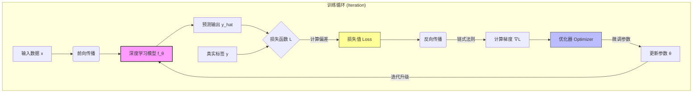
```mermaid
graph TD
    subgraph "训练循环 (Iteration)"
    Data[输入数据 x] --> Forward(前向传播)
    Forward --> Model[深度学习模型 f_θ]
    Model --> Pred[预测输出 y_hat]
    Pred --> LossFunc{损失函数 L}
    Label[真实标签 y] --> LossFunc
    LossFunc -->|计算偏差| LossVal[损失值 Loss]
    LossVal --> Backward(反向传播)
    Backward -->|链式法则| Gradient[计算梯度 ∇L]
    Gradient --> Optimizer[优化器 Optimizer]
    Optimizer -->|微调参数| Update[更新参数 θ]
    Update -->|迭代升级| Model
    end

    style Model fill:#f9f,stroke:#333,stroke-width:2px
    style LossVal fill:#ff9,stroke:#333
    style Optimizer fill:#bbf,stroke:#333
```

<div id="chapter-09-docs-01-1-1-md-s25" class="doc-anchor doc-anchor-section doc-anchor-level-3"></div>

### 7.3 训练中的核心术语

- **Batch Size (批大小)**：每次更新参数前处理的样本数量。
- **Iteration (迭代)**：完成一次参数更新的过程。
- **Epoch (轮次)**：所有的训练数据都被模型“看”过了一次。

---

> [!TIP]
> **拓展链接**：
>
> - [PyTorch 神经网络基础](https://www.runoob.com/pytorch/pytorch-neural-network.html)
> - [神经网络演示推理可视化](https://developers.google.cn/machine-learning/crash-course/neural-networks?hl=zh-cn)

---

<div id="chapter-09-docs-01-1-1-md-s26" class="doc-anchor doc-anchor-section doc-anchor-level-2"></div>

## 🛠️ 进阶实践建议

1.  **手动推导** ：尝试推导 Sigmoid 函数的导数 $\sigma'(x) = \sigma(x)(1 - \sigma(x))$ 。
2.  **代码实现**：使用 Pytorch 实现一个 2 层的多层感知机 (MLP)。


---

<!-- Source: docs/01_深度学习基础/1.2_卷积神经网络CNN.md -->

<div id="chapter-10-docs-01-1-2-cnn-md" class="doc-anchor doc-anchor-chapter doc-anchor-level-1"></div>

# 1.1.2 卷积神经网络 (CNN)

卷积神经网络（Convolutional Neural Networks, CNN）是计算机视觉领域的基石。通过模拟生物视觉系统的局部感知机制，CNN 能够高效地处理具有空间网格结构的数据。相比于传统网络，它在参数效率和特征提取能力上具有显著优势。

---

<div id="chapter-10-docs-01-1-2-cnn-md-s02" class="doc-anchor doc-anchor-section doc-anchor-level-2"></div>

## 1. 卷积神经网络基础

<div id="chapter-10-docs-01-1-2-cnn-md-s03" class="doc-anchor doc-anchor-section doc-anchor-level-3"></div>

### 1.1 从全连接层到卷积

在处理图像等高维数据时，全连接层（Fully Connected Layer）面临着巨大的挑战：

1.  **参数爆炸**：
    假设输入图像尺寸为 $224 \times 224 \times 3$ （约 15 万像素），若隐藏层包含 1024 个神经元，仅这一层就需要超过 1.5 亿个权重参数。这不仅容易导致过拟合，还对硬件显存提出了极高要求。
2.  **空间局部性缺失**：
    全连接层将图像展平为向量，导致相邻像素与远端像素被同等对待，丢失了图像中至关重要的 **局部空间关系**。

为了解决这些问题，卷积层引入了两个核心约束：

- **平移不变性 (Translation Invariance)**：不管检测对象出现在图像中的哪个位置，滤波器（卷积核）的参数是共享的。
- **局部性 (Locality)**：每个神经元只对图像的一个局部区域（感受野）产生响应。

> [!TIP]
> **拓展链接**：
>
> - [D2L - 从全连接层到卷积](https://zh.d2l.ai/chapter_convolutional-neural-networks/why-conv.html)

<div id="chapter-10-docs-01-1-2-cnn-md-s04" class="doc-anchor doc-anchor-section doc-anchor-level-3"></div>

### 1.2 图像卷积与互相关运算

在深度学习框架中，所谓的“卷积层”实际上通常执行的是 **互相关运算（Cross-correlation）**。

> [!TIP]
> **拓展链接**：
>
> - [【数之道 08】走进"卷积神经网络"，了解图像识别背后的原理](https://www.bilibili.com/video/av459868785/?vd_source=68a92621d5b7bea5c3a2420cf85b79c7)

<div id="chapter-10-docs-01-1-2-cnn-md-s05" class="doc-anchor doc-anchor-section doc-anchor-level-4"></div>

#### 1.2.1 计算原理

对于输入矩阵 $X$ 和卷积核 $W$ ，输出 $Y$ 的每一个元素由下式确定：

$$
Y(i, j) = (X * W)(i, j) = \sum_{m} \sum_{n} X(i + m, j + n) W(m, n)
$$

卷积核通过在图像上滑动，能够捕捉到边缘、纹理等底层特征。随着层数加深，卷积核将提取出更复杂的语义特征。

<div align="center">
  
</div>

<div id="chapter-10-docs-01-1-2-cnn-md-s06" class="doc-anchor doc-anchor-section doc-anchor-level-4"></div>

#### 1.2.2 感受野 (Receptive Field)

感受野是指输出特征图中某个元素在输入图像上对应的区域大小。在叠加多层卷积后，深层神经元的感受野会呈指数级增长，使其能够捕获更大范围的上下文信息。

**1. 计算公式**

第 $l$ 层神经元的感受野 $R_{l}$ 可以通过下式递归计算：

$$
R_{l} = R_{l-1} + (k_{l} - 1) \prod_{i=1}^{l-1} s_{i}
$$

其中：

- $R_{l}$ 表示第 $l$ 层的感受野大小（约定输入层 $R_{0} = 1$ ）。
- $k_{l}$ 为第 $l$ 层的卷积核尺寸。
- $s_{i}$ 为第 $i$ 层的步幅 (Stride)。

**2. 堆叠小卷积核的优势**

在 VGG 网络中提出了一个重要观点：使用多个较小的卷积核（如 $3 \times 3$ ）堆叠起来，可以替代一个较大的卷积核（如 $7 \times 7$ ），且具有以下优势：

- **更大的感受野**：两层 $3 \times 3$ 卷积级联后的感受野为 $5 \times 5$ ，三层级联后为 $7 \times 7$ 。
- **减少参数量**：假设通道数为 $C$ ，三层 $3 \times 3$ 卷积的参数量为 $3 \times (3 \times 3 \times C^{2}) = 27 C^{2}$ ，而一层 $7 \times 7$ 卷积的参数量为 $49 C^{2}$ 。
- **更多非线性**：每层卷积后都可以紧跟一个激活函数（如 ReLU），增加了模型的非线性表达能力。

> [!TIP]
> **拓展链接**：
>
> - [深度理解感受野（一）什么是感受野？](https://blog.csdn.net/weixin_40756000/article/details/117264194)
> - [彻底搞懂感受野的含义与计算](https://www.cnblogs.com/shine-lee/p/12069176.html)

<div id="chapter-10-docs-01-1-2-cnn-md-s07" class="doc-anchor doc-anchor-section doc-anchor-level-3"></div>

### 1.3 填充 (Padding) 与步幅 (Stride)

为了精确控制输出特征图的几何尺寸，我们需要调节以下两个超参数：

- **填充 (Padding)**：在输入边缘填充像素（通常为 0）。若填充为 $p$ ，可以防止特征图在经过多次卷积后迅速萎缩。
- **步幅 (Stride)**：卷积核滑动的步长。若步幅 $s > 1$ ，则可以实现下采样，减少计算开销。

**输出尺寸计算公式**：
若输入大小为 $n$ ，卷积核大小为 $k$ ，填充为 $p$ ，步幅为 $s$ ，则输出大小 $o$ 为：

$$
o = \lfloor \frac{n - k + 2p}{s} \rfloor + 1
$$

> [!TIP]
> **拓展链接**：
>
> - [CNN基础知识——卷积（Convolution）、填充（Padding）、步长(Stride)](https://zhuanlan.zhihu.com/p/77471866)

<div id="chapter-10-docs-01-1-2-cnn-md-s08" class="doc-anchor doc-anchor-section doc-anchor-level-3"></div>

### 1.4 多输入与多输出通道

真实的视觉特征通常是多维的。

1.  **多输入通道**：对于 RGB 图像，卷积核也有三个通道。对每个通道分别执行卷积后，将各通道结果 **求和** 得到一个单一的输出通道。
2.  **多输出通道**：如果我们需要提取 $C_{out}$ 种不同的特征，则需要 $C_{out}$ 组独立的卷积核。
3.  **$1 \times 1$ 卷积层**：由 NiN 提出并广泛应用于现代网络。它不改变空间尺寸，仅在通道维度上进行线性组合，常用于 **降维（压缩通道）** 或 **升维（特征聚合）**。

> [!TIP]
> **拓展链接**：
>
> - [一文读懂卷积神经网络中的1x1卷积核](https://zhuanlan.zhihu.com/p/40050371)
> - [【卷积基础】CNN中一些常见卷积（1\*1卷积、膨胀卷积、组卷积、深度可分离卷积）](https://jishuzhan.net/article/1855476110377095169)

<div id="chapter-10-docs-01-1-2-cnn-md-s09" class="doc-anchor doc-anchor-section doc-anchor-level-3"></div>

### 1.5 汇聚层 (Pooling)

汇聚层(**也称池化层**)用于降低网络对空间位置的敏感度，并实现特征降维：

| 汇聚方式         | 英文名称                     | 核心特点与作用                                                             |
| :--------------- | :--------------------------- | :------------------------------------------------------------------------- |
| **最大汇聚**     | Max Pooling                  | 选取窗口内最强信号，增强模型对光照、位移的鲁棒性                           |
| **平均汇聚**     | Average Pooling              | 保留背景平滑特征                                                           |
| **全局平均汇聚** | Global Average Pooling (GAP) | 对整个通道取平均值；是现代分类网络替代全连接层的标准做法，能显著减少过拟合 |

> [!TIP]
> **拓展链接**：
>
> - [【深度学习基础】 池化层 (Pooling Layer)](https://zhuanlan.zhihu.com/p/788705830)
> - [神经网络之卷积篇：详解池化层](https://www.cnblogs.com/oten/p/18395915)

---

<div id="chapter-10-docs-01-1-2-cnn-md-s10" class="doc-anchor doc-anchor-section doc-anchor-level-2"></div>

## 2. 现代卷积神经网络架构演进

<div id="chapter-10-docs-01-1-2-cnn-md-s11" class="doc-anchor doc-anchor-section doc-anchor-level-3"></div>

### 2.1 深度卷积神经网络的开端：AlexNet

AlexNet 在 2012 年 ImageNet 大赛上的成功标志着深度学习时代的开启。

**关键技术贡献**：

- **ReLU 激活函数**：解决了 Sigmoid 在深层网络中的梯度消失问题，加速了收敛。
- **层叠池化 (Overlapping Pooling)**：步幅小于池化窗口大小，增强了平移不变性。
- **Dropout**：在全连接层中随机使神经元失活，极大地增强了模型的泛化能力。

> [!Tip]
> **拓展链接**：
>
> - [AlexNet 原始论文：ImageNet Classification with Deep Convolutional Neural Networks](https://proceedings.neurips.cc/paper/2012/file/c399862d3b9d6b76c8436e924a68c45b-Paper.pdf)
> - [卷积神经网络经典回顾之AlexNet](https://zhuanlan.zhihu.com/p/618545757)

<div id="chapter-10-docs-01-1-2-cnn-md-s12" class="doc-anchor doc-anchor-section doc-anchor-level-3"></div>

### 2.2 训练深层的保障：批量规范化 (Batch Normalization)

随着网络变深，参数的微小变动会在层间累积，导致梯度消失或爆炸。

<div id="chapter-10-docs-01-1-2-cnn-md-s13" class="doc-anchor doc-anchor-section doc-anchor-level-4"></div>

#### 2.2.1 计算逻辑

对于一个小批量数据 $\mathcal{B} = \{ x_{1}, \dots, x_{m} \}$，BN 的操作如下：

1. **计算均值**：
   $$\mu_{\mathcal{B}} = \frac{1}{m} \sum_{i=1}^{m} x_{i}$$

2. **计算方差**：
   $$\sigma_{\mathcal{B}}^{2} = \frac{1}{m} \sum_{i=1}^{m} (x_{i} - \mu_{\mathcal{B}})^{2}$$

3. **规范化**：
   $$\hat{x}\_{i} = \frac{x\_{i} - \mu\_{\mathcal{B}}}{\sqrt{\sigma\_{\mathcal{B}}^{2} + \epsilon}}$$

4. **缩放与平移**：
   $$y_{i} = \gamma \hat{x}_{i} + \beta$$

其中 $\gamma$ 和 $\beta$ 是可学习的参数。

<div id="chapter-10-docs-01-1-2-cnn-md-s14" class="doc-anchor doc-anchor-section doc-anchor-level-4"></div>

#### 2.2.2 核心作用

- **允许更高的学习率**：使训练更稳定。
- **减少对初始化的依赖**：即使初始化不佳，模型也能收敛。
- **轻微的正规化效果**：减少了对 Dropout 的需求。

> [!Tip]
> **拓展链接**：
>
> - [通俗理解 Batch Normalization（含代码）](https://zhuanlan.zhihu.com/p/609131550)
> - [Batch Normalization（BN）超详细解析](https://blog.csdn.net/weixin_44023658/article/details/105844861)

<div id="chapter-10-docs-01-1-2-cnn-md-s15" class="doc-anchor doc-anchor-section doc-anchor-level-3"></div>

### 2.3 视觉任务的骨干：残差网络 (ResNet)

深层网络往往面临“退化问题”（训练误差反而比浅层更高）。ResNet 通过引入 **残差连接 (Residual Connection)** 彻底打破了这一瓶颈。

<div id="chapter-10-docs-01-1-2-cnn-md-s16" class="doc-anchor doc-anchor-section doc-anchor-level-4"></div>

#### 2.3.1 残差块 (Residual Block)

不同于让网络学习复杂的映射 $H(x)$ ，ResNet 让层学习输入与输出之间的残差 $F(x) = H(x) - x$ 。最终输出为 $y = F(x) + x$ 。

如果某一层是多余的，网络可以轻易地将权重置零，使得 $F(x) = 0$ ，此时该层仅执行恒等映射（Identity Mapping），保证了深层网络至少不会比浅层网络更差。

<div align="center">
  
</div>

<div id="chapter-10-docs-01-1-2-cnn-md-s17" class="doc-anchor doc-anchor-section doc-anchor-level-4"></div>

#### 2.3.2 瓶颈结构 (Bottleneck)

在 ResNet-50 及更深的网络中，为了平衡计算量，引入了 $1 \times 1$ 卷积。通过先降维再升维，大幅减少了 $3 \times 3$ 卷积的计算压力。

> [!TIP]
> **拓展链接**：
>
> - [ResNet 原始论文：Deep Residual Learning for Image Recognition](https://arxiv.org/abs/1512.03385)
> - [何恺明ResNet（残差网络）——彻底改变深度神经网络的训练方式](https://zhuanlan.zhihu.com/p/1889079285102380738)
> - [ResNet——CNN经典网络模型详解(pytorch实现)](https://blog.csdn.net/weixin_44023658/article/details/105843701)

---

卷积神经网络通过 **局部感知** 和 **权值共享** 解决了图像处理的效率问题。从经典的 **LeNet** 到现代视觉任务的 Backbone —— **ResNet** ，CNN 的演进始终围绕着如何让网络“更深”且“更易训练”展开。

<div id="chapter-10-docs-01-1-2-cnn-md-s18" class="doc-anchor doc-anchor-section doc-anchor-level-2"></div>

## 📚 推荐阅读

- [动手学深度学习-6.卷积神经网络](https://zh.d2l.ai/chapter_convolutional-neural-networks/index.html)
- [动手学深度学习-7.现代卷积神经网络](https://zh.d2l.ai/chapter_convolutional-modern/index.html)
- [【综述】一文读懂卷积神经网络(CNN)](https://zhuanlan.zhihu.com/p/561991816)
- [【深度学习】一文搞懂卷积神经网络（CNN）的原理（超详细）](https://blog.csdn.net/AI_dataloads/article/details/133250229)


---

<!-- Source: docs/01_深度学习基础/1.3_Transformer机制.md -->

<div id="chapter-11-docs-01-1-3-transformer-md" class="doc-anchor doc-anchor-chapter doc-anchor-level-1"></div>

# 1.3 Transformer 机制

Transformer 架构自 2017 年问世以来，彻底改变了人工智能的格局。
相比于传统的 CNN（关注局部像素）和 RNN（按顺序记忆），Transformer 的核心优势在于：**它能一眼看到全局，并精准锁定最重要的信息。**

---

<div id="chapter-11-docs-01-1-3-transformer-md-s02" class="doc-anchor doc-anchor-section doc-anchor-level-2"></div>

## 1. 核心思想：

在海量信息中，我们的大脑是如何工作的？

- **CNN 像是一个放大镜**：它在一个固定的窗口内巡视，擅长捕捉局部细节（如轮廓、边缘），但很难一眼看清整幅画。
- **RNN 像是一个录音机**：它必须按顺序收听，听到后面可能会忘掉前面，且无法并行处理。
- **Transformer 像是一个手电筒**：在黑暗的屋子里，它根据你的“意图”，直接把光打在最关键的物体上。

这种“聚焦关键”的能力，就是 **注意力机制 (Attention Mechanism)**。

---

<div id="chapter-11-docs-01-1-3-transformer-md-s03" class="doc-anchor doc-anchor-section doc-anchor-level-2"></div>

## 2. 检索逻辑：查询、键、值 (Q, K, V)

Transformer 将信息的提取抽象为一套类似“数据库检索”的过程。为了理解 Q 、K 、V ，我们可以想象你在图书馆找书：

- **查询 (Query, $Q$)**：你脑子里的搜索词（例如：“关于自动驾驶的书”）。
- **键 (Key, $K$)**：每本书书脊上的标签/标题（描述这本书是什么）。
- **值 (Value, $V$)**：书里的具体知识内容（数据的实际价值）。

**过程如下**：

1. 你拿着搜索词（ $Q$ ）去和书架上所有的标签（ $K$ ）对比。
2. 匹配度越高（相关性大），你对该书内容的关注度（权重）就越高。
3. 最后，你根据权重合并这些书里的知识（ $V$ ），得到你想要的答案。

> [!Tip]
> **拓展链接**
>
> - **[attention机制中的query,key,value的几类概念解释方法](https://zhuanlan.zhihu.com/p/148737297)**
> - **[理解 Transformer 注意力机制中的 Query、Key 和 Value](https://blog.eimoon.com/p/transformer-attention-query-key-value/)**

---

<div id="chapter-11-docs-01-1-3-transformer-md-s04" class="doc-anchor doc-anchor-section doc-anchor-level-2"></div>

## 3. 数学实现：缩放点积注意力

如何用数学表达上述过程？Transformer 使用了 **缩放点积注意力 (Scaled Dot-Product Attention)**。

$$
\text{Attention}(Q, K, V) = \text{softmax} \left( \frac{QK^{T}}{\sqrt{d_{k}}} \right) V
$$

我们可以分步拆解这个公式的精妙之处：

<div align="center">
  
</div>

1.  **相似度计算 ($QK^{T}$)**：
    通过两个向量的点积来衡量 $Q$ 和 $K$ 的相似程度。点积越大，说明两者越相关。
2.  **缩放因子 ($\frac{1}{\sqrt{d_{k}}}$)**：
    **为什么要除以 $\sqrt{d_{k}}$？** 当维度 $d_{k}$ 很大时，相似度计算的结果会变得非常大。这会导致经过 $\text{softmax}$ 后，权重会集中在极少数点上（非 0 即 1），导致梯度消失，模型无法训练。缩放能让数值回归温和区间，让训练更稳定。
3.  **权重分配 ($\text{softmax}$)**：
    将相似度转化为概率分布（权重之和为 1）。
4.  **加权求和 ($\cdot V$)**：
    根据权重，把各个位置的信息（V）融合在一起。

<div align="center">
  
</div>

> [!Tip]
> **拓展链接**
>
> - **[3.1.1 缩放点积注意力](https://transformers.run/c1/attention/#311-%E7%BC%A9%E6%94%BE%E7%82%B9%E7%A7%AF%E6%B3%A8%E6%84%8F%E5%8A%9B)**
> - **[缩放点积注意力与多头注意力](https://zhuanlan.zhihu.com/p/1974161630146352915)**

---

<div id="chapter-11-docs-01-1-3-transformer-md-s05" class="doc-anchor doc-anchor-section doc-anchor-level-2"></div>

## 4. 多头注意力 (Multi-Head Attention)：多维度的观察

如果只有“一个头”，模型可能只关注到了颜色，而忽略了形状。**多头注意力** 允许模型并行地从多个维度观察数据。

- **形象理解**：在自动驾驶中，一个“头”可能专门盯着路面线，另一个“头”盯着远处的行人，第三个“头”关注交通灯。
- **数学操作**：将 $Q, K, V$ 投影到多个不同的子空间，分别计算注意力，最后把结果拼起来。

<div align="center">
  
</div>

<div align="center">
  
</div>

$$
\text{MultiHead}(Q, K, V) = \text{Concat}(\text{head}_{1}, \dots, \text{head}_{h})W^{O}
$$

$$
\text{head}_{i} = \text{Attention}(QW_{i}^{Q}, KW_{i}^{K}, VW_{i}^{V})
$$

> [!Tip]
> **拓展链接**
>
> - **[3.1.2 多头注意力](https://transformers.run/c1/attention/#312-%E5%A4%9A%E5%A4%B4%E6%B3%A8%E6%84%8F%E5%8A%9B)**
> - **[探秘Transformer系列之（12）--- 多头自注意力
>   ](https://www.cnblogs.com/rossiXYZ/p/18759167)**

---

<div id="chapter-11-docs-01-1-3-transformer-md-s06" class="doc-anchor doc-anchor-section doc-anchor-level-2"></div>

## 5. 位置编码 (Positional Encoding)：打破“乱序”

自注意力机制有一个天生的“缺陷”：它是 **置换不变的**。
简单来说，如果你把输入序列的顺序打乱，自注意力的输出结果（除了顺序）是一模一样的。这就像读句子“我吃火锅”和“火锅吃我”，如果没有位置信息，模型会认为它们是一回事。

为了解决这个问题，Transformer 引入了 **位置编码 (PE)**，将绝对位置信息“嵌入”到特征向量中。

$$
PE_{(pos, 2i)} = \sin \left( \frac{pos}{10000^{2i/d_{model}}} \right)
$$

$$
PE_{(pos, 2i+1)} = \cos \left( \frac{pos}{10000^{2i/d_{model}}} \right)
$$

通过正余弦函数的周期性，模型不仅能知道每个元素的绝对位置，还能学到元素之间的相对距离关系。

> [!Tip]
> **拓展链接**
>
> - **[Transformer学习笔记一：Positional Encoding（位置编码）](https://zhuanlan.zhihu.com/p/454482273)**
> - **[Transformer中的位置编码：绝对位置编码、相对位置编码与旋转位置编码](https://blog.csdn.net/python123456_/article/details/141352984)**
> - **[位置编码详解：Transformer为什么必须知道Token顺序，正弦编码原理
>   ](https://notes.kamacoder.com/llm/transformer/pos_encode.html#%E5%85%88%E5%81%9A%E4%B8%80%E4%B8%AA%E5%AE%9E%E9%AA%8C)**

---

<div id="chapter-11-docs-01-1-3-transformer-md-s07" class="doc-anchor doc-anchor-section doc-anchor-level-2"></div>

## 6. Transformer整体架构

一个完整的 Transformer 通常由 **编码器 (Encoder)** 和 **解码器 (Decoder)** 组成，其内部包含了确保深层网络能训练成功的“三大护法”：

| 组件                      | 作用                     | 形象比喻                                               |
| :------------------------ | :----------------------- | :----------------------------------------------------- |
| **残差连接 (Residual)**   | $x + \text{Sublayer}(x)$ | 防止信息在传递中丢失，给深层网络留一条“保底”的直通车道 |
| **层归一化 (Layer Norm)** | 稳定每一层的激活值分布   | 让每个神经元的输出都在合理的范围内，不至于“用力过猛”   |
| **前馈网络 (FFN)**        | 独立的非线性变换         | 给每个位置提供额外的特征加工能力，增加模型的深度       |

<div align="center">
  
</div>

> [!Tip]
>
> - **[Attention Is All You Need](https://arxiv.org/abs/1706.03762)** (Vaswani et al., 2017)：一切的开端。
> - **[【通俗易懂】大白话讲解 Transformer](https://zhuanlan.zhihu.com/p/264468193)**
> - **[什么是Transformer？Transformer综述(说人话版)，看这一篇就够了！](https://blog.csdn.net/EnjoyEDU/article/details/148865655)**
> - **[Transformer如何让自动驾驶大模型获得思考能力？](https://www.eet-china.com/mp/a471882.html)**

<div id="chapter-11-docs-01-1-3-transformer-md-s08" class="doc-anchor doc-anchor-section doc-anchor-level-2"></div>

## 7. 视觉 Transformer (ViT)

那么如何将Transformer引入到**计算机视觉领域**呢？
Vision Transformer (ViT) 的核心贡献在于证明了：**不需要卷积（CNN），纯 Transformer 架构也能横扫计算机视觉领域。**

<div id="chapter-11-docs-01-1-3-transformer-md-s09" class="doc-anchor doc-anchor-section doc-anchor-level-3"></div>

### 7.1 核心思想：把图像当成“拼图”

CNN 像是在图像上滑动小窗口，而 ViT 则直接把图像看作一盒 **“拼图” (Jigsaw Puzzle)**：

1.  **切分与展平 (Patch Embedding)**：
    将一张图片切成一个个固定大小的方块（Patch，如 $16 \times 16$ 像素）。每个方块就像一个“单词”，将其展平并转换成向量。
2.  **添加“领头兵” ([CLS] Token)**：
    在这一堆拼图块的前面，特意加一个特殊的向量。这个向量不代表任何图像块，它的任务是“博采众长”，在经过多层注意力计算后，收集成整幅图的全局特征。
3.  **贴上编号 (Positional Encoding)**：
    因为 Transformer 无法识别空间位置，我们必须给每块拼图贴上标签（如“这是第 1 行第 1 列”），否则模型会认为这些碎块是乱序的。

<div align="center">
  
</div>

<div id="chapter-11-docs-01-1-3-transformer-md-s10" class="doc-anchor doc-anchor-section doc-anchor-level-3"></div>

### 7.2 运算流程

$$
\mathbf{z}_{0} = [ \mathbf{x}_{class}; \mathbf{x}_{p}^{1} \mathbf{E}; \mathbf{x}_{p}^{2} \mathbf{E}; \dots; \mathbf{x}_{p}^{N} \mathbf{E} ] + \mathbf{E}_{pos}
$$

- **$\mathbf{x}_{p}$**：代表图像的每个 Patch（碎块）。
- **$\mathbf{E}$**：线性投影矩阵，将碎块转换为模型能理解的维度。
- **$\mathbf{E}_{pos}$**：位置编码，赋予模型“空间感”。

<div id="chapter-11-docs-01-1-3-transformer-md-s11" class="doc-anchor doc-anchor-section doc-anchor-level-3"></div>

### 7.3 ViT vs CNN：

- **CNN 更有“先验知识”**：它天生认为相邻像素更相关（局部性）。这让 CNN 在小数据集上表现极好。
- **ViT 更加“自由”**：它不带任何偏见，直接学习全局关系。
  - **缺点**：在小规模数据集上容易学偏（因为它太“博爱”了，不知道该重点看哪）。
  - **优点**：当数据量极大（如百万、千万级）时，ViT 的上限远高于 CNN，因为它能捕捉到更复杂、更宏观的语义特征。

在自动驾驶中，ViT 的这种“全局视野”对于理解复杂的交通场景（如同时关注远处的红绿灯和近处的行人）至关重要。

> [!Tip]
>
> - **[An Image is Worth 16x16 Words (ViT)](https://arxiv.org/abs/2010.11929)** (Dosovitskiy et al., 2020)：将 Transformer 引入视觉领域的里程碑。
> - **[【深度学习】详解 Vision Transformer (ViT)](https://blog.csdn.net/qq_39478403/article/details/118704747)**
> - **[ViT（Vision Transformer）解析](https://zhuanlan.zhihu.com/p/445122996)**
> - **[手把手教你实现PyTorch版ViT：图像分类任务中的Transformer实战 ](https://www.cnblogs.com/SkyXZ/p/18927874)**

---

<div id="chapter-11-docs-01-1-3-transformer-md-s12" class="doc-anchor doc-anchor-section doc-anchor-level-2"></div>

## 总结：为什么 Transformer 适合自动驾驶？

1.  **全局视野**：自动驾驶需要同时考虑环视相机、雷达等多传感器的全局信息，Transformer 擅长建模长距离依赖。
2.  **并行性强**：相比 RNN 的串行计算，Transformer 可以大规模并行，大幅提升感知系统的实时性。
3.  **异构融合**：它能统一处理不同类型的数据（如图像像素、雷达点云、文本指令），实现真正的多模态融合。

---

<div id="chapter-11-docs-01-1-3-transformer-md-s13" class="doc-anchor doc-anchor-section doc-anchor-level-2"></div>

## 📚 推荐阅读

- **[动手学深度学习-10.注意力机制](https://zh.d2l.ai/chapter_attention-mechanisms/index.html)**
- **[注意力机制：从理论到实现(全网最细最完整教程）](https://zhuanlan.zhihu.com/p/1983692420441978327)**


---

<!-- Source: docs/02_自动驾驶环境感知算法/2.1.1_2D目标检测.md -->

<div id="chapter-12-docs-02-2-1-1-2d-md" class="doc-anchor doc-anchor-chapter doc-anchor-level-1"></div>

# 2.1.1 2D 目标检测

2D 目标检测是自动驾驶视觉感知链路里最基础、也最常用的任务之一。它回答两个直接问题：

- 图像里出现了什么目标。
- 这些目标大致位于图像的什么位置。

**它通常输出一组二维边界框 `bbox = (x, y, w, h)`、类别 `class` 和置信度 `score`。这些结果会继续送往多目标跟踪、3D 检测、行为预测、风险评估等下游模块，因此 2D 检测虽然“不直接给出完整三维世界”，却是整条自动驾驶感知链路的重要前置。**

> [!TIP]
> **可以把 2D 检测理解为“先把画面中的关键参与者圈出来”。它不直接告诉你目标距离多远、速度多快，但它决定了系统有没有先看见这个目标。**

---

<div id="chapter-12-docs-02-2-1-1-2d-md-s02" class="doc-anchor doc-anchor-section doc-anchor-level-2"></div>

## 1. 2D 检测在自动驾驶中的职责

在自动驾驶里，2D 检测最常负责以下几类目标：

- 动态交通参与者：车辆、行人、骑行者、摩托车。
- 交通设施：交通灯、交通标志、锥桶、施工牌。
- 特殊障碍物：抛洒物、路障、异常停靠车辆。

它的典型价值包括：

- 为跟踪提供初始检测框。
- 为 3D 感知提供图像先验或 RoI。
- 为预测模块提供目标类别和可见性信息。
- 为安全策略提供“是否存在潜在风险目标”的早期信号。

但它也有天然边界：

- 只在图像平面定位，不直接提供真实深度。
- 对遮挡、远距离小目标、夜晚反光等情况敏感。
- 单帧结果不包含稳定的时序身份，需要跟踪模块补充。

---

<div id="chapter-12-docs-02-2-1-1-2d-md-s03" class="doc-anchor doc-anchor-section doc-anchor-level-2"></div>

## 2. 基础概念与检测器工作流

<div id="chapter-12-docs-02-2-1-1-2d-md-s04" class="doc-anchor doc-anchor-section doc-anchor-level-3"></div>

### 2.1 一个检测器到底在做什么

一个完整的 2D 检测器，通常同时在做 4 件事：

1. **特征提取**：从原图中提取语义特征。
2. **候选目标建模**：决定“在哪些位置上尝试检测目标”。
3. **分类与回归**：判断类别，并预测边界框位置。
4. **后处理(可选)**：过滤重复框和低置信度框，输出最终结果。

下面这条流程几乎覆盖了大多数检测器：


```mermaid
graph LR
    A[输入图像] --> B[Backbone 提取特征]
    B --> C[Neck 多尺度特征融合]
    C --> D[Detection Head 分类与回归]
    D --> E[候选框/查询结果]
    E --> F[后处理: NMS 或 集合预测]
    F --> G[最终检测框]
```

检测比图像分类更难，因为它不是只回答“图中有没有车”，而是要回答“图中哪一块区域是车，并且一共有几辆车”。因此，它天然要同时处理三件事：

- **分类（Classification）**：判断这个目标属于哪一类，如 `car`、`pedestrian`、`cyclist`。
- **定位（Localization）**：预测目标边界框的位置和尺寸。
- **置信度（Confidence）**：表示模型对当前预测的确信程度，通常综合了“前景概率”和“类别概率”。

<div id="chapter-12-docs-02-2-1-1-2d-md-s05" class="doc-anchor doc-anchor-section doc-anchor-level-3"></div>

### 2.2 IoU、NMS 与检测后处理

交并比（Intersection over Union, IoU）是检测里最常见的定位评价指标：

$$
\text{IoU} = \frac{\text{Area}(B_p \cap B_{gt})}{\text{Area}(B_p \cup B_{gt})}
$$

其中：

- $B_p$ 是预测框。
- $B_{gt}$ 是真实框。

IoU 越高，说明预测框和真实框越重合。训练时常用 IoU 来分配正负样本，评估时则用它来判断一个检测框是否算命中目标。

同一个物体周围通常会产生很多相似预测框，因此需要后处理去重。

- **NMS（Non-Maximum Suppression）**：
  保留置信度最高的框，删除与其 IoU 过高的其他框。
- **Soft-NMS**：
  不直接删除重叠框，而是随着 IoU 增大逐步衰减其分数。

<div align="center">
  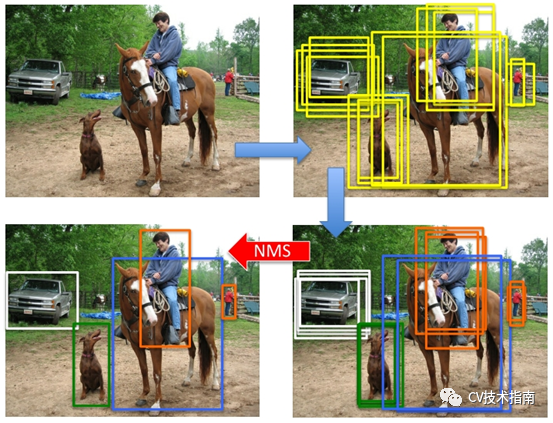
</div>

`NMS` 的优点是简单高效，但在遮挡、密集目标场景中容易误删邻近目标；`Soft-NMS` 对密集检测通常更友好。

> [!TIP]
> **拓展阅读**：
> - [NMS / Soft-NMS / DIoU-NMS：目标检测后处理技术演进）](https://blog.csdn.net/KANG157/article/details/124649838)
> - [NMS技术总结（NMS原理、多类别NMS、NMS的缺陷、NMS的改进思路、各种NMS方法）](https://cloud.tencent.com/developer/article/2611653)

<div id="chapter-12-docs-02-2-1-1-2d-md-s06" class="doc-anchor doc-anchor-section doc-anchor-level-3"></div>

### 2.3 候选建模、特征尺度与正负样本问题

**1）目标检测的发展，很大程度上就是“候选目标如何建模”的发展。**

- **Anchor-based**：
  在特征图每个位置预设不同尺度和长宽比的参考框，模型学习相对这些参考框的偏移量。
- **Anchor-free**：
  不再显式设计锚框，而是直接预测中心点、四边距离、关键点或角点。
- **Query-based**：
  在 DETR 一类模型中，候选目标不再来自密集网格上的锚框，而是来自一组可学习的查询向量 `object queries`。

从工程角度看：

- Anchor-based 往往成熟稳定，但超参数较多。
- Anchor-free 结构更简洁，减少了锚框设计负担。
- Query-based 更端到端，但训练与收敛机制更特殊。

> [!TIP]
> **拓展阅读**：
> - [小白都能懂的目标检测（3）：anchor based/free和one/two stage的分类](https://zhuanlan.zhihu.com/p/619279431)
> - [检测专题十一：Anchor-based与Anchor-free检测方法的优劣势](https://www.bilibili.com/video/BV1uq4y1W738/?vd_source=68a92621d5b7bea5c3a2420cf85b79c7)

**2）自动驾驶里远处行人、交通灯、骑行者常常只占几个像素。单一尺度特征图很难同时兼顾大目标和小目标，因此现代检测器通常使用多尺度特征。**

- **FPN（Feature Pyramid Network）**：
  融合高分辨率的浅层特征和高语义的深层特征。
- **多尺度检测头**：
  在不同分辨率特征图上同时做预测，浅层负责小目标，深层负责大目标。

<div align="center">
  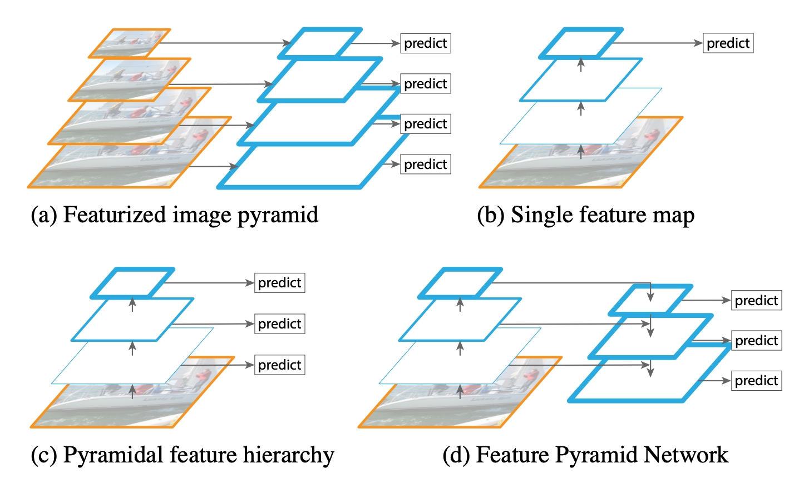
</div>

如果没有多尺度设计，远距离小目标往往在下采样后几乎“消失”。

> [!TIP]
> **拓展阅读**：
> - [重读FPN（Feature Pyramid Network）](https://zhuanlan.zhihu.com/p/460738972)
> - [深度学习之 FPN (Feature Pyramid Networks)](https://blog.csdn.net/fenglepeng/article/details/118543497)
> - [[重读经典论文] FPN及PAN笔记](https://www.cnblogs.com/harrymore/p/17452884.html)

**3）密集检测器在训练时还会遇到严重的前景/背景不均衡问题：绝大多数位置都是背景，真正包含目标的正样本很少。**

- **正负样本分配**：决定哪些候选位置算正样本、哪些算负样本。
- **Focal Loss**：通过降低“容易分类的负样本”的损失权重，让模型更关注难样本和少数正样本。

这也是为什么 `RetinaNet` 被认为是单阶段检测的重要里程碑之一：它比较系统地解决了密集检测器的类别不平衡问题。

> [!TIP]
> 对自动驾驶来说，类别不平衡不只是“背景太多”，还包括长尾类别稀缺，例如施工标识、拖挂车、特殊障碍物往往远少于普通轿车。

---

<div id="chapter-12-docs-02-2-1-1-2d-md-s07" class="doc-anchor doc-anchor-section doc-anchor-level-2"></div>

## 3. 方法演进：目标检测为什么一路这样发展

目标检测的发展，不只是模型越来越大，而是围绕几个核心矛盾不断演化：

- 如何减少滑窗式穷举带来的巨大计算量。
- 如何让检测从“先提候选框”逐渐走向更端到端。
- 如何在精度、速度、小目标能力之间取得平衡。
- 如何减少人工设计的锚框、匹配规则和后处理组件。

早期目标检测依赖：

- 滑动窗口（Sliding Window）
- 手工特征（HOG、SIFT）
- 传统分类器（SVM、Boosting）

这类方法的主要问题是：

- 计算量极大。
- 特征表达能力有限。
- 对尺度变化、遮挡和复杂背景适应性差。

深度学习进入目标检测后，关键变化是：**把“特征提取”和“分类定位”都交给神经网络联合学习。**

---

<div id="chapter-12-docs-02-2-1-1-2d-md-s08" class="doc-anchor doc-anchor-section doc-anchor-level-2"></div>

## 4. 两阶段检测：先提候选，再分类精修

两阶段检测器（Two-Stage Detector）先提出候选区域，再对候选区域分类和回归，因此通常更强调精度与定位质量。

<div id="chapter-12-docs-02-2-1-1-2d-md-s09" class="doc-anchor doc-anchor-section doc-anchor-level-3"></div>

### 4.1 核心思想与典型优势

第一阶段负责回答：

- 哪些区域“看起来像”目标？

第二阶段负责回答：

- 这些区域具体是什么类别？
- 边界框还能不能再调准一些？

这种分治思路让两阶段方法在小目标、密集目标和高精度定位任务中长期保持竞争力。

相比单阶段检测，两阶段框架虽然推理速度较慢，但在定位精度和对小目标的检测能力上通常更具优势。

<div id="chapter-12-docs-02-2-1-1-2d-md-s10" class="doc-anchor doc-anchor-section doc-anchor-level-3"></div>

### 4.2 从 R-CNN 到 Faster R-CNN

> [!TIP]
> 通俗梳理可以结合阅读：
> [两阶段目标检测 - R-CNN，SPP-net，Fast R-CNN，Faster R-CNN](https://zhuanlan.zhihu.com/p/696976220)

R-CNN 是深度学习检测的起点，首次把 CNN 特征大规模用于目标检测。

- 先用 `Selective Search` 生成约 2000 个候选框。
- 对每个候选框单独裁剪、缩放并送入 CNN。
- 再用 SVM 分类，用回归器微调边界框。

<div align="center">
  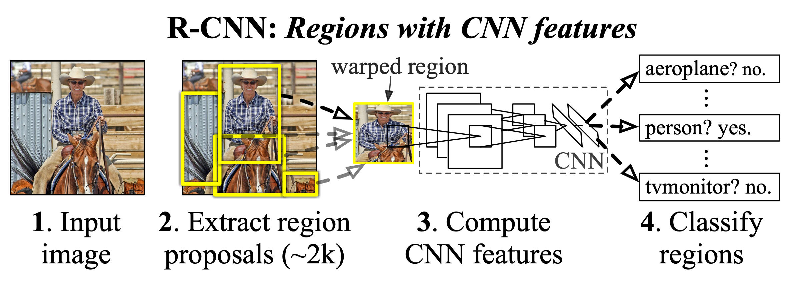
</div>

问题在于：

- 每个候选框都要单独跑一次 CNN，计算极度冗余。
- 训练流程分裂，不能端到端。

> [!TIP]
> **论文链接**：[R-CNN: Rich feature hierarchies for accurate object detection and semantic segmentation](https://arxiv.org/abs/1311.2524)


SPP-net 的核心贡献是：**整张图只做一次卷积，候选框共享特征图。**

<div align="center">
  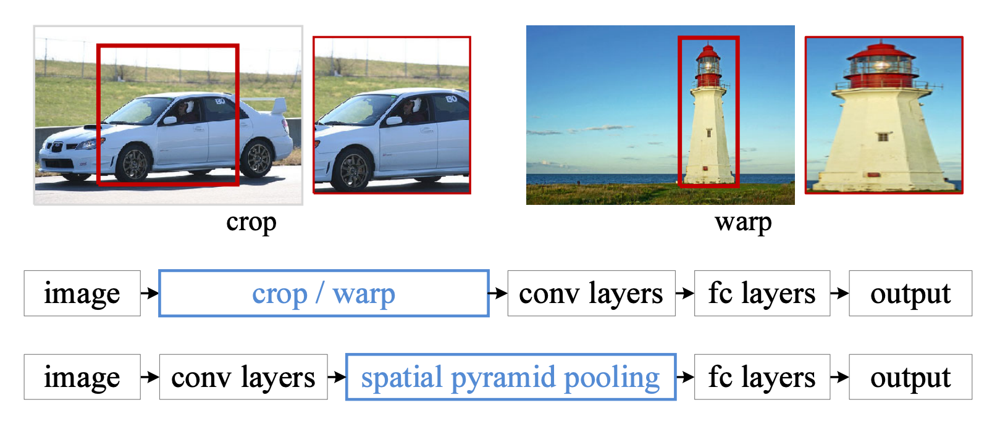
</div>

- 引入 `Spatial Pyramid Pooling`，把任意尺寸 RoI 转成固定长度特征。
- 显著降低了重复卷积计算。

但它仍未彻底解决训练流程割裂的问题。

> [!TIP]
> **论文链接**：[SPP-net: Spatial Pyramid Pooling in Deep Convolutional Networks for Visual Recognition](https://arxiv.org/abs/1406.4729)


Fast R-CNN 继续沿着“共享特征图”的方向优化：

- 使用 `RoI Pooling` 从共享特征图中抽取固定尺寸区域特征。
- 把分类和边框回归整合进一个多任务损失中联合训练。
- 
<div align="center">
  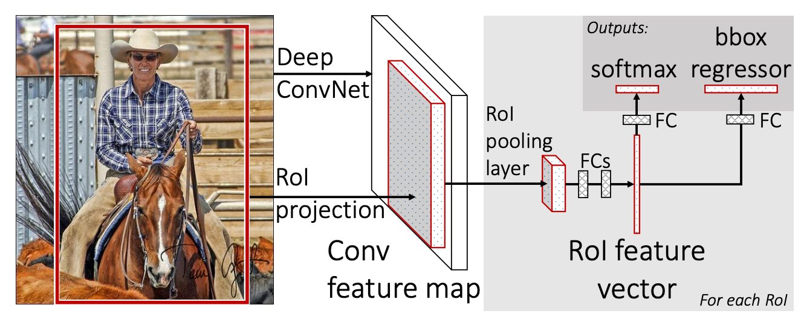
</div>

它大幅提升了训练和推理效率，但候选框仍来自外部算法。

> [!TIP]
> **论文链接**：[Fast R-CNN](https://arxiv.org/abs/1504.08083)


Faster R-CNN 的关键突破是引入 `RPN (Region Proposal Network)`：

- 候选框不再由传统算法生成，而由神经网络直接预测。
- RPN 和检测头共享卷积特征，速度大幅提升。
- 引入 `Anchor` 机制，用不同尺度和长宽比的参考框覆盖多种目标形态。

这意味着两阶段检测第一次真正变成“深度学习主导的统一框架”。
<div align="center">
  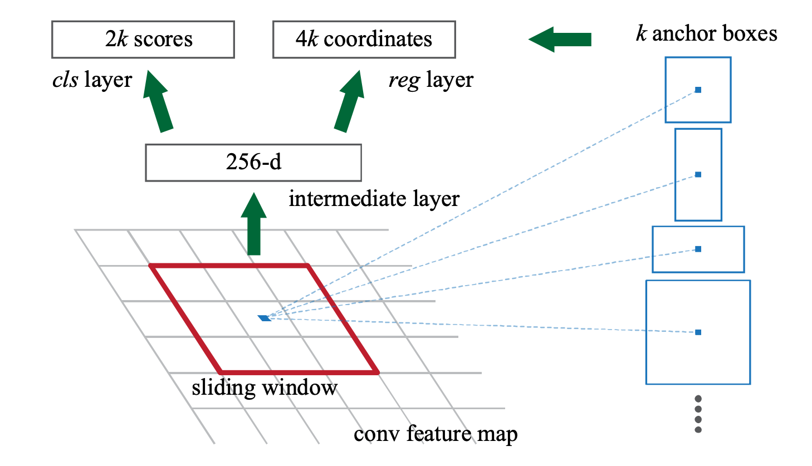
</div>

它的多任务损失函数写作：

$$
L = \frac{1}{N_{cls}}\sum_i L_{cls}(p_i, p_i^{\ast}) + \lambda \frac{1}{N_{reg}}\sum_i p_i^{\ast} L_{reg}(t_i, t_i^{\ast})
$$

其中：

- `p_i` 表示第 `i` 个锚框包含物体的预测概率。
- `t_i` 表示预测的坐标向量。
- `p_i^*` 表示真实标签（Ground Truth）。

> [!TIP]
> **论文链接**：[Faster R-CNN: Towards Real-Time Object Detection with Region Proposal Networks](https://arxiv.org/abs/1506.01497)


<div id="chapter-12-docs-02-2-1-1-2d-md-s11" class="doc-anchor doc-anchor-section doc-anchor-level-3"></div>

### 4.3 两阶段检测的优缺点

**优点**

- 定位质量通常更高。
- 小目标和密集目标表现较稳。
- 误检控制往往更好。

**缺点**

- 推理链路更长。
- 部署与优化复杂度更高。
- 端侧实时性通常不如轻量级单阶段模型。

> [!TIP]
> 两阶段检测之所以长期强势，本质上是因为它先把“哪里可能有目标”缩小成少量高质量候选区域，再在这些区域上做更细致的分类和回归。

---

<div id="chapter-12-docs-02-2-1-1-2d-md-s12" class="doc-anchor doc-anchor-section doc-anchor-level-2"></div>

## 5. 单阶段检测：把检测直接做成密集预测

单阶段检测器（One-Stage Detector）省去了显式的候选框提议阶段，直接在特征图上做分类与回归，因此更适合追求实时性的场景。

<div id="chapter-12-docs-02-2-1-1-2d-md-s13" class="doc-anchor doc-anchor-section doc-anchor-level-3"></div>

### 5.1 为什么单阶段方法更快，也更难训练

单阶段检测的主要难点不是“思想不对”，而是训练更难：

- 背景位置太多，正负样本极不平衡。
- 大量低质量候选框会淹没有效梯度。
- 小目标很容易在密集预测中被背景吞没。

也正因为如此，单阶段检测的演化核心一直围绕两件事：

- 如何更好地处理多尺度目标。
- 如何更好地处理正负样本不平衡。

在深入具体算法前，也要先抓住两个基石：

- **锚点（Anchor Boxes）**：
  在单阶段检测器中，模型无法像两阶段那样先找候选区域。因此，研究者在特征图的每个像素点上预设了一组具有不同尺度（Scales）和长宽比（Aspect Ratios）的参考框。模型的目标是学习如何将这些预设的 Anchor 偏移（Offset）并缩放到真实物体位置。
- **非极大值抑制（NMS, Non-Maximum Suppression）**：
  由于模型会在物体周围产生大量重叠的预测框，NMS 的作用是通过保留置信度最高（Confidence Score）的框，并剔除与其重叠度（IoU）过高的其他框，从而实现“一物一框”。

<div id="chapter-12-docs-02-2-1-1-2d-md-s14" class="doc-anchor doc-anchor-section doc-anchor-level-3"></div>

### 5.2 SSD、RetinaNet 与多尺度密集检测

SSD（Single Shot MultiBox Detector）是单阶段检测的重要奠基工作。

- 在多个尺度特征图上同时做检测。
- 浅层负责小目标，深层负责大目标。
- 仍然采用 Anchor 机制进行样本匹配。

<div align="center">
  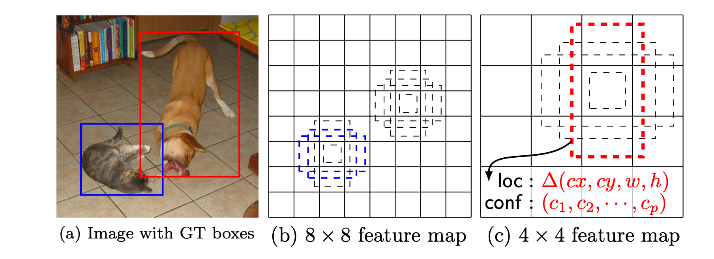
</div>

它证明了：**单阶段检测也能兼顾速度和精度，只是需要更合理的多尺度设计。**

> [!TIP]
> **论文链接**：[SSD: Single Shot MultiBox Detector](https://arxiv.org/abs/1512.02325)


RetinaNet 的意义不只是提出了一个模型，更重要的是它解释了：

**为什么早期单阶段检测器往往不如两阶段。**

答案是：密集检测器面对极多简单负样本，训练目标被背景主导。`Focal Loss` 通过降低容易分类样本的权重，把学习重点重新拉回困难样本和稀缺正样本。

这让单阶段方法第一次在精度上能与两阶段检测正面对抗。

<div align="center">
  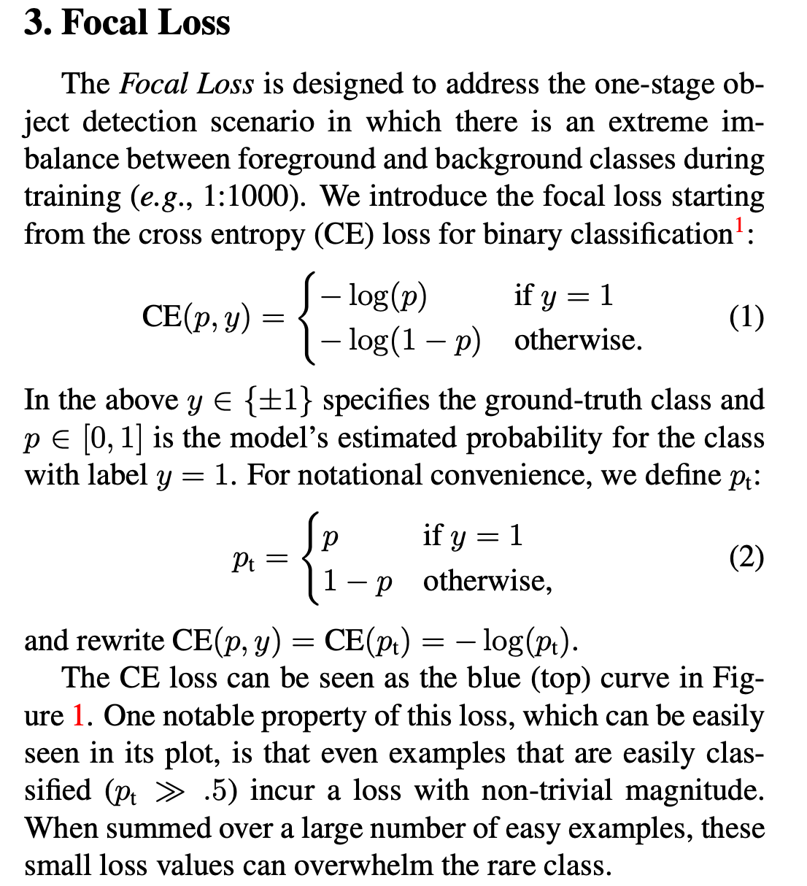
</div>

> [!TIP]
> **论文链接**：[Focal Loss for Dense Object Detection](https://arxiv.org/abs/1708.02002)


<div id="chapter-12-docs-02-2-1-1-2d-md-s15" class="doc-anchor doc-anchor-section doc-anchor-level-3"></div>

### 5.3 FCOS、CenterNet 与 Anchor-free 思路

Anchor 机制虽然有效，但会带来不少工程负担：

- Anchor 尺寸、比例需要人工设计。
- 匹配规则比较敏感。
- 候选框数量大，训练和推理都会更重。

因此，后续很多工作开始转向 Anchor-free。

FCOS 将检测建模为逐像素预测：

- 每个位置直接预测到边界框四条边的距离。
- 不再依赖预设锚框。
- 结构简洁，性能很强。

<div align="center">
  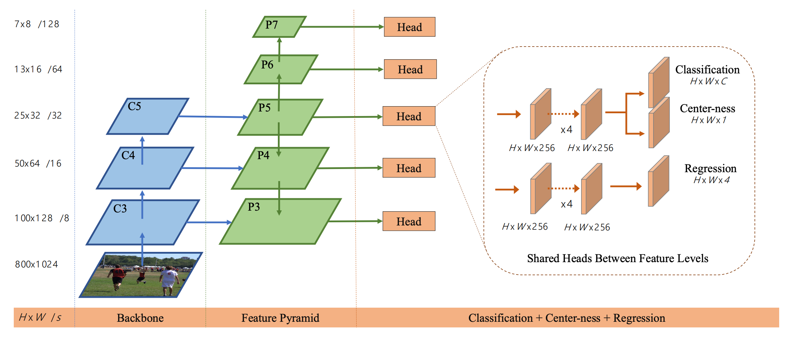
</div>

> [!TIP]
> **论文链接**：[FCOS: Fully Convolutional One-Stage Object Detection](https://arxiv.org/abs/1904.01355)


CenterNet 进一步把目标表示为中心点：

- 用热力图预测目标中心。
- 再回归宽高和偏移量。
- 思路更接近“关键点检测”而不是传统框回归。

CenterNet 代表了 **Anchor-free** 算法的一个典型方向，它彻底抛弃了复杂的锚框设计，将目标检测简化为中心点估计问题。

<div align="center">
  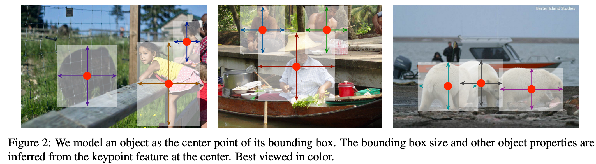
</div>

<br/>

- **核心思想**：通过热图（Heatmap）预测目标的中心点位置。如果中心点在热图上呈现峰值，则表示检测到一个物体。
- **回归属性**：在中心点的基础上，模型额外回归出物体的宽高（Width/Height）以及中心点的局部偏移（Offset）以补偿量化误差。
- **优势**：无需复杂的 Anchor 匹配和 NMS 后处理（虽然有些变体仍使用简单的 $3 \times 3$ 最大池化），流程极简，端到端性能优异。

其损失函数由中心点焦点损失 $L_k$、偏移损失 $L_{off}$ 和尺寸损失 $L_{size}$ 加权组成：

$$
L_{det} = L_{k} + \lambda_{size} L_{size} + \lambda_{off} L_{off}
$$

> [!TIP]
> **论文链接**：[Objects as Points](https://arxiv.org/abs/1904.07850)


<div id="chapter-12-docs-02-2-1-1-2d-md-s16" class="doc-anchor doc-anchor-section doc-anchor-level-3"></div>

### 5.4 YOLO 系列：工程落地的主力

YOLO 的核心价值在于：**用尽可能简单直接的方式实现高效检测。**

- `YOLOv1`：把检测直接视为回归问题。
- `YOLOv2/v3`：补强 Anchor、多尺度和主干网络设计。
- `YOLOv4/v5`：强化工程技巧、数据增强和训练配方。
- `YOLOv8/YOLOv10/YOLO11`：进一步强调解耦头、端侧部署与更端到端的推理流程。

如果从更细的时间线看：

- **YOLOv1**：开山之作，将检测视为回归问题，将图像划分为 $S \times S$ 网格。
- **YOLOv2 (YOLO9000)**：引入了 Batch Normalization 和 Anchor 机制，极大提升了召回率。
- **YOLOv3**：引入了多尺度预测（类似 FPN 结构）和 Darknet-53 主干网络，成为一代经典。
- **YOLOv4/v5**：在工程化上达到极致，引入了 Mosaic 数据增强、CSP 结构和自适应锚框计算。
- **YOLOv8/v11**：现代 YOLO 的代表，采用了更加高效的 C2f 结构、解耦头（Decoupled Head）设计，并在端侧设备上实现了极致的平衡。

在自动驾驶和边缘设备场景里，YOLO 系列常常是首选起点，因为它在速度、生态和部署便利性上非常强。

> [!TIP]
> **系列论文链接**：
> - [YOLOv1: You Only Look Once](https://arxiv.org/abs/1506.02640)
> - [YOLOv3: An Incremental Improvement](https://arxiv.org/abs/1804.02767)
> - [YOLOv4: Optimal Speed and Accuracy of Object Detection](https://arxiv.org/abs/2004.10934)
> - [一文全面梳理YOLO系列｜从YOLOv1到YOLOv13，再到YOLO26](https://zhuanlan.zhihu.com/p/1955758533606880689)


<div id="chapter-12-docs-02-2-1-1-2d-md-s17" class="doc-anchor doc-anchor-section doc-anchor-level-3"></div>

### 5.5 单阶段检测的优缺点

**优点**

- 推理速度快。
- 结构简洁，端侧部署友好。
- 工业生态成熟，工程资料丰富。

**缺点**

- 在极端小目标、严重遮挡和高精度定位场景下，可能不如强两阶段模型。
- 对训练配方、数据增强和样本分布比较敏感。

---

<div id="chapter-12-docs-02-2-1-1-2d-md-s18" class="doc-anchor doc-anchor-section doc-anchor-level-2"></div>

## 6. Transformer 检测与 DETR 演进

Transformer 引入检测领域后，最重要的变化不是“换了一个 backbone”，而是**改变了目标检测的建模方式**。

传统检测器往往依赖：

- 稠密候选位置
- Anchor 设计
- 正负样本分配规则
- NMS 后处理

而 DETR 一类方法尝试回答：

> 能不能直接让模型输出“一组最终目标”，而不是先输出一大堆候选框再人工去重？

<div id="chapter-12-docs-02-2-1-1-2d-md-s19" class="doc-anchor doc-anchor-section doc-anchor-level-3"></div>

### 6.1 DETR 的核心思想与范式变化

DETR（DEtection TRansformer）把目标检测改写成一个 **集合预测（Set Prediction）** 问题。

它的基本做法是：

1. 用 CNN 提取图像特征。
2. 把特征送入 Transformer Encoder 建模全局关系。
3. 用一组固定数量的 `object queries` 进入 Decoder。
4. 每个 query 负责预测一个目标或“空目标”。
5. 训练时通过 **二分图匹配（Bipartite Matching / Hungarian Matching）** 让预测集合与真实目标集合一一对应。

<div align="center">
  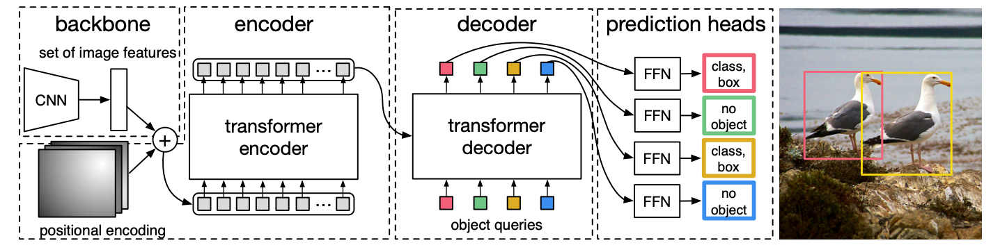
</div>

<br/>
DETR 是将 Transformer 引入目标检测的开山之作，它抛弃了传统的锚框（Anchors）和非极大值抑制（NMS），通过二分图匹配实现目标定位。

- **核心机制**：利用 CNN 提取图像特征，将其展平后输入 Transformer Encoder；Decoder 接收一组固定的、可学习的 **Object Queries**，通过交叉注意力（Cross-Attention）从特征中提取物体信息。
- **训练损失**：采用全局一致的二分图匹配损失，确保预测值与真值（Ground Truth）的一一对应：

$$
\hat{\sigma} = \arg\min_{\sigma \in S_N} \sum_{i=1}^{N} L_{match}(y_i, \hat{y}_{\sigma(i)})
$$

这一步非常关键，因为它让 DETR 不再需要：

- Anchor
- 手工正负样本匹配规则
- NMS 去重

> [!TIP]
> **论文链接**：[End-to-End Object Detection with Transformers](https://arxiv.org/abs/2005.12872)


<div id="chapter-12-docs-02-2-1-1-2d-md-s20" class="doc-anchor doc-anchor-section doc-anchor-level-3"></div>

### 6.2 为什么原始 DETR 不需要 NMS，以及它的瓶颈

在传统检测器中，同一个物体周围会产生许多高重叠预测框，所以要靠 NMS 去重。

而在 DETR 中：

- 每个 query 的目标是输出一个独立预测。
- 训练时通过一对一匹配，强制每个真实目标只匹配一个预测。
- 其余 query 则学习输出“无目标”类别。

因此，模型从训练目标层面就被约束为“每个物体只预测一次”，不再需要用 NMS 在后处理中强行去重。

原始 DETR 的优势包括：

- **端到端**：检测流程更统一。
- **全局建模**：自注意力天然擅长建模目标间关系。
- **一对一预测**：避免大量重复候选框。
- **概念简洁**：减少手工组件和启发式规则。

但它也有很明确的瓶颈：

1. **收敛慢**  
   原始 DETR 往往需要很长训练周期，原因不是“模型太弱”，而是集合匹配本身难学，早期训练阶段匹配非常不稳定。

2. **小目标能力弱**  
   原始 DETR 主要基于较粗粒度特征进行全局建模，对高分辨率多尺度细节利用不充分。

3. **query 语义不够显式**  
   最早的 object queries 更像抽象 embedding，没有明显的空间含义，模型需要自己慢慢学会“哪个 query 该看哪里”。

<div id="chapter-12-docs-02-2-1-1-2d-md-s21" class="doc-anchor doc-anchor-section doc-anchor-level-3"></div>

### 6.3 DETR 的三条改进主线

后续 DETR 家族的演进，几乎都围绕下面三条主线展开：

1. **注意力效率**  
   从“对整幅图做全局稠密注意力”，走向“只关注少量关键采样点”。

2. **query 语义化**  
   从抽象查询向量，走向带有显式位置或框先验的查询。

3. **训练稳定性**  
   从纯粹依赖 Hungarian matching，走向引入辅助任务和去噪训练来加速收敛。

<div id="chapter-12-docs-02-2-1-1-2d-md-s22" class="doc-anchor doc-anchor-section doc-anchor-level-3"></div>

### 6.4 从 Deformable DETR 到 DINO

Deformable DETR 解决的是原始 DETR 全局注意力代价高、对多尺度目标尤其是小目标不够友好的问题。

- 引入 `Deformable Attention`。
- 引入多尺度特征共同参与注意力计算。
- 让每个 query 不再对整张特征图做密集注意力，而只关注参考点周围少量采样位置。

<div align="center">
  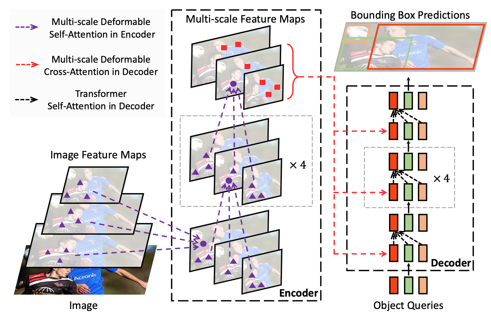
</div>

可以把它理解为：

- 原始 DETR 像是在全图“地毯式搜索”。
- Deformable DETR 像是先给一个参考位置，再只看附近若干关键点。

它解决了三个痛点：

- 收敛显著加快。
- 小目标检测能力更强。
- 更适合高分辨率视觉任务。

> [!TIP]
> **论文链接**：[Deformable DETR: Deformable Transformers for End-to-End Object Detection](https://arxiv.org/abs/2010.04159)


Anchor DETR 的思路是给 query 加入显式空间锚点，把 query 与图像中的位置联系起来。

- 将 Object Queries 显式初始化为图像中的坐标点 $(x, y)$。
- 为模型提供了明确的空间先验，使得 Decoder 能够更有针对性地从特定区域提取特征。

<div align="center">
  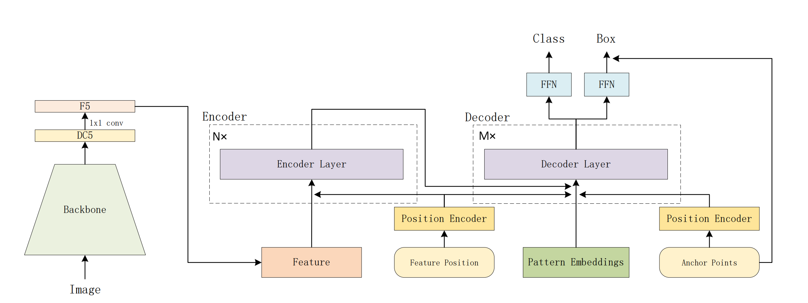
</div>

相比原始 DETR，它让 Decoder 不再完全“盲找目标”，而是可以围绕更明确的空间参考去提取特征。

> [!TIP]
> **论文链接**：[Anchor DETR: Query Design for Transformer-Based Object Detection
](https://arxiv.org/abs/2109.07107)


DAB-DETR（Dynamic Anchor Boxes DETR）进一步把 query 从点扩展成框：

- query 不只是 `(x, y)` 位置先验。
- 而是 `(x, y, w, h)` 形式的动态框先验。
- 每一层 Decoder 都会基于前一层的输出对锚框进行位置和尺寸的精修。

<div align="center">
  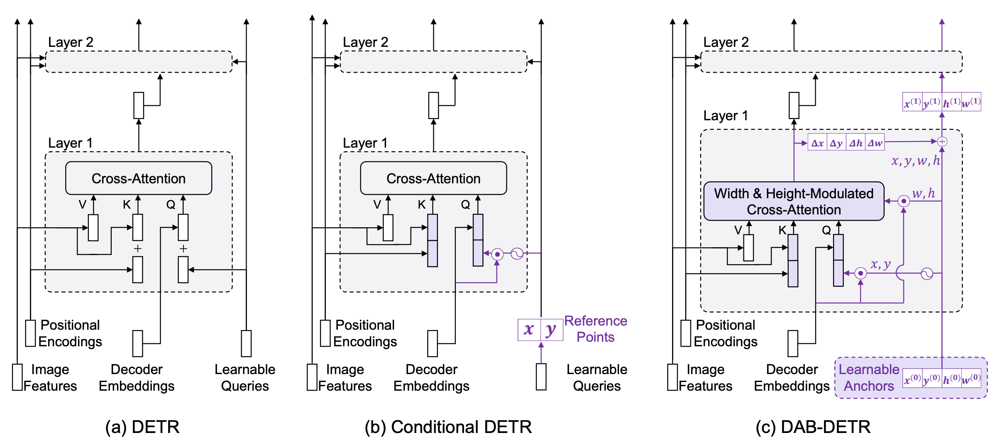
</div>
<br/>

它是对 Anchor DETR 的深化，将“检测”建模为一个迭代式的框精炼过程，也让定位过程更符合“先给初值，再逐步修正”的直觉。

> [!TIP]
> **论文链接**：[DAB-DETR: DYNAMIC ANCHOR BOXES ARE BETTER QUERIES FOR DETR](https://arxiv.org/abs/2201.12329)


DN-DETR 解决的是匹配不稳定问题。

- 在训练时，把加入噪声后的真实框和标签也作为额外 query 输入。
- 模型一边做原始检测任务，一边学习“把这些带噪声的框恢复成正确目标”。

<div align="center">
  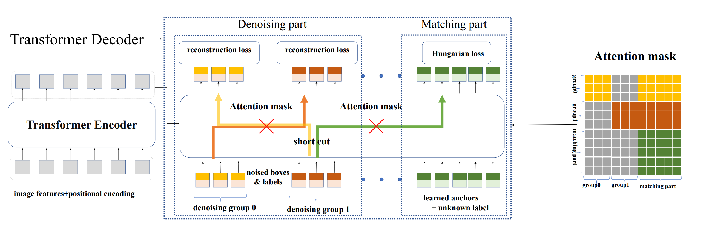
</div>

去噪训练（Denoising Training）带来的好处是：

- 给模型一个更直接、更容易学习的监督信号。
- 降低纯匹配训练初期的不稳定性。
- 明显加快收敛。

> [!TIP]
> **论文链接**：[DN-DETR: Accelerate DETR Training by Introducing Query DeNoising](https://arxiv.org/abs/2203.01305)

DINO 可以看作是前面几条路线的集成和强化：

- 吸收了去噪训练的思想。
- 结合了更好的 query 初始化与选择机制。
- 集成了动态锚框和去噪思路，并提出了 **对比去噪（Contrastive DN）**、**混合查询选择**等技术，实现了极高的精度与更快的收敛。

<div align="center">
  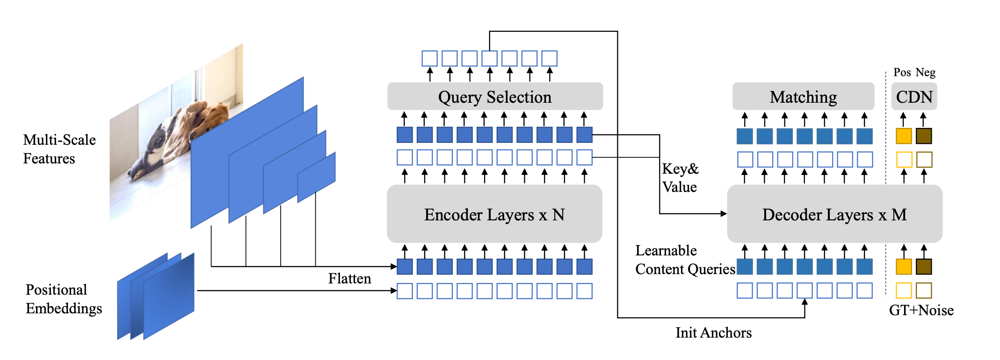
</div>

它代表的是一个很清晰的趋势：

> DETR系列的演进不是在放弃端到端，而是在保留端到端范式的前提下，把训练这件事变得更“好学”。

> [!TIP]
> **论文链接**：[DINO: DETR with Improved DeNoising Anchor
Boxes for End-to-End Object Detection](https://arxiv.org/abs/2203.03605)
>
> 通俗梳理可以结合阅读：
> [DETR系列模型（13篇论文）总结](https://zhuanlan.zhihu.com/p/680900567)


<div id="chapter-12-docs-02-2-1-1-2d-md-s23" class="doc-anchor doc-anchor-section doc-anchor-level-3"></div>

### 6.5 DETR 演进对比与自动驾驶意义

| 方法 | 核心改动 | 主要收益 | 仍存在的问题 |
| :--- | :--- | :--- | :--- |
| **DETR** | 集合预测 + Hungarian Matching | 去除 Anchor 与 NMS，范式简洁 | 收敛慢，小目标弱 |
| **Deformable DETR** | 稀疏可变形注意力 + 多尺度特征 | 收敛更快，小目标更强 | 架构复杂度提高 |
| **Anchor DETR** | 给 query 引入显式空间锚点 | query 更有空间语义 | 仍需继续优化训练稳定性 |
| **DAB-DETR** | 将 query 扩展为动态 4D 框 | 更像逐层框精修，定位更稳定 | 训练仍不如成熟 CNN 检测器“省心” |
| **DN-DETR** | 去噪训练辅助匹配 | 显著加速收敛 | 主要解决训练，不直接解决全部多尺度问题 |
| **DINO** | 去噪、query 设计、训练策略联合增强 | 精度和收敛都很强 | 训练和实现复杂度更高 |

可以用一句话概括从 DETR 到 DINO 的技术脉络：

1. **注意力从全局稠密走向稀疏高效。**
2. **query 从抽象 embedding 走向显式空间锚点与动态框。**
3. **训练从纯匹配驱动走向去噪辅助的稳定优化。**

DETR 系列对自动驾驶最有吸引力的地方，在于它更自然地建模全局关系：

- 复杂交通场景中，目标之间往往互相关联。
- 遮挡场景下，单靠局部卷积特征有时不够。
- 多目标密集场景需要更少的重复预测和更一致的全局推理。

但它的现实约束也很明确：

- 高性能 DETR 变体通常训练更复杂。
- 对算力与训练配方要求更高。
- 在量产系统里，是否采用它常常取决于时延预算、数据规模和工程团队经验。

也就是说，DETR 更像是“高潜力的统一范式”，而不是所有场景下都立刻替代 YOLO/Faster R-CNN 的万能答案。

> [!TIP]
> 学习 DETR 最重要的不是死记各个变体名字，而是抓住它们在解决哪类问题：注意力效率、query 设计、匹配稳定性。

---

<div id="chapter-12-docs-02-2-1-1-2d-md-s24" class="doc-anchor doc-anchor-section doc-anchor-level-2"></div>

## 7. 自动驾驶场景下的典型难点

2D 检测放到自动驾驶里，会遇到比通用数据集更尖锐的问题。

<div id="chapter-12-docs-02-2-1-1-2d-md-s25" class="doc-anchor doc-anchor-section doc-anchor-level-3"></div>

### 7.1 小目标、遮挡、密集场景与长尾类别

远处行人、交通灯、锥桶在图像上可能只有几个像素：

- 下采样后特征容易消失。
- 背景噪声占比反而更大。
- 定位框即便只偏几像素，IoU 也会明显下降。

车辆、行人经常只露出一部分：

- 被前车遮挡
- 出现在图像边缘
- 被路边设施、树木、护栏部分挡住

这会导致：

- 漏检
- 框偏移
- 相邻目标被合并成一个框

路口排队、拥堵道路、行人群穿越时：

- 同类目标彼此重叠严重。
- NMS 可能误删相邻目标。
- 分类置信度和定位质量容易同时下降。

自动驾驶最危险的目标，往往不是最常见的目标。

例如：

- 施工牌
- 拖挂车
- 倒地自行车
- 散落物
- 非标准改装车辆

这些类别样本少、形态多变，很容易成为漏检来源。

<div id="chapter-12-docs-02-2-1-1-2d-md-s26" class="doc-anchor doc-anchor-section doc-anchor-level-3"></div>

### 7.2 光照、天气与图像退化

- 夜晚噪声大，目标边界模糊。
- 雨天玻璃反射和水雾降低对比度。
- 逆光会让目标变成剪影。
- 运动模糊会破坏局部纹理。

这类问题常常不是“模型没学到类别”，而是输入图像本身已经严重退化。

---

<div id="chapter-12-docs-02-2-1-1-2d-md-s27" class="doc-anchor doc-anchor-section doc-anchor-level-2"></div>

## 8. 训练评估、模型选型与工程判断

<div id="chapter-12-docs-02-2-1-1-2d-md-s28" class="doc-anchor doc-anchor-section doc-anchor-level-3"></div>

### 8.1 Precision、Recall、AP、mAP

- **Precision**：预测为正的目标里，有多少是真的。
- **Recall**：真实存在的目标里，有多少被检测出来。

二者往往需要权衡：

- 阈值提高，误检少了，但漏检可能增加。
- 阈值降低，召回提高了，但误检也可能更多。

- **AP（Average Precision）**：单类别下 Precision-Recall 曲线的面积。
- **mAP（mean Average Precision）**：所有类别 AP 的平均值。

在 COCO 评估中，通常默认使用多个 IoU 阈值上的平均结果，即更严格也更全面。

<div id="chapter-12-docs-02-2-1-1-2d-md-s29" class="doc-anchor doc-anchor-section doc-anchor-level-3"></div>

### 8.2 AP50、AP75、APS、FPS、Latency 与选型取舍

- **AP50**：IoU 阈值为 `0.50` 时的 AP，较宽松。
- **AP75**：IoU 阈值为 `0.75` 时的 AP，更强调定位质量。
- **APS / APM / APL**：分别衡量小、中、大目标上的检测能力。
- **FPS（Frames Per Second）**：每秒处理多少帧。
- **Latency**：单帧从输入到输出耗时多久。

如果一个模型 `AP50` 很高但 `AP75` 一般，通常说明：

- 它能把目标大致找出来。
- 但框的位置还不够准。

如果 `APS` 很低，则往往意味着小目标能力不足。

在自动驾驶中，`latency` 往往比纯 `FPS` 更关键，因为控制链路关心的是端到端反应时间，而不是“平均吞吐量”。

一个模型即便 `mAP` 很高，也不代表它已经适合上车。

还必须看：

- 小目标召回是否足够。
- 夜晚、雨雾、逆光场景是否稳。
- 特殊障碍物是否容易漏检。
- 推理延迟是否满足实时要求。
- 误检率是否会触发过多无意义制动或告警。

> [!TIP]
> 对自动驾驶来说，“漏掉一个远处行人”和“多报一个广告牌是行人”都很麻烦，只是风险类型不同。评估必须结合业务风险，而不是只看总分。

三类主流路线的取舍如下：

| 路线 | 代表模型 | 优势 | 劣势 | 典型适用场景 |
| :--- | :--- | :--- | :--- | :--- |
| **Two-Stage** | Faster R-CNN | 精度稳，小目标与密集场景友好 | 速度较慢，部署较重 | 离线高精度分析、精度优先方案 |
| **One-Stage** | YOLO、RetinaNet、FCOS | 快、简单、工业生态成熟 | 极端难例下可能不如强两阶段 | 实时检测、端侧部署、量产主力 |
| **Transformer-based** | DETR、Deformable DETR、DINO | 端到端、全局建模能力强 | 训练复杂度高，落地门槛较高 | 研究型系统、高算力平台、多任务统一建模 |

工程上常见的几个经验点：

- 想快速跑通基线，优先从 `YOLO` 或 `MMDetection` 里的成熟配置开始。
- 想提高远距离和小目标效果，优先检查输入分辨率、多尺度训练和数据分布，而不是先盲目换大模型。
- 想减少误检，除了调阈值，还要回看负样本质量和标注一致性。
- 想减少漏检，除了追求更高 `Recall`，还要分析是否存在类别缺失、长尾不足和场景偏差。
- 自动驾驶训练集最好单独看白天、夜晚、雨天、隧道、城区、高速等子集表现。

什么时候选哪类模型：

- 如果你优先考虑**实时性和部署简洁**，通常先看 YOLO/FCOS 一类单阶段模型。
- 如果你优先考虑**定位精度和复杂场景鲁棒性**，可以优先尝试 Faster R-CNN 或更强两阶段方案。
- 如果你想研究**端到端统一检测范式**，或者后续考虑与分割、跟踪、BEV 感知做更统一的建模，DETR 系列很值得深入。

---

<div id="chapter-12-docs-02-2-1-1-2d-md-s30" class="doc-anchor doc-anchor-section doc-anchor-level-2"></div>

## 9. 学习路径、资料与实践建议

<div id="chapter-12-docs-02-2-1-1-2d-md-s31" class="doc-anchor doc-anchor-section doc-anchor-level-3"></div>

### 9.1 一个推荐的入门顺序

1. 用现成预训练模型在公开数据或自有图片上跑通推理。
2. 读懂 `bbox`、`score`、IoU、NMS、mAP 的含义。
3. 微调一个 YOLO 或 Faster R-CNN 基线。
4. 分析误检和漏检样例，而不是只看总分。
5. 再去理解 FCOS、RetinaNet、DETR 这些不同范式的差别。

不要只看论文曲线，建议固定做三件事：

- 看几张可视化结果，判断模型“错在哪”。
- 看分类分数与 IoU 的关系，判断是分类错还是定位错。
- 分场景统计指标，判断是否存在夜晚、小目标或遮挡偏科。

<div id="chapter-12-docs-02-2-1-1-2d-md-s32" class="doc-anchor doc-anchor-section doc-anchor-level-3"></div>

### 9.2 推荐数据集与开源框架

- [COCO](https://cocodataset.org/dataset/detection-2017.htm)：目标检测通用基准，适合理解标准评估体系。
- [Ultralytics YOLO Docs](https://docs.ultralytics.com/)：最快速跑通检测任务的生态之一。
- [MMDetection](https://github.com/open-mmlab/mmdetection)：检测模型最全、最适合系统学习的代码库之一。
- [Detectron2](https://github.com/facebookresearch/detectron2)：研究和工程都很成熟的经典框架。


**延伸建议**

- 如果你想快速上手工程实践，先从 YOLO 跑通自定义数据训练。
- 如果你想建立完整知识体系，建议把 Faster R-CNN、RetinaNet、FCOS、DETR 串起来理解。
- 如果你想进一步贴近自动驾驶，下一步可以继续看3D 目标检测。

<div id="chapter-12-docs-02-2-1-1-2d-md-s33" class="doc-anchor doc-anchor-section doc-anchor-level-3"></div>

### 9.3 小结与实践建议

2D 目标检测的发展主线，可以概括为三次重要转变：

1. **从滑动窗口到深度特征学习。**
2. **从两阶段候选框检测到单阶段密集预测。**
3. **从 Anchor/NMS 驱动的传统范式到 DETR 的集合预测范式。**

对自动驾驶来说，真正重要的不只是“哪个模型分数最高”，而是：

- 能不能稳定看见远处和小目标。
- 能不能在遮挡、夜晚和恶劣天气下保持鲁棒。
- 能不能在有限时延内输出足够可靠的检测结果。

建议直接做一个小实验，把理论和结果对上：

1. 使用 `Ultralytics YOLO` 跑通一组驾驶场景图像或视频。
2. 手动收集 20 个误检/漏检样例，按“小目标、遮挡、夜晚、密集场景”分类。
3. 对照本文中的概念，判断问题更像是分辨率不足、NMS 误删、样本不均衡，还是长尾类别缺失。

这样你会比只看论文摘要更快真正理解 2D 目标检测。


---

<!-- Source: docs/02_自动驾驶环境感知算法/2.1.2_2D车道线检测.md -->

<div id="chapter-13-docs-02-2-1-2-2d-md" class="doc-anchor doc-anchor-chapter doc-anchor-level-1"></div>

# 2.1.2 2D 车道线检测

车道线检测决定了车辆“该走哪条道”，是横向控制的基础。

<div id="chapter-13-docs-02-2-1-2-2d-md-s02" class="doc-anchor doc-anchor-section doc-anchor-level-2"></div>

## 1. 传统方法 vs 深度学习

- **传统方法**：基于霍夫变换 (Hough Transform) 或边缘提取。容易受到光照和路面杂质干扰。
- **深度学习方法**：将车道线视为像素级分割或基于 Anchor 的回归任务。

<div id="chapter-13-docs-02-2-1-2-2d-md-s03" class="doc-anchor doc-anchor-section doc-anchor-level-2"></div>

## 2. 经典模型

- **LaneATT**：基于 Anchor 机制，兼顾了精度和极高的推理速度。
- **CLRNet**：目前性能顶尖的方案，通过多尺度特征融合提升了检测稳定性。

<div id="chapter-13-docs-02-2-1-2-2d-md-s04" class="doc-anchor doc-anchor-section doc-anchor-level-2"></div>

## 3. 挑战与长尾场景

- 磨损模糊的车道线。
- 雨夜路面反光。
- 复杂路口（分叉、汇入）。

---

<div id="chapter-13-docs-02-2-1-2-2d-md-s05" class="doc-anchor doc-anchor-section doc-anchor-level-2"></div>

## 📚 推荐阅读
- [CLRNet 论文解读](https://example.com/clrnet-blog)


---

<!-- Source: docs/02_自动驾驶环境感知算法/2.1.3_2D图像分割.md -->

<div id="chapter-14-docs-02-2-1-3-2d-md" class="doc-anchor doc-anchor-chapter doc-anchor-level-1"></div>

# 2.1.3 2D 图像分割

2D 图像分割是自动驾驶视觉感知中最“细粒度”的任务之一。它不再只回答“图里有什么目标、目标大致在哪里”，而是进一步回答：

- 图像中的每一个像素分别属于什么语义类别。
- 某个目标的精确轮廓到底延伸到哪里。
- 场景中哪些区域是道路、哪些是人行道、哪些是车辆、哪些只是背景结构。

**它通常输出像素级标签图、实例掩码 `mask`，或者统一的全景分割结果。相比 2D 检测只给出边界框，分割提供的是更完整的场景结构信息，因此常被用于可行驶区域识别、动态障碍物轮廓提取、道路结构理解，以及后续 BEV、Occupancy、在线地图等任务的前置语义信息。**

> [!TIP]
> **可以把 2D 检测理解为“把关键目标圈出来”，而把 2D 分割理解为“沿着轮廓把目标描清楚，并给整张图逐像素上色”。检测更像粗定位，分割更像精细理解。**

---

<div id="chapter-14-docs-02-2-1-3-2d-md-s02" class="doc-anchor doc-anchor-section doc-anchor-level-2"></div>

## 1. 2D 分割在自动驾驶中的职责

在自动驾驶里，分割最常承担的不是“替代检测”，而是补上检测做不到的那部分细节理解。

它的典型职责包括：

- **可行驶区域识别**：区分道路、路肩、隔离带、人行道、绿化带。
- **道路结构理解**：识别车道区域、路口开口、停止线附近区域、路缘边界。
- **动态障碍物精细轮廓提取**：给出车辆、行人、骑行者的像素级边界。
- **静态语义地图补充**：建筑、天空、植被、护栏、墙体等背景元素分类。
- **下游任务辅助监督**：为 BEV 感知、占据网络、在线建图提供更强的图像语义先验。

它的典型价值包括：

- 帮助系统更准确地判断“哪里能走，哪里不能走”。
- 帮助目标边界贴合真实轮廓，而不是只给一个矩形框。
- 为细粒度规划和低速精细操作提供更可信的空间边界。
- 为多任务学习提供统一的像素级监督信号。

但它也有天然边界：

- 只是在图像平面上理解语义，不直接给出真实三维距离。
- 对边界标注质量、类别定义和场景长尾比较敏感。
- 单帧分割结果通常没有稳定时序身份，需要跟踪或时序模块补充。
- 高分辨率分割计算量较大，部署时容易受到延迟和带宽限制。

---

<div id="chapter-14-docs-02-2-1-3-2d-md-s03" class="doc-anchor doc-anchor-section doc-anchor-level-2"></div>

## 2. 基础概念与分割器工作流

<div id="chapter-14-docs-02-2-1-3-2d-md-s04" class="doc-anchor doc-anchor-section doc-anchor-level-3"></div>

### 2.1 一个分割器到底在做什么

一个完整的 2D 分割器，通常同时在做 4 件事：

1. **特征提取**：从原图中提取语义特征。
2. **多尺度上下文融合**：同时兼顾局部边界和全局语义。
3. **像素级预测**：为每个像素输出类别，或输出像素到实例的归属关系。
4. **结果重建与后处理**：将低分辨率特征恢复到更精细的空间结果。

下面这条流程覆盖了大多数分割模型：


```mermaid
graph LR
    A[输入图像] --> B[Backbone 提取特征]
    B --> C[多尺度上下文融合]
    C --> D[Decoder 上采样与细节恢复]
    D --> E[像素分类 / Mask 预测]
    E --> F[实例分组或全景融合]
    F --> G[最终分割结果]
```

和图像分类相比，分割不只是判断“这张图里有没有车”；和检测相比，分割也不只是回答“车大概在哪个框里”。它要进一步回答：

- 这辆车的轮廓到底到哪里结束。
- 路和人行道的分界线在哪里。
- 远处那个只有几像素宽的交通参与者是否还能被完整保留下来。

因此，分割天然要同时处理三件事：

- **语义分类（Semantic Classification）**：每个像素属于哪一类。
- **空间定位（Spatial Localization）**：目标边界是否贴合真实轮廓。
- **结构一致性（Structural Consistency）**：同一物体内部是否连贯、不同类别边界是否清晰。

<div id="chapter-14-docs-02-2-1-3-2d-md-s05" class="doc-anchor doc-anchor-section doc-anchor-level-3"></div>

### 2.2 语义分割、实例分割与全景分割

2D 图像分割通常分成三类任务：

- **语义分割（Semantic Segmentation）**：
  每个像素只预测语义类别，不区分同类目标之间的个体身份。
- **实例分割（Instance Segmentation）**：
  每个像素不仅有类别，还要归属到某一个具体实例。
- **全景分割（Panoptic Segmentation）**：
  把语义分割和实例分割统一起来，既描述背景 `stuff`，也区分前景 `thing`。

如果用输出形式表示：

- 语义分割更像 `class(x, y)`。
- 实例分割更像 `(class(x, y), instance_id(x, y))`。
- 全景分割则要求整张图中的每个像素都被唯一解释。

这里要特别区分两个概念：

- **Thing 类别**：可数、可区分实例的目标，如车辆、行人、骑行者。
- **Stuff 类别**：不可数、通常更连续的背景区域，如道路、天空、植被、建筑立面。

自动驾驶里两者都重要：

- `thing` 决定系统要不要关注某个具体参与者。
- `stuff` 决定系统对整体道路结构的理解是否完整。

> [!TIP]
> **只做语义分割时，两辆并排的车可能在结果图里被涂成同一片 `car` 区域；只有实例分割或全景分割，才会明确“这是两辆不同的车”。**

<div id="chapter-14-docs-02-2-1-3-2d-md-s06" class="doc-anchor doc-anchor-section doc-anchor-level-3"></div>

### 2.3 为什么上采样、跳连和上下文建模如此关键

分割和检测都依赖卷积特征，但分割对空间分辨率更敏感。

原因很直接：

- 主干网络连续下采样后，语义更强了，但像素位置变粗了。
- 如果没有有效的恢复机制，边界会模糊，小目标会消失，细长结构会断裂。

因此，分割模型几乎都会围绕三类设计展开：

- **上采样（Upsampling）**：
  把低分辨率特征恢复到更高分辨率。
- **跳跃连接（Skip Connection）**：
  把浅层高分辨率细节与深层高语义特征融合。
- **上下文建模（Context Modeling）**：
  让模型同时看见局部边界和更大范围的场景语义。

在自动驾驶里，如果没有这些设计，模型很容易出现：

- 路缘和人行道边界糊在一起。
- 远处行人、骑行者被背景吞没。
- 电线杆、护栏、路沿等细长结构断裂。
- 路口大范围区域理解不稳定。

<div id="chapter-14-docs-02-2-1-3-2d-md-s07" class="doc-anchor doc-anchor-section doc-anchor-level-3"></div>

### 2.4 分割常见损失

最基础的语义分割损失通常来自像素级分类，例如交叉熵损失。对一张图像中的像素集合 $\Omega$，可以写成：

$$
L_{ce} = - \sum_{p \in \Omega} \sum_{k=1}^{K} y_{p,k} \log \hat{y}_{p,k}
$$

其中：

- $p$ 表示像素位置。
- $K$ 表示类别数。
- $y_{p,k}$ 表示像素 $p$ 的真实 one-hot 标签。
- $\hat{y}_{p,k}$ 表示模型对类别 $k$ 的预测概率。

但仅靠像素级交叉熵往往不够，因为自动驾驶里常见：

- 背景像素远多于关键前景像素。
- 细边界类在总体像素里占比很低。
- 大面积道路类可能“掩盖”关键小类的错误。

因此很多方法还会加入：

- Dice Loss / IoU Loss：更关注区域重合。
- Boundary Loss：更关注边界质量。
- Focal Loss：缓解类别不平衡。

---

<div id="chapter-14-docs-02-2-1-3-2d-md-s08" class="doc-anchor doc-anchor-section doc-anchor-level-2"></div>

## 3. 方法演进：

分割方法的发展，并不只是“网络越来越深”，而是围绕几个核心矛盾持续演化：

- 如何在保持全局语义的同时保住像素边界细节。
- 如何兼顾大范围背景区域与小而细的前景目标。
- 如何让实例级目标与背景语义在一个统一框架下建模。
- 如何在精度、分辨率、实时性之间取得工程平衡。

早期图像分割更多依赖：

- 手工纹理、颜色和边缘特征。
- 图割（Graph Cut）、CRF、超像素等传统方法。
- 先分区域、再做规则合并的处理流程。

这些方法的问题在于：

- 特征表达能力有限。
- 对复杂光照、尺度变化和遮挡适应性差。
- 很难在大规模自动驾驶场景上稳定泛化。

深度学习带来的关键变化是：**让网络直接学习“从图像到像素标签”的端到端映射。**

---

<div id="chapter-14-docs-02-2-1-3-2d-md-s09" class="doc-anchor doc-anchor-section doc-anchor-level-2"></div>

## 4. 语义分割：从 FCN 到上下文建模

<div id="chapter-14-docs-02-2-1-3-2d-md-s10" class="doc-anchor doc-anchor-section doc-anchor-level-3"></div>

### 4.1 FCN：把分类网络改造成像素预测网络

FCN（Fully Convolutional Network）通常被视为现代语义分割的起点。

它最重要的变化是：

- 去掉传统分类网络末端的全连接层。
- 保留卷积结构，让网络输出空间特征图。
- 再通过上采样把低分辨率预测恢复到像素级输出。

这件事的意义非常大，因为它第一次系统地证明：

**语义分割可以被统一地写成端到端的像素级预测任务。**

FCN 还引入了浅层与深层特征融合的思路，这为后来的编码器-解码器结构和跳连设计打下了基础。

> [!TIP]
> **论文链接**：[Fully Convolutional Networks for Semantic Segmentation](https://arxiv.org/abs/1411.4038)

<div id="chapter-14-docs-02-2-1-3-2d-md-s11" class="doc-anchor doc-anchor-section doc-anchor-level-3"></div>

### 4.2 编码器-解码器：U-Net 一类结构为什么有效？

FCN 之后，一个很自然的问题出现了：

> 深层特征语义强，但空间分辨率太低，怎样把边界细节找回来？

编码器-解码器结构给出的答案是：

- 编码器逐步下采样，提取高语义特征。
- 解码器逐步上采样，恢复空间分辨率。
- 跳跃连接把浅层细节直接送到解码阶段。

这一类结构在医学图像、遥感和自动驾驶里都非常常见，因为它非常符合分割的核心需求：

- 深层负责“看懂是什么”。
- 浅层负责“保住边界在哪里”。

`U-Net` 虽然不是自动驾驶语义分割的唯一主线，但它代表了一个重要范式：**恢复分辨率不能只靠粗暴插值，还要把浅层细节重新接回来。**

> [!TIP]
> **论文链接**：[U-Net: Convolutional Networks for Biomedical Image Segmentation](https://arxiv.org/abs/1505.04597)

<div id="chapter-14-docs-02-2-1-3-2d-md-s12" class="doc-anchor doc-anchor-section doc-anchor-level-3"></div>

### 4.3 PSPNet 与 DeepLab：为什么上下文建模变成核心

仅仅恢复分辨率还不够，因为很多像素是否属于某一类，往往取决于更大的上下文范围。

例如：

- 一片灰色区域到底是路面、阴影还是建筑墙体？
- 一个狭长的白色区域到底是车道线还是护栏高光？
- 远处那一小块黑色区域到底是轮胎、井盖还是噪声？

这就是为什么分割方法后来越来越强调 **上下文建模**。

`PSPNet` 的核心思路是：

- 通过金字塔池化聚合不同尺度的全局上下文。
- 让模型同时感知局部纹理和更大范围的场景结构。

而 `DeepLab` 系列则把另一条路线做得非常成熟：

- 用空洞卷积 `dilated convolution` 扩大感受野。
- 在不显著降低分辨率的情况下获取更大的上下文。
- 用 `ASPP (Atrous Spatial Pyramid Pooling)` 聚合多尺度语义。

这类方法之所以在自动驾驶语义分割中长期重要，本质上是因为道路场景既需要：

- 大范围全局理解：知道这里是十字路口、主路还是匝道。
- 又需要局部边界细节：分清路缘、道路边界、可行驶区域边缘。

> [!TIP]
> **论文链接**：
> - [Pyramid Scene Parsing Network](https://arxiv.org/abs/1612.01105)
> - [Rethinking Atrous Convolution for Semantic Image Segmentation](https://arxiv.org/abs/1706.05587)

<div id="chapter-14-docs-02-2-1-3-2d-md-s13" class="doc-anchor doc-anchor-section doc-anchor-level-3"></div>

### 4.4 实时语义分割：为什么自动驾驶特别重视速度

自动驾驶不会只关心离线指标，还必须关心：

- 输入分辨率有多大。
- 单帧推理延迟有多高。
- 模型是否能稳定运行在车端硬件上。

这就推动了一条非常重要的分支：**实时语义分割。**

这类方法的核心问题不是“能不能分得最细”，而是：

> 在有限算力下，怎样保住最关键的语义质量？

典型思路包括：

- 使用轻量级主干网络。
- 将高分辨率细节分支与低分辨率语义分支解耦。
- 用快速特征融合代替过重的解码器。

例如：

- `ENet` 强调轻量和速度，是早期实时分割的重要代表。
- `BiSeNet` 用双分支结构同时保留空间细节和语义上下文。
- `DDRNet` 在高分辨率分支和低分辨率分支之间做双向信息交换，在速度和精度之间取得了不错平衡。

> [!TIP]
> **论文链接**：
> - [ENet: A Deep Neural Network Architecture for Real-Time Semantic Segmentation](https://arxiv.org/abs/1606.02147)
> - [BiSeNet: Bilateral Segmentation Network for Real-time Semantic Segmentation](https://arxiv.org/abs/1808.00897)
> - [Deep Dual-resolution Networks for Real-time and Accurate Semantic Segmentation of Road Scenes](https://arxiv.org/abs/2101.06085)

<div id="chapter-14-docs-02-2-1-3-2d-md-s14" class="doc-anchor doc-anchor-section doc-anchor-level-3"></div>

### 4.5 语义分割的优缺点

**优点**

- 能为整张图提供连续、完整的场景语义。
- 对道路、天空、建筑、植被等背景结构理解非常自然。
- 在可行驶区域识别和道路结构理解中非常有价值。

**缺点**

- 不区分同类实例，多个目标容易连成一片。
- 对细长边界、小目标和稀有类别比较敏感。
- 高分辨率部署的计算成本较高。

---

<div id="chapter-14-docs-02-2-1-3-2d-md-s15" class="doc-anchor doc-anchor-section doc-anchor-level-2"></div>

## 5. 实例分割：不仅要知道是什么，还要知道是谁

<div id="chapter-14-docs-02-2-1-3-2d-md-s16" class="doc-anchor doc-anchor-section doc-anchor-level-3"></div>

### 5.1 为什么语义分割还不够

如果一张图里有三辆并排的车，语义分割可能会正确地把它们都标成 `car`，但它并不知道这是三辆不同的车。

这在自动驾驶里会直接带来限制：

- 无法区分相邻同类目标的个体身份。
- 无法直接把像素级结果送给多目标跟踪。
- 难以在密集场景中稳定估计每个目标的精确轮廓。

于是，实例分割的目标变成了：

> 不仅要给像素分类，还要把同类目标拆分成一个个独立实例。

<div id="chapter-14-docs-02-2-1-3-2d-md-s17" class="doc-anchor doc-anchor-section doc-anchor-level-3"></div>

### 5.2 Mask R-CNN：先检测，再为每个目标生成 Mask

`Mask R-CNN` 是实例分割历史上的标志性方法。

它延续了 Faster R-CNN 的两阶段思路：

1. 先用检测器提出候选目标区域。
2. 对每个 RoI 进行分类和边框回归。
3. 额外增加一个并行的 mask 分支，为每个目标预测像素级掩码。

它的重要意义在于：

- 把目标检测与像素级分割统一在一个框架内。
- 让实例分割第一次成为成熟、强大、易理解的标准方案。
- 在自动驾驶、通用视觉和工业落地中都产生了深远影响。

从思想上看，`Mask R-CNN` 很符合工程直觉：

- 先找“这个目标大概在哪”。
- 再在局部区域里把轮廓精细切出来。

这种做法在目标边界较清晰、实例数量适中时通常很有效。

> [!TIP]
> **论文链接**：[Mask R-CNN](https://arxiv.org/abs/1703.06870)

<div id="chapter-14-docs-02-2-1-3-2d-md-s18" class="doc-anchor doc-anchor-section doc-anchor-level-3"></div>

### 5.3 从检测驱动到位置驱动：SOLO / SOLOv2 一类方法

两阶段实例分割虽然强，但也有明显代价：

- 依赖检测框质量。
- 流程更复杂。
- 对密集场景和实时部署不一定最友好。

因此，后续很多工作开始探索：

> 能不能不先显式检测 RoI，而是更直接地按位置或实例来生成 mask？

`SOLO` / `SOLOv2` 代表了一条很重要的思路：

- 不再严格依赖“先框后分”的两阶段范式。
- 直接把实例分割建模为按网格或位置预测实例掩码。
- 让同一位置负责某个实例的分割结果。

它的意义在于：

- 降低了对检测框质量的依赖。
- 为更直接、更统一的实例建模打开了空间。

> [!TIP]
> **论文链接**：[SOLOv2: Dynamic and Fast Instance Segmentation](https://arxiv.org/abs/2003.10152)

<div id="chapter-14-docs-02-2-1-3-2d-md-s19" class="doc-anchor doc-anchor-section doc-anchor-level-3"></div>

### 5.4 实例分割在自动驾驶中的优缺点

**优点**

- 能把相邻同类目标明确分开。
- 对车辆、行人、骑行者等动态目标边界刻画更准确。
- 更适合与跟踪、行为预测等实例级下游任务衔接。

**缺点**

- 对遮挡、重叠和远距离小目标依然很敏感。
- 标注成本更高，训练更复杂。
- 相比纯语义分割，部署开销通常更大。

---

<div id="chapter-14-docs-02-2-1-3-2d-md-s20" class="doc-anchor doc-anchor-section doc-anchor-level-2"></div>

## 6. 全景分割：把 thing 和 stuff 统一起来

<div id="chapter-14-docs-02-2-1-3-2d-md-s21" class="doc-anchor doc-anchor-section doc-anchor-level-3"></div>

### 6.1 为什么还需要全景分割

语义分割擅长理解背景结构，实例分割擅长拆分前景个体，但真实驾驶场景并不会天然把两类问题分开。

系统真正想知道的是：

- 哪些像素属于道路、天空、建筑这类连续背景。
- 哪些像素属于具体的某一辆车、某一个行人。
- 整张图中的每个像素能不能被唯一、完整、无冲突地解释。

这正是全景分割的目标。

它要求：

- 对 `stuff` 类别做语义分割。
- 对 `thing` 类别做实例分割。
- 将两者融合成一张全局一致的结果图。

从自动驾驶角度看，全景分割比“单独做语义 + 单独做实例”更接近真实需求，因为它更像一种完整的场景解释结果。

<div id="chapter-14-docs-02-2-1-3-2d-md-s22" class="doc-anchor doc-anchor-section doc-anchor-level-3"></div>

### 6.2 全景分割的意义与工程价值

全景分割最重要的价值不是单纯提高某个指标，而是统一建模视角：

- 对规划和场景理解而言，整张图中每个像素都有语义归属。
- 对动态目标建模而言，关键交通参与者有明确实例身份。
- 对多任务系统而言，更容易作为统一的视觉中间表征。

在自动驾驶里，这意味着它可以更自然地服务于：

- 场景结构解析
- 语义地图补充
- BEV 语义投影
- 占据建模与自由空间理解

<div id="chapter-14-docs-02-2-1-3-2d-md-s23" class="doc-anchor doc-anchor-section doc-anchor-level-3"></div>

### 6.3 Panoptic Quality 为什么重要

全景分割常用 `Panoptic Quality (PQ)` 评估。它常写成：

$$
PQ = SQ \times RQ
$$

其中：

- $SQ$ 表示 `Segmentation Quality`，反映已匹配实例的分割质量。
- $RQ$ 表示 `Recognition Quality`，反映识别和匹配是否成功。

这类指标的重要性在于：它不只关心“有没有分对类别”，还关心“有没有把实例和区域整体解释清楚”。

---

<div id="chapter-14-docs-02-2-1-3-2d-md-s24" class="doc-anchor doc-anchor-section doc-anchor-level-2"></div>

## 7. Transformer 分割：统一分割范式的新方向

Transformer 进入分割领域后，最重要的变化不是简单换一个主干网络，而是进一步推动了：

- 长程依赖建模
- 多尺度特征统一融合
- 不同分割任务之间的统一表达

<div id="chapter-14-docs-02-2-1-3-2d-md-s25" class="doc-anchor doc-anchor-section doc-anchor-level-3"></div>

### 7.1 SegFormer：轻量而强的语义分割代表

`SegFormer` 是近几年语义分割里非常有代表性的模型。

它的特点包括：

- 使用层次化 Transformer 编码器提取多尺度特征。
- 解码头相对轻量，但融合方式高效。
- 在精度和工程落地之间取得了很好的平衡。

它的重要意义在于：证明了 Transformer 并不一定意味着极重的结构，合理设计后也能成为很实用的分割主干。

> [!TIP]
> **论文链接**：[SegFormer: Simple and Efficient Design for Semantic Segmentation with Transformers](https://arxiv.org/abs/2105.15203)

<div id="chapter-14-docs-02-2-1-3-2d-md-s26" class="doc-anchor doc-anchor-section doc-anchor-level-3"></div>

### 7.2 Mask2Former：从“任务专用头”走向统一 Mask 预测

`Mask2Former` 代表了另一条更具范式意义的路线：

- 用统一的 mask 分类框架处理不同分割任务。
- 把语义分割、实例分割和全景分割尽量放进同一建模语言里。
- 借助 Transformer 的查询机制做更灵活的区域级预测。

它的重要价值不只是性能强，还在于它体现了一种趋势：

> 分割不一定要被拆成许多彼此割裂的任务头，而可以在统一 mask 预测框架下表达。

这对自动驾驶多任务感知非常有启发，因为车端系统本来就不希望维护过多风格完全不同的任务分支。

> [!TIP]
> **论文链接**：[Masked-attention Mask Transformer for Universal Image Segmentation](https://arxiv.org/abs/2112.01527)

<div id="chapter-14-docs-02-2-1-3-2d-md-s27" class="doc-anchor doc-anchor-section doc-anchor-level-3"></div>

### 7.3 Transformer 分割的优缺点

**优点**

- 全局关系建模能力强。
- 统一不同分割任务的潜力更大。
- 更适合向通用视觉表征和多任务学习扩展。

**缺点**

- 训练资源和调参复杂度通常更高。
- 高分辨率输入下显存与延迟压力仍然明显。
- 真正落地时仍要权衡车端算力与模型收益。

---

<div id="chapter-14-docs-02-2-1-3-2d-md-s28" class="doc-anchor doc-anchor-section doc-anchor-level-2"></div>

## 8. 自动驾驶场景下的典型难点

<div id="chapter-14-docs-02-2-1-3-2d-md-s29" class="doc-anchor doc-anchor-section doc-anchor-level-3"></div>

### 8.1 边界细节、小目标与遮挡

自动驾驶分割最大的难点之一，是许多“真正重要”的目标恰恰非常难分：

- 远处行人和骑行者只占极少像素。
- 路缘、护栏、交通锥属于细长或高频结构。
- 相互遮挡的车辆和行人边界非常复杂。

这会导致一些典型问题：

- 目标轮廓被过度平滑。
- 相邻实例黏连在一起。
- 细小目标直接消失在背景里。

<div id="chapter-14-docs-02-2-1-3-2d-md-s30" class="doc-anchor doc-anchor-section doc-anchor-level-3"></div>

### 8.2 光照、天气与路面材质变化

真实道路场景里，图像分割并不是在“干净数据集”上进行的。

模型必须面对：

- 夜晚低照度
- 雨雪雾天气
- 逆光、眩光和车灯反射
- 路面积水、阴影、沥青老化和施工涂改

这些因素都会直接破坏像素外观一致性，让模型更难仅靠局部纹理做判断。

<div id="chapter-14-docs-02-2-1-3-2d-md-s31" class="doc-anchor doc-anchor-section doc-anchor-level-3"></div>

### 8.3 类别长尾与标注边界不确定性

分割比检测更依赖标注质量，因为边界本身就是监督目标的一部分。

现实中常见问题包括：

- 少数关键类样本极少，例如施工锥桶、拖挂车、异常障碍物。
- 标注人员对边界位置可能存在主观差异。
- 类别定义是否合并、是否细分，会显著影响训练目标。

这也是为什么分割项目往往不只是“换个模型”，而是还要反复打磨：

- 标签体系
- 数据采样策略
- 边界质量控制
- 长尾类别权重设计

---

<div id="chapter-14-docs-02-2-1-3-2d-md-s32" class="doc-anchor doc-anchor-section doc-anchor-level-2"></div>

## 9. 训练评估、模型选型与工程判断

<div id="chapter-14-docs-02-2-1-3-2d-md-s33" class="doc-anchor doc-anchor-section doc-anchor-level-3"></div>

### 9.1 Pixel Accuracy 与 mIoU

语义分割最常见的两个指标是 `Pixel Accuracy` 和 `mIoU`。

其中，单类别 IoU 可写作：

$$
\text{IoU}_k = \frac{TP_k}{TP_k + FP_k + FN_k}
$$

进一步地，平均交并比 `mIoU` 写作：

$$
\text{mIoU} = \frac{1}{K}\sum_{k=1}^{K}\frac{TP_k}{TP_k + FP_k + FN_k}
$$

其中：

- $TP_k$ 表示类别 $k$ 的真正例像素数。
- $FP_k$ 表示被错误预测为类别 $k$ 的像素数。
- $FN_k$ 表示真实属于类别 $k$ 但没有预测对的像素数。

`Pixel Accuracy` 容易理解，但它可能被大面积背景类别“冲高”；`mIoU` 更能反映各类别的真实分割质量，因此通常更常用。

不过在自动驾驶里，不能只盯着一个总体 `mIoU`，还要看：

- 关键小类的 IoU 是否过低。
- 细长边界类是否容易断裂。
- 可行驶区域边界是否稳定。
- 不同天气和时段下是否有明显退化。

<div id="chapter-14-docs-02-2-1-3-2d-md-s34" class="doc-anchor doc-anchor-section doc-anchor-level-3"></div>

### 9.2 实例分割的 AP 与 mask AP

实例分割常沿用检测中的 `AP` 评估思想，但关注的是 mask 重合质量而不只是框重合。

因此常会看到：

- `box AP`
- `mask AP`

其中 `mask AP` 更能反映实例轮廓是否被准确切分出来。

在自动驾驶里，这类指标对以下场景特别关键：

- 密集车辆场景
- 人车混行场景
- 遮挡严重场景

因为这些场景里，“有没有检测到”只是第一步，“边界是否分清”同样重要。

<div id="chapter-14-docs-02-2-1-3-2d-md-s35" class="doc-anchor doc-anchor-section doc-anchor-level-3"></div>

### 9.3 全景分割的 PQ、SQ、RQ

相比只看语义或实例，全景分割更常使用：

- `PQ (Panoptic Quality)`
- `SQ (Segmentation Quality)`
- `RQ (Recognition Quality)`

它们的价值在于：

- 同时评估区域质量和识别成功率。
- 更适合统一衡量 `stuff + thing` 的整体结果。

如果一个模型把道路分得很好，却总是把相邻车辆实例粘在一起，那么它的 `PQ` 往往不会好看。

<div id="chapter-14-docs-02-2-1-3-2d-md-s36" class="doc-anchor doc-anchor-section doc-anchor-level-3"></div>

### 9.4 FPS、Latency 与输入分辨率的真实取舍

自动驾驶里的模型选型，从来不只是论文排行榜问题。

工程上还必须同时看：

- `FPS`
- 单帧延迟 `Latency`
- 输入分辨率
- 显存/带宽占用
- 目标部署平台

因为分辨率越高，边界通常越细，但计算成本也越高；模型越强，精度可能越高，但端侧实时性压力也越大。


---

<div id="chapter-14-docs-02-2-1-3-2d-md-s37" class="doc-anchor doc-anchor-section doc-anchor-level-2"></div>

## 10. 学习路径、资料与实践建议

<div id="chapter-14-docs-02-2-1-3-2d-md-s38" class="doc-anchor doc-anchor-section doc-anchor-level-3"></div>

### 10.1 一个推荐的入门顺序

如果你刚开始系统学习 2D 图像分割，一个比较顺的路径是：

1. 先理解语义分割的基本任务定义与 `mIoU`。
2. 再掌握 `FCN`、`U-Net`、`DeepLab` 这条主线。
3. 接着理解实例分割与 `Mask R-CNN` 的核心思想。
4. 再把全景分割看成 `stuff + thing` 的统一建模问题。
5. 最后进入 `SegFormer`、`Mask2Former` 等更现代的统一范式。

这样学习的好处是：先把“像素分类”学清楚，再逐步过渡到“实例拆分”和“统一场景解释”。

<div id="chapter-14-docs-02-2-1-3-2d-md-s39" class="doc-anchor doc-anchor-section doc-anchor-level-3"></div>

### 10.2 推荐数据集与开源框架

推荐优先了解以下数据集：

- `Cityscapes`：城市街景语义分割的经典基准，类别定义和评测体系都很成熟。
- `BDD100K`：覆盖天气、时段和交通场景变化更丰富，贴近真实道路长尾。
- `Mapillary Vistas`：类别更细、场景更多样，对泛化能力要求更高。

推荐优先了解以下开源框架：

- `MMSegmentation`：适合系统学习语义分割模型与训练配置。
- `MMDetection`：适合理解实例分割与全景分割相关实现。
- `Detectron2`：也是实例分割、全景分割领域非常重要的工程框架。

> [!TIP]
> **资料链接**：
> - [Cityscapes Dataset](https://www.cityscapes-dataset.com/)
> - [BDD100K](https://bdd-data.berkeley.edu/)
> - [Mapillary Vistas](https://www.mapillary.com/dataset/vistas)
> - [MMSegmentation](https://github.com/open-mmlab/mmsegmentation)
> - [MMDetection](https://github.com/open-mmlab/mmdetection)

<div id="chapter-14-docs-02-2-1-3-2d-md-s40" class="doc-anchor doc-anchor-section doc-anchor-level-3"></div>

### 10.3 小结与实践建议

如果只用一句话概括 2D 图像分割在自动驾驶中的价值，那就是：

**它负责把“这张图里大概有什么”推进成“这张图里每一块区域到底是什么、边界到底在哪里”。**

分割并不能独立解决所有感知问题，但它提供了 2D 视觉里最细粒度、最接近“完整场景解释”的语义信息，这也是它在自动驾驶感知系统中长期重要的原因。


---

<!-- Source: docs/02_自动驾驶环境感知算法/2.2.1_3D目标检测-纯视觉.md -->

<div id="chapter-15-docs-02-2-2-1-3d-md" class="doc-anchor doc-anchor-chapter doc-anchor-level-1"></div>

# 2.2.1 3D目标检测-纯视觉

纯视觉 3D 目标检测（Vision-only 3D Object Detection）是自动驾驶感知中最具挑战、也最具代表性的任务之一。它要求系统**仅依赖相机图像**，就恢复出周围目标在真实三维世界中的位置、尺寸、朝向，必要时还包括速度等运动属性。

如果说 2D 检测回答的是：

- 图中出现了什么目标？
- 这些目标在图像上大致位于哪里？

那么纯视觉 3D 检测要进一步回答：

- 这个目标在真实世界的什么位置？
- 它离车多远？
- 它朝向哪里？
- 它的长宽高大概是多少？
- 它是静止的，还是正在运动？

**因此，纯视觉 3D 检测本质上是在“只有投影结果、没有直接深度”的前提下，从 2D 图像反推出 3D 结构。**

它的标准输出通常是一组 3D 框参数：

- 目标中心位置 $\left(x, y, z\right)$
- 目标尺寸 $\left(w, l, h\right)$
- 目标朝向 `yaw`
- 目标类别 `class`
- 置信度 `score`
- 可选速度 $\left(v_x, v_y\right)$

这些结果会继续送往多目标跟踪、行为预测、风险评估、规划控制等下游模块。也正因为如此，纯视觉 3D 检测不是“图像理解的小升级”，而是自动驾驶从“看见画面”走向“理解空间”的关键一步。

> [!TIP]
> **可以把纯视觉 3D 检测理解为：**
> 2D 检测是在图上“圈出目标”，而 3D 检测是在真实道路坐标系里“摆出目标”。

---

<div id="chapter-15-docs-02-2-2-1-3d-md-s02" class="doc-anchor doc-anchor-section doc-anchor-level-2"></div>

## 1. 纯视觉 3D 检测在自动驾驶中的职责

自动驾驶中的 3D 检测最常面向以下几类交通参与者与障碍物：

- 动态目标：车辆、行人、骑行者、摩托车、公交车、卡车。
- 道路障碍物：锥桶、路障、施工设备、异常停靠车辆。
- 可运动目标：推车、婴儿车、低速工程车、特殊异形车。

相比 2D 检测，3D 检测在自动驾驶里的价值更加直接：

- 为跟踪提供物理空间中的初始状态。
- 为预测模块提供位置、朝向、速度等运动先验。
- 为规划控制提供可直接用于避障和路径决策的几何对象。
- 为风险评估提供“目标离我多远、是否正在靠近”的关键信息。

它和 2D 检测最本质的区别在于：**2D 检测仍停留在图像坐标系，3D 检测则必须进入车辆所在的物理世界坐标系。**

对于自动驾驶而言，这种区别并不是“精度更高一点”那么简单，而是能力边界的变化：

- 2D 框无法直接表示真实距离。
- 2D 框无法稳定支持速度估计。
- 2D 框很难直接用于轨迹规划。
- 3D 框则天然与车辆坐标系、BEV（Bird's Eye View，鸟瞰图）空间和运动模型兼容。

但纯视觉路线也有天然困难：

- 相机没有 LiDAR 那样的直接深度测量。
- 图像中的尺度变化和真实距离高度耦合。
- 远距离小目标、遮挡目标和夜间目标尤其难。
- 多相机系统还要处理跨视角对齐和外参误差问题。

因此，纯视觉 3D 检测的发展史，本质上就是在回答一个问题：

> 在缺少直接深度观测的前提下，如何尽量稳定、尽量高效地恢复真实三维世界？

---

<div id="chapter-15-docs-02-2-2-1-3d-md-s03" class="doc-anchor doc-anchor-section doc-anchor-level-2"></div>

## 2. 基础概念与任务工作流

<div id="chapter-15-docs-02-2-2-1-3d-md-s04" class="doc-anchor doc-anchor-section doc-anchor-level-3"></div>

### 2.1 一个纯视觉 3D 检测器到底在做什么

一个完整的纯视觉 3D 检测器，通常同时在做 5 件事：

1. **图像特征提取**：从单目图像或多相机环视图像中提取语义特征。
2. **空间结构恢复**：显式或隐式地推断深度、尺度和空间布局。
3. **3D 表示构建**：把图像特征转换成适合检测的 3D / BEV / query 表示。
4. **目标级推理**：预测类别、3D 框、朝向和可选速度。
5. **后处理与坐标变换**：把结果统一到车辆坐标系或 BEV 坐标系。

从宏观角度看，纯视觉 3D 检测大致可以抽象成下面这条链路：


```mermaid
graph LR
    A[输入图像: 单目或多相机] --> B[Backbone 提取图像特征]
    B --> C[空间恢复: 深度/几何/Query/BEV]
    C --> D[3D表示: Camera View / BEV / Sparse Queries]
    D --> E[Detection Head 预测3D框]
    E --> F[坐标统一与后处理]
    F --> G[最终3D目标]
```

和 2D 检测相比，纯视觉 3D 检测多出的关键难点是：

- 目标分类只是第一步。
- 目标定位不再是图像平面定位，而是三维空间定位。
- 框回归不再是 $(x, y, w, h)$，而是 $\left(x, y, z, w, l, h, yaw\right)$。

这意味着它必须同时处理：

- **语义识别（Classification）**
- **三维定位（3D Localization）**
- **姿态估计（Orientation Estimation）**
- **尺度估计（Size Estimation）**
- **可选运动估计（Velocity Estimation）**

<div id="chapter-15-docs-02-2-2-1-3d-md-s05" class="doc-anchor doc-anchor-section doc-anchor-level-3"></div>

### 2.2 3D 框、坐标系与投影关系

纯视觉 3D 检测里，最先要搞清楚的是：**同一个目标，可能同时存在于多个坐标系里。**

常见坐标系包括：

- **图像坐标系（Image Coordinate）**：目标表现为 2D 像素位置。
- **相机坐标系（Camera Coordinate）**：目标相对某个相机的位置。
- **车辆坐标系（Ego Coordinate）**：目标相对自车中心的位置。
- **BEV 坐标系（Bird's Eye View Coordinate）**：从上往下看的地面平面坐标。

在针孔成像模型下，三维点与图像点的投影关系可写成：

```math
s \begin{bmatrix}
u \\
v \\
1
\end{bmatrix}
=
K \begin{bmatrix}
X_c \\
Y_c \\
Z_c
\end{bmatrix}
```

其中：

- $\left(u, v\right)$ 是像素坐标。
- $\left(X_c, Y_c, Z_c\right)$ 是相机坐标系下的三维点。
- $K$ 是相机内参矩阵。
- $s$ 与深度相关。

这条公式非常重要，因为它揭示了纯视觉 3D 检测的根本难点：

> 图像只给出了投影结果，但没有直接给出深度 $Z_c$。

同一个图像框可能对应：

- 一个近处的小车
- 一个远处的大车
- 一个被部分遮挡、形状不完整的目标

因此，3D 检测里经常会出现下面这些参数化方式：

- **中心点参数化**：预测 3D 中心点 + 尺寸 + 朝向。
- **角点参数化**：预测 8 个 3D 角点，再恢复框体。
- **BEV 参数化**：在地平面上预测中心、长宽和朝向，再回归高度。
- **query 参数化**：用少量候选实例表示目标，在迭代推理中不断精修。

<div id="chapter-15-docs-02-2-2-1-3d-md-s06" class="doc-anchor doc-anchor-section doc-anchor-level-3"></div>

### 2.3 单目、环视图与四种核心表示范式

从输入角度看，纯视觉 3D 检测大致有两类主设定：

- **单目 3D 检测（Monocular 3D Detection）**：使用单张前视图像。
- **环视图 3D 检测（Surround-view 3D Detection）**：使用多相机环视图像，常见是 6 路或 8 路相机。

单目方法的优点是：

- 结构简单
- 成本低
- 更适合作为入门和前视感知基线

但它受限也很明显：

- 深度高度不确定
- 视野不完整
- 难以在车辆周围构建一致空间表示

因此，自动驾驶的主流纯视觉 3D 检测研究逐渐从单目前视走向**环视图 + BEV / Query 空间建模**。

从“空间表示如何构造”这个角度，可以把当前主流方法分成 4 种核心范式：

| 范式 | 核心思想 | 直觉理解 | 代表问题 |
| :--- | :--- | :--- | :--- |
| **Dense** | 尽量把空间铺开，构造稠密 3D / BEV 特征 | 先建空间地图，再检测目标 | 几何表达强，但成本高 |
| **Sparse** | 只保留少量候选点、query 或实例槽位 | 直接找目标，不先把空间铺满 | 高效，但先验依赖强 |
| **Hybrid** | 稠密空间提供底座，稀疏实例做聚焦推理 | 先粗建空间，再细找目标 | 是现实折中路线 |
| **Temporal** | 用多帧补足单帧信息不足 | 用时间换几何与稳定性 | 对对齐和记忆设计要求高 |

> [!TIP]
> **这里的 Temporal 更像“能力层”，而不是完全独立于其他三类的方法。**
> 实际上，时序机制经常叠加在 Dense、Sparse 或 Hybrid 路线上，用来提升深度稳定性和跨帧连续性。

<div id="chapter-15-docs-02-2-2-1-3d-md-s07" class="doc-anchor doc-anchor-section doc-anchor-level-3"></div>

### 2.4 一个现代纯视觉 3D 检测器的工作流

从工程实现上看，一个现代环视纯视觉 3D 检测器的常见工作流可以写成：

1. 输入多相机图像。
2. 提取每个视角的图像特征。
3. 通过显式深度、隐式投影或 query 采样，把多视角特征变到统一空间。
4. 在统一空间中做目标级推理。
5. 输出 3D 框、朝向、速度等结果。

如果是 BEV 路线，通常流程更接近：


```mermaid
graph LR
    A[多相机图像] --> B[共享Backbone]
    B --> C[View Transform / Lift-Splat]
    C --> D[BEV Feature]
    D --> E[BEV Detection Head]
    E --> F[3D Boxes]
```

如果是 Sparse 路线，通常流程更接近：


```mermaid
graph LR
    A[多相机图像] --> B[图像特征]
    B --> C[Object Queries / Reference Points]
    C --> D[跨视角特征采样]
    D --> E[迭代更新实例状态]
    E --> F[3D Boxes]
```

这也为后面的方法分类埋下了伏笔：

- Dense 更像“**先有空间，再找目标**”
- Sparse 更像“**先有目标假设，再向图像取证**”
- Hybrid 更像“**先用空间托底，再用目标实例精修**”

---

<div id="chapter-15-docs-02-2-2-1-3d-md-s08" class="doc-anchor doc-anchor-section doc-anchor-level-2"></div>

## 3. 方法演进：为什么 3D 检测会这样发展

纯视觉 3D 检测的发展，不只是模型越来越大，而是围绕几个核心矛盾不断演化：

- 图像没有直接深度，怎么恢复空间？
- 单张图证据不足，怎么提高稳定性？
- 多相机视角很多，怎么做统一表示？
- 稠密建模更完整，但太重；稀疏建模更轻，但是否会丢掉关键信息？
- 目标检测是目标级任务，是否真的有必要对整个空间做全量建模？

从历史脉络看，大致经历了下面几步：

<div id="chapter-15-docs-02-2-2-1-3d-md-s09" class="doc-anchor doc-anchor-section doc-anchor-level-3"></div>

### 3.1 从单目前视 3D 估计出发

早期纯视觉 3D 检测大多从单目问题入手：

- 先做 2D 检测
- 再利用透视几何、尺寸先验或关键点约束恢复 3D 位置

这类方法的特点是：

- 容易理解
- 容易从 2D 检测迁移
- 但深度非常难稳

也就是说，单目 3D 检测更像是在回答：

> 能不能从一张图中“猜出”一个合理的 3D 解释？

<div id="chapter-15-docs-02-2-2-1-3d-md-s10" class="doc-anchor doc-anchor-section doc-anchor-level-3"></div>

### 3.2 从前视图走向统一空间表示

当系统进入自动驾驶场景后，问题变得更复杂：

- 车前、车侧、车后都要看
- 目标要统一到自车坐标系
- 目标运动和规划控制更关心俯视平面的几何关系

于是研究者开始意识到：

> 纯视觉 3D 检测不能一直停留在“每个视角单独做检测”，而是需要一个统一的空间表示。

这推动了 **BEV（Bird's Eye View）** 路线的兴起。

<div id="chapter-15-docs-02-2-2-1-3d-md-s11" class="doc-anchor doc-anchor-section doc-anchor-level-3"></div>

### 3.3 为什么会分化成 Dense、Sparse、Hybrid

BEV 路线虽然自然，但很快又遇到了新的问题：

- 如果把整个空间都建成稠密特征图，几何表达很强，但算力和显存开销很大。
- 但如果完全不建空间、只靠少量 query 推理，又可能缺少完整的全局上下文。

于是，环视图纯视觉 3D 检测逐渐分化成三条长期共存的路线：

1. **Dense 路线**  
   尽量恢复完整的 BEV / 3D 空间，再在空间上做密集检测。

2. **Sparse 路线**  
   不先铺满空间，而是直接维护少量稀疏实例或 query，让模型围绕这些候选目标采样图像证据。

3. **Hybrid 路线**  
   既承认空间底座很重要，又承认目标级推理更高效，因此把两者结合起来。

<div id="chapter-15-docs-02-2-2-1-3d-md-s12" class="doc-anchor doc-anchor-section doc-anchor-level-3"></div>

### 3.4 为什么 Temporal 会成为重要补强

即便有了 Dense 或 Sparse 表示，单帧纯视觉仍然有很多固有局限：

- 单帧深度估计容易抖动。
- 被遮挡目标可能这一帧看不清，但前一帧看得更清楚。
- 远距离目标纹理极弱，单帧证据往往不足。
- 运动目标的速度和朝向变化本来就天然跨帧。

因此，多帧时序融合逐渐从“锦上添花”变成“纯视觉 3D 检测的重要补强方向”。

可以用一句话概括这一演进逻辑：

> 单目解决“能不能做”，环视解决“能不能统一空间”，Dense / Sparse / Hybrid 解决“怎么建模更合适”，Temporal 则解决“如何让结果更稳、更连续”。

---

<div id="chapter-15-docs-02-2-2-1-3d-md-s13" class="doc-anchor doc-anchor-section doc-anchor-level-2"></div>

## 4. 单目 3D 检测：从几何约束到深度建模

单目 3D 检测通常是学习纯视觉 3D 感知的起点，因为它最直接暴露了这个任务的本质难点：**只有投影，没有直接深度。**

<div id="chapter-15-docs-02-2-2-1-3d-md-s14" class="doc-anchor doc-anchor-section doc-anchor-level-3"></div>

### 4.1 为什么单目 3D 检测这么难

从单张图像恢复 3D 信息，本身就是病态问题（ill-posed problem）：

- 同样大小的 2D 框，可能来自不同距离和不同真实尺寸的物体。
- 遮挡会破坏目标轮廓和几何边界。
- 相机俯仰、道路坡度和截断都会影响深度判断。

因此，单目方法往往会引入：

- 物体尺寸先验
- 地平面约束
- 关键点约束
- 深度分布建模
- 伪点云或 lifting 表示

<div id="chapter-15-docs-02-2-2-1-3d-md-s15" class="doc-anchor doc-anchor-section doc-anchor-level-3"></div>

### 4.2 基于 2D 检测与几何约束的方法

这一类方法的思路最直观：

- 先做 2D 检测
- 再利用几何关系恢复 3D 属性

典型做法包括：

- 利用 2D 框高度估计距离
- 结合类别尺寸先验回推深度
- 利用投影一致性约束优化 3D 框

这类方法的优点是：

- 结构清晰
- 易于从成熟的 2D 检测器迁移
- 几何意义比较直观

缺点也很明显：

- 过度依赖先验尺寸
- 对遮挡和截断敏感
- 深度误差容易被放大

> [!TIP]
> 早期很多单目 3D 检测工作，本质上还是“2D 检测 + 几何修正”。它们帮助研究者建立了任务框架，但也很快暴露出：**仅靠后验几何修补，不足以支撑高质量 3D 感知。**

<div id="chapter-15-docs-02-2-2-1-3d-md-s16" class="doc-anchor doc-anchor-section doc-anchor-level-3"></div>

### 4.3 基于关键点、中心点与姿态回归的方法

另一类重要路线是把 3D 检测转化为更结构化的目标表示问题。

典型思路包括：

- 预测 3D 包围盒的投影角点
- 预测 3D 中心点的图像投影
- 预测目标朝向、局部偏移和尺寸

例如 `CenterNet` 风格的方法会把目标表示为中心点，再回归额外属性；`FCOS3D` 一类方法则把 2D anchor-free 检测扩展到 3D 设定中。

这类方法的优点是：

- 表示形式更紧凑
- 不依赖复杂的 anchor 设计
- 更容易和现代检测框架对齐

缺点是：

- 关键点预测本身会受遮挡影响
- 中心点与深度误差耦合强
- 朝向和尺寸回归不稳定时会造成整体框畸变

> [!TIP]
> **论文链接**：
> - [FCOS3D: Fully Convolutional One-Stage Monocular 3D Object Detection](https://arxiv.org/abs/2104.10956)
> - [SMOKE: Single-Stage Monocular 3D Object Detection via Keypoint Estimation](https://arxiv.org/abs/2002.10111)

<div id="chapter-15-docs-02-2-2-1-3d-md-s17" class="doc-anchor doc-anchor-section doc-anchor-level-3"></div>

### 4.4 基于深度分布、伪点云与 lifting 的方法

研究者很快意识到：单目 3D 检测的核心困难在于深度，因此很多方法开始显式建模深度。

典型思路包括：

- 直接预测像素级或 RoI 级深度
- 预测离散深度分布而不是单一深度值
- 先估计深度，再把图像提升到伪点云或伪体素空间

这类方法的重要意义在于：

- 它把“猜 3D 框”转向“先恢复部分几何，再做检测”
- 为后续环视图中的 Lift-Splat / BEV 变换奠定了思想基础

其优点是：

- 深度建模更显式
- 更容易把图像与空间联系起来
- 对 BEV 路线形成了自然过渡

但它仍然有局限：

- 单目深度本身仍不稳定
- 伪点云质量强依赖深度预测
- 一旦前端深度偏差很大，后续 3D 检测也会跟着失真

> [!TIP]
> **论文链接**：
> - [Pseudo-LiDAR from Visual Depth Estimation: Bridging the Gap in 3D Object Detection for Autonomous Driving](https://arxiv.org/abs/1812.07179)
> - [PGD: Probabilistic and Geometric Depth: Detecting Objects in Perspective](https://arxiv.org/abs/2107.14160)

<div id="chapter-15-docs-02-2-2-1-3d-md-s18" class="doc-anchor doc-anchor-section doc-anchor-level-3"></div>

### 4.5 基于 Query / Transformer 的单目方法

随着 DETR 范式兴起，单目 3D 检测也开始引入 query-based 建模。

这类方法通常会：

- 使用一组 object queries
- 在图像特征上做跨位置的信息聚合
- 直接输出 3D 框参数

它们的价值不在于“Transformer 更时髦”，而在于：

- 目标级表示更统一
- 更方便后续扩展到多视角和时序设定
- 更容易与稀疏实例建模接轨

但原始问题并没有消失：

- 单目缺深度这一根本矛盾依旧存在
- query 设计、先验注入和收敛稳定性仍很关键

> [!TIP]
> **论文链接**：
> - [MonoDETR: Depth-guided Transformer for Monocular 3D Object Detection](https://arxiv.org/abs/2203.13310)

<div id="chapter-15-docs-02-2-2-1-3d-md-s19" class="doc-anchor doc-anchor-section doc-anchor-level-3"></div>

### 4.6 单目路线的意义与边界

单目 3D 检测的真正价值，不只是它本身能做出多强的结果，而是它把纯视觉 3D 问题的核心矛盾暴露得非常彻底：

- 你必须面对深度的不确定性
- 你必须决定是否显式建模几何
- 你必须决定是先建空间，还是直接做目标级推理

也正因为如此，单目路线最终把研究推向了更适合自动驾驶的方向：

- 从单相机走向环视多相机
- 从前视 3D 估计走向统一 BEV 空间
- 从单帧推理走向时序融合

---

<div id="chapter-15-docs-02-2-2-1-3d-md-s20" class="doc-anchor doc-anchor-section doc-anchor-level-2"></div>

## 5. 环视图 3D 检测：Dense、Sparse 与 Hybrid 三条主线

环视图 3D 检测是当前自动驾驶纯视觉感知研究的主战场。它的关键变化在于：**不再围绕单张前视图做 3D 估计，而是围绕整车周围的统一空间表示做检测。**

<div id="chapter-15-docs-02-2-2-1-3d-md-s21" class="doc-anchor doc-anchor-section doc-anchor-level-3"></div>

### 5.1 Dense BEV：先构造稠密空间，再在空间中检测

Dense 路线的核心思想是：

> 先把多相机图像提升到统一的空间表示，尤其是 BEV 表示，再在这个空间上做检测。

之所以 BEV 特别适合自动驾驶，是因为：

- 它天然统一了多相机视角。
- 它更符合车辆规划和控制所使用的地面平面几何。
- 它能让目标位置和朝向在物理世界中更稳定地表达。

<div id="chapter-15-docs-02-2-2-1-3d-md-s22" class="doc-anchor doc-anchor-section doc-anchor-level-4"></div>

#### 5.1.1 Dense BEV 的基本工作流

Dense BEV 方法通常包含以下步骤：

1. 用共享 backbone 提取多相机图像特征。
2. 为每个像素或每个 feature cell 估计深度分布，或通过隐式方式进行视图变换。
3. 把图像特征 lift 到三维空间，再 splat / pool 到 BEV 平面。
4. 得到统一的 BEV feature map。
5. 在 BEV 上运行 dense detection head。

如果采用显式深度分布，一个常见的 lifting 形式可以写成：

$$
F_{bev}(x, y) = \sum_{u, v, d} p(d \mid u, v)\, F_{img}(u, v)\, \mathbf{1}\left(\Pi(u, v, d) \rightarrow (x, y)\right)
$$

其中：

- $F_{img}(u, v)$ 是图像特征。
- $p(d \mid u, v)$ 是像素处的深度分布。
- $\Pi$ 表示从图像坐标和深度映射到 BEV 位置。

这条式子表达的直觉是：

> 每个图像特征不再只属于二维图像，而是按照一定深度概率，被“抬升”到物理空间中的不同位置。

<div id="chapter-15-docs-02-2-2-1-3d-md-s23" class="doc-anchor doc-anchor-section doc-anchor-level-4"></div>

#### 5.1.2 显式深度分布与 Lift-Splat 主线

`Lift-Splat-Shoot (LSS)` 是这条路线的代表性工作之一。

它的贡献在于把纯视觉环视 BEV 检测的基本范式讲得非常清楚：

- **Lift**：把图像特征沿深度维展开
- **Splat**：投影并聚合到 BEV 网格
- **Shoot**：在 BEV 上执行下游任务

`LSS` 的意义不仅在于性能，更在于它建立了一个非常直观的中间表示：

- 图像和 BEV 不再是完全断开的两种空间
- 深度分布成为连接图像与 BEV 的桥梁

> [!TIP]
> **论文链接**：[Lift, Splat, Shoot: Encoding Images from Arbitrary Camera Rigs by Implicitly Unprojecting to 3D](https://arxiv.org/abs/2008.05711)

<div id="chapter-15-docs-02-2-2-1-3d-md-s24" class="doc-anchor doc-anchor-section doc-anchor-level-4"></div>

#### 5.1.3 从 BEVDet 到 BEVDepth：Dense 路线的工程强化

后续很多工作围绕 LSS 路线持续强化。

`BEVDet` 的代表性在于：

- 它把纯视觉环视 BEV 检测做成了更实用、更工程化的框架
- 强调高效的 BEV 特征生成与检测头设计

`BEVDepth` 的关键推进在于：

- 更认真地对待深度质量
- 通过更强的深度监督或更合理的深度建模，提升 BEV 变换的几何可靠性

这类工作的共同点是：**承认深度质量对 Dense BEV 至关重要。**

因为只要图像特征被投错位置，后续 BEV 检测头再强，也是在错误空间上工作。

> [!TIP]
> **论文链接**：
> - [BEVDet: High-Performance Multi-Camera 3D Object Detection in Bird-Eye-View](https://arxiv.org/abs/2112.11790)
> - [BEVDepth: Acquisition of Reliable Depth for Multi-view 3D Object Detection](https://arxiv.org/abs/2206.10092)

<div id="chapter-15-docs-02-2-2-1-3d-md-s25" class="doc-anchor doc-anchor-section doc-anchor-level-4"></div>

#### 5.1.4 Dense BEV 的优势与局限

Dense 路线的优势很明确：

- 全局空间表示完整
- 多相机融合自然
- 对遮挡、远距离目标和局部缺失更稳
- 非常适合和 BEV 分割、在线建图、Occupancy 等任务共享中间表示

但它的代价也同样明确：

- 显存消耗大
- 计算量高
- 时延压力大
- 深度估计误差会直接污染 BEV 表示

可以把 Dense 路线理解为：

> 先花较大代价建立“场景底座”，再在这个底座上做目标检测。

| Dense BEV 的优点 | Dense BEV 的缺点 |
| :--- | :--- |
| 空间表示完整 | 计算和显存开销大 |
| 多视角融合自然 | 依赖高质量深度或视图变换 |
| 对 BEV 下游任务友好 | 端侧部署压力大 |
| 对复杂场景上下文建模强 | 稀疏目标任务上可能有冗余计算 |

<div id="chapter-15-docs-02-2-2-1-3d-md-s26" class="doc-anchor doc-anchor-section doc-anchor-level-3"></div>

### 5.2 Sparse：不先铺满空间，直接进行目标级建模

Sparse 路线的核心思想是：

> 既然检测本身是目标级任务，而大部分空间本来就是空的，那么是否可以不先构造完整稠密空间，而是直接维护少量候选实例，在这些实例上做推理？

这类方法的“稀疏”主要体现在：

- 候选对象数量少
- 只在少量 reference points 或 object queries 周围取证
- 不强求先生成一张完整 BEV 特征图

<div id="chapter-15-docs-02-2-2-1-3d-md-s27" class="doc-anchor doc-anchor-section doc-anchor-level-4"></div>

#### 5.2.1 Sparse 路线为什么会兴起

Dense BEV 虽然强，但很重；而检测本身只关心少量目标。因此研究者开始提出：

- 能不能直接用一组 queries 代表潜在目标？
- 能不能让每个 query 主动去多视角图像中采样证据？
- 能不能跳过对整张 BEV 的全量建模？

于是，环视图 3D 检测中的 Sparse 路线逐渐成形。

<div id="chapter-15-docs-02-2-2-1-3d-md-s28" class="doc-anchor doc-anchor-section doc-anchor-level-4"></div>

#### 5.2.2 常见的 Sparse 设计方式

常见的 Sparse 设计包括：

- **Object Queries**：用少量可学习 query 表示潜在目标。
- **Reference Points / 3D Anchors**：给 query 一个显式 3D 空间先验。
- **Sparse Spatial Tokens**：只在少量关键空间位置维护特征。
- **Instance Slots**：每个 slot 表示一个潜在实例，并在多帧中持续更新。

这类方法通常不追求“先把整个空间画清楚”，而是追求：

- 让每个候选实例能高效地从多相机图像中聚合证据
- 让模型直接在目标层面迭代更新位置、尺寸和朝向

<div id="chapter-15-docs-02-2-2-1-3d-md-s29" class="doc-anchor doc-anchor-section doc-anchor-level-4"></div>

#### 5.2.3 DETR3D：直接让 Query 去 3D 空间取证

`DETR3D` 是环视图 Sparse 3D 检测的重要起点之一。

它的关键思想是：

- 用一组 3D object queries 表示候选目标
- 每个 query 绑定一个 3D reference point
- 把 reference point 投影到各个相机图像中
- 在投影位置附近采样图像特征
- 再用这些特征更新 query，最终输出 3D 框

这意味着：

- 模型不需要先显式生成完整 BEV 图
- query 可以直接围绕候选目标位置向图像“取证”

它的重要意义在于：**把“3D 空间中的候选目标”作为第一类公民，而不是把它看成稠密 BEV 上的后处理产物。**

> [!TIP]
> **论文链接**：[DETR3D: 3D Object Detection from Multi-view Images via 3D-to-2D Queries](https://arxiv.org/abs/2110.06922)

<div id="chapter-15-docs-02-2-2-1-3d-md-s30" class="doc-anchor doc-anchor-section doc-anchor-level-4"></div>

#### 5.2.4 PETR / PETRv2：把 3D 位置信息编码进图像特征

`PETR` 系列的重要思路是：

- 不只是给 query 一个 reference point
- 还把 3D 位置信息以 position embedding 的形式更充分地注入图像特征

这有助于缓解一个关键问题：

> 多相机图像特征本身是 2D 的，如何让模型理解它们背后对应的 3D 位置语义？

`PETR / PETRv2` 说明了 Sparse 路线中的一个重要方向：

- 稀疏建模并不意味着完全不要空间信息
- 相反，它往往更依赖**高质量的位置编码和空间先验**

> [!TIP]
> **论文链接**：
> - [PETR: Position Embedding Transformation for Multi-View 3D Object Detection](https://arxiv.org/abs/2203.05625)
> - [PETRv2: A Unified Framework for 3D Perception from Multi-Camera Images](https://arxiv.org/abs/2206.01256)

<div id="chapter-15-docs-02-2-2-1-3d-md-s31" class="doc-anchor doc-anchor-section doc-anchor-level-4"></div>

#### 5.2.5 SparseBEV：用更稀疏的 BEV 实例表示做检测

`SparseBEV` 代表了另一种思路：

- 它并不完全放弃 BEV
- 但不再对整个 BEV 平面做大规模稠密建模
- 而是只在少量稀疏位置或实例候选周围维护 BEV 级信息

这类方法的意义是：

- 承认 BEV 空间对自动驾驶很重要
- 但希望避免 Dense BEV 的全量计算代价

因此它在思想上处于：

- “纯 query-based Sparse”
- 和 “完整 Dense BEV”

之间的过渡位置。

> [!TIP]
> **论文链接**：[SparseBEV: High-Performance Sparse 3D Object Detection from Multi-Camera Videos](https://arxiv.org/abs/2401.00944)

<div id="chapter-15-docs-02-2-2-1-3d-md-s32" class="doc-anchor doc-anchor-section doc-anchor-level-4"></div>

#### 5.2.6 Sparse4D：从单帧稀疏 Query 走向时空稀疏实例建模

`Sparse4D` 系列是这条路线里必须重点理解的一支，因为它不只是又增加了一个模型名，而是把 Sparse 路线向前推进了一大步：

> 从“单帧稀疏 query 检测”走向“时空稀疏实例建模”。

它的重要特征可以概括为：

1. **用稀疏实例表示目标，而不是只维护抽象 query。**
2. **让每个实例直接到多相机图像中做 instance-level 特征采样。**
3. **在时间维度上维护实例状态，而不是每一帧都从零开始检测。**
4. **把检测、运动信息和记忆更新耦合得更紧。**

换句话说，`Sparse4D` 的视角更像：

- 系统中始终维护着一组“潜在存在的目标实例”
- 每个实例都有自己的空间状态、特征状态与历史记忆
- 当前帧来临时，系统不是重新从整幅图里盲找目标，而是让这些实例去图像中更新证据

这比早期 query-based 检测更接近真实自动驾驶持续感知需求，因为真实系统从来不是“每一帧都完全失忆地重新看世界”。

相对 `DETR3D / PETR / SparseBEV`，`Sparse4D` 的推进点主要在于：

- **更强的时序建模**：把历史信息直接纳入实例状态更新。
- **更显式的实例级状态传播**：目标在跨帧中不是匿名 query，而是带状态的 instance slots。
- **更贴近持续感知**：有助于处理遮挡、短时缺失和运动连续性。

这也让 `Sparse4D` 成为 Sparse 路线和 Temporal 路线的重要交汇点。

> [!TIP]
> **论文链接**：
> - [Sparse4D: Multi-view 3D Object Detection with Sparse Spatial-Temporal Fusion](https://arxiv.org/abs/2211.10581)
> - [Sparse4Dv2: Recurrent Temporal Fusion for Multi-View 3D Object Detection](https://arxiv.org/abs/2306.14093)

<div id="chapter-15-docs-02-2-2-1-3d-md-s33" class="doc-anchor doc-anchor-section doc-anchor-level-4"></div>

#### 5.2.7 Sparse 路线的优势与局限

Sparse 方法的优点：

- 计算更集中在目标级候选上
- 不必先构造完整 Dense BEV
- 更容易和 query、实例记忆、时序更新结合
- 在高效检测上很有吸引力

Sparse 方法的风险：

- 对 query 初始化、reference point 和位置编码更敏感
- 全局上下文表示往往不如 Dense 完整
- 如果候选假设错了，后续可能很难补救
- 复杂遮挡和远距离弱纹理场景下，取证难度更高

可以把 Sparse 路线理解为：

> 不先“画完整地图”，而是先提出少量目标假设，再围绕这些假设向图像请求证据。

| Sparse 的优点 | Sparse 的缺点 |
| :--- | :--- |
| 计算更高效 | 更依赖先验与初始化 |
| 目标级推理直接 | 全局空间上下文较弱 |
| 适合与时序记忆结合 | 收敛和训练稳定性更敏感 |
| 有助于降低稠密建模冗余 | 候选漏掉后补救空间更小 |

<div id="chapter-15-docs-02-2-2-1-3d-md-s34" class="doc-anchor doc-anchor-section doc-anchor-level-3"></div>

### 5.3 Hybrid：稠密底座 + 稀疏精修

Hybrid 路线的核心思想是：

> 先用 Dense 空间表示提供全局几何底座，再用 Sparse 实例或 Query 完成更高效的目标级推理。

这条路线越来越重要，因为它承认了两件事：

- 纯 Dense 虽然完整，但太重。
- 纯 Sparse 虽然高效，但不一定能稳定覆盖复杂场景。

因此，更现实的方案往往是让两者配合。

<div id="chapter-15-docs-02-2-2-1-3d-md-s35" class="doc-anchor doc-anchor-section doc-anchor-level-4"></div>

#### 5.3.1 三种常见的 Hybrid 结合方式

常见的 Hybrid 结合方式包括：

1. **Dense backbone + sparse detection head**  
   先生成 BEV feature，再只用少量 query 在其中做检测。

2. **Dense BEV initialization + sparse query refinement**  
   稠密 BEV 负责提供初始空间上下文，Sparse query 负责逐步精修实例状态。

3. **Sparse candidate generation + dense local feature aggregation**  
   先生成少量候选实例，再在其局部区域聚合更丰富的稠密特征。

这类方法的共同目标是：

- 保留 Dense 的空间完备性
- 避免 Dense 的全量推理冗余
- 保留 Sparse 的目标级高效迭代

<div id="chapter-15-docs-02-2-2-1-3d-md-s36" class="doc-anchor doc-anchor-section doc-anchor-level-4"></div>

#### 5.3.2 为什么 Hybrid 很适合自动驾驶

自动驾驶的环视图 3D 检测有一个很现实的特点：

- 它不仅要检测目标
- 还要和 map、lane、occupancy、tracking 等任务共享表示

因此完全放弃 Dense 空间往往不现实；但如果所有任务都依赖全量 Dense 建模，成本又太高。

Hybrid 之所以有吸引力，就在于它可以：

- 用 Dense BEV 作为统一感知底座
- 再让 Sparse 实例机制负责更精细、更高效的目标推理

这使它在多任务和量产系统中都很有现实意义。

<div id="chapter-15-docs-02-2-2-1-3d-md-s37" class="doc-anchor doc-anchor-section doc-anchor-level-4"></div>

#### 5.3.3 Hybrid 相比纯 Dense / 纯 Sparse 的取舍

Hybrid 通常能改善：

- 目标级推理效率
- 遮挡和复杂场景下的实例精修能力
- 与时序记忆的结合灵活性

但它也会引入：

- 系统复杂度更高
- 模块耦合更强
- 调参与训练更麻烦

换句话说，Hybrid 并不是“简单叠加两者优点”，而是工程折中后的更复杂系统。

| 路线 | 空间建模完整性 | 推理效率 | 时序扩展性 | 多任务兼容性 | 实现复杂度 |
| :--- | :--- | :--- | :--- | :--- | :--- |
| **Dense** | 强 | 中到低 | 强 | 很强 | 中 |
| **Sparse** | 中到弱 | 强 | 很强 | 中 | 中到高 |
| **Hybrid** | 强 | 中到强 | 很强 | 强 | 高 |

> [!TIP]
> 理解 Hybrid 最重要的是抓住一句话：
> **它不是“Dense 不够好”的替代品，也不是“Sparse 不够强”的补丁，而是自动驾驶系统在完整空间表示和目标级高效推理之间做出的现实折中。**

---

<div id="chapter-15-docs-02-2-2-1-3d-md-s38" class="doc-anchor doc-anchor-section doc-anchor-level-2"></div>

## 6. 时序方案：多帧纯视觉 3D 检测是如何做的

时序方案（Temporal Modeling）不是纯视觉 3D 检测里的边角增强，而是很多高性能系统的关键组成部分。

<div id="chapter-15-docs-02-2-2-1-3d-md-s39" class="doc-anchor doc-anchor-section doc-anchor-level-3"></div>

### 6.1 为什么单帧不够

单帧纯视觉 3D 检测的问题主要包括：

- 单帧深度估计容易抖动。
- 遮挡目标在这一帧可能根本看不清。
- 远距离目标像素极少，单帧证据不足。
- 速度和运动趋势本来就天然跨帧。
- 图像噪声、曝光变化和运动模糊会让单帧结果不稳定。

因此，多帧信息能带来几类关键补偿：

- **几何补偿**：多帧提供更多观测角度和更稳定的深度线索。
- **可见性补偿**：被遮挡目标可能在历史帧中看得更清楚。
- **运动补偿**：目标速度和方向变化需要跨帧估计。
- **稳定性补偿**：历史信息可以抑制单帧抖动。

<div id="chapter-15-docs-02-2-2-1-3d-md-s40" class="doc-anchor doc-anchor-section doc-anchor-level-3"></div>

### 6.2 时序融合可以发生在哪一层

时序并不只有一种接法。按融合层级看，常见方法包括：

<div id="chapter-15-docs-02-2-2-1-3d-md-s41" class="doc-anchor doc-anchor-section doc-anchor-level-4"></div>

#### 1）图像级时序融合

- 直接对相邻帧图像或图像特征做早期融合。
- 好处是保留了更多原始信息。
- 缺点是跨视角、跨帧对齐更难，计算也较重。

<div id="chapter-15-docs-02-2-2-1-3d-md-s42" class="doc-anchor doc-anchor-section doc-anchor-level-4"></div>

#### 2）视角变换前的 feature-level 融合

- 先在图像特征层聚合历史信息，再做空间变换。
- 可以在进入 BEV 前提升图像证据稳定性。
- 但历史特征仍然处在透视视角中，对齐复杂。

<div id="chapter-15-docs-02-2-2-1-3d-md-s43" class="doc-anchor doc-anchor-section doc-anchor-level-4"></div>

#### 3）BEV-level 融合

- 先把当前帧和历史帧都变到统一 BEV 空间。
- 再对齐、融合历史 BEV feature。

这是 Dense 路线中最常见、也最直观的一种时序设计，因为：

- BEV 本身就在车辆坐标系或地平面坐标系中
- 做完 ego-motion 对齐后，跨帧融合更自然

<div id="chapter-15-docs-02-2-2-1-3d-md-s44" class="doc-anchor doc-anchor-section doc-anchor-level-4"></div>

#### 4）Query / Memory-level 融合

- 不直接累积整张 BEV 图
- 而是维护历史 query、instance slots 或 memory bank
- 当前帧到来时，只更新这些稀疏实例状态

这是 Sparse 路线尤其常见的一种做法。

<div id="chapter-15-docs-02-2-2-1-3d-md-s45" class="doc-anchor doc-anchor-section doc-anchor-level-4"></div>

#### 5）检测结果级的时序 refinement

- 先得到每帧检测结果
- 再利用时序后处理进行稳定化或 refinement

这种方法实现简单，但不如前面几类“深融合”那么彻底。

<div id="chapter-15-docs-02-2-2-1-3d-md-s46" class="doc-anchor doc-anchor-section doc-anchor-level-3"></div>

### 6.3 时序方案的几种典型技术机制

<div id="chapter-15-docs-02-2-2-1-3d-md-s47" class="doc-anchor doc-anchor-section doc-anchor-level-4"></div>

#### 6.3.1 Ego-motion 对齐与历史特征 Warping

车辆自己在运动，因此历史帧特征不能直接拿来和当前帧拼接，必须先对齐到同一坐标系。

这通常需要利用：

- 自车位姿变化
- 车辆里程计或 IMU 信息
- 历史帧到当前帧的坐标变换

可以把它理解为：

> 历史 BEV 特征只有先“转到现在的车身坐标系”，才能和当前帧可靠叠加。

<div id="chapter-15-docs-02-2-2-1-3d-md-s48" class="doc-anchor doc-anchor-section doc-anchor-level-4"></div>

#### 6.3.2 历史 BEV 特征累积

这是 Dense + Temporal 最典型的机制之一：

- 当前帧生成 BEV feature
- 历史帧 BEV feature 经对齐后一起融合
- 形成更稳定、更完整的空间表示

它的优点是：

- 空间一致性强
- 对静态背景和缓慢运动目标很有效

缺点是：

- 显存开销进一步增加
- 如果对齐不准，会出现拖影和重影

<div id="chapter-15-docs-02-2-2-1-3d-md-s49" class="doc-anchor doc-anchor-section doc-anchor-level-4"></div>

#### 6.3.3 Temporal Attention 与 Memory Bank

随着 Transformer 的使用增多，很多方法会把历史信息存入 memory：

- 历史 BEV tokens
- 历史 queries
- 历史实例特征

当前帧再通过 temporal self-attention 或 cross-attention 来读取这些历史记忆。

这种机制的优势在于：

- 历史信息读写更灵活
- 不一定要把所有历史特征都密集存下来
- 更容易和 Sparse 路线结合

<div id="chapter-15-docs-02-2-2-1-3d-md-s50" class="doc-anchor doc-anchor-section doc-anchor-level-4"></div>

#### 6.3.4 历史 Query / Instance 的继承与更新

这是 `Sparse4D` 这类方法尤其有代表性的机制。

它的基本直觉是：

- 目标实例是可以跨帧延续的
- 因此不必每一帧都重新初始化全部 query
- 可以把历史 instance 状态当作当前帧的先验

这会带来两个直接好处：

- 对遮挡目标更稳
- 对运动目标更容易保持身份连续和位置连续

但这也提出了新的难题：

- 历史实例如果漂了，错误可能被持续传播
- 当前帧与历史帧之间必须处理好运动和遮挡变化

<div id="chapter-15-docs-02-2-2-1-3d-md-s51" class="doc-anchor doc-anchor-section doc-anchor-level-4"></div>

#### 6.3.5 显式速度建模与运动补偿

很多自动驾驶数据集，如 `nuScenes`，不仅评估检测框，也关心速度误差。

因此，时序方法常常会进一步建模：

- 目标速度 $\left(v_x, v_y\right)$
- 历史位置到当前位置的更新关系
- 运动目标和静态背景的差异融合策略

这一点非常关键，因为：

- 静态道路结构适合直接累积
- 动态目标如果不做补偿就直接叠加，会产生拖影

<div id="chapter-15-docs-02-2-2-1-3d-md-s52" class="doc-anchor doc-anchor-section doc-anchor-level-3"></div>

### 6.4 时序不是第四种孤立范式，而是叠加能力层

这一点非常重要：

> Temporal 更像一种“能力层”，可以附着在 Dense、Sparse 和 Hybrid 任一路线之上。

<div id="chapter-15-docs-02-2-2-1-3d-md-s53" class="doc-anchor doc-anchor-section doc-anchor-level-4"></div>

#### Dense + Temporal

典型做法：

- 历史 BEV 特征对齐
- 多帧 BEV feature 融合

优点：

- 全局空间一致性强
- 易于支持 map、occupancy 等多任务

代价：

- 显存和时延继续上升

<div id="chapter-15-docs-02-2-2-1-3d-md-s54" class="doc-anchor doc-anchor-section doc-anchor-level-4"></div>

#### Sparse + Temporal

典型做法：

- 维护历史 queries / reference points / instance slots
- 利用历史 memory 更新当前稀疏实例状态

这类路线的关键代表之一就是 `Sparse4D`。

它说明了：

- Sparse 不一定只能做单帧
- 稀疏实例状态本身就非常适合时序继承

优点：

- 高效
- 对目标级连续感知很自然

难点：

- 跨帧身份稳定性
- 历史状态漂移
- query / instance 的长期更新可靠性

<div id="chapter-15-docs-02-2-2-1-3d-md-s55" class="doc-anchor doc-anchor-section doc-anchor-level-4"></div>

#### Hybrid + Temporal

典型做法：

- Dense memory 提供稳定场景底座
- Sparse refinement 负责当前帧实例级更新

这是非常有吸引力的一种路线，因为它兼顾：

- 场景完整性
- 目标级高效推理
- 时序连续性

<div id="chapter-15-docs-02-2-2-1-3d-md-s56" class="doc-anchor doc-anchor-section doc-anchor-level-3"></div>

### 6.5 代表方法与工程意义

从工程上看，时序方案并不是“越长越好”，而是要回答三个问题：

1. 历史信息接在哪一层最合适？
2. 如何对齐历史信息？
3. 如何避免历史错误被不断累积？

几类常见代表性模式如下：

| 路线 | 典型接法 | 核心优势 | 主要代价 |
| :--- | :--- | :--- | :--- |
| **Dense + Temporal** | 历史 BEV feature 融合 | 空间稳定、上下文完整 | 显存与延迟较高 |
| **Sparse + Temporal** | 历史 query / instance 更新 | 高效、实例连续性强 | 状态漂移风险更大 |
| **Hybrid + Temporal** | Dense memory + sparse refinement | 折中效果好 | 系统复杂度高 |

> [!TIP]
> 学习时序方案时，最重要的不是背模型名，而是先问：
> **历史信息是存成 BEV 图、存成 query，还是存成实例状态？**
> 这个选择几乎决定了方法属于 Dense、Sparse 还是 Hybrid 的哪一种时序扩展。

---

<div id="chapter-15-docs-02-2-2-1-3d-md-s57" class="doc-anchor doc-anchor-section doc-anchor-level-2"></div>

## 7. Transformer 与统一建模趋势

Transformer 对纯视觉 3D 检测的重要性，不只是“换了一个 backbone”，而是它提供了一种更统一的目标级和时空级建模方式。

<div id="chapter-15-docs-02-2-2-1-3d-md-s58" class="doc-anchor doc-anchor-section doc-anchor-level-3"></div>

### 7.1 Query、Reference Points 与 3D 位置先验

在纯视觉 3D 检测里，query 不再只是抽象向量，它往往会承载：

- 候选目标的空间位置先验
- 候选目标的实例特征
- 候选目标的历史记忆

这就是为什么 `DETR3D`、`PETR`、`Sparse4D` 虽然具体实现不同，但都很重视：

- query 设计
- reference points
- positional encoding

因为在没有直接点云的情况下，**位置先验本身就是模型理解 3D 空间的重要支点。**

<div id="chapter-15-docs-02-2-2-1-3d-md-s59" class="doc-anchor doc-anchor-section doc-anchor-level-3"></div>

### 7.2 多相机 Cross-Attention 如何做空间采样

Transformer 在环视图 3D 检测中的一个关键作用，是让模型学会：

- 当前实例可能在多个视角中出现
- 不同相机提供的是同一目标的不同投影视角
- 应该围绕候选 3D 位置去各个视角中取证

这正是多相机 cross-attention 最吸引人的地方：

- 它不是盲目地在全图搜索
- 而是围绕空间先验做受约束的信息聚合

<div id="chapter-15-docs-02-2-2-1-3d-md-s60" class="doc-anchor doc-anchor-section doc-anchor-level-3"></div>

### 7.3 BEV Tokens 与统一空间表征

在 Dense 或 Hybrid 路线中，Transformer 还经常被用来建模：

- BEV tokens 之间的全局关系
- BEV 与图像特征之间的交互
- 当前帧与历史帧之间的时序联系

这意味着 Transformer 既可以服务于：

- 稀疏实例更新
- 也可以服务于稠密 BEV 空间建模

从这个角度看，它反而成为了 Dense 和 Sparse 之间的桥梁。

<div id="chapter-15-docs-02-2-2-1-3d-md-s61" class="doc-anchor doc-anchor-section doc-anchor-level-3"></div>

### 7.4 为什么不同方法在底层越来越像

虽然表面上方法名字很多，但底层组件其实越来越趋同：

- query
- reference points
- positional encoding
- deformable attention
- BEV tokens
- temporal memory

这种趋同说明了一件事：

> 纯视觉 3D 检测正在从“彼此割裂的方法堆栈”，逐渐走向“统一的时空感知框架”。

在这个统一趋势里：

- Dense 路线强调统一空间底座
- Sparse 路线强调统一实例表示
- Hybrid 路线强调两者协同
- Temporal 路线强调历史记忆和状态传播

而 `Sparse4D` 很值得特别关注，因为它很好地体现了这一趋势：

- 它保留了 Sparse 路线的实例级表达
- 又把时序记忆和状态更新纳入核心框架

这让它不再只是“单帧 query 检测器”，而更像一个持续运行的时空实例感知系统。

---

<div id="chapter-15-docs-02-2-2-1-3d-md-s62" class="doc-anchor doc-anchor-section doc-anchor-level-2"></div>

## 8. 训练评估、模型选型与工程判断

<div id="chapter-15-docs-02-2-2-1-3d-md-s63" class="doc-anchor doc-anchor-section doc-anchor-level-3"></div>

### 8.1 3D 检测常用评估指标

纯视觉 3D 检测的评估比 2D 检测更复杂，因为它不仅关心“有没有检出来”，还关心：

- 三维位置准不准
- 朝向准不准
- 尺寸准不准
- 速度准不准

常见基础指标包括：

- **BEV IoU**：在俯视平面上的框重叠程度。
- **3D IoU**：在三维空间中的框重叠程度。
- **AP / mAP**：检测精度的总体衡量。

对于 3D 检测，IoU 的一个核心意义在于：

- BEV IoU 更直接反映地平面定位和朝向误差。
- 3D IoU 更全面，但对高度和尺寸误差也更敏感。

<div id="chapter-15-docs-02-2-2-1-3d-md-s64" class="doc-anchor doc-anchor-section doc-anchor-level-3"></div>

### 8.2 nuScenes 常用指标与它们在说什么

在自动驾驶纯视觉 3D 检测中，`nuScenes` 是非常重要的评测基准。它除了 `mAP` 之外，还常使用：

- **NDS（nuScenes Detection Score）**
- **mATE**：平均平移误差
- **mASE**：平均尺度误差
- **mAOE**：平均朝向误差
- **mAVE**：平均速度误差
- **mAAE**：平均属性误差

这套指标的意义在于：

- 它提醒我们不能只看框有没有对上
- 还要看位置、尺寸、朝向、速度是不是可靠

对自动驾驶来说，一个模型即便 `mAP` 不低，如果：

- 平移误差很大
- 朝向很飘
- 速度估计不稳

那么它对下游规划的帮助仍然有限。

<div id="chapter-15-docs-02-2-2-1-3d-md-s65" class="doc-anchor doc-anchor-section doc-anchor-level-3"></div>

### 8.3 为什么只看 AP 不够

如果一个模型的 AP 很高，但：

- 深度波动大
- 朝向不稳定
- 相邻帧之间结果抖动明显

那它在真实自动驾驶系统里仍然可能不好用。

因此纯视觉 3D 检测选型时，往往还要特别关注：

- 距离误差
- 朝向误差
- 速度误差
- 跨帧稳定性
- 时延与显存成本

<div id="chapter-15-docs-02-2-2-1-3d-md-s66" class="doc-anchor doc-anchor-section doc-anchor-level-3"></div>

### 8.4 Dense、Sparse、Hybrid、Temporal 的选型取舍

四类路线的工程取舍大致如下：

| 路线 | 优势 | 劣势 | 典型适用场景 |
| :--- | :--- | :--- | :--- |
| **Dense** | 空间完整，多任务友好 | 成本高 | BEV 为核心的统一感知系统 |
| **Sparse** | 高效，目标级推理直接 | 先验依赖强 | 高效检测、实例级建模 |
| **Hybrid** | 完整性与效率折中 | 系统更复杂 | 量产型多任务感知系统 |
| **Temporal** | 提升稳定性和速度估计 | 对齐与记忆设计复杂 | 多帧稳定感知、持续感知 |

如果从实践角度给建议，可以简单理解为：

- 想快速理解环视纯视觉 3D 检测，先学 `LSS / BEVDet / BEVDepth` 这条 Dense BEV 主线。
- 想理解 query-based 多相机 3D 检测，重点看 `DETR3D / PETR`。
- 想理解 Sparse 如何真正进入持续感知，重点看 `Sparse4D`。
- 想理解未来量产系统为什么越来越强调折中方案，重点看 Hybrid 和 Temporal 的组合逻辑。

> [!TIP]
> 对自动驾驶来说，没有任何一条路线是“绝对正确答案”。
> 更常见的真实情况是：**系统最终会根据算力预算、延迟约束、多任务需求和团队经验，在 Dense、Sparse、Hybrid、Temporal 之间做组合。**

---

<div id="chapter-15-docs-02-2-2-1-3d-md-s67" class="doc-anchor doc-anchor-section doc-anchor-level-2"></div>

## 9. 学习路径、资料与实践建议

<div id="chapter-15-docs-02-2-2-1-3d-md-s68" class="doc-anchor doc-anchor-section doc-anchor-level-3"></div>

### 9.1 一个推荐的学习顺序

如果你刚开始系统学习纯视觉 3D 检测，一个比较顺的路径是：

1. 先理解 3D 框参数化、坐标系和投影关系。
2. 再理解单目 3D 检测为什么病态。
3. 学会 Dense BEV 的基本范式：图像特征如何进入 BEV。
4. 学会 Sparse 路线的基本逻辑：query / reference points / instance 是怎么工作的。
5. 重点理解 `Sparse4D` 这类方法为什么能把 Sparse 和 Temporal 结合起来。
6. 再回头看 Hybrid 为什么会成为现实折中。
7. 最后系统理解多帧时序融合的设计空间。

<div id="chapter-15-docs-02-2-2-1-3d-md-s69" class="doc-anchor doc-anchor-section doc-anchor-level-3"></div>

### 9.2 推荐数据集与开源框架

学习纯视觉 3D 检测时，经常会用到以下数据集：

- **KITTI**：单目 / 双目 3D 检测经典基准，适合入门。
- **nuScenes**：环视多相机 + 时序 + 速度评估，非常适合自动驾驶研究。
- **Waymo Open Dataset**：规模大、场景丰富，工业影响力强。

常见开源框架包括：

- `MMDetection3D`
- `OpenMMLab` 生态中的 BEV 系列实现
- 各论文官方代码仓库

<div id="chapter-15-docs-02-2-2-1-3d-md-s70" class="doc-anchor doc-anchor-section doc-anchor-level-3"></div>

### 9.3 推荐论文阅读顺序

如果只想抓主线，不妨按下面顺序读：

1. `LSS`
2. `BEVDet`
3. `BEVDepth`
4. `DETR3D`
5. `PETR`
6. `Sparse4D`
7. 再回头对比 Dense、Sparse、Hybrid、Temporal 的共同点与差异

<div id="chapter-15-docs-02-2-2-1-3d-md-s71" class="doc-anchor doc-anchor-section doc-anchor-level-3"></div>

### 9.4 小结与实践建议

可以用下面几句话概括这一章最重要的内容：

1. **纯视觉 3D 检测的本质，是在没有直接深度的前提下恢复三维空间。**
2. **单目路线暴露了问题本质，环视路线则更符合自动驾驶的真实需求。**
3. **Dense 路线强调完整空间表示，Sparse 路线强调目标级高效推理，Hybrid 路线强调两者协同。**
4. **Temporal 不是附属技巧，而是纯视觉 3D 检测稳定落地的重要能力层。**
5. **Sparse4D 代表了 Sparse 路线向时空持续感知演进的重要方向。**

如果从工程落地角度给出几个最实用的建议：

- 不要只看总分，要结合平移误差、朝向误差、速度误差和跨帧稳定性。
- 不要把 Dense 和 Sparse 理解成“谁先进谁落后”，它们本质上是在不同代价下建模空间。
- 学习时优先抓“表示方式”和“信息流”，不要先被论文名字淹没。
- 想真正理解自动驾驶纯视觉 3D 检测，必须同时看单帧与多帧、空间与实例、表示与工程成本。

> [!TIP]
> **推荐阅读主线**：
> - [Lift, Splat, Shoot](https://arxiv.org/abs/2008.05711)
> - [BEVDet](https://arxiv.org/abs/2112.11790)
> - [BEVDepth](https://arxiv.org/abs/2206.10092)
> - [DETR3D](https://arxiv.org/abs/2110.06922)
> - [PETR](https://arxiv.org/abs/2203.05625)
> - [Sparse4D](https://arxiv.org/abs/2211.10581)


---

<!-- Source: docs/02_自动驾驶环境感知算法/2.2.2_3D目标检测-lidar点云.md -->

<div id="chapter-16-docs-02-2-2-2-3d-lidar-md" class="doc-anchor doc-anchor-chapter doc-anchor-level-1"></div>

# 2.2.2 3D目标检测-LiDAR点云

LiDAR 点云 3D 目标检测（LiDAR-based 3D Object Detection）是自动驾驶感知系统中最经典、也最成熟的三维检测路线之一。它的任务并不复杂地说，就是直接从激光雷达采集到的三维点云中找出周围目标，并恢复它们在真实空间中的位置、尺寸、朝向，必要时还包括速度等状态。

如果说 2D 检测回答的是“图像里有什么”，纯视觉 3D 检测回答的是“能不能只靠图像猜出三维空间”，那么 LiDAR 3D 检测真正要回答的问题是：

- 哪些点属于一辆车、一个行人或一个骑行者？
- 这些点支持怎样的三维包围盒？
- 这个目标在自车坐标系里到底在哪里，朝向哪里，是否在运动？

它的标准输出通常是一组 3D 框参数：

- 目标中心位置 $\left(x, y, z\right)$
- 目标尺寸 $\left(w, l, h\right)$
- 目标朝向 `yaw`
- 目标类别 `class`
- 置信度 `score`
- 可选速度 $\left(v_x, v_y\right)$

这些结果会继续送往多目标跟踪、行为预测、风险评估、规划控制等下游模块。因此，LiDAR 3D 检测长期都是自动驾驶几何感知的主力基础模块。

但这条路线真正有意思的地方在于：**LiDAR 明明已经给了三维空间信息，为什么 3D 检测仍然会发展出这么多不同的方法？**

答案也正是这一章的主线：

- 因为点云虽然在三维空间里，却是稀疏、无序、不规则的。
- 因为目标经常只有局部表面可见，而不是完整实体。
- 因为自动驾驶既要精度，也要实时性和可部署性。
- 因为下游越来越关心 BEV、跟踪和规划，所以检测器的形态也会跟着收敛。

换句话说，LiDAR 3D 检测的发展史，并不是“模型越来越复杂”，而是研究者不断在回答三个问题：

1. 如何表示原始点云？
2. 如何在精度和效率之间平衡？
3. 如何让检测结果更适合自动驾驶系统真正使用？

> [!TIP]
> **可以把这一章当成一条技术演进线来读：**
> 早期方法在想“怎么从点里找目标”，中期方法在想“怎么把点云变成卷积更擅长处理的表示”，后期方法则越来越聚焦“怎么在 BEV 上高效、稳定地输出自动驾驶真正需要的目标状态”。

---

<div id="chapter-16-docs-02-2-2-2-3d-lidar-md-s02" class="doc-anchor doc-anchor-section doc-anchor-level-2"></div>

## 1. LiDAR 3D 检测在解决什么问题

LiDAR 3D 检测最常面对的目标包括：

- 动态交通参与者：车辆、行人、骑行者、摩托车、卡车、公交车。
- 静态或半静态障碍物：锥桶、路障、施工设备、异常停靠车辆。
- 特殊结构目标：拖挂车、工程车、散落物、异形障碍物。

相比 2D 检测，它的价值更“几何直接”：

- 为跟踪提供三维空间中的初始框和姿态。
- 为预测提供更可靠的位置、朝向和速度初始化。
- 为规划控制提供可直接用于避障与安全距离计算的几何对象。
- 为占用、场景理解和高精地图对齐提供目标级结构先验。

LiDAR 路线的核心优势在于：输入本身已经位于真实三维空间，而不是二维投影平面。因此它通常在位置、尺寸和朝向估计上更稳，也对夜间、逆光等光照变化不那么敏感。

但它并不等于“问题已经解决”，因为 LiDAR 点云天生存在几类困难：

- 点云是无序点集，不是规则网格。
- 点密度分布极不均匀，近处稠密、远处稀疏。
- 目标常常只剩局部表面点，遮挡后证据更少。
- 不同线数、安装高度和扫描模式会显著改变数据分布。

于是 LiDAR 3D 检测的难点不再是“从 2D 猜 3D”，而变成了：

> 如何在有限、稀疏、局部可见的点证据下，稳定恢复目标级三维结构。

为了理解后面的方法演进，先固定几个最常见的基础对象。

<div id="chapter-16-docs-02-2-2-2-3d-lidar-md-s03" class="doc-anchor doc-anchor-section doc-anchor-level-3"></div>

### 1.1 点云、坐标系与 3D 框

LiDAR 原始输入通常是一组离散点：

$$
p_i = \left(x_i, y_i, z_i, r_i\right)
$$

其中：

- $\left(x_i, y_i, z_i\right)$ 是点在传感器坐标系下的位置。
- $r_i$ 常表示反射强度（intensity / reflectance）。

如果使用多帧点云，还可能附加：

- 时间戳偏移
- 激光线束编号
- 运动补偿后的位姿信息

LiDAR 3D 检测中最常见的坐标系包括：

- **LiDAR 坐标系**：以雷达本体为参考。
- **车辆坐标系（Ego Coordinate）**：以自车中心或后轴中心为参考。
- **全局坐标系（Global Coordinate）**：用于多帧拼接、定位和地图对齐。
- **BEV 坐标系**：把三维空间投影到地面平面的鸟瞰表达。

目标框通常参数化为：

$$
b = \left(x, y, z, w, l, h, \theta\right)
$$

其中：

- $\left(x, y, z\right)$ 是框中心位置。
- $\left(w, l, h\right)$ 是宽、长、高。
- $\theta$ 是绕垂直轴的朝向角，通常对应 `yaw`。

在 `nuScenes` 这类数据集里，还经常附带速度：

$$
b = \left(x, y, z, w, l, h, \theta, v_x, v_y\right)
$$

这些概念本身不难，但它们会决定一个方法最终更偏向点级建模、体素建模还是 BEV 建模。

<div id="chapter-16-docs-02-2-2-2-3d-lidar-md-s04" class="doc-anchor doc-anchor-section doc-anchor-level-3"></div>

### 1.2 为什么 LiDAR 检测天然会走向 BEV

虽然 LiDAR 给的是三维点，但自动驾驶真正关心的很多关系都发生在地面平面上：

- 车辆是否会相撞，首先体现在平面位置关系上。
- 跟踪和预测更习惯围绕目标中心与速度建模。
- 规划模块消费的往往也是地平面上的几何状态。

这意味着一个检测器即使在前端处理原始点云，后端也常常会逐步走向 BEV 表达。这个趋势会在后面的方法演进里不断出现。

---

<div id="chapter-16-docs-02-2-2-2-3d-lidar-md-s05" class="doc-anchor doc-anchor-section doc-anchor-level-2"></div>

## 2. 第一阶段：从几何规则到深度学习

LiDAR 3D 检测最早并不是直接从神经网络开始的。早期方法更像经典几何视觉和传统机器学习的延伸，它们往往依赖：

- 地面去除
- 聚类分割
- 手工几何特征
- 模板匹配或传统分类器

这种路线的直觉很自然：既然 LiDAR 已经给了三维点，那就先把点聚成团，再判断哪一团像车、哪一团像行人。

问题在于，道路场景很快把这套思路逼到边界：

- 遮挡后，同一个目标可能只剩很小一片点。
- 相邻目标之间可能彼此粘连，很难只靠聚类分开。
- 不同车辆、行人、工程车的形状变化远大于手工规则能覆盖的范围。
- 远处小目标点数太少，传统特征非常脆弱。

于是研究重点逐渐从“人来定义什么样的几何像一辆车”，转向“让网络自己学出目标级几何模式”。

这一阶段最重要的变化不是某一个具体模型，而是观念上的转折：

> LiDAR 3D 检测不再把点云看成一堆待聚类的散点，而开始把它当成可以端到端学习的空间表示。

这一步看似朴素，却决定了后面所有路线都会围绕“表示学习”展开，而不是只围绕几何规则展开。

---

<div id="chapter-16-docs-02-2-2-2-3d-lidar-md-s06" class="doc-anchor doc-anchor-section doc-anchor-level-2"></div>

## 3. 第二阶段：从原始点到体素化表示

深度学习进入 LiDAR 检测之后，第一件真正棘手的事不是分类，而是表示。

因为图像天然是规则网格，卷积很擅长；但点云不是。原始点云有三个让神经网络头疼的特征：

- 点是无序的。
- 邻接关系不是显式给出的。
- 空间很大，但大部分区域都是空的。

所以方法演进很快来到一个核心分叉：到底是直接处理原始点，还是先把点变成网络更容易处理的结构？

<div id="chapter-16-docs-02-2-2-2-3d-lidar-md-s07" class="doc-anchor doc-anchor-section doc-anchor-level-3"></div>

### 3.1 直接处理原始点：表达最自然，但成本很高

最直接的想法当然是：既然输入就是点，那就别先改写它，直接在点级做建模。

这条路线的优点非常明显：

- 更贴近原始数据，不容易过早损失几何细节。
- 对目标表面结构、边界和局部形状表达更自然。
- 理论上更适合保留细粒度几何信息。

但困难也很直接：

- 邻域构图、采样和聚合都很重。
- 大范围道路场景点数很多，推理成本会上升很快。
- 车端部署时，实时性压力会非常明显。

因此，“直接点级建模很优雅，但不够便宜”几乎成为这一阶段的共同认识。

<div id="chapter-16-docs-02-2-2-2-3d-lidar-md-s08" class="doc-anchor doc-anchor-section doc-anchor-level-3"></div>

### 3.2 体素化为什么会成为关键转折点

为了把不规则点集变成卷积友好的表示，研究者开始把三维空间离散成小单元，也就是 **voxel**。

这个想法看起来像一种工程妥协，但它之所以重要，是因为它同时解决了几个问题：

- 把无序点集变成了可索引的离散空间。
- 可以在体素内聚合局部点特征。
- 可以引入卷积 backbone 建立层次化空间特征。
- 后续还能利用稀疏卷积，只在非空区域计算。

也就是说，体素化并不是为了“让点云看起来像图像”，而是为了给高效的三维特征提取创造条件。

<div id="chapter-16-docs-02-2-2-2-3d-lidar-md-s09" class="doc-anchor doc-anchor-section doc-anchor-level-3"></div>

### 3.3 `VoxelNet`：把体素化真正做成端到端学习

`VoxelNet` 是 LiDAR 3D 检测历史里非常关键的一步。它的重要性不只在于性能，而在于它证明了：

- 可以先把点云划分成体素。
- 可以在体素内部学习点级聚合特征。
- 然后把这些特征送入三维卷积网络完成检测。

它标志着一个重要共识的形成：

> 点云不一定要原封不动地直接处理，先把它离散成合适的空间单元，再做学习，可能是更现实的路线。

当然，`VoxelNet` 也暴露出一个新的瓶颈：如果把整个三维空间都当成稠密体来卷，算力开销仍然不低。

> [!TIP]
> **论文链接**：[VoxelNet: End-to-End Learning for Point Cloud Based 3D Object Detection](https://arxiv.org/abs/1711.06396)

<div id="chapter-16-docs-02-2-2-2-3d-lidar-md-s10" class="doc-anchor doc-anchor-section doc-anchor-level-3"></div>

### 3.4 `SECOND`：为什么稀疏卷积会迅速成为主流

`SECOND` 的核心价值在于，它抓住了 LiDAR 点云最真实的一个事实：**三维空间里大部分地方本来就是空的。**

所以它引入了大规模的 **Sparse Convolution**，只在非空体素上计算。这样做的直接结果是：

- 保留了 voxel-based 表示的结构优势。
- 避免了对整块空空间做无意义卷积。
- 让 LiDAR 检测真正开始变得更接近可实时部署。

这一点非常关键，因为自动驾驶不是单纯追论文分数，而是要把模型放到持续运行的系统里。`SECOND` 之后，体素化加稀疏卷积就逐渐成为主流高性能基线。

> [!TIP]
> **论文链接**：[SECOND: Sparsely Embedded Convolutional Detection](https://pmc.ncbi.nlm.nih.gov/articles/PMC6210968/)

---

<div id="chapter-16-docs-02-2-2-2-3d-lidar-md-s11" class="doc-anchor doc-anchor-section doc-anchor-level-2"></div>

## 4. 第三阶段：从两阶段精修到单阶段检测

当表示问题逐渐稳定之后，另一个问题就摆到了台前：检测结构到底应该怎么设计？

这时 LiDAR 检测和 2D 检测出现了相似的分化：

- 一条路线是先找候选框，再做精修，也就是两阶段。
- 另一条路线是直接在空间特征图上密集预测，也就是单阶段。

这不是一个单纯的架构偏好问题，而是一次很典型的工程权衡。

<div id="chapter-16-docs-02-2-2-2-3d-lidar-md-s12" class="doc-anchor doc-anchor-section doc-anchor-level-3"></div>

### 4.1 两阶段路线：为什么大家会先追求精修能力

LiDAR 点云经常只有局部可见表面，所以研究者很自然会想：

- 能不能先找到一个大致位置？
- 再围绕这个候选区域做更细的几何推理？

这正是两阶段方法的直觉。它们通常更强调：

- proposal 质量
- 候选区域内的局部点特征提取
- 框中心、尺寸和朝向的进一步精修

因为局部点结构会被看得更仔细，所以两阶段方法长期在高精度定位上很有吸引力。

<div id="chapter-16-docs-02-2-2-2-3d-lidar-md-s13" class="doc-anchor doc-anchor-section doc-anchor-level-3"></div>

### 4.2 `PointRCNN`：直接从点里提出候选框

`PointRCNN` 是两阶段 LiDAR 检测中的代表工作之一。它非常有代表性，因为它把“点级建模”和“两阶段 proposal 精修”结合了起来。

它的思路可以概括成三步：

1. 先在原始点上做前景分割。
2. 围绕前景点生成 3D proposal。
3. 再对 proposal 内的点做精修回归。

它说明了一件很重要的事：

> 即使不先把点云彻底规整成网格，也可以直接在点级结构上完成候选框生成和局部精修。

但它也把成本问题暴露得很充分：

- 点级邻域计算仍然偏重。
- proposal 管理和 RoI 精修链路更长。
- 大场景下实时性通常不如更轻量的单阶段方案。

> [!TIP]
> **论文链接**：[PointRCNN: 3D Object Proposal Generation and Detection from Point Cloud](https://arxiv.org/abs/1812.04244)

<div id="chapter-16-docs-02-2-2-2-3d-lidar-md-s14" class="doc-anchor doc-anchor-section doc-anchor-level-3"></div>

### 4.3 `Part-A2` 与 `PV-RCNN`：为什么“点和体素结合”会变得有吸引力

随着研究继续推进，大家开始发现一个现实情况：

- 纯点级精修几何能力强，但太重。
- 纯体素 backbone 很高效，但局部细节可能不够细。

于是就出现了“点和体素结合”的思路。

`Part-A2` 更强调 proposal 内的部件级结构建模，而 `PV-RCNN` 则给出了一条非常经典的折中路线：

- 用体素卷积提取高效的全局空间特征。
- 用关键点或局部点特征做细粒度精修。

`PV-RCNN` 的意义不是简单叠了两个模块，而是它非常清楚地展示了：

> 全局结构更适合交给体素 backbone，局部边界和精修更适合交给点级特征。

这类方法把“两阶段高上限”的优势留住了一部分，但也意味着结构复杂度和实现复杂度继续上升。

> [!TIP]
> **论文链接**：
> - [Part-A^2 net: 3D Part-Aware and Aggregation Neural Network for Object Detection from Point Cloud](https://arxiv.org/abs/1907.03670)
> - [PV-RCNN: Point-Voxel Feature Set Abstraction for 3D Object Detection](https://arxiv.org/abs/1912.13192)

<div id="chapter-16-docs-02-2-2-2-3d-lidar-md-s15" class="doc-anchor doc-anchor-section doc-anchor-level-3"></div>

### 4.4 为什么工业界越来越偏向单阶段

两阶段方法的上限确实很吸引人，但自动驾驶的工程现实很快给出了一条清晰约束：

- 检测不是离线任务，而是持续运行的在线任务。
- 下游往往还要并行跑跟踪、预测、占用、地图等模块。
- 系统更在意整体延迟、显存、吞吐和部署稳定性。

这时单阶段路线的吸引力就会越来越强，因为它通常意味着：

- 更短的推理链路
- 更简单的结构
- 更稳定的部署成本
- 更容易和其他 BEV 任务共享 backbone

于是研究方向逐渐从“如何把 proposal 精修做得更强”，转向“如何让单阶段也足够准，而且更适合量产系统”。

---

<div id="chapter-16-docs-02-2-2-2-3d-lidar-md-s16" class="doc-anchor doc-anchor-section doc-anchor-level-2"></div>

## 5. 第四阶段：从完整 3D 处理走向 BEV 主导

当研究走到这里，LiDAR 3D 检测出现了一个越来越明显的收敛趋势：**很多方法前端看起来各不相同，但后端越来越喜欢在 BEV 上做目标预测。**

这背后不是时髦，而是任务本身决定的。

<div id="chapter-16-docs-02-2-2-2-3d-lidar-md-s17" class="doc-anchor doc-anchor-section doc-anchor-level-3"></div>

### 5.1 为什么很多方法最后都会落到 BEV

对自动驾驶来说，BEV 有几个非常现实的优势：

- 目标之间最关键的相对关系发生在地平面。
- 旋转框在 BEV 中定义自然。
- 跟踪和预测更容易围绕目标中心与速度建模。
- 地图、占用和规划也大多工作在 BEV 语义下。

所以无论前端是点、体素、pillar 还是其他表示，后端都很容易逐步汇聚到同一个问题：

> 如何在一个统一的地平面空间里，稳定地输出目标中心、尺寸、朝向和速度。

<div id="chapter-16-docs-02-2-2-2-3d-lidar-md-s18" class="doc-anchor doc-anchor-section doc-anchor-level-3"></div>

### 5.2 `PointPillars`：为什么“早点变成 BEV”这么有吸引力

`PointPillars` 的做法很有代表性。它没有继续坚持完整三维体素，而是把空间沿高度方向压缩成柱状单元 `pillars`，尽快转成二维 BEV 特征图。

这个设计很讨巧，因为它直接换来了一整套工程优势：

- 预处理相对简单。
- 检测流程更接近成熟的 2D CNN 工具链。
- 推理速度快，部署友好。

它的代价当然也很明确：

- 高度维细节被更早压缩。
- 对复杂垂向结构的表达不如完整体素细。

但在自动驾驶里，这种交换常常是划算的，因为大多数目标的关键几何关系本来就主要体现在地平面上。

> [!TIP]
> **论文链接**：[PointPillars: Fast Encoders for Object Detection from Point Clouds](https://arxiv.org/abs/1812.05784)

<div id="chapter-16-docs-02-2-2-2-3d-lidar-md-s19" class="doc-anchor doc-anchor-section doc-anchor-level-3"></div>

### 5.3 `CenterPoint`：为什么 Center-based BEV 会成为重要主流

如果说 `PointPillars` 代表的是“尽早转 BEV”，那么 `CenterPoint` 代表的则是“在 BEV 上用更自然的目标状态表达做检测”。

它的基本思路是：

- 在 BEV 平面上预测目标中心热力图。
- 再回归尺寸、高度、朝向和速度等属性。

这个设计会受到欢迎，不只是因为它省掉了一部分 anchor 设计，而是因为它和自动驾驶的目标状态定义非常一致：

- 目标在 BEV 中确实有物理意义明确的中心。
- 运动目标的状态也天然围绕中心演化。
- 跟踪和预测可以更自然地接在后面。

因此，`CenterPoint` 之后，LiDAR 检测里“center-based + BEV + 多任务扩展”这条路线的吸引力就变得非常强。

> [!TIP]
> **论文链接**：[CenterPoint: 3D Object Detection and Tracking from Point Clouds](https://arxiv.org/abs/2006.11275)

<div id="chapter-16-docs-02-2-2-2-3d-lidar-md-s20" class="doc-anchor doc-anchor-section doc-anchor-level-3"></div>

### 5.4 这一步演进真正说明了什么

从完整 3D 体空间走向 BEV 主导，并不意味着三维信息不重要，而是说明研究者逐渐接受了一个现实：

- 高度信息仍然重要，但更像局部属性。
- BEV 关系则往往决定了检测、跟踪和规划的全局组织方式。

所以今天很多主流系统都可以理解为：

- 前端用不同方式从点云里提取三维几何。
- 中后端则越来越统一地在 BEV 上组织目标级推理。

---

<div id="chapter-16-docs-02-2-2-2-3d-lidar-md-s21" class="doc-anchor doc-anchor-section doc-anchor-level-2"></div>

## 6. 代表模型串讲：从 `VoxelNet` 到 `CenterPoint`

如果把前面的演进压缩成一条最小阅读主线，可以大致这样看：

<div id="chapter-16-docs-02-2-2-2-3d-lidar-md-s22" class="doc-anchor doc-anchor-section doc-anchor-level-3"></div>

### 6.1 `VoxelNet`

- 它解决的问题：点云太不规则，不能直接高效卷积。
- 它给出的答案：先体素化，再在体素内学习特征。
- 它的历史意义：把 voxel-based 端到端学习正式立住。

<div id="chapter-16-docs-02-2-2-2-3d-lidar-md-s23" class="doc-anchor doc-anchor-section doc-anchor-level-3"></div>

### 6.2 `SECOND`

- 它解决的问题：体素化后依然太贵。
- 它给出的答案：只在非空体素上做稀疏卷积。
- 它的历史意义：让 voxel-based 路线真正具备更强工程可行性。

<div id="chapter-16-docs-02-2-2-2-3d-lidar-md-s24" class="doc-anchor doc-anchor-section doc-anchor-level-3"></div>

### 6.3 `PointPillars`

- 它解决的问题：完整三维体素仍然不够轻。
- 它给出的答案：沿高度压缩成 pillars，尽快转成 BEV。
- 它的历史意义：把 LiDAR 检测大幅推向更高效、更部署友好的方向。

<div id="chapter-16-docs-02-2-2-2-3d-lidar-md-s25" class="doc-anchor doc-anchor-section doc-anchor-level-3"></div>

### 6.4 `PointRCNN`

- 它解决的问题：如何直接在原始点上做候选框生成与精修。
- 它给出的答案：前景点分割 + proposal + 点级 refinement。
- 它的历史意义：证明点级两阶段路线可以做到很强的几何精修。

<div id="chapter-16-docs-02-2-2-2-3d-lidar-md-s26" class="doc-anchor doc-anchor-section doc-anchor-level-3"></div>

### 6.5 `PV-RCNN`

- 它解决的问题：纯点级太重，纯体素细节不够。
- 它给出的答案：体素 backbone 提供全局效率，点级关键点提供局部精修。
- 它的历史意义：展示了 point-voxel 混合路线的强大折中价值。

<div id="chapter-16-docs-02-2-2-2-3d-lidar-md-s27" class="doc-anchor doc-anchor-section doc-anchor-level-3"></div>

### 6.6 `CenterPoint`

- 它解决的问题：如何在高效 BEV 表示上得到更自然的目标状态建模。
- 它给出的答案：center-based BEV 检测与状态回归。
- 它的历史意义：把 LiDAR 检测和后续跟踪、多任务 BEV 系统连接得更顺。

如果只看这些模型名，容易觉得它们彼此只是“换了个网络”。但放在演进链里看，会发现每一步都在回答一个很具体的问题：

- 点云怎么表示？
- 计算怎么降下来？
- 局部精修要不要保留？
- 最终状态如何更自然地对接自动驾驶系统？

---

<div id="chapter-16-docs-02-2-2-2-3d-lidar-md-s28" class="doc-anchor doc-anchor-section doc-anchor-level-2"></div>

## 7. 今天的主流格局：Point / Voxel / Pillar 各自站在哪里

演进走到今天，LiDAR 检测并没有收敛成唯一答案，而是形成了几种比较稳定的主流范式。它们不是平行罗列的知识点，而是不同历史取舍的沉淀结果。

<div id="chapter-16-docs-02-2-2-2-3d-lidar-md-s29" class="doc-anchor doc-anchor-section doc-anchor-level-3"></div>

### 7.1 Point-based：保留原始几何细节

Point-based 方法尽量少做离散化，直接对原始点或局部邻域建模。

它们通常更擅长：

- 捕捉目标表面几何细节
- 保留局部边界信息
- 做 proposal 内的精细结构推理

但问题也很持续：

- 邻域建模成本高
- 大场景推理压力大
- 纯点级方案不太容易成为量产系统的最朴素起点

所以这条路线今天更常见的角色是：

- 高精度研究方案
- 局部精修模块
- 与体素 backbone 结合的混合方案组成部分

<div id="chapter-16-docs-02-2-2-2-3d-lidar-md-s30" class="doc-anchor doc-anchor-section doc-anchor-level-3"></div>

### 7.2 Voxel-based：精度与效率之间最稳健的折中

Voxel-based 方法把空间切成小体素，再利用稀疏卷积建模。

它们之所以长期主流，是因为几乎正好踩在自动驾驶最需要的平衡点上：

- 比原始点级更规整，适合 backbone 建模。
- 比 pillar 更保留三维几何结构。
- 稀疏卷积又让效率不至于完全失控。

这条路线常常被视为：

- 主流高性能基线
- 研究和工程都能接受的稳健折中

<div id="chapter-16-docs-02-2-2-2-3d-lidar-md-s31" class="doc-anchor doc-anchor-section doc-anchor-level-3"></div>

### 7.3 Pillar-based：尽快进入 BEV 的工程方案

Pillar-based 方法本质上是在说：

> 既然最终很多任务都围绕地平面展开，那就不如更早把高度维压缩掉，尽快转成 BEV 问题。

它们的优点非常明确：

- 速度快
- 实现成熟
- 部署友好

代价也很明确：

- 早期就牺牲了一部分垂向细节
- 对复杂高度结构的表达天然更弱

因此它通常很适合：

- 实时部署
- 快速建立可靠基线
- 对系统总时延要求更严格的场景

<div id="chapter-16-docs-02-2-2-2-3d-lidar-md-s32" class="doc-anchor doc-anchor-section doc-anchor-level-3"></div>

### 7.4 Range View：始终存在，但不是主流收敛方向

Range View 会把点云投影成“雷达图像”，然后复用 2D CNN。

它的优点是：

- 速度快
- 2D CNN 工具链成熟

它的局限也长期存在：

- 投影后邻接关系会扭曲
- 遮挡混叠更难处理
- 物理空间中的近邻不一定仍然在图上接近

因此，Range View 一直是一个很有价值的分支，但并没有像 voxel-BEV 路线那样成为更广泛的主流收敛点。

<div id="chapter-16-docs-02-2-2-2-3d-lidar-md-s33" class="doc-anchor doc-anchor-section doc-anchor-level-3"></div>

### 7.5 一张表看清这些路线的区别

| 路线 | 核心思路 | 优势 | 劣势 | 更常见的角色 |
| :--- | :--- | :--- | :--- | :--- |
| **Point-based** | 直接建模点集 | 几何细节保真度高 | 计算重，部署复杂 | 精修、高精度研究 |
| **Voxel-based** | 体素化 + 稀疏卷积 | 表达和效率平衡好 | 体素大小等超参敏感 | 主流高性能基线 |
| **Pillar-based** | 高度压缩 + BEV | 快、成熟、部署友好 | 垂向细节损失更早 | 实时部署、量产起点 |
| **Range View** | 投影为雷达图像 | 速度快、2D CNN 友好 | 投影扭曲、遮挡混叠 | 特定传感器或速度优先方案 |

---

<div id="chapter-16-docs-02-2-2-2-3d-lidar-md-s34" class="doc-anchor doc-anchor-section doc-anchor-level-2"></div>

## 8. 工程视角：自动驾驶里真正关心什么

如果只看论文脉络，很容易把 LiDAR 3D 检测理解成“谁的 AP 更高”。但系统真正上线时，更关键的问题通常不是榜单，而是下面这些东西。

<div id="chapter-16-docs-02-2-2-2-3d-lidar-md-s35" class="doc-anchor doc-anchor-section doc-anchor-level-3"></div>

### 8.1 只看 AP 远远不够

常见评估指标包括：

- **3D AP**：基于 3D 框 IoU 的平均精度。
- **BEV AP**：基于 BEV 投影框 IoU 的平均精度。
- **Recall**：真实目标中被召回的比例。
- **mAP**：多类别 AP 的平均值。

在 `KITTI` 里，人们常看 Easy / Moderate / Hard 以及 3D AP、BEV AP；在 `nuScenes` 里，则还会关心：

- `NDS`
- 平移误差
- 尺度误差
- 朝向误差
- 速度误差

这背后的原因很简单：一个模型即使总分不低，也可能在实际系统里很难用，比如：

- 远距离行人召回差
- 小障碍物漏检明显
- 框中心还行，但朝向老是抖
- 速度估计不稳定，影响跟踪和预测

<div id="chapter-16-docs-02-2-2-2-3d-lidar-md-s36" class="doc-anchor doc-anchor-section doc-anchor-level-3"></div>

### 8.2 自动驾驶更在意哪些失败模式

在车端，真正让人头疼的通常不是“平均分低一点”，而是这些具体失败模式：

- 远距离目标点太少，直接漏检。
- 遮挡后只剩局部表面，框体恢复漂移。
- 小目标尺寸估计抖动，导致跟踪状态不稳。
- 稀疏噪点被误报成障碍物，引发规划保守。
- 车辆框朝向错得很离谱，导致下游运动推理异常。

也正因为如此，很多工程判断和论文排序并不完全一致。一个系统可能不会选理论上最强的模型，而会选：

- 延迟更低的
- 速度估计更稳的
- 多任务更容易整合的
- 在长尾场景下更少出怪问题的

<div id="chapter-16-docs-02-2-2-2-3d-lidar-md-s37" class="doc-anchor doc-anchor-section doc-anchor-level-3"></div>

### 8.3 为什么 BEV 与单阶段在工程上越来越吃香

从工程角度看，BEV 和单阶段越来越主流，不是因为它们总是绝对最优，而是因为它们同时满足了几个现实条件：

- 表示统一，便于和跟踪、预测、占用、地图共享。
- 推理链路短，更容易控制时延。
- 部署成本更清晰，更容易稳定复现。
- 目标状态表达和下游接口天然一致。

这也是为什么很多团队的实践起点往往不是最复杂的两阶段模型，而是：

- `PointPillars`
- `SECOND`
- `CenterPoint`

这些方法未必在每个维度都极致，但它们很适合拿来搭建“可理解、可调、可部署”的第一条系统主线。

---

<div id="chapter-16-docs-02-2-2-2-3d-lidar-md-s38" class="doc-anchor doc-anchor-section doc-anchor-level-2"></div>

## 9. 学习路径与实践建议


1. 在 `OpenPCDet` 里跑通一个 `PointPillars` 或 `CenterPoint` 基线。
2. 可视化近距、远距、遮挡、行人、小障碍物几类典型样例。
3. 对照本文主线去判断问题究竟出在：
   点云太稀、表示选择不合适、局部精修不够、BEV 压缩损失过多，还是数据与标签本身限制了上限。

**思考下面问题：**

- 为什么这个方法会这样设计？
- 它到底是在解决表示问题、效率问题，还是工程对接问题？
- 它适不适合自动驾驶系统真正关心的场景和约束？


---

<!-- Source: docs/02_自动驾驶环境感知算法/2.2.3_3D目标检测-多模态融合.md -->


---

<!-- Source: docs/02_自动驾驶环境感知算法/2.2.4_在线建图.md -->

<div id="chapter-18-docs-02-2-2-4-md" class="doc-anchor doc-anchor-chapter doc-anchor-level-1"></div>

# 2.2.4 在线建图 (Online Mapping)

在线建图（Online Mapping）是指自动驾驶车辆利用自身的传感器，在行驶过程中**实时**构建局部高精地图拓扑的技术。

---

<div id="chapter-18-docs-02-2-2-4-md-s02" class="doc-anchor doc-anchor-section doc-anchor-level-2"></div>

## 1. 为什么需要在线建图？

传统自动驾驶高度依赖 **离线高精地图 (HD Map)**，但离线地图面临以下瓶颈：
- **成本高昂**：采集和维护高精地图需要专门的采集车和大量人力标注。
- **鲜度不足**：道路施工、改道等变化无法实时更新到离线地图中，导致系统失效。
- **覆盖率低**：难以覆盖偏远地区或乡村道路。

**在线建图的使命就是实现“无图化” (Mapless)，让车辆像人类一样，根据实时视觉输入理解道路拓扑。**

---

<div id="chapter-18-docs-02-2-2-4-md-s03" class="doc-anchor doc-anchor-section doc-anchor-level-2"></div>

## 2. 核心任务：道路元素向量化

在线建图不仅要分类，还要输出具有拓扑结构的几何线条（Vectorized Map Elements）。

- **车道线 (Lane Divider)**：预测线的方程或坐标序列。
- **道路边界 (Road Boundary)**：识别路沿、护栏。
- **人行横道 (Pedestrian Crossing)**。

---

<div id="chapter-18-docs-02-2-2-4-md-s04" class="doc-anchor doc-anchor-section doc-anchor-level-2"></div>

## 3. 代表性工作

<div id="chapter-18-docs-02-2-2-4-md-s05" class="doc-anchor doc-anchor-section doc-anchor-level-3"></div>

### 3.1 HDMapNet
早期尝试，通过 BEV 空间的语义分割产生地图 Mask，再通过复杂的后处理提取线条。缺点是后处理耗时且难以处理复杂路口。

<div id="chapter-18-docs-02-2-2-4-md-s06" class="doc-anchor doc-anchor-section doc-anchor-level-3"></div>

### 3.2 MapTR (Map TRansformer)
目前最主流的方案，开创了**向量化地图构建**的新范式：
- **Hierarchical Query**：使用一组层次化的 Query 分别代表地图元素的类别和几何点。
- **端到端训练**：不需要任何复杂的后处理，直接输出点集构成的多段线。
- **高效性**：实时性极佳，适合车端部署。

---

<div id="chapter-18-docs-02-2-2-4-md-s07" class="doc-anchor doc-anchor-section doc-anchor-level-2"></div>

## 4. 在线建图与感知融合

在线建图通常与 BEV 目标检测共享 Backbone。
- **Input**：周视图像。
- **Middle**：统一转换到 BEV 特征层。
- **Output**：左边输出车辆位置（检测），右边输出道路线条（建图）。

---

<div id="chapter-18-docs-02-2-2-4-md-s08" class="doc-anchor doc-anchor-section doc-anchor-level-2"></div>

## 5. 局限与未来

尽管在线建图进展迅速，但在以下场景仍具挑战：
- **遮挡场景**：前车遮挡了地面的车道线。
- **远距离建图**：视觉在 50 米开外的分辨率不足以支持精确建图。
- **复杂路口**：多个车道线交叉重叠时的拓扑关系。

---

<div id="chapter-18-docs-02-2-2-4-md-s09" class="doc-anchor doc-anchor-section doc-anchor-level-2"></div>

## 📚 推荐资源

- [MapTR 官方仓库](https://github.com/hustvl/MapTR)
- 论文：*MapTR: Structured Modeling and Learning for Online Vectorized HD Map Construction*
- 博客：[自动驾驶无图化方案深度解析](https://example.com/mapless-blog)


---

<!-- Source: docs/02_自动驾驶环境感知算法/2.2.5_3D_Occupancy.md -->

<div id="chapter-19-docs-02-2-2-5-3d-occupancy-md" class="doc-anchor doc-anchor-chapter doc-anchor-level-1"></div>

# 2.2.5 3D Occupancy (占用栅格)

3D Occupancy 是自动驾驶感知领域目前最前沿的方向之一，旨在将 3D 空间细分为网格（Voxel），并预测每个网格被“占据”的概率及其类别。

---

<div id="chapter-19-docs-02-2-2-5-3d-occupancy-md-s02" class="doc-anchor doc-anchor-section doc-anchor-level-2"></div>

## 1. 为什么 3D 框检测还不够？

传统的 3D 目标检测（见 2.2.1-2.2.3 节）依赖于预定义的类别（车、人、树）。但在真实道路上，会出现大量“没见过”的物体：
- **异形车**：各种造型奇特的改装车或超宽运输车。
- **掉落物**：高速公路上的纸箱、轮胎碎片、石块。
- **悬挂物**：垂下的树枝或施工围挡。

**如果感知算法只预测 3D 框，遇到这些“非标准”物体时可能会漏检，导致严重的碰撞事故。**

---

<div id="chapter-19-docs-02-2-2-5-3d-occupancy-md-s03" class="doc-anchor doc-anchor-section doc-anchor-level-2"></div>

## 2. 3D Occupancy 的核心思想

Occupancy 不再关心物体是什么，而是关心**“空间中哪里有东西”**。
- **Voxel Representation**：将 3D 空间切分为密集的立方体栅格（体素）。
- **Occupancy Prediction**：预测每个 Voxel 是空闲（Free）还是被占用（Occupied）。
- **Semantics**：更进一步地，预测被占用体素的语义类别（如地面、车辆、植被）。

---

<div id="chapter-19-docs-02-2-2-5-3d-occupancy-md-s04" class="doc-anchor doc-anchor-section doc-anchor-level-2"></div>

## 3. 代表性算法

<div id="chapter-19-docs-02-2-2-5-3d-occupancy-md-s05" class="doc-anchor doc-anchor-section doc-anchor-level-3"></div>

### 3.1 TPVFormer (Tri-Perspective View)
由于 3D 体素占用的显存开销极大（$H \times W \times Z$），TPVFormer 提出了一种极其聪明的简化：
- 将 3D 空间投影到三个相互垂直的 2D 平面（$XY, YZ, XZ$）。
- 通过三个 2D 平面的特征聚合来恢复 3D 信息。
- 极大降低了计算量，使得 Occupancy 任务在量产平台上部署成为可能。

<div id="chapter-19-docs-02-2-2-5-3d-occupancy-md-s06" class="doc-anchor doc-anchor-section doc-anchor-level-3"></div>

### 3.2 FB-OCC
引入了 **Forward-Backward** 视角变换，结合了 LSS（Forward）的几何直观性和 Transformer（Backward）的全局搜索能力，提升了边界预测的清晰度。

---

<div id="chapter-19-docs-02-2-2-5-3d-occupancy-md-s07" class="doc-anchor doc-anchor-section doc-anchor-level-2"></div>

## 4. 应用场景：安全冗余的最后一道防线

1.  **通用障碍物回避**：对于无法通过 3D 框描述的复杂物体，Occupancy 提供底层的几何占位，辅助规划算法绕行。
2.  **复杂环境建模**：如地下车库、狭窄巷道，Occupancy 能提供比点云更密集的空间刻画。

---

<div id="chapter-19-docs-02-2-2-5-3d-occupancy-md-s08" class="doc-anchor doc-anchor-section doc-anchor-level-2"></div>

## 5. 挑战与未来方向

- **真值获取困难**：如何自动标注稠密的 3D Occupancy 真值（通常利用 Lidar 多帧拼接）。
- **计算开销**：高分辨率的 3D 网格预测对 GPU 显存和算力要求极高。
- **时序连贯性**：如何保证相邻帧之间占据网格的稳定性。

---

<div id="chapter-19-docs-02-2-2-5-3d-occupancy-md-s09" class="doc-anchor doc-anchor-section doc-anchor-level-2"></div>

## 📚 推荐资源

- **数据集**：[OpenOcc](https://github.com/OpenDriveLab/OccNet) —— 基于 nuScenes 的大规模 Occupancy 任务数据集。
- **论文**：*TPVFormer: Tri-Perspective View for 3D Semantic Occupancy Perception*
- **推荐博客**：[特斯拉 Occupancy Network 深度解析](https://example.com/tesla-occ-blog)


---

<!-- Source: docs/02_自动驾驶环境感知算法/2.3_深度估计与3D重建.md -->

<div id="chapter-20-docs-02-2-3-3d-md" class="doc-anchor doc-anchor-chapter doc-anchor-level-1"></div>

# 2.3 深度估计与3D重建

深度信息是 2D 图像通往 3D 世界的桥梁。

<div id="chapter-20-docs-02-2-3-3d-md-s02" class="doc-anchor doc-anchor-section doc-anchor-level-2"></div>

## 1. 深度估计 (Depth Estimation)
- **单目深度估计**：从单张图片预测深度。
- **自监督学习**：利用视频序列中的时序一致性（如 **Monodepth2**）或立体匹配（双目）来训练，无需昂贵的标注。

<div id="chapter-20-docs-02-2-3-3d-md-s03" class="doc-anchor doc-anchor-section doc-anchor-level-2"></div>

## 2. 3D 重建
- **NeRF (Neural Radiance Fields)**：通过神经网络隐式表示场景，可以生成高质量的视角合成，正广泛应用于自动驾驶的数据仿真和闭环测试。
- **Gaussian Splatting**：一种比 NeRF 速度更快的显式场景表示方法，是目前学术界的热点。

---

<div id="chapter-20-docs-02-2-3-3d-md-s04" class="doc-anchor doc-anchor-section doc-anchor-level-2"></div>

## 📚 参考资料
- [Monodepth2 代码实现](https://github.com/nianticlabs/monodepth2)
- [NeRF 在自动驾驶中的应用综述](https://example.com/nerf-ad-survey)


---

<!-- Source: docs/02_自动驾驶环境感知算法/2.4_目标跟踪算法.md -->

<div id="chapter-21-docs-02-2-4-md" class="doc-anchor doc-anchor-chapter doc-anchor-level-1"></div>

# 2.4 目标跟踪算法

仅仅检测到物体是不够的，我们还需要知道“当前的这辆车”就是“上一帧的那辆车”，从而获取它的速度、运动轨迹。

<div id="chapter-21-docs-02-2-4-md-s02" class="doc-anchor doc-anchor-section doc-anchor-level-2"></div>

## 1. 核心任务 (MOT)
多目标跟踪 (Multi-Object Tracking, MOT) 需要在每一帧中检测出物体，并将它们关联起来形成轨迹。

<div id="chapter-21-docs-02-2-4-md-s03" class="doc-anchor doc-anchor-section doc-anchor-level-2"></div>

## 2. 经典算法范式
- **TBD (Tracking-by-Detection)**：先检测，再关联。
  - **SORT / DeepSORT**：利用卡尔曼滤波 (Kalman Filter) 预测位置，通过匈牙利算法 (Hungarian Algorithm) 进行匹配。
- **JDT (Joint Detection and Tracking)**：在一个网络里同时完成检测和跟踪。
  - **ByteTrack**：通过简单且极其高效的关联策略（Byte 数据关联）登顶 SOTA。

<div id="chapter-21-docs-02-2-4-md-s04" class="doc-anchor doc-anchor-section doc-anchor-level-2"></div>

## 3. 3D 跟踪
在 BEV 空间或 3D 空间进行跟踪，能够更准确地利用物理世界的运动规律。

---

<div id="chapter-21-docs-02-2-4-md-s05" class="doc-anchor doc-anchor-section doc-anchor-level-2"></div>

## 🔗 推荐库
- [ByteTrack 官方仓库](https://github.com/ifzhang/ByteTrack)


---

<!-- Source: docs/02_自动驾驶环境感知算法/2.5_轨迹预测算法.md -->

<div id="chapter-22-docs-02-2-5-md" class="doc-anchor doc-anchor-chapter doc-anchor-level-1"></div>

# 2.5 轨迹预测算法

预测是连接感知与规划的纽带。我们需要预测周围交通参与者（车、人、骑行者）在未来数秒内的可能路径。

<div id="chapter-22-docs-02-2-5-md-s02" class="doc-anchor doc-anchor-section doc-anchor-level-2"></div>

## 1. 核心挑战
- **多模态性 (Multi-modality)**：一个司机在路口既可能直行也可能转弯，预测算法需要给出多种可能的轨迹。
- **交互性 (Interactivity)**：我的动作会影响别人的动作。

<div id="chapter-22-docs-02-2-5-md-s03" class="doc-anchor doc-anchor-section doc-anchor-level-2"></div>

## 2. 经典模型
- **VectorNet**：利用向量化表示（Vectorized Representation）处理地图和轨迹特征。
- **TNT (Target-driveN Trajectory prediction)**：先预测目标点，再补全轨迹。
- **Waymo Motion Prediction 挑战赛冠军方案**：通常采用层级化的 Transformer 结构。

---

<div id="chapter-22-docs-02-2-5-md-s04" class="doc-anchor doc-anchor-section doc-anchor-level-2"></div>

## 📚 学习资源
- [Waymo Open Dataset: Motion](https://waymo.com/open/data/motion/)
- [轨迹预测综述博客](https://example.com/prediction-blog)


---

<!-- Source: docs/02_自动驾驶环境感知算法/2.6_其他感知任务.md -->

<div id="chapter-23-docs-02-2-6-md" class="doc-anchor doc-anchor-chapter doc-anchor-level-1"></div>

# 2.6 其他感知任务

除了主流的 3D 检测和分割，自动驾驶感知系统还包含许多进阶任务，用于提升系统的鲁棒性和对复杂场景的理解能力。

<div id="chapter-23-docs-02-2-6-md-s02" class="doc-anchor doc-anchor-section doc-anchor-level-2"></div>

## 1. 场景理解与全景分割 (Panoptic Segmentation)

全景分割结合了**语义分割**（区分道路、建筑等背景）和**实例分割**（区分每一辆车、每一个行人）。

- **核心挑战**：如何高效地处理重叠的实例以及保持时序一致性。
- **代表工作**：Panoptic SegNet, Panoptic-DeepLab。

<div id="chapter-23-docs-02-2-6-md-s03" class="doc-anchor doc-anchor-section doc-anchor-level-2"></div>

## 2. 开放词汇感知 (Open Vocabulary Perception)

传统的感知模型只能识别训练集中预定义的类别（如“车”、“行人”）。

- **为什么需要**：现实世界中存在无数长尾类别（如“路边的垃圾桶”、“特殊的施工标志”）。
- **技术路径**：利用 CLIP 等视觉-语言预训练大模型，将视觉特征与自然语言描述对齐。
- **代表工作**：Open-Vocabulary DETR, Grounding DINO。

<div id="chapter-23-docs-02-2-6-md-s04" class="doc-anchor doc-anchor-section doc-anchor-level-2"></div>

## 3. 异常检测 (Anomaly Detection / OOD)

识别场景中的“未知物” (Out-of-Distribution, OOD)，即模型从未见过的物体。

- **重要性**：对于安全至关重要，当遇到奇形怪状的物体时，系统应能及时告警或采取保守策略。
- **方法**：不确定性估计 (Uncertainty Estimation)、重建误差法。

---

<div id="chapter-23-docs-02-2-6-md-s05" class="doc-anchor doc-anchor-section doc-anchor-level-2"></div>

## 📚 推荐阅读

- **[Survey] Open-Vocabulary Vision: A Survey**：了解如何让感知模型具备“看图识字”的能力。
- **TPVFormer 论文**：深入理解现代 3D Occupancy 预测的实现细节。

<div id="chapter-23-docs-02-2-6-md-s06" class="doc-anchor doc-anchor-section doc-anchor-level-2"></div>

## 🛠️ 实践建议

1.  在感知模型中尝试加入一个“Unknown”类别的置信度输出。
2.  研究如何将大模型的文本编码器 (Text Encoder) 集成到现有的检测头中。


---

<!-- Source: docs/03_自动驾驶规划算法/3.1_规则型算法.md -->

<div id="chapter-24-docs-03-3-1-md" class="doc-anchor doc-anchor-chapter doc-anchor-level-1"></div>

# 3.1 规则型算法

规则型规划（Rule-based Planning）是自动驾驶规划系统中最经典、也最具工程可落地性的路线之一。它的核心思想并不神秘：**把道路结构、车辆动力学约束、交通法规和人为设计的驾驶逻辑显式写进系统里，再从候选方案中选择一个“安全、可行、舒适、效率尚可”的动作序列。**

它回答的不是“图像里有什么”这类感知问题，而是另外几类更接近驾驶本质的问题：

- 车应该往哪里走。
- 遇到障碍物应该怎么绕。
- 面对汇入、跟车、让行、超车时应该如何决策。
- 在满足安全约束的前提下，怎样生成一条平顺、可被控制器执行的轨迹。

**可以把规则型规划理解为“把驾驶经验翻译成结构化约束与代价函数”的过程。它不一定最聪明，但往往最可解释、最可验证、最方便做安全边界管理，因此直到今天，绝大多数量产自动驾驶系统仍然离不开规则型规划。**

> [!TIP]
> **如果说感知在回答“世界里发生了什么”，那么规划就在回答“在这个世界里，我下一步准备怎么行动”。规则型规划的价值不在于像人一样思考，而在于把系统行为尽可能约束在一个可分析、可测试、可复现的范围内。**

---

<div id="chapter-24-docs-03-3-1-md-s02" class="doc-anchor doc-anchor-section doc-anchor-level-2"></div>

## 1. 规则型规划在自动驾驶中的职责

在典型自动驾驶系统中，规划模块位于感知、预测之后，控制之前。它并不直接识别障碍物，也不直接输出油门和方向盘控制量，而是承担中间层的“驾驶意图组织与轨迹生成”职责。

从功能上看，它通常负责以下几件事：

- 根据导航任务确定总体行驶方向，例如该走哪条路、何时需要变道准备匝道出口。
- 根据周围交通参与者和地图约束做行为决策，例如跟车、停车、借道、绕障、让行。
- 在满足车辆运动学和动力学约束的前提下，生成一条几何上连续、时间上平滑的可执行轨迹。
- 将规划结果以路径点、速度曲线或时空轨迹的形式交给控制模块执行。

规则型规划之所以长期存在，主要有以下几个原因：

- **可解释性强**：为什么停车、为什么减速、为什么换道，通常都能从规则或代价项中追溯出来。
- **安全边界清晰**：最小安全距离、最大曲率、最大纵向加速度等约束可以被显式编码。
- **验证相对直接**：针对具体场景可以设计回归测试、仿真集和规则覆盖测试。
- **工程分层明确**：地图、预测、行为决策、轨迹规划、控制可以各自迭代。

但它也天然存在边界：

- 规则覆盖有限，复杂交互场景容易出现策略僵化。
- 代价函数与阈值需要大量人工调参。
- 面对长尾场景时容易产生“补丁式”逻辑膨胀。

从自动驾驶系统角度看，规则型规划不是“过时方案”，而更像是一个**稳定、可靠、可控的工程基线**。

---

<div id="chapter-24-docs-03-3-1-md-s03" class="doc-anchor doc-anchor-section doc-anchor-level-2"></div>

## 2. 基础概念与规划流水线

<div id="chapter-24-docs-03-3-1-md-s04" class="doc-anchor doc-anchor-section doc-anchor-level-3"></div>

### 2.1 规划系统通常如何分层

一个完整的规则型规划系统，通常至少可以拆成下面 4 层：

1. **Routing（全局路径规划）**  
   在高精地图或导航拓扑图上，确定从起点到终点的道路级路径。

2. **Behavior Planning（行为规划）**  
   在局部场景中决定当前驾驶策略，例如保持车道、跟车、停车等待、变道超车、绕行障碍物。

3. **Path Planning（路径规划）**  
   生成空间上的几何路径，关注“往哪里走”，例如横向偏移、绕障形状、曲线连续性。

4. **Trajectory Planning（轨迹规划）**  
   在路径基础上进一步加入时间和速度维度，关注“什么时候走到哪里”，最终得到时空轨迹。

很多资料会把后两层合称为 `Motion Planning`。这样的合并在概念上没有问题，但从工程实现角度，**把路径和速度分开处理**往往更有利于结构化问题建模，尤其是在道路场景中。

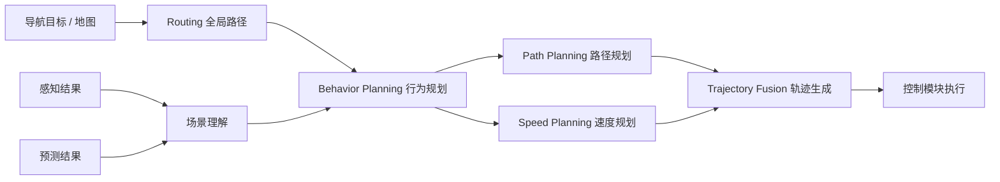
```mermaid
graph LR
    A[导航目标 / 地图] --> B[Routing 全局路径]
    C[感知结果] --> D[场景理解]
    E[预测结果] --> D
    B --> F[Behavior Planning 行为规划]
    D --> F
    F --> G[Path Planning 路径规划]
    F --> H[Speed Planning 速度规划]
    G --> I[Trajectory Fusion 轨迹生成]
    H --> I
    I --> J[控制模块执行]
```

这个分层本质上是在降低问题复杂度。因为“驾驶”如果一次性直接求解，往往是高维、强约束、强交互、实时性要求极高的问题。分层之后，每一层只需要处理自己最关键的决策。

<div id="chapter-24-docs-03-3-1-md-s05" class="doc-anchor doc-anchor-section doc-anchor-level-3"></div>

### 2.2 一个规划器到底在做什么

从更操作化的角度看，一个规则型规划器往往同时在做下面几件事：

1. **接收输入**：地图、参考线、感知障碍物、预测轨迹、交通规则、自车状态。
2. **构造搜索空间或优化空间**：例如网格图、状态格、Frenet 采样空间、ST 图。
3. **定义约束**：碰撞约束、道路边界约束、车辆曲率约束、加速度约束、红灯停车线约束等。
4. **定义代价函数**：偏离车道中心代价、接近障碍物代价、轨迹不平滑代价、变道代价、低效率代价等。
5. **生成候选方案**：通过搜索、采样或迭代优化得到一批可行路径/轨迹。
6. **选择最优结果**：在满足硬约束前提下，选出总代价最低的方案。

这和 2D 目标检测里“特征提取 + 候选建模 + 分类回归 + 后处理”的流程有点像：**规划系统也不是一步做完，而是在候选空间中逐步缩小搜索范围。**

<div id="chapter-24-docs-03-3-1-md-s06" class="doc-anchor doc-anchor-section doc-anchor-level-3"></div>

### 2.3 Cartesian 与 Frenet 坐标系

在道路场景中，直接在笛卡尔坐标系（Cartesian）里做规划当然可以，但往往不够自然。因为车辆不是在空旷平面中随意移动，而是大多沿着道路中心线附近行驶。

因此很多规则型规划系统会引入 **Frenet 坐标系**：

- $s$：沿参考线前进方向的纵向坐标。
- $l$：相对参考线的横向偏移。

这样做的好处是：

- 跟车、超车、借道、回正等行为可以更自然地表述为纵向与横向问题。
- 障碍物位置可以投影到参考线附近，方便判断其“在前方多远、离本车道多偏”。
- 很多局部规划问题能从二维耦合问题，转化为更容易处理的纵横向分解问题。

例如：

- “前方 25 米有慢车”可以表述为 `s` 方向上的约束。
- “向左借 0.8 米绕开路边施工锥桶”可以表述为 `l` 方向上的偏移。

当然，Frenet 也不是万能的。它通常更适合**结构化道路场景**，如果到了停车场、广场、狭窄非规则空间，参考线本身就可能不稳定，这时 Frenet 表达会变得别扭。

> [!TIP]
> **Frenet 坐标系的本质，不是数学花样，而是一种“顺着道路思考问题”的表达方式。只要道路结构明显，它就往往比直接在平面直角坐标里搜索更高效。**

<div id="chapter-24-docs-03-3-1-md-s07" class="doc-anchor doc-anchor-section doc-anchor-level-3"></div>

### 2.4 参考线、障碍物投影与时空解耦

规则型规划里还有三个很重要的工程概念：

- **参考线（Reference Line）**：当前车道或目标车道的中心线，是很多局部规划的基准。
- **障碍物投影（Obstacle Projection）**：把障碍物投影到参考线或 ST 图中，得到其相对位置关系。
- **时空解耦（Path-Speed Decoupling）**：先规划空间路径，再规划速度曲线，或者交替迭代求解两者。

时空解耦尤其重要。因为完整轨迹本质上是“位置随时间变化”的函数，如果一步求解，维度和约束都会迅速膨胀。先把“绕不绕、往哪绕”解决，再去做“快一点还是慢一点”，通常更利于实时实现。

---

<div id="chapter-24-docs-03-3-1-md-s08" class="doc-anchor doc-anchor-section doc-anchor-level-2"></div>

## 3. 经典方法谱系：为什么会发展成现在这样

<div id="chapter-24-docs-03-3-1-md-s09" class="doc-anchor doc-anchor-section doc-anchor-level-3"></div>

### 3.1 图搜索思想：Dijkstra 与 A*

在最基础层面，规划可以被看作一个搜索问题：从起点状态出发，在允许的状态转移中找到一条代价最小的路径。

- **Dijkstra**：不依赖启发式函数，系统性地扩展当前累计代价最小的节点，最终能找到全局最优路径。
- **A\***：在累计代价 `g(n)` 基础上，加入到目标点的启发式估计 `h(n)`，通过

$$
f(n) = g(n) + h(n)
$$

来优先扩展“看起来更接近终点”的节点。

它们解决的问题是：**在离散图或网格图中，如何高效找到一条从起点到终点的低代价路径。**

典型流程可以概括为：

1. 建图或栅格化环境。
2. 从起点开始扩展可达节点。
3. 维护 `open set` 和 `closed set`。
4. 根据代价不断更新父节点与最优路径。
5. 到达目标后回溯得到最终路径。

它们的优势是：

- 思路清晰，实现直接。
- 适合做全局路径搜索。
- 容易把地图障碍、静态代价编码进去。

它们的局限是：

- 通常默认点质量模型，不考虑车辆转弯半径、朝向连续性等约束。
- 栅格分辨率一高就会带来较大搜索开销。
- 对道路车辆而言，搜索出的折线结果往往还需要进一步平滑。

所以，Dijkstra 和 A* 更像是规则型规划的起点，而不是量产轨迹规划的终点。

<div id="chapter-24-docs-03-3-1-md-s10" class="doc-anchor doc-anchor-section doc-anchor-level-3"></div>

### 3.2 Hybrid A*：把车辆运动学约束带进搜索

普通 A* 最大的问题在于，它找到的路径未必是“车能开过去的路径”。例如在狭窄场景中，网格上的折线路径可能要求车辆瞬间改变朝向，这显然不符合非完整约束车辆的运动规律。

**Hybrid A\*** 的核心改进，就是把状态从二维位置 `(x, y)` 扩展为包含航向角的连续状态，例如 `(x, y, \theta)`，并在节点扩展时使用一组符合车辆模型的 motion primitives。

它解决的问题是：

- 让搜索过程显式考虑最小转弯半径、前进/倒车切换、方向连续性。
- 使搜索结果更接近“可直接被车辆执行”的路径。

简化理解下，它的工作流是：

1. 用车辆运动学模型定义可扩展动作。
2. 在离散搜索框架中扩展连续姿态状态。
3. 加入倒车惩罚、换向惩罚、曲率惩罚等代价项。
4. 搜索到目标附近后，常配合解析连接或平滑优化得到最终路径。

它的典型代价设计常包括：

- 路径长度代价。
- 倒车代价。
- 方向切换代价。
- 曲率或曲率变化代价。
- 距离障碍物过近代价。

Hybrid A* 的优势非常明显：

- 对停车、掉头、窄路会车等低速复杂机动很有效。
- 结果比普通 A* 更符合车辆可行驶性。
- 兼顾了一定搜索全局性与运动学约束。

但它也有现实问题：

- 搜索维度更高，计算量显著上升。
- 在高速结构化道路中，不一定是最高效的选择。
- 最终路径仍常需后续平滑与速度规划配合。

> [!TIP]
> **Hybrid A* 很适合用来理解“规划不是几何画线，而是受车辆本体约束的可执行路径设计”。在泊车和窄空间 maneuver 中，它的重要性尤其高。**

<div id="chapter-24-docs-03-3-1-md-s11" class="doc-anchor doc-anchor-section doc-anchor-level-3"></div>

### 3.3 Frenet + Lattice Planning：道路场景中的结构化采样

当场景从停车场切换到城市道路或高速道路时，问题特点发生了变化：

- 道路结构更明显。
- 自车大部分时间沿参考线附近行驶。
- 决策重点从“能不能过去”逐渐转为“怎么在交通流中更平顺地过去”。

这时候，**Lattice Planning（格点/采样规划）** 往往比纯状态搜索更自然。

它的核心思想是：

- 在 Frenet 空间中围绕参考线采样一批候选终点或候选轨迹。
- 用多项式、样条曲线等方法生成满足边界条件的候选路径。
- 对每条候选路径做碰撞检测和代价评估。
- 选择最优可行解。

它解决的问题是：

- 在结构化道路中高效生成一组“像人开的”候选路径。
- 将横向偏移、纵向进度、回到车道中心等驾驶偏好自然编码进代价函数。

一个常见的简化版流程是：

1. 选定当前参考线。
2. 在若干纵向距离和横向偏移位置上采样终点。
3. 生成满足起终状态约束的候选曲线。
4. 剔除与障碍物碰撞或超出道路边界的路径。
5. 用代价函数对剩余候选排序。

典型代价项可能包括：

- 偏离参考线中心代价。
- 横向加速度和曲率变化代价。
- 与静态/动态障碍物的安全距离代价。
- 变道代价或借道代价。
- 轨迹长度与效率代价。

Lattice Planning 的优势在于：

- 很适合结构化车道场景。
- 候选集可控，工程实现清晰。
- 容易把舒适性和驾驶风格显式写进代价函数。

它的局限在于：

- 采样不充分可能漏掉可行解，采样过密又会影响实时性。
- 对参考线质量比较敏感。
- 面对强交互动态场景时，仅靠静态采样可能不够。

<div id="chapter-24-docs-03-3-1-md-s12" class="doc-anchor doc-anchor-section doc-anchor-level-3"></div>

### 3.4 EM Planner：路径与速度的交替优化

在自动驾驶规划工程中，`EM Planner` 是一个很有代表性的思路。这里的 “EM” 并不一定要严格理解成统计学习里那个标准化的 Expectation-Maximization 算法，而更适合理解为一种**交替迭代、逐步逼近可行解的工程范式**。

它的核心思想是：

- 先在路径空间里基于障碍物和道路边界找到一条较优路径；
- 再在速度空间里基于时空约束找到一条较优速度曲线；
- 然后利用更新后的结果继续反过来约束另一侧，进行迭代优化。

它解决的问题是：

- 动态障碍物使“路径”和“速度”强耦合，单独做其中一项都可能不够。
- 直接联合优化复杂度过高，而交替求解能在工程上取得较好平衡。

在实际系统中，常见表示方式包括：

- 在 SL（纵向-横向）空间处理路径边界与绕障问题。
- 在 ST（距离-时间）空间处理跟车、让行、超车、停车等速度决策问题。

EM Planner 的优势是：

- 工程结构清晰，容易与地图、预测、行为规划模块配合。
- 对道路场景中的路径-速度解耦很实用。
- 能较好地融合“规则约束 + 代价优化”两种思路。

它的难点也很实际：

- 路径和速度并非真正独立，交替优化未必能得到全局最优。
- 预测误差会直接影响 ST 约束质量。
- 代价设计和边界处理稍有不当，就可能出现保守、犹豫或振荡。

> [!TIP]
> **很多成熟规划系统并不是依赖单一“神奇算法”，而是把搜索、采样、边界构造、速度优化、规则过滤组合在一起。EM Planner 体现的正是这种工程组合思维。**

---

<div id="chapter-24-docs-03-3-1-md-s13" class="doc-anchor doc-anchor-section doc-anchor-level-2"></div>

## 4. 规则型规划中的关键工程问题

这一节往往比“算法名字”本身更重要。因为在真实自动驾驶系统中，决定体验差异的，常常不是用了 A* 还是 Lattice，而是**约束怎么建、代价怎么配、动态障碍怎么处理、系统如何避免抖动和僵死**。

<div id="chapter-24-docs-03-3-1-md-s14" class="doc-anchor doc-anchor-section doc-anchor-level-3"></div>

### 4.1 约束建模：什么不能做

规划中的硬约束通常包括：

- **碰撞约束**：轨迹不能穿过障碍物占据区域。
- **道路边界约束**：不能越出可通行区域，除非显式允许借道。
- **车辆运动学约束**：曲率不能过大，转向变化不能超出底盘能力。
- **动力学约束**：加速度、减速度、jerk 不能过于激烈。
- **交通规则约束**：红灯、停车线、限速、禁止变道区域等必须满足。

这些约束中，前几类更多是“物理做不到”，后几类则更多是“法规或策略上不允许”。规则型规划的一个关键优点，就是这两类约束都能被显式表达。

<div id="chapter-24-docs-03-3-1-md-s15" class="doc-anchor doc-anchor-section doc-anchor-level-3"></div>

### 4.2 代价函数设计：在多个“都不错”的方案里怎么选

一条规划轨迹往往不是“唯一可行”，而是在很多可行方案中选一个更合适的。于是代价函数就变成了规则型规划的核心。

常见代价项包括：

- **安全性代价**：离障碍物太近、切入风险高、与预测轨迹冲突时惩罚增加。
- **舒适性代价**：横向加速度过大、jerk 过大、曲率变化剧烈时惩罚增加。
- **效率代价**：过慢、停滞、无必要等待、绕行过远都会带来代价。
- **可执行性代价**：过于激进的轨迹可能控制难度高，也应被惩罚。
- **行为一致性代价**：频繁变道、刚决定借道又立即回正，会被视为不稳定。

真正困难的地方不在于“列出这些项”，而在于**不同代价之间如何权衡**。例如：

- 安全权重太高，系统可能过度保守，通行效率很差。
- 效率权重太高，系统可能出现激进并线或过晚减速。
- 舒适性权重太高，系统可能宁可停住也不愿做必要机动。

这也是为什么规则型规划经常需要大量仿真调参与路测迭代。

<div id="chapter-24-docs-03-3-1-md-s16" class="doc-anchor doc-anchor-section doc-anchor-level-3"></div>

### 4.3 动态障碍物处理：最难的不只是“绕开”，而是“判断对方会怎么动”

静态障碍物处理相对直接，因为其占据区域基本固定；动态障碍物则完全不同。规划系统需要结合预测模块输出，推断：

- 前车会不会继续减速。
- 邻车会不会加塞。
- 行人是否准备横穿。
- 对向来车是否会影响借道时机。

规则型规划面对动态障碍物时，常用的工程手段包括：

- 在 ST 图中表达障碍物的可占据时空区域。
- 设置跟车时距、安全缓冲区和让行规则。
- 通过行为层先确定“跟”“让”“绕”“停”的大方向，再由轨迹层细化。

这里最大的风险是：**预测不准，规划就容易失真。**  
因此，成熟系统往往不会盲信某一条预测轨迹，而是加入保守边界、多假设评估或安全冗余。

<div id="chapter-24-docs-03-3-1-md-s17" class="doc-anchor doc-anchor-section doc-anchor-level-3"></div>

### 4.4 多解选择与轨迹抖动

规则型规划常见一个工程问题：每一帧重规划时，候选方案都略有变化，如果系统总是贪心地选当前最优解，就可能产生：

- 轨迹左右轻微摆动。
- 变道意图反复横跳。
- 绕障方案来回切换。
- 控制层收到不连续参考轨迹。

这类问题通常被称为**规划抖动（planning jitter）**或决策不稳定。

常见缓解手段包括：

- 对行为状态加入滞回机制（hysteresis）。
- 对变道、借道、超车等行为设置最小持续时间。
- 在代价函数中加入与上一帧结果的连续性约束。
- 对候选解做时序平滑，而不是每帧完全重来。

很多时候，用户感知到的“这车开得像不像人”，其实和这个问题高度相关。

<div id="chapter-24-docs-03-3-1-md-s18" class="doc-anchor doc-anchor-section doc-anchor-level-3"></div>

### 4.5 结构化道路与非结构化场景差异

规则型规划在高速和城市车道内表现通常更好，因为这里有稳定的：

- 车道线
- 中心线
- 限速规则
- 交通流方向

但一旦到了停车场、工地、无保护左转混乱路口、临时改道区域，很多前提都会被削弱。此时会出现：

- 参考线难定义。
- 他车行为不规范。
- 候选空间更大，规则更难写全。

所以规则型规划并不是“所有场景同一种套路”。很多系统会在结构化与非结构化区域使用不同规划模式，甚至切换不同子模块。

<div id="chapter-24-docs-03-3-1-md-s19" class="doc-anchor doc-anchor-section doc-anchor-level-3"></div>

### 4.6 长尾场景与规则爆炸

规则型规划最大的长期挑战之一，是**规则爆炸（rule explosion）**。

每当系统在某个边缘场景出错，最自然的工程反应往往是“补一条规则”。短期有效，但长期可能造成：

- 条件分支越来越多。
- 规则之间相互冲突。
- 局部修复破坏全局一致性。
- 维护和调试成本越来越高。

这也是为什么后来越来越多研究开始尝试把学习方法引入规划层，用数据去补足显式规则不擅长覆盖的长尾交互。

---

<div id="chapter-24-docs-03-3-1-md-s20" class="doc-anchor doc-anchor-section doc-anchor-level-2"></div>

## 5. 规则型与学习型规划的边界

规则型规划和学习型规划并不是简单的“旧技术”和“新技术”关系，更像是两类不同的能力分配方式。

规则型规划擅长：

- 显式表达安全边界和法规约束。
- 在确定性较强的场景里稳定输出。
- 做工程验证、故障复现和回归测试。

学习型规划擅长：

- 从数据中提炼复杂交互模式。
- 处理难以手写规则覆盖的长尾驾驶行为。
- 在端到端建模中减少人工特征与人工规则设计。

规则型规划的弱点主要在于：

- 难以完整编码人类驾驶中的隐性博弈与社会默契。
- 面对复杂交互时可能显得保守或僵硬。
- 需要大量人工维护规则和代价。

因此，在很多现实系统中，二者并不是互斥关系，而可能形成互补：

- 用学习模块做预测、场景理解或候选生成。
- 用规则型规划做安全约束、可解释决策与最终裁决。

这也是下一节 [3.2_学习型算法.md](#chapter-25-docs-03-3-2-md) 要讨论的问题背景。

> [!TIP]
> **可以把规则型规划看作“会开得稳、会守规矩”，把学习型规划看作“更可能学会复杂交互经验”。真正成熟的系统，往往是在可控性与泛化能力之间找平衡。**

---

<div id="chapter-24-docs-03-3-1-md-s21" class="doc-anchor doc-anchor-section doc-anchor-level-2"></div>

## 6. 评估指标、工程选型与学习路径

<div id="chapter-24-docs-03-3-1-md-s22" class="doc-anchor doc-anchor-section doc-anchor-level-3"></div>

### 6.1 规划系统看什么指标

规划模块的评估方式和感知任务很不一样，它更关注轨迹是否真的适合拿去开。

- **安全性**：碰撞率、最小障碍物距离、违规率、闯红灯/压线等约束违反情况。
- **舒适性**：纵向加速度、横向加速度、jerk、曲率变化是否平滑。
- **效率**：平均速度、任务完成时间、拥堵中通过率、无谓等待时间。
- **稳定性**：轨迹连续性、重规划抖动、行为切换频率。
- **实时性**：单周期规划时延、最坏情况时延、CPU/GPU 占用。

对于量产系统来说，一个“理论上更优”的方法，如果无法稳定满足实时性，也很难真正落地。

<div id="chapter-24-docs-03-3-1-md-s23" class="doc-anchor doc-anchor-section doc-anchor-level-3"></div>

### 6.2 常见规则型方法对比

| 方法 | 核心思想 | 主要优势 | 主要局限 | 典型适用场景 |
| :--- | :--- | :--- | :--- | :--- |
| **Dijkstra / A\*** | 图搜索与启发式搜索 | 结构清晰、全局路径搜索直接 | 不天然考虑车辆运动学，结果常需平滑 | 全局路径、静态地图搜索 |
| **Hybrid A\*** | 搜索中加入航向与车辆约束 | 可行驶性更强，适合窄空间 maneuver | 计算量更高，高速道路未必最优 | 泊车、掉头、狭窄区域低速规划 |
| **Lattice Planning** | 在 Frenet 空间采样候选轨迹并打分 | 结构化道路中高效、易融入舒适性偏好 | 依赖采样设计与参考线质量 | 城市道路、高速跟车、绕障、变道 |
| **EM Planner** | 路径与速度交替优化 | 工程组合能力强，适合复杂约束整合 | 依赖预测与代价设计，未必全局最优 | 成熟自动驾驶栈中的局部规划主线 |

这个表格有一个很重要的启示：**规划算法并不是谁“先进”谁就全面替代谁，而是不同方法擅长不同问题形态。**

<div id="chapter-24-docs-03-3-1-md-s24" class="doc-anchor doc-anchor-section doc-anchor-level-3"></div>

### 6.3 一个推荐的学习顺序

如果你是第一次系统学习自动驾驶规划，比较推荐按下面顺序推进：

1. 先理解规划系统分层：Routing、Behavior、Path、Trajectory 各自做什么。
2. 学懂 A* 与 Dijkstra，建立“规划就是搜索/优化”的基本认识。
3. 学懂 Frenet 坐标系和参考线，理解为什么道路规划喜欢做坐标变换。
4. 学 Hybrid A*，理解运动学约束为何重要。
5. 学 Lattice Planning，理解采样、候选轨迹与代价函数。
6. 学 ST 图和路径-速度解耦，再看 EM Planner 这类工程系统。
7. 最后再进入学习型规划，理解为什么规则型方法会在长尾场景遇到困难。

<div id="chapter-24-docs-03-3-1-md-s25" class="doc-anchor doc-anchor-section doc-anchor-level-3"></div>

### 6.4 推荐项目与资料

- [Apollo](https://github.com/ApolloAuto/apollo)：工业级自动驾驶系统，规划模块很有代表性。
- [PythonRobotics](https://github.com/AtsushiSakai/PythonRobotics)：用可视化示例讲清经典规划算法，非常适合入门。
- [Autoware](https://github.com/autowarefoundation/autoware)：开源自动驾驶软件栈，可参考其规划与行为模块设计。

<div id="chapter-24-docs-03-3-1-md-s26" class="doc-anchor doc-anchor-section doc-anchor-level-3"></div>

### 6.5 小结与实践建议

规则型规划值得长期学习，不只是因为它“经典”，更因为它训练的是一种非常重要的工程能力：**把驾驶行为拆成可表示、可约束、可优化、可验证的问题。**

对初学者来说，建议始终带着下面几个问题去读算法：

1. 这个方法到底在解决哪一层规划问题？
2. 它的搜索空间或优化空间是什么？
3. 它显式处理了哪些约束，又忽略了哪些约束？
4. 它为什么适合某些场景，却不适合另一些场景？
5. 如果放进真实自动驾驶系统里，它最可能卡在什么工程问题上？

当你能把这些问题讲清楚时，规则型规划就不再只是“会背几个算法名”，而是真正进入了自动驾驶规划系统的工程语境。


---

<!-- Source: docs/03_自动驾驶规划算法/3.2_学习型算法.md -->

<div id="chapter-25-docs-03-3-2-md" class="doc-anchor doc-anchor-chapter doc-anchor-level-1"></div>

# 3.2 学习型算法

随着深度学习、强化学习和数据驱动决策方法的发展，越来越多研究开始尝试把“学习能力”引入自动驾驶规划模块内部，用数据去补足纯规则系统在复杂交互、长尾场景和隐式驾驶经验建模上的不足。

但这里有一个边界必须先讲清楚：**本节讨论的学习型算法，不是“从原始相机图像直接输出方向盘和油门”的端到端驾驶，是默认感知、定位、预测、地图等上游结果已经存在，重点讨论规划模块内部如何学习决策、轨迹评分、策略选择和值函数。**

换句话说，规则型规划更像是在回答：

- 已知环境约束后，怎样显式设计规则和代价函数。
- 怎样从候选轨迹中选出一条安全、可行、舒适的轨迹。

而学习型规划更像是在回答：

- 这些规则和代价函数能不能从数据中学出来。
- 面对复杂交互和长尾场景，系统能不能学会“更像有经验的驾驶员那样”做取舍。
- 在显式搜索之外，能不能学习一个策略、一个价值函数，或者一个更合理的候选排序器。

**可以把学习型规划理解为“把规划中的一部分人工设计，替换成可从数据中拟合的模型”。它不一定完全替代规则型规划，但它试图把那些很难手写、很难穷尽、很依赖经验的部分交给数据驱动方法。**

> [!TIP]
> **学习到底被放进了规划链条的哪一段？**  
> 它可以学动作，可以学轨迹评分，可以学奖励函数，可以学搜索启发，也可以学交互中的博弈偏好。不同放置位置，对应的工程风险和收益完全不同。

---

<div id="chapter-25-docs-03-3-2-md-s02" class="doc-anchor doc-anchor-section doc-anchor-level-2"></div>

## 1. 学习型规划在自动驾驶中的职责

在典型自动驾驶系统里，规划模块接收的是结构化场景输入，而不是原始传感器信号。例如：

- 自车状态：位置、速度、航向角、加速度、历史轨迹。
- 路网与地图信息：参考线、车道拓扑、限速、路口语义、可行驶区域。
- 障碍物状态：周围车辆、行人、自行车等目标的位置、速度和类别。
- 预测结果：其他交通参与者未来可能轨迹、占据区域或意图估计。
- 交通规则状态：红绿灯、停车线、让行关系、禁止变道区域等。

在这些输入已经存在的前提下，学习型规划通常承担以下几类职责：

- 学习高层行为决策，例如“跟车、超车、让行、并线、绕障、停车等待”。
- 学习候选轨迹的评分函数，判断哪条轨迹更合理。
- 学习价值函数或策略函数，避免每次都靠手工搜索和手工打分。
- 学习对复杂交互的偏好，例如面对加塞车辆是让还是争，面对路口对向来车是停还是过。
- 学习启发式信息，帮助搜索过程更快收敛到有价值的候选区域。

和规则型规划相比，学习型规划的吸引力主要来自以下几个方面：

- 它更容易吸收人类驾驶数据中的隐式经验。
- 它更适合建模“多个合理答案都存在”的规划问题。
- 它在复杂交互中，往往比固定阈值和固定代价函数更灵活。
- 它有机会缓解规则爆炸和人工调参膨胀问题。

但它的困难也同样突出：

- 学到的策略不天然可解释。
- 闭环性能不一定能从离线误差直接看出来。
- 安全约束不能仅靠“模型大概会学会”来保证。
- 数据偏差、奖励设计和仿真偏差都可能把系统带偏。

因此，学习型规划在自动驾驶中的真实角色，通常不是“替代一切”，而是**在规则型系统很难写好、很难调好、很难覆盖好的地方提供增益**。

---

<div id="chapter-25-docs-03-3-2-md-s03" class="doc-anchor doc-anchor-section doc-anchor-level-2"></div>

## 2. 基础问题建模：状态、动作、轨迹、代价、策略

<div id="chapter-25-docs-03-3-2-md-s04" class="doc-anchor doc-anchor-section doc-anchor-level-3"></div>

### 2.1 规划里的学习对象到底是什么

和 2D 目标检测里“输入图像，输出框和类别”不同，规划问题首先要说清楚：**模型到底在学什么。**

在学习型规划中，常见的基本概念有：

- `state`：当前规划时刻系统所看到的结构化状态。
- `action`：规划模块在当前状态下做出的动作选择。
- `trajectory`：一段带有空间路径和时间参数的未来运动方案。
- `cost`：对轨迹“好不好”的评分标准，越低通常表示越优。
- `reward`：强化学习中对动作结果的反馈，越高通常表示越好。
- `value`：从当前状态继续执行某种策略后，未来累计回报的估计。
- `policy`：从状态映射到动作的规则，可以是显式公式，也可以是神经网络。

其中最容易混淆的是 `cost / reward / value / policy`：

- **`cost`** 更像规则型规划熟悉的“代价函数”，用于给候选轨迹打分。
- **`reward`** 是强化学习中的即时反馈，强调“做了这个动作之后系统得到了什么评价”。
- **`value`** 是从当前状态往后看，未来长期好坏的预期。
- **`policy`** 则直接告诉系统“在这个状态下应该做什么”。

如果把规则型规划看作“人工定义 `cost`，再做搜索和优化”，那么学习型规划的核心变化就是：

- 不再只手工写 `cost`，而是尝试从数据中学习 `cost`。
- 不再只手工设计候选排序器，而是尝试学习一个 `policy` 或 `value`。
- 不再只用启发式经验决定搜索顺序，而是尝试学习“哪些分支更值得探索”。

<div id="chapter-25-docs-03-3-2-md-s05" class="doc-anchor doc-anchor-section doc-anchor-level-3"></div>

### 2.2 `state` 和 `action` 在规划里怎么定义

学习型规划之所以比图像分类难，一个重要原因在于 `state` 和 `action` 的定义本身就不唯一。

`state` 可以定义得很“局部”：

- 当前参考线附近的障碍物位置。
- 前车距离和相对速度。
- 当前车道可行驶长度。
- 左右车道可用性。

也可以定义得很“场景化”：

- 一段局部地图拓扑。
- 多个目标的历史轨迹和预测轨迹集合。
- 交通信号和路权关系。
- 自车历史决策上下文。

`action` 也有多种粒度：

- 离散行为：保持车道、左变道、右变道、停车、绕障。
- 轨迹参数：目标速度、目标时距、横向偏移量、轨迹控制点。
- 候选选择：从已有轨迹集合中选一条。
- 连续控制变量：加速度、转角、曲率变化。

但在自动驾驶规划工程里，更常见、更稳定的做法是：**优先让学习模块输出行为层动作、轨迹参数或候选排序结果，而不是直接让它裸输出最底层控制量。**

原因并不神秘：

- 行为层和轨迹层更容易加安全约束。
- 候选轨迹的几何可行性更容易事先保证。
- 学出来的结果更容易和现有规则系统拼接。
- 调试时更容易判断错误出在行为选择还是轨迹细节。

<div id="chapter-25-docs-03-3-2-md-s06" class="doc-anchor doc-anchor-section doc-anchor-level-3"></div>

### 2.3 规划为什么天然适合“多解建模”

在很多感知任务里，答案更接近“唯一正确”。例如一个物体是不是车，通常有比较清晰的标注答案。

但规划不是这样。面对同一个状态，常常存在多条都合理的轨迹：

- 跟车时，可以轻微减速，也可以提前松油门。
- 绕障时，可以稍微左绕，也可以稍微右绕。
- 并线时，可以立即并，也可以等待一个更大的时隙。

也就是说，规划问题天然具有：

- **多模态性**：多个动作都可能合理。
- **长期性**：当前动作的好坏依赖未来一段时间的累计结果。
- **交互性**：其他交通参与者会因为自车动作而改变行为。

这也是为什么规划问题里，单纯最小化一步误差往往不够。一个轨迹点位误差更小的策略，不一定在闭环驾驶中更安全、更稳健、更像人类驾驶。

> [!TIP]
> **规划不是“猜专家下一帧怎么打方向盘”这么简单。**  
> 它更像是在学习：在一组可行但互相竞争的方案中，什么样的长期取舍更合理。

---

<div id="chapter-25-docs-03-3-2-md-s07" class="doc-anchor doc-anchor-section doc-anchor-level-2"></div>

## 3. 方法谱系与经典工作

学习型规划的发展，并不是“一条技术路线不断升级”，而是围绕几个关键问题反复演进：

- 能不能直接模仿专家行为。
- 能不能学出比手写规则更好的轨迹评分函数。
- 能不能通过强化学习得到长期最优策略。
- 能不能让学习模块辅助搜索与博弈决策。
- 能不能把学习模块和规则系统安全地拼起来。

下面按这个谱系展开。

<div id="chapter-25-docs-03-3-2-md-s08" class="doc-anchor doc-anchor-section doc-anchor-level-3"></div>

### 3.1 学习模仿专家规划器或人类驾驶员

最直接的想法，是把规划看成一个监督学习问题：

- 输入当前结构化状态。
- 输出专家在该状态下的动作、行为选择或轨迹。

这条路线通常被称为 **模仿学习（Imitation Learning）** 或 **行为克隆（Behavior Cloning）**。

它的直觉非常简单：

- 如果专家在大量场景下做了好决策，
- 那么让模型学习“状态到动作”的映射，
- 理论上就能复制专家经验。

这条路线的优点很明显：

- 不需要自己设计复杂奖励。
- 容易利用离线人类驾驶数据或高质量规划器输出。
- 训练形式接近常见监督学习，工程门槛相对低。

但它的核心缺陷也非常经典：**分布偏移（distribution shift）**。

训练时，模型只看到专家轨迹附近的状态；一旦部署后稍微犯错，它就会进入训练中很少出现的偏离状态，而这些状态下它又缺乏经验，于是误差被不断放大，最终形成闭环崩溃。

<div id="chapter-25-docs-03-3-2-md-s09" class="doc-anchor doc-anchor-section doc-anchor-level-4"></div>

#### 经典工作：ALVINN

`ALVINN`（Autonomous Land Vehicle In a Neural Network）是自动驾驶历史上非常早期的代表工作之一。它常被视作“从示范中学习驾驶映射”的早期典型。

它真正重要的地方，不是今天看来模型多先进，而是它非常早就提出了一个后来不断被重复验证的思想：

> 驾驶中的某些决策关系，不一定非要全部手工写出来，也可以从示范数据中学习。

当然，从今天视角看，ALVINN 的局限也非常明显：

- 状态表达和网络能力都很有限。
- 泛化范围有限。
- 缺乏后来的闭环稳健性分析。

所以在本节里，它更像是一个“思想起点”而不是工程答案。它说明了模仿学习路线为什么会在自动驾驶里反复出现。

<div id="chapter-25-docs-03-3-2-md-s10" class="doc-anchor doc-anchor-section doc-anchor-level-4"></div>

#### 经典工作：DAgger

如果说行为克隆暴露出最大问题是闭环分布偏移，那么 `DAgger`（Dataset Aggregation）就是这条路线中最关键的里程碑之一。

它为什么重要，不在于“把监督学习换了个写法”，而在于它第一次非常明确地对这个问题动手：

- 先让学习器按当前策略去 rollout。
- 在学习器访问到的状态上，由专家重新给出动作标签。
- 把这些新状态和专家动作继续加入训练集。
- 反复迭代，让训练分布逐步接近真实闭环运行分布。

它背后的逻辑非常深刻：

- 行为克隆失败，不只是模型容量不够。
- 更重要的是训练数据分布和部署时状态分布不一致。
- 所以问题不只是“拟合专家动作”，而是“让模型在自己会到达的状态上也学会正确动作”。

DAgger 对自动驾驶规划学习的启发非常大：

- 它让人们意识到闭环学习比单纯离线回归更关键。
- 它推动了后续很多“在线纠偏”“专家干预补充数据”“主动采样困难状态”的思路。
- 它提醒我们：规划问题里的数据集，不只是样本量问题，更是状态覆盖问题。

但 DAgger 本身也有现实局限：

- 需要专家在 learner rollout 过程中持续标注。
- 对自动驾驶这类高成本场景来说，数据采集与干预代价很高。
- 如果专家本身并不稳定，或者场景复杂到专家难以快速一致标注，训练质量会受影响。

因此，在工程上，模仿学习通常很少以“纯行为克隆”结束，而是会进一步结合安全过滤、轨迹候选约束或价值评估模块。

<div id="chapter-25-docs-03-3-2-md-s11" class="doc-anchor doc-anchor-section doc-anchor-level-3"></div>

### 3.2 学习代价函数 / 评分函数

规则型规划的一个核心前提，是人工定义一套代价函数：

- 离障碍物越近，代价越高。
- 轨迹越不平滑，代价越高。
- 偏离车道中心越远，代价越高。
- 效率太低，代价也应增加。

但问题是，这套代价函数往往很难一次写对。尤其在复杂交互中，人类驾驶员的真实偏好并不总能被几个加权项精确表达。

于是就有了第二条重要路线：**保留搜索或优化框架，但把“打分标准”交给学习。**

这样做的好处是：

- 候选轨迹依然可以由可解释、可约束的方法生成。
- 学习模块只负责判断“这些候选里哪条更像专家、更合理”。
- 既利用了规则系统的安全边界，又引入了数据驱动偏好。

<div id="chapter-25-docs-03-3-2-md-s12" class="doc-anchor doc-anchor-section doc-anchor-level-4"></div>

#### 为什么“学代价”往往比“直接学动作”更稳

直接学动作有一个明显问题：输出空间往往很敏感，稍微偏一点，闭环误差就可能累积。

而学习代价函数有一个天然缓冲层：

- 系统先生成多条物理可行、规则可接受的候选轨迹。
- 学习模块只在这些候选中进行评分和排序。
- 即便评分器不完美，前面的候选生成与安全过滤也能提供下限保护。

这就是为什么在工业系统中，学习评分器、学习 risk model、学习 interaction score 往往比“完全端到端替代搜索器”更容易落地。

<div id="chapter-25-docs-03-3-2-md-s13" class="doc-anchor doc-anchor-section doc-anchor-level-4"></div>

#### 经典工作：Maximum Entropy IRL

逆强化学习（Inverse Reinforcement Learning, IRL）要解决的问题，不是“专家在这个状态下做了什么”，而是：

> 能不能反推出一个奖励函数，使得专家行为在这个奖励下显得合理。

`Maximum Entropy IRL` 是这一方向中最经典的代表之一。它的重要性主要体现在两个层面：

第一，它承认规划是多解的。  
同一个场景下，专家不一定永远走唯一轨迹。如果直接把专家轨迹当唯一正确答案，学习会变得僵硬。Maximum Entropy IRL 通过最大熵建模，允许在“高奖励区域”内存在多种合理策略，而不是强迫模型只记一条轨迹。

第二，它把问题从“学动作”转成了“学偏好”。  
这对规划特别重要，因为驾驶中的很多经验本质上是偏好问题：

- 是更偏向保守，还是更偏向效率。
- 是更提前减速，还是更靠近停车线再减速。
- 是给旁车多留空间，还是更积极利用可用时隙。

Maximum Entropy IRL 的工程意义在于：

- 它更贴近规划中“多个合理解共存”的事实。
- 它允许在后续仍使用搜索和优化器，只是把奖励函数换成学习得到的版本。
- 它对舒适性、礼让性、社会驾驶风格等难以手写的偏好建模尤其有吸引力。

但它的问题也同样明显：

- 计算代价高。
- 奖励学习往往需要反复求解内层规划问题。
- 一旦环境模型或候选分布不准，学到的奖励也可能偏。

<div id="chapter-25-docs-03-3-2-md-s14" class="doc-anchor doc-anchor-section doc-anchor-level-4"></div>

#### 经典工作：Guided Cost Learning

`Guided Cost Learning` 可以视作“把深度模型带入代价学习”的代表性工作。它试图学习一个更灵活的非线性 cost function，而不是依赖人工设计的简单加权项。

它为什么值得特别讲？

- 因为它说明了：学习模块不一定非得输出动作，也可以输出“轨迹有多好”。
- 它让 cost learning 从浅层特征走向更强表达能力的函数近似。
- 它特别适合规划场景中那些规则难写清、但偏好又确实存在的部分。

从规划角度看，Guided Cost Learning 的价值在于：

- 学到的不是单一轨迹模板，而是“什么样的轨迹更值得偏好”。
- 它更容易嵌入已有优化框架。
- 它能把专家风格、舒适性和交互偏好编码到评分函数里。

但这类方法也要面对现实难题：

- 如果训练数据风格单一，学到的 cost 可能带有强偏置。
- 学到的 cost 缺乏可解释性，调试难度比人工代价项大得多。
- 学到的偏好未必和安全需求完全一致，因此仍需要硬约束兜底。

<div id="chapter-25-docs-03-3-2-md-s15" class="doc-anchor doc-anchor-section doc-anchor-level-3"></div>

### 3.3 学习策略或价值函数

第三条路线更进一步：既然规划是顺序决策问题，那么能不能直接学一个策略 `policy`，或者学一个长期价值估计 `value`？

这就进入了强化学习（Reinforcement Learning, RL）视角。

强化学习之所以对规划天然有吸引力，是因为规划本来就具备 RL 的典型结构：

- 当前状态下要选动作。
- 动作会影响未来状态。
- 好坏不能只看眼前，要看长期累计结果。

这和纯监督学习最大的区别在于：

- 模仿学习学习的是“专家做了什么”。
- 强化学习学习的是“什么行为长期回报最高”。

<div id="chapter-25-docs-03-3-2-md-s16" class="doc-anchor doc-anchor-section doc-anchor-level-4"></div>

#### 经典过渡：DeepTraffic 与早期 CARLA RL 驾驶尝试

像 `DeepTraffic` 这类早期工作，以及后来很多基于 `CARLA` 的 RL 驾驶实验，并不一定都是规划内部学习的终极答案，但它们起到了非常重要的启蒙作用：

- 它们让很多研究者直观看到，驾驶可以被表述为顺序决策问题。
- 它们说明 RL 可以学会跟车、换道、避让等基础行为。
- 它们也暴露出一个残酷事实：在仿真里看起来学会了，不等于真实复杂交通里就能稳定泛化。

这类工作的意义，不在于量产可用，而在于让人们更清楚地看到 RL 在自动驾驶中的两面性：

- 一方面，它非常适合建模长期回报和交互策略。
- 另一方面，它极其依赖奖励设计、仿真环境和安全探索机制。

<div id="chapter-25-docs-03-3-2-md-s17" class="doc-anchor doc-anchor-section doc-anchor-level-4"></div>

#### 连续动作与经典算法：DDPG、PPO、SAC

在自动驾驶规划中，动作空间往往不是简单离散标签，而是连续变量，例如：

- 纵向加速度。
- 目标速度。
- 横向偏移。
- 轨迹参数。

这就是 `DDPG`、`PPO`、`SAC` 这类方法经常被拿来讨论的原因。

- **DDPG** 强调连续动作空间下的 actor-critic 学习，适合处理连续控制与连续规划参数。
- **PPO** 以训练稳定性著称，更新策略时更保守，常作为很多 RL 驾驶实验的可靠基线。
- **SAC** 通过最大熵目标鼓励探索，在样本效率和训练稳定性上通常表现较强。

从规划视角看，这些算法的重要性不只是“它们是 RL 教科书里的名字”，而是它们对应了三个现实问题：

1. **为什么连续动作空间重要**  
   自动驾驶规划很少只做“左、右、停”这种简单选择，更多时候需要决定连续速度和轨迹参数，因此离散动作方法很快会遇到表达瓶颈。

2. **为什么策略稳定性重要**  
   规划不是玩游戏，一次训练不稳定就可能导致轨迹振荡、急加急减和危险策略。PPO、SAC 之所以常被使用，很大程度上就是因为它们在复杂任务上更容易训练出相对平滑的策略。

3. **为什么样本效率和安全探索是问题**  
   自动驾驶不可能在真实道路上靠“乱试”来学策略，因此很多 RL 方法即便理论上适合，也只能主要依赖仿真或离线数据。

这些方法的局限也要说清楚：

- 奖励设计稍有偏差，策略就会“钻空子”。
- 仿真里成立的最优策略，未必能迁移到现实世界。
- 闭环表现常常对环境建模细节极其敏感。
- 真实系统很难接受不可预测的探索行为。

所以在自动驾驶里，强化学习更常见的角色往往是：

- 用于局部决策策略研究。
- 用于仿真场景中的策略验证。
- 用于学习 value / policy 先验，辅助搜索或行为选择。

而不是直接、无保护地替代整条规划主线。

<div id="chapter-25-docs-03-3-2-md-s18" class="doc-anchor doc-anchor-section doc-anchor-level-3"></div>

### 3.4 学习搜索启发、候选排序与博弈交互

很多时候，规划系统并不缺候选轨迹，而是缺：

- 哪些候选更值得先搜。
- 哪些行为分支更可能成功。
- 在存在他车博弈时，哪些意图判断更可信。

于是第四条路线出现了：**让学习模块辅助搜索和交互决策，而不是完全替代它们。**

<div id="chapter-25-docs-03-3-2-md-s19" class="doc-anchor doc-anchor-section doc-anchor-level-4"></div>

#### 学习辅助搜索：MCTS + learned prior/value

把 `MCTS`（Monte Carlo Tree Search）和 learned prior / value 结合，是一个非常有代表性的思想。

这里真正有价值的不是某一篇具体论文名称，而是这套组合逻辑：

- 搜索负责显式展开未来分支。
- prior 网络告诉搜索器哪些动作更值得优先尝试。
- value 网络估计某个中间状态的长期价值，减少昂贵 rollout。

这类思想对规划的意义在于：

- 纯搜索在复杂交通博弈中分支爆炸严重。
- 纯学习策略又容易失去安全可控性。
- 把学习模型变成“搜索加速器”和“估值器”，往往是更现实的折中。

对于自动驾驶场景，这意味着：

- 学习模型可以帮助快速筛掉明显差的候选。
- 搜索器则保留对约束、未来分支和安全边界的显式处理能力。

<div id="chapter-25-docs-03-3-2-md-s20" class="doc-anchor doc-anchor-section doc-anchor-level-4"></div>

#### POMDP、意图估计与交互博弈

自动驾驶规划中的很多难题，本质上是**不确定性下的交互决策**：

- 遮挡后面的来车是否存在。
- 邻车到底想不想并线。
- 行人是准备过街，还是只是站在路边。
- 对向车辆会不会礼让。

这类问题常常被建模为 `POMDP` 或更一般的不完全信息博弈问题。困难不在于“求最短路径”，而在于：

- 系统看到的是不完整状态。
- 其他交通参与者具有自己的意图。
- 自车动作还会反过来影响对方行为。

在这类问题中，学习模块常见的作用包括：

- 学习 intent prediction，估计对方意图分布。
- 学习 belief update，帮助系统维护隐藏状态估计。
- 学习 value function，用于快速评估某类交互局面的长期收益。
- 学习 ranking model，决定某些让行/抢行/并线机会的优先级。

这条路线的重要性在于，它更接近自动驾驶最“人味”的部分：

- 不是单纯避障。
- 而是处理带有社会互动色彩的驾驶决策。

但它也最难：

- 数据很难覆盖真实博弈的全部模式。
- 交互结果对长时序依赖很强。
- 学到的模型可能把局部经验误当成普遍规律。

<div id="chapter-25-docs-03-3-2-md-s21" class="doc-anchor doc-anchor-section doc-anchor-level-3"></div>

### 3.5 混合式学习规划

从工程落地角度看，最有现实意义的往往不是纯模仿学习、纯 RL 或纯 IRL，而是**混合式方案**。

所谓混合式学习规划，核心思想是：

- 把学习放在它擅长的地方。
- 把硬约束、安全边界和最后裁决留给规则或优化器。

常见形态包括：

- 学习模块预测 `cost / risk / interaction score`，优化器负责生成并筛选轨迹。
- 学习模块生成少量高质量候选，规则系统做碰撞检查和安全裁决。
- 学习模块给出行为先验，规则系统再结合交通法规做最终决策。
- 学习模块估计他车意图或交互价值，规划器基于这些估计做搜索和优化。

这种结构之所以常见，是因为它兼顾了两点：

- 学习模块可以建模复杂偏好和交互经验。
- 规则模块还能守住最低安全边界与可验证性。

从工业视角看，这条路线最像“能逐步上车”的方案。因为它不要求团队一次性推翻已有规划栈，而是允许在现有系统上逐步插入学习模块，观察它带来的增益和风险。

> [!TIP]
> **很多真正有价值的学习型规划工作，并不是“把整个规划器换成神经网络”，而是把学习模型嵌进原有规划栈中最难手工设计的环节。**

---

<div id="chapter-25-docs-03-3-2-md-s22" class="doc-anchor doc-anchor-section doc-anchor-level-2"></div>

## 4. 训练方式与评估方法

<div id="chapter-25-docs-03-3-2-md-s23" class="doc-anchor doc-anchor-section doc-anchor-level-3"></div>

### 4.1 训练数据从哪里来

学习型规划的数据来源通常有三类：

- 人类驾驶数据。
- 高质量规则规划器或专家系统生成的数据。
- 仿真环境中的交互数据。

不同来源有明显差别：

- 人类驾驶数据更接近真实分布，但风格不统一、噪声较大。
- 专家规划器数据更一致，但可能把原有规则系统偏差一起继承下来。
- 仿真数据易于批量生成，但和真实世界存在分布鸿沟。

这意味着，训练数据的核心问题从来不只是“够不够多”，还包括：

- 是否覆盖困难交互状态。
- 是否包含失败恢复样本。
- 是否存在大量保守风格或激进风格偏置。
- 是否能代表系统真实部署时会访问到的闭环状态。

<div id="chapter-25-docs-03-3-2-md-s24" class="doc-anchor doc-anchor-section doc-anchor-level-3"></div>

### 4.2 开环训练为什么不等于闭环可用

学习型规划最常见的误区之一，是把离线预测误差当成最终能力。

例如：

- 轨迹点均方误差更低。
- 行为分类准确率更高。
- 候选排序命中率更好。

这些都重要，但它们只能说明模型在**数据集分布上回放时**表现不错，并不能自动推出闭环驾驶就一定更好。

原因在于闭环系统会出现反馈：

- 模型当前动作会改变未来状态分布。
- 一次小偏差可能导致后续全部输入发生改变。
- 其他交通参与者会根据自车动作产生反应。

所以规划系统真正关心的，不只是“我有没有预测中专家下一步”，而是“我按照这个策略持续开下去会不会安全、稳定、有效率”。

<div id="chapter-25-docs-03-3-2-md-s25" class="doc-anchor doc-anchor-section doc-anchor-level-3"></div>

### 4.3 常见评估指标

学习型规划的评估，通常需要把开环和闭环分开看。

**开环指标**常包括：

- `ADE / FDE`：轨迹平均误差与终点误差。
- 候选排序准确率或 top-k 命中率。
- 行为分类准确率。
- 代价预测误差或 preference consistency。

这些指标适合：

- 快速比较模型拟合能力。
- 检查训练是否收敛。
- 判断表示学习是否有效。

但它们不能代替闭环评估。

**闭环指标**更接近真实规划目标：

- 碰撞率。
- 越线率、压线率、交通规则违反率。
- 接管率或任务失败率。
- 平均速度、通过效率、任务完成率。
- 舒适性指标：加速度、横向加速度、jerk、轨迹抖动。
- 行为稳定性：是否频繁变道、频繁取消动作、频繁犹豫。

这里最关键的一句判断是：

> **开环好，不等于闭环好。**

这几乎是所有学习型规划研究都绕不开的现实。

<div id="chapter-25-docs-03-3-2-md-s26" class="doc-anchor doc-anchor-section doc-anchor-level-3"></div>

### 4.4 奖励设计与离线数据偏差

模仿学习主要担心分布偏移，强化学习主要担心奖励设计，而离线学习还会额外遇到数据偏差问题。

典型风险包括：

- 奖励函数把“快速通过”权重设得太高，导致策略过于激进。
- 奖励函数只惩罚碰撞，但对逼停、急刹、插缝没有足够约束。
- 离线数据几乎都是保守驾驶，于是策略学得过于畏缩。
- 数据集缺少失败恢复样本，导致模型一旦偏离就不会自救。

这些问题说明，训练学习型规划器并不是把通用深度学习流水线搬过来那么简单。规划任务里的每个标签、每个奖励项、每个场景分布，都会在闭环中被放大。

---

<div id="chapter-25-docs-03-3-2-md-s27" class="doc-anchor doc-anchor-section doc-anchor-level-2"></div>

## 5. 规划内部学习的关键难点

<div id="chapter-25-docs-03-3-2-md-s28" class="doc-anchor doc-anchor-section doc-anchor-level-3"></div>

### 5.1 闭环分布偏移

这是模仿学习最经典、也最根本的问题。

训练时模型只看专家会访问的状态；部署时模型会访问“自己造成的状态”。两者不一致，就会导致误差逐步积累。

这也是为什么：

- 纯行为克隆通常只适合作为起点。
- DAgger 一类方法如此重要。
- 很多工程系统需要加入恢复数据、干预采样和闭环仿真验证。

<div id="chapter-25-docs-03-3-2-md-s29" class="doc-anchor doc-anchor-section doc-anchor-level-3"></div>

### 5.2 多车交互与反事实难题

自动驾驶规划中的很多高难场景都带有反事实性质：

- 如果我更早减速，对方会不会先过去。
- 如果我开始并线，邻车会让还是会加速。
- 如果我停住等待，后车会不会绕行。

这些问题很难仅通过静态监督标签回答，因为数据里只记录了真实历史发生的一条轨迹，而没有记录“如果当时做了别的动作会怎样”。

这就是为什么规划学习比感知学习更难：

- 监督标签不完整。
- 未发生动作的结果不可见。
- 多主体交互让因果关系更复杂。

<div id="chapter-25-docs-03-3-2-md-s30" class="doc-anchor doc-anchor-section doc-anchor-level-3"></div>

### 5.3 安全约束不能只靠模型“自己学会”

模型可以学到驾驶风格和局部偏好，但不能理所当然地假设它一定会可靠守住硬安全边界。

例如：

- 最小安全距离。
- 不可碰撞约束。
- 车辆动力学极限。
- 红灯停车线约束。

这些约束在量产系统中通常仍然需要显式存在。也正因为如此，纯学习型规划常常要和规则过滤、优化器、shielding 或安全检查器结合使用。

<div id="chapter-25-docs-03-3-2-md-s31" class="doc-anchor doc-anchor-section doc-anchor-level-3"></div>

### 5.4 可解释性与调试难度

规则型规划出错时，很多时候可以直接问：

- 是哪条规则触发错了。
- 是哪个代价权重不合理。
- 是哪个约束没加上。

但学习型规划出错时，问题往往变成：

- 是训练数据偏了。
- 是闭环状态覆盖不够。
- 是奖励函数诱导错了。
- 是 value 估计错误。
- 是 ranking model 在某些长尾交互上完全没见过。

这使得调试成本显著上升，也意味着验证体系必须更强。

<div id="chapter-25-docs-03-3-2-md-s32" class="doc-anchor doc-anchor-section doc-anchor-level-3"></div>

### 5.5 仿真到现实的鸿沟

很多学习型规划工作都依赖仿真，因为：

- 仿真便于采集大规模交互数据。
- 仿真可以做安全探索。
- 仿真适合 RL rollout。

但仿真中的交通参与者行为模型、地图规则、噪声分布，和真实世界总会有差距。这种差距一旦进入规划模块，影响往往很直接：

- 模型在仿真里学会了某种“有效策略”。
- 到现实中，对方车辆和行人的反应方式变了。
- 原本看似稳定的策略突然失效。

因此，学习型规划的可信落地，往往离不开：

- 更真实的仿真。
- 更强的 domain randomization。
- 更谨慎的闭环验证。
- 更严格的安全兜底。

---

<div id="chapter-25-docs-03-3-2-md-s33" class="doc-anchor doc-anchor-section doc-anchor-level-2"></div>

## 6. 与规则型规划的关系及混合方案

<div id="chapter-25-docs-03-3-2-md-s34" class="doc-anchor doc-anchor-section doc-anchor-level-3"></div>

### 6.1 二者不是替代关系

规则型规划和学习型规划并不是简单的“旧技术”和“新技术”关系。

规则型规划擅长：

- 显式编码安全约束。
- 可解释、可验证、可做回归测试。
- 在结构化道路场景中稳定可靠。

学习型规划擅长：

- 从数据中吸收复杂交互经验。
- 建模难以手写的行为偏好和社会驾驶风格。
- 在长尾场景中提供更灵活的启发和评分能力。

真正现实的判断通常是：

- 如果问题是“硬约束必须满足”，规则型更可信。
- 如果问题是“多个可行解里哪个更自然”，学习型更有潜力。

<div id="chapter-25-docs-03-3-2-md-s35" class="doc-anchor doc-anchor-section doc-anchor-level-3"></div>

### 6.2 为什么混合式方案更像工业答案

纯规则系统会遇到规则爆炸，纯学习系统又会遇到安全与验证难题，所以很多工程系统更偏向混合方案。

典型组合方式有：

- 规则模块生成候选，学习模块打分。
- 学习模块给行为先验，规则模块做最后裁决。
- 学习模块估计交互风险，优化器在该估计基础上求轨迹。
- 学习模块做排序与搜索启发，规则模块做硬约束检查。

这种方式的价值在于：

- 逐步引入学习能力，而不是整栈推倒重来。
- 能明确控制学习模块影响范围。
- 更容易做 A/B 对比与回归验证。

<div id="chapter-25-docs-03-3-2-md-s36" class="doc-anchor doc-anchor-section doc-anchor-level-3"></div>

### 6.3 一个实用的理解框架

可以把规划系统粗略分成三层来看：

1. **底线层**  
   谁来守住“绝不能碰”的边界。这里通常更适合规则、约束和安全检查器。

2. **候选层**  
   谁来提出可行轨迹或可行动作集合。这里规则和学习都可以参与。

3. **偏好层**  
   谁来判断“更像经验丰富驾驶员的选择”。这里学习型方法往往最有价值。

很多学习型规划真正发挥作用的地方，恰恰就在第三层。

---

<div id="chapter-25-docs-03-3-2-md-s37" class="doc-anchor doc-anchor-section doc-anchor-level-2"></div>

## 7. 学习路径与参考资料

<div id="chapter-25-docs-03-3-2-md-s38" class="doc-anchor doc-anchor-section doc-anchor-level-3"></div>

### 7.1 一个推荐的学习顺序

如果你已经读过 `3.1_规则型算法.md`，比较推荐按下面顺序继续学习：

1. 先明确规则型规划里哪些部分是人工设计的：规则、候选轨迹、代价函数、排序器。
2. 再看学习型规划到底想替代哪一部分：动作、代价、价值、排序还是交互先验。
3. 先学模仿学习和 DAgger，理解闭环分布偏移。
4. 再学 IRL 和 cost learning，理解为什么“学偏好”有时比“学动作”更自然。
5. 再看 RL 中的 value / policy 思想，理解长期回报和交互博弈。
6. 最后回到工程现实，理解为什么混合式方案更容易落地。

<div id="chapter-25-docs-03-3-2-md-s39" class="doc-anchor doc-anchor-section doc-anchor-level-3"></div>

### 7.2 推荐阅读方向

- [DAgger: A Reduction of Imitation Learning and Structured Prediction to No-Regret Online Learning](https://proceedings.mlr.press/v15/ross11a.html)
- [Maximum Entropy Inverse Reinforcement Learning](https://www.cs.cmu.edu/~bziebart/publications/maxentirl-bziebart.pdf)
- [Guided Cost Learning: Deep Inverse Optimal Control via Policy Optimization](https://arxiv.org/abs/1603.00448)
- [Deep Deterministic Policy Gradient (DDPG)](https://arxiv.org/abs/1509.02971)
- [Proximal Policy Optimization (PPO)](https://arxiv.org/abs/1707.06347)
- [Soft Actor-Critic (SAC)](https://arxiv.org/abs/1801.01290)

如果想把理论和代码直觉结合起来，也可以继续参考：

- [Apollo](https://github.com/ApolloAuto/apollo)
- [Autoware](https://github.com/autowarefoundation/autoware)
- [CARLA](https://carla.org/)
- [PythonRobotics](https://github.com/AtsushiSakai/PythonRobotics)

<div id="chapter-25-docs-03-3-2-md-s40" class="doc-anchor doc-anchor-section doc-anchor-level-3"></div>

### 7.3 小结与实践建议

学习型规划真正值得学习的，不只是因为它“用了神经网络”，而是因为它迫使我们重新思考规划问题中的几个核心事实：

1. 规划不是单步分类，而是长期顺序决策。
2. 规划不是唯一正确答案，而是多解竞争下的偏好选择。
3. 规划不是纯几何问题，而是包含交互、博弈和不确定性的决策问题。
4. 规划不是只看离线误差，而是必须经受闭环反馈检验。

对初学者来说，读完这一节后最值得反复问自己的不是“我记住了多少模型名字”，而是下面这些问题：

1. 这个学习模块到底替代了规划器中的哪一块人工设计？
2. 它学的是动作、代价、价值还是排序？
3. 它如何面对闭环分布偏移和多车交互？
4. 它的安全边界是靠什么保证的？
5. 它更适合成为独立规划器，还是规则系统中的一个子模块？

当你能把这些问题讲清楚时，学习型规划对你来说就不再只是“又一组 AI 方法”，而是真正进入了自动驾驶规划系统的工程语境。


---

<!-- Source: docs/04_端到端自动驾驶算法/4.1_端到端.md -->

<div id="chapter-26-docs-04-4-1-md" class="doc-anchor doc-anchor-chapter doc-anchor-level-1"></div>

# 4.1 传统端到端自动驾驶

在自动驾驶的发展史里，端到端方法一直是一个极具吸引力、又极具争议的方向。它吸引人的地方在于：如果一个模型能够直接从传感器观测中学习到驾驶行为，那么大量手工设计的模块接口、规则拼接和代价函数调参，也许都可以被更统一的数据驱动范式替代。它有争议的地方在于：自动驾驶不是一个“把图像分类做得更准一点”的问题，而是一个高安全、强闭环、强交互、强长尾的问题。于是，端到端驾驶很早就提出了一个根本性问题：

> **自动驾驶到底能不能被建模为“从观测到动作”的统一映射？如果能，这个映射学到的究竟是控制、规划，还是更深层的隐式世界结构？**

本节不讨论后续引入语言推理的 `VLA` 范式，也不讨论显式未来生成的世界模型，而是聚焦于**传统/经典端到端自动驾驶**：即从传感器、状态和导航先验出发，直接预测控制量、轨迹或规划变量的学习式驾驶系统。你可以把它理解为从模块化驾驶迈向“大一统驾驶模型”的第一阶段。

`End-to-end` 可以粗略理解为两条主线的演进：

1. **直接动作回归/经典 imitation learning 路线**：强调从观测直接学习控制或轨迹。
2. **带中间结构或多任务约束的端到端路线**：仍然端到端训练，但引入 BEV、可行驶区域、目标点、占用、辅助任务等软结构，提高泛化与闭环稳定性。

本章读完之后，你需要回答下面几个问题：

- 端到端驾驶和模块化驾驶到底区别在哪？
- 端到端方法到底在学什么？
- 为什么很多方法最后又重新引入中间表征？
- 为什么开环误差小，不一定意味着闭环表现好？
- 为什么这一方向会很自然地走向世界模型与 `VLA`？

---

<div id="chapter-26-docs-04-4-1-md-s02" class="doc-anchor doc-anchor-section doc-anchor-level-2"></div>

## 1. 定义、边界与问题背景

<div id="chapter-26-docs-04-4-1-md-s03" class="doc-anchor doc-anchor-section doc-anchor-level-3"></div>

### 1.1 什么是传统端到端自动驾驶

在本章中，我们把“传统端到端自动驾驶”定义为：

> **用一个统一的可学习系统，把传感器观测、历史上下文和导航先验，直接映射为控制量、轨迹或规划相关输出，而不再依赖人工串联的完整感知-预测-规划接口。**

这里的“端到端”有两个常见误解，需要先澄清：

- **误解一：端到端等于只输入单目图像，只输出转角和油门。**  
  这只是最早期、最简形式的一种实现。现代端到端方法通常输入多相机、历史帧、车速、导航目标，输出也常常是未来轨迹、waypoints、BEV occupancy 或 planning tokens，而不是裸控制量。
- **误解二：端到端等于完全没有结构。**  
  真正成功的现代方法，很少是“纯黑盒无结构”的。它们往往只是**减少人工模块边界**，但会通过网络结构、辅助任务、监督设计、时序建模和安全约束，重新引入归纳偏置。

<div id="chapter-26-docs-04-4-1-md-s04" class="doc-anchor doc-anchor-section doc-anchor-level-3"></div>

### 1.2 它与模块化自动驾驶的本质差异

模块化系统通常把自动驾驶拆成：

- 感知：检测、分割、跟踪、地图理解
- 预测：其他交通参与者未来行为
- 规划：行为决策、轨迹生成、代价优化
- 控制：转角、油门、制动执行

<div align="center">
  
</div>


端到端系统则试图把其中一部分甚至大部分链路收拢到统一模型中。两者的差异，不只是“模块数量不同”，更是**建模哲学不同**：

- 模块化系统强调**显式分解**、可解释接口和工程可控性。
- 端到端系统强调**联合优化**、隐式表示学习和数据驱动对齐。

<div id="chapter-26-docs-04-4-1-md-s05" class="doc-anchor doc-anchor-section doc-anchor-level-3"></div>

### 1.3 为什么端到端方法会持续出现

端到端驾驶反复成为热点，是因为模块化系统长期面临几个结构性问题：

- 中间接口可能丢信息：检测框、语义 mask、规则标签不一定保留了规划真正需要的全部信息。
- 误差逐级传递：上游小偏差可能在后续链路被放大。
- 手工规则扩张严重：复杂交互和长尾场景很难靠规则穷举。
- 模块目标与最终驾驶目标不一致：感知指标变好，不一定闭环驾驶变好。

端到端方法的核心吸引力，正是希望通过**面向最终驾驶目标的联合学习**，缓解这些问题。

<div id="chapter-26-docs-04-4-1-md-s06" class="doc-anchor doc-anchor-section doc-anchor-level-3"></div>

### 1.4 与世界模型、VLA 的边界

为了避免概念混淆，可以先看看下面这张表。
**但我希望你在对这个领域有所了解后忘了它，因为他们其实互相耦合，很难严格区分**

| 范式 | 主要输入 | 主要输出 | 核心能力 | 是否强调未来生成 | 是否引入语言闭环 |
|---|---|---|---|---|---|
| 模块化自动驾驶 | 多传感器 + 地图 | 感知结果、预测、轨迹、控制 | 显式任务分解与工程可控 | 否 | 否 |
| 传统端到端驾驶 | 观测 + 历史 + 导航先验 | 控制、轨迹、规划变量 | 统一学习观测到驾驶行为的映射 | 通常不显式强调 | 否 |
| 世界模型 | 观测 + 动作 + 状态 | 未来状态、未来特征、未来视频/latent | 环境演化建模与反事实预测 | 是 | 否 |
| `VLA` | 视觉 + 语言 + 状态 | 动作、策略、解释、规划指令 | 语言引导决策与推理闭环 | 可有可无 | 是 |

这也是本章与后续章节的分工：

- `4.1` 关注“从观测到动作/轨迹”的端到端映射；
- `4.2` 关注“未来如何演化”的世界建模；
- `4.3` 关注“语言如何进入决策闭环”的 `VLA`。

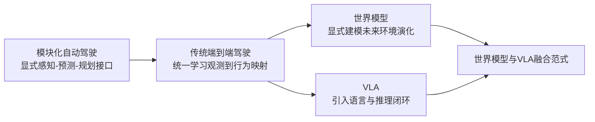
```mermaid
graph LR
    A[模块化自动驾驶<br/>显式感知-预测-规划接口] --> B[传统端到端驾驶<br/>统一学习观测到行为映射]
    B --> C[世界模型<br/>显式建模未来环境演化]
    B --> D[VLA<br/>引入语言与推理闭环]
    C --> E[世界模型与VLA融合范式]
    D --> E
```

---

<div id="chapter-26-docs-04-4-1-md-s07" class="doc-anchor doc-anchor-section doc-anchor-level-2"></div>

## 2. 统一问题建模：端到端到底在学什么

<div id="chapter-26-docs-04-4-1-md-s08" class="doc-anchor doc-anchor-section doc-anchor-level-3"></div>

### 2.1 输入、输出与目标函数

从数学上看，传统端到端驾驶可以被抽象为：

$$
\pi_\theta : (o_{\le t}, h_t, n_t) \mapsto y_t
$$

其中：

- $o_{\le t}$ 表示当前及历史观测，可能包含多相机图像、激光雷达表示、BEV 特征等；
- $h_t$ 表示历史状态，如车速、航向角、历史轨迹、时序记忆；
- $n_t$ 表示导航或高层意图先验，如 route command、goal point、lane-level instruction；
- $y_t$ 则可能是控制、轨迹、占用或其他规划相关变量。

常见目标可以写成两类：

$$
p(a_t \mid o_{\le t}, n_t, h_t)
$$

或

$$
p(\tau_t \mid o_{\le t}, n_t, h_t)
$$

其中：

- $a_t$ 是瞬时动作，如 steering、throttle、brake；
- $\tau_t$ 是未来轨迹或一组 waypoints，通常更稳定、更接近规划语义。

<div id="chapter-26-docs-04-4-1-md-s09" class="doc-anchor doc-anchor-section doc-anchor-level-3"></div>

### 2.2 现代端到端常见输入

早期方法常使用单帧前视相机，但现代方法更常见的输入已经明显更加丰富：

- 多相机环视图像
- 历史多帧时序输入
- 自车状态：速度、加速度、航向角
- 导航信息：高层 turn command、goal point、route polyline
- 可选先验：粗地图、局部 BEV、历史目标点

<div id="chapter-26-docs-04-4-1-md-s10" class="doc-anchor doc-anchor-section doc-anchor-level-3"></div>

### 2.3 常见输出形式

输出形式决定了模型到底更像“控制器”还是“规划器”。

| 输出形式 | 典型内容 | 优点 | 局限 |
|---|---|---|---|
| 直接控制 | 转角、油门、刹车 | 链路最短，概念最纯粹 | 对噪声敏感，监督不稳定，闭环脆弱 |
| **Waypoints/轨迹点**（核心） | 未来若干时刻位置点 | 更贴近规划语义，更易稳定训练 | 还需要下游控制器追踪 |
| 规划变量 | 目标点、可行驶区域、占用、成本图 | 引入结构偏置，利于泛化 | 已经不再是“纯黑盒” |
| 混合输出 | 轨迹 + 辅助任务 + 控制 | 常带来更强闭环表现 | 设计复杂，调参与数据要求高 |

<div id="chapter-26-docs-04-4-1-md-s11" class="doc-anchor doc-anchor-section doc-anchor-level-3"></div>

### 2.4 监督信号从哪里来

端到端模型虽然减少了人工模块接口，但并不等于可以摆脱监督设计。常见监督来源包括：

- **行为克隆（Behavior Cloning）**：用人类驾驶或专家规划器的动作/轨迹作为标签。
- **辅助任务监督**：语义分割、深度、可行驶区域、占用、碰撞风险等。
- **自监督时序约束**：跨帧一致性、时序特征预测、对比学习。
- **闭环奖励或仿真优化**：通过 RL、offline RL 或 planner-in-the-loop 方式优化长期行为。

这里可以把几类信号的分工理解得更清楚一些：

- `Behavior Cloning` 主要回答“专家在这个状态下通常怎么开”，因此更像是**单步监督学习**；
- `RL` 更关注“这一路开下来总效果好不好”，因此优化的是**长期累计回报**，而不是某一帧和标签是否完全一致；
- `offline RL` 则介于两者之间：它不要求车辆在线危险探索，而是尽量利用已有驾驶日志，在更强安全约束下学习长期行为改进；
- `planner-in-the-loop` 常常扮演折中角色：让学习系统既保留数据驱动能力，又能通过规划器或仿真器提供闭环修正信号。

端到端的关键是**不再把中间结构当成固定硬接口，而是把它们变成可学习、可软约束、可联合优化的内部结构。**

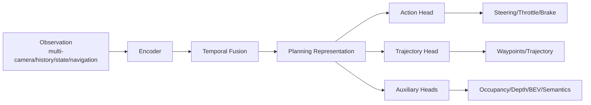
```mermaid
graph LR
    A[Observation<br/>multi-camera/history/state/navigation] --> B[Encoder]
    B --> C[Temporal Fusion]
    C --> D[Planning Representation]
    D --> E1[Action Head]
    D --> E2[Trajectory Head]
    D --> E3[Auxiliary Heads]
    E1 --> F[Steering/Throttle/Brake]
    E2 --> G[Waypoints/Trajectory]
    E3 --> H[Occupancy/Depth/BEV/Semantics]
```

---

<div id="chapter-26-docs-04-4-1-md-s12" class="doc-anchor doc-anchor-section doc-anchor-level-2"></div>

## 3. 方法主线一：直接动作回归与经典 imitation learning

这一主线最接近大家对“端到端驾驶”的原始印象：输入视觉观测，直接输出控制或路径。它也是 `End-to-end` 最基础的一条路线。

<div id="chapter-26-docs-04-4-1-md-s13" class="doc-anchor doc-anchor-section doc-anchor-level-3"></div>

### 3.1 基本思想

这一路线假设：

- 驾驶行为可以由数据中的专家示范提供监督；
- 模型可以从高维观测中直接学习状态到动作的映射；
- 如果数据足够多、模型足够强，那么许多难以手写的隐式规则也可以被吸收到参数中。

最经典的训练形式是行为克隆：

$$
\mathcal{L}_{BC} = \sum_t \ell(\hat{a}_t, a_t^\ast)
$$

或轨迹回归：

$$
\mathcal{L}_{traj} = \sum_t \ell(\hat{\tau}_t, \tau_t^\ast)
$$

其中 $a_t^\ast$ 或 $\tau_t^\ast$ 来自人类驾驶或专家系统。

但这套范式有一个天然边界：它擅长学“专家此刻做了什么”，却不一定擅长学“如果我已经有点偏了，接下来该怎么恢复”。一旦部署时进入训练集中较少出现的状态，模型就容易暴露出三个问题：

- **分布偏移**：训练时主要看到专家轨迹附近的状态，测试时却会遇到自己动作诱发的新状态；
- **恢复能力弱**：专家数据往往很少包含“犯错后如何救回来”的样本，因此模型缺乏纠偏经验；
- **单步拟合不等于长期最优**：某一时刻动作看起来很像专家，不代表几秒之后依然安全、平顺、符合导航意图。

也正因如此，很多端到端系统在 `Behavior Cloning` 打底之后，会进一步引入闭环训练、仿真扰动恢复，或用 `RL`/`offline RL` 去补足长期回报优化能力。

<div id="chapter-26-docs-04-4-1-md-s14" class="doc-anchor doc-anchor-section doc-anchor-level-3"></div>

### 3.2 代表性工作

<div id="chapter-26-docs-04-4-1-md-s15" class="doc-anchor doc-anchor-section doc-anchor-level-4"></div>

#### `ALVINN`

`ALVINN` 是极早期的代表性工作。今天看它的网络并不复杂，但它的重要意义不在于性能，而在于提出了一个后来被不断重复验证的思想：

> **驾驶中的部分策略映射，可以通过示范学习获得，而不必全部显式手写。**

它更像一个思想起点，而不是现代工程答案。
<div align="center">
  
</div>

- [ALVINN论文链接](https://kilthub.cmu.edu/articles/journal_contribution/ALVINN_an_autonomous_land_vehicle_in_a_neural_network/6603146/1?file=12093479)


<div id="chapter-26-docs-04-4-1-md-s16" class="doc-anchor doc-anchor-section doc-anchor-level-4"></div>

#### `PilotNet`

NVIDIA 的 `PilotNet` 让“前视图像 -> 转角预测”的范式广为人知。它把端到端驾驶清晰地塑造成一个监督学习问题，强调卷积特征可以直接支持转向控制预测。
- [The NVIDIA PilotNet Experiments](https://arxiv.org/abs/2010.08776)

它的历史意义在于：

- 证明了深度视觉特征对低层驾驶控制是有用的；
- 让“从感知直接到控制”的叙事变得非常直观；
- 同时也暴露出该路线对数据分布、恢复能力和闭环鲁棒性的高度敏感。


<div id="chapter-26-docs-04-4-1-md-s17" class="doc-anchor doc-anchor-section doc-anchor-level-3"></div>

### 3.3 优劣分析

| 优势 | 说明 |
| --- | --- |
| 路径最短 | 优化目标直接面向驾驶输出。 |
| 工程搭建速度快 | 不依赖复杂中间模块标注。 |
| 易于形成监督学习流水线 | 很容易与大规模驾驶日志结合。 |
| 能学习隐式驾驶习惯 | 能够学习一些难以显式编写的驾驶经验。 |

直接动作回归的困难并不只是“模型不够大”，更深的原因有三点：

| 根本问题 | 说明 |
| --- | --- |
| 控制量监督噪声大 | 同一场景下，不同驾驶员的瞬时转角和油门可能差异很大，但都合理。 |
| 动作空间过于低层 | 控制信号更像执行结果，而不是规划意图，学习信号不够稳定。 |
| 闭环分布偏移严重 | 训练时只看到专家分布，部署后模型一旦轻微偏离，就会进入自己没有见过的状态。 |

---

<div id="chapter-26-docs-04-4-1-md-s18" class="doc-anchor doc-anchor-section doc-anchor-level-2"></div>

## 4. 方法主线二：带中间结构或多任务约束的端到端路线

随着研究深入，大家逐渐发现：如果完全依赖“视觉到控制”的裸回归，模型很难在复杂城市驾驶中稳定泛化。于是出现了第二条更成熟的主线：

> **仍然保持端到端训练和统一目标，但在模型内部引入中间结构、辅助任务和规划偏置。**

这也是 `End-to-end` 方法最值得把握的精神内核。

<div id="chapter-26-docs-04-4-1-md-s19" class="doc-anchor doc-anchor-section doc-anchor-level-3"></div>

### 4.1 这里的“中间结构”是什么

<div align="center">
  
</div>

这些结构的作用，不是为了“回到模块化”，而是为了给模型提供更好的归纳偏置。

<div id="chapter-26-docs-04-4-1-md-s20" class="doc-anchor doc-anchor-section doc-anchor-level-3"></div>

### 4.2 为什么这些结构能帮助端到端

原因很朴素：

- 驾驶不是纯视觉分类，而是空间决策问题；
- 多视角信息需要统一坐标系或统一规划空间；
- 规划依赖几何、拓扑和未来可达性；
- 仅靠最终动作损失，模型很难知道“哪里看错了、哪里规划错了”。

因此，中间结构往往提供三种帮助：

- **表示帮助**：把图像表征变成更适合规划的空间表征；
- **优化帮助**：辅助损失改善梯度信号；
- **泛化帮助**：引入几何与语义归纳偏置。

<div id="chapter-26-docs-04-4-1-md-s21" class="doc-anchor doc-anchor-section doc-anchor-level-3"></div>

### 4.3 代表性工作

<div id="chapter-26-docs-04-4-1-md-s22" class="doc-anchor doc-anchor-section doc-anchor-level-4"></div>

#### `TransFuser(2021)`

`TransFuser` 可以看作“多传感器融合驱动的端到端 imitation learning”代表。它不再满足于“前视图像直接回归方向盘”，而是明确把**相机语义信息**和**激光雷达几何信息**放进同一个联合决策过程中，让模型在更早阶段就形成适合驾驶的空间理解。

它的关键做法，是为相机和激光雷达分别建立特征提取分支，然后在多个尺度上进行 Transformer 式的特征交互。这里的重点不只是“把两种模态拼起来”，而是让图像中的纹理、语义线索与激光雷达中的距离、结构线索在层级化融合中不断对齐。这样做的结果，是模型得到的内部表征不再只是“这张图像长什么样”，而更接近“场景空间里哪里有边界、哪里有障碍、哪里可能可通行”。
<div align="center">
  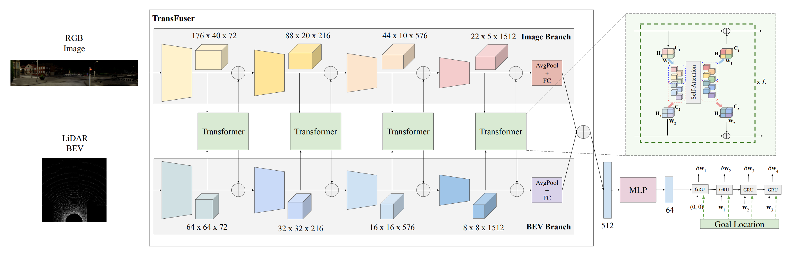
</div>

在输出端，`TransFuser` 也并不完全执着于控制量。它通常结合未来 waypoints 或轨迹中间目标，再由这些更稳定的规划变量映射到最终控制。与此同时，导航命令和车辆状态会作为条件输入加入模型，告诉系统当前应该直行、左转还是右转，从而减少交叉口等歧义场景里的一对多决策问题。

<div align="center">
  
</div>

从方法意义上看，`TransFuser` 代表的是一种非常重要的转向：端到端不一定意味着“只保留单一视觉流”，也可以通过跨模态融合把几何归纳偏置显式注入统一策略学习中。因此它比早期纯视觉控制回归更稳，原因并不只是模型更大，让驾驶策略在特征层面就看到了更可靠的空间结构。

- [TransFuser: Imitation with Transformer-Based Sensor Fusion for Autonomous Driving](https://arxiv.org/pdf/2205.15997)
- [TransFuser: 自动驾驶基于Transformer的传感器融合模仿](https://zhuanlan.zhihu.com/p/547802232)

> [!TIP]
> **Transfuser_backbone是Navsim数据集上非常常用的一个Backbone，大家可以重点关注一下**

<div id="chapter-26-docs-04-4-1-md-s23" class="doc-anchor doc-anchor-section doc-anchor-level-4"></div>

#### `UniAD(CVPR 2023 Best Paper)`

`UniAD` 更适合作为“统一自动驾驶任务建模”代表来理解。它虽然常被看作一套更完整的一体化自动驾驶框架，但如果从本节的主线出发，它最值得注意的地方在于：它没有简单地取消感知、预测、规划这些结构，而是把它们放进同一个可联合优化的表示空间中。

它的方法核心，是先把多视角观测提升到共享的 BEV 空间，再在这一空间上组织检测、跟踪、地图建模、运动预测、占用预测和规划等任务。也就是说，`UniAD` 并不是让规划头直接从原始图像“猜”出车辆该怎么走，而是先构建一个对驾驶更友好的场景表征：周围有哪些目标、它们历史上如何运动、未来可能去哪里、路网拓扑怎样、局部区域是否可达。

更关键的是，这些任务不是彼此隔离地各做各的，而是在统一表示上形成前后耦合。规划模块使用的不只是静态感知结果，而是包含交互、未来演化和可达性信息的共享场景状态；反过来，规划损失也会约束前面的表征学习，让整个系统朝“对最终驾驶最有用”的方向组织内部信息。`UniAD` 把传统流水线中的硬接口，改写成了端到端训练下的 soft interface。
<div align="center">
  
</div>

- 它把 BEV 作为统一任务坐标系，使不同任务可以围绕同一空间语义协同学习。
- 它说明预测和占用这类“中间任务”不是多余负担，而是在为规划提供因果上更有用的决策依据。
- 它让规划头建立在 richer scene understanding 之上，而不是直接从像素到动作做黑盒映射。
- 它的代价是训练链路更复杂、任务耦合更强，系统设计与调参成本也显著上升。

因此，UniAD的方法价值不只在于多任务做得全，而在于它清楚展示了现代端到端的一个核心事实：真正有效的统一模型，往往不是去掉结构，而是把结构变成共享空间、共享参数和共享优化目标中的可学习部件。

- [Planning-oriented Autonomous Driving](https://arxiv.org/abs/2212.10156)
- [UniAD：面向规划的端到端自动驾驶统一框架](https://blog.csdn.net/m0_65010824/article/details/155984533)
- [端到端自动驾驶Uniad详细讲解](https://zhuanlan.zhihu.com/p/642373931)
  
> [!TIP]
> **非常重量级的端到端自动驾驶经典工作，也因此被评为CVPR 2023 Best Paper**

<div id="chapter-26-docs-04-4-1-md-s24" class="doc-anchor doc-anchor-section doc-anchor-level-4"></div>

#### `SparseDrive(2024)`

`SparseDrive` 可以看作“稀疏结构化表示驱动的端到端规划”代表。相较于把整张 BEV 做成高密度特征图、再在 dense feature 上叠加越来越多任务，它更关心一个问题：在自动驾驶里，真正决定规划质量的，往往只是少量关键实体、关键拓扑和关键交互，那么能不能直接围绕这些关键元素建立统一表示？

它的答案是使用稀疏查询，也就是用 object query、map query、motion query、planning query 等少量 token 来表示场景中的核心对象与核心关系。这样一来，模型不再需要对整片空间做昂贵的逐像素推理，而是通过 query-based 交互，把“有哪些交通参与者”“哪些车道拓扑与我相关”“它们未来如何运动”“我车候选轨迹与环境如何约束”压缩进一个更紧凑的结构化 token 集合。

在这个框架里，规划模块直接在稀疏结构上推理 ego 未来轨迹。它使用的不是单纯的 dense BEV feature，而是经过筛选、聚合并带有关系语义的场景表示。这样做的价值并不只是节省算力，更重要的是让模型把注意力集中在真正影响驾驶决策的实体交互上，从而同时兼顾实时性、扩展性与决策有效性。

<div align="center">
  
</div>

- 它把统一建模从“高密度空间表征”推进到“关键实体驱动的稀疏表征”。
- 它通过 query-based 交互保留了场景结构信息，同时降低了全局 dense 计算负担。
- 它更容易沿着大模型方向扩展，因为稀疏 token 往往比高分辨率特征图更适合做长链路交互。
- 它的挑战在于：一旦关键查询设计不充分，或稀疏选择遗漏重要长尾目标，规划质量可能直接受损。
  
因此，SparseDrive 代表的是另一种非常有代表性的现代端到端思路：不是一味增加中间表征密度，而是主动寻找更适合规划的稀疏结构。它说明“中间结构”除了可以是稠密 BEV ，也可以是少量但高度信息化的场景 token。

- [SparseDrive: End-to-End Autonomous Driving via Sparse Scene Representation](https://arxiv.org/abs/2405.19620)
- [SparseDrive：通过稀疏场景表示实现端到端自动驾驶](https://zhuanlan.zhihu.com/p/16292018472)
- [SparseDrive - 清华地平线开源的e2e的框架](https://blog.csdn.net/zisuina_2/article/details/141957481)


> [!TIP]
> **SparseDrive的感知模块可以参考前面[2.2.1_3D目标检测-纯视觉](#chapter-15-docs-02-2-2-1-3d-md)中的Sparse4D系列工作**


<div align="center">
  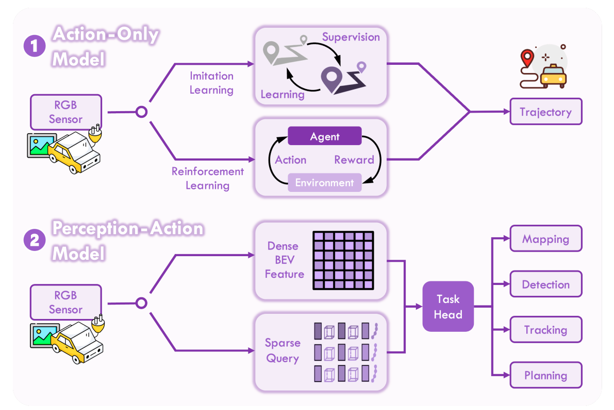
</div>

把这三篇工作放在一起看，会更容易理解“现代端到端到底在往哪里走”。`TransFuser` 强调的是**跨模态融合**，要把视觉与几何尽早对齐；`UniAD` 强调的是**统一任务栈**，要把感知、预测、占用、规划放进同一个共享表征(BEV特征)里；`SparseDrive` 强调的是**稀疏结构化表示**，要把真正重要的场景实体压缩成更适合规划推理的 token。这是三种很有代表性的论文。

| 工作 | 代表思路 | 核心表示/建模方式 | 主要优点 | 主要局限 |
| --- | --- | --- | --- | --- |
| `TransFuser` | 跨模态融合端到端驾驶 | 用 Transformer 在多尺度上融合相机语义特征与激光雷达几何特征，并结合 waypoint/导航条件完成规划与控制 | 显式利用视觉和几何互补信息，空间理解更稳，对复杂场景和障碍物更鲁棒 | 依赖多传感器配置，系统成本更高；融合设计和部署复杂度也更高 |
| `UniAD` | 统一任务栈的一体化自动驾驶 | 在共享 BEV 空间中联合建模检测、跟踪、地图、预测、占用和规划，通过端到端优化形成 soft interface | 场景理解最完整，规划直接建立在 richer scene understanding 之上，任务之间可以互相增益 | 训练链路长、耦合强，工程实现和调参成本很高，实时部署压力也更大 |
| `SparseDrive` | 稀疏结构化表示驱动规划 | 用 object query、map query、motion query、planning query 等稀疏 token 表示关键实体、拓扑与交互，再直接推理 ego 轨迹 | 计算更高效，更聚焦真正影响决策的关键对象，也更适合沿着大模型方向扩展 | 强依赖查询设计与稀疏选择质量，若遗漏关键长尾目标，规划性能会明显受影响 |

<div id="chapter-26-docs-04-4-1-md-s25" class="doc-anchor doc-anchor-section doc-anchor-level-3"></div>

### 4.4 其他经典工作推荐
> [!TIP]
> **优秀工作有很多，这里再推荐一些：**
> - [VAD: Vectorized Scene Representation for Efficient Autonomous Driving](https://arxiv.org/abs/2303.12077)
> - [DiffusionDrive: Truncated Diffusion Model for End-to-End Autonomous Driving](https://arxiv.org/abs/2411.15139)
> - [DriveTransformer: Unified Transformer for Scalable End-to-End Autonomous Driving](https://arxiv.org/abs/2503.07656)
> - [Trajectory-guided Control Prediction for End-to-end Autonomous Driving: A Simple yet Strong Baseline](https://arxiv.org/abs/2206.08129)
> **这里再推荐两篇综述：**
> - [Vision-Language-Action Models for Autonomous Driving: Past, Present, and Future](https://worldbench.github.io/assets_common/papers/vla4ad.pdf)
> - [End-to-End Autonomous Driving: Challenges and Frontiers](https://arxiv.org/abs/2306.16927)


<div id="chapter-26-docs-04-4-1-md-s26" class="doc-anchor doc-anchor-section doc-anchor-level-3"></div>

### 4.5 中间表征被拿掉后，真的消失了吗？

很多工作宣称“没有感知模块、没有预测模块”。但只要模型要开车，它就必须在内部回答：

- 哪里可走？
- 哪些目标危险？
- 哪个方向与导航一致？
- 未来几秒大概会发生什么？

这意味着中间表征通常没有消失，而是从显式变量转为了**latent structure**。

- 完全忽视中间结构，通常会降低调试性和样本效率；
- 合理的辅助任务并不是“背离端到端”，而是在帮助模型更好地形成 latent planning space；
- 设计 soft intermediate representation 往往是性能提升关键。


---

<div id="chapter-26-docs-04-4-1-md-s27" class="doc-anchor doc-anchor-section doc-anchor-level-2"></div>

## 5. 开环与闭环：为什么“离线指标很好”仍然可能不会开车

这是端到端驾驶最容易被误解、也是最值得反复强调的问题。

<div id="chapter-26-docs-04-4-1-md-s28" class="doc-anchor doc-anchor-section doc-anchor-level-3"></div>

### 5.1 开环指标测的是什么

开环评测通常比较模型输出与专家标签的接近程度，比如：

- 轨迹点 L1/L2 误差
- 碰撞率

这些指标当然有价值，但它们本质上测的是：

> **在给定真实历史和真实观测的条件下，模型是否像专家。**

<div id="chapter-26-docs-04-4-1-md-s29" class="doc-anchor doc-anchor-section doc-anchor-level-3"></div>

### 5.2 闭环评测测的是什么

闭环评测则更接近真实驾驶：模型的每一步输出都会影响下一步观测。  
因此它测的是：

- 模型是否会积累误差；
- 轻微失误后能否恢复；
- 遇到交互和长尾时是否稳定；
- 是否会出现碰撞、越线、卡死、犹豫等行为。


<div id="chapter-26-docs-04-4-1-md-s30" class="doc-anchor doc-anchor-section doc-anchor-level-3"></div>

### 5.3 训练与评测对比表

| 维度 | 开环评测 | 闭环评测 |
|---|---|---|
| 输入分布 | 使用真实历史与真实观测 | 输入由模型先前行为共同决定 |
| 关注重点 | 标签拟合能力 | 长期稳定性与恢复能力 |
| 常见指标 | 动作误差、轨迹误差 | 成功率、碰撞率、越线率、舒适性 |
| 主要风险 | 容易高估真实部署表现 | 成本高、复现实验更复杂 |
| 典型失效 | 看起来“像专家” | 实际上不会持续安全驾驶 |

这一点直接决定了端到端研究不能只追求“离线分数更好”，而必须重视**闭环可恢复性**。

从优化目标上看，这也是 `Behavior Cloning` 与 `RL` 的一个关键分野。前者主要最小化单步标签误差，后者则更关心整段驾驶过程的累计回报，例如安全、舒适、效率与规则遵守的综合效果：

$$
\max_{\pi} \mathbb{E}\left[\sum_{t} \gamma^t r_t\right]
$$

因此，`RL` 在理论上更贴近闭环驾驶真正想优化的东西：不是“每一步都像专家”，而是“整段过程都开得安全、稳定、舒服”。它的优势主要体现在长期行为建模、恢复策略学习和风格偏好调整上；但它也不是万能解，因为奖励设计、样本效率、仿真到现实迁移，以及安全探索成本，都比普通监督学习更难处理。

<div id="chapter-26-docs-04-4-1-md-s31" class="doc-anchor doc-anchor-section doc-anchor-level-3"></div>

### 5.4 常用数据集
| 评测类型 | 常用数据集 | 链接 |
| --- | --- | --- |
| 开环 | nuScenes | https://motional.com/nuscenes |
| 半闭环 | NAVSIM | https://github.com/autonomousvision/navsim |
| 半闭环 | nuPlan | https://motional.com/news/nuplan-closed-loop-ml-based-planning-benchmark-autonomous-vehicles |
| 闭环 | Bench2Drive | https://github.com/Thinklab-SJTU/Bench2Drive |

<div id="chapter-26-docs-04-4-1-md-s32" class="doc-anchor doc-anchor-section doc-anchor-level-3"></div>

### 5.5 为什么端到端会进一步引入强化学习

当研究者发现“开环拟合得像专家”并不自动等价于“闭环中真的会开车”时，引入强化学习就变得很自然。它的必要性并不在于让系统从零开始学会驾驶，而在于补上模仿学习不擅长的那部分：长期回报、误差恢复、舒适性偏好和复杂交互下的行为优化。

在实践里，这条路线通常分成三种形态：

- **online RL**：直接在交互环境中学习，理论上最贴近闭环目标，但真实车辆上代价极高，通常只适合高保真仿真；
- **offline RL**：从已有日志中学习长期价值，更符合自动驾驶的数据现实与安全约束；
- **仿真微调 / planner-in-the-loop**：先用 `Behavior Cloning` 学会基本驾驶，再在仿真或规划器反馈下补强恢复能力与长期行为质量。

所以现实中的端到端自动驾驶，往往不是“纯 RL”，而是**`Behavior Cloning` 打底，再用 `RL`、`offline RL` 或偏好优化做补强**。这也解释了为什么强化学习在自动驾驶里常常是后段优化工具，而不是整套系统唯一的训练起点。


---

<div id="chapter-26-docs-04-4-1-md-s33" class="doc-anchor doc-anchor-section doc-anchor-level-2"></div>

## 6. 为什么传统端到端会自然走向世界模型与 VLA

当我们真正理解传统端到端的能力边界后，就会明白后续两条演化路线几乎是必然出现的。

<div id="chapter-26-docs-04-4-1-md-s34" class="doc-anchor doc-anchor-section doc-anchor-level-3"></div>

### 6.1 为什么会走向世界模型

传统端到端擅长学“当前观测下怎么做”，但它不天然擅长：

- 显式预测未来多种可能性；
- 做反事实推理；
- 在 latent space 中评估“如果我这样开，接下来会怎样”。

这就自然催生了世界模型：  
如果我们不只学动作映射，还学环境演化规律，那么系统就可以从“反应式驾驶”走向“想象式驾驶”。

<div id="chapter-26-docs-04-4-1-md-s35" class="doc-anchor doc-anchor-section doc-anchor-level-3"></div>

### 6.2 为什么会走向 `VLA`

传统端到端还不天然擅长：

- 显式解释行为原因；
- 融合语言规则与高层指令；
- 利用常识、推理与人类可交互接口。

当自动驾驶开始需要：

- “为什么减速”
- “接下来绕过施工区”
- “基于交通规则做解释性决策”

时，语言与推理就会被引入决策闭环，这正是 `VLA` 的出现背景。

<div id="chapter-26-docs-04-4-1-md-s36" class="doc-anchor doc-anchor-section doc-anchor-level-3"></div>

### 6.3 三者的递进关系

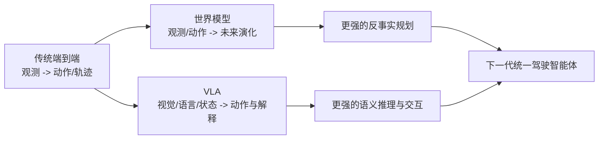
```mermaid
graph LR
    A[传统端到端<br/>观测 -> 动作/轨迹] --> B[世界模型<br/>观测/动作 -> 未来演化]
    A --> C[VLA<br/>视觉/语言/状态 -> 动作与解释]
    B --> D[更强的反事实规划]
    C --> E[更强的语义推理与交互]
    D --> F[下一代统一驾驶智能体]
    E --> F
```

---

<div id="chapter-26-docs-04-4-1-md-s37" class="doc-anchor doc-anchor-section doc-anchor-level-2"></div>

## 7. 全章总结

传统端到端自动驾驶最值得理解的，不是某篇论文用了什么 backbone，而是它代表了一种核心思想转变：

- 从显式设计每个子模块，转向联合学习最终驾驶行为；
- 从把中间表示当硬接口，转向把它们当可学习软结构；
- 从直接控制回归，逐步走向更稳定的轨迹监督、空间表示、闭环训练与长期行为优化；
- 从反应式映射，最终走向世界建模与语言推理增强。

如果用一句话总结本章，可以写成：

> **传统端到端自动驾驶不是“不要结构”，而是“把结构内化为可学习表示”；它学到的也不只是控制，而是被压缩进统一模型中的隐式规划。**

这也是为什么它既是自动驾驶现代学习范式的核心里程碑，又不是终点。接下来的世界模型和 `VLA`，都可以被看作是在端到端驾驶这条主线上的进一步展开：

- `4.2` 继续回答：模型能不能不只会开，还能“预见未来”；
- `4.3` 继续回答：模型能不能不只会开，还能“理解语言并解释决策”。


---

<!-- Source: docs/04_端到端自动驾驶算法/4.2_世界模型.md -->

<div id="chapter-27-docs-04-4-2-md" class="doc-anchor doc-anchor-chapter doc-anchor-level-1"></div>

# 4.2 世界模型

在 `4.1` 里，我们讨论了传统端到端自动驾驶如何把“观测到动作”收拢进统一模型中。但如果一个系统只是学会了“现在该怎么开”，它仍然缺少一种非常关键的能力：

> **如果我接下来这样开，几秒之后世界会变成什么样？**

这正是世界模型 (`World Model`) 在自动驾驶里出现的根本原因。  
它不满足于只输出一个动作或一条轨迹，而是希望学习环境本身的演化规律，让模型具备某种“内部想象力”：

- 不只看当前，还能推演未来；
- 不只反应现实，还能评估反事实；
- 不只模仿专家，还能在内部模拟“这样做会怎样”。

如果说传统端到端驾驶是在回答“**现在该怎么做**”，那么世界模型更像是在回答“**做了之后会发生什么**”。

本章不讨论引入语言推理的 `VLA` 闭环，也不把重点放在通用视频生成本身，而是聚焦于**世界模型**：即如何围绕未来环境演化建模，支持预测、规划、控制和决策。

围绕这一主题，你可以把当前自动驾驶中的世界模型粗略看成三条主线：

1. **Image-Based World Models**：直接在图像或视觉空间中预测未来；
2. **Occupancy World Models**：在 `Occupancy` 空间中预测未来可达性与场景结构；
3. **Latent World Models**：在压缩潜变量空间中建模未来动态，再服务策略学习或规划。

这一章读完后，你需要回答下面几个问题：

- 自动驾驶里的世界模型到底在建模什么？
- 为什么世界模型不等于“把下一帧图像生成得更像真的”？
- 为什么研究会从像素和occupancy生成，逐步走向latent 表示？
- 世界模型和传统端到端、预测模块、规划模块到底如何区分？
- 为什么它会自然走向规划融合，甚至进一步走向 `VLA`？

> [!TIP]
> **有一点需要明确：**
> 世界模型的做法有很多种，大家的思考与行为也不完全相同。有做纯生成任务的、有做仿真器的、有做生成辅助规划的等等。本文介绍的核心主要聚焦于“世界模型生成辅助规划”

---

<div id="chapter-27-docs-04-4-2-md-s02" class="doc-anchor doc-anchor-section doc-anchor-level-2"></div>

## 1. 定义、边界与问题背景

<div id="chapter-27-docs-04-4-2-md-s03" class="doc-anchor doc-anchor-section doc-anchor-level-3"></div>

### 1.1 什么是世界模型

在本章中，我们把世界模型定义为：

> **从观测、动作与历史状态出发，学习环境未来演化规律，从而支持预测、想象、反事实评估与规划的可学习系统。**

这一定义里最重要的，不是“生成”两个字，而是“**演化规律**”四个字。

也就是说，世界模型真正想学的并不是某一帧长什么样，而是：

- 场景中的主体会怎样运动；
- 自车动作会如何影响未来观测；
- 路网、障碍物、可行驶区域与交互关系会如何变化；
- 哪些未来是高概率的，哪些未来是危险的，哪些未来与当前动作直接相关。

从这个角度看，世界模型本质上是一种**环境动力学模型 (`dynamics model`)**，只是它面对的状态不再是简单的低维物理变量，而是复杂交通世界中的高维多模态状态。

<div align="center">
  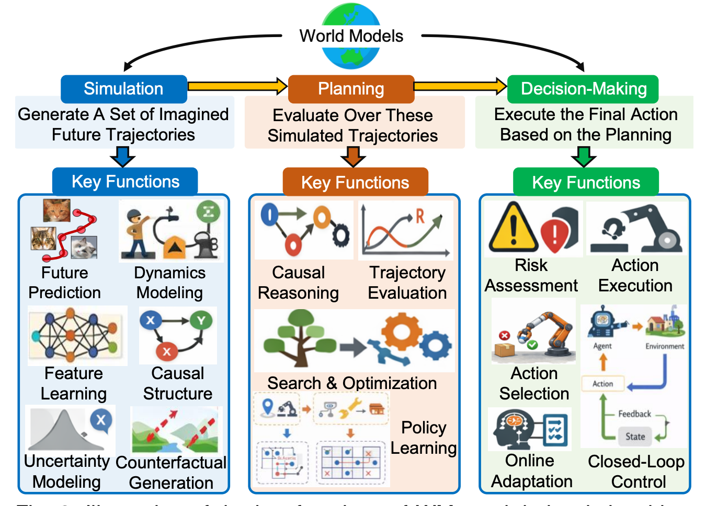
</div>

<div id="chapter-27-docs-04-4-2-md-s04" class="doc-anchor doc-anchor-section doc-anchor-level-3"></div>

### 1.2 两个常见误解

- **误解一：世界模型就是视频生成。**  
  视频生成只是世界模型的一种实现形式，而且通常只是最直观的一种。自动驾驶真正关心的是“未来是否对决策有用”，而不是“像素是否足够好看”。
- **误解二：世界模型和预测模块是同一个东西。**  
  模块化系统中的预测，常常只预测其他交通参与者未来轨迹；世界模型则更进一步，它试图统一建模自车、环境、场景结构和动作条件下的整体未来演化。

<div id="chapter-27-docs-04-4-2-md-s05" class="doc-anchor doc-anchor-section doc-anchor-level-3"></div>

### 1.3 它与模块化预测、端到端驾驶的本质差异

模块化系统通常会把“未来”拆开来处理：

- 感知负责理解当前场景；
- 预测负责估计其他车辆或行人的未来行为；
- 规划负责决定 ego 未来怎么走；
- 控制负责执行轨迹。

而世界模型试图进一步回答一个更统一的问题：

> **在当前场景下，如果 ego 执行某种动作序列，整个局部世界将如何随时间演化？**

这使得它与传统端到端驾驶的差异也很明确：

- 传统端到端重点在于学习 `observation -> action/trajectory`；
- 世界模型重点在于学习 `(observation, action, history) -> future state/feature`。


<div id="chapter-27-docs-04-4-2-md-s06" class="doc-anchor doc-anchor-section doc-anchor-level-3"></div>

### 1.4 与预测模块、端到端、VLA 的边界

为了避免概念混淆，可以先看下面这个表：

| 范式 | 主要输入 | 主要输出 | 核心问题 | 是否强调未来演化 | 是否直接负责动作决策 |
|---|---|---|---|---|---|
| 模块化预测 | 当前场景表示 | 其他参与者未来轨迹/意图 | “别人会怎么动” | 是，但通常局部 | 否 |
| 传统端到端驾驶 | 观测 + 历史 + 导航 | 动作、轨迹、规划变量 | “我现在该怎么开” | 通常不显式强调 | 是 |
| 世界模型 | 观测 + 动作 + 状态 | 未来图像、未来占用、未来 latent、未来场景状态 | “接下来会发生什么” | 是，核心能力 | 不一定 |
| `VLA` | 视觉 + 语言 + 状态 | 动作、解释、推理结果 | “为什么这样开、如何按语义要求开” | 可有可无 | 是 |

这也是本章与相邻章节的边界：

- `4.1` 关注的是统一学习观测到行为的映射；
- `4.2` 关注的是未来环境如何演化；
- `4.3` 关注的是语言与推理如何进入驾驶决策；
- `4.4` 则会进一步讨论世界模型与 `VLA` 如何融合。

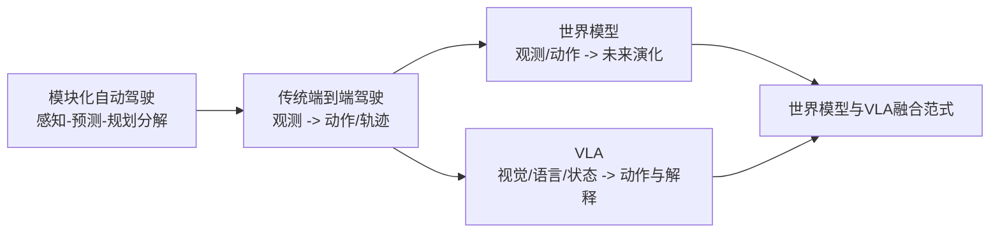
```mermaid
graph LR
    A[模块化自动驾驶<br/>感知-预测-规划分解] --> B[传统端到端驾驶<br/>观测 -> 动作/轨迹]
    B --> C[世界模型<br/>观测/动作 -> 未来演化]
    B --> D[VLA<br/>视觉/语言/状态 -> 动作与解释]
    C --> E[世界模型与VLA融合范式]
    D --> E
```

<div id="chapter-27-docs-04-4-2-md-s07" class="doc-anchor doc-anchor-section doc-anchor-level-3"></div>

### 1.5 为什么世界模型会持续升温

这一方向在自动驾驶里越来越重要，核心原因有四个：

- **反应式策略不够**：只学当前动作，很难显式比较多个未来后果，尤其是对于多模态规划而言。
- **长时决策需要想象力**：变道、避让、汇入、复杂路口博弈都依赖未来推演。
- **生成式建模能力成熟**：扩散模型、视频生成、序列建模和 latent dynamics 让“学未来”变得可行。
- **端到端系统需要更强内部结构**：世界模型为统一驾驶智能体提供了更自然的中间推演空间。

这也是为什么在近两年的自动驾驶研究中，大家越来越不满足于“预测一条轨迹”，而是开始追问：

> **能不能让模型在内部先看到未来，再决定动作？**

---

<div id="chapter-27-docs-04-4-2-md-s08" class="doc-anchor doc-anchor-section doc-anchor-level-2"></div>

## 2. 统一问题建模：世界模型到底在学什么

<div id="chapter-27-docs-04-4-2-md-s09" class="doc-anchor doc-anchor-section doc-anchor-level-3"></div>

### 2.1 从策略学习到环境建模

如果把传统端到端策略写成：

$$
\pi_\theta : (o_{\le t}, h_t, n_t) \mapsto a_t
$$

那么世界模型更像是在学习：

$$
f_\phi : (s_{\le t}, a_{\le t}) \mapsto s_{t+1:T}
$$

或者从概率建模角度写成：

$$
p_\phi(s_{t+1:T} \mid s_{\le t}, a_{\le t})
$$

其中：

- $s_t$ 表示某种“世界状态”，它可能是图像、`Occupancy`、对象集合，或者 latent 表示；
- $a_t$ 表示 ego 动作、控制、轨迹条件，或者规划 token；
- $s_{t+1:T}$ 表示未来若干时刻的环境演化。

如果世界模型学得足够好，我们就可以在内部做这样的推演：

- 如果我保持当前速度，前方车辆是否会切入？
- 如果我提前变道，未来可行驶区域会不会更安全？
- 如果我刹车，后方车辆和相邻车道交通会怎样变化？

这正是世界模型区别于普通行为克隆的地方：  
它让驾驶系统从“学专家怎么做”，走向“学世界会怎么变”。

<div id="chapter-27-docs-04-4-2-md-s10" class="doc-anchor doc-anchor-section doc-anchor-level-3"></div>

### 2.2 世界状态可以放在哪个空间里

理解世界模型时，一个非常关键的问题是：

> **你到底在哪个表示空间里建模未来？**

不同方法的核心分歧，往往不在于“是否预测未来”，而在于“未来被表示成什么”。

<div align="center">
  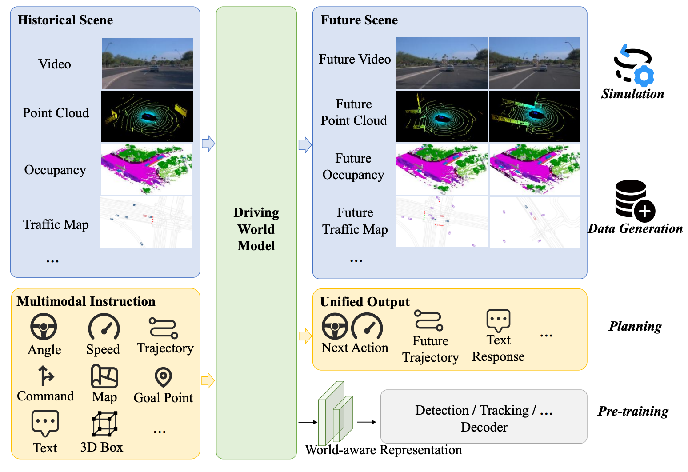
</div>

常见选择有三类：

| 表示空间 | 典型输出 | 优点 | 局限 |
|---|---|---|---|
| 图像/视觉空间 | 未来图像、未来视频帧、未来多视角特征 | 直观、语义丰富、可视化强 | 像素成本高，和规划目标不总是直接对齐 |
| `Occupancy` 空间 | 未来占用、语义占用、可达区域、体素状态 | 更贴近驾驶、安全、几何与可达性 | 细节语义弱于图像，仍需设计表示粒度 |
| Latent 空间 | 压缩后的未来状态 token/embedding | 紧凑、高效、适合长时 rollout 和策略耦合 | 可解释性较弱，表示是否保留关键信息很关键 |

这也对应了本章后面要展开的三条主线：

1. `Image-Based World Models`
2. `Occupancy World Models`
3. `Latent World Models`

<div id="chapter-27-docs-04-4-2-md-s11" class="doc-anchor doc-anchor-section doc-anchor-level-3"></div>

### 2.3 世界模型和 policy 的关系

单独一个世界模型，并不会自动让车开起来。  
它更像一个“内部模拟器”或“内部环境引擎”，真正负责决策的通常还是 policy、planner 或 search 模块。

因此，一个更完整的统一框架常常可以写成：

$$
\hat{s}_{t+1:T} \sim p_\phi(\cdot \mid s_{\le t}, a_{\le t})
$$

再由策略或规划器根据预测未来选择动作：

$$
a_t = \pi_\theta(s_{\le t}, \hat{s}_{t+1:T}, n_t)
$$

从这个角度看：

- **policy** 回答“我该怎么做”；
- **world model** 回答“做了会怎样”。

二者一旦耦合，系统就具备了某种基础形式的“想象-评估-执行”闭环。

<div id="chapter-27-docs-04-4-2-md-s12" class="doc-anchor doc-anchor-section doc-anchor-level-3"></div>

### 2.4 自动驾驶里的训练信号从哪里来

世界模型的监督并不只是一种形式，它的训练目标往往和表示空间强相关。

常见训练信号包括：

- **重建损失**：让预测的未来图像、未来占用或未来特征尽量接近真实未来；
- **时序预测损失**：约束多步 rollout 与真实未来动态一致；
- **动作条件建模**：显式学习不同 ego 动作如何影响未来状态；
- **语义/几何辅助损失**：例如 occupancy、深度、语义类别、instance motion；
- **潜变量一致性损失**：鼓励 latent dynamics 在压缩空间中保持稳定与可预测。

如果写得更抽象一点，可以把世界模型训练目标看成：

$$
\mathcal{L}_{WM} = \mathcal{L}_{pred} + \lambda_1 \mathcal{L}_{recon} + \lambda_2 \mathcal{L}_{dyn} + \lambda_3 \mathcal{L}_{aux}
$$

其中：

- $\mathcal{L}_{pred}$ 负责未来预测本身；
- $\mathcal{L}_{recon}$ 负责输出空间重建；
- $\mathcal{L}_{dyn}$ 负责多步动力学一致性；
- $\mathcal{L}_{aux}$ 负责额外语义或几何约束。

<div id="chapter-27-docs-04-4-2-md-s13" class="doc-anchor doc-anchor-section doc-anchor-level-3"></div>

### 2.5 为什么世界模型不等于“把未来画出来”

这是本章最值得反复强调的一点。

在自动驾驶里，一个世界模型就算把未来生成得非常逼真，也不代表它一定对驾驶有用。因为自动驾驶真正关心的是：

- 哪些目标未来会占据我的可行驶空间；
- 哪些交互会导致风险上升；
- 哪些动作会让未来舒适、安全、符合规则；
- 多种可能未来之间，哪一种对当前决策最关键。

因此，世界模型的价值不只是“**生成质量**”，更是“**决策价值**”。

也正因如此，研究路线逐渐发生了一个很重要的偏移：

- 早期更关注“未来看起来像不像真的”；
- 后来更关注“未来是不是对规划和控制真正有用”。

这正是从 `Image-Based` 走向 `Occupancy`，再进一步走向 `Latent` 的根本动力。

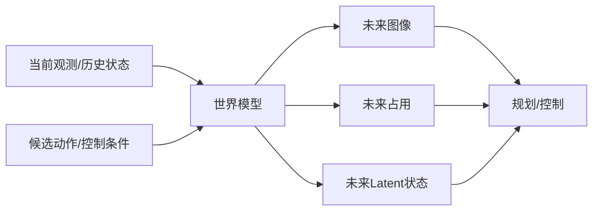
```mermaid
graph LR
    A[当前观测/历史状态] --> B[世界模型]
    C[候选动作/控制条件] --> B
    B --> D1[未来图像]
    B --> D2[未来占用]
    B --> D3[未来Latent状态]
    D1 --> E[规划/控制]
    D2 --> E
    D3 --> E
```
<div align="center">
  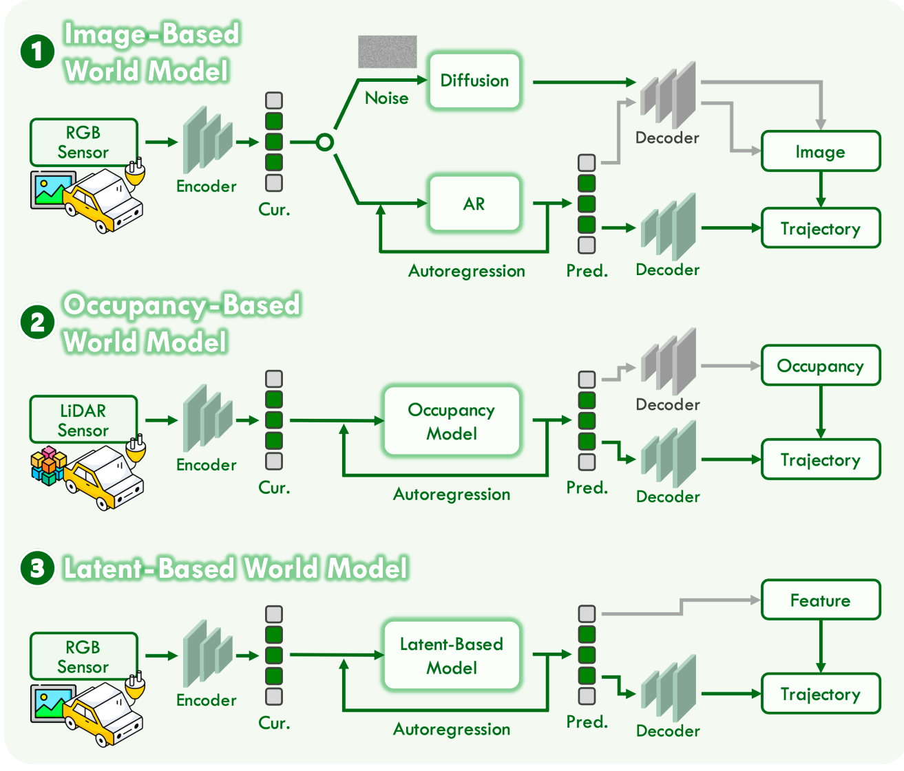
</div>

---

<div id="chapter-27-docs-04-4-2-md-s14" class="doc-anchor doc-anchor-section doc-anchor-level-2"></div>

## 3. 方法主线一：Image-Based World Models

`Image-Based World Models` 的核心想法是：  
既然驾驶员首先看到的是视觉世界，那么模型也可以尝试直接在图像空间里学习“未来会看到什么”。

这一类方法通常最直观，也最容易让人理解世界模型的概念。但它们同时也最容易暴露一个问题：

> **视觉上很逼真的未来，不一定是对驾驶最有用的未来。**

<div id="chapter-27-docs-04-4-2-md-s15" class="doc-anchor doc-anchor-section doc-anchor-level-3"></div>

### 3.1 为什么要直接预测视觉未来

这一条路线之所以自然，是因为驾驶本来就是一个高度视觉化的任务。

- 人类驾驶员首先看到的是前方道路、车辆、行人、信号灯和车道线；
- 自动驾驶系统最常见的输入也是多相机视频流；
- 如果模型能够直接想象“几秒后会看到什么”，那么它似乎就获得了一种很直观的未来感知能力。

因此，`Image-Based World Models` 的吸引力非常强：

- **可视化强**：预测结果可以直接被人看到，便于检查模型到底“想象”了什么；
- **语义丰富**：图像天然包含纹理、类别、几何、遮挡、动态交互等大量信息；
- **生成范式成熟**：视频扩散模型、时序 Transformer、条件生成模型的发展，为这条路线提供了强大的工具箱。

从研究心理上讲，这也是很多人理解世界模型的第一入口。  
因为“预测未来视频”这件事非常直观，它让“模型在脑中模拟未来”这件事变得几乎可以被肉眼观察。

<div id="chapter-27-docs-04-4-2-md-s16" class="doc-anchor doc-anchor-section doc-anchor-level-3"></div>

### 3.2 这一路线到底在学什么

如果把这一类模型抽象一下，它学习的通常是：

$$
p(x_{t+1:T} \mid x_{\le t}, a_{\le t}, h_t)
$$

其中：

- $x_{\le t}$ 是历史多视角图像或视觉特征；
- $a_{\le t}$ 是 ego 动作、控制序列或候选轨迹条件；
- $h_t$ 是其他辅助上下文，如车速、导航意图、状态记忆；
- $x_{t+1:T}$ 则是未来图像、未来视频帧，或接近图像的未来视觉特征。

这意味着它更像是在**可见空间**中学习未来演化规律。  
和单纯做下一帧生成不同，自动驾驶里的 image-based world model 通常还会强调两件事：

- **动作条件性**：未来不是唯一的，而是会随 ego 行为不同而改变；
- **多步 rollout**：真正有价值的不是“下一帧像不像”，而是“连续几秒的未来演化是否稳定、合理、可用于决策”。

但也正是在这里，这条路线的核心矛盾暴露出来了：

- 像素空间维度极高；
- 长时视频生成很容易积累误差；
- 视觉上逼真，不等于规划上有用；
- 评价指标也常常更偏视觉质量，而不是闭环驾驶价值。

所以，`Image-Based World Models` 最值得理解的，不只是“它能不能生成很像真的未来”，而是：

> **它能否把未来视觉演化转化为对驾驶真正有帮助的内部推演能力。**

<div id="chapter-27-docs-04-4-2-md-s17" class="doc-anchor doc-anchor-section doc-anchor-level-3"></div>

### 3.3 代表性工作：`Epona`

`Epona` 可以看作这条路线中一个非常有代表性的工作。

它代表的，不只是“把视频生成模型搬到自动驾驶里”，而是试图解决 image-based world model 最难的几个问题：

- 未来长度不能太短，否则只能做很局部的反应；
- 生成不能只顾视觉质量，还要能和轨迹/规划耦合；
- 自回归 rollout 不能很快崩掉，否则未来推演无法真的服务驾驶。

`Epona` 的方法意义，可以从三个角度理解。

第一，它强调**条件化未来生成**。  
未来不是一段无条件播放的视频，而是和 ego 轨迹、动作先验、历史观测共同决定的。这样一来，模型生成的就不再只是“某种会发生的未来”，而更接近“如果我这么开，可能会看到的未来”。

第二，它强调**多步视觉 rollout**。  
这类系统的真正价值，不在于生成一帧漂亮图像，而在于能否把未来一段时间的场景变化连续地推出去。`Epona` 试图把视觉生成从“固定长度整体采样”推进到更适合驾驶推演的长时自回归生成，这一点非常关键。

第三，它强调**生成未来对 driving reasoning 的支撑作用**。  
也就是说，未来视频不是展示品，而是一个可被后续规划与控制利用的内部世界接口。它让世界模型第一次比较清楚地展示出一个愿景：模型不是只会“看现在”，而是能先在脑中“看到未来”，再反过来帮助决策。

<div align="center">
  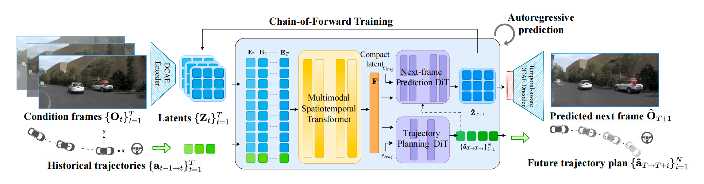
</div>

从范式意义上讲，`Epona` 代表的是：

> **世界模型可以先从人类最容易理解的视觉未来入手，把“想象未来”这件事做得可视、可检验、可与驾驶闭环相连接。**

- [Epona: Autoregressive Diffusion World Model for Autonomous Driving](https://arxiv.org/abs/2506.24113)

但这条路线的边界同样很明显。图像未来虽然最直观，却未必最适合作为闭环驾驶系统的核心内部表示。因为自动驾驶真正关心的，往往不是每一块纹理是否生成正确，而是：

- 哪些区域会被占据；
- 哪些目标会进入我的风险空间；
- 哪条候选轨迹对应的未来最安全。

这也解释了为什么 image-based world model 虽然极具吸引力，但研究很快又把目光转向更贴近规划语义的空间表示。

| 维度 | `Image-Based World Models` / `Epona` |
|---|---|
| 核心优势 | 直观、语义完整、便于人类检查，最容易体现“模型在想象未来” |
| 主要局限 | 像素建模昂贵，长时稳定性难，生成质量与控制价值不完全一致 |
| 更适合承担的角色 | 世界想象器、可视未来接口、生成式预训练入口 |

如果用一句话概括这一类方法，可以写成：

> **它最擅长把未来“看出来”，但未必最擅长把未来“用于规划”。**

---

<div id="chapter-27-docs-04-4-2-md-s18" class="doc-anchor doc-anchor-section doc-anchor-level-2"></div>

## 4. 方法主线二：Occupancy World Models

`Occupancy World Models` 更关心的是：

- 未来哪里会被占据；
- 哪些区域可通行；
- 场景中的几何结构和动态主体会怎样演化。

相比直接生成图像，它更接近规划和安全判断所真正依赖的空间结构。  

<div id="chapter-27-docs-04-4-2-md-s19" class="doc-anchor doc-anchor-section doc-anchor-level-3"></div>

### 4.1 为什么从图像走向 occupancy

当研究者真正把世界模型往自动驾驶闭环上推时，很快就会发现一个事实：

> **自动驾驶真正关心的，不是未来“看起来像什么”，而是未来“哪里可走、哪里危险、哪里会被占据”。**

这正是从 image-based world model 走向 occupancy world model 的核心原因。

图像空间当然很丰富，但它也包含大量对规划并不关键的细节：

- 车身纹理、反光、天空颜色；
- 远处建筑外观；
- 像素级外观变化。

而规划真正高度依赖的，是另外一些量：

- 前方车道与障碍物在空间中的占据关系；
- 周围交通参与者未来几秒会怎样移动；
- 某个区域未来是否仍然可达；
- ego 某个动作是否会把自己带入碰撞或不可通行区域。

因此，研究者自然会追问：

> **能不能直接在“未来空间占据状态”上建模世界，而不是绕一大圈先生成图像？**

<div id="chapter-27-docs-04-4-2-md-s20" class="doc-anchor doc-anchor-section doc-anchor-level-3"></div>

### 4.2 occupancy 为什么更贴近规划

`Occupancy` 之所以在自动驾驶里越来越重要，是因为它非常贴近驾驶真正关心的空间语义。

可以把它理解成一种更“规划友好”的未来表示。  
相较于图像，它至少有三方面优势：

- **压缩目标更对齐**：它直接描述哪里被物体占据、哪里空闲、哪里可能可通行；
- **几何结构更清晰**：它天然适合放在 `BEV` 或 3D voxel 空间里，便于表达路网、障碍和相对运动；
- **更适合安全推理**：碰撞、可达性、遮挡和多主体交互都更容易在 occupancy 上分析。

这一点和前面 `4.1` 里提到的 `BEV`、occupancy prediction、`UniAD` 等体系其实是一脉相承的。  
区别在于，那些工作更强调 occupancy 作为**中间任务或中间表征**；而这里的世界模型进一步把 occupancy 变成了**未来世界本身的承载空间**。

也就是说，研究重点开始从：

- “感知当前 occupancy”

走向：

- “推演未来 occupancy 如何演化”。

这一步非常重要。因为它意味着世界模型不再只是为了“把未来画出来”，而是在尝试构建一个真正对 planning/control 有因果意义的未来空间。

<div id="chapter-27-docs-04-4-2-md-s21" class="doc-anchor doc-anchor-section doc-anchor-level-3"></div>

### 4.3 代表性工作：`OccWorld`

`OccWorld` 是这一方向里非常典型的代表工作：

- [OccWorld: Learning a 3D Occupancy World Model for Autonomous Driving](https://arxiv.org/abs/2311.16038)

它最值得注意的地方，不是单纯把 occupancy prediction 做成了时序版本，而是明确提出：

> **应该在 3D occupancy 空间里学习整个世界的演化，而不是只预测 box、segmentation map 或单一目标轨迹。**

这一点背后其实对应着一个范式转向。

传统预测方法经常围绕对象框、轨迹或分割结果展开，但这些表示虽然有效，却未必能完整承载场景的细粒度空间结构。而 `OccWorld` 选择在 3D occupancy 空间里同时建模：

- 周围场景的未来演化；
- ego 自身的未来运动；
- 未来场景结构与 ego 决策之间的耦合关系。

它的方法思路可以概括为两步：

- 先把 3D occupancy 编码成更适合时空建模的离散 scene token；
- 再用 GPT-like 的时空生成模型去自回归地产生后续 scene token 和 ego token，最后解码成未来 occupancy 与 ego trajectory。

<div align="center">
  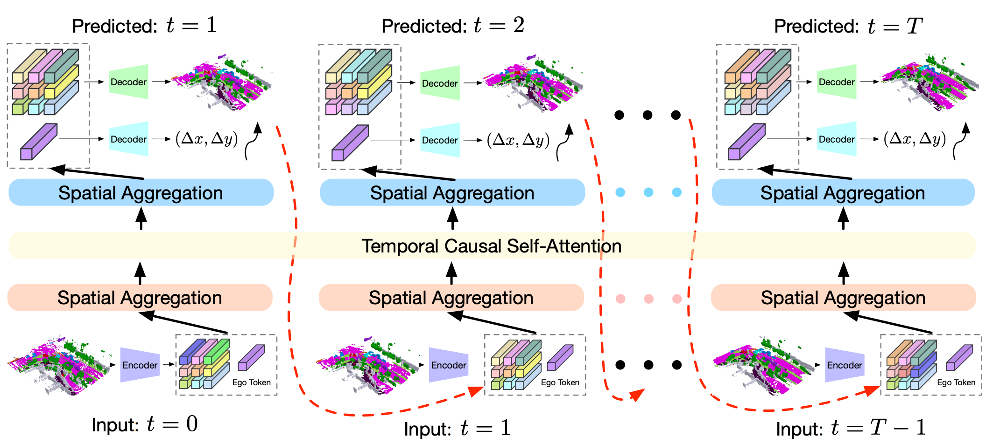
</div>

这里最关键的，不是具体 tokenizer 或 Transformer 细节，而是它清楚地说明了 occupancy world model 的核心哲学：

- 未来应该在**几何与可达性友好**的空间里推演；
- ego 未来动作不应与环境演化割裂开来；
- 世界模型可以在没有完整 instance/map supervision 的情况下，仍然学习到对规划有价值的未来结构。

因此，`OccWorld` 的价值不只是“预测未来 occupancy”，而是证明了这样一件事：

> **世界模型完全可以把“看起来像真的未来”退到次要位置，把“对决策真正有用的未来空间”放到中心位置。**

这也让它和 image-based world model 形成了很清楚的对照：

- `Epona` 更像是先把未来“看见”；
- `OccWorld` 更像是先把未来“摆到规划坐标系里”。

从自动驾驶角度看，后者往往更接近工程真正需要的能力。

| 维度 | `Occupancy World Models` / `OccWorld` |
|---|---|
| 核心优势 | 更接近规划、安全与空间结构，多步推演对驾驶更有意义 |
| 主要局限 | 语义细节不如图像，表示设计与分辨率选择仍有工程权衡 |
| 更适合承担的角色 | 世界模型与 planning/control 之间的中间桥梁 |

如果说 `Image-Based World Models` 最擅长的是“把未来可视化”，那么 `Occupancy World Models` 更擅长的是“把未来结构化”。  
但 occupancy 虽然已经非常实用，dense world state 的建模和 rollout 依然不便宜，这又自然把研究推向了下一步：**能不能进一步在更紧凑的 latent state 中完成未来推演？**

---

<div id="chapter-27-docs-04-4-2-md-s22" class="doc-anchor doc-anchor-section doc-anchor-level-2"></div>

## 5. 方法主线三：Latent World Models

当研究者发现像素和 dense occupancy 都可能过于昂贵之后，自然会继续追问：

> **能不能先把世界压缩成更适合推演的状态，再在这个状态空间里建模未来？**

这就引出了 `Latent World Models`。  
它们通常不直接在最终可视空间里做多步预测，而是先学习一个更紧凑、更适合动态建模的潜在表示，再围绕这一表示完成 rollout 与策略耦合。

<div id="chapter-27-docs-04-4-2-md-s23" class="doc-anchor doc-anchor-section doc-anchor-level-3"></div>

### 5.1 为什么继续走向 latent space

从 image 到 occupancy，世界模型已经越来越靠近自动驾驶真正需要的表示。  
但新的问题也随之出现：

- 像素空间太重，长时 rollout 成本高；
- dense occupancy 比图像更实用，但仍然是高维时空状态；
- 如果世界模型最终要和端到端 policy 紧密耦合，那么内部状态不仅要“能表达世界”，还要“便于优化和决策”。

于是研究就自然继续往前走了一步：

> **与其总是在最终可视空间里预测未来，不如先学一个压缩后的内部世界状态，再在这个状态空间里学习动力学。**

这就是 latent world model 的出发点。

它背后的直觉非常像人类认知：

- 我们在脑中推演未来时，并不会逐像素重建整个画面；
- 我们更像是在一个压缩过的、抽象过的内部表征里进行想象；
- 只要这个内部状态保留了对决策真正重要的信息，它就比原始像素更适合快速推演。

<div id="chapter-27-docs-04-4-2-md-s24" class="doc-anchor doc-anchor-section doc-anchor-level-3"></div>

### 5.2 latent world model 的核心思想

`Latent World Models` 的关键，不是“放弃世界表示”，而是把世界表示从显式空间转到**更适合动力学学习的压缩状态空间**。

如果写成抽象形式，它更像是在学习：

$$
z_t = e_\psi(s_t), \qquad p_\phi(z_{t+1:T} \mid z_{\le t}, a_{\le t})
$$

其中：

- $e_\psi$ 是把原始世界状态压缩成 latent 表示的编码器；
- $z_t$ 是更紧凑的场景状态；
- 世界模型真正学习的是 latent space 中的时序演化规律。

这种设计的收益很直接：

- **更高效**：latent 通常远小于像素或 dense occupancy；
- **更适合长时 rollout**：时序推演的计算与误差累积都更可控；
- **更容易接 policy/planner**：因为 latent 本身就可以被下游决策模块直接消费；
- **更适合作为自监督信号**：未来 latent 预测可以倒逼前面的表示学习变得更有时间一致性和决策价值。

当然，它的代价也很明确：

- latent 不像图像和 occupancy 那样直观；
- 如果编码器把关键信息压没了，后面的动力学再强也没有意义；
- 模型学到的 latent 是否真正对驾驶有因果意义，往往更难检查。

所以 latent world model 的核心挑战从来不是“能不能压缩”，而是：

> **压缩后的状态是否仍然保留了对规划、控制和交互推理真正关键的信息。**

<div id="chapter-27-docs-04-4-2-md-s25" class="doc-anchor doc-anchor-section doc-anchor-level-3"></div>

### 5.3 代表性工作：`LAW`

`LAW` 是这一方向非常具有代表性的工作：

- [Enhancing End-to-End Autonomous Driving with Latent World Model](https://arxiv.org/abs/2406.08481)

它和前两类工作最大的不同在于：  
它并不是先把“生成未来世界”作为一个显式可视化目标，而是把**未来 latent feature prediction** 当作一种自监督学习任务，直接服务端到端驾驶中的场景表征学习。

换句话说，`LAW` 更关心的问题不是：

- “我能不能把未来画出来？”

而是：

- “我能不能让模型学到一个更懂未来演化的内部场景表示？”

它的核心思路可以概括为：

- 从当前场景特征出发；
- 结合 ego 轨迹或动作条件；
- 预测未来 latent scene feature；
- 再把这一 latent world modeling 任务作为训练信号，提升端到端驾驶模型的表征质量与轨迹规划能力。

<div align="center">
  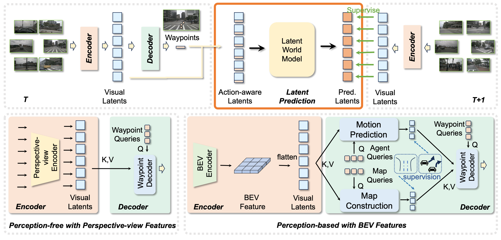
</div>

这里最值得把握的，是 `LAW` 所代表的认识变化：

第一，世界模型不一定非要以“显式生成未来图像/occupancy”为最终形式出现。  
它也可以作为一种更内生的能力，直接内化到驾驶模型的 feature learning 过程中。

第二，latent world model 与端到端驾驶之间的耦合通常更自然。  
因为它本来就在和下游 planner 或 trajectory head 共享表示空间，所以未来推演不再是一个旁路模块，而更像驾驶模型内部的一部分思考过程。

第三，这条路线更接近“统一驾驶智能体”的形态。  
系统不一定每次都要把未来完整解码给人看，但它在内部确实已经形成了某种能够预测未来、约束当前决策的 latent dynamics。

因此，`LAW` 的方法意义不只是提升几个 benchmark 分数，而在于它代表了一种更深的转向：

> **世界模型开始从一个外显的未来生成器，变成端到端驾驶模型内部的未来推演机制。**

这也是为什么 latent world model 常被认为更接近下一代统一驾驶智能体的骨架。  
它不再执着于把未来“画得出来”，而是更关注把未来“算进决策里”。

| 维度 | `Latent World Models` / `LAW` |
|---|---|
| 核心优势 | 更高效，长时 rollout 更现实，更适合与 policy 联训或 planner 耦合 |
| 主要局限 | 可解释性变弱，latent 是否保留驾驶关键信息是核心风险 |
| 更适合承担的角色 | 下一代统一驾驶智能体的内部推演骨架 |

为了把三条路线放在一起看，可以用下面这张表做一个总结：

| 表示空间 | 代表工作 | 核心优势 | 主要代价 | 更适合承担的角色 |
|---|---|---|---|---|
| 图像/视觉空间 | `Epona` | 直观、语义完整、最容易体现“想象未来” | 像素建模昂贵，长时稳定性难，与规划目标不完全对齐 | 世界想象器、可视未来接口 |
| `Occupancy` 空间 | `OccWorld` | 几何与可达性友好，更贴近规划与安全 | 仍是高维 dense 状态，细节语义不如图像 | 世界模型与 planning/control 的桥梁 |
| latent 空间 | `LAW` | 紧凑、高效、适合长时 rollout 和策略耦合 | 可解释性弱，信息压缩风险更高 | 统一驾驶智能体的内部动态骨架 |

如果把这三条路线连起来理解，你会发现它们并不是彼此替代的孤立方向，而更像一条很自然的演化链：

- `Epona` 回答“能不能先把未来看见”；
- `OccWorld` 回答“能不能把未来放进规划真正关心的空间里”；
- `LAW` 回答“能不能把未来推演内化为驾驶模型自身的 latent dynamics”。

这也正是世界模型在自动驾驶里最值得把握的一条主线：  
它从“生成未来”出发，最终走向的是“让未来参与决策”。

---

<div id="chapter-27-docs-04-4-2-md-s26" class="doc-anchor doc-anchor-section doc-anchor-level-2"></div>

## 6. 训练、评测与落地难点

前面三条主线讲清了世界模型“可以怎么做”，但如果我们想把这一方向真正理解透，就还必须继续问三个问题：

- 这些模型到底在被什么目标训练？
- 我们到底该怎么判断一个世界模型“好不好”？
- 为什么它们即使看起来很强，也还不能轻易替代真实闭环驾驶系统？

这部分内容非常关键。因为世界模型最大的风险之一，就是把“未来生成得更像”误当成“未来对驾驶更有用”。

<div id="chapter-27-docs-04-4-2-md-s27" class="doc-anchor doc-anchor-section doc-anchor-level-3"></div>

### 6.1 常见训练目标在优化什么

虽然前面我们已经给过一个统一抽象，但不同世界模型路线实际优化的东西并不完全一样。

如果写成统一形式，可以把训练目标再概括为：

$$
\mathcal{L}_{WM} = \mathcal{L}_{pred} + \lambda_1 \mathcal{L}_{recon} + \lambda_2 \mathcal{L}_{dyn} + \lambda_3 \mathcal{L}_{aux}
$$

但在不同表示空间里，这四部分的含义会明显不同。

| 路线 | 常见训练重点 | 更像在优化什么 |
|---|---|---|
| `Image-Based World Models` | 重建、扩散生成、视频一致性、动作条件生成 | 未来视觉演化与可视未来质量 |
| `Occupancy World Models` | 占用预测、时空 rollout、一致性约束、ego-环境联合演化 | 几何结构、可达性与未来空间状态 |
| `Latent World Models` | 未来特征预测、动态一致性、自监督表示学习、策略友好 latent | 内部 dynamics engine 与决策相关表征 |

这里最值得注意的是：

- `recon` 较强时，模型往往更关心“未来能不能被还原出来”；
- `dyn` 较强时，模型更关心“未来能不能稳定地滚动下去”；
- `aux` 设计得越贴近规划需求，模型学到的表示通常越有机会服务控制与决策。

这也是为什么训练目标不是一个纯工程细节，而是会直接决定模型最后更像什么：

- 像视频生成器；
- 像空间状态预测器；
- 或像统一驾驶系统内部的 dynamics engine。

<div id="chapter-27-docs-04-4-2-md-s28" class="doc-anchor doc-anchor-section doc-anchor-level-3"></div>

### 6.2 世界模型到底该怎么评测

评测世界模型时，最容易犯的错误，就是只盯着未来预测是否“更准”，却不问这些未来到底有没有帮助决策。

更合理的看法，是把评测分成三层：

1. **生成/预测质量**：未来图像、未来 occupancy、未来 latent 到底和真实未来有多接近？
2. **场景一致性**：长时 rollout 会不会崩？动作条件有没有真的影响未来？多步推演是否稳定？
3. **决策价值**：这个世界模型能否让 planner、policy 或闭环驾驶表现更好？

常见指标可以粗略对应成下面这样：

| 评测层次 | 关注问题 | 常见指标示例 |
|---|---|---|
| 生成/预测质量 | “未来像不像真的？” | 像素误差、重建误差、occupancy IoU、feature distance、future token accuracy |
| 场景一致性 | “未来推演稳不稳定？” | 多步 rollout 误差、时序一致性、动作条件一致性、长期漂移程度 |
| 决策价值 | “未来对驾驶有没有用？” | 轨迹规划提升、碰撞率变化、闭环成功率、舒适性与规则遵守提升 |

这一点和普通生成任务非常不同。  
在图像生成里，“看起来更真实”往往就是主要目标；但在自动驾驶里，我们真正关心的是：

> **这个未来是否帮助系统更安全、更稳定、更合理地做决策。**

因此，一个世界模型不能只看“未来像不像”，还必须看“未来有没有帮助决策”。


<div id="chapter-27-docs-04-4-2-md-s29" class="doc-anchor doc-anchor-section doc-anchor-level-3"></div>

### 6.3 世界模型当前的挑战

说到这里，一个很自然的问题是：

> **既然世界模型这么强，那它还存咋哪些问题呢？**

有几类难点叠加在一起：

第一，**长时 rollout 误差会累积**。  
无论是在图像、occupancy 还是 latent 空间里，只要模型连续往后推演很多步，小偏差都可能不断放大。

第二，**多主体交互与多模态未来本来就不确定**。  
在复杂路口里，其他车辆、行人和自车之间存在强博弈关系，未来并不只有一种可能。世界模型必须学到的不是唯一答案，而是一组条件相关的合理未来。

第三，**反事实数据天然稀缺**。  
我们通常有的是“专家这样开之后发生了什么”，但更少有“如果在这一刻换一种动作，会发生什么”的真实监督。这让动作条件 world modeling 变得尤其困难。

第四，**生成质量、可解释性与实时性很难同时兼得**。  
图像路线解释性强但代价高；latent 路线效率高但不直观；occupancy 路线更贴近规划但仍然需要平衡分辨率、语义与算力。

这也是为什么现实中的世界模型，更常见的角色不是“独立替代整个驾驶系统”，而是：

- 为规划器提供候选未来；
- 为端到端模型提供更强的时序表示；
- 为闭环优化提供反事实推演能力；
- 为后续与 `VLA` 的融合提供物理世界层面的支撑。
---

<div id="chapter-27-docs-04-4-2-md-s30" class="doc-anchor doc-anchor-section doc-anchor-level-2"></div>

## 7. 全章总结

世界模型这一章最值得理解的是它所代表的一次根本性建模转向：

- 从“学当前该怎么做”，走向“学世界接下来会如何演化”；
- 从“把未来生成出来”，走向“让未来参与当前决策”；
- 从最直观的图像未来，逐步走向更规划友好的 occupancy 与更高效的 latent dynamics；

> **世界模型不是为了把未来画得更像，而是为了让驾驶系统拥有一个可推演的内部世界。**

从这个意义上讲，世界模型是端到端驾驶从反应式智能走向想象式智能的必经阶段。

接下来的章节会继续沿着这条主线展开：

- `4.3` 继续回答：模型能不能不只会预见未来，还能理解语言、解释行为并遵循高层规则；
- `4.4` 继续回答：当世界模型与 `VLA` 融合后，下一代统一驾驶智能体会呈现出什么样的范式。

<div id="chapter-27-docs-04-4-2-md-s31" class="doc-anchor doc-anchor-section doc-anchor-level-3"></div>

### 4.4 其他经典工作推荐
> [!TIP]
> **这里再推荐几篇综述：**
> - [Learning to Model the World: A Survey of World Models in Artificial Intelligence](https://www.techrxiv.org/doi/full/10.36227/techrxiv.177274570.09578608/v1)
> - [A Survey of World Models for Autonomous Driving](https://arxiv.org/pdf/2501.11260)
> - [Vision-Language-Action Models for Autonomous Driving: Past, Present, and Future](https://worldbench.github.io/assets_common/papers/vla4ad.pdf)
> - [The Role of World Models in Shaping Autonomous Driving:A Comprehensive Survey](https://arxiv.org/pdf/2502.10498)
> 最新的世界模型论文更新汇总：
> - [https://github.com/LMD0311/Awesome-World-Model](https://github.com/LMD0311/Awesome-World-Model)


---

<!-- Source: docs/04_端到端自动驾驶算法/4.3_VLA.md -->

<div id="chapter-28-docs-04-4-3-vla-md" class="doc-anchor doc-anchor-chapter doc-anchor-level-1"></div>

# 4.3 VLA (Vision-Language-Action) 模型

VLA 模型代表了自动驾驶系统从“单纯的感知机”向“具备常识的推理机”的跨越。通过结合大语言模型 (LLM) 的逻辑推理能力和视觉语言模型 (VLM) 的语义理解能力，VLA 让车辆能够像人类一样理解驾驶环境并做出决策。

<div id="chapter-28-docs-04-4-3-vla-md-s02" class="doc-anchor doc-anchor-section doc-anchor-level-2"></div>

## 1. VLA 模型的四种范式 (根据 VLA4AD 综述)

根据语言在驾驶任务中扮演的角色，VLA 模型可以分为四个阶段：

<div id="chapter-28-docs-04-4-3-vla-md-s03" class="doc-anchor doc-anchor-section doc-anchor-level-3"></div>

### ① VLM 作为解释器 (Pre-VLA / Explainers)
- **核心逻辑**：模型主要进行端到端驾驶，语言仅用于在事后解释“为什么要这么开”。
- **代表作**：**ADAPT**。它通过输出驾驶动作的同时生成自然语言句子，提升了黑盒模型的可信度。

<div id="chapter-28-docs-04-4-3-vla-md-s04" class="doc-anchor doc-anchor-section doc-anchor-level-3"></div>

### ② 模块化 VLA (Modular VLA)
- **核心逻辑**：语言作为中间接口。LLM 接收场景描述，输出驾驶建议或高层指令（如“左转”），再由下游规划器执行。
- **代表作**：**Talk2Drive**。利用 LLM 将人类口头指令转化为具体的控制参数。

<div id="chapter-28-docs-04-4-3-vla-md-s05" class="doc-anchor doc-anchor-section doc-anchor-level-3"></div>

### ③ 端到端 VLA (End-to-End VLA)
- **核心逻辑**：**单一模型，直接输出**。将图像和指令同时输入 Transformer，直接预测连续的动作（Action Tokens）。
- **代表作**：**LINGO-1**。通过对齐视觉特征和驾驶指令，模型不仅能开车，还能实时解说当前的驾驶意图。

<div id="chapter-28-docs-04-4-3-vla-md-s06" class="doc-anchor doc-anchor-section doc-anchor-level-3"></div>

### ④ 推理增强型 VLA (Reasoning-Augmented VLA)
- **核心逻辑**：引入思维链 (Chain-of-Thought, CoT)。模型在输出动作前，先进行显式的逻辑推理（如：检测到行人 -> 判断距离 -> 决定减速）。
- **代表作**：**DriveLM**, **Reason2Drive**。

---

<div id="chapter-28-docs-04-4-3-vla-md-s07" class="doc-anchor doc-anchor-section doc-anchor-level-2"></div>

## 2. 统一架构：Vision + Language -> Action

一个标准的 VLA 驱动模型通常由以下模块构成：

1.  **视觉编码器 (Vision Encoder)**：如 CLIP 或 DINOv2，负责将多视角图像转化为高维特征向量。
2.  **连接器 (Adapter/Connector)**：如 Q-Former 或简单的线性层，将视觉特征对齐到语言模型的空间。
3.  **大语言模型骨干 (LLM Backbone)**：如 Llama 或 Vicuna，作为“大脑”处理多模态信息。
4.  **动作头 (Action Head)**：将 LLM 的输出（或特征）映射为具体的控制信号（Steering, Acceleration）。

<div id="chapter-28-docs-04-4-3-vla-md-s08" class="doc-anchor doc-anchor-section doc-anchor-level-3"></div>

### 概率建模
VLA 的目标是最大化联合概率：
$$P(A, E | V, I) = \prod_{t=1}^T P(a_t, e_t | v_{\le t}, i)$$
其中 $A$ 是动作，$E$ 是解释，$V$ 是视频输入，$I$ 是指令。

---

<div id="chapter-28-docs-04-4-3-vla-md-s09" class="doc-anchor doc-anchor-section doc-anchor-level-2"></div>

## 3. 代表性模型对比

| 模型 | 核心能力 | 语言作用 | 评价 |
| :--- | :--- | :--- | :--- |
| **ADAPT** | 动作 + 描述 | 事后解释 | 提升了可解释性，但不直接由语言决策 |
| **LINGO-1** | 动作 + 对话 | 实时意图对齐 | 实现了语言与行为的强耦合 |
| **DriveLM** | 图推理 (GQA) | 逻辑推理链 | 解决了“为什么”和“该怎么办”的逻辑一致性 |
| **Reason2Drive**| 视觉推理 | 闭环 CoT | 目前规模最大的自动驾驶视觉推理工作之一 |

---

<div id="chapter-28-docs-04-4-3-vla-md-s10" class="doc-anchor doc-anchor-section doc-anchor-level-2"></div>

## 4. 关键挑战：为什么 VLA 还没全面上车？

- **推理延迟 (Latency)**：LLM 的推理速度通常难以满足自动驾驶毫秒级的实时需求（需 10Hz 以上）。
- **幻觉问题 (Hallucination)**：LLM 可能会产生不符合物理事实的判断（如“前方无障碍物”但实际有）。
- **数据稀缺**：高质量的“图像-动作-语言解释”对齐数据极其昂贵且难以获取。

---

<div id="chapter-28-docs-04-4-3-vla-md-s11" class="doc-anchor doc-anchor-section doc-anchor-level-2"></div>

## 🔗 推荐资源
- [GitHub: Awesome-VLA4AD (论文合集)](https://github.com/JohnsonJiang1996/Awesome-VLA4AD)
- [DriveLM 项目主页](https://driver-lm.github.io/)
- [LINGO-1 官方介绍 (Wayve)](https://wayve.ai/thinking/lingo-1/)


---

<!-- Source: docs/04_端到端自动驾驶算法/4.4_世界模型与VLA融合范式.md -->

<div id="chapter-29-docs-04-4-4-vla-md" class="doc-anchor doc-anchor-chapter doc-anchor-level-1"></div>

# 4.4 世界模型与 VLA 融合范式

随着端到端技术的演进，业界逐渐形成了一个共识：未来的自动驾驶大脑需要同时具备“逻辑推理”和“物理直觉”。这催生了**世界模型 (World Models)** 与 **VLA (Vision-Language-Action)** 的深度融合范式。

<div id="chapter-29-docs-04-4-4-vla-md-s02" class="doc-anchor doc-anchor-section doc-anchor-level-2"></div>

## 1. 理论基础：System 1 与 System 2

著名心理学家丹尼尔·卡尼曼提出的双系统理论，完美契合了这种融合趋势：

- **系统 1 (快思考 - World Models/E2E)**：类似于人类的直觉和肌肉记忆。它负责处理高频率、实时的控制，确保车辆在物理世界中平稳运行。
- **系统 2 (慢思考 - VLA/LLM)**：类似于人类的逻辑推理。它负责处理复杂的决策、理解交通规则、应对罕见的长尾场景，并能用语言进行解释。

| 维度 | 系统 1 (世界模型/端到端) | 系统 2 (VLA/大模型) |
| :--- | :--- | :--- |
| **反应速度** | 极快 (50Hz+) | 较慢 (1-5Hz) |
| **主要任务** | 反应式控制、路径平滑、物理避障 | 语义理解、长时规划、交互博弈 |
| **核心能力** | 物理规律感知、连续预测 | 逻辑推理、常识应用、指令遵循 |

---

<div id="chapter-29-docs-04-4-4-vla-md-s03" class="doc-anchor doc-anchor-section doc-anchor-level-2"></div>

## 2. 融合架构：推理引导的生成与控制

目前最前沿的研究（如 DriveWM 结合 LLM）探索了如下融合路径：

1.  **VLA 作为决策者**：LLM 接收传感器输入，分析场景（如“救护车在左侧强行变道”），输出高层策略指令。
2.  **世界模型作为模拟器**：根据 LLM 的指令，世界模型在潜在空间中“脑补”出多个可能的未来场景。
3.  **安全筛选与优化**：系统评估这些生成的未来场景，选择最安全、最符合人类偏好的轨迹进行实际执行。

<div id="chapter-29-docs-04-4-4-vla-md-s04" class="doc-anchor doc-anchor-section doc-anchor-level-3"></div>

### 融合公式
我们可以将这一过程简化为一个受限优化问题：
$$\max_{\pi} \mathbb{E}_{\tau \sim P_\text{World}(\tau|\pi, s)} [ R(\tau, \text{Knowledge}_\text{LLM}) ]$$
即：在世界模型预测的轨迹 $\tau$ 中，寻找一个最符合 LLM 沉淀的驾驶知识和奖励函数 $R$ 的策略 $\pi$。

---

<div id="chapter-29-docs-04-4-4-vla-md-s05" class="doc-anchor doc-anchor-section doc-anchor-level-2"></div>

## 3. 未来趋势与挑战

<div id="chapter-29-docs-04-4-4-vla-md-s06" class="doc-anchor doc-anchor-section doc-anchor-level-3"></div>

### ① 统一大模型 (The One Model)
未来的趋势是将世界模型的预测能力直接作为 VLA 模型的一个预训练任务。模型不仅预测文字和动作，还预测下一帧的特征图。这种全方位的对齐将使 AI 具备更强的泛化能力。

<div id="chapter-29-docs-04-4-4-vla-md-s07" class="doc-anchor doc-anchor-section doc-anchor-level-3"></div>

### ② 实时性突破
利用 **混合专家模型 (MoE)** 或 **模型蒸馏 (Distillation)** 技术，将庞大的 VLA 模型压缩到可以在车规级芯片（如 NVIDIA Orin, Thor）上流畅运行的程度。

<div id="chapter-29-docs-04-4-4-vla-md-s08" class="doc-anchor doc-anchor-section doc-anchor-level-3"></div>

### ③ 驾驶领域的 RLHF
借鉴大语言模型的对齐经验，通过“人类反馈强化学习 (RLHF)”来微调驾驶模型。让 AI 的驾驶风格（如跟车距离、变道时机）更符合人类司机的舒适感和安全性。

---

<div id="chapter-29-docs-04-4-4-vla-md-s09" class="doc-anchor doc-anchor-section doc-anchor-level-2"></div>

## 4. 全章总结

端到端自动驾驶正在经历一场革命：
- 从简单的 **Behavior Cloning** (模仿) 转向 **World Models** (理解规律)。
- 从 **Black Box** (黑盒) 转向 **VLA** (可解释、可推理)。

这一跨越不仅是技术手段的更新，更是自动驾驶从“机器自动化”向“通用人工智能 (AGI)”迈出的坚实一步。

---

<div id="chapter-29-docs-04-4-4-vla-md-s10" class="doc-anchor doc-anchor-section doc-anchor-level-2"></div>

## 📚 延伸阅读
- [DriveLM: Driving with Graph Visual Question Answering](https://github.com/OpenDriveLab/DriveLM)
- [Vista: 闭环生成式仿真平台](https://github.com/mit-han-lab/vista)


---

<!-- Source: docs/05_大模型基础/5.1_大语言模型（LLM）基础.md -->

<div id="chapter-30-docs-05-5-1-llm-md" class="doc-anchor doc-anchor-chapter doc-anchor-level-1"></div>

# 5.1 大语言模型（LLM）基础

在进入 `5.3_VLM` 之前，先学这一节并不是为了把自动驾驶硬拗成一个“文本任务”，而是因为后续的视觉语言模型（VLM）本质上是把**视觉特征**和**语言建模能力**接到了一起。换句话说，VLM 之所以能“看图说话”、做场景解释、理解驾驶指令，背后依赖的正是 NLP 和 LLM 这条技术路线积累下来的表示学习、上下文建模和生成能力。

所以，这一节的主线很明确：

> **我们学习 LLM，不是为了单独做文本任务，而是为了理解后续 VLM 的语言侧基础。**

如果不先理解 `token`、`embedding`、`Transformer`、`pretraining`、`BERT / GPT` 这些概念，那么到了 VLM 章节时，很多结构都会变成“记名词”，而不是“真懂原理”。

> [!TIP]
> **把这一章看成 VLM 的语言预备课。**  
> 后面的 VLM 并不是凭空多出一个“会看图的 AI”，而通常是“视觉编码器 + 语言模型”拼起来的系统。你现在学的，就是其中“语言模型”这一半。

---

<div id="chapter-30-docs-05-5-1-llm-md-s02" class="doc-anchor doc-anchor-section doc-anchor-level-2"></div>

## 1. 为什么在 VLM 之前必须先学 LLM

传统自动驾驶系统的核心输入当然不是聊天文本，而是相机、激光雷达、地图、预测轨迹等结构化或半结构化信息。但在大模型路线里，研究者越来越希望模型具备下面这些能力：

- 不只是“看见目标”，还要**解释场景**。
- 不只是“输出决策”，还要**用语言说明理由**。
- 不只是“执行固定接口”，还要**理解人类指令或高层任务描述**。
- 不只是“提取视觉特征”，还要把视觉信息接入一个已经具备通用知识与推理能力的模型。

这正是 VLM 出现的重要背景。它通常不是重新从零发明一种完全不同的智能，而是沿着下面这条路线发展出来的：

`自然语言处理（NLP） -> 预训练语言模型（PLM） -> 大语言模型（LLM） -> 视觉语言模型（VLM）`

其中：

- `NLP` 解决的是“机器如何表示和处理语言”。
- `预训练语言模型` 解决的是“如何先从海量文本里学到通用语言知识”。
- `LLM` 解决的是“如何把这种语言能力做大、做通用、做成基础模型”。
- `VLM` 则是在这个基础上，把图像或视频特征接入语言模型。

因此，从学习顺序上看，**VLM 的前置知识并不是传统计算机视觉本身，而是“语言模型究竟是怎么工作的”**。

---

<div id="chapter-30-docs-05-5-1-llm-md-s03" class="doc-anchor doc-anchor-section doc-anchor-level-2"></div>

## 2. 必要的 NLP 前置概念

这一节不把 NLP 写成一门独立完整课程，而只保留理解 LLM 必须用到的最核心概念。

<div id="chapter-30-docs-05-5-1-llm-md-s04" class="doc-anchor doc-anchor-section doc-anchor-level-3"></div>

### 2.1 什么是 NLP

`NLP`（Natural Language Processing，自然语言处理）研究的是：如何让计算机表示、理解、生成人类语言。

人类眼里的语言是“词、句子、语义、上下文”，但计算机本身只能处理数字。因此，NLP 的第一个基本问题永远是：

> **如何把语言变成模型能计算的对象。**

这也就是后面 `token`、`vocabulary`、`embedding` 等概念存在的原因。

<div id="chapter-30-docs-05-5-1-llm-md-s05" class="doc-anchor doc-anchor-section doc-anchor-level-3"></div>

### 2.2 token、vocabulary、sequence

大语言模型不会直接“看懂一句话”，它首先会把文本切成更小的离散单元，这些单元叫做 `token`。

- 一个 `token` 可能是一个字、一个词、一个词片段，甚至一个符号。
- 所有可用 token 的集合，叫做 `vocabulary`（词表）。
- 一段文本在模型看来，本质上是一个 `token sequence`（token 序列）。

例如一句话：

`前方有一辆减速的车`

在人类看来是一个完整语义单元，但模型通常会先把它拆成若干 token，然后再处理这些 token 之间的关系。

这里最重要的理解是：

- **语言模型先处理的是“离散符号序列”，不是直接处理“语义本身”。**
- 模型所谓的“理解能力”，是建立在大量序列统计规律和表示学习之上的。

<div id="chapter-30-docs-05-5-1-llm-md-s06" class="doc-anchor doc-anchor-section doc-anchor-level-3"></div>

### 2.3 one-hot 与 embedding

如果只想让计算机区分不同 token，最朴素的方法是 `one-hot` 编码：词表里每个 token 对应一个维度，当前 token 的位置记为 1，其余位置全是 0。

这种表示的问题很明显：

- 维度极高；
- 稀疏；
- 无法表达词与词之间的相似性；
- “汽车”和“卡车”在 one-hot 空间里并不会比“汽车”和“星期三”更接近。

于是就有了 `embedding`（词嵌入/向量表示）：

- 每个 token 不再表示成一个巨大的稀疏向量；
- 而是表示成一个低维、稠密、可学习的向量；
- 相近语义的 token，往往会在向量空间里更接近。

`Word2Vec` 是这条路线上的经典工作之一，它推动了“用连续向量表示词语”的思路普及开来，可参考 Mikolov 等人的论文 [Efficient Estimation of Word Representations in Vector Space](https://arxiv.org/abs/1301.3781)。

可以把 `embedding` 粗略理解成：

> **token 的“机器语义坐标”。**

当然，这个说法并不严格，因为向量里并没有单独一个维度写着“语义 = 3.2”。但它足够帮助初学者建立直觉：模型不是在死记单词编号，而是在学习一种可计算的语义表示。

<div id="chapter-30-docs-05-5-1-llm-md-s07" class="doc-anchor doc-anchor-section doc-anchor-level-3"></div>

### 2.4 context、language model 与 next-token prediction

仅有 token 和 embedding 还不够，因为同一个词在不同上下文里可能含义不同。

例如：

- “模型很大”
- “道路模型”
- “世界模型”

这里“模型”的含义就依赖上下文。于是 NLP 的第二个核心问题出现了：

> **如何根据上下文理解当前 token。**

这就引出了 `context`（上下文）和 `language model`（语言模型）。

所谓语言模型，本质上是在建模：

- 一个 token 后面最可能出现什么；
- 或者说，给定前文，下一步最可能生成哪个 token。

这也是今天大多数生成式 LLM 的核心训练目标：`next-token prediction`（下一个 token 预测）。

初学者很容易误解为：

> “LLM 不就是在猜下一个词吗？”

这句话不完全错，但不够准确。更完整的理解是：

- 训练目标表面上是“预测下一个 token”；
- 但为了把这件事做对，模型被迫学习语法、事实、常识、上下文依赖、风格模式，甚至一定程度上的推理结构。

也就是说，**下一个 token 预测是训练入口，不是能力上限。**

---

<div id="chapter-30-docs-05-5-1-llm-md-s08" class="doc-anchor doc-anchor-section doc-anchor-level-2"></div>

## 3. 从词向量、RNN 到 Transformer 的演进

<div id="chapter-30-docs-05-5-1-llm-md-s09" class="doc-anchor doc-anchor-section doc-anchor-level-3"></div>

### 3.1 从“表示词”到“表示序列”

早期 NLP 很多时候先解决“如何表示词”，再解决“如何表示句子”。词向量让 token 有了更好的数值表示，但句子是一个**有顺序的序列**，所以模型还需要考虑：

- token 的先后顺序；
- 前后依赖关系；
- 长距离上下文；
- 句子整体含义。

这就把问题从“单个词表示”推进到了“序列建模”。

<div id="chapter-30-docs-05-5-1-llm-md-s10" class="doc-anchor doc-anchor-section doc-anchor-level-3"></div>

### 3.2 RNN：让模型按顺序读文本

`RNN`（Recurrent Neural Network，循环神经网络）是一类经典序列模型。它的直觉很简单：

- 依次读入一个个 token；
- 每读一个 token，就更新一次内部状态；
- 当前时刻的状态同时依赖“当前输入”和“之前记住的内容”。

所以，RNN 很像“边读边记”的模型。

它的重要意义在于：第一次比较自然地把“上下文”引入了神经网络语言处理中。模型不再只看当前 token，而是尝试把过去的信息压进一个隐藏状态里。

<div id="chapter-30-docs-05-5-1-llm-md-s11" class="doc-anchor doc-anchor-section doc-anchor-level-3"></div>

### 3.3 LSTM / GRU：缓解长程依赖问题

标准 RNN 很快遇到一个经典困难：**长程依赖**。

如果一句话很长，模型早期读到的信息在后面容易逐渐丢失，训练时也容易出现梯度消失或梯度爆炸。于是研究者提出了 `LSTM` 和 `GRU` 这类改进结构，其中 `LSTM` 是代表性工作，可参考 Hochreiter 与 Schmidhuber 的经典论文 [Long Short-Term Memory](https://www.bioinf.jku.at/publications/older/2604.pdf)。

`LSTM` 的核心直觉不是“更复杂”，而是“更会记和忘”：

- 有些信息要长期保留；
- 有些信息只需要短暂使用；
- 有些旧信息需要被遗忘，以免干扰当前理解。

从教学角度看，RNN/LSTM 带来的最大启发是：

> **语言理解不是只看当前 token，而是不断维护一个上下文状态。**

<div id="chapter-30-docs-05-5-1-llm-md-s12" class="doc-anchor doc-anchor-section doc-anchor-level-3"></div>

### 3.4 Seq2Seq：从“读一句”到“生成一句”

当研究目标从分类转向翻译、摘要、对话等任务时，只会“读一句”还不够，模型还要“生成另一句”。这催生了 `Encoder-Decoder` 范式，也就是常说的 `Seq2Seq`（sequence to sequence）。

典型思路是：

- `Encoder` 负责把输入序列编码成内部表示；
- `Decoder` 负责基于这个表示生成输出序列。

这条路线在机器翻译上非常重要，可参考 Sutskever 等人的 [Sequence to Sequence Learning with Neural Networks](https://arxiv.org/abs/1409.3215)。

这一步非常关键，因为后面很多大模型架构讨论里都会反复出现：

- `Encoder-only`
- `Decoder-only`
- `Encoder-Decoder`

它们都可以追溯到这类问题设定。

<div id="chapter-30-docs-05-5-1-llm-md-s13" class="doc-anchor doc-anchor-section doc-anchor-level-3"></div>

### 3.5 为什么 RNN 路线最终不够

虽然 RNN/LSTM 在历史上非常重要，但它们逐渐暴露出几个限制：

- 必须按顺序处理，难以高效并行；
- 长文本上下文仍然难处理；
- 即使有注意力机制辅助，信息路径仍然相对较长；
- 当模型和数据规模继续扩大时，训练效率和表达能力都越来越受限。

于是，NLP 进入了下一个决定性阶段：`Transformer`。

---

<div id="chapter-30-docs-05-5-1-llm-md-s14" class="doc-anchor doc-anchor-section doc-anchor-level-2"></div>

## 4. Transformer 为什么改变了 NLP

<div id="chapter-30-docs-05-5-1-llm-md-s15" class="doc-anchor doc-anchor-section doc-anchor-level-3"></div>

### 4.1 Self-Attention 的核心思想

`Transformer` 的代表性论文是 Vaswani 等人的 [Attention Is All You Need](https://arxiv.org/abs/1706.03762)。这篇工作最重要的贡献，不只是提出一个新模块，而是把序列建模的主角从“循环”换成了“注意力”。

所谓 `self-attention`，可以先直观理解成：

> **处理某个 token 时，不再只依赖一个按时间传递的隐藏状态，而是直接去看序列里哪些位置和自己最相关。**

例如在一句长句里，模型处理某个词时，可能需要重点关注：

- 主语是谁；
- 修饰词落在哪个对象上；
- 前面哪一段决定了当前词的含义；
- 远处哪个 token 和当前 token 在语义上强相关。

`self-attention` 的价值就在于，它允许模型**动态选择关注对象**，而不是被迫把所有信息都压进一个单一的循环状态里。

如果你想要一个非常直观的可视化讲解，Jay Alammar 的博客 [The Illustrated Transformer](https://jalammar.github.io/illustrated-transformer/) 仍然是非常好的入门材料。

<div id="chapter-30-docs-05-5-1-llm-md-s16" class="doc-anchor doc-anchor-section doc-anchor-level-3"></div>

### 4.2 Query、Key、Value 不必神秘化

很多初学者第一次看到 `Query / Key / Value` 会立刻觉得抽象。其实可以先用一个不那么数学、但足够有用的理解：

- `Query`：当前 token 想“找什么信息”
- `Key`：其他 token 各自“能提供什么索引”
- `Value`：真正要被取回的内容

当一个 token 发出自己的 `Query` 后，它会和所有 token 的 `Key` 计算相关性，决定注意力权重，再对这些 token 的 `Value` 做加权汇总。

所以，`self-attention` 的本质不是“神秘公式”，而是：

> **让每个 token 学会去全局检索和聚合和自己最相关的信息。**

<div id="chapter-30-docs-05-5-1-llm-md-s17" class="doc-anchor doc-anchor-section doc-anchor-level-3"></div>

### 4.3 Transformer 相对 RNN 的优势

Transformer 之所以迅速统治 NLP，一个重要原因是它同时解决了“效果”和“规模”两个问题。

它的主要优势包括：

- 可以并行处理整段序列，而不是一步一步递推；
- 更容易捕捉长距离依赖；
- 在大规模数据和大参数规模下更容易训练；
- 结构统一，便于扩展到更大模型、更长上下文和更多模态。

今天的 LLM，本质上几乎都建立在 Transformer 路线之上。换句话说：

> **没有 Transformer，就很难有今天意义上的 LLM。**

<div id="chapter-30-docs-05-5-1-llm-md-s18" class="doc-anchor doc-anchor-section doc-anchor-level-3"></div>

### 4.4 Encoder-only、Decoder-only、Encoder-Decoder

理解后续 `BERT`、`GPT`、`T5` 这类模型时，最先要搞清楚的就是架构范式。

<div id="chapter-30-docs-05-5-1-llm-md-s19" class="doc-anchor doc-anchor-section doc-anchor-level-4"></div>

#### `Encoder-only`

特点是：

- 输入整段文本；
- 双向建模上下文；
- 更擅长理解类任务。

典型代表是 `BERT`。它更适合：

- 文本分类；
- 序列标注；
- 阅读理解；
- 检索表示学习。

<div id="chapter-30-docs-05-5-1-llm-md-s20" class="doc-anchor doc-anchor-section doc-anchor-level-4"></div>

#### `Decoder-only`

特点是：

- 按生成方向逐步预测下一个 token；
- 天然适合自回归生成；
- 是今天主流 LLM 最常见的骨架。

典型代表是 `GPT` 系列。它更适合：

- 长文本生成；
- 对话；
- 代码生成；
- 通用指令跟随。

<div id="chapter-30-docs-05-5-1-llm-md-s21" class="doc-anchor doc-anchor-section doc-anchor-level-4"></div>

#### `Encoder-Decoder`

特点是：

- `Encoder` 读输入；
- `Decoder` 生成输出；
- 特别适合输入输出都很明确的转换任务。

典型场景包括：

- 机器翻译；
- 摘要；
- 文本改写。

把三者放在一起看，最重要的不是死记名字，而是理解：

- **BERT 更偏“理解器”**
- **GPT 更偏“生成器”**
- **Encoder-Decoder 更偏“转换器”**

---

<div id="chapter-30-docs-05-5-1-llm-md-s22" class="doc-anchor doc-anchor-section doc-anchor-level-2"></div>

## 5. 预训练语言模型与 LLM 的形成

<div id="chapter-30-docs-05-5-1-llm-md-s23" class="doc-anchor doc-anchor-section doc-anchor-level-3"></div>

### 5.1 什么是预训练

现代语言模型的一次根本转变，是从“只为单个任务训练一个模型”，转向“先在海量通用文本上预训练，再迁移到具体任务”。

这就是 `pretraining`（预训练）。

它的核心逻辑是：

- 大量无标注文本远比高质量人工标注便宜；
- 语言本身包含巨量统计规律、知识关联和表达模式；
- 如果先让模型在海量文本上学习通用语言结构，那么它在下游任务上就能更快适应。

这类模型常被称为 `PLM`（Pretrained Language Model，预训练语言模型）。

<div id="chapter-30-docs-05-5-1-llm-md-s24" class="doc-anchor doc-anchor-section doc-anchor-level-3"></div>

### 5.2 BERT：双向理解模型的代表

`BERT` 是预训练语言模型时代的代表性里程碑之一，可参考 Devlin 等人的 [BERT: Pre-training of Deep Bidirectional Transformers for Language Understanding](https://arxiv.org/abs/1810.04805)。

它的重要性在于：

- 它把 `Transformer encoder` 做成了通用语言理解骨架；
- 它强调双向上下文建模；
- 它证明了“预训练 + 微调”在大量 NLP 任务上非常有效。

如果说 Word2Vec 解决的是“词如何表示”，RNN/Seq2Seq 解决的是“序列如何建模”，那么 BERT 更像是在说：

> **我们可以先训练一个通用语言表示器，再把它迁移到很多任务上。**

<div id="chapter-30-docs-05-5-1-llm-md-s25" class="doc-anchor doc-anchor-section doc-anchor-level-3"></div>

### 5.3 GPT：从语言模型到生成式基础模型

与 BERT 不同，`GPT` 路线更强调 `decoder-only` 的自回归生成能力，也就是根据前文持续预测后续 token。

这条路线后来之所以发展成 LLM 主流，是因为它非常契合几个趋势：

- 训练目标统一；
- 生成能力自然；
- 扩展到超大数据和超大参数时效果持续提升；
- 更适合做通用交互接口。

所以今天人们提到 LLM，很多时候默认想到的就是以 `GPT / LLaMA / Qwen` 为代表的 `decoder-only Transformer` 大模型。

<div id="chapter-30-docs-05-5-1-llm-md-s26" class="doc-anchor doc-anchor-section doc-anchor-level-3"></div>

### 5.4 什么是“大语言模型”

“大语言模型”不只是“参数很多的语言模型”。

更准确地说，`LLM` 通常同时具备以下特征：

- 基于大规模语料预训练；
- 采用 Transformer 架构；
- 参数规模显著扩大；
- 上下文建模能力增强；
- 具备较强的迁移能力和通用任务适应能力；
- 可以通过提示（prompt）直接完成多种任务。

所以，`LLM` 是多个因素共同放大的结果：

- 更大的模型
- 更多的数据
- 更长的上下文
- 更强的算力
- 更成熟的训练与对齐方法

这也解释了为什么“参数变大”虽然重要，但不是唯一答案。

---

<div id="chapter-30-docs-05-5-1-llm-md-s27" class="doc-anchor doc-anchor-section doc-anchor-level-2"></div>

## 6. LLM 的核心能力、局限与工程要点

<div id="chapter-30-docs-05-5-1-llm-md-s28" class="doc-anchor doc-anchor-section doc-anchor-level-3"></div>

### 6.1 LLM 到底强在哪里

当模型规模足够大、训练数据足够多时，LLM 往往会表现出非常强的通用能力，包括：

- 文本生成；
- 摘要与改写；
- 问答；
- 信息抽取；
- 多轮对话；
- 一定程度的推理与规划；
- 代码生成；
- 把自然语言当作统一接口来驱动任务。

这也是它对后续 VLM 特别关键的原因：  
一旦图像特征能被接入这个系统，模型就不再只是“识别图里有什么”，而是有机会把视觉内容纳入一个更通用的理解与生成框架。

<div id="chapter-30-docs-05-5-1-llm-md-s29" class="doc-anchor doc-anchor-section doc-anchor-level-3"></div>

### 6.2 指令微调与对齐

光有预训练还不够。预训练模型擅长续写文本，但不一定擅长“听懂人话并按要求完成任务”。于是就有了：

- `instruction tuning`（指令微调）
- `alignment`（对齐）

它们的目标是让模型从“会续写”变成“会配合使用者完成任务”。

一个常见理解框架是：

1. **预训练**：让模型学会语言与知识分布。
2. **指令微调**：让模型学会按任务描述来回答。
3. **对齐**：让模型输出更符合人类偏好、更安全、更稳定。

这里常见的方法包括监督微调，以及基于偏好数据的对齐方法。GPT-4 技术报告 [GPT-4 Technical Report](https://arxiv.org/abs/2303.08774) 可以作为理解现代大模型能力边界的一个代表性参考。

<div id="chapter-30-docs-05-5-1-llm-md-s30" class="doc-anchor doc-anchor-section doc-anchor-level-3"></div>

### 6.3 LLM 的典型局限

虽然 LLM 很强，但它绝不是“全知全能的智能体”。最常见的局限包括：

- **幻觉**：模型会生成看似合理但实际错误的内容。
- **知识时效性有限**：训练后不会自动持续更新世界知识。
- **上下文长度有限**：即使上下文窗口越来越长，也不是无限的。
- **可靠性不稳定**：同一问题换个问法，结果可能变化明显。
- **缺乏真实世界 grounding**：如果没有外部感知、检索或工具，它对现实世界的理解仍然间接。

初学者还常有一个误解：

> **“模型说得很像真话，所以它就真的理解了。”**

这是一种非常危险的错觉。LLM 的强项是概率建模与模式生成，不等于它天然具备严格、可验证、可追责的现实理解能力。

<div id="chapter-30-docs-05-5-1-llm-md-s31" class="doc-anchor doc-anchor-section doc-anchor-level-3"></div>

### 6.4 为什么这些局限在自动驾驶里尤其敏感

在自动驾驶或车端系统里，上述局限会被放大：

- 幻觉不能只是“答错一道题”，它可能误导用户理解系统状态。
- 不稳定输出会破坏系统可预测性。
- 语言模型擅长“说”，但安全系统要求的是“可验证地做对”。
- 纯语言推断无法替代实时感知、几何约束和安全规则。

因此，在自动驾驶语境里，LLM 更适合承担：

- 场景解释；
- 驾驶日志总结；
- 人机交互；
- 规划辅助分析；
- 多模态理解接口。

而不应被简单理解为“直接替代整套安全关键驾驶主链路”。

> [!TIP]
> **这也是为什么后续 VLM 很有价值，但又不能被神化。**  
> 它能让系统“看得懂并说得出来”，但不意味着它天然满足自动驾驶对实时性、鲁棒性、可验证性和安全性的全部要求。

---

<div id="chapter-30-docs-05-5-1-llm-md-s32" class="doc-anchor doc-anchor-section doc-anchor-level-2"></div>

## 7. 从 LLM 走向 VLM：视觉信息是如何接进来的

现在可以回答一个非常关键的问题：

> **VLM 为什么不是凭空出现的？**

因为它通常就是在 LLM 基础上，把视觉特征作为额外输入接进来。

一个非常实用的理解框架是：

1. **视觉编码器**负责把图像或视频变成特征。
2. **投影层 / 桥接模块**负责把视觉特征映射到语言模型可处理的表示空间。
3. **LLM** 负责基于这些表示做语言理解、问答、解释和生成。

也就是说，VLM 的关键并不是“让 LLM 直接看像素”，而是：

- 先由视觉模块提取视觉表征；
- 再把这些表征对齐到语言模型的输入空间；
- 然后利用 LLM 强大的上下文建模和生成能力来处理多模态任务。

这也解释了后面一些典型路线为什么成立：

- `CLIP` 更强调图文对齐；
- `BLIP / BLIP-2` 更强调视觉与语言之间的高效交互；
- `LLaVA` 一类方法更像是“给 LLM 接上一双眼睛”。

从这个角度再看，`5.3_VLM` 其实是在回答：

- 视觉特征怎么提；
- 图像和语言怎么对齐；
- 多模态输入如何接入 LLM；
- 为什么模型能基于图像回答问题、解释场景、执行视觉指令。

所以，本节和下一节的关系非常自然：

- **这一节解决“语言模型这一半是怎么来的”。**
- **下一节解决“视觉这一半是怎么接上去的”。**

---

<div id="chapter-30-docs-05-5-1-llm-md-s33" class="doc-anchor doc-anchor-section doc-anchor-level-2"></div>

## 8. 学习路径与延伸阅读

<div id="chapter-30-docs-05-5-1-llm-md-s34" class="doc-anchor doc-anchor-section doc-anchor-level-3"></div>

### 8.1 推荐学习顺序

如果你的目标是理解自动驾驶里的 VLM，而不是单独深挖传统 NLP，全章最推荐的学习顺序是：

1. 先理解 `token -> embedding -> context -> language model` 这条最小链路。
2. 再理解为什么 `RNN/LSTM` 不足以支撑今天的大模型规模。
3. 再把 `Transformer` 看懂，尤其是 `self-attention`、`encoder`、`decoder`。
4. 然后理解 `BERT` 与 `GPT` 的分野。
5. 最后带着“视觉特征如何接到语言模型里”的问题进入 `5.3_VLM`。

<div id="chapter-30-docs-05-5-1-llm-md-s35" class="doc-anchor doc-anchor-section doc-anchor-level-3"></div>

### 8.2 文内提到的核心参考

- [Efficient Estimation of Word Representations in Vector Space](https://arxiv.org/abs/1301.3781)
- [Long Short-Term Memory](https://www.bioinf.jku.at/publications/older/2604.pdf)
- [Sequence to Sequence Learning with Neural Networks](https://arxiv.org/abs/1409.3215)
- [Attention Is All You Need](https://arxiv.org/abs/1706.03762)
- [The Illustrated Transformer](https://jalammar.github.io/illustrated-transformer/)
- [BERT: Pre-training of Deep Bidirectional Transformers for Language Understanding](https://arxiv.org/abs/1810.04805)
- [GPT-4 Technical Report](https://arxiv.org/abs/2303.08774)

<div id="chapter-30-docs-05-5-1-llm-md-s36" class="doc-anchor doc-anchor-section doc-anchor-level-3"></div>

### 8.3 小结

读完这一节后，最重要的不是背下多少模型名，而是把下面这条链路真正串起来：

1. 文本先被切成 `token`。
2. token 被映射成 `embedding`。
3. 模型需要根据 `context` 建模序列关系。
4. `Transformer` 用注意力机制高效处理长上下文。
5. 大规模 `pretraining` 让语言模型获得通用能力。
6. `LLM` 在此基础上成为通用生成与理解骨架。
7. `VLM` 再把视觉特征接入这个骨架。

当你把这条链路想清楚后，再去看后面的 `CLIP`、`BLIP`、`LLaVA`，就不会只是在记结构图，而是在理解：

> **为什么“语言模型”会成为多模态系统里的核心大脑之一。**


---

<!-- Source: docs/05_大模型基础/5.2_视觉基础大模型.md -->

<div id="chapter-31-docs-05-5-2-md" class="doc-anchor doc-anchor-chapter doc-anchor-level-1"></div>

# 5.2 视觉基础大模型（Vision Foundation Models）

这一章不把重点放在“记住多少模型名”，而是帮助你建立一个稳定的理解框架：为什么视觉领域也会出现 foundation model，它们到底比传统视觉模型多了什么能力，它们在自动驾驶里最适合放在哪些位置，又为什么多数情况下不能直接端到端上车。

如果只记住一句话，那么请记住：

> **视觉基础模型的价值，不在于替代所有视觉模块，而在于提供更通用、更开放、更可迁移的视觉能力底座。**

---

<div id="chapter-31-docs-05-5-2-md-s02" class="doc-anchor doc-anchor-section doc-anchor-level-2"></div>

## 1. 课程导入

很多同学第一次接触这类内容时，会同时看到 `CLIP`、`DINOv2`、`SAM`、`Stable Diffusion`、`Depth Anything`，然后很快陷入一个困惑：这些模型看起来都很强，但它们究竟是不是一类东西？如果是，它们的共同点是什么？如果不是，为什么又经常被放在一起讨论？

从教学角度看，这一章最重要的不是“逐个背模型”，而是先把几个关键问题讲清楚，再回头看模型谱系。只要主线明确，后面的工作就容易放到正确的位置上。

<div id="chapter-31-docs-05-5-2-md-s03" class="doc-anchor doc-anchor-section doc-anchor-level-3"></div>

### 1.1 本章要回答的核心问题

| 问题 | 你读完后应该能回答什么 |
|---|---|
| 什么是视觉基础模型 | 能用自己的话解释“通用视觉能力底座”而不是只会复述定义 |
| 它和传统视觉模型差在哪 | 能说明开放词汇、迁移性、预训练规模、任务接口的不同 |
| 为什么它会兴起 | 能说清楚数据、训练范式、下游需求三条主因 |
| 它主要有哪些类型 | 能把常见工作归到五类能力主题中 |
| 自动驾驶怎么用它 | 能区分“适合做接口增强”和“不适合直接替代安全闭环” |
| 它的边界在哪里 | 能识别语义强不等于几何强、生成强不等于可控强 |

<div id="chapter-31-docs-05-5-2-md-s04" class="doc-anchor doc-anchor-section doc-anchor-level-3"></div>

### 1.2 本章学习地图

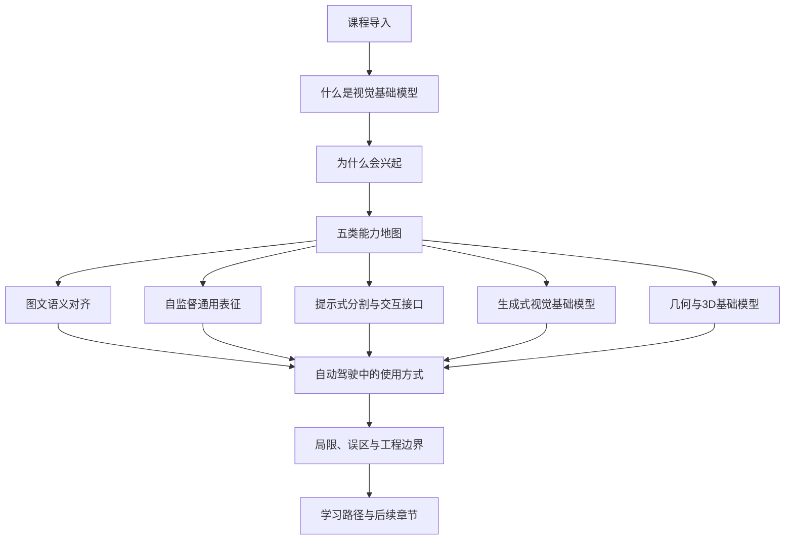
```mermaid
graph TD
    A[课程导入] --> B[什么是视觉基础模型]
    B --> C[为什么会兴起]
    C --> D[五类能力地图]
    D --> E1[图文语义对齐]
    D --> E2[自监督通用表征]
    D --> E3[提示式分割与交互接口]
    D --> E4[生成式视觉基础模型]
    D --> E5[几何与3D基础模型]
    E1 --> F[自动驾驶中的使用方式]
    E2 --> F
    E3 --> F
    E4 --> F
    E5 --> F
    F --> G[局限、误区与工程边界]
    G --> H[学习路径与后续章节]
```

<div id="chapter-31-docs-05-5-2-md-s05" class="doc-anchor doc-anchor-section doc-anchor-level-3"></div>

### 1.3 学习提醒

- 这一章重点是“视觉基础模型是什么、能做什么、放在哪里”。
- `VLM` 的内部结构、视觉 token、projector、指令微调，不在本章展开，留到 [5.3_视觉语言模型（VLM）基础.md](#chapter-32-docs-05-5-3-vlm-md)。
- `VLM` 的使用、微调、评测与工程落地，不在本章展开，留到 [5.4_VLM使用与微调.md](#chapter-33-docs-05-5-4-vlm-md)。

---

<div id="chapter-31-docs-05-5-2-md-s06" class="doc-anchor doc-anchor-section doc-anchor-level-2"></div>

## 2. 什么是视觉基础模型

“基础模型”这个词容易让人误解成“模型很大”或者“模型很新”。实际上，更准确的理解是：**它先在大规模、广覆盖的数据上学到通用能力，再通过少量适配迁移到很多下游任务。**

对于视觉领域来说，这意味着模型不再只为一个固定任务服务。例如，传统检测模型通常只会识别预先定义好的若干类别，而视觉基础模型往往希望提供更开放的接口：可以根据文本找目标、根据提示分割对象、根据海量无标注数据学习视觉表征，或者根据图像推断更一般的几何结构。

<div id="chapter-31-docs-05-5-2-md-s07" class="doc-anchor doc-anchor-section doc-anchor-level-3"></div>

### 2.1 一个更适合初学者的直觉定义

你可以把传统视觉模型理解为“专项工具”，把视觉基础模型理解为“通用视觉底座”。

- 专项工具：为单一任务优化，任务边界清晰，指标明确。
- 通用底座：先追求跨任务复用，再在不同场景中接出多种能力。

<div id="chapter-31-docs-05-5-2-md-s08" class="doc-anchor doc-anchor-section doc-anchor-level-3"></div>

### 2.2 传统任务模型 vs 视觉基础模型

| 维度 | 传统任务模型 | 视觉基础模型 |
|---|---|---|
| 训练目标 | 面向单一任务 | 面向通用能力预训练 |
| 数据来源 | 专项标注数据集 | 大规模互联网数据或跨域混合数据 |
| 类别空间 | 通常封闭 | 更强调开放词汇或通用表征 |
| 迁移方式 | 重新训练任务头 | 微调、提示、适配器、少样本迁移 |
| 接口形式 | 固定输入输出 | 文本提示、点框提示、通用 embedding、生成接口 |
| 典型优势 | 专项指标高、可控性强 | 泛化强、覆盖广、可复用性高 |
| 典型短板 | 泛化窄、长尾弱 | 实时性、可控性、闭环可靠性不稳定 |

<div id="chapter-31-docs-05-5-2-md-s09" class="doc-anchor doc-anchor-section doc-anchor-level-3"></div>

### 2.3 它和 VLM 的关系

视觉基础模型不是 VLM 的同义词。更准确地说：

- 视觉基础模型是一个更大的集合。
- VLM 是其中与语言接口结合最紧密的一支。
- 很多强视觉模型本身并不是 VLM，但它们会成为 VLM 的关键视觉底座。

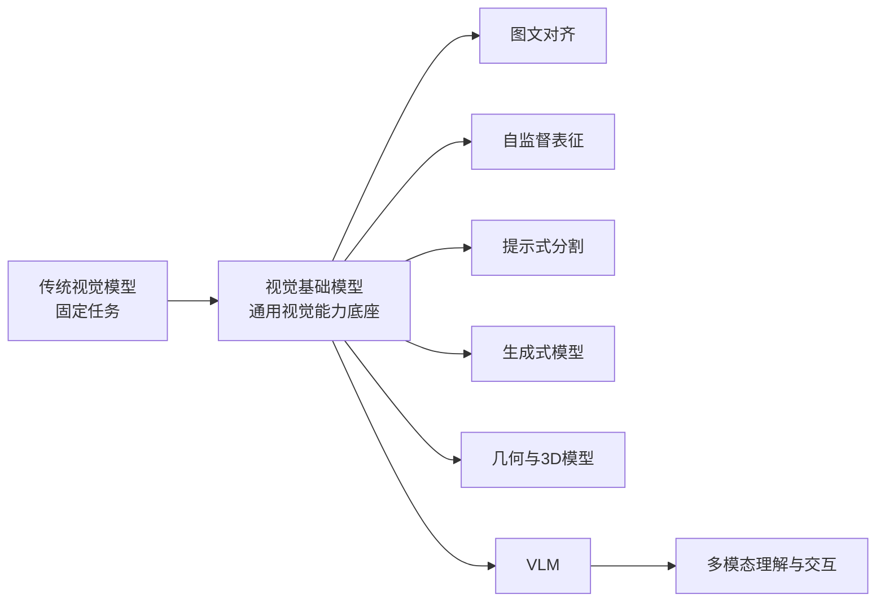
```mermaid
graph LR
    A[传统视觉模型<br/>固定任务] --> B[视觉基础模型<br/>通用视觉能力底座]
    B --> C1[图文对齐]
    B --> C2[自监督表征]
    B --> C3[提示式分割]
    B --> C4[生成式模型]
    B --> C5[几何与3D模型]
    B --> D[VLM]
    D --> E[多模态理解与交互]
```

<div id="chapter-31-docs-05-5-2-md-s10" class="doc-anchor doc-anchor-section doc-anchor-level-3"></div>

### 2.4 如果你只记住一句话

> **视觉基础模型不是“一个模型”，而是一类先学通用能力、再服务多任务的视觉能力底座。**

---

<div id="chapter-31-docs-05-5-2-md-s11" class="doc-anchor doc-anchor-section doc-anchor-level-2"></div>

## 3. 为什么视觉基础模型会兴起

视觉基础模型的兴起不是偶然事件，而是三股力量共同推动的结果：数据规模变了、训练范式变了、下游需求也变了。

<div id="chapter-31-docs-05-5-2-md-s12" class="doc-anchor doc-anchor-section doc-anchor-level-3"></div>

### 3.1 数据规模变了

以前很多视觉任务依赖人工精标数据集，比如分类、检测、分割等标准 benchmark。这样的数据非常有价值，但类别有限、场景有限、长尾有限。随着互联网图像、图文对、视频和多源数据的积累，研究者开始不满足于“只在一个封闭数据集上做高分”，而希望学到更一般的视觉能力。

<div id="chapter-31-docs-05-5-2-md-s13" class="doc-anchor doc-anchor-section doc-anchor-level-3"></div>

### 3.2 预训练范式变了

从监督学习走向自监督、对比学习、图文对齐、生成式建模以后，模型不必等所有标签都齐全才开始学习。模型可以先在海量数据上学表示，再在下游任务上适配。这个变化本质上让“先学底座、再接任务”成为现实。

<div id="chapter-31-docs-05-5-2-md-s14" class="doc-anchor doc-anchor-section doc-anchor-level-3"></div>

### 3.3 下游需求变了

工业系统越来越需要：

- 更强的跨场景迁移能力
- 对长尾目标和开放类别的处理能力
- 更低的人力标注依赖
- 更自然的人机交互接口
- 更强的数据构造与仿真能力

自动驾驶正好是这些需求最集中的场景之一。

<div id="chapter-31-docs-05-5-2-md-s15" class="doc-anchor doc-anchor-section doc-anchor-level-3"></div>

### 3.4 三个驱动力总表

| 驱动力 | 过去的状态 | 变化后的状态 | 带来的结果 |
|---|---|---|---|
| 数据 | 小规模、强标注、封闭数据集 | 大规模、多源、弱标注/无标注 | 可以先学通用视觉能力 |
| 训练目标 | 单任务监督训练 | 对比学习、自监督、生成式预训练 | 能力底座开始成型 |
| 下游需求 | 固定类别、固定接口 | 开放词汇、长尾、交互式接口 | 传统任务模型不再足够 |

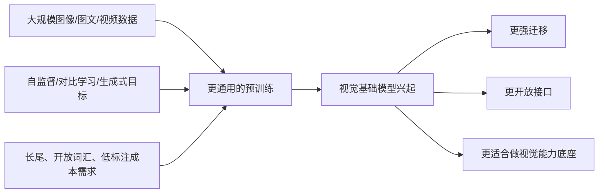
```mermaid
graph LR
    A[大规模图像/图文/视频数据] --> D[更通用的预训练]
    B[自监督/对比学习/生成式目标] --> D
    C[长尾、开放词汇、低标注成本需求] --> D
    D --> E[视觉基础模型兴起]
    E --> F[更强迁移]
    E --> G[更开放接口]
    E --> H[更适合做视觉能力底座]
```

<div id="chapter-31-docs-05-5-2-md-s16" class="doc-anchor doc-anchor-section doc-anchor-level-3"></div>

### 3.5 如果你只记住一句话

> **视觉基础模型兴起，不是因为“模型更大”本身，而是因为大数据、通用预训练和新需求终于对上了。**

---

<div id="chapter-31-docs-05-5-2-md-s17" class="doc-anchor doc-anchor-section doc-anchor-level-2"></div>

## 4. 五类能力地图

为了避免把这一章学成“模型名清单”，我们先建立一个能力地图。后面无论看到哪个新工作，都尽量先问：它主要属于哪一类能力？

<div id="chapter-31-docs-05-5-2-md-s18" class="doc-anchor doc-anchor-section doc-anchor-level-3"></div>

### 4.1 五类视觉基础模型总表

| 类别 | 核心问题 | 典型输入 | 典型输出 | 代表模型 | 在自动驾驶中的典型价值 |
|---|---|---|---|---|---|
| 图文语义对齐模型 | 图像语义如何与文本空间对齐 | 图像 + 文本 | 跨模态 embedding、开放词汇分类/检索 | `CLIP`、`SigLIP`、`OWL-ViT` | 长尾目标发现、开放词汇理解 |
| 自监督通用表征模型 | 没有大量标签时如何学视觉底座 | 图像/视频 | 通用视觉特征 | `DINO`、`I-JEPA`、`DINOv2` | 作为下游任务 backbone 或预训练底座 |
| 提示式分割与交互接口 | 如何把“任意对象分割”做成通用接口 | 图像 + 点/框/文本提示 | mask、区域、目标候选 | `Grounding DINO`、`SAM`、`SAM 2`、`SAM 3` | 标注加速、伪标注、交互式分割 |
| 生成式视觉基础模型 | 如何生成或编辑视觉数据 | 文本/图像/条件信号 | 合成图像、编辑结果 | `Stable Diffusion`、`SDXL` | 数据扩增、场景构造、仿真辅助 |
| 几何与3D基础模型 | 如何学习深度、结构和空间先验 | 单目/多视图图像 | 深度、几何表示、3D先验 | `MiDaS`、`Depth Anything`、`Depth Anything 3`、`VGGT` | 3D感知先验、结构理解 |

<div id="chapter-31-docs-05-5-2-md-s19" class="doc-anchor doc-anchor-section doc-anchor-level-3"></div>

### 4.2 五类能力关系图

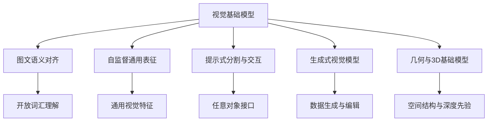
```mermaid
graph TD
    A[视觉基础模型] --> B[图文语义对齐]
    A --> C[自监督通用表征]
    A --> D[提示式分割与交互]
    A --> E[生成式视觉模型]
    A --> F[几何与3D基础模型]
    B --> G[开放词汇理解]
    C --> H[通用视觉特征]
    D --> I[任意对象接口]
    E --> J[数据生成与编辑]
    F --> K[空间结构与深度先验]
```

<div id="chapter-31-docs-05-5-2-md-s20" class="doc-anchor doc-anchor-section doc-anchor-level-3"></div>

### 4.3 一个重要提醒

这五类不是完全割裂的。很多系统会把它们组合起来：

- `CLIP` 类模型提供语义词汇接口
- `SAM` 类模型提供区域级接口
- 自监督模型提供稳定的视觉特征
- 生成式模型帮助构造数据
- 几何模型补足空间结构先验

后面进入 VLM 时，你会看到这些能力被进一步组合进统一的多模态系统中。

<div id="chapter-31-docs-05-5-2-md-s21" class="doc-anchor doc-anchor-section doc-anchor-level-3"></div>

### 4.4 如果你只记住一句话

> **不要先背模型名，先把模型放回“语义、表征、接口、生成、几何”这五类能力主题里。**

---

<div id="chapter-31-docs-05-5-2-md-s22" class="doc-anchor doc-anchor-section doc-anchor-level-2"></div>

## 5. 五大类模型逐类讲解

下面五节采用统一模板：

- 这一类模型解决什么问题
- 输入和输出是什么
- 与传统任务模型差别在哪里
- 代表工作时间线
- 2 到 4 个代表模型简讲
- 核心贡献
- 在自动驾驶里放在哪
- 不能替代什么
- 一张总结表

<div id="chapter-31-docs-05-5-2-md-s23" class="doc-anchor doc-anchor-section doc-anchor-level-3"></div>

### 5.1 图文语义对齐模型

<div id="chapter-31-docs-05-5-2-md-s24" class="doc-anchor doc-anchor-section doc-anchor-level-4"></div>

#### 5.1.1 这一类模型在解决什么问题

传统视觉分类和检测往往依赖封闭标签集。问题在于，真实世界并不是只包含数据集里那几十类或几百类目标。图文语义对齐模型试图解决的是：**能不能把图像映射到和语言共享的语义空间里，让视觉系统拥有更开放的词汇接口。**

<div id="chapter-31-docs-05-5-2-md-s25" class="doc-anchor doc-anchor-section doc-anchor-level-4"></div>

#### 5.1.2 输入和输出是什么

| 项目 | 内容 |
|---|---|
| 典型输入 | 图像、文本描述、类别短语 |
| 典型输出 | 图像 embedding、文本 embedding、匹配分数、开放词汇类别、区域级检索结果 |
| 典型能力 | 图文检索、零样本分类、开放词汇检测 |

<div id="chapter-31-docs-05-5-2-md-s26" class="doc-anchor doc-anchor-section doc-anchor-level-4"></div>

#### 5.1.3 与传统任务模型差别在哪里

- 传统分类模型回答“这是不是预设类别中的某一类”。
- 图文对齐模型回答“这张图和哪段文本更语义一致”。

这意味着它的类别空间不再完全由训练时的 softmax 分类头锁死，而是部分转移到语言空间中。

<div id="chapter-31-docs-05-5-2-md-s27" class="doc-anchor doc-anchor-section doc-anchor-level-4"></div>

#### 5.1.4 代表工作时间线

- `CLIP (2021)`：把海量图文对齐做成通用视觉语义接口。
- `OWL-ViT (2022)`：把开放词汇能力推进到目标检测。
- `SigLIP (2023)`：对图文对齐训练目标进行改进。

<div id="chapter-31-docs-05-5-2-md-s28" class="doc-anchor doc-anchor-section doc-anchor-level-4"></div>

#### 5.1.5 代表模型简讲

`CLIP` 是很多同学接触视觉 foundation model 的起点。它最重要的贡献不只是“零样本分类”，而是让视觉模型第一次大规模获得了自然语言词汇接口。  

`OWL-ViT` 可以理解为把开放词汇能力从整图分类推进到区域级检测。它回答的是“图里有没有我用文本描述的目标，并且它在哪里”。  

`SigLIP` 延续了 CLIP 路线，但在训练目标设计上做了改进，反映出这条路线已经从“概念证明”进入“训练细节和工程质量继续优化”的阶段。

<div id="chapter-31-docs-05-5-2-md-s29" class="doc-anchor doc-anchor-section doc-anchor-level-4"></div>

#### 5.1.6 这类模型的核心贡献

- 把视觉语义映射进语言空间
- 提供开放词汇接口
- 明显提升长尾类别发现能力
- 成为后续大量 VLM 的视觉语义基础

<div id="chapter-31-docs-05-5-2-md-s30" class="doc-anchor doc-anchor-section doc-anchor-level-4"></div>

#### 5.1.7 在自动驾驶里最适合放在哪

最适合的位置不是直接替代主感知闭环，而是作为“开放语义接口”使用：

- 长尾目标发现
- 场景语义检索
- 数据筛选与聚类
- 稀有事件召回

例如，当我们想在海量日志中找“施工锥桶旁边的临时告示牌”这类长尾场景时，开放词汇接口通常比固定类别检测器更灵活。

<div id="chapter-31-docs-05-5-2-md-s31" class="doc-anchor doc-anchor-section doc-anchor-level-4"></div>

#### 5.1.8 它不能替代什么

- 不能直接替代高实时、高确定性的主检测器
- 不能保证精确的几何定位
- 不能天然解决时序稳定性问题

<div id="chapter-31-docs-05-5-2-md-s32" class="doc-anchor doc-anchor-section doc-anchor-level-4"></div>

#### 5.1.9 总结表

| 模型 | 年份 | 解决重点 | 代表能力 | 自动驾驶中的价值 |
|---|---|---|---|---|
| `CLIP` | 2021 | 图文共享语义空间 | 零样本分类、图文检索 | 开放语义入口、长尾理解 |
| `OWL-ViT` | 2022 | 开放词汇检测 | 文本找目标位置 | 长尾目标发现、场景查询 |
| `SigLIP` | 2023 | 图文对齐目标优化 | 更稳健的图文语义匹配 | 更好的底座表征与检索 |

<div id="chapter-31-docs-05-5-2-md-s33" class="doc-anchor doc-anchor-section doc-anchor-level-3"></div>

### 5.2 自监督通用表征模型

<div id="chapter-31-docs-05-5-2-md-s34" class="doc-anchor doc-anchor-section doc-anchor-level-4"></div>

#### 5.2.1 这一类模型在解决什么问题

图文语义对齐强调“和语言对齐”，自监督通用表征模型强调“即使没有大量标签，也要先把视觉特征学好”。  

它们解决的是一个更底层的问题：**如果我们先不急着做具体任务，能不能直接从海量图像中学到足够泛化的视觉表示。**

<div id="chapter-31-docs-05-5-2-md-s35" class="doc-anchor doc-anchor-section doc-anchor-level-4"></div>

#### 5.2.2 输入和输出是什么

| 项目 | 内容 |
|---|---|
| 典型输入 | 图像、图像增强视图、局部 patch、上下文区域 |
| 典型输出 | 通用视觉特征、patch-level 表征、dense feature |
| 典型能力 | 下游迁移、检索、聚类、分割初始化、检测 backbone |

<div id="chapter-31-docs-05-5-2-md-s36" class="doc-anchor doc-anchor-section doc-anchor-level-4"></div>

#### 5.2.3 与传统任务模型差别在哪里

传统任务模型常常把特征学习绑定在一个具体监督任务上。自监督基础模型则先让模型在更一般的训练目标下学习结构化视觉表示，再把这些表示迁移出去。

这类模型的价值往往体现在：

- 标签不够时更有优势
- 迁移到多个任务时更稳定
- 常常可以作为更强的视觉 backbone

<div id="chapter-31-docs-05-5-2-md-s37" class="doc-anchor doc-anchor-section doc-anchor-level-4"></div>

#### 5.2.4 代表工作时间线

- `DINO (2021)`：蒸馏式自监督表征的代表。
- `I-JEPA (2023)`：强调预测式世界结构理解。
- `DINOv2 (2023)`：把大规模通用视觉底座做成熟。
- `DINOv3 (2025)`：继续扩大规模与密集特征能力。

<div id="chapter-31-docs-05-5-2-md-s38" class="doc-anchor doc-anchor-section doc-anchor-level-4"></div>

#### 5.2.5 代表模型简讲

`DINO` 的重要意义在于，它让人们看到：即使没有传统标签，模型也可以学到非常有用的视觉表征。  

`I-JEPA` 代表的是另一种思路：不是只做视图对齐，而是做更偏预测式的表示学习，强调对上下文和结构的理解。  

`DINOv2` 则更像“通用视觉 backbone 的工程成熟版”。它不是只证明一个想法，而是把大规模数据、训练策略和下游可迁移性做到了更稳定的水平。

<div id="chapter-31-docs-05-5-2-md-s39" class="doc-anchor doc-anchor-section doc-anchor-level-4"></div>

#### 5.2.6 这类模型的核心贡献

- 降低对人工标注的依赖
- 提供通用视觉底座
- 让下游任务能从更强的初始化出发
- 为分割、检测、检索、VLM 等系统提供视觉 backbone

<div id="chapter-31-docs-05-5-2-md-s40" class="doc-anchor doc-anchor-section doc-anchor-level-4"></div>

#### 5.2.7 在自动驾驶里最适合放在哪

- 作为感知模型的预训练 backbone
- 用于数据聚类、场景检索和表示学习
- 作为下游检测、分割、追踪模型的初始化

这类模型的“工程价值”很强，因为它们往往不直接面向最终用户，而是提升整个感知栈的底层特征质量。

<div id="chapter-31-docs-05-5-2-md-s41" class="doc-anchor doc-anchor-section doc-anchor-level-4"></div>

#### 5.2.8 它不能替代什么

- 不能直接替代完整任务头
- 不能直接给出开放语义解释
- 不能自动解决闭环策略问题

<div id="chapter-31-docs-05-5-2-md-s42" class="doc-anchor doc-anchor-section doc-anchor-level-4"></div>

#### 5.2.9 总结表

| 模型 | 年份 | 解决重点 | 代表能力 | 自动驾驶中的价值 |
|---|---|---|---|---|
| `DINO` | 2021 | 蒸馏式自监督表征 | 通用特征学习 | 预训练 backbone |
| `I-JEPA` | 2023 | 预测式视觉表示学习 | 上下文结构理解 | 更强的表征学习思路 |
| `DINOv2` | 2023 | 大规模通用底座成熟化 | 强迁移 dense feature | 多任务预训练底座 |
| `DINOv3` | 2025 | 更大规模与更强密集表征 | 更强下游迁移 | 更先进视觉底座候选 |

<div id="chapter-31-docs-05-5-2-md-s43" class="doc-anchor doc-anchor-section doc-anchor-level-3"></div>

### 5.3 提示式分割与交互式接口模型

<div id="chapter-31-docs-05-5-2-md-s44" class="doc-anchor doc-anchor-section doc-anchor-level-4"></div>

#### 5.3.1 这一类模型在解决什么问题

很多视觉系统不是“不知道图里是什么”，而是不知道“用户到底想要哪一个对象”。  

提示式分割模型解决的问题是：**把对象级交互做成一个通用接口，让系统根据点、框、文本等提示快速产出区域级结果。**

<div id="chapter-31-docs-05-5-2-md-s45" class="doc-anchor doc-anchor-section doc-anchor-level-4"></div>

#### 5.3.2 输入和输出是什么

| 项目 | 内容 |
|---|---|
| 典型输入 | 图像、点提示、框提示、文本提示、视频序列 |
| 典型输出 | mask、候选区域、目标区域轨迹 |
| 典型能力 | 任意对象分割、交互标注、区域提议、视频对象跟踪式分割 |

<div id="chapter-31-docs-05-5-2-md-s46" class="doc-anchor doc-anchor-section doc-anchor-level-4"></div>

#### 5.3.3 与传统任务模型差别在哪里

传统分割器一般只在固定类别或固定任务上输出 mask。提示式模型则强调“接口通用”：

- 输入提示变了，输出对象就变了
- 不一定预设类别
- 更适合做人机协同和数据生产

<div id="chapter-31-docs-05-5-2-md-s47" class="doc-anchor doc-anchor-section doc-anchor-level-4"></div>

#### 5.3.4 代表工作时间线

- `Grounding DINO (2023)`：把文本 grounding 到目标区域。
- `SAM (2023)`：把任意对象分割做成通用接口。
- `SAM 2 (2024)`：从图像拓展到视频与时序对象。
- `SAM 3 (2025)`：把 concept prompt、检测、分割和视频跟踪进一步统一到一个更开放的接口里。

<div id="chapter-31-docs-05-5-2-md-s48" class="doc-anchor doc-anchor-section doc-anchor-level-4"></div>

#### 5.3.5 代表模型简讲

`Grounding DINO` 更像“文本找框”的前端。它回答的是“你说的那个东西，可能在图里的哪里”。  

`SAM` 更像“区域切割接口”的后端。给它点、框或区域提示，它就努力产出对应 mask。  

`SAM 3` 则代表这条路线进一步从“任意对象分割”走向“带概念的统一分割接口”。它不只关心用户点中了哪里，还试图理解“黄色校车”“施工锥桶”这类概念级提示，并把检测、分割、跟踪串成一条更完整的开放世界工作流。  

把两者串起来时，会出现一个非常实用的工程工作流：先用文本模型找候选目标，再用分割模型切出精确区域。

<div id="chapter-31-docs-05-5-2-md-s49" class="doc-anchor doc-anchor-section doc-anchor-level-4"></div>

#### 5.3.6 一条典型工作流

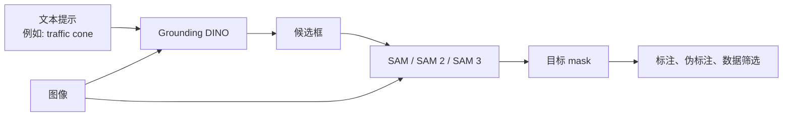
```mermaid
graph LR
    A[文本提示<br/>例如: traffic cone] --> B[Grounding DINO]
    C[图像] --> B
    B --> D[候选框]
    C --> E[SAM / SAM 2 / SAM 3]
    D --> E
    E --> F[目标 mask]
    F --> G[标注、伪标注、数据筛选]
```

<div id="chapter-31-docs-05-5-2-md-s50" class="doc-anchor doc-anchor-section doc-anchor-level-4"></div>

#### 5.3.7 这类模型的核心贡献

- 把任意对象分割做成统一接口
- 降低大规模标注成本
- 让开放词汇与区域级操作连接起来
- 让人机交互式标注效率显著提高

<div id="chapter-31-docs-05-5-2-md-s51" class="doc-anchor doc-anchor-section doc-anchor-level-4"></div>

#### 5.3.8 在自动驾驶里最适合放在哪

- 标注平台加速
- 伪标注生成
- 长尾目标区域提取
- 视频对象跟踪式分割辅助

这类模型在自动驾驶中的最大价值，通常不是“在线推理替代主感知”，而是“离线数据闭环生产率提升”。

<div id="chapter-31-docs-05-5-2-md-s52" class="doc-anchor doc-anchor-section doc-anchor-level-4"></div>

#### 5.3.9 它不能替代什么

- 不能天然保证车规级实时性
- 不能替代高稳定性的专用在线分割/检测链路
- 文本提示和 mask 结果仍可能不稳定

<div id="chapter-31-docs-05-5-2-md-s53" class="doc-anchor doc-anchor-section doc-anchor-level-4"></div>

#### 5.3.10 总结表

| 模型 | 年份 | 解决重点 | 代表能力 | 自动驾驶中的价值 |
|---|---|---|---|---|
| `Grounding DINO` | 2023 | 文本到目标区域 | grounding、开放词汇定位 | 长尾目标区域召回 |
| `SAM` | 2023 | 通用任意对象分割 | 点框提示分割 | 标注效率提升 |
| `SAM 2` | 2024 | 视频与时序对象分割 | 时序分割接口 | 视频标注与跟踪辅助 |
| `SAM 3` | 2025 | 概念提示下的统一检测-分割-跟踪 | promptable concept segmentation | 更开放的长尾对象分割与跟踪接口 |

<div id="chapter-31-docs-05-5-2-md-s54" class="doc-anchor doc-anchor-section doc-anchor-level-3"></div>

### 5.4 生成式视觉基础模型

<div id="chapter-31-docs-05-5-2-md-s55" class="doc-anchor doc-anchor-section doc-anchor-level-4"></div>

#### 5.4.1 这一类模型在解决什么问题

生成式视觉模型解决的不是“看懂图像”，而是“生成、编辑或补足图像数据”。  

这听起来离自动驾驶感知很远，但实际上它们对数据构造、仿真、场景扩充、极端样本增强非常重要。

<div id="chapter-31-docs-05-5-2-md-s56" class="doc-anchor doc-anchor-section doc-anchor-level-4"></div>

#### 5.4.2 输入和输出是什么

| 项目 | 内容 |
|---|---|
| 典型输入 | 文本提示、图像条件、区域掩码、控制条件 |
| 典型输出 | 合成图像、编辑图像、条件生成结果 |
| 典型能力 | 文生图、图像编辑、风格迁移、场景扩增 |

<div id="chapter-31-docs-05-5-2-md-s57" class="doc-anchor doc-anchor-section doc-anchor-level-4"></div>

#### 5.4.3 与传统任务模型差别在哪里

传统视觉模型主要做“识别”，生成式模型主要做“构造”。  

这意味着它们不一定直接提升主感知网络的在线精度，但会显著影响：

- 数据供给能力
- 长尾样本覆盖
- 仿真与合成场景构建
- 模型训练前的数据准备效率

<div id="chapter-31-docs-05-5-2-md-s58" class="doc-anchor doc-anchor-section doc-anchor-level-4"></div>

#### 5.4.4 代表工作时间线

- `Latent Diffusion / Stable Diffusion (2022)`：把开放世界视觉生成做成通用平台。
- `SDXL (2023)`：在分辨率、质量和文本一致性上进一步增强。

<div id="chapter-31-docs-05-5-2-md-s59" class="doc-anchor doc-anchor-section doc-anchor-level-4"></div>

#### 5.4.5 代表模型简讲

`Stable Diffusion` 的意义在于，它把生成式图像模型从“少数实验室能力”变成了“广泛可用的开放平台能力”。  

`SDXL` 则代表这条路线进入更强工程质量阶段：更高分辨率、更自然的细节、更稳定的文本控制。

<div id="chapter-31-docs-05-5-2-md-s60" class="doc-anchor doc-anchor-section doc-anchor-level-4"></div>

#### 5.4.6 这类模型的核心贡献

- 用生成能力缓解数据稀缺
- 为长尾与极端场景构造提供工具
- 为仿真场景、多样性增强、编辑式数据构造提供基础设施

<div id="chapter-31-docs-05-5-2-md-s61" class="doc-anchor doc-anchor-section doc-anchor-level-4"></div>

#### 5.4.7 在自动驾驶里最适合放在哪

- 稀有场景扩增
- 天气、光照、施工态等条件变化构造
- 仿真资产补充
- 数据闭环中的场景编辑与样本增强

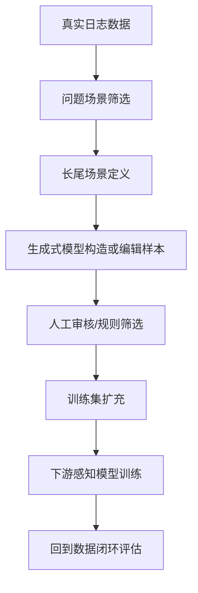
```mermaid
graph TD
    A[真实日志数据] --> B[问题场景筛选]
    B --> C[长尾场景定义]
    C --> D[生成式模型构造或编辑样本]
    D --> E[人工审核/规则筛选]
    E --> F[训练集扩充]
    F --> G[下游感知模型训练]
    G --> H[回到数据闭环评估]
```

<div id="chapter-31-docs-05-5-2-md-s62" class="doc-anchor doc-anchor-section doc-anchor-level-4"></div>

#### 5.4.8 它不能替代什么

- 不能直接证明在线闭环性能一定提升
- 不能保证生成数据完全符合物理与传感器统计
- 不能替代高保真仿真器和真实道路数据

<div id="chapter-31-docs-05-5-2-md-s63" class="doc-anchor doc-anchor-section doc-anchor-level-4"></div>

#### 5.4.9 总结表

| 模型 | 年份 | 解决重点 | 代表能力 | 自动驾驶中的价值 |
|---|---|---|---|---|
| `Stable Diffusion` | 2022 | 开放视觉生成平台 | 文生图、图像编辑 | 数据扩增与场景构造 |
| `SDXL` | 2023 | 更高质量生成 | 高分辨率、更好文本一致性 | 更高质量合成样本 |

<div id="chapter-31-docs-05-5-2-md-s64" class="doc-anchor doc-anchor-section doc-anchor-level-3"></div>

### 5.5 几何与 3D 基础模型

<div id="chapter-31-docs-05-5-2-md-s65" class="doc-anchor doc-anchor-section doc-anchor-level-4"></div>

#### 5.5.1 这一类模型在解决什么问题

前四类模型里，语义能力很强，但自动驾驶还需要另一种关键能力：**对空间结构的理解。**  

几何与 3D 基础模型试图解决的问题是：如何从图像中学到深度、结构和空间先验，并把这些能力做成更通用的几何底座。

<div id="chapter-31-docs-05-5-2-md-s66" class="doc-anchor doc-anchor-section doc-anchor-level-4"></div>

#### 5.5.2 输入和输出是什么

| 项目 | 内容 |
|---|---|
| 典型输入 | 单目图像、多视图图像、视频帧 |
| 典型输出 | 深度图、几何特征、3D结构先验、场景表示 |
| 典型能力 | 单目深度估计、多视图几何理解、场景结构恢复 |

<div id="chapter-31-docs-05-5-2-md-s67" class="doc-anchor doc-anchor-section doc-anchor-level-4"></div>

#### 5.5.3 与传统任务模型差别在哪里

传统深度估计器常针对单一数据集或固定场景优化。几何 foundation model 更强调：

- 跨场景泛化
- 从大规模视觉数据中学习通用几何先验
- 将几何理解作为可复用底座，而非一次性任务头

<div id="chapter-31-docs-05-5-2-md-s68" class="doc-anchor doc-anchor-section doc-anchor-level-4"></div>

#### 5.5.4 代表工作时间线

- `MiDaS v3.1 (2023)`：单目深度的重要通用基线。
- `Depth Anything (2024)`：通用单目深度 foundation model 路线成型。
- `Depth Anything V2 (2024)`：更强更快的增强版本。
- `Depth Anything 3 / DA3 (2025-11-14 公开)`：从单图深度进一步走向 any-view geometry 与相机位姿估计。
- `VGGT (2025)`：几何 foundation model 的代表方向。

<div id="chapter-31-docs-05-5-2-md-s69" class="doc-anchor doc-anchor-section doc-anchor-level-4"></div>

#### 5.5.5 代表模型简讲

`MiDaS` 可以看作单目深度通用化道路上的重要基线。  

`Depth Anything` 之所以重要，是因为它把“深度估计不是一个固定 benchmark 小任务，而是一种可迁移几何底座”这件事讲得更清楚了。  

`Depth Anything 3` 则把问题进一步扩展了。它不再只强调“单张图的深度好不好”，而是把目标推向“任意视角输入下的空间几何恢复”，同时覆盖多视图深度、相机位姿估计、3D Gaussian 等更完整的视觉几何任务。这说明几何 foundation model 正在从“深度模型”向“视觉空间恢复底座”演化。  

`VGGT` 则更进一步，把几何理解推向更 general 的 foundation model 方向，强调的不只是某一张图的深度，而是更一般的空间结构能力。

<div id="chapter-31-docs-05-5-2-md-s70" class="doc-anchor doc-anchor-section doc-anchor-level-4"></div>

#### 5.5.6 一条几何到 3D 感知的理解链路

```mermaid
graph LR
    A[图像/多视图输入] --> B[深度与几何基础模型]
    B --> C[深度先验/结构先验]
    C --> D[3D感知模块]
    D --> E[BEV/占据/场景结构理解]
    E --> F[规划所需空间语义]
```

<div id="chapter-31-docs-05-5-2-md-s71" class="doc-anchor doc-anchor-section doc-anchor-level-4"></div>

#### 5.5.7 这类模型的核心贡献

- 提供更通用的几何先验
- 缓解特定数据集几何过拟合
- 为 3D 感知任务提供更强初始化或辅助约束

<div id="chapter-31-docs-05-5-2-md-s72" class="doc-anchor doc-anchor-section doc-anchor-level-4"></div>

#### 5.5.8 在自动驾驶里最适合放在哪

- 深度先验与几何先验增强
- 单目或多视图 3D 感知辅助
- 场景结构理解
- BEV、占据和三维语义建模的上游补充

<div id="chapter-31-docs-05-5-2-md-s73" class="doc-anchor doc-anchor-section doc-anchor-level-4"></div>

#### 5.5.9 它不能替代什么

- 不能替代完整的多传感器融合系统
- 不能保证所有距离尺度都精确可靠
- 不能自动解决动态目标预测和行为建模

<div id="chapter-31-docs-05-5-2-md-s74" class="doc-anchor doc-anchor-section doc-anchor-level-4"></div>

#### 5.5.10 总结表

| 模型 | 年份 | 解决重点 | 代表能力 | 自动驾驶中的价值 |
|---|---|---|---|---|
| `MiDaS v3.1` | 2023 | 通用单目深度基线 | 深度估计 | 深度先验参考 |
| `Depth Anything` | 2024 | 通用深度 foundation model | 更强跨域深度泛化 | 单目/多场景几何底座 |
| `Depth Anything V2` | 2024 | 强化版本 | 更强性能与适应性 | 更实用的深度底座 |
| `Depth Anything 3` | 2025 | any-view geometry 与统一视觉空间恢复 | 多视图深度、位姿、3D几何 | 更完整的几何 foundation model 候选 |
| `VGGT` | 2025 | 几何 foundation model | 更一般空间结构能力 | 3D感知与世界建模先验 |

<div id="chapter-31-docs-05-5-2-md-s75" class="doc-anchor doc-anchor-section doc-anchor-level-3"></div>

### 5.6 五类模型阶段性小结

到这里你应该形成一个稳定印象：

- 图文对齐模型提供开放语义接口
- 自监督模型提供通用视觉特征
- 提示式分割模型提供交互式区域接口
- 生成式模型提供数据构造能力
- 几何模型提供空间结构先验

> **这五类模型的共同点不是“做同一件事”，而是都在把某种视觉能力从任务模型提升为可复用的底座能力。**

---

<div id="chapter-31-docs-05-5-2-md-s76" class="doc-anchor doc-anchor-section doc-anchor-level-2"></div>

## 6. 自动驾驶如何使用这些模型能力

理解视觉基础模型，最终还是要回答一个工程问题：**它们到底应该放进自动驾驶系统的哪里。**

一个很实用的判断原则是：

- 语义开放性强的模型，适合做高层语义接口和数据闭环工具
- 表征强的模型，适合做底层 backbone 或预训练底座
- 交互式模型，适合做标注和数据生产工具
- 生成式模型，适合做数据构造与仿真补充
- 几何模型，适合做 3D 先验和结构理解补充

<div id="chapter-31-docs-05-5-2-md-s77" class="doc-anchor doc-anchor-section doc-anchor-level-3"></div>

### 6.1 五类模型与自动驾驶任务映射表

| 模型类别 | 最适合的系统位置 | 主要价值 | 不建议直接承担的角色 |
|---|---|---|---|
| 图文语义对齐 | 日志检索、长尾发现、开放语义接口 | 稀有目标召回、语义搜索 | 主闭环检测器 |
| 自监督通用表征 | backbone 预训练、表示学习 | 提升多任务底座质量 | 直接输出最终驾驶决策 |
| 提示式分割与交互 | 标注平台、伪标注流水线 | 降本增效、人机协同 | 车端实时主分割器 |
| 生成式视觉模型 | 数据扩增、仿真补充、场景编辑 | 提升样本多样性 | 替代真实道路数据 |
| 几何与3D模型 | 深度先验、结构先验、3D辅助 | 增强空间理解 | 替代完整多传感器几何系统 |

<div id="chapter-31-docs-05-5-2-md-s78" class="doc-anchor doc-anchor-section doc-anchor-level-3"></div>

### 6.2 自动驾驶中的典型落位图

```mermaid
graph TD
    A[多传感器与日志数据] --> B[数据闭环]
    B --> C1[图文对齐模型<br/>长尾检索]
    B --> C2[提示式分割模型<br/>标注与伪标注]
    B --> C3[生成式模型<br/>数据扩增]
    A --> D[感知训练栈]
    D --> E1[自监督底座<br/>预训练 backbone]
    D --> E2[几何基础模型<br/>深度与结构先验]
    E1 --> F[检测/分割/跟踪/3D感知]
    E2 --> F
    F --> G[规划与控制系统]
```

<div id="chapter-31-docs-05-5-2-md-s79" class="doc-anchor doc-anchor-section doc-anchor-level-3"></div>

### 6.3 三个最常见的高价值用法

<div id="chapter-31-docs-05-5-2-md-s80" class="doc-anchor doc-anchor-section doc-anchor-level-4"></div>

#### 6.3.1 开放词汇长尾目标发现

当传统标签集没有覆盖目标时，图文语义对齐模型可以帮助我们在海量日志中检索新类别或稀有类别。

<div id="chapter-31-docs-05-5-2-md-s81" class="doc-anchor doc-anchor-section doc-anchor-level-4"></div>

#### 6.3.2 标注加速与伪标注链路

`Grounding DINO + SAM` 这类组合特别适合做“文本找目标 + 区域切割”的离线数据生产链路。

<div id="chapter-31-docs-05-5-2-md-s82" class="doc-anchor doc-anchor-section doc-anchor-level-4"></div>

#### 6.3.3 3D 先验与结构增强

几何基础模型不一定直接上车，但可以作为训练时的辅助监督、先验约束或数据理解工具，提升 3D 感知模型的底座质量。

<div id="chapter-31-docs-05-5-2-md-s83" class="doc-anchor doc-anchor-section doc-anchor-level-3"></div>

### 6.4 为什么多数情况下不直接端到端上车

很多视觉 foundation model 在公开 benchmark 上很强，但自动驾驶是一个对以下因素都极其敏感的系统：

- 实时性
- 稳定性
- 时序一致性
- 长尾安全性
- 闭环可解释性
- 车规算力成本

因此，它们更常见的角色是“增强器”和“底座能力”，而不是直接取代安全关键链路。

---

<div id="chapter-31-docs-05-5-2-md-s84" class="doc-anchor doc-anchor-section doc-anchor-level-2"></div>

## 7. 局限、误区与工程边界

视觉基础模型非常重要，但如果理解方式不稳，很容易高估它们。

<div id="chapter-31-docs-05-5-2-md-s85" class="doc-anchor doc-anchor-section doc-anchor-level-3"></div>

### 7.1 常见误区与正确理解

| 常见误区 | 更准确的理解 |
|---|---|
| foundation model 很强，所以可以直接替代车端感知栈 | 强能力不等于高可靠闭环部署 |
| 语义理解强，就代表几何理解也强 | 语义强和几何强是两件事 |
| 生成能力强，就能随意造训练数据 | 生成数据仍受物理真实性、分布偏差和筛选流程约束 |
| 开放词汇检测强，就能替代主检测器 | 开放词汇更适合长尾补充与离线分析 |
| 提示式分割很强，就能直接实时在线全量跑 | 交互式接口价值更大，在线部署需严格约束 |

<div id="chapter-31-docs-05-5-2-md-s86" class="doc-anchor doc-anchor-section doc-anchor-level-3"></div>

### 7.2 一个能力边界图

```mermaid
graph TD
    A[视觉基础模型能力很强] --> B[语义理解强]
    A --> C[迁移能力强]
    A --> D[交互接口强]
    A --> E[数据构造强]
    A --> F[几何先验增强]
    B --> G[不等于车规级可靠]
    C --> G
    D --> G
    E --> H[不等于物理真实]
    F --> I[不等于完整3D闭环]
```

<div id="chapter-31-docs-05-5-2-md-s87" class="doc-anchor doc-anchor-section doc-anchor-level-3"></div>

### 7.3 三条最重要的工程边界

<div id="chapter-31-docs-05-5-2-md-s88" class="doc-anchor doc-anchor-section doc-anchor-level-4"></div>

#### 7.3.1 foundation model 强，不等于车规可靠

公开数据集性能和真实道路闭环性能之间隔着很长一条工程链路。任何进入主链路的模型，都必须经受时延、温度、算力、时序和失效模式分析。

<div id="chapter-31-docs-05-5-2-md-s89" class="doc-anchor doc-anchor-section doc-anchor-level-4"></div>

#### 7.3.2 互联网预训练分布，不等于车载分布

互联网图像和自动驾驶车载数据在视角、遮挡、天气、夜间、传感器噪声、运动模糊上差异很大。  

所以 foundation model 提供的是一个好起点，而不是直接可用的终点。

<div id="chapter-31-docs-05-5-2-md-s90" class="doc-anchor doc-anchor-section doc-anchor-level-4"></div>

#### 7.3.3 语义强不等于几何强，生成强不等于可控强

这两句几乎可以当作整个章节的工程提醒：

- 会看图说话，不等于能稳定判断空间距离。
- 会生成逼真图像，不等于能生成满足闭环训练要求的数据。

<div id="chapter-31-docs-05-5-2-md-s91" class="doc-anchor doc-anchor-section doc-anchor-level-3"></div>

### 7.4 如果你只记住一句话

> **视觉基础模型最适合被看作“能力放大器”，而不是“无需约束即可直接替代系统”的万能模块。**

---

<div id="chapter-31-docs-05-5-2-md-s92" class="doc-anchor doc-anchor-section doc-anchor-level-2"></div>

## 8. 学习路径与章节衔接

<div id="chapter-31-docs-05-5-2-md-s93" class="doc-anchor doc-anchor-section doc-anchor-level-3"></div>

### 8.1 建议的学习顺序

对于初学者，最好的顺序不是按模型发表年份背，而是按“能力主题”学习：

1. 先理解视觉基础模型和传统任务模型的差别
2. 再理解五类能力主题
3. 再看每类代表工作
4. 最后再进入 VLM，把这些能力组合起来看

```mermaid
graph LR
    A[理解基础概念] --> B[理解五类能力]
    B --> C[看代表模型]
    C --> D[理解自动驾驶落位]
    D --> E[进入VLM基础]
    E --> F[进入VLM使用与微调]
```

<div id="chapter-31-docs-05-5-2-md-s94" class="doc-anchor doc-anchor-section doc-anchor-level-3"></div>

### 8.2 与相邻章节的边界速查表

| 章节 | 主要问题 | 本章是否展开 |
|---|---|---|
| `5.2 视觉基础大模型` | 视觉 foundation model 是什么、有哪些能力、怎么落位 | 是 |
| `5.3 视觉语言模型（VLM）基础` | VLM 的结构、visual token、projector、训练范式 | 否，本章只做前置铺垫 |
| `5.4 VLM 使用与微调` | 自动驾驶里怎么接入、微调、评测、工程落地 | 否，本章不展开具体微调流程 |

<div id="chapter-31-docs-05-5-2-md-s95" class="doc-anchor doc-anchor-section doc-anchor-level-3"></div>

### 8.3 读论文时建议固定问自己的五个问题

1. 这个工作主要属于五类能力中的哪一类？
2. 它解决的核心问题是什么？
3. 它的输入输出接口是什么？
4. 它更适合放在训练前、训练中、离线工具链，还是在线系统里？
5. 它真正改变了什么，而不是只把指标又推高了一点点？

<div id="chapter-31-docs-05-5-2-md-s96" class="doc-anchor doc-anchor-section doc-anchor-level-3"></div>

### 8.4 本章复习速查表

| 复习点 | 你应当能说出的关键词 |
|---|---|
| 基础模型定义 | 通用底座、先预训练后迁移、多任务复用 |
| 兴起原因 | 大数据、预训练范式变化、开放需求 |
| 五类能力 | 语义、表征、接口、生成、几何 |
| 自动驾驶价值 | 长尾发现、底座预训练、标注加速、数据扩增、3D先验 |
| 工程边界 | 实时性、可靠性、分布差异、可控性 |

<div id="chapter-31-docs-05-5-2-md-s97" class="doc-anchor doc-anchor-section doc-anchor-level-3"></div>

### 8.5 关键论文与阅读入口

| 主题 | 代表工作 | 你应该重点看什么 |
|---|---|---|
| 图文语义对齐 | `CLIP` | 为什么语言接口能打开开放词汇能力 |
| 开放词汇检测 | `OWL-ViT` | 图文对齐如何延伸到区域级定位 |
| 自监督表征 | `DINO`、`DINOv2` | 没标签时如何先学通用视觉特征 |
| 提示式分割 | `SAM` | 任意对象分割如何变成通用接口 |
| 生成式模型 | `Stable Diffusion` | 生成能力如何服务数据与仿真 |
| 几何基础模型 | `Depth Anything`、`Depth Anything 3`、`VGGT` | 视觉 foundation model 如何补足几何先验 |

---

<div id="chapter-31-docs-05-5-2-md-s98" class="doc-anchor doc-anchor-section doc-anchor-level-2"></div>

## 9. 本章总结与课后思考

<div id="chapter-31-docs-05-5-2-md-s99" class="doc-anchor doc-anchor-section doc-anchor-level-3"></div>

### 9.1 本章总结

这一章真正想建立的是一个判断框架：

- 不要把视觉基础模型当成单一模型，而要把它理解为一组通用视觉能力底座。
- 不要把重点放在背模型名，而要先分清五类能力主题。
- 不要默认“模型强就能直接上车”，而要先问它适合放在系统的哪一层。

从自动驾驶视角看，视觉基础模型最重要的价值通常体现在：

- 扩展开放语义接口
- 提升视觉 backbone 质量
- 降低数据生产成本
- 增强几何与结构先验
- 为后续 VLM 与多模态系统打底

<div id="chapter-31-docs-05-5-2-md-s100" class="doc-anchor doc-anchor-section doc-anchor-level-3"></div>

### 9.2 课后思考

1. 为什么说 `CLIP` 的重要性不只是零样本分类，而是“开放词汇接口”？
2. 为什么自监督视觉底座在工业系统中往往比表面上看起来更重要？
3. `Grounding DINO + SAM` 为什么特别适合放进标注与伪标注流水线？
4. 为什么生成式模型在自动驾驶中更适合做数据基础设施，而不是直接做主感知？
5. 为什么“语义强不等于几何强”是自动驾驶里必须反复提醒自己的一句话？

<div id="chapter-31-docs-05-5-2-md-s101" class="doc-anchor doc-anchor-section doc-anchor-level-3"></div>

### 9.3 收束到下一章

读到这里，你应该已经有了一个比较稳的视觉 foundation model 地图。下一章 [5.3_视觉语言模型（VLM）基础.md](#chapter-32-docs-05-5-3-vlm-md) 会在这个基础上继续回答一个更具体的问题：**当视觉底座开始和语言模型真正耦合时，VLM 的结构、训练方式和能力边界到底是什么。**


---

<!-- Source: docs/05_大模型基础/5.3_视觉语言模型（VLM）基础.md -->

<div id="chapter-32-docs-05-5-3-vlm-md" class="doc-anchor doc-anchor-chapter doc-anchor-level-1"></div>

# 5.3 视觉语言模型（VLM）基础

在 `5.1` 中，我们讨论了语言模型如何沿着 `token -> embedding -> Transformer -> LLM` 的路线发展为通用语言智能骨架；在 `5.2` 中，我们讨论了视觉基础模型如何从单任务感知器演进为通用视觉表示底座。本节讨论的 `VLM`，正是在这两条技术路线汇合之后形成的多模态系统。

本章的目标不是盘点“最新模型名单”，而是回答两个更基础的问题：

1. `VLM` 从学术上究竟是什么；
2. 为什么它能够成立，以及它与相邻概念的边界在哪里。

因此，本章将重点讨论：

- `VLM` 的定义与问题背景；
- `VLM` 的基本结构与训练范式；
- `VLM` 的主要架构路线与代表工作；
- `VLM` 的能力边界、常见误区及其在自动驾驶中的合理定位。

> [!TIP]
> 本章可以先记住一个工作性定义：
>
> **视觉语言模型（VLM）是把视觉输入表示、语言建模能力和跨模态对齐机制统一起来的多模态模型。**

---

<div id="chapter-32-docs-05-5-3-vlm-md-s02" class="doc-anchor doc-anchor-section doc-anchor-level-2"></div>

## 1. 定义与问题背景

本节回答的问题是：为什么在视觉模型和语言模型之外，还需要单独讨论 `VLM`。

<div id="chapter-32-docs-05-5-3-vlm-md-s03" class="doc-anchor doc-anchor-section doc-anchor-level-3"></div>

### 1.1 从视觉任务到多模态任务

传统视觉模型已经能够稳定完成大量任务，例如图像分类、目标检测、语义分割、OCR 和视频动作识别。但是，这类模型通常面向预定义任务，其输出形式也往往是固定的类别、框、掩码或数值结果。

当任务变成下面这些形式时，传统视觉模型的接口就开始显得不足：

- “这张图里最值得关注的风险目标是什么？”
- “这两张图相比，新增了哪些异常因素？”
- “请把图中的红色施工锥找出来，并解释它为什么重要。”
- “根据图表与截图，总结这一页文档的关键信息。”

这些任务的共同点是：模型不仅要看见视觉内容，还要把视觉内容组织成语言可交互、可解释、可推理的对象。

<div id="chapter-32-docs-05-5-3-vlm-md-s04" class="doc-anchor doc-anchor-section doc-anchor-level-3"></div>

### 1.2 从语言模型到视觉语言模型

`LLM` 已经非常擅长处理文本指令、结构化输出、长上下文和多轮交互，但标准 `decoder-only LLM` 的原始输入是 `token sequence`。这意味着：

- 它天然消费的是文本 token；
- 它并不能直接理解图像像素网格；
- 它也不天然知道图像区域和语言描述之间的对应关系。

于是，问题被归结为一个更基本的形式：

> **如何把视觉信息表示成语言模型可以使用的多模态输入，并让模型围绕用户问题进行解释、推理和生成？**

这正是 `VLM` 的直接出发点。

<div id="chapter-32-docs-05-5-3-vlm-md-s05" class="doc-anchor doc-anchor-section doc-anchor-level-3"></div>

### 1.3 VLM 的定义与边界

从结构上看，`VLM` 可以被表述为一种从视觉输入 `x_v` 与文本输入 `x_t` 到输出 `y` 的多模态映射系统。其中：

- `x_v` 可以是图像、视频、文档页、截图或多图集合；
- `x_t` 可以是问题、指令、上下文或结构化提示；
- `y` 可以是文本回答、区域定位、结构化结果，或与外部工具交互相关的输出。

因此，`VLM` 的关键不在于“支持图像输入”这一表面特征，而在于它是否具备以下能力：

- 把视觉内容编码成可计算、可传递的表示；
- 让视觉表示与语言表示进入统一交互过程；
- 围绕任务指令选择相关视觉证据；
- 在多模态输入条件下输出稳定、可用的语言结果。

<div id="chapter-32-docs-05-5-3-vlm-md-s06" class="doc-anchor doc-anchor-section doc-anchor-level-3"></div>

### 1.4 VLM 与相关概念的边界

| 概念 | 主要输入 | 主要输出 | 核心目标 | 是否强调动作闭环 |
|---|---|---|---|---|
| `VFM` | 图像、视频 | 视觉特征、类别、区域表示 | 通用视觉表征学习 | 否 |
| `VLM` | 图像/视频 + 文本 | 文本回答、结构化解释、区域定位 | 视觉与语言联合理解和生成 | 否 |
| `VLA` | 视觉 + 语言 + 状态 | 动作、策略、控制相关输出 | 视觉-语言-动作闭环 | 是 |
| `世界模型` | 多模态状态序列 | 未来状态、环境演化、潜变量预测 | 时空动态建模与预测 | 常常相关但不等同 |

这一节的结论是：`VLM` 不是普通视觉模型的别名，也不是“会看图的聊天模型”这么简单，而是一类专门围绕跨模态表示、对齐和交互而构造的系统。

---

<div id="chapter-32-docs-05-5-3-vlm-md-s07" class="doc-anchor doc-anchor-section doc-anchor-level-2"></div>

## 2. VLM 的基本结构

本节回答的问题是：一个典型 `VLM` 在结构上由哪些部分组成。

<div id="chapter-32-docs-05-5-3-vlm-md-s08" class="doc-anchor doc-anchor-section doc-anchor-level-3"></div>

### 2.1 总体结构

大多数 `VLM` 都可以被抽象为下面的统一流程：

```mermaid
graph LR
    A[Image / Video / Document] --> B[Vision Encoder]
    B --> C[Visual Tokens / Visual Features]
    C --> D[Connector / Projector / Q-Former]
    D --> E[LLM Backbone]
    F[Text Prompt / Instruction] --> E
    E --> G[Answer / JSON / Region Reference / Tool Call]
```

这张图对应了 `VLM` 的四个核心组成部分：

1. 视觉编码器；
2. 视觉 token 或视觉特征序列；
3. 桥接模块；
4. 语言模型主干。

<div id="chapter-32-docs-05-5-3-vlm-md-s09" class="doc-anchor doc-anchor-section doc-anchor-level-3"></div>

### 2.2 核心模块说明

| 模块 | 作用 | 常见实现 | 典型问题 |
|---|---|---|---|
| `Vision Encoder` | 将像素编码为高层视觉表示 | `ViT`、`CLIP ViT`、`SigLIP`、多模态视觉骨干 | 高分辨率成本、OCR 细节损失 |
| `Visual Tokens` | 将图像组织为可传递的序列表示 | patch tokens、region tokens、压缩特征序列 | token 数过多、空间信息压缩失真 |
| `Connector / Projector` | 把视觉空间映射到语言模型更易处理的空间 | `MLP` projector、adapter、resampler、`Q-Former` | 对齐不足、信息瓶颈 |
| `LLM Backbone` | 承担指令理解、上下文建模与输出生成 | `LLaMA`、`Qwen`、`Mistral`、`Gemma` 等 | 可能忽略视觉证据、产生幻觉 |
| `Decoder / Output Head` | 生成文本或结构化输出 | 自回归解码、结构化模板、函数调用接口 | 语言流畅但证据不稳 |

<div id="chapter-32-docs-05-5-3-vlm-md-s10" class="doc-anchor doc-anchor-section doc-anchor-level-3"></div>

### 2.3 Vision encoder

`Vision Encoder` 的任务，是把原始图像或视频帧从像素空间变成高层语义特征。对于语言模型而言，图像像素本身并不是可以直接消费的输入，因此必须先经过视觉前端的表示学习。

这一模块通常决定了模型的视觉感知上限，例如：

- 是否能保留足够分辨率；
- 是否擅长文字、文档和图表；
- 是否能处理多图、长图和视频片段；
- 是否具备较强的开放词汇表征能力。

<div id="chapter-32-docs-05-5-3-vlm-md-s11" class="doc-anchor doc-anchor-section doc-anchor-level-3"></div>

### 2.4 Visual tokens

在很多 `VLM` 中，图像不会被压缩成单一向量，而会被组织成一段 `visual tokens`。这与文本 token 的作用类似，但其来源通常是：

- 图像 patch；
- 区域特征；
- 压缩后的视觉表示；
- 视频中的时序片段表示。

视觉 token 的设计会直接影响：

- 空间信息保留程度；
- OCR 与 grounding 能力；
- 多图与视频理解效果；
- 推理时的上下文长度与计算成本。

<div id="chapter-32-docs-05-5-3-vlm-md-s12" class="doc-anchor doc-anchor-section doc-anchor-level-3"></div>

### 2.5 Connector / Projector

视觉编码器输出的向量空间，与语言模型内部的 token embedding 空间通常并不天然一致。因此，大多数 `VLM` 都需要桥接模块来完成视觉到语言的映射。

该模块常见名称包括：

- `projector`
- `adapter`
- `connector`
- `resampler`
- `Q-Former`

它解决的不是“再加一层网络”这么简单的问题，而是以下两个核心矛盾：

1. 视觉信息过于密集，不能无约束地全部塞入 `LLM`；
2. 即使输入了视觉特征，也不代表 `LLM` 就能自然使用这些信息。

<div id="chapter-32-docs-05-5-3-vlm-md-s13" class="doc-anchor doc-anchor-section doc-anchor-level-3"></div>

### 2.6 LLM backbone

`LLM Backbone` 是 `VLM` 的语言推理与生成中心。它负责：

- 理解文本指令；
- 利用上下文组织多模态信息；
- 生成自然语言或结构化输出；
- 在多轮交互中维护任务状态。

因此，许多 `VLM` 表现出的“能问答、能解释、能输出 JSON”的能力，很大程度上来自其语言模型主干，而不是来自视觉模块本身。

这一节的结论是：`VLM` 的基本结构并不是单一组件，而是视觉表示、桥接机制和语言建模三者的协同系统。

---

<div id="chapter-32-docs-05-5-3-vlm-md-s14" class="doc-anchor doc-anchor-section doc-anchor-level-2"></div>

## 3. VLM 的训练范式

本节回答的问题是：为什么这些模块拼在一起之后，模型就会具备多模态能力。

<div id="chapter-32-docs-05-5-3-vlm-md-s15" class="doc-anchor doc-anchor-section doc-anchor-level-3"></div>

### 3.1 三类典型训练目标

`VLM` 的能力通常不是来自单一训练方法，而是来自几类训练范式的组合。

```mermaid
graph TD
    A[VLM Training] --> B[Contrastive Alignment]
    A --> C[Generative Multimodal Modeling]
    A --> D[Multimodal Instruction Tuning]
    B --> E[图文对齐与检索]
    C --> F[多模态生成与上下文建模]
    D --> G[围绕任务回答与解释]
```

<div id="chapter-32-docs-05-5-3-vlm-md-s16" class="doc-anchor doc-anchor-section doc-anchor-level-3"></div>

### 3.2 训练范式对比

| 训练范式 | 训练目标 | 输入形式 | 学到的主要能力 | 主要局限 |
|---|---|---|---|---|
| 图文对比对齐 | 让图像与文本在同一语义空间中接近 | 图像-文本对 | 检索、开放词汇匹配、零样本分类 | 不擅长复杂生成与对话 |
| 生成式多模态建模 | 基于视觉与文本上下文生成后续输出 | 图像/视频 + 文本上下文 | 多模态生成、上下文整合、对话基础 | 训练成本高，对齐难度大 |
| 多模态指令微调 | 围绕任务问题学习作答与解释 | 图像/视频 + 指令 + 答案 | 图像问答、文档问答、结构化输出 | 依赖高质量任务监督 |

<div id="chapter-32-docs-05-5-3-vlm-md-s17" class="doc-anchor doc-anchor-section doc-anchor-level-3"></div>

### 3.3 图文对比对齐

这一路线以 `CLIP` 为代表。其目标不是直接做聊天式问答，而是让图像表示与文本表示落入统一语义空间，从而支持：

- 图文检索；
- 开放词汇分类；
- 零样本迁移；
- 上游视觉底座构建。

这一阶段的重要意义在于，它回答了一个基础问题：**图像与语言之间可以通过共享语义空间建立对齐关系。**

<div id="chapter-32-docs-05-5-3-vlm-md-s18" class="doc-anchor doc-anchor-section doc-anchor-level-3"></div>

### 3.4 生成式多模态建模

在更强的 `VLM` 中，模型往往不仅要完成静态对齐，还要在视觉证据和文本上下文共同作用下生成输出。于是研究重点转向：

- 如何在语言生成过程中消费视觉信息；
- 如何让视觉 token 与文本 token 发生有效交互；
- 如何在多图、文档、视频输入时保持上下文一致性。

这一训练范式通常是从“对齐”走向“交互”的关键一步。

<div id="chapter-32-docs-05-5-3-vlm-md-s19" class="doc-anchor doc-anchor-section doc-anchor-level-3"></div>

### 3.5 多模态指令微调

仅仅具有图文对齐和多模态生成能力，并不意味着模型已经是一个好用的多模态助手。它还需要学习围绕用户问题回答、比较、总结和解释。

常见训练样本形式包括：

- 图像 + 问题 + 答案；
- 文档页 + 提问 + 解析；
- 多图 + 比较指令 + 回答；
- 视频片段 + 问题 + 结果；
- 区域标注 + grounding 指令 + 输出。

这一阶段解决的核心问题是：

> **让模型不只是看见视觉内容，而是学会围绕任务需求组织视觉证据。**

这一节的结论是：`VLM` 的多模态能力，通常来自“对齐 + 交互 + 指令化使用”三层训练目标的共同作用。

---

<div id="chapter-32-docs-05-5-3-vlm-md-s20" class="doc-anchor doc-anchor-section doc-anchor-level-2"></div>

## 4. VLM 的主要架构路线

本节回答的问题是：不同 `VLM` 之间为什么差异很大，以及这些差异应当如何归类。

<div id="chapter-32-docs-05-5-3-vlm-md-s21" class="doc-anchor doc-anchor-section doc-anchor-level-3"></div>

### 4.1 三条主要路线

| 架构路线 | 结构特点 | 优势 | 局限 | 代表模型 |
|---|---|---|---|---|
| 双塔对齐模型 | 图像编码器与文本编码器分别编码，再比较语义相似度 | 对齐清晰、检索强、开放词汇能力强 | 不擅长复杂生成、多轮问答 | `CLIP` |
| 桥接式 VLM | 视觉编码器 + connector + `LLM` | 复用已有视觉 backbone 与 `LLM`，工程效率高 | 依赖桥接设计，信息瓶颈明显 | `BLIP-2`、`LLaVA` |
| 原生多模态模型 | 从预训练阶段深度耦合视觉与语言 | 更适合长上下文、多图、文档、视频和工具调用 | 训练和系统设计更复杂 | `Qwen3-VL`、`InternVL3` |

<div id="chapter-32-docs-05-5-3-vlm-md-s22" class="doc-anchor doc-anchor-section doc-anchor-level-3"></div>

### 4.2 双塔对齐模型

双塔模型通常把图像和文本分别编码，再通过相似度计算建立语义对齐关系。

```mermaid
graph LR
    A[Image Encoder] --> C[Image Embedding]
    B[Text Encoder] --> D[Text Embedding]
    C --> E[Similarity Space]
    D --> E
```

这类模型的教学意义在于：

- 它最清楚地说明了图文对齐如何建立；
- 它是开放词汇视觉理解的重要基础；
- 它为后续 `VLM` 提供了强视觉底座与对齐思路。

<div id="chapter-32-docs-05-5-3-vlm-md-s23" class="doc-anchor doc-anchor-section doc-anchor-level-3"></div>

### 4.3 桥接式 VLM

桥接式 `VLM` 是开源多模态体系中最经典的一类。其基本思路是：

- 视觉前端继续用成熟视觉模型；
- 语言后端继续用成熟 `LLM`；
- 中间通过桥接模块把视觉信息映射到语言模型空间；
- 再通过多模态训练与指令微调完成任务适配。

```mermaid
graph LR
    A[Vision Encoder] --> B[Connector]
    B --> C[LLM]
    D[Text Prompt] --> C
    C --> E[Answer]
```

这条路线的重要性在于，它在工程上可复用、可扩展、可快速迭代，因此推动了开源 `VLM` 的普及。

<div id="chapter-32-docs-05-5-3-vlm-md-s24" class="doc-anchor doc-anchor-section doc-anchor-level-3"></div>

### 4.4 原生多模态模型

随着模型规模、数据规模和训练策略的发展，越来越多新模型不再满足于“外接一个 projector”，而是在预训练阶段就把视觉和语言作为统一系统来建模。

这类模型通常更强调：

- 图文混合上下文；
- 多图与视频输入；
- 文档与 OCR 能力；
- 更原生的工具调用与 Agent 化接口；
- 更长的多模态上下文。

如果说双塔模型解决的是“对齐”，桥接式模型解决的是“接入”，那么原生多模态模型更像是在解决“统一建模”。

<div id="chapter-32-docs-05-5-3-vlm-md-s25" class="doc-anchor doc-anchor-section doc-anchor-level-3"></div>

### 4.5 为什么同样叫 VLM，能力差异会很大

能力差异通常不只来自参数量，还来自以下因素：

- 视觉编码器的强弱；
- 视觉 token 的设计方式；
- 桥接模块是否形成信息瓶颈；
- 是否支持高分辨率、长图和视频；
- 训练语料是否覆盖文档、OCR、多图比较等场景；
- 指令微调质量是否足够高。

这一节的结论是：理解 `VLM` 时，重要的不是记住尽可能多的模型名字，而是先判断它属于哪条架构路线。

---

<div id="chapter-32-docs-05-5-3-vlm-md-s26" class="doc-anchor doc-anchor-section doc-anchor-level-2"></div>

## 5. VLM 的能力边界与常见误区

本节回答的问题是：`VLM` 擅长什么，又容易在哪些方面被高估。

<div id="chapter-32-docs-05-5-3-vlm-md-s27" class="doc-anchor doc-anchor-section doc-anchor-level-3"></div>

### 5.1 能力与局限总表

| 能力方向 | 典型任务 | 优势 | 典型风险 |
|---|---|---|---|
| 图像问答 | 场景描述、目标解释、风险总结 | 语言接口自然、交互性强 | 语言流畅但视觉证据不足 |
| OCR 与文档理解 | 长截图、PDF、表格、图表 | 对工程文档和界面截图非常有价值 | 小字误读、跨页关联不稳 |
| grounding | 文本找区域、区域解释 | 提高可追溯性和定位能力 | 定位不稳、区域边界模糊 |
| 多图比较 | 前后帧比较、版本差异分析 | 适合数据闭环和质检 | 容易遗漏细微变化 |
| 视频理解 | 事件摘要、时序分析 | 能提供高层过程解释 | 现象总结不等于因果理解 |

<div id="chapter-32-docs-05-5-3-vlm-md-s28" class="doc-anchor doc-anchor-section doc-anchor-level-3"></div>

### 5.2 能力边界图

```mermaid
graph LR
    A[VLM] --> B[擅长]
    A --> C[薄弱]
    B --> B1[图文问答]
    B --> B2[文档理解]
    B --> B3[开放式解释]
    B --> B4[多图比较]
    C --> C1[几何精度]
    C --> C2[严格因果]
    C --> C3[强实时安全闭环]
    C --> C4[稳定物理推断]
```

<div id="chapter-32-docs-05-5-3-vlm-md-s29" class="doc-anchor doc-anchor-section doc-anchor-level-3"></div>

### 5.3 误区一：会看图说话，不等于看得精确

语言输出的流畅性，容易让人高估模型对视觉细节的掌握程度。常见问题包括：

- 细小目标漏检；
- 遮挡目标误判；
- 计数错误；
- 空间关系描述不准；
- 不确定时仍给出过于肯定的回答。

<div id="chapter-32-docs-05-5-3-vlm-md-s30" class="doc-anchor doc-anchor-section doc-anchor-level-3"></div>

### 5.4 误区二：语义强，不等于几何强

`VLM` 常常比专用感知模型更擅长场景总结、风险解释和开放式表达，但这并不意味着它天然具备稳定几何能力。例如：

- 距离估计可能不稳；
- 精确位置与相对关系容易混淆；
- 多目标空间组织有时会出现错误；
- 复杂遮挡关系可能被简化或误读。

<div id="chapter-32-docs-05-5-3-vlm-md-s31" class="doc-anchor doc-anchor-section doc-anchor-level-3"></div>

### 5.5 误区三：视频能力提升，不等于真正完成因果建模

视频 `VLM` 可以给出事件摘要与流程解释，但这并不自动等同于对：

- 物理约束；
- 驾驶意图；
- 多体交互机制；
- 潜在因果链条

进行了严格建模。

<div id="chapter-32-docs-05-5-3-vlm-md-s32" class="doc-anchor doc-anchor-section doc-anchor-level-3"></div>

### 5.6 误区四：Agent 化使用会引入新的系统复杂度

随着多模态模型开始承担工具调用与流程自动化任务，新的问题也随之出现：

- 调错工具；
- 错误传播；
- 结果难复现；
- 评测边界变得更复杂；
- 系统不稳定性可能被放大。

这一节的结论是：应当把 `VLM` 看作高层多模态语义系统，而不是把语言流畅性误判为底层视觉与物理可靠性。

---

<div id="chapter-32-docs-05-5-3-vlm-md-s33" class="doc-anchor doc-anchor-section doc-anchor-level-2"></div>

## 6. VLM 与自动驾驶的关系

本节回答的问题是：在自动驾驶语境里，应当如何给 `VLM` 一个合理而克制的位置。

<div id="chapter-32-docs-05-5-3-vlm-md-s34" class="doc-anchor doc-anchor-section doc-anchor-level-3"></div>

### 6.1 适合的位置：高层语义接口

在自动驾驶系统中，`VLM` 更适合承担以下职责：

- 场景解释；
- 数据闭环中的多模态检索与问答；
- 标注质检与异常样本筛查；
- 长尾事件复盘；
- 平台截图、报表、日志图表的理解与摘要。

```mermaid
graph LR
    A[感知结果 / 日志 / 截图 / 视频片段] --> B[VLM]
    B --> C[语义解释]
    B --> D[风险摘要]
    B --> E[样本检索与分析]
```

<div id="chapter-32-docs-05-5-3-vlm-md-s35" class="doc-anchor doc-anchor-section doc-anchor-level-3"></div>

### 6.2 不适合直接替代安全闭环

`VLM` 当前并不适合直接替代以下安全关键模块：

- 实时检测与跟踪主链路；
- 硬实时规划控制；
- 车规级风险仲裁；
- 严格可验证的底层安全闭环。

其主要原因包括：

- 延迟与算力成本较高；
- 输出稳定性不足；
- 幻觉仍难彻底避免；
- 几何与时序一致性不足以单独承担安全责任。

这一节的结论可以压缩为一句话：

> **在自动驾驶中，VLM 更适合作为高层多模态语义接口，而不是直接替代底层安全关键模块。**

---

<div id="chapter-32-docs-05-5-3-vlm-md-s36" class="doc-anchor doc-anchor-section doc-anchor-level-2"></div>

## 7. 发展主线、代表工作与延伸阅读

本节回答的问题是：如果不按“新闻流”盘点，而按教学谱系组织，应当如何理解代表性工作。

<div id="chapter-32-docs-05-5-3-vlm-md-s37" class="doc-anchor doc-anchor-section doc-anchor-level-3"></div>

### 7.1 发展主线

```mermaid
timeline
    title VLM 发展主线
    2021 : CLIP
         : 图文对齐成为基础能力
    2022 : Flamingo
         : 多模态上下文学习
    2023 : BLIP-2
         : 桥接式 VLM 成型
    2023 : LLaVA
         : 开源 VLM 普及
    2024-2026 : Qwen3-VL / InternVL3
              : 原生多模态体系增强
```

<div id="chapter-32-docs-05-5-3-vlm-md-s38" class="doc-anchor doc-anchor-section doc-anchor-level-3"></div>

### 7.2 代表工作谱系表

| 工作 | 时间 | 路线 | 核心贡献 | 教学意义 |
|---|---|---|---|---|
| `CLIP` | 2021 | 双塔图文对齐 | 建立共享图文语义空间 | 说明图文对齐为何成立 |
| `Flamingo` | 2022 | 多模态上下文学习 | 强化视觉输入与语言模型交互 | 说明大模型可吸收视觉证据 |
| `BLIP-2` | 2023 | 桥接式 VLM | 用 `Q-Former` 高效桥接视觉与 `LLM` | 说明“如何接入 LLM” |
| `LLaVA` | 2023 | 桥接式开源路线 | 低门槛推动开源 `VLM` 普及 | 说明工程可复现路径 |
| `Qwen3-VL` | 2025-09-23 至 2025-10-21 | 原生多模态 | 强化长上下文、视频、文档与工具使用 | 说明新一代通用多模态方向 |
| `InternVL3` | 2025-04-14 | 原生多模态 | 强化高分辨率、多任务与开放权重能力 | 说明高性能开源原生路线 |

<div id="chapter-32-docs-05-5-3-vlm-md-s39" class="doc-anchor doc-anchor-section doc-anchor-level-3"></div>

### 7.3 代表模型的代际理解

如果站在 **2026 年 5 月** 回看，可把近年代表模型理解为两层谱系：

- 第一层是方法论代际：
  - `CLIP -> BLIP-2 / Flamingo -> LLaVA -> native multimodal models`
- 第二层是系统能力代际：
  - 从单图问答
  - 发展到多图、文档、OCR
  - 再发展到视频、长上下文与 Agent 化接口

<div id="chapter-32-docs-05-5-3-vlm-md-s40" class="doc-anchor doc-anchor-section doc-anchor-level-3"></div>

### 7.4 核心论文

- OpenAI, **CLIP (2021)**  
  [Learning Transferable Visual Models From Natural Language Supervision](https://arxiv.org/abs/2103.00020)
- DeepMind, **Flamingo (2022)**  
  [Flamingo: a Visual Language Model for Few-Shot Learning](https://arxiv.org/abs/2204.14198)
- **BLIP-2 (2023)**  
  [BLIP-2: Bootstrapping Language-Image Pre-training with Frozen Image Encoders and Large Language Models](https://arxiv.org/abs/2301.12597)
- **LLaVA (2023)**  
  [Visual Instruction Tuning](https://arxiv.org/abs/2304.08485)

<div id="chapter-32-docs-05-5-3-vlm-md-s41" class="doc-anchor doc-anchor-section doc-anchor-level-3"></div>

### 7.5 补充资料

- LLaVA 项目线  
  [LLaVA Project](https://llava-vl.github.io/)
- Qwen2.5-VL，**2025 年 1 月 28 日**  
  [Qwen2.5-VL GitHub](https://github.com/QwenLM/Qwen2.5-VL)
- Qwen3-VL，**2025 年 9 月 23 日到 10 月 21 日连续版本发布**  
  [Qwen3-VL GitHub](https://github.com/QwenLM/Qwen3-VL)
- InternVL3，**released on 2025-04-14**  
  [Transformers: InternVL3](https://huggingface.co/docs/transformers/main/en/model_doc/internvl)
- InternVL3.5，**2025-08-25**  
  [InternVL3.5 Paper Page](https://huggingface.co/papers/2508.18265)
- Meta Llama 4 Scout / Maverick，**2025-04-05**  
  [The Llama 4 herd](https://ai.meta.com/blog/llama-4-multimodal-intelligence/)
- Mistral Large 3，**2025-12-02**  
  [Mistral Large 3](https://docs.mistral.ai/getting-started/models/models_overview/)
- MiniCPM-V 4.6，**2026-04-28**  
  [MiniCPM-V 4.6](https://github.com/OpenBMB/MiniCPM-o)

---

<div id="chapter-32-docs-05-5-3-vlm-md-s42" class="doc-anchor doc-anchor-section doc-anchor-level-2"></div>

## 8. 小结

本章的核心结论可以概括为以下几点：

1. `VLM` 是视觉表示、语言建模与跨模态对齐统一起来的多模态系统。
2. 其基本结构通常包括视觉编码器、视觉 token、桥接模块与语言模型主干。
3. 其能力来源通常不是单一训练目标，而是图文对齐、生成式建模和多模态指令微调的组合。
4. 其主要路线可以概括为双塔对齐模型、桥接式 `VLM` 和原生多模态模型。
5. 其优势在于高层多模态理解与语言接口，其边界则体现在几何精度、严格因果和强安全实时闭环等方面。

因此，更稳妥的理解方式是：

> **把 VLM 看作多模态语义接口，而不是把它误当成可以独立承担所有视觉与决策责任的万能系统。**

下一节 `5.4` 将在此基础上转向更具体的问题：`VLM` 在自动驾驶里如何使用、如何微调，以及如何构造数据与评测体系。


---

<!-- Source: docs/05_大模型基础/5.4_VLM使用与微调.md -->

<div id="chapter-33-docs-05-5-4-vlm-md" class="doc-anchor doc-anchor-chapter doc-anchor-level-1"></div>

# 5.4 VLM使用与微调：

在前一节 `5.3` 里，我们已经把 `VLM` 的基本概念、结构组成、训练范式和能力边界讲清楚了。本节默认读者已经掌握这些基础，因此不再重复解释 `VLM` 的原理与谱系，而是直接转向使用、微调与自动驾驶落地问题。接下来更关键的问题是：

- 在自动驾驶里，`VLM` 到底适合放在哪一层？
- 它更适合做感知，还是更适合做规划辅助？
- 如果我们想把它从“通用多模态模型”变成“懂驾驶场景的专用模型”，应该如何构造数据、做微调、做评测？

这正是这一节要解决的问题。

自动驾驶是一个对 `时序性`、`几何精度`、`安全约束`、`闭环稳定性` 都极其敏感的系统，所以它并不是把一个通用 VLM 直接接到车上就能工作。更合理的理解方式是：**VLM 是自动驾驶系统中的高层语义模块、数据引擎和评测解释器，而不是直接替代整条控制链路的“万能大脑”。**

因此，这一节会延续前面章节的写法：**先讲问题和角色，再讲感知与规划中的使用方法，再讲数据构造、微调、评测和工程边界。**

> [!NOTE]
> 可以先记住一句贯穿全文的判断：
>
> **自动驾驶里的 VLM，最大的价值不是“看图说话”，而是把复杂场景转成可理解、可监督、可审查的高层语义问题。**

---

<div id="chapter-33-docs-05-5-4-vlm-md-s02" class="doc-anchor doc-anchor-section doc-anchor-level-2"></div>

## 1. 为什么自动驾驶需要 VLM

传统自动驾驶系统已经非常强大。基于检测、分割、跟踪、预测、规划和控制的模块化流水线，已经能在大量结构化道路场景中工作得相当稳定。但只要场景变复杂，人类驾驶真正依赖的那层“语义理解”和“交互判断”就会暴露出难点。

例如下面这些问题，传统模块不一定容易直接回答：

- 这辆停在路边的车，是静止障碍物，还是准备突然开门？
- 前方行人是在正常等灯，还是有高概率突然横穿？
- 当前路口最值得关注的风险因素是什么？
- 为什么规划器刚才做出了减速而不是借道？

这些问题的共同点在于：它们并不只是“识别出了什么目标”，而是涉及 `高层语义理解`、`风险解释`、`交互意图推断` 和 `面向驾驶决策的信息组织`。这恰好是 VLM 更擅长补位的地方。

| 自动驾驶模块 | 传统方法强项 | 传统方法短板 | VLM 能补什么 | 更适合在线还是离线 |
|---|---|---|---|---|
| `2D/3D 感知` | 几何定位准、实时性强 | 开放词汇和高层语义弱 | 场景描述、开放词汇理解、异常语义解释 | 在线低频 + 离线 |
| `跟踪/预测` | 运动估计、轨迹建模成熟 | 很难直接给出语言解释 | 对行为进行语义总结与问答 | 离线为主 |
| `规划` | 约束明确、可控性强 | 长尾交互和语义先验弱 | 给出高层行为建议与风险提示 | 在线辅助 |
| `数据闭环` | 可积累海量日志 | 人工标注成本高 | 自动描述、QA 构造、难例挖掘 | 离线 |
| `系统评测` | 可做指标统计 | 很难解释“为什么失败” | 回放分析、失败归因、审查解释 | 离线 |

从系统视角看，自动驾驶引入 VLM 主要有四个动机：

1. 把视觉场景转成可查询、可解释的语义表示。
2. 为规划提供高层行为先验，而不是只依赖底层数值状态。
3. 降低数据构造和人工审核成本。
4. 在评测和回放环节中提供更强的解释能力。

```mermaid
graph LR
    A[复杂交通场景] --> B[传统感知看见目标]
    A --> C[VLM 理解语义]
    B --> D[几何信息]
    C --> E[风险解释/场景摘要]
    D --> F[规划器]
    E --> F
    F --> G[更稳的行为决策]
```

> [!TIP]
> 如果只从“精确检测”这个角度看，VLM 并不一定比专用感知模型强。  
> 但如果问题变成“这段场景到底发生了什么、为什么危险、应该关注什么”，VLM 的价值就会非常明显。

---

<div id="chapter-33-docs-05-5-4-vlm-md-s03" class="doc-anchor doc-anchor-section doc-anchor-level-2"></div>

## 2. VLM 在自动驾驶系统中的角色定位

自动驾驶里最容易犯的一个理解错误，是把 VLM 想成“新的总控模型”。更准确的说法是：**VLM 通常作为语义理解层、辅助决策层、数据层和评测层的能力增强器存在。**

| 角色 | 输入 | 输出 | 典型用途 | 是否直接参与控制 | 主要价值 |
|---|---|---|---|---|---|
| `感知增强器` | 图像、多帧视频、检测结果 | 场景描述、开放词汇标签、风险摘要 | 场景理解、异常识别、开放词汇感知 | 否 | 增强高层语义 |
| `规划辅助器` | 结构化场景摘要、轨迹候选、图像 | 行为建议、风险解释、优先级判断 | 礼让/绕行/减速建议，轨迹审查 | 间接 | 提供高层决策先验 |
| `数据引擎` | 日志、传感器片段、中间结果 | QA 样本、描述标签、难例摘要 | 自动标注、数据清洗、失败挖掘 | 否 | 降低数据成本 |
| `评测解释器` | 回放结果、模型输出、轨迹 | 失败归因、错误解释、审查报告 | 回放分析、闭环失败排查 | 否 | 增强可解释性 |

从职责上，可以把它进一步分成两类：

- `VLM as Observer`：它负责看、理解、总结、问答、审查。
- `VLM as Policy Assistant`：它负责给规划器提供高层语义建议，但不直接越权控制。

这层角色划分非常重要，因为它决定了系统边界。自动驾驶不能只追求“模型会不会回答”，还必须追问：

- 回答是不是对驾驶真的有用？
- 回答是否稳定？
- 回答错了会不会直接带来危险？

下面这张图可以把 VLM 在整套系统里的位置摆清楚：

```mermaid
graph LR
    A[传感器<br/>Camera/LiDAR/Radar] --> B[传统感知/地图/预测]
    B --> C[结构化场景摘要]
    C --> D[VLM]
    D --> E[高层语义/风险/行为建议]
    E --> F[规划器]
    F --> G[控制]
    G --> H[安全兜底]
    B --> F
```

| 判断问题 | 推荐答案 |
|---|---|
| `VLM 是否适合替代底层检测器？` | 不适合，至少短期内不是主流落点 |
| `VLM 是否适合直接输出控制量？` | 不推荐，风险高、闭环不稳 |
| `VLM 是否适合做高层语义理解？` | 非常适合 |
| `VLM 是否适合做数据与评测工具？` | 非常适合，而且短期价值最大 |

这一节的结论可以压缩成一句话：

> **VLM 在自动驾驶里最稳妥的位置，不是“直接开车”，而是“让系统更懂场景、更会解释、更会构造数据”。**

---

<div id="chapter-33-docs-05-5-4-vlm-md-s04" class="doc-anchor doc-anchor-section doc-anchor-level-2"></div>

## 3. VLM 用于感知：任务、接法与边界

很多人一听“自动驾驶 + VLM”，第一反应就是“是不是要让 VLM 做感知”。这个方向当然成立，但关键不在于“能不能做”，而在于“做什么最值、接在哪一层最合理”。

<div id="chapter-33-docs-05-5-4-vlm-md-s05" class="doc-anchor doc-anchor-section doc-anchor-level-3"></div>

### 3.1 VLM 最适合做哪些感知任务

| 感知任务 | VLM 是否适合 | 典型输入形式 | 典型输出形式 | 优势 | 主要局限 |
|---|---|---|---|---|---|
| 开放词汇识别 | 高 | 单帧图像、多相机图像 | 文本标签、区域描述 | 类别开放、可问答 | 几何不精确 |
| 场景描述 | 高 | 单帧/多帧图像 | 场景摘要、风险陈述 | 高层语义强 | 细粒度空间关系易错 |
| 交通行为理解 | 中高 | 视频片段、跟踪结果 + 图像 | 行为解释、意图描述 | 便于做语义推断 | 时序和因果可能不稳 |
| 异常事件检测 | 中高 | 长尾片段、回放视频 | 异常标签、问题摘要 | 适合长尾发现 | 容易幻觉 |
| 多模态问答 | 高 | 图像 + 问题 | 文本回答 | 接口自然、交互性强 | 不一定能替代定量模块 |
| 精确 3D 检测 | 低 | 多相机/LiDAR | 3D 框、速度、朝向 | 理论可辅助解释 | 不适合当主链路 |
| 实时跟踪主链路 | 低 | 连续视频 | 目标轨迹 | 可做辅助摘要 | 延迟高，稳定性不足 |

VLM 在感知里最强的，通常不是“把 3D 框打得更准”，而是：

- 用自然语言描述复杂交通场景；
- 在开放词汇设定下识别新目标或新风险；
- 回答“哪一个目标最值得关注，为什么”；
- 帮助工程师发现异常、长尾和标注问题。

<div id="chapter-33-docs-05-5-4-vlm-md-s06" class="doc-anchor doc-anchor-section doc-anchor-level-3"></div>

### 3.2 VLM 感知能力图谱

```mermaid
graph TD
    A[VLM 感知能力]
    A --> B[开放词汇识别]
    A --> C[场景理解与摘要]
    A --> D[交通参与者行为理解]
    A --> E[异常检测与 OOD 发现]
    A --> F[多模态 QA 与检索]
```

<div id="chapter-33-docs-05-5-4-vlm-md-s07" class="doc-anchor doc-anchor-section doc-anchor-level-3"></div>

### 3.3 VLM 在感知链路中的典型接法

最常见的接法不是“用 VLM 替换整条感知链”，而是下面这三种：

1. `主感知后接 VLM`：检测/跟踪/地图先给出结构化结果，VLM 再做场景语义总结。
2. `图像直接进 VLM`：用于离线问答、场景描述、数据审核。
3. `图像 + 结构化结果联合输入`：既保留几何信息，又利用 VLM 做高层解释。

| 感知链路维度 | 传统检测/分割/跟踪 | VLM | 最佳协作方式 |
|---|---|---|---|
| 几何精度 | 强 | 弱于专用模型 | 主感知负责几何，VLM 负责语义 |
| 开放词汇能力 | 弱 | 强 | 用 VLM 做开放词汇补充 |
| 多轮问答 | 弱 | 强 | 用于数据分析与交互式审查 |
| 实时性 | 强 | 相对弱 | 在线低频、离线高频 |
| 可解释性 | 中 | 强 | 利用 VLM 做原因说明 |

这也是为什么在自动驾驶里，VLM 更像是一个 `semantic perception head`，而不是 `hard real-time detector`。

> [!TIP]
> 一个很实用的判断标准是：  
> 如果任务需要的是“厘米级几何精度”和“毫秒级稳定输出”，优先传统专用感知模型；  
> 如果任务需要的是“高层语义理解”和“交互式解释”，优先考虑 VLM。

---

<div id="chapter-33-docs-05-5-4-vlm-md-s08" class="doc-anchor doc-anchor-section doc-anchor-level-2"></div>

## 4. VLM 用于规划：高层决策辅助与驾驶解释

自动驾驶规划并不是只根据障碍物位置做几何优化，它本质上还需要回答：当前应该 `保守等待`、`轻微借道`、`提前减速`、`继续通过` 还是 `主动礼让`。这些选择往往带有很强的语义性与交互性。

这正是 VLM 在规划里最有意思的落点：**它不直接输出最终控制信号，而是为规划器提供高层行为先验和风险解释。**

| 接入层级 | 输入 | 输出 | 是否安全可控 | 适合程度 | 推荐程度 |
|---|---|---|---|---|---|
| 直接输出控制量 | 图像/视频 | 转角、油门、刹车 | 低 | 低 | 不推荐 |
| 输出高层行为建议 | 场景摘要、多相机、轨迹上下文 | 减速、礼让、绕行、保持 | 中高 | 高 | 推荐 |
| 输出风险解释 | 图像、轨迹候选 | 为什么危险、风险优先级 | 高 | 高 | 强烈推荐 |
| 输出规划候选排序 | 候选轨迹 + 场景语义 | 轨迹优先级 | 中 | 中高 | 推荐 |
| 输出离线回放审查意见 | 回放视频、规划日志 | 审查结论、失败原因 | 高 | 高 | 强烈推荐 |

<div id="chapter-33-docs-05-5-4-vlm-md-s09" class="doc-anchor doc-anchor-section doc-anchor-level-3"></div>

### 4.1 最合理的规划接入方式

在真实系统里，更推荐这样的链路：

```mermaid
graph LR
    A[多传感器输入] --> B[结构化场景表示]
    B --> C[VLM]
    C --> D[高层建议/风险解释]
    B --> E[规划器生成候选轨迹]
    D --> E
    E --> F[规则/优化/安全模块筛选]
    F --> G[控制执行]
```

这种链路有几个明显优点：

- 底层几何和动态约束仍由专用规划器保证；
- VLM 的作用集中在语义层，不必承担全部闭环责任；
- 当 VLM 判断错误时，安全模块仍有机会兜底；
- 更容易做可解释性分析和错误归因。

<div id="chapter-33-docs-05-5-4-vlm-md-s10" class="doc-anchor doc-anchor-section doc-anchor-level-3"></div>

### 4.2 VLM 在规划中最有价值的三个输出

1. `行为建议`
   例如：当前更适合减速观察，而不是激进并线。

2. `风险解释`
   例如：虽然正前方没有静态障碍物，但右前方行人存在突然横穿风险。

3. `回放审查`
   例如：规划器没有充分考虑路边车辆开门带来的潜在风险。

| 规划问题 | 纯几何方法能否直接解决 | VLM 是否有帮助 | 说明 |
|---|---|---|---|
| 路口礼让判断 | 部分能 | 高 | 语义交互强 |
| 长尾障碍行为解释 | 较难 | 高 | 适合语言总结 |
| 轨迹平滑优化 | 能 | 低 | 这是传统规划强项 |
| 为什么触发急刹 | 较难 | 高 | 适合回放解释 |

> [!NOTE]
> 在自动驾驶里，规划并不缺“优化器”，真正常缺的是“对复杂语义场景的高层判断”。  
> 这也是 VLM 进入规划链路最合理的理由。

---

<div id="chapter-33-docs-05-5-4-vlm-md-s11" class="doc-anchor doc-anchor-section doc-anchor-level-2"></div>

## 5. 自动驾驶 VLM 的数据构造方法

如果没有自动驾驶专用数据，通用 VLM 即使会看图，也未必真的“懂驾驶”。问题不在于它没见过汽车，而在于它没有学会：

- 驾驶语境下什么信息最重要；
- 哪些风险会影响 `ego vehicle`；
- 什么样的输出才对后续规划真正有帮助。

因此，数据构造是这一类工作能不能做好的核心。

| 样本类型 | 样本格式 | 标签来源 | 构造成本 | 适用训练目标 | 主要风险 |
|---|---|---|---|---|---|
| 场景描述样本 | 图像/视频 + 描述 | 人工标注、规则生成 | 中 | 场景理解、摘要生成 | 描述泛化太空泛 |
| 驾驶问答样本 | 图像/视频 + QA | 人工、教师模型、回放脚本 | 中高 | VQA、风险问答 | 容易答得像人但没驾驶价值 |
| 风险判断样本 | 多帧 + 风险标签 | 回放分析、人工审核 | 高 | 风险识别、异常解释 | 主观性强 |
| 行为建议样本 | 场景摘要 + 建议 | 专家驾驶、规划日志 | 高 | 高层规划辅助 | 行为偏好不一致 |
| 失败案例样本 | 回放 + 错误归因 | 闭环失败日志 | 高 | 评测解释、偏好优化 | 分布偏稀疏 |

<div id="chapter-33-docs-05-5-4-vlm-md-s12" class="doc-anchor doc-anchor-section doc-anchor-level-3"></div>

### 5.1 五种常见数据来源

| 数据来源 | 示例 | 优点 | 缺点 | 是否可自动化 | 适合的任务类型 |
|---|---|---|---|---|---|
| 人工驾驶日志 | `nuScenes`、`Waymo Open` | 真实分布好 | 标签成本高 | 部分可 | 描述、QA、行为学习 |
| 检测/地图自动转写 | 现有感知结果转文字 | 成本低 | 标签可能机械 | 高 | 场景摘要、检索 |
| 仿真数据 | `CARLA`、`NAVSIM` | 可控、可造长尾 | 与真实存在域差 | 高 | 危险场景、反事实 QA |
| 规划失败案例 | 闭环失败片段 | 对决策很有价值 | 样本少且稀有 | 中 | 偏好优化、错误归因 |
| 闭环回放数据 | 线上回放与审查 | 最接近真实业务 | 清洗成本高 | 中 | 评测、审查、难例挖掘 |

<div id="chapter-33-docs-05-5-4-vlm-md-s13" class="doc-anchor doc-anchor-section doc-anchor-level-3"></div>

### 5.2 自动驾驶 VLM 数据流水线

```mermaid
graph LR
    A[原始日志/仿真数据] --> B[感知与地图中间结果]
    B --> C[场景摘要]
    C --> D[人工/规则/教师模型生成标签]
    D --> E[QA/描述/行为建议样本]
    E --> F[训练集]
```

<div id="chapter-33-docs-05-5-4-vlm-md-s14" class="doc-anchor doc-anchor-section doc-anchor-level-3"></div>

### 5.3 数据构造时最重要的三个原则

1. `和驾驶决策相关`
   不要只生成“这是一辆车”这种低价值标签，而要更关注“这辆车为什么值得注意”。

2. `保留时序上下文`
   单帧足以描述静态场景，但很多风险来自多帧行为变化。

3. `保留结构化中间结果`
   自动驾驶不是纯图片任务，检测框、轨迹、地图和 ego 状态都可能是高价值条件信息。

| 数据构造问题 | 不推荐做法 | 更推荐做法 |
|---|---|---|
| 样本只描述物体名称 | 只写“有车有人” | 写“右前方行人可能影响 ego 通行” |
| 只做单帧 QA | 忽略时序 | 引入多帧上下文与行为变化 |
| 完全依赖教师模型 | 标签会自我复制偏差 | 教师生成 + 人工抽检 + 规则约束 |

> [!TIP]
> 自动驾驶 VLM 最稀缺的不是“图像数量”，而是“与驾驶决策真正相关的高质量监督信号”。

---

<div id="chapter-33-docs-05-5-4-vlm-md-s15" class="doc-anchor doc-anchor-section doc-anchor-level-2"></div>

## 6. 自动驾驶 VLM 的微调方法

从训练角度看，自动驾驶里的 VLM 微调目标通常不外乎四类：

- 让模型更懂驾驶场景；
- 让模型更会回答与风险相关的问题；
- 让模型学会生成高层行为建议；
- 让模型适应多帧、多相机和资源受限部署。

因此，微调方法不应该按“热门名词”选，而应该按 `任务目标`、`数据规模` 和 `部署约束` 来选。

| 方法 | 训练成本 | 数据需求 | 适合任务 | 优势 | 风险点 | 是否推荐作为第一步 |
|---|---|---|---|---|---|---|
| Prompt / In-context | 低 | 很少 | 原型验证、离线问答 | 快速试验 | 上限有限 | 是 |
| SFT | 中高 | 中高 | 场景描述、QA、解释生成 | 稳定、直接 | 需要高质量监督 | 是 |
| LoRA | 中 | 中 | 领域适配 | 成本低、改动小 | 容量有限 | 是 |
| QLoRA | 低中 | 中 | 资源受限微调 | 显存友好 | 训练稳定性略差 | 是 |
| Preference Optimization | 中高 | 偏好对数据要求高 | 行为建议对齐 | 可调风格与偏好 | 数据贵、设计难 | 视任务而定 |
| Distillation | 高 | 高 | 轻量部署 | 适合压缩能力 | 容易损失边界能力 | 否 |
| Temporal Adapter | 中 | 多帧数据 | 视频理解、时序一致性 | 更贴近驾驶任务 | 设计复杂 | 中后期使用 |

<div id="chapter-33-docs-05-5-4-vlm-md-s16" class="doc-anchor doc-anchor-section doc-anchor-level-3"></div>

### 6.1 微调方法选择树

```mermaid
graph TD
    A[要做哪类适配?] --> B[数据少/资源紧]
    A --> C[需要领域问答能力]
    A --> D[需要行为偏好对齐]
    A --> E[需要轻量部署]
    A --> F[需要多帧时序增强]
    B --> G[LoRA / QLoRA]
    C --> H[SFT]
    D --> I[Preference Optimization]
    E --> J[Distillation]
    F --> K[Temporal Adapter]
```

<div id="chapter-33-docs-05-5-4-vlm-md-s17" class="doc-anchor doc-anchor-section doc-anchor-level-3"></div>

### 6.2 一个实用的微调顺序

对于大多数自动驾驶团队，更现实的顺序通常是：

1. `先做 prompt + few-shot` 验证可行性。
2. `再做 SFT 或 LoRA` 获得领域能力。
3. `最后再考虑偏好优化或时序增强`。

| 微调目标 | 首选方法 | 原因 |
|---|---|---|
| 场景描述更稳 | SFT / LoRA | 数据相对容易构造 |
| 问答更贴近驾驶 | SFT | 最直接 |
| 行为建议更保守 | Preference Optimization | 能对齐偏好 |
| 车端资源受限 | QLoRA + Distillation | 兼顾训练和部署 |
| 多帧理解不足 | Temporal Adapter | 补足时序 |

<div id="chapter-33-docs-05-5-4-vlm-md-s18" class="doc-anchor doc-anchor-section doc-anchor-level-3"></div>

### 6.3 自动驾驶微调的特殊难点

- 标注贵，因为“好标签”往往需要专家理解。
- 决策偏好不唯一，不同团队可能偏保守或偏激进。
- 仅仅会描述，不代表对规划真的有帮助。
- 如果监督只来自语言，模型可能会“学会解释”，却没有真正学到几何和交互。

这也是为什么自动驾驶里的微调，必须始终围绕一句话来设计：

> **不是让模型更会说，而是让它说出的内容对驾驶系统更有用。**

---

<div id="chapter-33-docs-05-5-4-vlm-md-s19" class="doc-anchor doc-anchor-section doc-anchor-level-2"></div>

## 7. 自动驾驶场景下的评测体系

如果用通用多模态 benchmark 来评价自动驾驶 VLM，很容易得出错误结论。因为“回答像不像人”并不等于“对驾驶有没有帮助”。

更合理的评测框架，应该至少分成 `语义能力`、`行为有效性`、`时序一致性` 和 `安全鲁棒性` 四层。

| 评测维度 | 评价问题 | 常见指标 | 是否能反映驾驶有效性 | 注意事项 |
|---|---|---|---|---|
| 场景理解 | 是否正确识别关键场景 | Accuracy、BLEU、人工审查 | 部分能 | 文本指标不够 |
| 风险识别 | 是否抓住影响 ego 的风险因素 | Recall、F1、专家评分 | 能 | 比单纯描述更重要 |
| 行为建议 | 建议是否合理保守 | 一致性、偏好胜率、人工评测 | 高 | 需要明确驾驶偏好 |
| 时序一致性 | 多帧回答是否稳定 | Consistency score | 高 | 驾驶特别看重稳定 |
| 鲁棒性 | 雨夜、遮挡、长尾下是否失真 | 分场景评测 | 高 | 不能只看平均值 |
| 幻觉控制 | 会不会编造不存在风险 | Hallucination rate | 高 | 安全问题核心 |

<div id="chapter-33-docs-05-5-4-vlm-md-s20" class="doc-anchor doc-anchor-section doc-anchor-level-3"></div>

### 7.1 离线、开环、闭环要分开看

| 评测方式 | 输入输出 | 能验证什么 | 验证不了什么 | 成本 | 推荐用途 |
|---|---|---|---|---|---|
| 离线评测 | 图像/视频 -> 文本输出 | 场景理解、QA、描述质量 | 闭环安全性 | 低 | 早期筛选 |
| 开环评测 | 场景摘要/轨迹候选 -> 建议 | 建议合理性、轨迹排序 | 真实交互反馈 | 中 | 规划辅助验证 |
| 闭环评测 | 模型参与整车回路 | 真正驾驶有效性 | 大规模统计成本高 | 高 | 上线前验证 |

<div id="chapter-33-docs-05-5-4-vlm-md-s21" class="doc-anchor doc-anchor-section doc-anchor-level-3"></div>

### 7.2 评测层级图

```mermaid
graph TD
    A[闭环驾驶有效性]
    B[行为建议与风险一致性]
    C[离线问答/描述准确率]
    A --> B --> C
```

<div id="chapter-33-docs-05-5-4-vlm-md-s22" class="doc-anchor doc-anchor-section doc-anchor-level-3"></div>

### 7.3 自动驾驶里最值得看的失败模式

| 失败模式 | 为什么危险 |
|---|---|
| 漏掉真正影响 ego 的目标 | 直接影响规划质量 |
| 对同一段视频前后说法不一致 | 说明时序理解不稳 |
| 解释非常流畅但无事实依据 | 典型 VLM 幻觉 |
| 过度保守或过度激进 | 会把偏好问题放大到驾驶行为 |

> [!NOTE]
> 自动驾驶里的 VLM 评测，最忌讳只用一个“平均准确率”数字概括全部能力。  
> 因为真正决定系统价值的，往往是长尾、风险和稳定性。

---

<div id="chapter-33-docs-05-5-4-vlm-md-s23" class="doc-anchor doc-anchor-section doc-anchor-level-2"></div>

## 8. 工程落地挑战：实时性、闭环、安全与成本

从工程角度看，很多惊艳的 VLM 驾驶 demo 之所以还没成为主流量产方案，不是因为“模型不会看”，而是因为自动驾驶系统对 `延迟`、`稳定性` 和 `安全边界` 的要求太高。

| 部署位置 | 延迟要求 | 适合任务 | 资源要求 | 风险等级 | 是否推荐 |
|---|---|---|---|---|---|
| 车端在线低频 | 高 | 高层语义辅助、风险提示 | 高 | 中 | 谨慎推荐 |
| 车端离线回放 | 中 | 失败分析、解释审查 | 中 | 低 | 推荐 |
| 云端数据闭环 | 低 | 自动标注、难例挖掘、QA 生成 | 高 | 低 | 强烈推荐 |
| 仿真评测系统 | 中 | 评测、策略分析 | 中 | 低 | 强烈推荐 |
| 标注/审核流水线 | 低 | 数据辅助、人机协同 | 中 | 低 | 强烈推荐 |

<div id="chapter-33-docs-05-5-4-vlm-md-s24" class="doc-anchor doc-anchor-section doc-anchor-level-3"></div>

### 8.1 六个最现实的工程挑战

1. `延迟高`
   多相机、多帧输入会让 token 和推理成本迅速上升。

2. `几何不够硬`
   VLM 的语言能力强，但并不等于它拥有稳定的厘米级空间推理。

3. `闭环风险高`
   离线看起来很聪明，不代表放进回路里仍然稳定。

4. `幻觉代价大`
   在自动驾驶里，“编造一个不存在的风险” 和 “漏掉一个真实风险” 都可能带来严重后果。

5. `成本高`
   长视频、多相机、长上下文输入都很贵。

6. `系统边界复杂`
   它必须和检测、预测、规划、安全模块一起协作，而不是独立存在。

| 工程维度 | VLM 的优势 | VLM 的主要问题 |
|---|---|---|
| 可解释性 | 强 | 解释不等于正确 |
| 灵活性 | 强 | 边界不稳定 |
| 几何精度 | 中低 | 不如专用模型 |
| 实时性 | 中低 | 很吃算力 |
| 长尾语义 | 强 | 仍需数据支撑 |

<div id="chapter-33-docs-05-5-4-vlm-md-s25" class="doc-anchor doc-anchor-section doc-anchor-level-3"></div>

### 8.2 风险维度图

```mermaid
graph TD
    A[工程风险]
    A --> B[延迟]
    A --> C[成本]
    A --> D[几何精度]
    A --> E[稳定性]
    A --> F[可解释性与幻觉]
    A --> G[安全边界]
```

这一节的结论其实非常现实：

- 短期最具价值的落点是 `数据闭环`、`回放分析`、`语义评测`。
- 中期可以探索 `高层规划辅助`。
- 直接让 VLM 单独承担闭环控制，至少目前仍然需要非常强的保守态度。

---

<div id="chapter-33-docs-05-5-4-vlm-md-s26" class="doc-anchor doc-anchor-section doc-anchor-level-2"></div>

## 9. 代表性方向与研究问题总览

由于这一节定位是“科研教程”，所以有必要给出一个研究问题地图，而不只是讲工程接法。

| 研究方向 | 核心问题 | 常见方法思路 | 与感知/规划关系 | 当前主要难点 |
|---|---|---|---|---|
| 驾驶场景描述 | 如何把复杂场景转成高质量语义摘要 | 图像/视频描述、instruction tuning | 更偏感知 | 容易描述得泛泛 |
| 驾驶问答 | 如何让问答真正对驾驶有用 | QA 数据集、场景问答 | 感知 + 评测 | 评价标准难设计 |
| 风险解释 | 如何识别关键风险因素 | 关键目标排序、风险摘要 | 感知 + 规划 | 容易幻觉 |
| 行为建议 | 如何输出高层驾驶策略 | 场景摘要 -> 建议生成 | 更偏规划 | 偏好和安全难统一 |
| 视频/时序 VLM | 如何理解多帧动态变化 | 时间记忆、adapter、video tokens | 感知 + 规划 | 时序稳定性 |
| VLM + world model / E2E | 如何和统一驾驶模型融合 | 语义层与动作层联合建模 | 全链路 | 闭环可靠性极难 |

<div id="chapter-33-docs-05-5-4-vlm-md-s27" class="doc-anchor doc-anchor-section doc-anchor-level-3"></div>

### 9.1 一条简化的发展主线

```mermaid
timeline
    title 自动驾驶 VLM 研究主线
    通用 VLM : 看图问答与描述
    驾驶问答 : 开始面向驾驶场景适配
    场景语义理解 : 关注风险与关键目标
    行为建议 : 开始进入规划辅助层
    视频时序 VLM : 引入多帧和记忆
    融合世界模型/E2E : 探索更统一的驾驶建模
```

<div id="chapter-33-docs-05-5-4-vlm-md-s28" class="doc-anchor doc-anchor-section doc-anchor-level-3"></div>

### 9.2 读论文时最值得盯住的四个问题

| 论文阅读问题 | 为什么重要 |
|---|---|
| 模型输入是单帧、多帧还是多相机？ | 决定它是否真正接近驾驶场景 |
| 输出是描述、问答、建议还是控制？ | 决定系统边界 |
| 是否用了结构化中间结果？ | 决定它是不是“纯看图”还是“结合自动驾驶先验” |
| 如何做评测？ | 决定论文结论是否可信 |

换句话说，自动驾驶 VLM 的研究价值，不只在于“多模态模型更强了”，更在于它开始试图回答：

- 如何把几何世界和语言世界对齐？
- 如何让语义输出真正服务规划？
- 如何让离线理解能力迁移到闭环系统？

---

<div id="chapter-33-docs-05-5-4-vlm-md-s29" class="doc-anchor doc-anchor-section doc-anchor-level-2"></div>

## 10. 学习路径、实践建议与小结

如果你想系统进入这个方向，最好的方式不是先盯着某个具体大模型，而是先把“自动驾驶问题本身”搞清楚，再看 VLM 如何嵌进去。

| 阶段 | 应该先学什么 | 推荐数据/平台 | 输出目标 | 常见误区 |
|---|---|---|---|---|
| 第 1 阶段 | 自动驾驶感知/规划链路 | `nuScenes`、`nuPlan` | 知道问题长什么样 | 只学模型，不懂系统 |
| 第 2 阶段 | 通用 VLM 与多模态微调基础 | `LLaVA` 系、`Qwen-VL` 系 | 理解输入输出和训练方式 | 把 VLM 当黑盒 |
| 第 3 阶段 | 驾驶场景描述与问答 | `BDD100K`、`nuScenes` | 做出离线原型 | 只做漂亮描述 |
| 第 4 阶段 | 高层规划辅助与评测 | `nuPlan`、`NAVSIM`、`CARLA` | 评估建议是否有用 | 跳过评测直接谈上车 |
| 第 5 阶段 | 时序增强与闭环分析 | 回放系统、仿真闭环 | 做更像真实系统的验证 | 用离线高分代替闭环可靠 |

<div id="chapter-33-docs-05-5-4-vlm-md-s30" class="doc-anchor doc-anchor-section doc-anchor-level-3"></div>

### 10.1 一个推荐的实践顺序

1. 用通用 VLM 跑 `few-shot` 驾驶场景问答。
2. 构造小规模 `场景描述 + 风险问答` 数据做 LoRA/SFT。
3. 把输出接入离线回放系统，检查有没有真正抓到关键风险。
4. 再考虑让模型参与 `高层行为建议` 或 `轨迹审查`。

<div id="chapter-33-docs-05-5-4-vlm-md-s31" class="doc-anchor doc-anchor-section doc-anchor-level-3"></div>

### 10.2 全文速查总表

| 场景 | 推荐 VLM 用法 | 是否建议微调 | 推荐数据 | 推荐评测方式 | 风险提醒 |
|---|---|---|---|---|---|
| 场景描述 | 图像/视频摘要 | 建议 | `nuScenes`、`BDD100K` | 离线描述评测 | 容易空泛 |
| 开放词汇感知 | 语义补充、目标解释 | 视情况 | 图像 + 区域标签 | 离线 | 几何不精确 |
| 风险问答 | QA 与关键目标识别 | 建议 | 回放片段、失败案例 | 离线 + 开环 | 幻觉风险 |
| 行为建议 | 高层策略辅助 | 建议 | 规划日志、专家数据 | 开环优先 | 偏好不稳定 |
| 回放分析 | 错误解释、失败归因 | 可选 | 闭环回放数据 | 离线 | 解释未必正确 |
| 车端在线辅助 | 低频风险提示 | 谨慎 | 多帧真实数据 | 开环 -> 闭环 | 延迟与稳定性 |

<div id="chapter-33-docs-05-5-4-vlm-md-s32" class="doc-anchor doc-anchor-section doc-anchor-level-3"></div>

### 10.3 小结

把这一整节压缩成几句话，其实就是：

- `VLM` 在自动驾驶里最适合做高层语义理解，而不是直接替代底层实时感知和控制。
- 它在 `感知增强`、`规划辅助`、`数据闭环`、`回放评测` 四个方向都有很强潜力。
- 真正决定效果的，不只是模型大小，而是 `数据构造`、`微调目标`、`评测设计` 和 `系统接入方式`。
- 对自动驾驶来说，“会回答”从来不是终点，“回答是否对驾驶有效、是否稳定可靠”才是关键。

> [!TIP]
> 如果你只记住一句话，那就是：
>
> **自动驾驶中的 VLM，不应该被理解成“会开车的大模型”，而应该被理解成“让自动驾驶系统更懂场景、更会解释、更容易训练和评估的语义基础设施”。**


---

<!-- Source: docs/06_数据集与常用库/6.1_数据集与工具链.md -->

<div id="chapter-34-docs-06-6-1-md" class="doc-anchor doc-anchor-chapter doc-anchor-level-1"></div>

# 📦 6. 数据集与常用库

> [!NOTE]
> **工欲善其事，必先利其器。** 本章节汇总了自动驾驶算法开发中最核心的数据资源与开源工具链，建议将其作为日常开发的“工具手册”收藏。

---

<div id="chapter-34-docs-06-6-1-md-s02" class="doc-anchor doc-anchor-section doc-anchor-level-2"></div>

## 🚀 1. 主流数据集 (Datasets)

| 数据集名称          | GitHub 链接                                                   | 核心优势                                  | 适用场景                     |
| :------------------ | :------------------------------------------------------------ | :---------------------------------------- | :--------------------------- |
| **nuScenes**        | `https://github.com/nutonomy/nuscenes-devkit`                 | 全场景覆盖、包含多摄像头 + LiDAR + 高精地图 | 传感器融合、全栈算法验证     |
| **Waymo Open**      | `https://github.com/waymo-research/waymo-open-dataset`        | 数据规模庞大、标注精度高                    | 工业级模型训练、学术竞赛     |
| **KITTI**           | `https://github.com/bostondiditeam/kitti`                     | 经典鼻祖级数据集、任务划分明确              | 3D 感知入门、视觉里程计      |
| **Argoverse 2**     | `https://github.com/argoverse/av2-api`                        | 侧重轨迹预测，高精地图细节丰富              | 预测、规划与地图学习         |
| **BDD100K**         | `https://github.com/bdd100k/bdd100k`                          | 多天气、多时段、多任务统一标注              | 检测、分割、跟踪、驾驶场景理解 |
| **Lyft Level 5**    | `https://github.com/lyft/nuscenes-devkit`                     | 与 nuScenes 风格接近，便于多数据集迁移      | 多传感器感知、轨迹预测       |
| **SemanticKITTI**   | `https://github.com/PRBonn/semantic-kitti-api`                | 基于 KITTI 扩展的逐点语义标注               | 激光雷达语义分割、场景理解   |
| **Cityscapes**      | `https://github.com/mcordts/cityscapesScripts`                | 城市场景精细分割标注，社区使用广泛          | 语义分割、全景分割、视觉理解 |
| **nuImages**        | `https://github.com/nutonomy/nuscenes-devkit`                 | nuScenes 同生态的 2D 图像数据，标注细致      | 2D 检测、实例分割、场景理解  |
| **nuPlan**          | `https://github.com/HorizonRobotics/nuplan-devkit`            | 面向规划的闭环基准，场景切分与评测完整      | 规划、决策、闭环评测         |
| **NAVSIM**          | `https://github.com/autonomousvision/navsim`                  | 介于开环与闭环之间的伪仿真评测框架          | 端到端驾驶评测、规划验证     |
| **Bench2Drive**     | `https://github.com/Thinklab-SJTU/Bench2Drive`                | 面向闭环端到端驾驶的多能力基准，场景丰富    | 闭环评测、端到端驾驶、基准测试 |

---

<div id="chapter-34-docs-06-6-1-md-s03" class="doc-anchor doc-anchor-section doc-anchor-level-2"></div>

## 🛠️ 2. 常用代码库与工具链

<div id="chapter-34-docs-06-6-1-md-s04" class="doc-anchor doc-anchor-section doc-anchor-level-3"></div>

### 2.1 深度学习核心框架与模型库

| 工具名称         | GitHub 仓库地址                                       | 核心说明                             |
| :--------------- | :---------------------------------------------------- | :----------------------------------- |
| **PyTorch**      | `https://github.com/pytorch/pytorch`                  | 行业标准深度学习框架，动态图调试极佳 |
| **Transformers** | `https://github.com/huggingface/transformers`         | 使用各种各样模型的核心库             |
| **Diffusers**    | `https://github.com/huggingface/diffusers`            | 扩散模型常用库                       |
| **Timm**         | `https://github.com/huggingface/pytorch-image-models` | 视觉网络架构及其预训练权重全集       |

<div id="chapter-34-docs-06-6-1-md-s05" class="doc-anchor doc-anchor-section doc-anchor-level-3"></div>

### 2.2 基础数学、视觉与 3D 处理

| 工具名称         | GitHub 仓库地址                                | 核心说明                                       |
| :--------------- | :--------------------------------------------- | :--------------------------------------------- |
| **NumPy**        | `https://github.com/numpy/numpy`               | Python 科学计算基石，处理数据流的底层标准      |
| **OpenCV**       | `https://github.com/opencv/opencv`             | 图像处理、几何变换与相机标定的“瑞士军刀”       |
| **Open3D**       | `https://github.com/isl-org/Open3D`            | 专注 3D 数据（点云、网格）的配准、滤波与可视化 |
| **Scikit-learn** | `https://github.com/scikit-learn/scikit-learn` | 传统机器学习算法（如点云聚类、逻辑回归）       |
| **Pillow**       | `https://github.com/python-pillow/Pillow`      | 轻量级图像读写与基础预处理库                   |

<div id="chapter-34-docs-06-6-1-md-s06" class="doc-anchor doc-anchor-section doc-anchor-level-3"></div>

### 2.3 目标检测与感知框架

| 工具名称        | GitHub 仓库地址                                  | 核心说明                                |
| :-------------- | :----------------------------------------------- | :-------------------------------------- |
| **Detectron2**  | `https://github.com/facebookresearch/detectron2` | Meta 开发的高性能检测框架，支持实例分割 |
| **Ultralytics** | `https://github.com/ultralytics/ultralytics`     | 实时推理见长，YOLO 系列官方库           |

<div id="chapter-34-docs-06-6-1-md-s07" class="doc-anchor doc-anchor-section doc-anchor-level-3"></div>

### 2.4 OpenMMLab 生态系统 

OpenMMLab 提供了统一的感知框架，是目前学术界和工业界最流行的工具链：

| 类别         | 仓库名称               | GitHub 链接                                    |
| :----------- | :--------------------- | :--------------------------------------------- |
| **核心引擎** | **MMEngine**           | `https://github.com/open-mmlab/mmengine`       |
|              | **MMCV**               | `https://github.com/open-mmlab/mmcv`           |
| **各式任务** | **MMDetection (2D)**   | `https://github.com/open-mmlab/mmdetection`    |
|              | **MMDetection3D (3D)** | `https://github.com/open-mmlab/mmdetection3d`  |
|              | **MMSegmentation**     | `https://github.com/open-mmlab/mmsegmentation` |
|              | **OpenPCDet**          | `https://github.com/open-mmlab/OpenPCDet`      |
|              | **MMPretrain**         | `https://github.com/open-mmlab/mmpretrain`     |
|              | **MMPose**             | `https://github.com/open-mmlab/mmpose`         |
|              | **MMTracking**         | `https://github.com/open-mmlab/mmtracking`     |

<div id="chapter-34-docs-06-6-1-md-s08" class="doc-anchor doc-anchor-section doc-anchor-level-3"></div>

### 2.5 仿真、系统与实验管理

| 领域           | 工具名称        | 官方/仓库地址                               | 说明                            |
| :------------- | :-------------- | :------------------------------------------ | :------------------------------ |
| **仿真环境**   | **CARLA**       | `https://github.com/carla-simulator/carla`  | 开源高保真自动驾驶模拟器        |
|                | **HighwayEnv**  | `https://github.com/eleurent/highway-env`   | 侧重于决策规划的轻量级仿真      |
| **系统层**     | **ROS**         | `https://github.com/ros/ros`                | 机器人/自动驾驶系统的“操作系统” |
| **实验可视化** | **WandB**       | `https://github.com/wandb/wandb`            | 工业级实验跟踪与可视化利器      |
|                | **TensorBoard** | `https://github.com/tensorflow/tensorboard` | 基础模型训练指标查看工具        |

---

<div id="chapter-34-docs-06-6-1-md-s09" class="doc-anchor doc-anchor-section doc-anchor-level-2"></div>

## 🎯 建议练习

> [!TIP]
> **实践是检验真理的唯一标准：**
>
> 1. **数据初探**：下载 [nuScenes Mini](https://www.nuscenes.org/download) 数据集，尝试使用官方提供的 `nuscenes-devkit` 可视化一帧雷达点云与环视相机图像。
> 2. **环境搭建**：安装并启动 **CARLA** 仿真器，运行示例代码 `manual_control.py` 体验在仿真环境中的驾驶。


---

<!-- Source: docs/07_Vibe_Coding工具与科研实践/7.1_Vibe_Coding工具.md -->

<div id="chapter-35-docs-07-vibe-coding-7-1-vibe-coding-md" class="doc-anchor doc-anchor-chapter doc-anchor-level-1"></div>

# 7.1 Vibe Coding 工具

过去很长一段时间里，程序员和科研工程师写代码的基本动作是稳定的：打开 `IDE`，查文档，读报错，搜仓库，手工改代码，跑测试，再继续迭代。AI 编程工具最早只是把其中一小部分动作加速，例如补全几行代码、解释一段函数、生成一个小脚本。

但到了 `2024-2026` 这段时间，工具形态发生了明显变化。今天大家讨论的已经不只是“代码补全”，而是：

- 模型能不能理解整个仓库；
- 工具能不能主动读文件、跑命令、查日志、修改代码；
- 系统能不能根据目标自己拆任务、自己验证结果；
- 人和模型之间能不能形成稳定、可复用的协作工作流。

这也是 `Vibe Coding` 这个说法流行起来的背景。它并不是某个严谨的学术名词，而更像一种工程文化里的口语：你把任务目标、约束和意图告诉模型，模型和 Agent 帮你搜索、实现、调试、组织内容，人类负责监督方向、校验结果和做最终判断。

所以，这一章真正要讲的不是“某个产品怎么点按钮”，而是：

> **Vibe Coding 本质上是一套新的编程协作系统。**

它至少由六层东西共同组成：`IDE`、`模型`、`Agent`、`上下文工程`、`工具系统`、`工作流方法论`。如果只把它看成“一个聊天框”，你会很快撞上上限；但如果把它理解成一套人机协作生产系统，你就会知道为什么它能显著改变科研和工程效率。

---

<div id="chapter-35-docs-07-vibe-coding-7-1-vibe-coding-md-s02" class="doc-anchor doc-anchor-section doc-anchor-level-2"></div>

## 1. 什么是 Vibe Coding，为什么它突然重要

如果只从表面看，`Vibe Coding` 很像“让 AI 帮我写代码”。但这个理解太浅了。真正的变化不是“生成速度更快”，而是**编程活动的粒度发生了变化**。

传统写代码时，人类要自己完成几乎所有中间步骤：理解需求、定位代码、决定改哪里、处理依赖、跑测试、整理结果。今天很多工具已经能把这些动作串起来，形成一个带反馈的闭环。于是，人类的工作重心开始从“逐行输入”转向“定义目标、组织上下文、设定边界、校验结果”。

这就是为什么很多人第一次高频使用 AI Coding 工具之后，会感觉自己不是在“多了一个补全插件”，而像是“多了一个不稳定但很能干的初级工程师”。

不过这个比喻也容易误导，因为它会让人忘记一件事：模型并不真正理解业务后果，也不会天然承担责任。它只是一个**能基于上下文推理、生成，并在工具支持下执行动作的系统**。这也是我们必须系统学习这类工具的原因。

先用一张能力地图把全局摆清楚：

| 层次 | 它解决什么问题 | 典型对象 | 为什么重要 |
|---|---|---|---|
| `IDE` | 人如何与代码库和模型交互 | Cursor、VS Code、Codex 工作台、终端 | 它决定了你如何发出任务、查看结果、管理上下文 |
| `Model` | 谁来负责理解、推理、生成 | GPT、Claude、Gemini、开源代码模型 | 它决定上限，但不决定全部体验 |
| `Agent` | 模型能否从“会回答”升级到“会行动” | Coding Agent、Background Agent、CLI Agent | 它决定工具能否自己读仓库、跑命令、改文件 |
| `Context` | 模型是否真正理解当前项目 | 仓库上下文、规则、记忆、提示、历史对话 | 没有上下文，再强的模型也会瞎猜 |
| `Tools` | 模型能否接入外部世界 | 终端、Git、浏览器、MCP、连接器 | 没有工具，模型只能“说”，不能“做” |
| `Workflow` | 一次次对话能否变成稳定生产方式 | Plan、Skill、Rules、Memory、自动化流程 | 没有工作流，效率会停留在演示层面 |

这张表最值得记住的一点是：**Vibe Coding 从来不是单层能力，而是多层系统协同。**

> [!TIP]
> 很多人一开始会把体验好坏全部归因于“模型强不强”。  
> 其实在真实工作里，模型能力、上下文质量、权限边界、工具调用、工作流设计，往往同样重要。

---

<div id="chapter-35-docs-07-vibe-coding-7-1-vibe-coding-md-s03" class="doc-anchor doc-anchor-section doc-anchor-level-2"></div>

## 2. Vibe Coding 不是单个工具，而是一整套协作系统

要真正理解这一波工具革命，必须从“产品名思维”跳到“系统思维”。你当然可以记住 `Codex`、`Cursor`、`Claude Code` 这些名字，但如果不知道它们在系统里分别承担什么角色，就会很容易把产品更新误看成“换皮”，或者把小功能误看成“范式变化”。

更合适的理解方式，是把一套 AI Coding 系统想成一个新的软件生产流水线：

1. 人类给出目标、约束、风格和验收标准。
2. 模型理解问题并形成初步推理。
3. Agent 搜索仓库、读取文件、调用工具、提出计划。
4. 系统在权限边界内执行动作。
5. 测试、日志和运行结果回流给模型。
6. 人类做最终审核，决定是否接受结果。

如果没有第三步和第四步，这只是一个聊天机器人；如果没有第一步和第六步，这又会变成一个危险的自动化系统。真正有价值的，是中间这条“可控自动化”地带。

下面这张表把系统各层之间的关系再压缩一遍：

| 系统层 | 更偏“能力”还是“约束” | 典型输入 | 典型输出 | 失效时最常见的问题 |
|---|---|---|---|---|
| `Model` | 能力 | prompt、上下文、工具反馈 | 文本、计划、代码、工具调用意图 | 幻觉、推理短路、误解需求 |
| `Agent Runtime` | 能力 | 目标、工具权限、执行反馈 | 搜索、命令、编辑、验证闭环 | 路径错、迭代失控、动作过多 |
| `Context Layer` | 约束 + 能力 | 仓库、规则、记忆、历史 | 更准确的问题理解 | 漏读关键文件、失去项目约束 |
| `Tool Layer` | 能力 | 指令、参数、权限 | 真实外部动作 | 工具调用失败、环境不一致 |
| `Approval Layer` | 约束 | 用户授权、策略 | 是否允许执行 | 不安全动作被放行或过度阻断 |
| `Workflow Layer` | 约束 + 组织 | 团队规范、任务模板 | 稳定重复流程 | 每次都从零开始、质量不稳定 |

所以，`Vibe Coding` 最终比拼的不是“谁会写一句更炫的代码”，而是：

- 谁更懂当前代码库；
- 谁更会拆任务；
- 谁的工具接入更顺；
- 谁的权限边界更稳；
- 谁更容易沉淀成团队工作流。

---

<div id="chapter-35-docs-07-vibe-coding-7-1-vibe-coding-md-s04" class="doc-anchor doc-anchor-section doc-anchor-level-2"></div>

## 3. AI Coding 时代的 IDE：从编辑器到模型操作台

如果说过去的 `IDE` 是“代码编辑器 + 调试器 + 项目管理器”，那么今天的 `IDE` 正在变成“代码编辑器 + 模型前端 + Agent 操作台 + 仓库上下文管理器”。

这个变化很重要，因为它决定了你与模型的关系：过去是“你主动查资料，再把结果手动带回代码”；今天越来越多时候是“你把目标告诉系统，系统自己在仓库和工具里流动”。

这也是为什么很多 AI Coding 工具看起来都在做“聊天侧栏”，但真正拉开差距的往往不是聊天框，而是：

- 它能看到多少上下文；
- 它能调用哪些工具；
- 它如何表示计划和执行状态；
- 它如何记住你的偏好和项目规则。

先看 IDE 角色的变化：

| 传统 IDE | AI 时代 IDE |
|---|---|
| 主要是文本编辑器 | 更像模型操作台 |
| 人类逐行输入为主 | 人类给目标，模型参与实现 |
| 关注单文件或小范围代码 | 强调仓库级上下文与跨文件修改 |
| 工具主要由人手动调用 | Agent 可以主动调终端、搜索、Git、浏览器等工具 |
| 以“写代码”作为中心动作 | 以“完成任务”作为中心动作 |
| 项目知识主要在工程师脑中 | 规则、记忆、上下文开始系统化沉淀 |

这张表背后的核心变化是：**今天 IDE 的中心不再只是“代码文本”，而是“任务执行流”。**

进一步看三条主流路线：

| 工具 | 主要形态 | 更像什么 | 强项 | 典型适用场景 | 主要限制 |
|---|---|---|---|---|---|
| `Codex` | 带计划、技能、工具调用与执行边界的 AI 工作台 | 有流程意识的协作式 Agent 系统 | 任务分解、受控执行、技能化、工作流化 | 中大型任务、文档编写、代码改动、带约束的 Agent 协作 | 需要较清晰的任务描述和边界设计 |
| `Cursor` | IDE 原生增强型 AI 编辑器 | 深度嵌入编辑器的智能副驾驶 | 代码补全、仓库问答、规则记忆、编辑体验顺滑 | 日常编码、重构、代码阅读、团队协作 | 容易被误用成“只聊天不设边界”的模式 |
| `Claude Code` | 终端优先的 Coding Agent | 工程师命令行里的强执行助手 | 仓库级搜索、命令执行、脚本化、终端闭环 | 调试、批量改动、CLI 驱动项目、自动化工程任务 | 对命令行和工程边界意识要求更高 |

这一节最该记住的不是“谁更强”，而是三者代表了三种交互哲学：

- `Cursor` 更强调 **编辑器内原生协作**；
- `Claude Code` 更强调 **终端与执行闭环**；
- `Codex` 更强调 **计划、技能和可控工作流**。

---

<div id="chapter-35-docs-07-vibe-coding-7-1-vibe-coding-md-s05" class="doc-anchor doc-anchor-section doc-anchor-level-2"></div>

## 4. 主流三条路线：Codex、Cursor、Claude Code

这一节不写成产品说明书，而是把三大主流工具当作三条代表路线来理解。你会发现，它们并不是“只有品牌差异”，而是对“AI 编程到底该怎样组织”给出了不同答案。

<div id="chapter-35-docs-07-vibe-coding-7-1-vibe-coding-md-s06" class="doc-anchor doc-anchor-section doc-anchor-level-3"></div>

### 4.1 Codex：计划化、工具化、技能化的协作路线

`Codex` 这一类系统更强调“先把事情做对，再把事情做快”。它通常不是单纯让模型直接生成一坨代码，而是更看重：

- 任务如何拆解；
- 哪些动作可以自动执行；
- 哪些动作必须经过审批；
- 哪些经验可以沉淀为 `skill`；
- 哪些重复流程可以升级成 `workflow`。

这类路线很适合长任务、跨文件任务、带明显边界的任务，也很适合写文档、做仓库分析、整理科研工作流。你会明显感觉到，它不是只关心“模型输出什么”，而更关心“系统如何以工程化方式完成任务”。

截至 `2026 年 5 月`，OpenAI 官方公开资料里，`Codex CLI`、`Codex IDE Extension`、云端任务、`Skills`、`Automations`、以及多 Agent 工作流都已经成为这条路线的重要组成部分。尤其是 `Skills` 和带审批边界的执行方式，很适合拿来讲“可复用经验”和“受控自动化”。

<div id="chapter-35-docs-07-vibe-coding-7-1-vibe-coding-md-s07" class="doc-anchor doc-anchor-section doc-anchor-level-3"></div>

### 4.2 Cursor：IDE 原生增强路线

`Cursor` 的最大特点，是它让很多工程师第一次真正愿意长期把 AI 放进自己的日常编码习惯里。原因不是它“最像机器人”，而是它“最像 IDE”。

它把 AI 深度嵌入代码编辑、补全、代码库问答、跨文件修改和仓库记忆中，让用户不需要大幅改变既有开发姿势，就能获得明显提效。这条路线特别适合：

- 高频小修改；
- 持续补全；
- 一边读一边问；
- 在已有项目里做局部重构；
- 长期积累团队规则和个人偏好。

截至 `2026 年 5 月`，Cursor 官方公开内容里，`Rules`、`Memories`、`Background Agents`、`BugBot` 等能力，已经让它不再只是“补全编辑器”，而是在向“IDE 内部的多形态智能协作平台”演进。

<div id="chapter-35-docs-07-vibe-coding-7-1-vibe-coding-md-s08" class="doc-anchor doc-anchor-section doc-anchor-level-3"></div>

### 4.3 Claude Code：终端 Agent 路线

`Claude Code` 代表的是另一种非常工程化的答案：如果软件开发本来就大量发生在终端、Git、脚本、测试和日志里，那为什么不把模型直接放进命令行环境？

这条路线的吸引力很强，因为它天然贴近真实工程动作：

- 搜索仓库；
- 运行测试；
- 查看错误日志；
- 批量编辑文件；
- 使用脚本和命令完成任务。

截至 `2026 年 5 月`，Anthropic 官方文档已经把 `Claude Code` 建成了较完整的体系，包括 `Slash Commands`、`Subagents`、`Hooks`、`Memory`、`MCP`、权限和设置等。它最像一个能在终端里持续行动的 Agent，而不是一个只会解释代码的聊天模型。

先看三者的总览对比：

| 维度 | `Codex` | `Cursor` | `Claude Code` |
|---|---|---|---|
| 核心气质 | 工作流化、技能化、可控自动化 | IDE 原生协作、日常编码增强 | 终端优先、执行闭环、工程自动化 |
| 典型入口 | 工作台、IDE、CLI、云任务 | 编辑器侧栏、补全、仓库对话 | Terminal / CLI |
| 更擅长 | 计划、受控执行、可复用流程 | 连续编码、仓库问答、编辑体验 | 调试、命令执行、批量任务 |
| 上下文组织 | 强调技能、规则、任务边界 | 强调规则、记忆、代码库上下文 | 强调命令上下文、项目状态、会话记忆 |
| Agent 感 | 强 | 中到强 | 很强 |
| 最适合谁 | 想把 AI 用成生产系统的人 | 想把 AI 深度嵌进 IDE 的人 | 习惯 CLI、强调工程闭环的人 |

再看任务适配：

| 任务类型 | `Codex` | `Cursor` | `Claude Code` |
|---|---|---|---|
| 日常补全与续写 | 中 | 很强 | 中 |
| 跨文件理解与问答 | 强 | 很强 | 强 |
| 带边界的中大型改动 | 很强 | 强 | 很强 |
| 终端调试与脚本执行 | 强 | 中 | 很强 |
| 文档生成与结构化整理 | 很强 | 强 | 强 |
| 团队化沉淀规则与流程 | 很强 | 强 | 强 |
| 自动化程度 | 高，但强调可控 | 中到高 | 高 |

这一节最重要的结论是：

> **三家工具都在做 AI Coding，但它们优化的不是同一个问题。**

如果你更看重编辑器内顺滑体验，`Cursor` 往往更自然；如果你更看重终端与执行，`Claude Code` 往往更有力量；如果你更看重把经验固化为规则、技能、流程和受控自动化，`Codex` 的思路会更适合系统化工作。

---

<div id="chapter-35-docs-07-vibe-coding-7-1-vibe-coding-md-s09" class="doc-anchor doc-anchor-section doc-anchor-level-2"></div>

## 5. 模型层怎么理解：能力、成本、上下文与选型

很多人第一次比较 AI Coding 工具时，会下意识问：哪个模型最强？这个问题当然重要，但不够精确。更好的问题应该是：

> **对于当前任务，我到底需要什么类型的模型能力？**

在编码和科研任务里，模型通常要同时扮演几个角色：

- 解释器：帮你理解代码、论文、报错；
- 规划器：帮你拆任务、设计修改路径；
- 生成器：帮你写代码、写文档、写测试；
- 执行协调器：在 Agent 模式下决定何时调用哪些工具。

因此，模型选型不能只看“排行榜”，而要看任务结构。先把关键维度摆出来：

| 维度 | 含义 | 对 AI Coding 的影响 |
|---|---|---|
| 推理能力 | 能否处理复杂约束、长逻辑链和多步问题 | 决定架构设计、疑难调试和任务拆解上限 |
| 代码理解 | 能否稳定读懂真实工程代码与依赖关系 | 决定跨文件修改和仓库问答质量 |
| 长上下文 | 能否在长对话和大仓库里保持一致性 | 决定是否容易忘前文、漏关键文件 |
| 工具使用稳定性 | 是否会合理调用终端、Git、浏览器等工具 | 决定 Agent 任务是否稳 |
| 成本 | 调用价格与资源消耗 | 决定是否能高频日常使用 |
| 速度 | 首 token 和完成时间 | 决定交互流畅度与试错效率 |
| 风格 | 更保守还是更激进，更解释型还是更执行型 | 决定合作体验与风险偏好 |

从实践上说，AI Coding 里的模型经常不是“一把梭”，而是分层使用。快模型适合高频、小步、便宜的交互；强模型适合关键节点、复杂问题和高风险任务。

| 任务类型 | 更适合快模型还是强模型 | 原因 | 风险点 |
|---|---|---|---|
| 补全样板代码 | 快模型 | 结构固定、反馈频繁、容错较高 | 容易生成看似能跑但不符合项目风格的代码 |
| 读报错和定位浅层问题 | 快模型 | 信息量集中、响应速度更重要 | 会忽略隐藏上下文 |
| 大仓库重构 | 强模型 | 需要跨文件理解和长期一致性 | 若上下文不足，错误传播很快 |
| 科研代码理解 | 强模型 | 涉及算法逻辑、配置、实验细节 | 容易把“合理猜测”当“代码事实” |
| 写技术文档 | 中到强模型 | 需要结构化表达和准确抽象 | 会写得流畅但不一定准确 |
| 调试疑难 bug | 强模型 | 需要多步推理和假设验证 | 若工具反馈链不完整，容易误判根因 |

这一节的核心不是让你背一串模型名，而是建立一个更稳的习惯：

- 小任务优先追求响应速度；
- 大任务优先追求推理稳定；
- 高风险任务一定要求验证闭环；
- 模型再强，也要靠上下文和验收标准兜底。

---

<div id="chapter-35-docs-07-vibe-coding-7-1-vibe-coding-md-s10" class="doc-anchor doc-anchor-section doc-anchor-level-2"></div>

## 6. Agent 的概念、工作方式与执行闭环

如果说聊天模型解决的是“能不能回答我的问题”，那么 `Agent` 解决的是“能不能围绕目标持续行动”。这是 AI Coding 里最关键的跨越之一。

当工具进入 Agent 模式后，系统通常不再只生成一段文本，而是会进行一个循环：

1. 理解目标；
2. 搜索上下文；
3. 形成计划；
4. 调用工具；
5. 修改状态；
6. 运行验证；
7. 根据反馈继续迭代；
8. 汇报结果或请求审批。

这意味着 Agent 的本质不是“更聪明的聊天”，而是**带工具的闭环执行系统**。下面这张表把 Agent 的典型阶段拆开：

| 阶段 | Agent 在做什么 | 可能调用什么 | 人类应关注什么 |
|---|---|---|---|
| 接收目标 | 解析任务、抽取约束、识别显式要求 | 对话上下文、规则、记忆 | 目标是否足够清晰，验收标准是否明确 |
| 读上下文 | 搜文件、看配置、读相关代码和文档 | 搜索、文件读取、仓库索引 | 有没有漏掉关键入口和边界条件 |
| 制定计划 | 决定先做什么、后做什么 | 内部推理、计划系统、Todo | 任务拆解是否合理，是否有隐藏风险 |
| 调用工具 | 运行命令、查看日志、查 Git、开网页 | 终端、Git、浏览器、MCP | 权限是否安全，动作是否可逆 |
| 修改代码 | 编辑文件、生成补丁、写测试 | 编辑器、patch 工具 | 改动范围是否失控 |
| 运行验证 | 执行测试、构建、静态检查 | 测试命令、编译器、CI 工具 | 验证是否充分，是否只测到表面 |
| 继续迭代 | 根据报错和结果继续修复 | 同上 | 会不会陷入错误循环 |
| 汇报结果 | 总结改动、说明风险、请求审批 | 对话系统 | 有没有真实说明残留风险和未验证项 |

再把普通聊天和 Agent 摆在一起看：

| 维度 | 普通聊天模型 | Agent |
|---|---|---|
| 是否调用工具 | 通常不调用或弱调用 | 可以系统化调用 |
| 是否读仓库 | 一般靠手动粘贴上下文 | 可以主动搜索和读取 |
| 是否执行命令 | 通常不会 | 可以在授权下执行 |
| 是否自动迭代 | 基本不会 | 会根据反馈继续循环 |
| 是否需要权限控制 | 相对较低 | 很高 |
| 主要产出 | 文本、建议、代码片段 | 执行动作、修改结果、验证反馈 |

下面用一张流程图把这件事再直观化：

```mermaid
graph TD
    A[用户目标] --> B[读取上下文]
    B --> C[形成计划]
    C --> D[调用工具]
    D --> E[修改代码或文档]
    E --> F[运行验证]
    F --> G{结果是否满足要求}
    G -- 否 --> B
    G -- 是 --> H[汇报结果/请求审批]
```

这部分最容易被误解的点有两个：

- Agent 不是“有自我意识”，只是更完整地把推理和动作连起来；
- Agent 也不是越自动越好，自动化越强，越需要权限、日志、审查和验收。

---

<div id="chapter-35-docs-07-vibe-coding-7-1-vibe-coding-md-s11" class="doc-anchor doc-anchor-section doc-anchor-level-2"></div>

## 7. `plan / skill / workflow / rules / memory / tools` 到底分别是什么

当你开始从“偶尔问几句”进入“持续用 AI 工作”，就会发现另一个问题：为什么有的人越用越顺，有的人越用越乱？

一个很大的差别在于，前者会逐步把经验沉淀成结构化的系统对象，而不是每次从零开始聊天。这里最重要的几个概念就是：

- `plan`
- `skill`
- `workflow`
- `rules`
- `memory`

先看边界：

| 概念 | 核心问题 | 作用对象 | 生命周期 | 典型例子 |
|---|---|---|---|---|
| `plan` | 这一次任务该怎么拆 | 当前任务 | 短期 | “先看入口文件，再跑测试，再改 A/B 两处” |
| `skill` | 这一类任务通常怎么做 | 某类重复任务 | 中长期 | “写技术文档时先抽结构，再补表格，再做术语统一” |
| `workflow` | 多个动作怎样串成稳定流程 | 任务链条 / 团队流程 | 中长期 | “需求分析 -> 搜仓库 -> 改代码 -> 跑测试 -> 写总结” |
| `rules` | 模型做事时必须遵守什么约束 | 行为规范 | 长期 | “先读代码再下结论”“不要改无关文件” |
| `memory` | 哪些偏好和背景应持续记住 | 人 / 项目 / 团队 | 长期 | “本仓库文档风格偏教程型，尽量多表格” |

这张表最重要的地方，是帮助你避免把所有东西都混成“prompt”。

- `plan` 更像当前任务的路线图；
- `skill` 更像某类任务的经验模板；
- `workflow` 更像可以重复执行的动作编排；
- `rules` 更像系统约束；
- `memory` 更像长期偏好和背景。

再看工具、权限和外部系统这几个概念：

| 概念 | 更偏能力还是约束 | 是否面向外部系统 | 典型作用 |
|---|---|---|---|
| `tool use` | 能力 | 是 | 让模型调用终端、搜索、浏览器、编辑器等动作 |
| `MCP` | 能力接口 | 是 | 让模型通过标准协议接入外部工具和数据源 |
| `connector` | 能力接口 | 是 | 连接 GitHub、Drive、Slack、数据库等外部系统 |
| `approval` | 约束 | 否，但影响外部动作 | 在高风险动作前要求人类确认 |
| `sandbox` | 约束 | 否 | 限制可读写路径、网络和执行范围 |
| `permission` | 约束 | 是 | 控制哪些动作允许、哪些动作禁止 |

从工程角度看，真正成熟的 AI Coding 系统一定是“能力越来越强，约束也越来越清楚”。如果只有工具没有约束，就很危险；如果只有约束没有工具，就只是一个会说话的只读助手。

---

<div id="chapter-35-docs-07-vibe-coding-7-1-vibe-coding-md-s12" class="doc-anchor doc-anchor-section doc-anchor-level-2"></div>

## 8. 主流之外：其他值得知道的 AI Coding 工具

虽然这一章把 `Codex / Cursor / Claude Code` 作为主线，但你也应该知道，这个生态远远不止三家。尤其在 `2025-2026` 这一段时间里，AI Coding 工具已经明显分化成多种路线：有的偏 IDE，有的偏终端，有的偏开源可定制，有的偏企业平台。

这一节不展开使用细节，只给你一张生态速览表，帮助建立坐标系：

| 工具 | 定位 | 主要特点 | 更适合谁 | 与三大主线的关系 |
|---|---|---|---|---|
| `GitHub Copilot` | 从补全走向 Agent 的平台型产品 | 补全普及度高，已扩展到 coding agent、仓库级自定义指令 | 已深度使用 GitHub 生态的团队 | 更像“大厂平台化路线”的代表 |
| `Windsurf` | 原生 agentic IDE | 强调 `Cascade`、计划、实时上下文、工具协作 | 想体验强 Agent IDE 的用户 | 与 Cursor 同属 IDE 路线，但更强调 Agent 感 |
| `Aider` | 终端派开源结对编程工具 | 轻量、Git 友好、命令行自然、适合组合式使用 | 喜欢 CLI、想要简单直接工作流的人 | 与 Claude Code 同属终端路线，但更轻量开放 |
| `Continue` | 开源可定制 AI 编程框架 | 支持 `Chat / Edit / Agent / Rules / Hub`，可自定义强 | 想自己搭体系的开发者和团队 | 更像“可组装平台”，不是单一固定产品体验 |
| `Cline` | 高自治开源 Agent | 强调工具调用、规则、技能、MCP、任务执行 | 想研究 Agent 化编程的人 | 与 Codex/Claude Code 一样强调执行，但更偏开源社区 |
| `Gemini Code Assist` | Google 路线的编码助手与 Agent | 与 Google 生态结合，支持 Agent Mode 与上下文文件 | 已在 Google 生态内协作的团队 | 属于大厂平台路线的另一极 |
| `Roo Code` | 曾有代表性的 Agent 工具 | 强调模式、自定义和工具协作 | 更适合作为历史观察样本 | 官方文档已说明将在 `2026 年 5 月 15 日` 停止服务，更适合作为生态演化案例 |

这一节最重要的作用，不是让你多记几个名字，而是让你知道：**AI Coding 生态正在快速分叉，但底层问题是一致的。** 大家都在回答同一组问题：

- 如何组织上下文；
- 如何接入工具；
- 如何保证执行安全；
- 如何把经验沉淀成工作流。

---

<div id="chapter-35-docs-07-vibe-coding-7-1-vibe-coding-md-s13" class="doc-anchor doc-anchor-section doc-anchor-level-2"></div>

## 9. 一条完整任务如何在人和 Agent 之间流动

理解了工具层级之后，真正决定效率的就是工作流。因为在真实工程里，任务从来不是“让模型写 20 行代码”这么简单，而是会穿过多个阶段。

下面这张表，把最常见的四类任务整理出来：

| 工作流类型 | 人类负责 | Agent 负责 | 模型关键能力 | 最终验收点 |
|---|---|---|---|---|
| 文档型 | 给主题、设结构、判断准确性 | 搜资料、整理结构、改写表达、补表格 | 总结、抽象、组织、风格一致性 | 事实是否准确，结构是否清楚 |
| 调试型 | 定义问题、决定修复范围、确认行为预期 | 复现、搜日志、定位代码、试修、再验证 | 多步推理、报错理解、假设验证 | Bug 是否真的消失，是否引入回归 |
| 重构型 | 决定方向、确认边界、审查改动 | 搜索依赖、分步修改、补测试、统一风格 | 跨文件理解、长期一致性 | 语义是否不变，结构是否更清晰 |
| 科研型 | 提出研究问题、判断方法方向、解释结果 | 读论文、摸仓库、整理实验脚本、汇总日志 | 文献理解、代码理解、结构化表达 | 是否真正帮助研究推进，而不是只生成表面材料 |

你会发现，人类始终没有消失，只是角色发生了迁移。

- 过去人类负责大量机械操作；
- 现在人类更像任务导演、上下文设计者和最终审稿人。

这也是为什么高水平使用 AI Coding 工具的人，往往不是“最会让模型写代码的人”，而是“最会定义任务边界和验收标准的人”。

---

<div id="chapter-35-docs-07-vibe-coding-7-1-vibe-coding-md-s14" class="doc-anchor doc-anchor-section doc-anchor-level-2"></div>

## 10. Vibe Coding 在自动驾驶科研中的典型用法

这一章放在“工具与科研实践”里，最终还是要回到自动驾驶研究和工程本身。对自动驾驶来说，Vibe Coding 最现实的价值通常不是“直接替代安全闭环里的核心算法判断”，而是**显著提升研发闭环效率**。

自动驾驶项目里有大量非常适合 AI Coding 的工作：

- 读论文并做结构化笔记；
- 快速理解开源仓库；
- 整理训练脚本和配置关系；
- 看实验日志和定位常见错误；
- 写数据处理、可视化和统计脚本；
- 组织技术文档和复盘材料。

下面这张表把这些场景系统化：

| 场景 | Vibe Coding 能帮什么 | 典型工具/模式 | 为什么有效 | 边界 |
|---|---|---|---|---|
| 论文解读 | 提炼结构、解释术语、生成读书笔记表格 | `Codex` 文档工作流、`Cursor` 仓库问答 | 论文内容高度结构化，适合摘要与重组 | 不能把模型总结替代原论文精读 |
| 开源仓库摸底 | 找入口、梳理模块、解释训练/推理路径 | `Claude Code` / `Codex` Agent 搜仓库 | 搜索和跨文件理解非常高频 | 仍需人工确认关键结论 |
| 实验脚本整理 | 统一参数、整理 `bash/python` 脚本、补注释 | `Cursor` 编辑协作、`Claude Code` CLI 批量修改 | 重复性强、格式明确 | 容易误改路径和环境变量 |
| 配置管理 | 比较配置差异、总结关键超参、整理实验矩阵 | `Codex` 结构化总结、`Cursor` 多文件对比 | 文本结构稳定，适合归纳压缩 | 超参逻辑仍需人工判断 |
| 日志分析 | 解析训练日志、提取异常模式、总结失败点 | `Claude Code` 终端 + 脚本，`Codex` 总结 | 日志搜索与结构化总结很适合模型 | 不能把相关性误当因果 |
| 标注质检 | 写筛选脚本、整理错误样本、生成复核说明 | `Cursor` / `Codex` 文档 + 脚本模式 | 数据流程里大量是规则化劳动 | 最终标注判断仍需人工 |
| 可视化脚本 | 生成快速可视化、批量导图、做结果对比 | `Claude Code` CLI、`Cursor` 局部修改 | 这类代码模式重复、反馈快 | 可视化漂亮不等于分析正确 |
| 技术文档写作 | 写教程、实验复盘、模块说明、FAQ | `Codex` 长文写作、`Cursor` 编辑润色 | 结构化表达和表格生成天然适合 | 必须人工审核事实与术语 |

对自动驾驶团队来说，这里的关键判断可以概括成一句话：

> **Vibe Coding 最适合放在研发效率链路和数据闭环里，而不是未经验证直接替代安全关键闭环。**

这并不是说它“不够强”，而是说自动驾驶的高风险部分对可验证性、稳定性和责任边界要求极高。AI Coding 工具目前最擅长的，还是作为研发加速器，而不是安全责任主体。

---

<div id="chapter-35-docs-07-vibe-coding-7-1-vibe-coding-md-s15" class="doc-anchor doc-anchor-section doc-anchor-level-2"></div>

## 11. 局限、误区与工程边界

越是强大的工具，越容易被误用。尤其在 AI Coding 里，很多失败不是来自“模型太弱”，而是来自“人对系统能力的想象太强”。

下面这张表是这一章里最值得反复回看的部分之一：

| 常见误区 | 表面看起来像什么 | 实际风险 | 正确做法 |
|---|---|---|---|
| 会生成代码就等于会写对 | 代码很长、很完整、还能运行 | 逻辑错误、隐式 bug、风格不符 | 永远要求测试、评审和最小验证 |
| 会自动执行就可以放权 | Agent 能自己改很多文件 | 误改无关模块、扩大破坏范围 | 先设边界，再逐步放开权限 |
| 测试通过就等于逻辑正确 | CI 绿了、脚本跑完了 | 测试覆盖不全，隐藏问题未暴露 | 看测试覆盖面，而不是只看结果颜色 |
| 能解释代码就等于理解系统 | 解释听起来很顺 | 只是局部合理化，不是真正理解依赖 | 对关键判断追溯到真实代码和运行结果 |
| 速度快就等于研究进展快 | 一天生成很多脚本和文档 | 产生大量表面产出，缺少真实结论 | 用问题清单和验收标准约束节奏 |
| 模型强就不需要上下文工程 | 直接扔一句任务给它 | 上下文缺失导致高质量瞎猜 | 明确入口、约束、范围、输出格式 |

这张表对应的工程边界也很明确：

- 高风险修改必须小步前进；
- 高权限动作必须可追踪；
- 自动执行必须搭配审批和日志；
- 文档、论文、实验结论必须人工复核；
- 任何“看起来很像对的东西”都不能代替真实验证。

如果把这套边界建立起来，AI Coding 的收益会很大；如果没有，工具越强，出错成本越高。

---

<div id="chapter-35-docs-07-vibe-coding-7-1-vibe-coding-md-s16" class="doc-anchor doc-anchor-section doc-anchor-level-2"></div>

## 12. 学习路径与实践建议

很多人刚接触这类工具时，要么过度兴奋，觉得以后都不用自己写代码了；要么很快失望，觉得“也就那样”。这两种反应通常都来自错误的预期。

更稳的方式，是按阶段使用它。你不需要第一天就上最强 Agent，也不需要一开始就搭完整工作流。更合理的成长路径是渐进式的：

| 阶段 | 你在做什么 | 工具用法 | 目标 | 常见坑 |
|---|---|---|---|---|
| 解释器阶段 | 把 AI 当高级问答和解释工具 | 问代码、问报错、问论文、问命令 | 降低理解成本 | 只听解释，不看原文和源码 |
| 辅助编码阶段 | 把 AI 纳入补全、改写、局部重构 | 用 `Cursor` 或类似工具高频协作 | 提高日常写码效率 | 生成太多但不审查 |
| 小 Agent 任务阶段 | 开始让工具读仓库、跑命令、做小闭环 | 用 `Claude Code` / `Codex` 做单一任务 | 理解 Agent 工作方式 | 一上来就给太大权限 |
| 自建规则与工作流阶段 | 沉淀风格、规则、模板、技能 | 建立 `rules / memory / skill / workflow` | 从“能用”走向“稳定可复用” | 规则太散，没有统一结构 |
| 稳定科研协作阶段 | 把 AI 接进论文、代码、实验和文档循环 | 多工具协同，按任务选模型和入口 | 形成长期生产系统 | 过度依赖模型，削弱自己的判断力 |

如果用一句更直接的话来概括：

> **不要一开始就追求“全自动”，先追求“高质量半自动”。**

先让它稳定帮助你解释、整理、补全、调试，再逐步把工作流做深。真正的提效，通常不是来自某一次惊艳演示，而是来自日复一日的稳定协作。

---

<div id="chapter-35-docs-07-vibe-coding-7-1-vibe-coding-md-s17" class="doc-anchor doc-anchor-section doc-anchor-level-2"></div>

## 13. 小结

这一章如果只留下一个结论，那应该是：

> **Vibe Coding 不是“让 AI 替你写代码”，而是“让人类、模型、Agent、工具和工作流形成新的协作系统”。**

在这套系统里：

- `IDE` 是操作台；
- `模型` 是推理与生成核心；
- `Agent` 让系统从“会说”变成“会做”；
- `context` 决定模型有没有真正理解任务；
- `tools` 决定模型能否接入现实世界；
- `plan / skill / workflow / rules / memory` 决定这一切能否稳定复用。

如果你只是把这些工具当成“高级补全”，它们当然也有价值；但如果你愿意进一步学习如何组织上下文、设置边界、设计计划和沉淀工作流，它们就会从“会聊天的插件”升级成真正的科研与工程加速器。

从学习顺序上看，比较稳妥的路线是：

1. 先学会把 AI 当解释器和读代码助手。
2. 再把它纳入日常补全、重构和调试。
3. 然后开始用 Agent 跑小任务，建立边界意识。
4. 最后再沉淀自己的 `rules / skills / workflow`。

这样，你用到的就不只是一个工具，而是一套属于自己的 Vibe Coding 方法论。

---

<div id="chapter-35-docs-07-vibe-coding-7-1-vibe-coding-md-s18" class="doc-anchor doc-anchor-section doc-anchor-level-2"></div>

## 14. 文内提到的部分官方资料

- OpenAI `Codex` 官方页与 `Codex CLI` 文档：  
  [https://openai.com/codex/](https://openai.com/codex/)  
  [https://developers.openai.com/codex/cli](https://developers.openai.com/codex/cli)
- OpenAI 关于 `Codex`、`Skills`、`Automations`、多 Agent 工作流的帮助中心与官方介绍：  
  [https://help.openai.com/en/articles/11096431-openai-codex-cli-getting-started](https://help.openai.com/en/articles/11096431-openai-codex-cli-getting-started)  
  [https://help.openai.com/en/articles/11752874-codex-skills](https://help.openai.com/en/articles/11752874-codex-skills)  
  [https://help.openai.com/en/articles/11753064-codex-automations](https://help.openai.com/en/articles/11753064-codex-automations)
- Cursor 官方文档：  
  [https://docs.cursor.com/](https://docs.cursor.com/)
- Anthropic `Claude Code` 官方文档：  
  [https://docs.anthropic.com/en/docs/claude-code/overview](https://docs.anthropic.com/en/docs/claude-code/overview)
- GitHub Copilot 官方文档：  
  [https://docs.github.com/en/copilot](https://docs.github.com/en/copilot)
- Windsurf 官方文档：  
  [https://docs.windsurf.com/](https://docs.windsurf.com/)
- Aider 官方文档：  
  [https://aider.chat/](https://aider.chat/)
- Continue 官方文档：  
  [https://docs.continue.dev/](https://docs.continue.dev/)
- Cline 官方文档：  
  [https://docs.cline.bot/](https://docs.cline.bot/)
- Gemini Code Assist 官方文档：  
  [https://developers.google.com/gemini-code-assist/docs](https://developers.google.com/gemini-code-assist/docs)
- Roo Code 官方文档：  
  [https://docs.roocode.com/](https://docs.roocode.com/)

> [!TIP]
> AI Coding 工具迭代非常快。  
> 本章以 `2026 年 5 月` 前后的公开产品形态为背景，更应该把它看作一张“方法论地图”，而不是一份永远不变的按钮说明书。


---

<!-- Source: docs/07_Vibe_Coding工具与科研实践/7.2_科研实践心得.md -->

<div id="chapter-36-docs-07-vibe-coding-7-2-md" class="doc-anchor doc-anchor-chapter doc-anchor-level-1"></div>

# 7.2 科研实践心得

<div id="chapter-36-docs-07-vibe-coding-7-2-md-s02" class="doc-anchor doc-anchor-section doc-anchor-level-2"></div>

## 1. 论文阅读方法论

自动驾驶领域的论文数量庞大，必须学会“精读”与“泛读”结合：

- **第一遍 (Fast Scan)**：阅读 Abstract, Introduction, 图表和结论。判断该方法是否值得深入研究。
- **第二遍 (Deep Dive)**：仔细研读 Method 部分，理解其数学推导和逻辑链条。
- **第三遍 (Implementation)**：对着官方开源代码看论文，理解核心模块在代码中是如何实现的。

<div id="chapter-36-docs-07-vibe-coding-7-2-md-s03" class="doc-anchor doc-anchor-section doc-anchor-level-2"></div>

## 2. 实验复现与消融实验

- **严谨的基准 (Baseline)**：在做任何创新前，先确保你能完整复现官方给出的性能指标。
- **消融实验 (Ablation Study)**：清楚每一个模块、每一组超参数对结果的影响。不要一次性改变多个变量。
- **实验记录**：建议使用 **WandB (Weights & Biases)** 记录每一轮训练的曲线和超参数。

<div id="chapter-36-docs-07-vibe-coding-7-2-md-s04" class="doc-anchor doc-anchor-section doc-anchor-level-2"></div>

## 3. 关注社区动态

- **Arxiv Daily**：关注每天最新的 CS.CV, CS.RO 论文。
- **GitHub Trending**：关注自动驾驶相关的明星项目。
- **知乎/公众号**：许多优秀的博主会对顶会论文（CVPR, ICCV, ECCV, NeurIPS）进行深度解读。

<div id="chapter-36-docs-07-vibe-coding-7-2-md-s05" class="doc-anchor doc-anchor-section doc-anchor-level-2"></div>

## 4. 心态建设

自动驾驶是一个竞争极其激烈的赛道。保持好奇心，不要因为一时的实验结果不好而气馁。多与同行交流，往往能碰撞出不一样的火花。

---

<div id="chapter-36-docs-07-vibe-coding-7-2-md-s06" class="doc-anchor doc-anchor-section doc-anchor-level-2"></div>

## 🔗 推荐资源

- **[GitHub] awesome-autonomous-driving**：收集了各种顶尖的资源列表。
- **[Course] 如何写出一篇顶会论文？**：多看顶会论文的结构，学习他们的逻辑表达。


---

<!-- Source: docs/08_写在最后/8.1_总结与展望.md -->

<div id="chapter-37-docs-08-8-1-md" class="doc-anchor doc-anchor-chapter doc-anchor-level-1"></div>

# 8. 写在最后

恭喜你！走到了这份指南的末尾。

<div id="chapter-37-docs-08-8-1-md-s02" class="doc-anchor doc-anchor-section doc-anchor-level-2"></div>

## 核心心法

- **多动手**：代码跑通的一瞬间，抵得上读十遍论文。
- **重基础**：无论是 ResNet 还是 Transformer，核心原理往往是相通的。
- **保持好奇心**：关注行业动态，但不要盲目追逐每一个热点，但对每个热点最好都要有些了解。
- **积极拥抱AI**：这很关键，建议每半个月抽出一点时间专门用来研究AI进展，这会大大提高你的科研效率。

<div id="chapter-37-docs-08-8-1-md-s03" class="doc-anchor doc-anchor-section doc-anchor-level-2"></div>

## 给新手的寄语

自动驾驶的愿景是“让出行更安全、更美好”。无论你是为了学术理想，还是为了工程落地，希望这份指南能为你指明方向。

如果你觉得这份项目对你有帮助，欢迎向身边的同学推荐，或者提交 Pull Request 贡献你的见解。

**路漫漫其修远兮，吾将上下而求索。**

---

_编者：[李余诚 ]_
_日期：2026-04-26_
